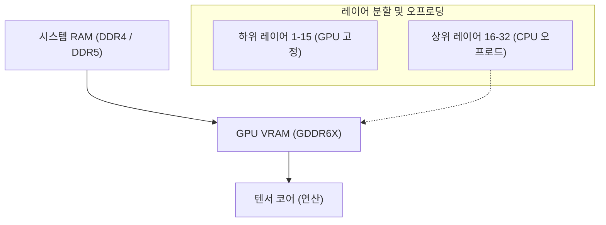
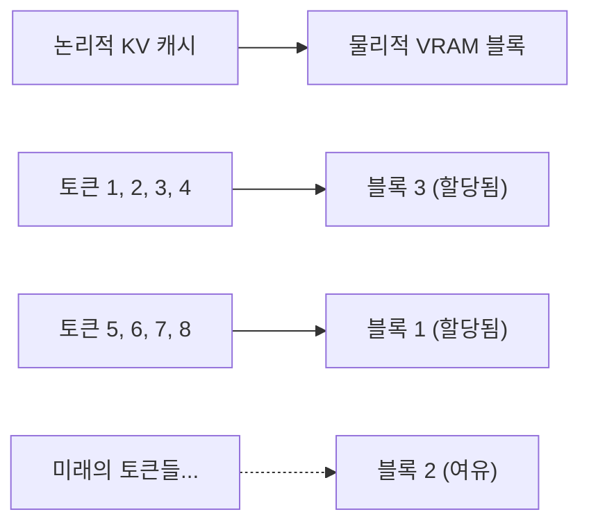
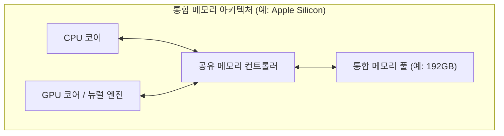
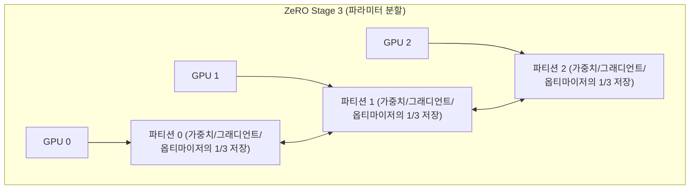

# 서론: AI 개발과 'VRAM의 벽'

최근 대규모 언어 모델(LLM)이나 확산 모델(Diffusion Models) 등 생성형 AI 기술이 급속한 발전을 이루고 있습니다. 하지만 이러한 최첨단 AI 모델을 로컬 환경에서 학습(파인 튜닝)하거나 추론(Inference)을 실행할 때, 많은 개발자와 연구자가 직면하는 것이 **'GPU 메모리(VRAM) 부족'**이라는 극히 물리적인 장벽입니다.

NVIDIA GeForce RTX 4090과 같은 소비자용 하이엔드 GPU라 하더라도 VRAM은 최대 24GB이며, Llama 3 70B와 같은 거대한 모델을 그대로 로드하는 것은 도저히 불가능합니다. 데이터 센터용인 H100(80GB)나 B200(192GB) 등은 매우 고가여서, 개인이나 소규모 팀이 쉽게 다룰 수 있는 것이 아닙니다. 이 'VRAM의 벽(The Wall of VRAM)'을 돌파하지 못하면 최첨단 모델을 만져볼 수조차 없습니다.

본 기사에서는 이 VRAM 제한이라는 물리적인 제약을 소프트웨어 및 하드웨어 아키텍처의 연구를 통해 타파하기 위한 고도의 테크닉을 추론과 학습 양면에서 철저하게 해설합니다. CPU 오프로딩, KV 캐시 최적화, 그래디언트 체크포인트(Gradient Checkpointing), 그리고 최신 통합 메모리(Unified Memory) 아키텍처까지 수식과 도해를 곁들여 깊이 파헤쳐 보겠습니다. 이 기사를 읽으면 VRAM의 동작을 깊이 이해하고, 한정된 리소스로 거대한 모델을 다루기 위한 실천적인 지식을 얻을 수 있습니다.

---

# 1. AI 모델의 VRAM 소비 해부학 (추론·학습)

VRAM 부족을 해소하기 위한 첫걸음은 우선 '무엇이' '얼마만큼의' 메모리를 소비하고 있는지를 미시적인 관점에서 정확하게 파악하는 것입니다. 블랙박스로 취급하는 것이 아니라 수식을 사용하여 정확하게 예측할 수 있다면 적절한 최적화 기법을 선택할 수 있습니다.

## 1.1 모델 파라미터(가중치)의 메모리 계산

AI 모델을 구성하는 파라미터(Weights)가 소비하는 기본적인 메모리 양은 모델의 총 파라미터 수와 이를 표현하기 위한 데이터 타입(Precision: 정밀도)에 의해 결정됩니다.

딥러닝에서 일반적으로 사용되는 데이터 타입과 1 파라미터당 바이트 수($B$)는 다음과 같습니다.
- **FP32 (단정밀도 부동소수점):** 4 bytes (표준적인 학습 시의 정밀도)
- **FP16 / BF16 (반정밀도 부동소수점):** 2 bytes (일반적인 추론 및 혼합 정밀도 학습)
- **INT8 (8비트 정수):** 1 byte (양자화 모델)
- **INT4 (4비트 정수 양자화):** 0.5 bytes (GPTQ, AWQ, GGUF 등의 극단적인 양자화)

모델 전체의 파라미터 수를 $P$라고 할 때, 가중치 자체가 점유하는 베이스 메모리 양 $M_{weights}$는 다음 수식으로 표현됩니다.

$$ M_{weights} = P \times B $$

예를 들어, Meta가 공개한 'Llama 3 8B' 모델(약 80억 파라미터)을 FP16(반정밀도)으로 로드할 경우 다음과 같이 계산됩니다.

$$ M_{weights} = 8,000,000,000 \times 2 \text{ bytes} \approx 16,000,000,000 \text{ bytes} \approx 16 \text{ GB} $$

즉, 순수하게 모델의 가중치를 GPU에 올리기만 해도 16GB의 VRAM을 소비합니다. RTX 3060 (12GB)에서는 이 시점에서 OOM(Out of Memory) 에러가 발생합니다. 하지만 모델을 INT4로 양자화하면 $8 \times 0.5 = 4 \text{ GB}$가 되어 여유롭게 로드할 수 있게 됩니다.

## 1.2 추론 시의 메모리 소비: KV 캐시의 증대

LLM의 추론(특히 자기회귀적인 텍스트 생성)에서 가중치와 같거나 그 이상으로 VRAM을 강하게 압박하는 것이 **KV 캐시(Key-Value Cache)**입니다.
Transformer 아키텍처에서는 과거에 생성·처리한 토큰의 정보를 재계산하는 것을 방지하기 위해, 각 어텐션 층에서의 Key와 Value 텐서를 VRAM에 계속 캐시합니다. 이로 인해 계산 속도(Compute)는 향상되지만, 컨텍스트 길이(입력 프롬프트 길이 + 생성 길이)가 길어짐에 따라 메모리 소비량이 선형적으로 폭발적으로 증가합니다.

1 토큰을 처리할 때 소비되는 KV 캐시의 메모리 양 $M_{kv\_token}$은 모델의 아키텍처를 기반으로 다음 수식으로 엄밀하게 계산됩니다.

$$ M_{kv\_token} = 2 \times N_{layers} \times N_{heads\_kv} \times D_{head} \times B $$

여기서 각 변수는 다음의 의미를 갖습니다:
- $2$ : Key와 Value라는 2개의 텐서가 존재하기 때문
- $N_{layers}$ : Transformer의 레이어(층) 수
- $N_{heads\_kv}$ : KV 어텐션 헤드 수 (GQA: Grouped Query Attention의 경우 일반 헤드 수보다 적어집니다)
- $D_{head}$ : 각 헤드의 차원 수 (통상적으로 은닉층의 차원 수 $D_{model} / N_{heads}$)
- $B$ : 데이터 타입의 바이트 수 (FP16이라면 2)

전체 KV 캐시 양 $M_{kv\_total}$은 여기에 시퀀스 길이($L_{seq}$)와 배치 사이즈($BatchSize$)를 곱한 것이 됩니다.

$$ M_{kv\_total} = M_{kv\_token} \times L_{seq} \times BatchSize $$

**구체적인 예: Llama 2 7B의 경우**
- $N_{layers} = 32$
- $N_{heads\_kv} = 32$ (MHA의 경우)
- $D_{head} = 128$
- FP16 ($B=2$)
- 배치 사이즈 1, 시퀀스 길이 8192 (8K 컨텍스트)

$$ M_{kv\_total} = 2 \times 32 \times 32 \times 128 \times 2 \times 8192 \times 1 = 4,294,967,296 \text{ bytes} \approx 4 \text{ GB} $$

만약 컨텍스트를 32K(32768 토큰)로 늘릴 경우, KV 캐시만으로 약 16GB를 소비합니다. 배치 사이즈를 4로 늘리면 64GB입니다. 모델 자체의 크기보다 훨씬 거대한 VRAM을 요구하게 되는 것이 추론 시의 큰 과제입니다.

## 1.3 학습 시의 메모리 소비: 옵티마이저와 그래디언트, 그리고 액티베이션

추론 시와 비교하여 모델의 학습(사전 학습이나 파인 튜닝)에서는 훨씬 더 많은 VRAM을 소비합니다. 그것은 단순한 포워드 패스(순전파)뿐만 아니라 백프로파게이션(역전파)을 위한 정보를 유지해야 하기 때문입니다. 학습 시의 메모리는 주로 다음 4가지 요소로 구성됩니다.

1. **모델의 가중치 (Model Weights):** 추론 시와 동일하지만, 혼합 정밀도 학습에서는 FP16과 FP32(마스터 가중치) 양쪽을 모두 유지하는 경우가 있습니다.
2. **그래디언트 (Gradients):** 역전파에서 계산되는 파라미터별 기울기(Gradient). FP16의 경우 파라미터당 2바이트.
3. **옵티마이저 상태 (Optimizer States):** AdamW 등의 고기능 옵티마이저는 각 파라미터에 대해 1차 모멘트(Momentum)와 2차 모멘트(Variance)를 유지합니다. 학습의 안정성을 유지하기 위해 이것들은 통상 FP32(4바이트)로 유지됩니다. 즉, 2개의 모멘트로 $4 + 4 = 8$ 바이트/파라미터를 소비합니다.
4. **액티베이션 (Activations):** 역전파의 그래디언트 계산을 위해 순전파 시의 각 층의 출력(중간 상태)을 메모리에 유지해 두어야 합니다. 이는 배치 사이즈나 시퀀스 길이에 강하게 의존하며 매우 거대해집니다.

요약하자면, 표준적인 Adam 옵티마이저를 사용한 혼합 정밀도 학습(Mixed Precision Training)에서는 1 파라미터당 **약 16〜20바이트**(마스터 가중치 4 + FP16 가중치 2 + 그래디언트 2 + 옵티마이저 8 + α)의 메모리가 필요하게 됩니다.

$$ M_{train\_param} \approx P \times 16 \text{ bytes} $$

7B(70억 파라미터) 모델의 학습에는 파라미터 관련만으로 $7B \times 16 = 112 \text{ GB}$, 거기에 액티베이션이 더해져 무려 140GB 이상의 VRAM이 필요한 계산이 됩니다. 이를 24GB의 VRAM에서 실행하려면 다음 장 이후에서 해설하는 강력한 최적화 기술이 필수적입니다.

---

# 2. 추론 시의 VRAM 절약 테크닉

추론 시에 거대한 모델을 구동하기 위한 접근법으로서, 하드웨어의 경계를 넘나드는 소프트웨어 기술이 다수 개발되어 있습니다.

## 2.1 CPU 오프로딩(CPU Offloading)과 레이어 분할

거대한 모델이 단일 또는 복수의 GPU에 다 들어가지 않을 경우, 모델의 일부를 시스템 메모리(CPU RAM)에 배치하고 필요할 때만 GPU로 전송하면서 계산을 진행하는 기법이 **CPU 오프로딩**입니다. `llama.cpp`나 Hugging Face의 `Accelerate` 등이 이 기능을 지원하고 있습니다.



**메커니즘과 과제:**
Transformer 모델은 층(레이어)이 직렬로 쌓인 구조를 하고 있기 때문에, 특정 층의 계산이 끝날 때까지 다음 층의 계산은 시작되지 않습니다. 이를 이용하여 GPU에 들어가는 층(예: 1층〜15층)만을 VRAM에 상주(고정)시키고, 나머지 층(16층〜32층)은 용량이 크지만 속도가 느린 CPU RAM에 둡니다. 추론 중, 15층까지의 계산이 끝나면 16층의 가중치를 CPU에서 GPU로 PCIe 버스를 통해 전송(복사)하고 GPU 상에서 계산을 실행합니다.

단, **PCIe의 대역폭(Bandwidth)이 강력한 병목**이 됩니다. PCIe 4.0 x16의 이론상 최대 대역폭은 32GB/s(단방향)이지만, 최신 GPU의 VRAM 내부 대역폭(예를 들어 RTX 4090의 GDDR6X는 1008GB/s, H100의 HBM3는 3TB/s 이상)과 비교하면 두 자릿수나 느리기 때문에 CPU 오프로딩을 다용하면 추론 속도(Tokens per Second)는 극적으로 저하됩니다.
속도 저하를 최소한으로 억제하기 위해서는 가능한 한 많은 층을 GPU에 올리고(GPU Layers의 최대화), 오프로드하는 층을 최소화하는 것이 실용상의 포인트입니다.

## 2.2 KV 캐시의 양자화와 PagedAttention

추론 시의 VRAM 소비의 원흉인 KV 캐시에 대해서도 두 가지 강력한 최적화가 이루어지고 있습니다.

**1. KV 캐시 양자화 (KV Cache Quantization):**
모델의 가중치뿐만 아니라, 실행 시에 동적으로 생성되는 KV 캐시 자체를 INT8이나 INT4, 혹은 FP8로 양자화하여 VRAM에 저장하는 기법입니다. 이를 통해 KV 캐시의 크기를 절반에서 4분의 1로 줄일 수 있습니다. 최신 추론 엔진(vLLM이나 llama.cpp)에서는 이 기능이 내장되어 있어, 정밀도 저하를 최소화하면서 대폭적인 VRAM 절약을 실현하고 있습니다.

**2. PagedAttention:**
OS 가상 메모리의 '페이징' 개념을 KV 캐시에 적용한 것이 vLLM이라는 추론 엔진에서 도입된 **PagedAttention**입니다. 기존의 추론 엔진에서는 설정된 최대 시퀀스 길이에 맞춰 미리 연속된 VRAM 영역을 확보(Pre-allocation)하고 있었습니다. 이로 인해 실제 입력이 짧은 경우에는 단편화(Fragmentation)나 미사용 메모리의 낭비가 발생하여, VRAM의 60% 이상이 낭비되는 일도 있었습니다.

PagedAttention은 KV 캐시를 고정된 크기의 블록(페이지)으로 분할하고, 비연속적인 물리 메모리 공간에 분산하여 저장하는 것을 가능하게 합니다. 이를 통해 메모리의 낭비를 거의 제로(내부 단편화만으로 제한)로 만들고, 동일한 VRAM 용량에서도 배치 사이즈를 대폭 끌어올릴 수 있습니다.



## 2.3 FlashAttention: 어텐션 계산의 메모리 복잡성 타파

VRAM 부족은 데이터를 저장하는 메모리 양뿐만 아니라, 계산 중의 '임시 워크스페이스'의 부족에 의해서도 발생합니다. 표준적인 Transformer의 Self-Attention 메커니즘은 시퀀스 길이 $N$에 대해 $N \times N$의 거대한 어텐션 행렬을 VRAM 상에 구체화(Materialize)해야 합니다. 이는 메모리 계산량이 $O(N^2)$가 되어, 긴 컨텍스트에서는 OOM의 주요 원인이 됩니다.

이를 해결한 것이 **FlashAttention**(및 FlashAttention-2, 3)입니다.
FlashAttention은 GPU의 하드웨어 아키텍처(거대하지만 느린 HBM과, 극소하지만 초고속인 SRAM의 계층 구조)를 의식한 알고리즘입니다. 타일링(Tiling)이라고 불리는 기법을 사용하여 블록 단위로 데이터를 SRAM에 로드하여 어텐션 계산을 완결시킴으로써, $N \times N$의 행렬을 HBM(VRAM)에 쓰는 처리를 완전히 회피합니다.

이를 통해 어텐션 층의 메모리 복잡성은 $O(N^2)$에서 $O(N)$(시퀀스 길이에 비례)으로 극적으로 저하되었고, 컨텍스트 길이의 제한이 대폭 완화되었습니다.

## 2.4 통합 메모리(Unified Memory)의 대두와 Apple Silicon

PC 아키텍처의 근본부터 이 문제에 접근하고 있는 것이, Apple Silicon(M1/M2/M3/M4 시리즈의 Max나 Ultra)이나 일부 최신 APU(AMD Strix Point 등)가 채택하고 있는 **통합 메모리 아키텍처(Unified Memory Architecture: UMA)**입니다.

이러한 아키텍처에서는 마더보드 상의 CPU와 GPU가 완전히 같은 물리 메모리(예를 들어 최대 192GB의 LPDDR5)를 공유합니다. 그렇기 때문에 'CPU에서 GPU로의 PCIe를 경유하는 느린 데이터 전송'이라는 개념 자체가 물리적으로 존재하지 않습니다.



이 아키텍처의 가장 큰 이점은 VRAM이라는 명확한 벽이 없고, 시스템 메모리의 거의 전역을 거대한 LLM 로드에 그대로 사용할 수 있다는 점입니다. 192GB의 유니파이드 메모리를 가진 Mac Studio라면, 70B 클래스나 그 이상의 거대한 모델(예를 들어 Grok-1 등)을 양자화 없이 단일 디바이스에 로드하여 고속으로 추론하는 것이 가능합니다. 메모리 액세스 대역폭도 M2 Ultra에서 800GB/s에 달하여, 소비자용 외장 GPU에 필적하는 속도를 자랑합니다. '메모리 용량'과 '대역폭'의 딜레마를 하드웨어 수준에서 해결하는 매우 강력한 접근법입니다.

---

# 3. 학습(파인 튜닝) 시의 VRAM 절약 테크닉

추론 이상의 VRAM을 요구하는 학습(Training) 시에도 많은 혁신이 일어나고 있습니다. 한정된 리소스로 파인 튜닝을 수행하기 위해서는 다음의 기술들을 조합하는 것이 필수적입니다.

## 3.1 그래디언트 체크포인트(Gradient Checkpointing)

딥러닝의 백프로파게이션(역전파)에서는 그래디언트를 계산하기 위해 포워드 패스(순전파)에서의 전체 레이어의 중간 출력(Activations)을 메모리에 유지해 두어야 합니다. 시퀀스 길이나 배치 사이즈가 커지면 이 액티베이션 메모리가 VRAM을 지배하기 시작합니다.

**그래디언트 체크포인트(Gradient Checkpointing / Activation Recomputation)**는 메모리 용량과 계산 시간(Compute)의 트레이드오프를 이용한 천재적인 테크닉입니다.
모든 중간 출력을 메모리에 저장하는 것이 아니라, 특정 레이어(체크포인트)의 출력만을 저장해 둡니다. 백프로파게이션 시에 체크포인트 되지 않은 중간 값이 필요해지면, **저장해 둔 가장 가까운 체크포인트로부터 다시 포워드 패스를 계산(재계산)하여 값을 복원**합니다.

계산량은 약 20〜30% 증가하고 학습의 총 시간은 길어지지만, 액티베이션에 의한 VRAM 소비량을 $O(N)$($N$은 레이어 수)에서 $O(\sqrt{N})$으로 극적으로 줄일 수 있습니다. 현재 대규모 모델의 학습에서는 이것이 없으면 시작조차 할 수 없다고 할 정도로 필수적인 설정 항목입니다.

## 3.2 LoRA 와 QLoRA (Low-Rank Adaptation)

VRAM 부족을 근본부터 해결한 주역이 바로 PEFT(Parameter-Efficient Fine-Tuning)의 대표격인 **LoRA**입니다.

모델의 원래 거대한 가중치 행렬 $W_0 \in \mathbb{R}^{d \times k}$를 동결(Frozen)하여 학습시키지 않습니다. 대신, 2개의 매우 작은 저랭크 행렬 $A \in \mathbb{R}^{r \times k}$와 $B \in \mathbb{R}^{d \times r}$을 병렬로 도입하고, 이 $A$와 $B$만을 학습시킵니다. (여기서 랭크 $r$은 $r \ll d, k$가 되는 작은 값입니다).

$$ W_{adapted} = W_0 + \Delta W = W_0 + B A $$

이로 인해 학습 대상 파라미터 수가 원래의 1% 미만(때로는 0.1% 미만)이 되며, 이에 따라 메모리를 대량으로 소비하던 '그래디언트'나 '옵티마이저 상태'도 1% 미만으로 급감합니다.

더 나아가 이를 극한까지 진화시킨 것이 **QLoRA (Quantized LoRA)**입니다.
QLoRA에서는 베이스 모델의 가중치 $W_0$를 4비트(NF4: NormalFloat4 형식)로 극한까지 양자화하여 VRAM에 로드합니다. 그리고 LoRA의 작은 행렬 $A, B$는 계산 정밀도를 유지하기 위해 BF16(16비트)으로 학습시킵니다.
4비트 양자화로 베이스 모델의 VRAM 크기를 원래의 4분의 1로 줄이면서, **Paged Optimizers**(페이지드 옵티마이저)라는 기술을 사용하여 VRAM이 고갈될 것 같을 때 옵티마이저의 상태를 일시적으로 CPU RAM으로 자동 대피(오프로드)시킵니다. 이를 통해 24GB VRAM(RTX 4090 등)의 단일 GPU에서도 Llama 3 70B와 같은 초대형 모델의 파인 튜닝이 가능해졌습니다.

## 3.3 DeepSpeed ZeRO 와 오프로딩

여러 GPU(멀티 GPU)를 사용하는 환경에서 단순한 데이터 병렬화(Data Parallelism)만으로는 VRAM 문제가 해결되지 않습니다. 각 GPU가 모델 전체의 복사본을 유지하기 때문에 개별 VRAM 용량의 한계를 넘을 수 없기 때문입니다.

Microsoft가 개발한 **DeepSpeed** 라이브러리의 **ZeRO (Zero Redundancy Optimizer)**는 모델의 파라미터, 그래디언트, 옵티마이저 상태를 여러 GPU 간에 철저하게 분할(샤드)하는 기술입니다. 이를 통해 여러 GPU의 VRAM의 '합계치'를 하나의 거대한 메모리 풀처럼 다룰 수 있습니다.



- **ZeRO Stage 1:** 옵티마이저 상태를 각 GPU로 분할
- **ZeRO Stage 2:** 그래디언트도 각 GPU로 분할
- **ZeRO Stage 3:** 모델의 파라미터(가중치) 자체도 각 GPU로 분할

더 나아가, **ZeRO-Offload**라는 기능을 사용하면 ZeRO로 분할한 옵티마이저 상태나 그래디언트의 업데이트 계산을 GPU가 아닌 **CPU 메모리로 오프로드**하여 호스트 CPU에서 실행시킬 수 있습니다. 이를 통해 GPU VRAM의 부담을 극한까지 줄이고, 제한된 GPU 환경에서도 거대한 모델의 학습이 가능해집니다. 계산을 CPU에서 수행하고 결과를 PCIe를 경유해 GPU로 돌려보내기 때문에 학습 속도는 저하되지만, '메모리 부족으로 학습이 크래시되는' 최악의 사태를 피할 수 있습니다.

---

# 4. 구현 예시: Hugging Face Accelerate 와 DeepSpeed

마지막으로, 실제 Python 코드에서 CPU 오프로딩이나 VRAM 최적화를 어떻게 구현하는지 간단한 예를 보여드리겠습니다.

## 4.1 Hugging Face `device_map="auto"` 에 의한 자동 오프로드

Hugging Face의 `transformers`와 `accelerate` 라이브러리를 사용하면, 모델을 로드할 때 GPU와 CPU 간에 자동으로 레이어를 분할해 줍니다.

```python
from transformers import AutoModelForCausalLM, AutoTokenizer

model_id = "meta-llama/Llama-2-13b-hf"

# device_map="auto" 에 의해 VRAM에 다 들어가지 않는 부분은 CPU RAM으로 오프로드됨
# load_in_8bit=True 로 가중치를 8비트 양자화하여, 추가적인 메모리 절약
model = AutoModelForCausalLM.from_pretrained(
    model_id,
    device_map="auto",
    load_in_8bit=True,
    offload_folder="offload_dir" # 부족할 경우 디스크(SSD)로까지 오프로드 가능
)
```

이 코드를 실행하면 배후의 `accelerate` 라이브러리가 시스템의 VRAM과 CPU RAM의 여유 용량을 분석하고, 최적의 형태로 레이어를 배치(Dispatch)해 줍니다.

## 4.2 DeepSpeed의 CPU 오프로드 설정 (ZeRO-2)

학습 시에 DeepSpeed로 CPU 오프로드를 활성화하기 위한 설정 파일(JSON)의 예입니다.

```json
{
  "fp16": {
    "enabled": true
  },
  "zero_optimization": {
    "stage": 2,
    "offload_optimizer": {
      "device": "cpu",
      "pin_memory": true
    },
    "allgather_partitions": true,
    "allgather_bucket_size": 2e8,
    "overlap_comm": true,
    "reduce_scatter": true,
    "reduce_bucket_size": 2e8,
    "contiguous_gradients": true
  },
  "train_batch_size": 16,
  "gradient_accumulation_steps": 4
}
```
이 설정에서는 `offload_optimizer`를 `"cpu"`로 지정함으로써, VRAM을 대량으로 소비하는 옵티마이저(Adam 등)의 상태 유지와 업데이트 계산을 시스템 측의 CPU에서 실행시킵니다. GPU의 VRAM을 모델의 포워드/백워드 계산이라는 가장 중요한 작업에 전념시킬 수 있습니다. `pin_memory: true`를 설정함으로써 페이지 폴트를 방지하고, CPU-GPU 간의 PCIe 전송을 가능한 한 고속화하고 있습니다.

---

# 결론

AI 개발에서의 GPU 메모리 부족(Out of Memory)은 모델의 대규모화에 따라 앞으로도 개발자를 따라다닐 영원한 과제입니다. 하지만 본 기사에서 해설한 것과 같은 하드웨어(아키텍처)의 깊은 이해와 소프트웨어·알고리즘 측면에서의 최적화 테크닉을 적절히 조합함으로써, 겉보기에는 불가능해 보이는 로컬 환경에서의 거대한 모델의 추론 및 학습이 가능해집니다.

**추론 시의 대책 요약:**
1. **양자화 (INT4 / INT8 / FP8):** 모델 자체의 크기를 극적으로 압축하고, VRAM 점유량을 줄인다.
2. **CPU 오프로딩:** VRAM에 다 들어가지 않는 레이어를 시스템 메모리로 보낸다 (PCIe 대역에 의한 속도 저하와의 트레이드오프).
3. **KV 캐시 최적화:** 페이징(PagedAttention)이나 캐시의 양자화, FlashAttention을 사용하여 문맥 길이(Context Length)를 확보한다.
4. **통합 메모리 활용:** Apple Silicon 등의 UMA를 활용하여 대용량 메모리를 직접 추론에 사용한다.

**학습 시의 대책 요약:**
1. **PEFT (LoRA / QLoRA):** 학습 대상의 파라미터를 제한하고, 베이스 모델을 극한까지 양자화한다.
2. **그래디언트 체크포인트 (Gradient Checkpointing):** 순전파의 중간 출력을 파기하고, 역전파 시에 재계산함으로써 VRAM 소비를 계산 시간과 맞바꾸어 억제한다.
3. **ZeRO & CPU 오프로드 (DeepSpeed):** 옵티마이저 상태나 그래디언트를 여러 GPU로 분할하거나 CPU 메모리에 오프로드하여 VRAM 한계를 돌파한다.

이러한 고도화된 기술들을 구사하여, 한정된 하드웨어 리소스 안에서 최대한의 AI 개발 퍼포먼스를 끌어내 보시기 바랍니다. 일취월장하는 이 분야에서는 앞으로도 새로운 메모리 절약 알고리즘이 등장할 것이 기대됩니다. 최신 라이브러리의 동향을 정기적으로 확인하고 구현에 도입해 나가는 것이 핵심이 될 것입니다.
