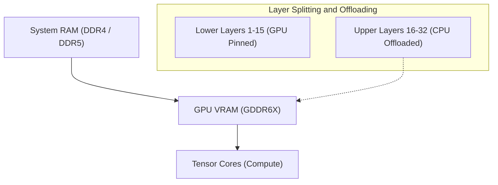
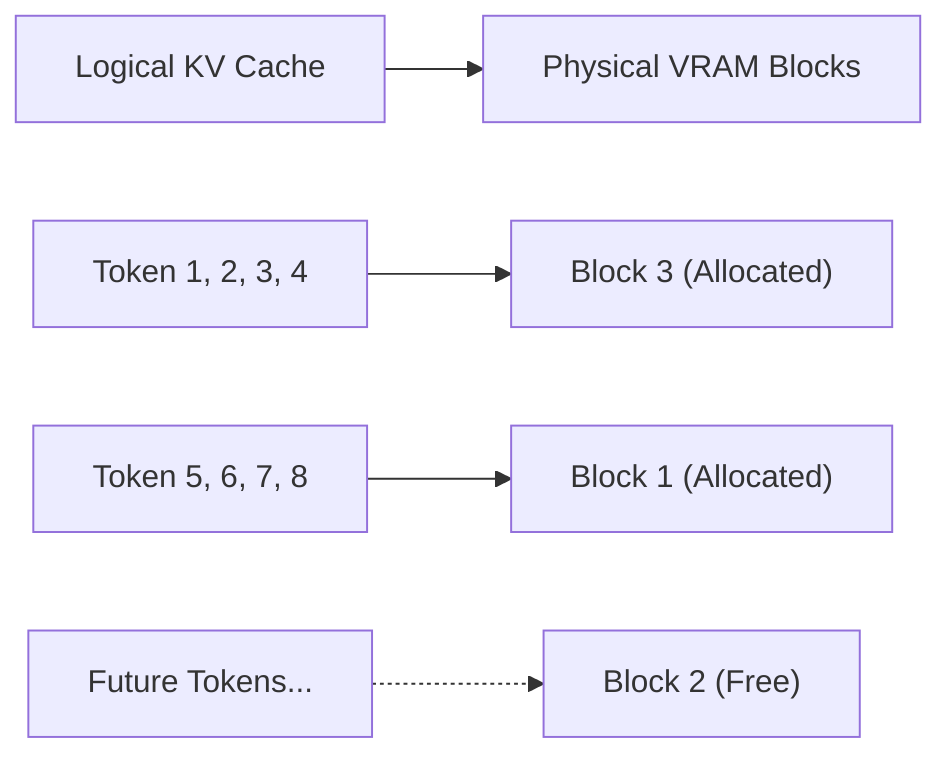
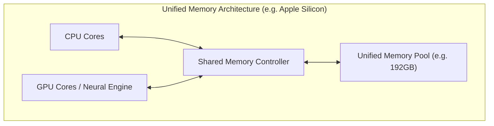
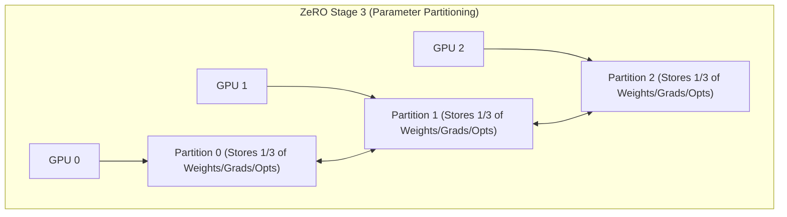

# はじめに：AI開発と「VRAMの壁」

近年、大規模言語モデル（LLM）や拡散モデル（Diffusion Models）などの生成AI技術が急速な発展を遂げています。しかし、これらの最先端のAIモデルをローカル環境で学習（ファインチューニング）したり、推論（Inference）を実行したりする際、多くの開発者や研究者が直面するのが**「GPUメモリ（VRAM）不足」**という極めて物理的な障壁です。

NVIDIA GeForce RTX 4090などのコンシューマー向けハイエンドGPUであってもVRAMは最大24GBであり、Llama 3 70Bのような巨大なモデルをそのままロードすることは到底不可能です。データセンター向けのH100（80GB）やB200（192GB）などは非常に高価であり、個人や小規模なチームが手軽に扱えるものではありません。この「VRAMの壁（The Wall of VRAM）」を突破できなければ、最先端のモデルに触れることすらできません。

本記事では、このVRAM制限という物理的な制約をソフトウェアおよびハードウェアのアーキテクチャの工夫によって打破するための、高度なテクニックを推論と学習の両面から徹底的に解説します。CPUオフロード、KVキャッシュの最適化、勾配チェックポイント（Gradient Checkpointing）、そして最新の統合メモリ（Unified Memory）アーキテクチャまで、数式や図解を交えながら深掘りしていきましょう。この記事を読めば、VRAMの挙動を深く理解し、限られたリソースで巨大なモデルを扱うための実践的な知識が身につきます。

---

# 1. AIモデルのVRAM消費の解剖学（推論・学習）

VRAM不足を解消するための第一歩は、まず「何が」「どれだけの」メモリを消費しているのかをミクロの視点から正確に把握することです。ブラックボックスとして扱うのではなく、数式を用いて正確に見積もることができれば、適切な最適化手法を選択できます。

## 1.1 モデルパラメータ（重み）のメモリ計算

AIモデルを構成するパラメータ（Weights）が消費する基本的なメモリ量は、モデルの総パラメータ数と、それを表現するためのデータ型（Precision: 精度）によって決定されます。

ディープラーニングで一般的に使用されるデータ型と、1パラメータあたりのバイト数（$B$）は以下の通りです。
- **FP32 (単精度浮動小数点数):** 4 bytes (標準的な学習時の精度)
- **FP16 / BF16 (半精度浮動小数点数):** 2 bytes (一般的な推論および混合精度学習)
- **INT8 (8ビット整数):** 1 byte (量子化モデル)
- **INT4 (4ビット整数量子化):** 0.5 bytes (GPTQ, AWQ, GGUFなどの極度な量子化)

モデル全体のパラメータ数を $P$ とすると、重みそのものが占有するベースのメモリ量 $M_{weights}$ は以下の数式で表されます。

$$ M_{weights} = P \times B $$

例えば、Metaが公開している「Llama 3 8B」モデル（約80億パラメータ）をFP16（半精度）でロードする場合、以下のような計算になります。

$$ M_{weights} = 8,000,000,000 \times 2 \text{ bytes} \approx 16,000,000,000 \text{ bytes} \approx 16 \text{ GB} $$

つまり、純粋にモデルの重みをGPUに載せるだけで16GBのVRAMを消費します。RTX 3060 (12GB) ではこの時点でOut of Memory (OOM) エラーが発生します。しかし、モデルをINT4に量子化すれば $8 \times 0.5 = 4 \text{ GB}$ となり、余裕でロード可能になります。

## 1.2 推論時のメモリ消費：KVキャッシュの増大

LLMの推論（特に自己回帰的なテキスト生成）において、重みと同じかそれ以上にVRAMを激しく圧迫するのが**KVキャッシュ（Key-Value Cache）**です。
Transformerアーキテクチャでは、過去に生成・処理したトークンの情報を再計算するのを防ぐため、各アテンション層でのKeyとValueのテンソルをVRAMにキャッシュし続けます。これにより計算速度（Compute）は向上しますが、コンテキスト長（入力プロンプト長＋生成長）が長くなるにつれて、メモリ消費量が線形に爆発的に増加します。

1トークンを処理する際に消費されるKVキャッシュのメモリ量 $M_{kv\_token}$ は、モデルのアーキテクチャに基づいて以下の数式で厳密に計算されます。

$$ M_{kv\_token} = 2 \times N_{layers} \times N_{heads\_kv} \times D_{head} \times B $$

ここで各変数は以下の意味を持ちます：
- $2$ : KeyとValueの2つのテンソルが存在するため
- $N_{layers}$ : Transformerのレイヤー（層）数
- $N_{heads\_kv}$ : KVアテンションヘッド数（GQA: Grouped Query Attentionの場合は通常のヘッド数より少なくなります）
- $D_{head}$ : 各ヘッドの次元数（通常、隠れ層の次元数 $D_{model} / N_{heads}$）
- $B$ : データ型のバイト数（FP16なら2）

全体のKVキャッシュ量 $M_{kv\_total}$ は、これにシーケンス長（$L_{seq}$）とバッチサイズ（$BatchSize$）を掛けたものになります。

$$ M_{kv\_total} = M_{kv\_token} \times L_{seq} \times BatchSize $$

**具体例：Llama 2 7Bの場合**
- $N_{layers} = 32$
- $N_{heads\_kv} = 32$ (MHAの場合)
- $D_{head} = 128$
- FP16 ($B=2$)
- バッチサイズ1、シーケンス長 8192 (8Kコンテキスト)

$$ M_{kv\_total} = 2 \times 32 \times 32 \times 128 \times 2 \times 8192 \times 1 = 4,294,967,296 \text{ bytes} \approx 4 \text{ GB} $$

もしコンテキストを32K（32768トークン）に伸ばした場合、KVキャッシュだけで約16GBを消費します。バッチサイズを4に増やせば64GBです。モデル自体のサイズよりも遥かに巨大なVRAMを要求するようになるのが推論時の大きな課題です。

## 1.3 学習時のメモリ消費：オプティマイザと勾配とアクティベーション

推論時と比較して、モデルの学習（事前学習やファインチューニング）では遥かに多くのVRAMを消費します。それは、単純なフォワードパス（順伝播）だけではなく、バックプロパゲーション（逆伝播）のための情報を保持する必要があるためです。学習時のメモリは主に以下の4要素で構成されます。

1. **モデルの重み (Model Weights):** 推論時と同様ですが、混合精度学習ではFP16とFP32（マスターウェイト）の両方を保持することがあります。
2. **勾配 (Gradients):** 逆伝播で計算されるパラメータごとの勾配。FP16の場合はパラメータあたり2バイト。
3. **オプティマイザ状態 (Optimizer States):** AdamWなどの高機能なオプティマイザは、各パラメータに対して一次モーメント（Momentum）と二次モーメント（Variance）を保持します。学習の安定性を保つため、これらは通常FP32（4バイト）で保持されます。つまり、2つのモーメントで $4 + 4 = 8$ バイト/パラメータを消費します。
4. **アクティベーション (Activations):** 逆伝播の勾配計算のために、順伝播時の各層の出力（中間状態）をメモリに保持しておく必要があります。これはバッチサイズやシーケンス長に強く依存し、非常に巨大になります。

まとめると、標準的なAdamオプティマイザを使用した混合精度学習（Mixed Precision Training）では、1パラメータあたり**約16〜20バイト**（マスター重み4 + FP16重み2 + 勾配2 + オプティマイザ8 + α）のメモリが必要になります。

$$ M_{train\_param} \approx P \times 16 \text{ bytes} $$

7B（70億パラメータ）モデルの学習には、パラメータ関連だけで $7B \times 16 = 112 \text{ GB}$、それにアクティベーションが加わり、なんと140GB以上のVRAMが必要になる計算です。これを24GBのVRAMで実行するには、次章以降で解説する強烈な最適化技術が不可欠です。

---

# 2. 推論時におけるVRAM節約テクニック

推論時に巨大モデルを動かすためのアプローチとして、ハードウェアの境界を越えるソフトウェア技術が多数開発されています。

## 2.1 CPUオフロード（CPU Offloading）とレイヤー分割

巨大なモデルが単一または複数のGPUに収まりきらない場合、モデルの一部をシステムメモリ（CPU RAM）に配置し、必要な時だけGPUに転送しながら計算を進める手法が**CPUオフロード**です。`llama.cpp`やHugging Faceの`Accelerate`などがこの機能をサポートしています。



**メカニズムと課題:**
Transformerモデルは層（レイヤー）が直列に積み重なった構造をしているため、ある層の計算が終わるまで次の層の計算は始まりません。これを利用し、GPUに収まる層（例：1層〜15層）だけをVRAMに常駐（ピン留め）させ、残りの層（16層〜32層）は大容量だが低速なCPU RAMに置いておきます。推論中、15層までの計算が終わると、16層目の重みをCPUからGPUへPCIeバス経由で転送（コピー）し、GPU上で計算を実行します。

ただし、**PCIeの帯域幅（Bandwidth）が強烈なボトルネック**となります。PCIe 4.0 x16の理論上の最大帯域幅は32GB/s（片方向）ですが、最新GPUのVRAM内部帯域幅（例えばRTX 4090のGDDR6Xは1008GB/s、H100のHBM3は3TB/s以上）と比較すると2桁も遅いため、CPUオフロードを多用すると推論速度（Tokens per Second）は劇的に低下します。
速度低下を最小限に抑えるためには、可能な限り多くの層をGPUに載せ（GPU Layersの最大化）、オフロードする層を最小限にすることが実用上のポイントです。

## 2.2 KVキャッシュの量子化とPagedAttention

推論時のVRAM消費の元凶であるKVキャッシュに対しても、二つの強力な最適化が行われています。

**1. KVキャッシュ量子化（KV Cache Quantization）:**
モデルの重みだけでなく、実行時に動的に生成されるKVキャッシュ自体をINT8やINT4、あるいはFP8に量子化してVRAMに保存する手法です。これにより、KVキャッシュのサイズを半分から4分の一に削減できます。最新の推論エンジン（vLLMやllama.cpp）ではこの機能が組み込まれており、精度劣化を最小限に抑えつつ大幅なVRAM節約を実現しています。

**2. PagedAttention:**
OSの仮想メモリの「ページング」の概念をKVキャッシュに適用したのが、vLLMという推論エンジンで導入された**PagedAttention**です。従来の推論エンジンでは、設定された最大シーケンス長に合わせて、あらかじめ連続したVRAM領域を確保（Pre-allocation）していました。このため、実際の入力が短い場合にはフラグメンテーション（断片化）や未使用メモリの無駄が生じ、VRAMの60%以上が浪費されることもありました。

PagedAttentionはKVキャッシュを固定サイズのブロック（ページ）に分割し、非連続な物理メモリ空間に分散して格納することを可能にします。これにより、メモリの無駄をほぼゼロ（内部フラグメンテーションのみに制限）にし、同じVRAM容量でもバッチサイズを大幅に引き上げることができます。



## 2.3 FlashAttention：アテンション計算のメモリ複雑性を打破

VRAM不足は、データを保存するメモリ量だけでなく、計算中の「一時的なワークスペース」の不足によっても引き起こされます。標準的なTransformerのSelf-Attentionメカニズムは、シーケンス長 $N$ に対して $N \times N$ の巨大なアテンション行列をVRAM上に実体化（Materialize）する必要があります。これはメモリ計算量が $O(N^2)$ となり、長いコンテキストではOOMの主要因となります。

これを解決したのが**FlashAttention**（およびFlashAttention-2, 3）です。
FlashAttentionは、GPUのハードウェアアーキテクチャ（巨大だが遅いHBMと、極小だが超高速なSRAMの階層構造）を意識したアルゴリズムです。タイル化（Tiling）と呼ばれる手法を用い、ブロックごとにデータをSRAMにロードしてアテンション計算を完結させることで、$N \times N$ の行列をHBM（VRAM）に書き出す処理を完全に回避します。

これにより、アテンション層のメモリ複雑性は $O(N^2)$ から $O(N)$（シーケンス長に比例）へと劇的に低下し、コンテキスト長の制限が大幅に緩和されました。

## 2.4 統合メモリ（Unified Memory）の台頭とApple Silicon

PCアーキテクチャの根本からこの問題にアプローチしているのが、Apple Silicon（M1/M2/M3/M4シリーズのMaxやUltra）や、一部の最新APU（AMD Strix Pointなど）が採用している**統合メモリアーキテクチャ（Unified Memory Architecture: UMA）**です。

これらのアーキテクチャでは、マザーボード上のCPUとGPUが全く同じ物理メモリ（例えば最大192GBのLPDDR5）を共有します。そのため、「CPUからGPUへのPCIe経由の遅いデータ転送」という概念自体が物理的に存在しません。



このアーキテクチャの最大の利点は、VRAMという明確な壁がなく、システムメモリのほぼ全域を巨大なLLMのロードにそのまま使用できる点です。192GBのユニファイドメモリを持つMac Studioであれば、70Bクラスやそれ以上の巨大モデル（例えばGrok-1など）を量子化なしで単体デバイスにロードし、高速に推論することが可能です。メモリアクセス帯域幅もM2 Ultraで800GB/sに達し、コンシューマー向けディスクリートGPUに匹敵する速度を誇ります。「メモリ容量」と「帯域幅」のジレンマをハードウェアレベルで解決する非常に強力なアプローチです。

---

# 3. 学習（ファインチューニング）時のVRAM節約テクニック

推論以上のVRAMを要求する学習（Training）時にも、多くのブレイクスルーが生まれています。限られたリソースでファインチューニングを行うためには、以下の技術を組み合わせることが不可欠です。

## 3.1 勾配チェックポイント（Gradient Checkpointing）

ディープラーニングのバックプロパゲーション（逆伝播）では、勾配を計算するためにフォワードパス（順伝播）での全レイヤーの中間出力（Activations）をメモリに保持しておく必要があります。シーケンス長やバッチサイズが大きくなると、このアクティベーションメモリがVRAMを支配し始めます。

**勾配チェックポイント（Gradient Checkpointing / Activation Recomputation）**は、メモリ容量と計算時間（Compute）のトレードオフを利用した天才的なテクニックです。
全ての中間出力をメモリに保存するのではなく、特定のレイヤー（チェックポイント）の出力だけを保存しておきます。バックプロパゲーション時にチェックポイントされていない中間の値が必要になったら、**保存しておいた最寄りのチェックポイントから再度フォワードパスを計算（再計算）して値を復元**します。

計算量は約20〜30%増加し、学習のトータル時間は長くなりますが、アクティベーションによるVRAM消費量を $O(N)$（$N$はレイヤー数）から $O(\sqrt{N})$ にまで劇的に削減できます。現在の大規模モデルの学習では、これが無ければ始まらないと言えるほど必須の設定項目です。

## 3.2 LoRA と QLoRA (Low-Rank Adaptation)

VRAM不足を根本から解決した立役者が、PEFT（Parameter-Efficient Fine-Tuning）の代表格である**LoRA**です。

モデルの元の巨大な重み行列 $W_0 \in \mathbb{R}^{d \times k}$ を凍結（Frozen）し、学習させません。代わりに、2つの非常に小さな低ランク行列 $A \in \mathbb{R}^{r \times k}$ と $B \in \mathbb{R}^{d \times r}$ を並列に導入し、この $A$ と $B$ だけを学習させます。（ここでランク $r$ は $r \ll d, k$ となる小さな値です）。

$$ W_{adapted} = W_0 + \Delta W = W_0 + B A $$

これにより、学習対象のパラメータ数が元の1%未満（時には0.1%未満）になり、それに伴ってメモリを大食いしていた「勾配」や「オプティマイザ状態」も1%未満に激減します。

さらに、これを極限まで進化させたのが**QLoRA (Quantized LoRA)** です。
QLoRAでは、ベースモデルの重み $W_0$ を4ビット（NF4: NormalFloat4形式）に極限まで量子化してVRAMにロードします。そして、LoRAの小さな行列 $A, B$ は計算精度を保つためBF16（16ビット）で学習させます。
4ビット量子化によりベースモデルのVRAMサイズを元の4分の1にしつつ、**Paged Optimizers**（ページドオプティマイザ）という技術を使用して、VRAMが枯渇しそうになった際にオプティマイザの状態を一時的にCPU RAMへ自動的に退避（オフロード）させます。これにより、24GB VRAM（RTX 4090等）の単一GPUでも、Llama 3 70Bのような超巨大モデルのファインチューニングが可能になりました。

## 3.3 DeepSpeed ZeRO と オフローディング

複数のGPU（マルチGPU）を使用する環境において、単なるデータ並列化（Data Parallelism）ではVRAM問題は解決しません。各GPUがモデル全体のコピーを保持するため、個々のVRAM容量の限界は超えられないからです。

Microsoftが開発した**DeepSpeed**ライブラリの**ZeRO (Zero Redundancy Optimizer)** は、モデルのパラメータ、勾配、オプティマイザ状態を複数のGPU間で徹底的に分割（シャード）する技術です。これにより、複数GPUのVRAMの「合計値」を1つの巨大なメモリプールのように扱うことができます。



- **ZeRO Stage 1:** オプティマイザ状態を各GPUに分割
- **ZeRO Stage 2:** 勾配も各GPUに分割
- **ZeRO Stage 3:** モデルのパラメータ（重み）自体も各GPUに分割

さらに、**ZeRO-Offload** という機能を使用すると、ZeROで分割したオプティマイザ状態や勾配の更新計算を、GPUではなく**CPUメモリにオフロード**してホストCPUで実行させることができます。これにより、GPU VRAMの負担を極限まで減らし、限られたGPU環境でも巨大モデルの学習が可能になります。計算をCPUで行い、結果をPCIe経由でGPUに戻すため学習速度は低下しますが、「メモリ不足で学習がクラッシュする」という最悪の事態を回避できます。

---

# 4. 実装例：Hugging Face Accelerate と DeepSpeed

最後に、実際にPythonコードでCPUオフロードやVRAM最適化をどのように実装するか、簡単な例を示します。

## 4.1 Hugging Face `device_map="auto"` による自動オフロード

Hugging Faceの`transformers`と`accelerate`ライブラリを使うと、モデルをロードする際にGPUとCPU間で自動的にレイヤーを分割してくれます。

```python
from transformers import AutoModelForCausalLM, AutoTokenizer

model_id = "meta-llama/Llama-2-13b-hf"

# device_map="auto" により、VRAMに入り切らない分はCPU RAMにオフロードされる
# load_in_8bit=True で重みを8ビット量子化し、さらなるメモリ節約
model = AutoModelForCausalLM.from_pretrained(
    model_id,
    device_map="auto",
    load_in_8bit=True,
    offload_folder="offload_dir" # 足りない場合はディスク（SSD）にまでオフロード可能
)
```

このコードを実行すると、背後の`accelerate`ライブラリがシステムのVRAMとCPU RAMの空き容量を分析し、最適な形でレイヤーを配置（Dispatch）してくれます。

## 4.2 DeepSpeedのCPUオフロード設定 (ZeRO-2)

学習時にDeepSpeedでCPUオフロードを有効にするための設定ファイル（JSON）の例です。

```json
{
  "fp16": {
    "enabled": true
  },
  "zero_optimization": {
    "stage": 2,
    "offload_optimizer": {
      "device": "cpu",
      "pin_memory": true
    },
    "allgather_partitions": true,
    "allgather_bucket_size": 2e8,
    "overlap_comm": true,
    "reduce_scatter": true,
    "reduce_bucket_size": 2e8,
    "contiguous_gradients": true
  },
  "train_batch_size": 16,
  "gradient_accumulation_steps": 4
}
```
この設定では、`offload_optimizer` を `"cpu"` に指定することで、VRAMを大量に消費するオプティマイザ（Adam等）の状態保持と更新計算をシステム側のCPUで実行させます。GPUのVRAMをモデルのフォワード/バックワード計算という最も重要なタスクに専念させることができます。`pin_memory: true` を設定することで、ページフォールトを防ぎ、CPU-GPU間のPCIe転送を可能な限り高速化しています。

---

# まとめ

AI開発におけるGPUメモリ不足（Out of Memory）は、モデルの大規模化に伴い今後も開発者に付き纏う永遠の課題です。しかし、本記事で解説したようなハードウェア（アーキテクチャ）の深い理解と、ソフトウェア・アルゴリズム面での最適化テクニックを適切に組み合わせることで、一見不可能に思えるローカル環境での巨大モデルの推論・学習が可能になります。

**推論時における対策のまとめ：**
1. **量子化 (INT4 / INT8 / FP8):** モデルそのもののサイズを劇的に圧縮し、VRAM占有量を削減する。
2. **CPUオフロード:** VRAMに入り切らないレイヤーをシステムメモリへ逃がす（PCIe帯域による速度低下とのトレードオフ）。
3. **KVキャッシュ最適化:** ページング（PagedAttention）やキャッシュの量子化、FlashAttentionを用いて文脈長（Context Length）を確保する。
4. **統合メモリ活用:** Apple SiliconなどのUMAを活用し、大容量メモリを直接推論に用いる。

**学習時における対策のまとめ：**
1. **PEFT (LoRA / QLoRA):** 学習対象のパラメータを限定し、ベースモデルを極限まで量子化する。
2. **勾配チェックポイント (Gradient Checkpointing):** 順伝播の中間出力を破棄し、逆伝播時に再計算することでVRAM消費を計算時間と引き換えに抑える。
3. **ZeRO & CPU オフロード (DeepSpeed):** オプティマイザ状態や勾配を複数GPUで分割、あるいはCPUメモリにオフロードしてVRAM限界を突破する。

これらの高度な技術を駆使し、限られたハードウェアリソースの中で最大限のAI開発パフォーマンスを引き出していきましょう。日進月歩のこの分野では、今後も新たなメモリ節約アルゴリズムが登場することが期待されます。最新のライブラリの動向を定期的にチェックし、実装に取り入れていくことが鍵となるでしょう。
