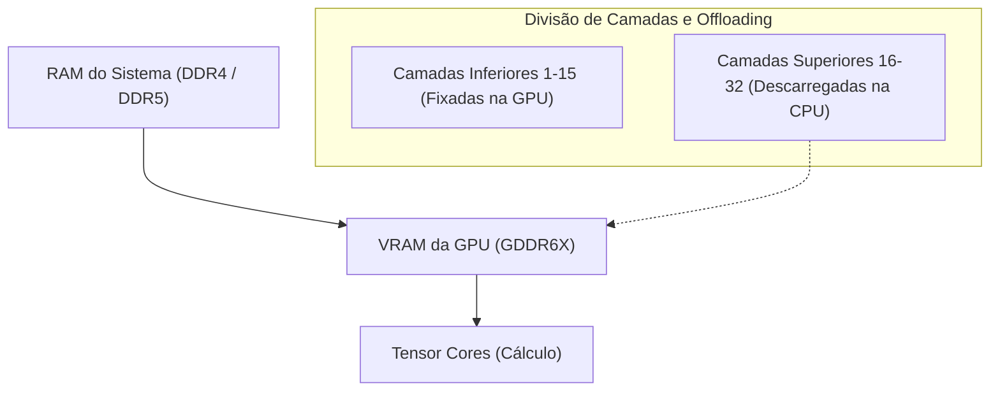
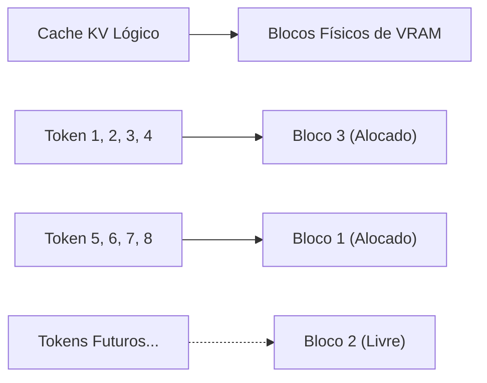
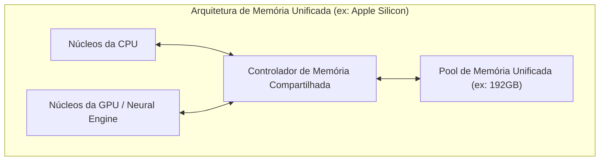
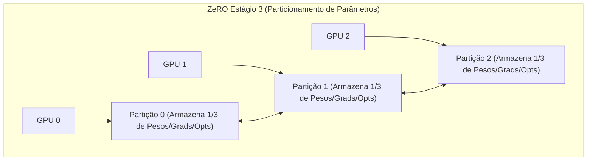

# Introdução: Desenvolvimento de IA e a "Barreira da VRAM"

Nos últimos anos, tecnologias de IA generativa, como Modelos de Linguagem de Grande Escala (LLM) e Modelos de Difusão (Diffusion Models), têm alcançado um rápido desenvolvimento. No entanto, ao treinar (fine-tuning) ou executar inferência (Inference) desses modelos de IA de ponta em ambientes locais, muitos desenvolvedores e pesquisadores enfrentam uma barreira extremamente física: a **"falta de memória da GPU (VRAM)"**.

Mesmo em GPUs de ponta para consumidores, como a NVIDIA GeForce RTX 4090, a VRAM é de no máximo 24 GB, o que torna completamente impossível carregar um modelo gigante como o Llama 3 70B em sua forma original. GPUs voltadas para data centers, como H100 (80GB) e B200 (192GB), são extremamente caras e não são algo que indivíduos ou pequenas equipes possam acessar facilmente. Se não conseguirmos superar essa "Barreira da VRAM (The Wall of VRAM)", não poderemos sequer tocar nos modelos mais avançados.

Neste artigo, explicaremos detalhadamente técnicas avançadas para quebrar essa restrição física de limite de VRAM por meio de inovações na arquitetura de software e hardware, tanto na perspectiva da inferência quanto do treinamento. Exploraremos a fundo, com fórmulas matemáticas e diagramas, o CPU offloading, otimização de cache KV, gradient checkpointing e a mais recente arquitetura de Memória Unificada (Unified Memory). Ao ler este artigo, você entenderá profundamente o comportamento da VRAM e adquirirá conhecimentos práticos para lidar com modelos gigantescos usando recursos limitados.

---

# 1. Anatomia do Consumo de VRAM de Modelos de IA (Inferência e Treinamento)

O primeiro passo para resolver a falta de VRAM é entender com precisão, de uma perspectiva micro, "o que" está consumindo "quanta" memória. Se pudermos estimar o consumo com precisão usando fórmulas matemáticas, em vez de tratá-lo como uma caixa preta, poderemos escolher a técnica de otimização apropriada.

## 1.1 Cálculo de Memória dos Parâmetros do Modelo (Pesos)

A quantidade básica de memória consumida pelos parâmetros (Weights) que compõem um modelo de IA é determinada pelo número total de parâmetros do modelo e pelo tipo de dados (Precision: precisão) usado para representá-los.

Os tipos de dados comumente usados em deep learning e o número de bytes por parâmetro ($B$) são os seguintes:
- **FP32 (Ponto flutuante de precisão simples):** 4 bytes (precisão padrão durante o treinamento)
- **FP16 / BF16 (Ponto flutuante de meia precisão):** 2 bytes (inferência geral e treinamento de precisão mista)
- **INT8 (Inteiro de 8 bits):** 1 byte (modelos quantizados)
- **INT4 (Quantização de inteiro de 4 bits):** 0.5 bytes (quantização extrema como GPTQ, AWQ, GGUF)

Considerando o número total de parâmetros do modelo inteiro como $P$, a quantidade de memória base $M_{weights}$ ocupada pelos próprios pesos é expressa pela seguinte fórmula:

$$ M_{weights} = P \times B $$

Por exemplo, se carregarmos o modelo "Llama 3 8B" (aproximadamente 8 bilhões de parâmetros) publicado pela Meta em FP16 (meia precisão), o cálculo seria o seguinte:

$$ M_{weights} = 8,000,000,000 \times 2 \text{ bytes} \approx 16,000,000,000 \text{ bytes} \approx 16 \text{ GB} $$

Em outras palavras, puramente carregar os pesos do modelo na GPU consumirá 16 GB de VRAM. Em uma RTX 3060 (12 GB), ocorreria um erro de Out of Memory (OOM) neste momento. No entanto, se quantizarmos o modelo para INT4, passará a ser $8 \times 0.5 = 4 \text{ GB}$, o que pode ser carregado com folga.

## 1.2 Consumo de Memória Durante a Inferência: Aumento do Cache KV

Durante a inferência de LLMs (especialmente na geração de texto autorregressiva), o **Cache KV (Key-Value Cache)** pressiona a VRAM tão ou mais intensamente do que os próprios pesos.
Na arquitetura Transformer, para evitar o recálculo de informações de tokens gerados ou processados no passado, os tensores de Key e Value em cada camada de atenção são mantidos em cache na VRAM. Isso melhora a velocidade de cálculo (Compute), mas o consumo de memória aumenta linearmente e de forma explosiva à medida que o comprimento do contexto (comprimento do prompt de entrada + comprimento do texto gerado) aumenta.

A quantidade de memória de cache KV $M_{kv\_token}$ consumida ao processar 1 token é rigorosamente calculada pela seguinte fórmula com base na arquitetura do modelo:

$$ M_{kv\_token} = 2 \times N_{layers} \times N_{heads\_kv} \times D_{head} \times B $$

Aqui, cada variável tem o seguinte significado:
- $2$ : Porque existem dois tensores, Key e Value
- $N_{layers}$ : Número de camadas (layers) do Transformer
- $N_{heads\_kv}$ : Número de cabeças de atenção KV (no caso de GQA: Grouped Query Attention, será menor do que o número normal de cabeças)
- $D_{head}$ : Dimensionalidade de cada cabeça (geralmente, dimensão da camada oculta $D_{model} / N_{heads}$)
- $B$ : Número de bytes do tipo de dado (2 se FP16)

A quantidade total de cache KV $M_{kv\_total}$ será este valor multiplicado pelo comprimento da sequência ($L_{seq}$) e pelo tamanho do lote ($BatchSize$).

$$ M_{kv\_total} = M_{kv\_token} \times L_{seq} \times BatchSize $$

**Exemplo Específico: No caso do Llama 2 7B**
- $N_{layers} = 32$
- $N_{heads\_kv} = 32$ (No caso de MHA)
- $D_{head} = 128$
- FP16 ($B=2$)
- Tamanho do lote 1, comprimento da sequência 8192 (Contexto 8K)

$$ M_{kv\_total} = 2 \times 32 \times 32 \times 128 \times 2 \times 8192 \times 1 = 4,294,967,296 \text{ bytes} \approx 4 \text{ GB} $$

Se estendermos o contexto para 32K (32768 tokens), o cache KV consumirá cerca de 16 GB sozinho. Se aumentarmos o tamanho do lote para 4, será de 64 GB. Exigir uma VRAM muito maior do que o tamanho do próprio modelo é um grande desafio durante a inferência.

## 1.3 Consumo de Memória Durante o Treinamento: Otimizadores, Gradientes e Ativações

Em comparação com a inferência, o treinamento de modelos (pré-treinamento e fine-tuning) consome significativamente mais VRAM. Isso ocorre porque, em vez de apenas um passe frontal simples (forward pass), precisamos reter as informações necessárias para a retropropagação (backpropagation). A memória de treinamento consiste principalmente nos seguintes 4 elementos:

1. **Pesos do Modelo (Model Weights):** Semelhante à inferência, mas no treinamento de precisão mista (mixed precision), os pesos de FP16 e FP32 (pesos mestre) muitas vezes são ambos retidos.
2. **Gradientes (Gradients):** Gradientes para cada parâmetro calculados via retropropagação. 2 bytes por parâmetro no caso de FP16.
3. **Estados do Otimizador (Optimizer States):** Otimizadores avançados como AdamW retêm o primeiro momento (Momentum) e o segundo momento (Variance) para cada parâmetro. Para manter a estabilidade do treinamento, estes são geralmente mantidos em FP32 (4 bytes). Isso significa que consumimos $4 + 4 = 8$ bytes por parâmetro em dois momentos.
4. **Ativações (Activations):** Para o cálculo de gradientes na retropropagação, a saída de cada camada (estado intermediário) durante o passe frontal precisa ser mantida na memória. Isso depende fortemente do tamanho do lote e do comprimento da sequência e torna-se extremamente grande.

Em resumo, no treinamento de precisão mista (Mixed Precision Training) usando o otimizador Adam padrão, são necessários **cerca de 16 a 20 bytes** por parâmetro (peso mestre 4 + peso FP16 2 + gradiente 2 + otimizador 8 + α) de memória.

$$ M_{train\_param} \approx P \times 16 \text{ bytes} $$

Para o treinamento de um modelo de 7B (7 bilhões de parâmetros), calcula-se que requer $7B \times 16 = 112 \text{ GB}$ apenas para dados relacionados aos parâmetros, e com a adição das ativações, requer impressionantes 140 GB ou mais de VRAM. Para executar isso com 24 GB de VRAM, técnicas de otimização extremas explicadas nos capítulos seguintes são indispensáveis.

---

# 2. Técnicas de Economia de VRAM Durante a Inferência

Muitas tecnologias de software foram desenvolvidas como abordagens para executar modelos gigantescos, superando os limites de hardware durante a inferência.

## 2.1 CPU Offloading (Descarregamento na CPU) e Divisão de Camadas

Quando um modelo gigante não cabe em uma ou mais GPUs, o método de alocar parte do modelo na memória do sistema (CPU RAM) e transferi-la para a GPU apenas quando necessário é chamado de **CPU offloading**. Bibliotecas como `llama.cpp` e `Accelerate` do Hugging Face suportam essa funcionalidade.



**Mecanismos e Desafios:**
Como o modelo Transformer tem uma estrutura na qual as camadas são empilhadas em série, o cálculo da próxima camada não começará até que o cálculo de uma certa camada termine. Aproveitando isso, mantemos residentes (fixadas) na VRAM apenas as camadas que cabem na GPU (por exemplo, camadas de 1 a 15) e colocamos as camadas restantes (camadas de 16 a 32) na CPU RAM, que tem uma grande capacidade, mas baixa velocidade. Durante a inferência, quando o cálculo até a 15ª camada terminar, os pesos da 16ª camada são transferidos (copiados) da CPU para a GPU pelo barramento PCIe, e o cálculo é executado na GPU.

No entanto, **a largura de banda (Bandwidth) do PCIe se torna um gargalo severo**. A largura de banda máxima teórica do PCIe 4.0 x16 é de 32 GB/s (unidirecional), o que é duas ordens de grandeza mais lento em comparação à largura de banda interna de VRAM das GPUs mais recentes (por exemplo, a GDDR6X da RTX 4090 atinge 1008 GB/s, e a HBM3 da H100, mais de 3 TB/s). Assim, se usarmos o CPU offloading excessivamente, a velocidade de inferência (Tokens per Second) cairá drasticamente.
Para minimizar a degradação da velocidade, o ponto-chave prático é colocar o maior número possível de camadas na GPU (maximizar as GPU Layers) e minimizar as camadas descarregadas (offloaded).

## 2.2 Quantização de Cache KV e PagedAttention

Existem duas otimizações poderosas para o cache KV, que é a principal causa do consumo de VRAM durante a inferência.

**1. Quantização de Cache KV (KV Cache Quantization):**
É uma técnica que quantiza dinamicamente não apenas os pesos do modelo, mas também o próprio cache KV gerado em tempo de execução, armazenando-o na VRAM em INT8, INT4 ou até FP8. Com isso, o tamanho do cache KV pode ser reduzido de 50% a 75%. Essa função é incorporada em motores de inferência modernos (vLLM e llama.cpp), proporcionando economias substanciais de VRAM enquanto minimiza a degradação da precisão.

**2. PagedAttention:**
**PagedAttention**, introduzido pelo motor de inferência vLLM, aplica o conceito de "paginação" de memória virtual do SO ao cache KV. Nos motores de inferência tradicionais, uma área contígua de VRAM era previamente alocada (Pre-allocation) com base no comprimento máximo definido da sequência. Por isso, quando a entrada real era curta, ocorria fragmentação e desperdício de memória não utilizada, onde às vezes mais de 60% da VRAM era desperdiçada.

O PagedAttention permite que o cache KV seja dividido em blocos de tamanho fixo (páginas) e armazenado de forma distribuída em espaços de memória física não contíguos. Com isso, os desperdícios de memória são reduzidos a quase zero (restritos apenas à fragmentação interna), possibilitando um aumento expressivo no tamanho do lote com a mesma capacidade de VRAM.



## 2.3 FlashAttention: Rompendo a Complexidade de Memória do Cálculo de Atenção

A falta de VRAM não é causada apenas pela quantidade de memória que armazena os dados, mas também pela falta de "espaço de trabalho (workspace) temporário" durante o cálculo. O mecanismo Self-Attention padrão do Transformer precisa materializar (Materialize) uma gigantesca matriz de atenção de $N \times N$ na VRAM para um comprimento de sequência $N$. Isso resulta numa complexidade de memória de $O(N^2)$, tornando-se o principal motivo de erros OOM em longos contextos.

Isso foi resolvido com o **FlashAttention** (e FlashAttention-2, 3).
O FlashAttention é um algoritmo projetado com base na arquitetura de hardware das GPUs (uma estrutura hierárquica entre uma enorme, mas lenta HBM e uma minúscula, mas ultrarrápida SRAM). Ao usar uma técnica chamada particionamento em blocos (Tiling), ele carrega os dados em blocos para a SRAM e conclui ali os cálculos da atenção, evitando completamente o processo de gravar a matriz $N \times N$ para a HBM (VRAM).

Como resultado, a complexidade de memória das camadas de atenção cai drasticamente de $O(N^2)$ para $O(N)$ (proporcional ao comprimento da sequência), aliviando significativamente as restrições sobre os comprimentos de contexto.

## 2.4 A Ascensão da Memória Unificada (Unified Memory) e o Apple Silicon

A **Arquitetura de Memória Unificada (Unified Memory Architecture: UMA)** adotada pelo Apple Silicon (séries M1/M2/M3/M4 Max e Ultra) e por algumas APUs recentes (como a série AMD Strix Point) aborda esse problema fundamentalmente no nível da arquitetura de PC.

Nessas arquiteturas, a CPU e a GPU na placa-mãe compartilham exatamente a mesma memória física (por exemplo, até 192 GB de LPDDR5). Portanto, o próprio conceito de "transferência lenta de dados da CPU para a GPU via PCIe" não existe fisicamente.



A maior vantagem dessa arquitetura é que não há uma parede distinta chamada VRAM, o que permite usar quase toda a memória do sistema para carregar LLMs gigantes diretamente. Um Mac Studio com 192 GB de memória unificada permite carregar e fazer inferência rápida com modelos imensos da classe 70B e superiores (como Grok-1) num único dispositivo, sem quantização. A largura de banda de acesso à memória também chega a 800 GB/s no M2 Ultra, exibindo velocidades comparáveis a GPUs dedicadas de última geração. É uma abordagem extremamente poderosa que resolve o dilema de "capacidade de memória" vs "largura de banda" no nível do hardware.

---

# 3. Técnicas de Economia de VRAM Durante o Treinamento (Fine-Tuning)

Mesmo durante a fase de treinamento (Training), que requer mais VRAM do que a inferência, ocorreram grandes inovações. Para realizar fine-tuning com recursos limitados, é indispensável a combinação das seguintes tecnologias.

## 3.1 Gradient Checkpointing

No processo de retropropagação (backpropagation) do aprendizado profundo, para calcular os gradientes, é necessário manter os resultados intermediários (Activations) de todas as camadas obtidas durante o passe frontal (forward pass) na memória. À medida que o comprimento da sequência ou o tamanho do lote aumenta, a memória de ativação começa a dominar a VRAM.

O **Gradient Checkpointing (também chamado Activation Recomputation)** é uma técnica brilhante que se aproveita do trade-off entre capacidade de memória e tempo computacional (Compute).
Em vez de salvar todos os resultados intermediários na memória, são mantidos apenas as saídas de camadas específicas (pontos de verificação). Durante a retropropagação, quando valores intermediários não armazenados são necessários, **eles são restaurados recalculando o passe frontal a partir do ponto de verificação mais próximo salvo.**

Embora o volume de cálculos aumente em cerca de 20 a 30% e o tempo total de treinamento seja prolongado, o consumo de VRAM decorrente das ativações é drasticamente reduzido de $O(N)$ ($N$ é o número de camadas) para $O(\sqrt{N})$. Nos treinamentos atuais de grandes modelos, pode-se dizer que esse é um recurso tão obrigatório que o processo sequer começa sem ele.

## 3.2 LoRA e QLoRA (Low-Rank Adaptation)

O protagonista que resolveu de forma fundamental a escassez de VRAM e representa as técnicas de PEFT (Parameter-Efficient Fine-Tuning) é o **LoRA**.

A enorme matriz de pesos original do modelo, $W_0 \in \mathbb{R}^{d \times k}$, é congelada (Frozen) e não é treinada. Em vez disso, introduzem-se paralelamente duas matrizes extremamente pequenas de posto baixo (low-rank matrices) $A \in \mathbb{R}^{r \times k}$ e $B \in \mathbb{R}^{d \times r}$, e somente $A$ e $B$ são treinadas (onde o posto $r$ é um valor pequeno $r \ll d, k$).

$$ W_{adapted} = W_0 + \Delta W = W_0 + B A $$

Isso faz com que os parâmetros-alvo de treinamento se tornem menos de 1% do total original (às vezes menos de 0,1%) e, como resultado, consumidores ávidos de memória como "gradientes" e "estados de otimizadores" despencam acentuadamente para menos de 1%.

E a técnica que levou isso ao limite absoluto é a **QLoRA (Quantized LoRA)**.
No QLoRA, os pesos do modelo-base, $W_0$, são quantizados ao máximo para 4 bits (no formato NF4: NormalFloat4) ao serem carregados na VRAM. As pequenas matrizes do LoRA, $A$ e $B$, por outro lado, são treinadas em BF16 (16 bits) para manter a precisão do cálculo.
Enquanto a quantização de 4 bits reduz o tamanho da VRAM exigido pelo modelo base para um quarto, ela usa uma técnica chamada **Paged Optimizers** (otimizadores paginados) para descarregar (offload) temporária e automaticamente os estados do otimizador para a CPU RAM quando a VRAM está prestes a se esgotar. Isso tornou possível realizar o fine-tuning de modelos supergigantes como o Llama 3 70B até mesmo em uma única placa GPU de 24 GB de VRAM (como a RTX 4090).

## 3.3 DeepSpeed ZeRO e Offloading

Quando múltiplas GPUs são usadas (ambiente multi-GPU), recorrer simplesmente à Paralelização de Dados (Data Parallelism) não resolverá os problemas de VRAM. Como cada GPU reserva uma cópia completa de todo o modelo, os limites de capacidade da VRAM individual não podem ser superados.

O **ZeRO (Zero Redundancy Optimizer)**, desenvolvido na biblioteca **DeepSpeed** pela Microsoft, é uma técnica para particionar (shard) minuciosamente os parâmetros, gradientes e estados do otimizador de um modelo através de múltiplas GPUs. Por meio disso, a "soma total" da VRAM de múltiplas GPUs pode ser tratada como um único e gigante pool de memória.



- **ZeRO Stage 1:** Particiona os estados do otimizador por cada GPU.
- **ZeRO Stage 2:** Particiona também os gradientes por cada GPU.
- **ZeRO Stage 3:** Particiona até os próprios parâmetros (pesos) do modelo por cada GPU.

Além disso, usando a função **ZeRO-Offload**, a manutenção dos estados do otimizador e os cálculos de atualização dos gradientes particionados pelo ZeRO podem ser movidos para a **memória da CPU (Offload)** e executados pela CPU hospedeira em vez de usarem a GPU. Isso reduz extremamente o fardo sobre a VRAM da GPU e permite o treinamento de modelos massivos em ambientes com recursos limitados de GPU. Como os cálculos são realizados na CPU e os resultados retornam à GPU via PCIe, a velocidade de treinamento diminui, mas isso evita o pior cenário: "o treinamento travar devido à falta de memória".

---

# 4. Exemplo de Implementação: Hugging Face Accelerate e DeepSpeed

Por fim, mostraremos exemplos simples de como você pode implementar o CPU offloading e otimizações de VRAM usando código Python.

## 4.1 Offload Automático com `device_map="auto"` pelo Hugging Face

Usando as bibliotecas `transformers` e `accelerate` do Hugging Face, as camadas são alocadas e divididas automaticamente entre a GPU e a CPU ao carregar o modelo.

```python
from transformers import AutoModelForCausalLM, AutoTokenizer

model_id = "meta-llama/Llama-2-13b-hf"

# Com device_map="auto", a parte que não couber na VRAM sofrerá offload para a CPU RAM
# load_in_8bit=True quantiza os pesos para 8 bits, resultando em ainda mais economia de memória
model = AutoModelForCausalLM.from_pretrained(
    model_id,
    device_map="auto",
    load_in_8bit=True,
    offload_folder="offload_dir" # Se houver falta de CPU RAM, pode sofrer offload até para o disco (SSD)
)
```

Ao executar este código, a biblioteca `accelerate` em segundo plano analisa a capacidade ociosa do sistema (CPU RAM e VRAM) e organiza (Dispatch) as camadas da melhor maneira possível.

## 4.2 Configuração de CPU Offloading no DeepSpeed (ZeRO-2)

Exemplo de arquivo de configuração (JSON) para ativar o CPU offloading usando DeepSpeed durante o treinamento.

```json
{
  "fp16": {
    "enabled": true
  },
  "zero_optimization": {
    "stage": 2,
    "offload_optimizer": {
      "device": "cpu",
      "pin_memory": true
    },
    "allgather_partitions": true,
    "allgather_bucket_size": 2e8,
    "overlap_comm": true,
    "reduce_scatter": true,
    "reduce_bucket_size": 2e8,
    "contiguous_gradients": true
  },
  "train_batch_size": 16,
  "gradient_accumulation_steps": 4
}
```
Nesta configuração, ao definir `"cpu"` na opção `offload_optimizer`, a retenção dos estados do otimizador (como Adam) — que consome uma imensa quantidade de VRAM — e o cálculo das atualizações são executados na CPU do sistema. Dessa forma, a VRAM da GPU pode ser dedicada exclusivamente para a tarefa mais importante: os cálculos de passe frontal e retropropagação (forward/backward) do modelo. Definir `pin_memory: true` previne falhas de página (page faults) e permite acelerar ao máximo a transferência via PCIe entre CPU e GPU.

---

# Conclusão

A falta de memória de GPU (Out of Memory) no desenvolvimento de IA será um desafio contínuo e constante para os desenvolvedores à medida que os modelos continuam crescendo. No entanto, combinar perfeitamente um entendimento profundo do hardware (arquitetura) com as técnicas de otimização no âmbito de software/algoritmos, como explicado neste artigo, torna possível realizar o fine-tuning e a inferência de modelos gigantes localmente — algo que à primeira vista pareceria impossível.

**Resumo das Contramedidas para Inferência:**
1. **Quantização (INT4 / INT8 / FP8):** Comprime drasticamente o tamanho do modelo, reduzindo a ocupação de VRAM.
2. **CPU Offloading:** Fuga das camadas que não cabem na VRAM para a memória do sistema (trade-off com a queda de velocidade pela largura de banda PCIe).
3. **Otimização do Cache KV:** Utiliza paginação (PagedAttention) ou quantização de cache junto com FlashAttention para preservar o comprimento de contexto (Context Length).
4. **Utilização da Memória Unificada:** Aproveita arquiteturas UMA (como Apple Silicon) utilizando grandes capacidades de memória unificada diretamente para inferência.

**Resumo das Contramedidas para Treinamento:**
1. **PEFT (LoRA / QLoRA):** Limita os parâmetros para treinamento e quantiza exaustivamente o modelo base.
2. **Gradient Checkpointing:** Descarta as saídas intermediárias da propagação frontal e as recalcula na retropropagação, mantendo o baixo consumo de VRAM em troca de maior tempo computacional.
3. **ZeRO & CPU Offload (DeepSpeed):** Supera o limite de VRAM fracionando os estados do otimizador e gradientes em múltiplas GPUs ou transferindo-os para a CPU (Offloading).

Aproveitando amplamente essas tecnologias inovadoras, maximize a performance no desenvolvimento de IA usando recursos limitados de hardware. Neste campo em evolução incrivelmente rápida, espera-se que surjam cada vez mais novos algoritmos de economia de memória no futuro. O segredo será verificar regularmente os desenvolvimentos recentes das bibliotecas e ser capaz de introduzi-las perfeitamente nas suas implementações.

