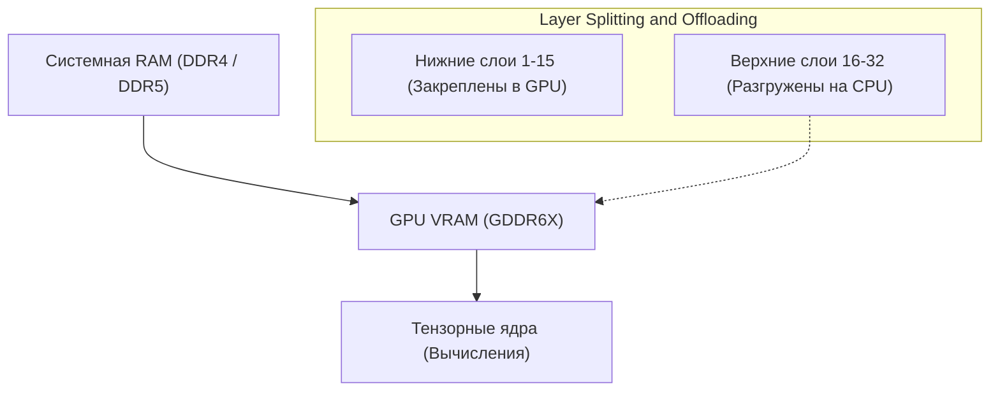
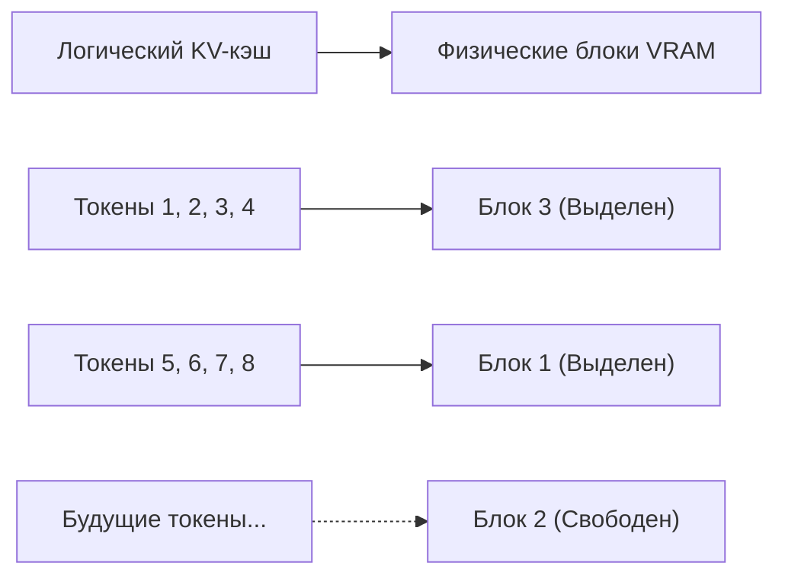
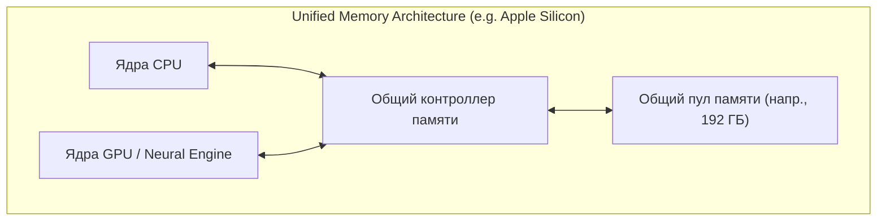
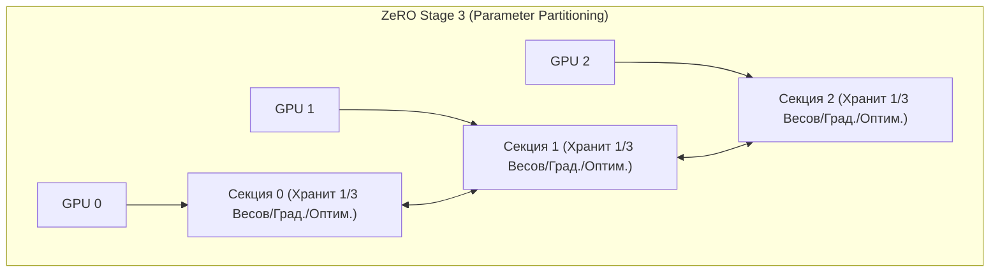

# Введение: Разработка ИИ и «Стена VRAM»

В последние годы технологии генеративного ИИ, такие как большие языковые модели (LLM) и диффузионные модели (Diffusion Models), стремительно развиваются. Однако, когда разработчики и исследователи пытаются обучать (дообучать) или запускать инференс (Inference) этих передовых ИИ-моделей в локальной среде, они часто сталкиваются с **«нехваткой памяти GPU (VRAM)»** — крайне физическим препятствием.

Даже высокопроизводительные потребительские GPU, такие как NVIDIA GeForce RTX 4090, имеют максимум 24 ГБ VRAM, и загрузить такую огромную модель, как Llama 3 70B, целиком в нее совершенно невозможно. GPU для дата-центров, такие как H100 (80 ГБ) или B200 (192 ГБ), очень дороги и недоступны для частных лиц или небольших команд. Если не преодолеть эту «стену VRAM» (The Wall of VRAM), невозможно даже прикоснуться к самым передовым моделям.

В этой статье мы подробно, как с точки зрения инференса, так и обучения, рассмотрим продвинутые технические приемы, позволяющие преодолеть это физическое ограничение VRAM с помощью архитектурных решений в программном и аппаратном обеспечении. Мы углубимся в такие темы, как разгрузка CPU, оптимизация KV-кэша, чекпоинтинг градиентов (Gradient Checkpointing) и новейшая архитектура объединенной памяти (Unified Memory), сопровождая это математическими формулами и схемами. Прочитав эту статью, вы глубоко поймете поведение VRAM и приобретете практические знания для работы с огромными моделями на ограниченных ресурсах.

---

# 1. Анатомия потребления VRAM моделями ИИ (Инференс и Обучение)

Первым шагом к решению проблемы нехватки VRAM является точное понимание с микроскопической точки зрения того, «что» и «сколько» памяти потребляется. Относясь к этому не как к черному ящику, а точно оценивая с помощью математических формул, вы сможете выбрать правильные методы оптимизации.

## 1.1 Расчет памяти для параметров модели (весов)

Базовый объем памяти, потребляемый параметрами (Weights), составляющими ИИ-модель, определяется общим количеством параметров модели и типом данных (Precision: точность), используемым для их представления.

Ниже приведены типы данных, обычно используемые в глубоком обучении, и количество байт на один параметр ($B$):
- **FP32 (Число с плавающей запятой одинарной точности):** 4 байта (стандартная точность при обучении)
- **FP16 / BF16 (Число с плавающей запятой половинной точности):** 2 байта (стандартно для инференса и обучения со смешанной точностью)
- **INT8 (8-битное целое число):** 1 байт (квантованные модели)
- **INT4 (4-битное целочисленное квантование):** 0.5 байта (экстремальное квантование, такое как GPTQ, AWQ, GGUF)

Если общее количество параметров модели равно $P$, то базовый объем памяти $M_{weights}$, занимаемый самими весами, выражается следующей формулой:

$$ M_{weights} = P \times B $$

Например, если мы хотим загрузить модель «Llama 3 8B» (около 8 миллиардов параметров), опубликованную Meta, в формате FP16 (половинная точность), расчет будет следующим:

$$ M_{weights} = 8,000,000,000 \times 2 \text{ bytes} \approx 16,000,000,000 \text{ bytes} \approx 16 \text{ GB} $$

Иными словами, простая загрузка весов модели в GPU потребляет 16 ГБ VRAM. На RTX 3060 (12 ГБ) в этот момент возникнет ошибка Out of Memory (OOM). Однако, если квантовать модель до INT4, получится $8 \times 0.5 = 4 \text{ ГБ}$, что позволит без проблем загрузить её.

## 1.2 Потребление памяти при инференсе: Увеличение KV-кэша

При инференсе LLM (особенно при авторегрессионной генерации текста) **KV-кэш (Key-Value Cache)** оказывает на VRAM такое же или даже большее давление, чем веса.
В архитектуре Transformer, чтобы избежать повторного вычисления информации о ранее сгенерированных и обработанных токенах, тензоры Key и Value на каждом слое внимания (attention) кэшируются в VRAM. Это увеличивает скорость вычислений (Compute), но по мере увеличения длины контекста (длина входного промпта + длина генерации) потребление памяти взрывообразно растет линейным образом.

Объем памяти KV-кэша $M_{kv\_token}$, потребляемый при обработке одного токена, строго рассчитывается на основе архитектуры модели по следующей формуле:

$$ M_{kv\_token} = 2 \times N_{layers} \times N_{heads\_kv} \times D_{head} \times B $$

Где каждая переменная имеет следующее значение:
- $2$ : Из-за наличия двух тензоров: Key и Value
- $N_{layers}$ : Количество слоев (layers) Transformer
- $N_{heads\_kv}$ : Количество голов внимания KV (в случае GQA: Grouped Query Attention это число меньше обычного количества голов)
- $D_{head}$ : Размерность каждой головы (обычно размерность скрытого слоя $D_{model} / N_{heads}$)
- $B$ : Количество байт для типа данных (2 для FP16)

Общий объем KV-кэша $M_{kv\_total}$ получается умножением этого значения на длину последовательности ($L_{seq}$) и размер батча ($BatchSize$).

$$ M_{kv\_total} = M_{kv\_token} \times L_{seq} \times BatchSize $$

**Конкретный пример: для Llama 2 7B**
- $N_{layers} = 32$
- $N_{heads\_kv} = 32$ (в случае MHA)
- $D_{head} = 128$
- FP16 ($B=2$)
- Размер батча 1, длина последовательности 8192 (контекст 8K)

$$ M_{kv\_total} = 2 \times 32 \times 32 \times 128 \times 2 \times 8192 \times 1 = 4,294,967,296 \text{ bytes} \approx 4 \text{ GB} $$

Если увеличить контекст до 32K (32768 токенов), только KV-кэш потребует около 16 ГБ. Если увеличить размер батча до 4, это будет уже 64 ГБ. Требование VRAM, намного превышающее размер самой модели, является серьезной проблемой при инференсе.

## 1.3 Потребление памяти при обучении: Оптимизатор, Градиенты и Активации

По сравнению с инференсом, обучение модели (pre-training или fine-tuning) потребляет гораздо больше VRAM. Это связано с тем, что необходимо сохранять информацию для обратного распространения ошибки (backpropagation), а не только для прямого прохода (forward pass). Память во время обучения в основном состоит из следующих 4 элементов:

1. **Веса модели (Model Weights):** Так же, как и при инференсе, но при обучении со смешанной точностью часто сохраняются как FP16, так и FP32 (master weights).
2. **Градиенты (Gradients):** Градиенты для каждого параметра, вычисляемые при обратном распространении. В случае FP16 это 2 байта на параметр.
3. **Состояния оптимизатора (Optimizer States):** Продвинутые оптимизаторы, такие как AdamW, сохраняют первый момент (Momentum) и второй момент (Variance) для каждого параметра. Для поддержания стабильности обучения они обычно хранятся в FP32 (4 байта). То есть на 2 момента расходуется $4 + 4 = 8$ байт/параметр.
4. **Активации (Activations):** Для вычисления градиентов при обратном распространении необходимо хранить в памяти выходные данные (промежуточные состояния) каждого слоя при прямом проходе. Это сильно зависит от размера батча и длины последовательности, и может стать очень большим.

В итоге, при обучении со смешанной точностью (Mixed Precision Training) с использованием стандартного оптимизатора Adam, потребуется **около 16–20 байт** (master-веса 4 + веса FP16 2 + градиенты 2 + оптимизатор 8 + α) памяти на один параметр.

$$ M_{train\_param} \approx P \times 16 \text{ bytes} $$

Для обучения модели 7B (7 миллиардов параметров) только для параметров потребуется $7B \times 16 = 112 \text{ ГБ}$, к которым добавляются активации, и в итоге потребуется более 140 ГБ VRAM. Чтобы выполнить это на 24 ГБ VRAM, абсолютно необходимы мощные методы оптимизации, которые будут описаны в следующих главах.

---

# 2. Техники экономии VRAM при инференсе

В качестве подходов к запуску огромных моделей при инференсе было разработано множество программных технологий, преодолевающих аппаратные ограничения.

## 2.1 Разгрузка CPU (CPU Offloading) и разделение слоев

Когда огромная модель не помещается на одном или нескольких GPU, метод размещения части модели в системной памяти (CPU RAM) и вычислений с переносом данных в GPU только тогда, когда это необходимо, называется **разгрузкой CPU (CPU Offloading)**. `llama.cpp` и `Accelerate` от Hugging Face поддерживают эту функцию.



**Механизм и проблемы:**
Поскольку архитектура Transformer состоит из слоев, уложенных последовательно, вычисление следующего слоя не начнется до тех пор, пока не закончится вычисление текущего. Используя это, только слои, которые помещаются в GPU (например, слои с 1-го по 15-й), постоянно находятся (закреплены) в VRAM, а остальные слои (с 16-го по 32-й) размещаются в большой, но медленной RAM CPU. Во время инференса, как только вычисления для первых 15 слоев завершаются, веса 16-го слоя переносятся (копируются) из CPU в GPU через шину PCIe, и вычисления выполняются на GPU.

Однако **пропускная способность (Bandwidth) PCIe становится сильным узким местом**. Теоретическая максимальная пропускная способность PCIe 4.0 x16 составляет 32 ГБ/с (в одном направлении), что на два порядка медленнее по сравнению с внутренней пропускной способностью VRAM современных GPU (например, GDDR6X на RTX 4090 составляет 1008 ГБ/с, HBM3 на H100 — более 3 ТБ/с), поэтому интенсивное использование разгрузки CPU резко снижает скорость инференса (Tokens per Second).
Чтобы минимизировать падение скорости, практический подход заключается в том, чтобы поместить как можно больше слоев в GPU (максимизация GPU Layers) и минимизировать количество слоев, разгружаемых на CPU.

## 2.2 Квантование KV-кэша и PagedAttention

Для KV-кэша, который является главным виновником потребления VRAM при инференсе, применяются две мощные оптимизации.

**1. Квантование KV-кэша (KV Cache Quantization):**
Это метод квантования не только весов модели, но и динамически генерируемого во время работы KV-кэша до INT8, INT4 или даже FP8 и его сохранения в VRAM. Это позволяет сократить размер KV-кэша в два-четыре раза. В современных движках инференса (vLLM или llama.cpp) эта функция встроена, что позволяет значительно экономить VRAM при минимальном снижении точности.

**2. PagedAttention:**
**PagedAttention** — это применение концепции «пейджинга» виртуальной памяти ОС к KV-кэшу, впервые внедренная в движке инференса vLLM. В традиционных движках инференса непрерывная область VRAM предварительно выделялась (Pre-allocation) в соответствии с заданным максимальным размером последовательности. В результате, если фактический вход был коротким, возникала фрагментация и пустая трата неиспользуемой памяти, и до 60% VRAM могло тратиться впустую.

PagedAttention разделяет KV-кэш на блоки (страницы) фиксированного размера и позволяет хранить их децентрализованно в несмежном пространстве физической памяти. Это сводит потери памяти практически к нулю (ограничиваясь только внутренней фрагментацией) и позволяет значительно увеличить размер батча при том же объеме VRAM.



## 2.3 FlashAttention: Преодоление сложности памяти при вычислении внимания

Нехватка VRAM вызывается не только объемом памяти для хранения данных, но и нехваткой «временного рабочего пространства» во время вычислений. Стандартный механизм Self-Attention в Transformer требует материализации огромной матрицы внимания $N \times N$ в VRAM для длины последовательности $N$. Это означает сложность памяти $O(N^2)$, что является основной причиной OOM для длинных контекстов.

Решением этого стала технология **FlashAttention** (и FlashAttention-2, 3).
FlashAttention — это алгоритм, учитывающий аппаратную архитектуру GPU (иерархическую структуру огромной, но медленной HBM и крошечной, но сверхбыстрой SRAM). Используя метод, называемый тайлингом (Tiling), данные загружаются в SRAM поблочно, и вычисления внимания завершаются там, что полностью позволяет избежать процесса записи матрицы $N \times N$ в HBM (VRAM).

В результате сложность памяти слоя внимания резко снизилась с $O(N^2)$ до $O(N)$ (пропорционально длине последовательности), и ограничение на длину контекста было значительно ослаблено.

## 2.4 Расцвет объединенной памяти (Unified Memory) и Apple Silicon

Подход к этой проблеме с самых основ архитектуры ПК — это **архитектура объединенной памяти (Unified Memory Architecture: UMA)**, которая используется в Apple Silicon (серии Max и Ultra в M1/M2/M3/M4) и некоторых новейших APU (таких как AMD Strix Point).

В этих архитектурах CPU и GPU на материнской плате разделяют одну и ту же физическую память (например, до 192 ГБ LPDDR5). Поэтому концепции «медленной передачи данных от CPU к GPU через PCIe» физически не существует.



Самое большое преимущество этой архитектуры в том, что нет четкой стены VRAM, и почти всю системную память можно напрямую использовать для загрузки огромных LLM. Mac Studio с 192 ГБ объединенной памяти может загрузить на одно устройство огромные модели класса 70B и выше (например, Grok-1) без квантования и быстро выполнять инференс. Пропускная способность доступа к памяти на M2 Ultra достигает 800 ГБ/с, что сравнимо со скоростью дискретных потребительских GPU. Это очень мощный подход, который на аппаратном уровне решает дилемму «объем памяти» против «пропускной способности».

---

# 3. Техники экономии VRAM при обучении (Fine-Tuning)

Много прорывов произошло и во время обучения (Training), которое требует еще больше VRAM, чем инференс. Чтобы проводить файн-тюнинг на ограниченных ресурсах, необходимо комбинировать следующие технологии.

## 3.1 Чекпоинтинг градиентов (Gradient Checkpointing)

В обратном распространении ошибки (backpropagation) в глубоком обучении необходимо хранить промежуточные выходы всех слоев (Activations) во время прямого прохода в памяти, чтобы вычислить градиенты. Когда длина последовательности и размер батча становятся большими, эта память активаций начинает доминировать в VRAM.

**Чекпоинтинг градиентов (Gradient Checkpointing / Activation Recomputation)** — это гениальная техника, использующая компромисс между объемом памяти и временем вычислений (Compute).
Вместо того, чтобы сохранять все промежуточные выходы в памяти, сохраняются только выходы определенных слоев (чекпоинтов). Когда во время обратного распространения требуется не сохраненное промежуточное значение, **оно восстанавливается путем повторного вычисления прямого прохода от ближайшего сохраненного чекпоинта (перевычисление)**.

Объем вычислений увеличивается примерно на 20-30%, и общее время обучения становится больше, но потребление VRAM активациями можно резко сократить с $O(N)$ (где $N$ — количество слоев) до $O(\sqrt{N})$. В настоящее время при обучении крупномасштабных моделей это настолько важная настройка, что без неё даже нельзя начать работу.

## 3.2 LoRA и QLoRA (Low-Rank Adaptation)

Главным героем, коренным образом решившим проблему нехватки VRAM, стал **LoRA** — видный представитель семейства PEFT (Parameter-Efficient Fine-Tuning).

Оригинальная гигантская матрица весов модели $W_0 \in \mathbb{R}^{d \times k}$ замораживается (Frozen) и не обучается. Вместо этого параллельно вводятся две очень маленькие матрицы низкого ранга $A \in \mathbb{R}^{r \times k}$ и $B \in \mathbb{R}^{d \times r}$, и обучаются только эти $A$ и $B$. (Где ранг $r$ — это очень маленькое значение, $r \ll d, k$).

$$ W_{adapted} = W_0 + \Delta W = W_0 + B A $$

В результате количество обучаемых параметров становится менее 1% (иногда менее 0.1%) от исходного, и, соответственно, объем памяти, потребляемый «градиентами» и «состояниями оптимизатора», резко падает до менее 1%.

Дальнейшее экстремальное развитие этого подхода — **QLoRA (Quantized LoRA)**.
В QLoRA веса базовой модели $W_0$ экстремально квантуются до 4 бит (формат NF4: NormalFloat4) и загружаются в VRAM. При этом небольшие матрицы LoRA $A, B$ обучаются в формате BF16 (16 бит) для сохранения точности вычислений.
Благодаря 4-битному квантованию размер базовой модели в VRAM уменьшается в четыре раза от исходного, а с использованием технологии **Paged Optimizers** (страничные оптимизаторы) состояния оптимизатора автоматически эвакуируются (разгружаются) в CPU RAM, когда VRAM близка к исчерпанию. Это сделало возможным файн-тюнинг сверхбольших моделей, таких как Llama 3 70B, даже на одном GPU с 24 ГБ VRAM (например, RTX 4090).

## 3.3 DeepSpeed ZeRO и Оффлоадинг (Offloading)

В среде, использующей несколько GPU (мульти-GPU), простое распараллеливание данных (Data Parallelism) не решает проблему VRAM. Поскольку каждый GPU содержит копию всей модели, предел емкости VRAM отдельного устройства не может быть преодолен.

**ZeRO (Zero Redundancy Optimizer)** в библиотеке **DeepSpeed**, разработанной Microsoft — это технология, которая кардинально разделяет (shards) параметры модели, градиенты и состояния оптимизатора между несколькими GPU. Это позволяет использовать «суммарный» объем VRAM нескольких GPU как один гигантский пул памяти.



- **ZeRO Stage 1:** Состояния оптимизатора разделяются между GPU.
- **ZeRO Stage 2:** Градиенты также разделяются между GPU.
- **ZeRO Stage 3:** Сами параметры (веса) модели также разделяются между GPU.

Кроме того, при использовании функции **ZeRO-Offload** вычисления для обновления состояний оптимизатора и градиентов, разделенных с помощью ZeRO, могут выполняться не на GPU, а **разгружаться (offload) в память CPU** и выполняться на хост-CPU. Это максимально снижает нагрузку на VRAM GPU и позволяет обучать огромные модели даже в средах с ограниченными ресурсами GPU. Скорость обучения снижается из-за того, что вычисления выполняются на CPU, а результаты возвращаются на GPU через PCIe, но это позволяет избежать наихудшего сценария: «краха обучения из-за нехватки памяти».

---

# 4. Пример реализации: Hugging Face Accelerate и DeepSpeed

Напоследок мы приведем простые примеры того, как на самом деле реализовать разгрузку CPU и оптимизацию VRAM в коде на Python.

## 4.1 Автоматическая разгрузка с помощью Hugging Face `device_map="auto"`

При использовании библиотек `transformers` и `accelerate` от Hugging Face, во время загрузки модели слои автоматически распределяются между GPU и CPU.

```python
from transformers import AutoModelForCausalLM, AutoTokenizer

model_id = "meta-llama/Llama-2-13b-hf"

# Благодаря device_map="auto", часть, не помещающаяся в VRAM, разгружается в CPU RAM
# load_in_8bit=True квантует веса до 8 бит для еще большей экономии памяти
model = AutoModelForCausalLM.from_pretrained(
    model_id,
    device_map="auto",
    load_in_8bit=True,
    offload_folder="offload_dir" # При нехватке места возможна разгрузка даже на диск (SSD)
)
```

При выполнении этого кода стоящая за ним библиотека `accelerate` анализирует свободный объем VRAM и CPU RAM в системе и оптимально распределяет (Dispatch) слои.

## 4.2 Настройка разгрузки CPU в DeepSpeed (ZeRO-2)

Пример файла конфигурации (JSON) для включения разгрузки CPU в DeepSpeed во время обучения.

```json
{
  "fp16": {
    "enabled": true
  },
  "zero_optimization": {
    "stage": 2,
    "offload_optimizer": {
      "device": "cpu",
      "pin_memory": true
    },
    "allgather_partitions": true,
    "allgather_bucket_size": 2e8,
    "overlap_comm": true,
    "reduce_scatter": true,
    "reduce_bucket_size": 2e8,
    "contiguous_gradients": true
  },
  "train_batch_size": 16,
  "gradient_accumulation_steps": 4
}
```
В этой конфигурации установка параметра `offload_optimizer` в значение `"cpu"` заставляет выполнять вычисления для обновления и хранения состояний оптимизатора (такого как Adam), который потребляет много VRAM, на CPU системы. Это позволяет VRAM GPU сосредоточиться на самой важной задаче — прямом/обратном вычислении модели. Настройка `pin_memory: true` предотвращает ошибки отсутствия страниц (page faults) и максимально ускоряет передачу данных между CPU и GPU по PCIe.

---

# Заключение

Нехватка памяти GPU (Out of Memory) при разработке ИИ останется вечной проблемой для разработчиков по мере роста масштабов моделей. Однако глубокое понимание аппаратного обеспечения (архитектуры), подобного тому, что было описано в этой статье, в правильном сочетании с методами оптимизации на уровне программного обеспечения и алгоритмов, делает инференс и обучение огромных моделей в локальной среде, что на первый взгляд кажется невозможным, вполне осуществимым.

**Краткое описание мер при инференсе:**
1. **Квантование (INT4 / INT8 / FP8):** Радикально сжимает размер самой модели и уменьшает объем занимаемой VRAM.
2. **Разгрузка CPU:** Перенос слоев, не помещающихся в VRAM, в системную память (компромисс со снижением скорости из-за пропускной способности PCIe).
3. **Оптимизация KV-кэша:** Обеспечение длины контекста (Context Length) с использованием пейджинга (PagedAttention), квантования кэша и FlashAttention.
4. **Использование объединенной памяти (Unified Memory):** Использование UMA, такой как Apple Silicon, для прямого использования памяти большого объема для инференса.

**Краткое описание мер при обучении:**
1. **PEFT (LoRA / QLoRA):** Ограничение параметров для обучения и экстремальное квантование базовой модели.
2. **Чекпоинтинг градиентов (Gradient Checkpointing):** Отбрасывание промежуточных выходов прямого прохода и их перевычисление во время обратного распространения, чтобы снизить потребление VRAM ценой времени вычислений.
3. **ZeRO и разгрузка CPU (DeepSpeed):** Разделение состояний оптимизатора и градиентов между несколькими GPU или их разгрузка в память CPU для преодоления ограничений VRAM.

Активно используя эти передовые технологии, давайте максимизировать производительность при разработке ИИ в рамках ограниченных аппаратных ресурсов. Ожидается, что в этой быстро развивающейся области в будущем появятся новые алгоритмы для экономии памяти. Ключом к успеху будет регулярное отслеживание тенденций в новейших библиотеках и их внедрение в реализацию.

