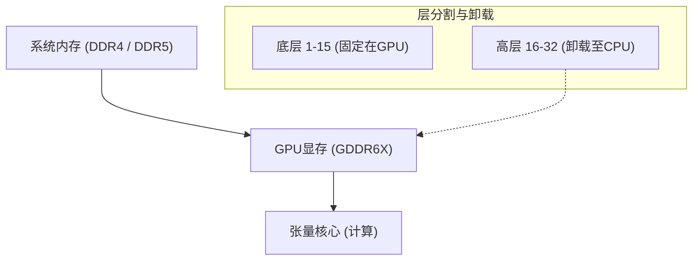
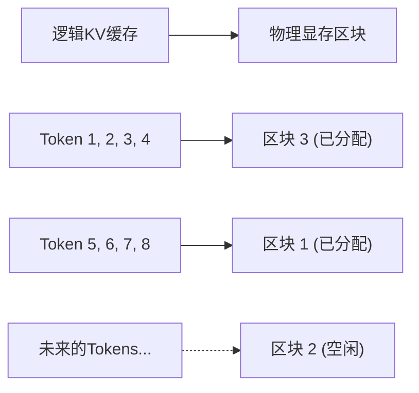
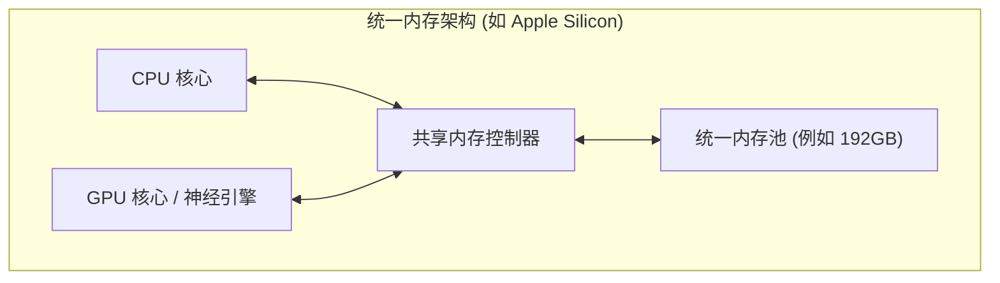
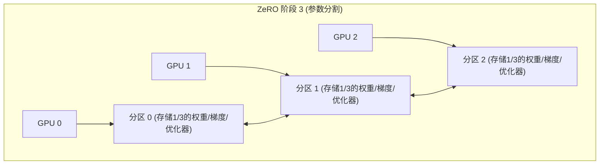

# 引言：AI开发与“VRAM之墙”

近年来，大型语言模型（LLM）和扩散模型（Diffusion Models）等生成式AI技术取得了飞速的发展。然而，当许多开发者和研究人员在本地环境中对这些最先进的AI模型进行训练（微调）或执行推理（Inference）时，他们面临着一个非常物理的障碍——**“GPU内存（VRAM）不足”**。

即便是面向消费者的旗舰级GPU，例如NVIDIA GeForce RTX 4090，其最大VRAM也只有24GB，根本不可能直接加载像Llama 3 70B这样庞大的模型。而数据中心级别的H100（80GB）或B200（192GB）则非常昂贵，个人或小规模团队难以轻易触及。如果无法突破这堵“VRAM之墙（The Wall of VRAM）”，甚至连接触最先进模型的机会都没有。

本文将深入探讨如何通过软件和硬件架构层面的创新来打破这种物理上的VRAM限制，从推理和训练两个方面详细解析这些高级技术。我们将结合数学公式和图解，深入探讨CPU卸载、KV缓存优化、梯度检查点（Gradient Checkpointing）以及最新的统一内存（Unified Memory）架构。阅读本文后，您将深入理解VRAM的行为机制，并掌握在有限资源下处理庞大模型的实用知识。

---

# 1. AI模型的VRAM消耗解剖学（推理与训练）

解决VRAM不足的第一步是，首先从微观角度准确掌握“什么”消耗了“多少”内存。如果我们能够通过数学公式准确地进行估算，而不是将其视为黑盒，我们就能选择最合适的优化方法。

## 1.1 模型参数（权重）的内存计算

构成AI模型的参数（Weights）所消耗的基础内存量，由模型的总参数数量和用于表示这些参数的数据类型（Precision: 精度）决定。

深度学习中常用的数据类型及每个参数所占的字节数（$B$）如下：
- **FP32 (单精度浮点数):** 4 bytes (标准的训练精度)
- **FP16 / BF16 (半精度浮点数):** 2 bytes (常见的推理及混合精度训练)
- **INT8 (8位整数):** 1 byte (量化模型)
- **INT4 (4位整数量化):** 0.5 bytes (GPTQ, AWQ, GGUF等极度量化)

假设整个模型的参数量为 $P$，那么纯权重本身占用的基础内存量 $M_{weights}$ 可用以下公式表示：

$$ M_{weights} = P \times B $$

例如，若以FP16（半精度）加载Meta发布的“Llama 3 8B”模型（约80亿参数），计算如下：

$$ M_{weights} = 8,000,000,000 \times 2 \text{ bytes} \approx 16,000,000,000 \text{ bytes} \approx 16 \text{ GB} $$

也就是说，单纯将模型的权重加载到GPU中就需要消耗16GB的VRAM。在RTX 3060（12GB）上，此时就会发生Out of Memory (OOM) 错误。但是，如果将模型量化为INT4，则变为 $8 \times 0.5 = 4 \text{ GB}$，就可以轻松加载了。

## 1.2 推理时的内存消耗：KV缓存的激增

在LLM的推理（尤其是自回归式的文本生成）过程中，**KV缓存（Key-Value Cache）**对VRAM的压力与权重相当，甚至更为剧烈。
在Transformer架构中，为了防止重复计算过去已生成或处理过的Token信息，各注意力层的Key和Value张量会持续缓存在VRAM中。这虽然提高了计算速度（Compute），但随着上下文长度（输入提示长度＋生成长度）的增加，内存消耗量会呈爆炸性的线性增长。

处理1个Token时消耗的KV缓存内存量 $M_{kv\_token}$，可根据模型架构通过以下公式进行精确计算：

$$ M_{kv\_token} = 2 \times N_{layers} \times N_{heads\_kv} \times D_{head} \times B $$

各变量含义如下：
- $2$ : 因为存在Key和Value两个张量
- $N_{layers}$ : Transformer的层数
- $N_{heads\_kv}$ : KV注意力头数（对于GQA: Grouped Query Attention，会少于常规的头数）
- $D_{head}$ : 每个头的维度数（通常为隐藏层维度数 $D_{model} / N_{heads}$）
- $B$ : 数据类型的字节数（FP16为2）

整体的KV缓存量 $M_{kv\_total}$，则是将其乘以序列长度（$L_{seq}$）和批大小（$BatchSize$）。

$$ M_{kv\_total} = M_{kv\_token} \times L_{seq} \times BatchSize $$

**具体示例：以 Llama 2 7B 为例**
- $N_{layers} = 32$
- $N_{heads\_kv} = 32$ (MHA的情况下)
- $D_{head} = 128$
- FP16 ($B=2$)
- 批大小为 1，序列长度为 8192 (8K上下文)

$$ M_{kv\_total} = 2 \times 32 \times 32 \times 128 \times 2 \times 8192 \times 1 = 4,294,967,296 \text{ bytes} \approx 4 \text{ GB} $$

如果将上下文延伸到32K（32768个Token），仅KV缓存就会消耗约16GB。若批大小增加到4，则为64GB。相比模型本身的体积，推理时对VRAM有着极其庞大的需求，这是推理时的一大挑战。

## 1.3 训练时的内存消耗：优化器、梯度与激活值

与推理相比，模型训练（预训练或微调）会消耗多得多的VRAM。这是因为不仅需要进行简单的前向传播（Forward Pass），还需要保存用于反向传播（Backward Propagation）的信息。训练时的内存主要由以下四个部分组成。

1. **模型权重 (Model Weights):** 与推理时相同，但在混合精度训练中，有时会同时保留FP16和FP32（主权重）。
2. **梯度 (Gradients):** 反向传播中计算的各参数的梯度。对于FP16，每个参数占用2字节。
3. **优化器状态 (Optimizer States):** 像AdamW这样的高级优化器，会为每个参数保留一阶矩（Momentum）和二阶矩（Variance）。为了保持训练稳定性，这些通常以FP32（4字节）保存。也就是说，两个矩会消耗 $4 + 4 = 8$ 字节/参数。
4. **激活值 (Activations):** 为了计算反向传播的梯度，必须将前向传播时各层的输出（中间状态）保存在内存中。这极度依赖于批大小和序列长度，体积非常庞大。

总而言之，在使用标准Adam优化器的混合精度训练（Mixed Precision Training）中，每个参数大约需要**16至20字节**（主权重4 + FP16权重2 + 梯度2 + 优化器8 + α）的内存。

$$ M_{train\_param} \approx P \times 16 \text{ bytes} $$

要训练一个7B（70亿参数）模型，仅参数相关部分就需要 $7B \times 16 = 112 \text{ GB}$，再加上激活值，总计需要超过140GB的VRAM。要想在24GB的VRAM上执行这一过程，必须使用下一章起介绍的极其强效的优化技术。

---

# 2. 推理时的VRAM节省技巧

为了在推理时运行巨大的模型，业界开发了许多跨越硬件边界的软件技术。

## 2.1 CPU卸载（CPU Offloading）与层分割

当单一或多个GPU无法完全容纳巨型模型时，可以将模型的一部分放置在系统内存（CPU RAM）中，仅在需要时传输到GPU进行计算，这种方法称为**CPU卸载**。`llama.cpp`和Hugging Face的`Accelerate`等工具支持该功能。



**机制与挑战:**
Transformer模型具有各层（Layers）串联堆叠的结构，因此在某一层计算结束前，下一层的计算不会开始。利用这一特点，仅将能够放入GPU的层（例：1层至15层）常驻（固定）在VRAM中，而将其余层（16层至32层）放在容量大但速度慢的CPU RAM中。在推理过程中，15层的计算结束后，通过PCIe总线将第16层的权重从CPU传输（复制）到GPU，并在GPU上执行计算。

然而，**PCIe的带宽（Bandwidth）会成为极其严重的瓶颈**。PCIe 4.0 x16的理论最大带宽为32GB/s（单向），与最新GPU内部的VRAM带宽（例如RTX 4090的GDDR6X为1008GB/s，H100的HBM3更是超过3TB/s）相比慢了两个数量级。因此，频繁使用CPU卸载会导致推理速度（Tokens per Second）急剧下降。
为了将速度下降降至最低，实际应用中的关键是尽可能多地将层加载到GPU中（最大化GPU Layers），并使卸载的层数最少。

## 2.2 KV缓存量化与PagedAttention

针对推理时大量消耗VRAM的元凶——KV缓存，业界同样采取了两种强大的优化手段。

**1. KV缓存量化（KV Cache Quantization）:**
不仅量化模型权重，在运行时动态生成的KV缓存也会被量化为INT8、INT4或FP8后保存在VRAM中。这样可以将KV缓存的体积缩减为原本的二分之一到四分之一。最新的推理引擎（如vLLM和llama.cpp）已经内置了这一功能，在尽量减小精度损失的同时大幅节省了VRAM。

**2. PagedAttention:**
vLLM这款推理引擎引入了**PagedAttention**，它将操作系统虚拟内存中“分页（Paging）”的概念应用到了KV缓存中。传统的推理引擎通常会根据设定的最大序列长度，预先分配（Pre-allocation）连续的VRAM空间。因此，当实际输入较短时，会产生碎片化（Fragmentation）和闲置内存的浪费，有时甚至会浪费60%以上的VRAM。

PagedAttention将KV缓存分割成固定大小的区块（Pages），并允许它们分散存储在不连续的物理内存空间中。由此，几乎可以彻底消除内存浪费（仅限于内部碎片），能够在相同的VRAM容量下显著提升批大小。



## 2.3 FlashAttention：打破注意力计算的内存复杂性

VRAM不足不仅仅是因为存储数据所需的内存量，计算过程中“临时工作空间（Workspace）”的匮乏也会引发OOM。标准的Transformer Self-Attention机制需要针对序列长度 $N$，在VRAM上实例化（Materialize）一个 $N \times N$ 的巨大注意力矩阵。这使得内存复杂度达到 $O(N^2)$，成为长上下文中导致OOM的主要原因。

解决这一问题的是**FlashAttention**（及其后续版本FlashAttention-2, 3）。
FlashAttention是一种充分利用GPU硬件架构（即容量巨大但速度较慢的HBM，以及容量极小但速度极快的SRAM的层级结构）的算法。它使用一种被称为分块（Tiling）的技术，将数据分块加载到SRAM中并完成注意力计算，从而完全避免了将 $N \times N$ 矩阵写入HBM（VRAM）的操作。

通过这种方式，注意力层的内存复杂度从 $O(N^2)$ 骤降至 $O(N)$（与序列长度成正比），大大放宽了对上下文长度的限制。

## 2.4 统一内存（Unified Memory）的崛起与Apple Silicon

从PC架构的根本上解决这一问题的是Apple Silicon（M1/M2/M3/M4系列的Max或Ultra），以及部分最新的APU（如AMD Strix Point）所采用的**统一内存架构（Unified Memory Architecture: UMA）**。

在这些架构中，主板上的CPU和GPU共享完全相同的物理内存（例如最大192GB的LPDDR5）。因此，根本不存在“通过PCIe从CPU向GPU进行缓慢数据传输”的物理概念。



这种架构最大的优势在于没有VRAM这道明确的墙，几乎整个系统内存都可以直接用来加载庞大的LLM。拥有一台配备192GB统一内存的Mac Studio，即可在无需量化的情况下，将70B级别乃至更为庞大的模型（如Grok-1等）加载到单台设备中并进行高速推理。其内存访问带宽（在M2 Ultra上）也达到了800GB/s，可媲美消费级独立GPU。这是一种在硬件层面完美解决“内存容量”与“带宽”两难困境的强效方案。

---

# 3. 训练（微调）时的VRAM节省技巧

在要求比推理时更多VRAM的训练（Training）环节，同样涌现出了许多突破性的技术。为了在有限的资源下进行微调，结合使用以下技术是必不可少的。

## 3.1 梯度检查点（Gradient Checkpointing）

在深度学习的反向传播（Backward Propagation）中，为了计算梯度，必须将前向传播（Forward Pass）中所有层的中间输出（Activations）保存在内存中。当序列长度或批大小变大时，这些激活内存将开始主导VRAM的消耗。

**梯度检查点（Gradient Checkpointing / Activation Recomputation）**是一项巧妙利用内存容量与计算时间（Compute）进行权衡的技术。
它并不是将所有的中间输出都保存在内存中，而是仅保存特定层（检查点）的输出。在反向传播期间如果需要未保存的中间值时，就**从最近的已保存检查点开始重新计算前向传播**，以恢复所需的值。

这种方式会使计算量增加约20%至30%，导致整体训练时间变长，但它可以将由激活值造成的VRAM消耗量从 $O(N)$（$N$ 为层数）大幅降低至 $O(\sqrt{N})$。在当今的大型模型训练中，这已经成为了不可或缺的必备设置。

## 3.2 LoRA 与 QLoRA (Low-Rank Adaptation)

从根本上解决VRAM不足的大功臣，是PEFT（Parameter-Efficient Fine-Tuning）的代表技术：**LoRA**。

它将模型原本巨大的权重矩阵 $W_0 \in \mathbb{R}^{d \times k}$ 冻结（Frozen），不进行训练。取而代之的是，并行引入两个非常小的低秩矩阵 $A \in \mathbb{R}^{r \times k}$ 和 $B \in \mathbb{R}^{d \times r}$，并且仅训练这两个 $A$ 和 $B$。（这里的秩 $r$ 是满足 $r \ll d, k$ 的较小值）。

$$ W_{adapted} = W_0 + \Delta W = W_0 + B A $$

通过这种方法，需要训练的参数量降到了原本的1%以下（有时甚至不到0.1%），同时大量消耗内存的“梯度”和“优化器状态”也骤降至不到1%。

进一步将其发挥到极致的便是**QLoRA (Quantized LoRA)**。
在QLoRA中，基础模型的权重 $W_0$ 被极限推入4位量化（NF4: NormalFloat4格式）后加载到VRAM。随后，LoRA的微小矩阵 $A, B$ 为了维持计算精度，以BF16（16位）进行训练。
4位量化将基础模型占据的VRAM缩小到原来的四分之一，同时利用**Paged Optimizers**（分页优化器）技术，在VRAM即将耗尽时，自动将优化器状态临时退避（卸载）到CPU RAM中。凭借这些技术，即使在单张24GB VRAM（如RTX 4090）的GPU上，也能够完成像Llama 3 70B这种超大型模型的微调。

## 3.3 DeepSpeed ZeRO 与 卸载 (Offloading)

在多显卡（Multi-GPU）环境中，单纯的数据并行（Data Parallelism）无法解决VRAM问题。因为每个GPU都必须保留整个模型的副本，所以依然无法突破单一GPU VRAM容量的上限。

微软开发的**DeepSpeed**库中的**ZeRO (Zero Redundancy Optimizer)**，是一项能将模型参数、梯度、优化器状态在多个GPU间进行彻底分割（Sharding）的技术。借此，多个GPU的VRAM“总和”就可以被视作一个巨大的内存池来使用。



- **ZeRO Stage 1:** 将优化器状态分割到各个GPU
- **ZeRO Stage 2:** 将梯度也分割到各个GPU
- **ZeRO Stage 3:** 将模型的参数（权重）本身也分割到各个GPU

此外，通过使用**ZeRO-Offload**功能，可以将ZeRO分割后的优化器状态或梯度更新计算，**卸载到CPU内存**中并由主机CPU执行，而不再由GPU执行。这样能把GPU VRAM的负担降到最低，即使在有限的GPU环境下，也能够进行巨型模型的训练。虽然由CPU执行计算并通过PCIe传回GPU会导致训练速度减慢，但能够避免“因内存不足导致训练崩溃”这种最糟糕的情况。

---

# 4. 实现示例：Hugging Face Accelerate 与 DeepSpeed

最后，我们来展示一个简短的示例，说明如何在实际的Python代码中实现CPU卸载和VRAM优化。

## 4.1 使用 Hugging Face `device_map="auto"` 进行自动卸载

使用Hugging Face的`transformers`和`accelerate`库，在加载模型时可以自动在GPU和CPU之间进行层的划分。

```python
from transformers import AutoModelForCausalLM, AutoTokenizer

model_id = "meta-llama/Llama-2-13b-hf"

# 通过 device_map="auto"，无法放入VRAM的部分将被卸载到CPU RAM中
# load_in_8bit=True 将权重进行8位量化，进一步节省内存
model = AutoModelForCausalLM.from_pretrained(
    model_id,
    device_map="auto",
    load_in_8bit=True,
    offload_folder="offload_dir" # 如果仍不足，甚至可以卸载到磁盘（SSD）上
)
```

执行这段代码时，底层的`accelerate`库将分析系统的VRAM和CPU RAM空闲容量，并以最优的方式布置（Dispatch）层结构。

## 4.2 DeepSpeed的CPU卸载设置 (ZeRO-2)

这是一个在训练时通过DeepSpeed启用CPU卸载的配置文件（JSON）示例。

```json
{
  "fp16": {
    "enabled": true
  },
  "zero_optimization": {
    "stage": 2,
    "offload_optimizer": {
      "device": "cpu",
      "pin_memory": true
    },
    "allgather_partitions": true,
    "allgather_bucket_size": 2e8,
    "overlap_comm": true,
    "reduce_scatter": true,
    "reduce_bucket_size": 2e8,
    "contiguous_gradients": true
  },
  "train_batch_size": 16,
  "gradient_accumulation_steps": 4
}
```
在该配置中，通过将 `offload_optimizer` 指定为 `"cpu"`，大量消耗VRAM的优化器（如Adam等）的状态保存与更新计算将交由系统侧的CPU执行。这使得GPU的VRAM可以专注于最关键的任务，即模型的前向/反向计算。通过设置 `pin_memory: true`，可以防止发生缺页异常（Page Fault），并尽可能加快CPU和GPU之间的PCIe传输速度。

---

# 总结

随着模型的不断庞大化，AI开发中的GPU内存不足（Out of Memory）将是开发者长期面临的永恒课题。然而，通过深入理解本文所介绍的硬件（架构）原理，并恰当组合软件及算法层面的优化技巧，即便是在本地环境中对巨型模型进行推理和训练，看似不可能的事情也能化为现实。

**推理时的应对策略总结：**
1. **量化 (INT4 / INT8 / FP8):** 极其显著地压缩模型本身的体积，减少VRAM占用。
2. **CPU卸载:** 将无法装入VRAM的层转移到系统内存（需在PCIe带宽导致的速度下降之间做权衡）。
3. **KV缓存优化:** 采用分页（PagedAttention）、缓存量化以及FlashAttention来确保上下文长度（Context Length）。
4. **统一内存应用:** 利用Apple Silicon等UMA架构，将大容量内存直接用于推理。

**训练时的应对策略总结：**
1. **PEFT (LoRA / QLoRA):** 限定需训练的参数范围，并将基础模型极致量化。
2. **梯度检查点 (Gradient Checkpointing):** 丢弃前向传播的中间输出，在反向传播时重新计算，以此用计算时间换取VRAM消耗的降低。
3. **ZeRO & CPU卸载 (DeepSpeed):** 将优化器状态和梯度在多个GPU间进行分割，或者卸载到CPU内存中，从而突破VRAM限制。

通过娴熟运用这些高级技术，您可以在有限的硬件资源中挖掘出极致的AI开发效能。在日新月异的领域中，未来一定会涌现出更多新的内存节省算法。定期关注最新库的发展动向，并将其引入实际开发中，将是成功的关键。
