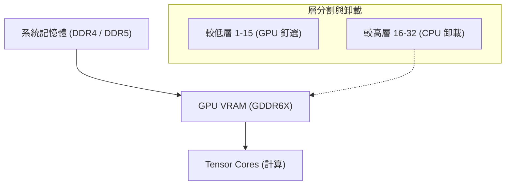
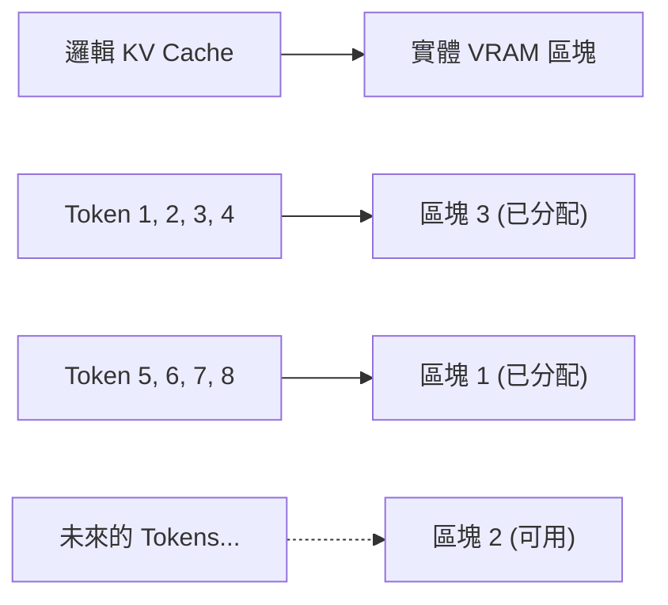
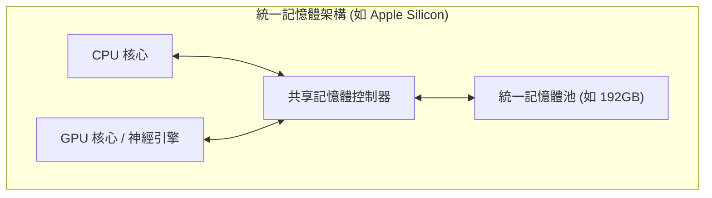
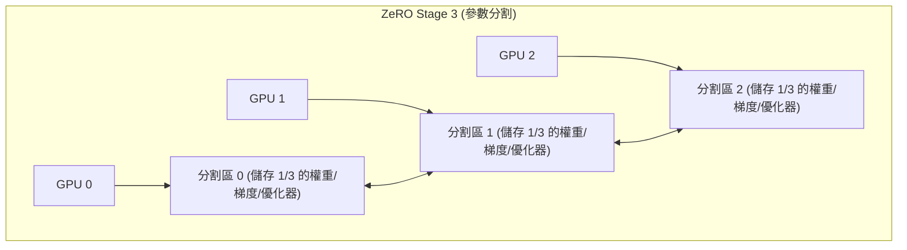

# 前言：AI開發與「VRAM之壁」

近年來，大型語言模型（LLM）和擴散模型（Diffusion Models）等生成式AI技術取得了飛速的發展。然而，當許多開發者和研究人員在本地環境中對這些最先進的AI模型進行訓練（微調）或推論（Inference）時，面臨了一個極其物理的障礙——**「GPU記憶體（VRAM）不足」**。

即使是NVIDIA GeForce RTX 4090等消費級高階GPU，其VRAM最大也只有24GB，根本無法直接載入像Llama 3 70B這樣巨大的模型。而資料中心級別的H100（80GB）或B200（192GB）等則非常昂貴，並非個人或小團隊能輕易使用。如果無法突破這道「VRAM之壁（The Wall of VRAM）」，就連接觸最先進模型的機會都沒有。

本文將從推論和訓練兩個方面，深入解說如何透過軟體和硬體架構的巧思，打破VRAM限制這個物理性約束的高階技巧。我們將結合數學公式和圖解，深入探討CPU卸載、KV Cache最佳化、梯度檢查點（Gradient Checkpointing），以及最新的統一記憶體（Unified Memory）架構。閱讀本文後，您將深刻理解VRAM的運作機制，並掌握在有限資源下處理巨大模型的實務知識。

---

# 1. AI模型VRAM消耗解析（推論與訓練）

解決VRAM不足的第一步，必須先從微觀的角度準確掌握「是什麼」以及「消耗了多少」記憶體。與其將其視為黑盒子，不如使用數學公式進行精確估算，這樣才能選擇合適的最佳化方法。

## 1.1 模型參數（權重）的記憶體計算

構成AI模型的參數（Weights）所消耗的基本記憶體量，是由模型的總參數數量以及表示這些參數的資料型別（Precision：精度）所決定的。

深度學習中常用的資料型別，以及每個參數所佔用的位元組數（$B$）如下：
- **FP32 (單精度浮點數):** 4 bytes (標準訓練時的精度)
- **FP16 / BF16 (半精度浮點數):** 2 bytes (一般的推論及混合精度訓練)
- **INT8 (8位元整數):** 1 byte (量化模型)
- **INT4 (4位元整數量化):** 0.5 bytes (GPTQ, AWQ, GGUF等極度量化)

假設模型整體的參數數量為 $P$，那麼單純由權重佔用的基礎記憶體量 $M_{weights}$ 可用以下公式表示：

$$ M_{weights} = P \times B $$

例如，若將Meta公開的「Llama 3 8B」模型（約80億參數）以FP16（半精度）載入，計算結果如下：

$$ M_{weights} = 8,000,000,000 \times 2 \text{ bytes} \approx 16,000,000,000 \text{ bytes} \approx 16 \text{ GB} $$

也就是說，純粹只將模型的權重載入GPU，就會消耗16GB的VRAM。在RTX 3060 (12GB) 上，這時候就會發生Out of Memory (OOM) 錯誤。然而，如果將模型量化為INT4，則為 $8 \times 0.5 = 4 \text{ GB}$，就能夠輕鬆載入。

## 1.2 推論時的記憶體消耗：KV Cache的增長

在LLM的推論（特別是自迴歸式的文字生成）中，與權重消耗相當，甚至更嚴重擠壓VRAM的元兇就是**KV Cache（Key-Value Cache）**。
在Transformer架構中，為了避免重新計算過去已經生成和處理過的Token資訊，會將各個注意力層（Attention Layer）中的Key和Value張量（Tensor）持續快取在VRAM中。這雖然能提升計算速度（Compute），但隨著上下文長度（輸入提示詞長度＋生成長度）的增加，記憶體消耗量將呈線性爆炸性增長。

處理1個Token時所消耗的KV Cache記憶體量 $M_{kv\_token}$，可根據模型架構透過以下公式嚴格計算出來：

$$ M_{kv\_token} = 2 \times N_{layers} \times N_{heads\_kv} \times D_{head} \times B $$

這裡各變數的意義如下：
- $2$ : 因為存在Key和Value兩個張量
- $N_{layers}$ : Transformer的層數 (Layer)
- $N_{heads\_kv}$ : KV注意力頭數（如果是GQA: Grouped Query Attention，會比一般的頭數少）
- $D_{head}$ : 各注意力頭的維度數（通常為隱藏層的維度數 $D_{model} / N_{heads}$）
- $B$ : 資料型別的位元組數（FP16為2）

整體的KV Cache量 $M_{kv\_total}$，則是將這個值乘以序列長度（$L_{seq}$）和批次大小（$BatchSize$）。

$$ M_{kv\_total} = M_{kv\_token} \times L_{seq} \times BatchSize $$

**具體範例：以Llama 2 7B為例**
- $N_{layers} = 32$
- $N_{heads\_kv} = 32$ (MHA的情況)
- $D_{head} = 128$
- FP16 ($B=2$)
- 批次大小 1，序列長度 8192 (8K上下文)

$$ M_{kv\_total} = 2 \times 32 \times 32 \times 128 \times 2 \times 8192 \times 1 = 4,294,967,296 \text{ bytes} \approx 4 \text{ GB} $$

如果將上下文長度延伸到32K（32768 Tokens），光是KV Cache就會消耗約16GB。若將批次大小增加到4，就會高達64GB。相比模型本身的體積，在推論時往往會要求大得多的VRAM，這是一大挑戰。

## 1.3 訓練時的記憶體消耗：優化器、梯度與激勵值

與推論時相比，模型的訓練（預訓練或微調）會消耗多得多的VRAM。這是因為不只要進行單純的前向傳播（Forward Pass），還必須保留反向傳播（Backward Pass）所需的資訊。訓練時的記憶體主要由以下4個要素構成：

1. **模型權重 (Model Weights):** 與推論時相同，但在混合精度訓練中，有時會同時保留FP16和FP32（主權重）。
2. **梯度 (Gradients):** 透過反向傳播計算出的每個參數的梯度。在FP16的情況下，每個參數佔2位元組。
3. **優化器狀態 (Optimizer States):** AdamW等進階優化器，會針對每個參數保留一階動量（Momentum）和二階動量（Variance）。為了保持訓練的穩定性，這些通常以FP32（4位元組）保存。也就是說，兩個動量會消耗 $4 + 4 = 8$ 位元組/參數。
4. **激勵值 (Activations):** 為了計算反向傳播的梯度，必須將前向傳播時各層的輸出（中間狀態）保存在記憶體中。這與批次大小和序列長度有很強的相關性，會變得非常巨大。

總結來說，在使用標準Adam優化器的混合精度訓練（Mixed Precision Training）中，每個參數大約需要**16到20位元組**（主權重4 + FP16權重2 + 梯度2 + 優化器8 + α）的記憶體。

$$ M_{train\_param} \approx P \times 16 \text{ bytes} $$

要訓練7B（70億參數）的模型，光是參數相關的記憶體就需要 $7B \times 16 = 112 \text{ GB}$，再加上激勵值，計算起來將需要超過140GB的VRAM。要在24GB的VRAM上執行此操作，必須採用下一章將要解說的強大最佳化技術。

---

# 2. 推論時的VRAM節省技巧

為了在推論時運行巨大的模型，目前已經開發了許多跨越硬體界限的軟體技術。

## 2.1 CPU卸載（CPU Offloading）與模型層分割

當巨大的模型無法完全裝入單一或多個GPU時，將模型的一部分配置到系統記憶體（CPU RAM）中，並在需要時才傳輸到GPU進行計算的手法稱為**CPU卸載（CPU Offloading）**。`llama.cpp`和Hugging Face的`Accelerate`等工具都支援此功能。



**機制與挑戰:**
由於Transformer模型採用層（Layer）串聯堆疊的結構，在某一層的計算完成之前，下一層的計算不會開始。利用這點，我們只將能夠裝入GPU的層（例如：第1到15層）常駐（釘選）在VRAM中，並將剩餘的層（第16到32層）放在容量大但速度慢的CPU RAM中。推論過程中，當第15層的計算完成後，會透過PCIe匯流排將第16層的權重從CPU傳輸（複製）到GPU，接著在GPU上執行計算。

然而，**PCIe的頻寬（Bandwidth）會成為嚴重的瓶頸**。PCIe 4.0 x16的理論最大頻寬為32GB/s（單向），與最新GPU的VRAM內部頻寬（例如RTX 4090的GDDR6X為1008GB/s，H100的HBM3更是超過3TB/s）相比，慢了兩個數量級，因此若過度依賴CPU卸載，推論速度（Tokens per Second）將會急劇下降。
為了將速度降低的程度降至最低，實務上的重點在於盡可能將更多的層載入GPU（最大化GPU Layers），並將卸載的層數減至最少。

## 2.2 KV Cache量化與PagedAttention

針對推論時消耗VRAM的元兇「KV Cache」，目前也有兩種強大的最佳化技術。

**1. KV Cache量化 (KV Cache Quantization):**
不只是模型的權重，這個方法將執行時動態生成的KV Cache本身，也以INT8、INT4甚至FP8進行量化後再儲存於VRAM中。藉此可將KV Cache的大小縮減至二分之一或四分之一。最新的推論引擎（如vLLM或llama.cpp）已經內建了這個功能，能在將精確度下降幅度降至最低的同時，大幅節省VRAM。

**2. PagedAttention:**
vLLM這個推論引擎導入的**PagedAttention**，是將作業系統虛擬記憶體的「分頁（Paging）」概念應用於KV Cache。在傳統的推論引擎中，會根據設定的最大序列長度，預先分配（Pre-allocation）連續的VRAM空間。因此，當實際輸入較短時，就會產生碎片化（Fragmentation）或浪費未使用的記憶體，有時甚至會浪費掉60%以上的VRAM。

PagedAttention會將KV Cache分割成固定大小的區塊（Page），並允許將它們分散儲存在不連續的實體記憶體空間中。這樣一來，記憶體的浪費幾乎降至零（僅限於內部碎片），即使在相同的VRAM容量下，也能夠大幅提升批次大小。



## 2.3 FlashAttention：打破注意力計算的記憶體複雜度

VRAM不足的問題，不僅來自於儲存資料所需的記憶體量，還因為計算過程中的「暫存工作區間」不足所引起。標準Transformer的自我注意力（Self-Attention）機制，針對序列長度 $N$，必須在VRAM上具體化（Materialize）出一個 $N \times N$ 的巨大注意力矩陣。這會讓記憶體複雜度變成 $O(N^2)$，成為長上下文中發生OOM的主因。

解決這個問題的技術就是**FlashAttention**（及其後續的FlashAttention-2, 3）。
FlashAttention是一種有意識地配合GPU硬體架構（巨大但慢速的HBM，與極小但超高速的SRAM所構成的階層結構）而設計的演算法。它利用稱為平鋪（Tiling）的手法，將資料分塊載入SRAM，並在其中完成注意力計算，徹底避免了將 $N \times N$ 的矩陣寫入HBM（VRAM）的過程。

透過這項技術，注意力層的記憶體複雜度從 $O(N^2)$ 急劇下降到 $O(N)$（與序列長度成正比），從而大幅放寬了上下文長度的限制。

## 2.4 統一記憶體（Unified Memory）的崛起與Apple Silicon

從PC架構的根本來解決這個問題的，是Apple Silicon（M1/M2/M3/M4系列的Max或Ultra），以及部分最新APU（如AMD Strix Point等）所採用的**統一記憶體架構（Unified Memory Architecture: UMA）**。

在這些架構中，主機板上的CPU和GPU共享完全相同的實體記憶體（例如高達192GB的LPDDR5）。因此，物理上根本不存在「從CPU到GPU透過PCIe進行慢速資料傳輸」的概念。



這個架構最大的優勢在於，不存在VRAM這樣明確的界限，系統記憶體的幾乎整個區域都可以直接用來載入巨大的LLM。如果是一台擁有192GB統一記憶體的Mac Studio，就可以將70B等級或更巨大的模型（例如Grok-1等）在不經過量化的情況下載入單一設備中，並進行高速推論。以M2 Ultra為例，記憶體存取頻寬也達到了800GB/s，足以媲美消費級獨立顯示卡。這是一種從硬體層面解決「記憶體容量」與「頻寬」兩難的極其強大的方法。

---

# 3. 訓練（微調）時的VRAM節省技巧

在要求比推論更多VRAM的訓練（Training）階段，也出現了許多突破。為了在有限資源下進行微調，結合以下技術是不可或缺的。

## 3.1 梯度檢查點（Gradient Checkpointing）

在深度學習的反向傳播（Backward Pass）中，為了計算梯度，必須將前向傳播（Forward Pass）中所有層的中間輸出（Activations）保存在記憶體中。當序列長度或批次大小變大時，這些激勵值記憶體就會開始佔據主導地位。

**梯度檢查點（Gradient Checkpointing / Activation Recomputation）**是一種利用記憶體容量與計算時間（Compute）進行權衡的天才技巧。
它不將所有中間輸出保存在記憶體中，而是只保存特定層（檢查點）的輸出。當反向傳播需要未被檢查點保存的中間數值時，**就會從已保存的最近檢查點開始，重新計算一次前向傳播以還原該數值**。

雖然計算量會增加約20%至30%，整體的訓練時間會拉長，但可以將激勵值所消耗的VRAM從 $O(N)$（$N$為層數）急劇減少至 $O(\sqrt{N})$。在目前大規模模型的訓練中，這可以說是沒有它就無法開始的必要設定項目。

## 3.2 LoRA 與 QLoRA (Low-Rank Adaptation)

從根本上解決VRAM不足問題的核心技術，是PEFT（Parameter-Efficient Fine-Tuning）的代表作：**LoRA**。

它將模型原本巨大的權重矩陣 $W_0 \in \mathbb{R}^{d \times k}$ 凍結（Frozen）且不參與訓練。取而代之的是，並行導入兩個非常小、低秩（Low-Rank）的矩陣 $A \in \mathbb{R}^{r \times k}$ 和 $B \in \mathbb{R}^{d \times r}$，並且只訓練這兩個矩陣 $A$ 和 $B$（這裡的秩 $r$ 是一個極小的值，滿足 $r \ll d, k$）。

$$ W_{adapted} = W_0 + \Delta W = W_0 + B A $$

這樣一來，需要訓練的參數數量將變成原本的不到1%（有時甚至不到0.1%），隨之而來的是，原本大量消耗記憶體的「梯度」和「優化器狀態」也急劇減少到不到1%。

更進一步將其發揮到極致的是**QLoRA (Quantized LoRA)**。
在QLoRA中，基礎模型的權重 $W_0$ 被極度量化為4位元（NF4: NormalFloat4格式）並載入VRAM。同時，為了保持計算精度，LoRA的小型矩陣 $A, B$ 則以BF16（16位元）進行訓練。
透過4位元量化，將基礎模型的VRAM大小縮小為原來的四分之一，並搭配使用稱為**Paged Optimizers**（分頁優化器）的技術，在VRAM快要耗盡時，會暫時將優化器的狀態自動退避（卸載）到CPU RAM。這樣一來，即使是單張24GB VRAM（如RTX 4090等）的GPU，也能對Llama 3 70B等超大模型進行微調。

## 3.3 DeepSpeed ZeRO 與 卸載技術

在使用多個GPU（多GPU環境）的情況下，單純的資料平行化（Data Parallelism）無法解決VRAM的問題。因為每個GPU都會保留一份完整模型的副本，這無法突破個別VRAM容量的限制。

由Microsoft開發的**DeepSpeed**函式庫中的**ZeRO (Zero Redundancy Optimizer)**，是一項將模型的參數、梯度和優化器狀態徹底分割（Shard）到多個GPU之間的技術。藉此可以將多個GPU的VRAM「總和」視為一個巨大的記憶體池來使用。



- **ZeRO Stage 1:** 將優化器狀態分割到各個GPU
- **ZeRO Stage 2:** 梯度也分割到各個GPU
- **ZeRO Stage 3:** 模型參數（權重）本身也分割到各個GPU

此外，若使用 **ZeRO-Offload** 功能，可以將被ZeRO分割的優化器狀態或梯度更新計算，不再由GPU執行，而是**卸載到CPU記憶體**，由主機（Host）CPU來執行。藉此能將GPU VRAM的負擔減到最低，即使在有限的GPU環境中也能訓練巨大模型。雖然因為在CPU中進行計算並透過PCIe將結果傳回GPU會導致訓練速度下降，但這可以避免發生「因記憶體不足而導致訓練崩潰」的最糟情況。

---

# 4. 實作範例：Hugging Face Accelerate 與 DeepSpeed

最後，我們將展示一個簡單的範例，說明如何在Python程式碼中實際實作CPU卸載和VRAM最佳化。

## 4.1 使用 Hugging Face `device_map="auto"` 的自動卸載

當使用Hugging Face的`transformers`和`accelerate`函式庫載入模型時，它們會自動幫我們在GPU和CPU之間進行層分割。

```python
from transformers import AutoModelForCausalLM, AutoTokenizer

model_id = "meta-llama/Llama-2-13b-hf"

# 透過 device_map="auto"，無法裝入VRAM的部分會被卸載到CPU RAM
# 透過 load_in_8bit=True 將權重進行8位元量化，進一步節省記憶體
model = AutoModelForCausalLM.from_pretrained(
    model_id,
    device_map="auto",
    load_in_8bit=True,
    offload_folder="offload_dir" # 空間不足時甚至可以卸載到磁碟（SSD）
)
```

執行這段程式碼時，背後的`accelerate`函式庫會分析系統的VRAM和CPU RAM的可用容量，並以最佳的方式配置（Dispatch）所有的層。

## 4.2 DeepSpeed 的 CPU 卸載設定 (ZeRO-2)

這是一個在訓練時啟用DeepSpeed CPU卸載的設定檔（JSON）範例。

```json
{
  "fp16": {
    "enabled": true
  },
  "zero_optimization": {
    "stage": 2,
    "offload_optimizer": {
      "device": "cpu",
      "pin_memory": true
    },
    "allgather_partitions": true,
    "allgather_bucket_size": 2e8,
    "overlap_comm": true,
    "reduce_scatter": true,
    "reduce_bucket_size": 2e8,
    "contiguous_gradients": true
  },
  "train_batch_size": 16,
  "gradient_accumulation_steps": 4
}
```
在這個設定中，透過將 `offload_optimizer` 指定為 `"cpu"`，可以讓大量消耗VRAM的優化器（如Adam等）狀態保留與更新計算在系統端的CPU上執行。這樣就能讓GPU的VRAM專心處理模型的前向/反向計算這個最重要的任務。透過設定 `pin_memory: true` 可以防止分頁錯誤（Page Fault），盡可能加快CPU-GPU之間的PCIe傳輸。

---

# 總結

在AI開發中，GPU記憶體不足（Out of Memory）是一個隨著模型規模擴大而將永遠伴隨開發者的課題。然而，透過適當組合本文解說的硬體（架構）的深度理解，以及軟體與演算法層面的最佳化技巧，即使是在看似不可能的本地環境下，也能夠推論或訓練巨大的模型。

**推論時的對策總結：**
1. **量化 (INT4 / INT8 / FP8):** 急劇壓縮模型本身的大小，減少VRAM的佔用量。
2. **CPU卸載:** 將無法裝入VRAM的層轉移到系統記憶體（須衡量PCIe頻寬導致的速度下降之取捨）。
3. **KV Cache最佳化:** 利用分頁（PagedAttention）、快取量化或FlashAttention來確保上下文長度（Context Length）。
4. **活用統一記憶體:** 活用Apple Silicon等UMA架構，將大容量記憶體直接用於推論。

**訓練時的對策總結：**
1. **PEFT (LoRA / QLoRA):** 限定訓練的參數，並將基礎模型量化至極限。
2. **梯度檢查點 (Gradient Checkpointing):** 放棄保留前向傳播的中間輸出，在反向傳播時重新計算，以計算時間換取VRAM消耗的降低。
3. **ZeRO & CPU卸載 (DeepSpeed):** 將優化器狀態或梯度在多個GPU間分割，或是卸載至CPU記憶體，藉以突破VRAM的極限。

善用這些高階技術，在有限的硬體資源中發揮出最大的AI開發效能吧。在這個日新月異的領域中，未來可以期待更多新的記憶體節省演算法出現。定期關注最新函式庫的動向，並將其導入實作中，將會是成功的關鍵。

