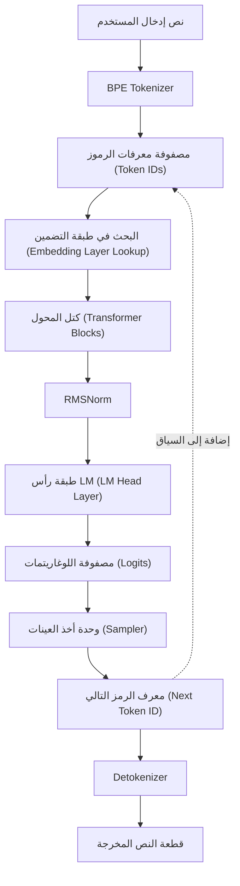
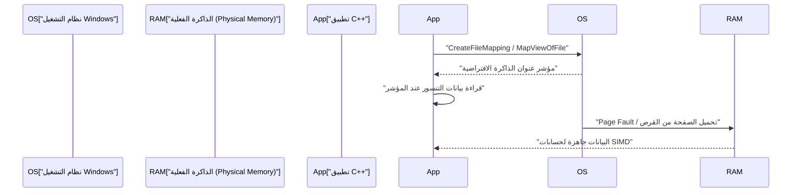
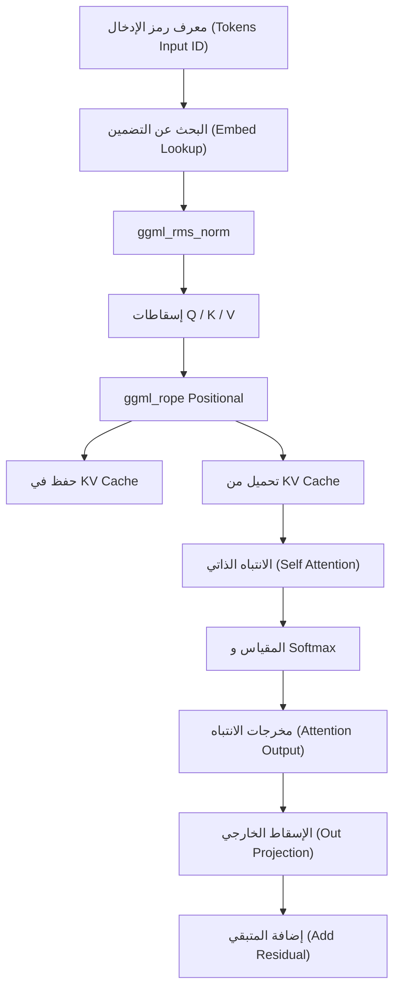

# دليل تطوير نماذج الذكاء الاصطناعي الصغيرة (مثل TinyLLaMA) باستخدام C++

في الآونة الأخيرة، ازداد الاهتمام بشكل سريع بتشغيل النماذج اللغوية الكبيرة (LLM) في البيئات المحلية. على وجه الخصوص، يمكن للنماذج الصغيرة مثل TinyLLaMA (بحجم 1.1 مليار معلمة) إجراء الاستدلال بسرعة عملية حتى على الأجهزة الطرفية ذات الموارد المحدودة أو أجهزة الكمبيوتر المحمولة العادية (بما في ذلك بيئات Windows). بينما يعتبر التطوير باستخدام Python و PyTorch هو السائد، إلا أنه عند السعي لتحقيق الأداء الأمثل وكفاءة الذاكرة، يصبح الجمع بين C++ ومكتبة التنسور "ggml" المعتمدة على لغة C هو المعيار الفعلي.

في هذا المقال، سنشرح خطوات تطوير مفصلة للغاية لبناء محرك استدلال من الصفر (أو فهم البنية الداخلية لـ llama.cpp الحالية بعمق) لتحميل TinyLLaMA وتوليد النصوص باستخدام C++.

---

## 1. لماذا C++ و ggml؟

في مرحلة تدريب الذكاء الاصطناعي، تتفوق Python بفضل مرونتها ونظامها البيئي الغني. ومع ذلك، في مرحلة النشر أو "الاستدلال (Inference)"، تصبح C++ خياراً قوياً للأسباب التالية:

1. **تقليل النفقات العامة (Overhead)**: يمكن القضاء تماماً على قفل المترجم العالمي (GIL) والنفقات العامة لوقت التشغيل في Python.
2. **كفاءة الذاكرة وتخصيص الساحة (Arena Allocation)**: نظراً لإمكانية التحكم اليدوي في تخصيص وتحرير الذاكرة، يمكن منع الزيادات غير المتوقعة الناتجة عن جمع القمامة (Garbage Collection).
3. **الوصول المباشر إلى الأجهزة**: استدعاء الوظائف المضمنة لـ SIMD (Intrinsics) مباشرة مثل AVX-512 و AVX2 و ARM NEON، مما يتيح استغلال قدرات الحوسبة لوحدة المعالجة المركزية إلى أقصى حد.
4. **التخلص من التبعيات**: ggml هي مكتبة C/C++ خالية من التبعيات (Zero dependencies)، ويمكن بناؤها بسهولة حتى في بيئة MSVC على Windows بمجرد توفر مترجم.

---

## 2. النظرة العامة على البنية

يوضح مخطط Mermaid التالي سير العمل في خط أنابيب الاستدلال بالكامل. إنها سلسلة من العمليات تبدأ من النص المدخل من قبل المستخدم وصولاً إلى توليد الرمز (Token) التالي.



نظراً لأنه نموذج انحدار ذاتي (Autoregressive)، تتم إضافة الرموز المخرجة مرة أخرى إلى السياق، وتدور كمدخلات لتوقع الرمز التالي (الجزء المتقطع في المخطط).

---

## 3. تنسيق النموذج وتخطيط الذاكرة (mmap)

تعد القراءة/الكتابة على القرص واستهلاك الذاكرة العائق الأكبر عند التعامل مع أوزان الشبكات العصبية الضخمة. في تطبيقات C++، يتم حل ذلك باستخدام **تخطيط الذاكرة (Memory Mapping - mmap)**.

### 3.1 كيفية عمل تخطيط الذاكرة وتطبيقه في Windows

باستخدام mmap، يمكن تعيين محتويات الملف مباشرة إلى مساحة الذاكرة الافتراضية للعملية.

* **نسخ صفري (Zero-copy)**: يتم تحميل البيانات مباشرة من القرص إلى ذاكرة التخزين المؤقت للصفحات في النواة (Kernel)، ولا يحدث نسخ إضافي إلى مساحة المستخدم.
* **التحميل عند الطلب (Page Fault)**: في اللحظة التي تصل فيها وحدة المعالجة المركزية فعلياً إلى عنوان الذاكرة ذلك، يحدث خطأ في الصفحة (Page Fault)، ويتم تحميل الكتلة المطلوبة فقط (عادة 4 كيلوبايت) في الذاكرة الفعلية.

في بيئة Windows، بدلاً من `mmap` الخاصة بـ POSIX، يتم استخدام واجهات برمجة تطبيقات Win32 `CreateFileMapping` و `MapViewOfFile`.



### 3.2 البنية الثنائية لتنسيق GGUF

يعد **GGUF (GPT-Generated Unified Format)**، المحول من تنسيقات مثل `.safetensors` الخاصة بـ Hugging Face، التنسيق النهائي للاستدلال. يحتوي على المخطط الثنائي الصارم التالي:

1. **البتات السحرية (Magic Bytes)**: `0x46554747` (GGUF).
2. **الإصدار (Version)**: رقم إصدار التنسيق.
3. **عدد التنسورات وعدد البيانات الوصفية (Tensor & Metadata Count)**: عدد التنسورات وأزواج المفتاح-القيمة للبيانات الوصفية.
4. **البيانات الوصفية (Metadata)**: مفاتيح ببادئات طول السلسلة وقيم محددة النوع.
5. **معلومات التنسور (Tensor Info)**: اسم كل تنسور، عدد الأبعاد، نوع البيانات (FP16، Q4_K، إلخ)، وموقع الإزاحة داخل الملف.
6. **الحشو (Padding)**: حشوات مدرجة لمحاذاة بيانات التنسور مع حدود معينة (عادة 32 بايت أو 64 بايت). هذا ضروري للوصول السريع للذاكرة في تعليمات SIMD (وخاصة AVX).
7. **بيانات التنسور (Tensor Data)**: مصفوفة بيانات الأوزان الفعلية المحاذاة.

---

## 4. الأساس الرياضي لـ TinyLLaMA وخوارزميات C++

يعتمد TinyLLaMA بعض الابتكارات المعمارية المتقدمة لزيادة الكفاءة. سنشرح التمثيلات الرياضية لتنفيذها بشكل صحيح في C++.

### 4.1 التقييس الجذري لمتوسط المربعات (RMSNorm)

يقلل التكلفة الحسابية عن طريق حذف مركزة المتوسط من LayerNorm وتنفيذ قياس التباين فقط.

$$ \text{RMSNorm}(x) = \frac{x}{\sqrt{\frac{1}{d}\sum_{i=1}^{d} x_i^2 + \epsilon}} \odot \gamma $$

حيث $d$ هو عدد الأبعاد، و $\gamma$ هو تنسور المقياس المُدرَّب.
عند التنفيذ بـ C++، نقوم أولاً بحساب مجموع مربعات المصفوفة بسرعة باستخدام `_mm256_fmadd_ps` في AVX2، وتحسينه عن طريق ضربه بالجذر التربيعي العكسي (مثل تعليمة `_mm256_rsqrt_ps`).

### 4.2 التضمين الموضعي الدوار (RoPE)

هي تقنية لتطبيق معلومات موقع الرمز كدوران (Rotate) في مساحة التنسور. يمكن اعتبارها دوراناً على مستوى الأعداد المركبة، ويتم تطبيق الدوران التالي على الأزواج البعدية المتجاورة $(x_1, x_2)$ للمتجه $x$:

$$ \text{RoPE}(x, m) = \begin{pmatrix} x_{1} \cos(m\theta) - x_{2} \sin(m\theta) \\ x_{1} \sin(m\theta) + x_{2} \cos(m\theta) \end{pmatrix} $$

حيث $m$ هو المؤشر الموضعي المطلق للرمز، و $\theta$ هو التردد الأساسي المحسوب مسبقاً. في ggml، يتم تنفيذه بالتوازي ببساطة عن طريق إضافة عامل `ggml_rope` أثناء بناء رسم الاستدلال البياني.

### 4.3 الانتباه المجمع للاستعلام (Grouped-Query Attention - GQA)

في الانتباه متعدد الرؤوس (MHA) العادي، يوجد نفس عدد الرؤوس لكل من Query و Key و Value. ومع ذلك، لتقليل استهلاك عرض النطاق الترددي للذاكرة وذاكرة التخزين المؤقت KV بشكل كبير، يعتمد TinyLLaMA **Grouped-Query Attention (GQA)**.

$$ \text{Attention}(Q, K, V) = \text{softmax}\left(\frac{Q K^T}{\sqrt{d_k}}\right) V $$

في GQA، تشترك عدة رؤوس Query في رأس Key/Value واحد. في تطبيق C++، قبل إجراء ضرب المصفوفات `ggml_mul_mat`، من الضروري إجراء عملية بث (Broadcast) لتنسورات KV لتتناسب مع عدد Query.

### 4.4 دالة التنشيط SwiGLU

في طبقة الشبكة المغذية للأمام (FFN)، يتم استخدام SwiGLU بدلاً من GELU.

$$ \text{SwiGLU}(x) = \text{Swish}(x W_{\text{gate}}) \otimes (x W_{\text{up}}) $$
$$ \text{Swish}(z) = z \cdot \sigma(z) = z \cdot \frac{1}{1 + e^{-z}} $$

يتم تمثيله في الرسم البياني الحسابي بدمج عاملي `ggml_silu` و `ggml_mul`.

---

## 5. بناء الرسم البياني الحسابي وإدارة الذاكرة باستخدام ggml

تعتمد ggml نهج "التحديد والتنفيذ (Define-and-Run)"، حيث تقوم ببناء رسم بياني حسابي ثابت للاستدلال ثم تقييمه (evaluate) لاحقاً.

### 5.1 ggml_context ومخصص الساحة (Arena Allocator)

الميزة الأكثر تميزاً في ggml هي "تخصيص الساحة"، الذي لا ينفذ أي تخصيص ديناميكي للذاكرة (`malloc` أو `new`) داخل حلقة الاستدلال.
يتم تخصيص منطقة ذاكرة متصلة ضخمة (الساحة) عند التهيئة، وفي كل مرة يتم فيها استدعاء `ggml_new_tensor` وغيره، يزداد مؤشر هذه المنطقة. عند اكتمال خطوة استدلال واحدة، يتم فقط إعادة تعيين مؤشر التخصيص إلى الموضع الأولي، وبذلك يكتمل تخصيص الذاكرة لخطوة الاستدلال التالية على الفور.

### 5.2 مثال عملي لبناء الرسم البياني

في كل خطوة استدلال، يتم تجميع الرسم البياني الحسابي التالي في الذاكرة.



---

## 6. التكميم (Quantization) وتحسين Windows / SIMD

يتطلب التعامل مع TinyLLaMA (1.1B) بصيغة FP16 حوالي 2.2 جيجابايت من الذاكرة، ولكن باستخدام تكميم 4-بت (مثل Q4_K) يمكن ضغطه بشكل كبير إلى حوالي 600 ميجابايت.

### 6.1 بنية التكميم الكتلي (Block Quantization)

لا تقوم ggml بتكميم التنسور بأكمله بشكل موحد، بل يتم ذلك على أساس "الكتلة".
في تنسيق `Q4_0`، يتم تجميع 32 قيمة FP16 في كتلة واحدة.
- **عامل المقياس (Scale Factor)**: قيمة واحدة FP16 (2 بايت)
- **البيانات المكممة**: 32 قيمة 4-بت (16 بايت)
هذا يقلل من تأثير القيم المتطرفة المحلية.

### 6.2 تسريع الضرب النقطي باستخدام AVX2

عند البناء لأحدث وحدات المعالجة المركزية x86 في بيئة Windows، مع الاستفادة من علامات المترجم مثل `/arch:AVX2`، تتم معالجة SIMD عبر التدفق التالي:

1. **التحميل (Load)**: تحميل بيانات التكميم 4-بت من الذاكرة إلى سجلات AVX بحجم 256 بت.
2. **التوسيع وفك الحزم (Unpack)**: استخدام أقنعة البت (Bitmasks) وعمليات الإزاحة لتوسيع قيم 4-بت إلى Int8 أو Int16.
3. **إلغاء التكميم (Dequantize)**: الضرب في عامل المقياس للتحويل إلى فاصلة عائمة.
4. **عمليات FMA**: تنفيذ عمليات الضرب والجمع بالتوازي على قيم التنشيط باستخدام `_mm256_fmadd_ps` (Fused Multiply-Add).

---

## 7. تفاصيل تنفيذ ذاكرة التخزين المؤقت KV (KV Cache)

في التوليد التلقائي الانحداري، تعد "ذاكرة التخزين المؤقت KV" لتجاوز حسابات Key و Value للرموز السابقة ميزة أساسية.

فيما يلي النقاط الرئيسية عند تنفيذ ذلك بـ C++:
1. **التخصيص المسبق للتنسور**: تهيئة تنسور ضخم لذاكرة التخزين المؤقت KV بحجم الحد الأقصى لطول السياق (مثال: 2048 رمزاً) (يُفضل FP16).
2. **نسخ الإزاحة (Offset Copy)**: عند الحساب للموضع الرمزي $N$، يتم تخزين متجهات K و V الناتجة في تلك الخطوة في الصف $N$ من تنسور التخزين المؤقت KV باستخدام دوال مثل `ggml_cpy`.
3. **إنشاء مشهد (View) أثناء الانتباه**: عند حساب الانتباه، يتم تمرير "مشهد" يشير فقط إلى أجزاء الرموز من 0 إلى $N$ لضرب المصفوفات.

---

## 8. BPE Tokenizer وفك التشفير (Decoding)

تتم معالجة السلسلة المدخلة كتسلسل بايتات UTF-8 وتتم مطابقتها مع مفردات محددة مسبقاً. في C++، لتسريع البحث في المفردات، يتم تنفيذ خوارزميات مثل **شجرة البادئة (Trie Tree)** أو قوائم الانتظار ذات الأولوية.

من سجلات Logits الناتجة عن LM Head، يتم قياس الاحتمالات باستخدام معلمة درجة الحرارة (Temperature)، ويتم تضييق المرشحين باستخدام استخراج Top-K أو أساليب Top-P (Nucleus Sampling)، ويتم تحديد الرمز التالي النهائي باستخدام أرقام عشوائية.

---

## 9. إعداد مشروع C++ (بيئة Windows / PowerShell)

```cmake
cmake_minimum_required(VERSION 3.14)
project(TinyLLaMACpp)

set(CMAKE_CXX_STANDARD 17)

# إعدادات التحسين وعلامات AVX2 لـ Windows (MSVC)
if(MSVC)
    add_compile_options(/O2 /arch:AVX2 /fp:fast)
    add_link_options(/STACK:8388608)
else()
    add_compile_options(-O3 -march=native -ffast-math)
endif()

add_library(ggml OBJECT ggml/ggml.c ggml/ggml-alloc.c)
target_compile_definitions(ggml PRIVATE GGML_USE_AVX2 GGML_USE_F16C GGML_USE_FMA)

add_executable(main main.cpp)
target_link_libraries(main ggml)
```

مثال لأمر البناء في PowerShell:
```powershell
mkdir build
cd build
cmake .. -G "Visual Studio 17 2022" -A x64
cmake --build . --config Release
```

---

## 10. الخلاصة

يعد تنفيذ محرك استدلال لنموذج ذكاء اصطناعي صغير مثل TinyLLaMA من الصفر باستخدام C++ و ggml فرصة رائعة لكشف الصندوق الأسود للتعلم العميق وتعلم جمال التحكم في الأجهزة منخفضة المستوى. باستخدام التحميل بنسخ صفري المعتمد على تخطيط الذاكرة، وتحسينات SIMD، وبناء ذاكرة التخزين المؤقت KV، دعونا نفتح آفاقاً جديدة لمستقبل الذكاء الاصطناعي الطرفي (Edge AI) بينما نستمتع بجوهر برمجة الأنظمة.
