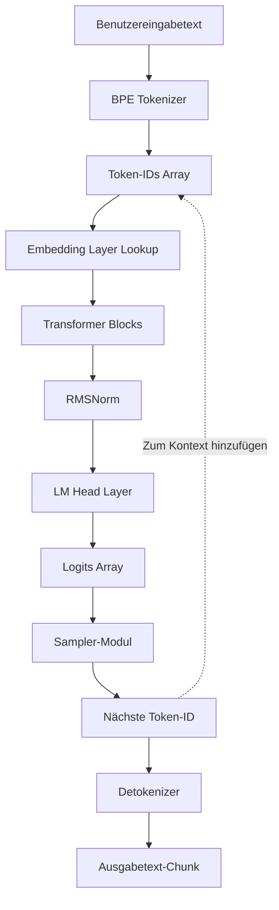
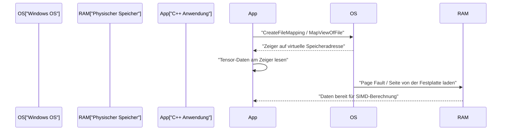
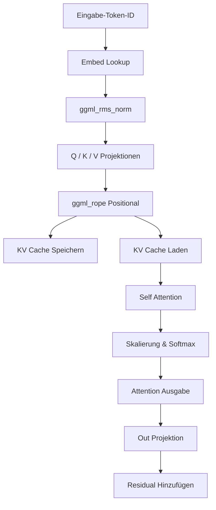

# Entwicklungsschritte für kleine KI-Modelle (wie TinyLLaMA) mit C++

In den letzten Jahren ist das Interesse an der Ausführung von Large Language Models (LLMs) in lokalen Umgebungen rasant gestiegen. Insbesondere kleine Modelle wie TinyLLaMA (1,1B Parameter) können selbst auf Edge-Geräten mit begrenzten Ressourcen oder herkömmlichen Laptops (einschließlich Windows-Umgebungen) mit praktischer Geschwindigkeit für Inferenzen genutzt werden. Während die Entwicklung hauptsächlich mit Python und PyTorch erfolgt, ist die Kombination aus C++ und „ggml“, einer C-basierten Tensor-Bibliothek, zum De-facto-Standard geworden, wenn es darum geht, die ultimative Leistung und Speichereffizienz zu erreichen.

In diesem Artikel werden wir die detaillierten Entwicklungsschritte erläutern, um eine Inferenz-Engine von Grund auf aufzubauen (oder die interne Struktur der bestehenden llama.cpp tiefgehend zu verstehen), mit der TinyLLaMA in C++ geladen und Text generiert wird.

---

## 1. Warum C++ und ggml?

In der Trainingsphase von KI ist Python mit seiner Flexibilität und seinem umfangreichen Ökosystem überwältigend im Vorteil. In der Bereitstellungs- oder „Inferenz“-Phase wird C++ jedoch aus den folgenden Gründen zu einer leistungsstarken Option.

1. **Reduzierung von Overhead**: Das Global Interpreter Lock (GIL) von Python und der Runtime-Overhead können vollständig eliminiert werden.
2. **Speichereffizienz und Arena-Allokation**: Da die Zuweisung und Freigabe von Speicher manuell gesteuert werden können, lassen sich unvorhersehbare Spitzen (Spikes) durch die Garbage Collection verhindern.
3. **Direkter Zugriff auf die Hardware**: SIMD-Intrinsics wie AVX-512, AVX2 und ARM NEON können direkt aufgerufen werden, um die Rechenleistung der CPU zu maximieren.
4. **Keine Abhängigkeiten**: ggml ist eine C/C++-Bibliothek ohne Abhängigkeiten (Zero dependencies) und kann problemlos auf Windows-Umgebungen mit MSVC kompiliert werden, solange ein Compiler vorhanden ist.

---

## 2. Gesamtbild der Architektur

Der Fluss der gesamten Inferenz-Pipeline ist im folgenden Mermaid-Diagramm dargestellt. Dies ist der Prozess vom Eingabetext des Benutzers bis zur endgültigen Generierung des nächsten Tokens.



Da es sich um ein autoregressives Modell handelt, wird das ausgegebene Token wieder dem Kontext hinzugefügt und als Eingabe für die Vorhersage des nächsten Tokens zyklisch verwendet (gestrichelte Linie im Diagramm).

---

## 3. Modellformat und Memory Mapping (mmap)

Das größte Hindernis beim Umgang mit den Gewichten riesiger neuronaler Netze sind Festplatten-I/O und Speicherverbrauch. In der C++-Implementierung wird dies durch **Memory Mapping (mmap)** gelöst.

### 3.1 Funktionsweise von Memory Mapping und Implementierung in Windows

Mit mmap kann der Inhalt einer Datei direkt in den virtuellen Adressraum des Prozesses abgebildet (gemappt) werden.

* **Zero-copy**: Die Daten werden von der Festplatte direkt in den Page-Cache des Kernels geladen, ohne dass eine zusätzliche Kopie in den Userspace erfolgt.
* **On-Demand-Laden (Page Fault)**: In dem Moment, in dem die CPU tatsächlich auf diese Speicheradresse zugreift, tritt ein Page Fault (Seitenfehler) auf, und nur der benötigte Chunk (normalerweise 4 KB) wird in den physischen Speicher geladen.

In Windows-Umgebungen werden anstelle des POSIX `mmap` die Win32-APIs `CreateFileMapping` und `MapViewOfFile` verwendet.



### 3.2 Binäre Struktur des GGUF-Formats

Das aus Formaten wie `.safetensors` von Hugging Face konvertierte **GGUF (GPT-Generated Unified Format)** ist das ultimative Format für Inferenzen. Es verfügt über das folgende strikte binäre Layout.

1. **Magic Bytes**: `0x46554747` (GGUF).
2. **Version**: Die Versionsnummer des Formats.
3. **Tensor Count & Metadata Count**: Anzahl der Tensoren und der Metadaten-Schlüssel-Wert-Paare.
4. **Metadata (Key-Value Pairs)**: Schlüssel mit Präfix für die Zeichenfolgenlänge und typisierte Werte.
5. **Tensor Info**: Name, Dimensionen, Datentyp (FP16, Q4_K usw.) jedes Tensors und die Offset-Position in der Datei.
6. **Padding**: Polsterung (Padding), die eingefügt wird, damit die Tensordaten an bestimmten Grenzen (normalerweise 32 oder 64 Byte) ausgerichtet (aligned) werden. Dies ist entscheidend für den schnellen Speicherzugriff mit SIMD-Befehlen (insbesondere AVX).
7. **Tensor Data**: Das eigentliche Array der ausgerichteten Gewichtsdaten.

---

## 4. Mathematische Grundlagen von TinyLLaMA und C++-Algorithmen

TinyLLaMA beinhaltet einige fortgeschrittene architektonische Tricks zur Effizienzsteigerung. Die mathematischen Ausdrücke zur korrekten Implementierung in C++ werden hier erläutert.

### 4.1 RMSNorm (Root Mean Square Normalization)

Die Rechenkosten werden reduziert, indem die Mittelwert-Zentrierung aus LayerNorm weggelassen und nur die Varianz-Skalierung durchgeführt wird.

$$ \text{RMSNorm}(x) = \frac{x}{\sqrt{\frac{1}{d}\sum_{i=1}^{d} x_i^2 + \epsilon}} \odot \gamma $$

$d$ ist die Anzahl der Dimensionen, $\gamma$ ist der gelernte Skalierungstensor.
Bei der Implementierung in C++ wird dies optimiert, indem zunächst die Summe der Quadrate des Arrays schnell mit AVX2s `_mm256_fmadd_ps` etc. berechnet wird und dann mit der inversen Quadratwurzel (z. B. `_mm256_rsqrt_ps` Befehl) multipliziert wird.

### 4.2 RoPE (Rotary Position Embedding)

Eine Technik, um die Positionsinformationen von Tokens als Rotation im Tensorraum anzuwenden. Es kann als Rotation auf einer komplexen Ebene betrachtet werden, wobei für benachbarte Dimensionspaare $(x_1, x_2)$ des Vektors $x$ die folgende Rotation angewendet wird.

$$ \text{RoPE}(x, m) = \begin{pmatrix} x_{1} \cos(m\theta) - x_{2} \sin(m\theta) \\ x_{1} \sin(m\theta) + x_{2} \cos(m\theta) \end{pmatrix} $$

Hier ist $m$ der absolute Positionsindex des Tokens und $\theta$ die vorberechnete Grundfrequenz. In ggml wird es parallel ausgeführt, indem einfach der `ggml_rope`-Operator während der Konstruktion des Inferenzgraphen hinzugefügt wird.

### 4.3 Grouped-Query Attention (GQA)

Bei der normalen Multi-Head Attention (MHA) gibt es die gleiche Anzahl von Heads für Query, Key und Value. TinyLLaMA verwendet jedoch **Grouped-Query Attention (GQA)**, um die Speicherbandbreite und den KV-Cache-Verbrauch drastisch zu reduzieren.

$$ \text{Attention}(Q, K, V) = \text{softmax}\left(\frac{Q K^T}{\sqrt{d_k}}\right) V $$

Bei GQA teilen sich mehrere Query-Heads einen Key/Value-Head. In der C++-Implementierung ist es erforderlich, den KV-Tensor so zu broadcasten (zu replizieren), dass er der Anzahl der Queries entspricht, bevor die Matrixmultiplikation `ggml_mul_mat` ausgeführt wird.

### 4.4 SwiGLU-Aktivierungsfunktion

Im Feed-Forward Network (FFN)-Layer wird anstelle von GELU SwiGLU verwendet.

$$ \text{SwiGLU}(x) = \text{Swish}(x W_{\text{gate}}) \otimes (x W_{\text{up}}) $$
$$ \text{Swish}(z) = z \cdot \sigma(z) = z \cdot \frac{1}{1 + e^{-z}} $$

Im Berechnungsgraphen wird dies durch eine Kombination aus dem `ggml_silu`-Operator und `ggml_mul` dargestellt.

---

## 5. Konstruktion des Berechnungsgraphen mit ggml und Speicherverwaltung

ggml verfolgt einen „Define-and-Run“-Ansatz, bei dem ein statischer Berechnungsgraph für die Inferenz konstruiert und anschließend evaluiert wird.

### 5.1 ggml_context und Arena-Allocator

Die einzigartigste Eigenschaft von ggml ist die „Arena-Allokation“, bei der in der Inferenzschleife keinerlei dynamische Speicherzuweisungen (`malloc` oder `new`) stattfinden.
Bei der Initialisierung wird ein riesiger zusammenhängender Speicherbereich (die Arena) reserviert, und bei jedem Aufruf von z. B. `ggml_new_tensor` wird der Zeiger dieses Bereichs inkrementiert. Sobald ein Inferenzschritt abgeschlossen ist, wird der Allokationszeiger einfach auf seine Ausgangsposition zurückgesetzt, wodurch die Speicherzuweisung für den nächsten Inferenzschritt sofort abgeschlossen ist.

### 5.2 Konkretes Beispiel für die Konstruktion eines Graphen

Für jeden Inferenzschritt wird der folgende Berechnungsgraph im Speicher aufgebaut.



---

## 6. Quantisierung (Quantization) und Windows / SIMD-Optimierung

Wenn TinyLLaMA (1,1B) in FP16 verwendet wird, werden etwa 2,2 GB Speicher benötigt, aber durch 4-Bit-Quantisierung (wie Q4_K) kann dies drastisch auf etwa 600 MB komprimiert werden.

### 6.1 Block-Quantisierungsarchitektur

ggml quantisiert nicht den gesamten Tensor einheitlich, sondern in „Blöcken“.
Im `Q4_0`-Format werden 32 FP16-Werte in einem Block zusammengefasst.
- **Skalierungsfaktor (Scale Factor)**: Ein FP16-Wert (2 Byte)
- **Quantisierte Daten**: 32 4-Bit-Werte (16 Byte)
Dadurch wird der Einfluss von lokalen Ausreißern (Outliers) minimiert.

### 6.2 Beschleunigung des Skalarprodukts durch AVX2

Beim Kompilieren für die neuesten x86-CPUs in einer Windows-Umgebung werden Compiler-Flags wie `/arch:AVX2` verwendet und die SIMD-Verarbeitung läuft im folgenden Fluss ab:

1. **Laden**: Die quantisierten 4-Bit-Daten werden aus dem Speicher in ein 256-Bit-AVX-Register geladen.
2. **Entpacken (Unpack)**: Die 4-Bit-Werte werden durch Bitmasken- und Shift-Operationen in Int8 oder Int16 entpackt.
3. **Dequantisierung**: Multiplikation mit dem Skalierungsfaktor zur Umwandlung in Gleitkommazahlen.
4. **FMA-Berechnung**: Parallele Ausführung der Multiply-Add-Operation mit den Aktivierungswerten über `_mm256_fmadd_ps` (Fused Multiply-Add).

---

## 7. Details zur Implementierung des KV-Caches

Bei der autoregressiven Generierung ist ein „KV-Cache“, der die Berechnung von Key und Value vergangener Tokens überspringt, eine zwingend erforderliche Funktion.

Bei der Implementierung in C++ sind die folgenden Punkte wichtig:
1. **Vorabreservierung des Tensors**: Ein riesiger Tensor für die maximale Kontextlänge (z. B. 2048 Tokens) wird für den KV-Cache initialisiert (FP16 wird empfohlen).
2. **Offset-Kopie**: Wenn die Berechnung für die Token-Position $N$ durchgeführt wird, werden die in diesem Schritt erhaltenen K- und V-Vektoren in der $N$-ten Zeile des KV-Cache-Tensors mithilfe von `ggml_cpy` o. Ä. gespeichert.
3. **Erstellung eines Views bei der Attention**: Bei der Berechnung der Attention wird ein „View“ (Ansicht) erstellt, der nur auf den Bereich der Tokens 0 bis $N$ verweist, und dieser View wird an die Matrixmultiplikation übergeben.

---

## 8. BPE Tokenizer und Dekodierung

Der Eingabe-String wird als Bytefolge in UTF-8 behandelt und mit einem vordefinierten Vokabular abgeglichen. Um die Vokabularsuche in C++ zu beschleunigen, werden Algorithmen implementiert, die **Trie-Bäume (Präfixbäume)** oder Prioritätswarteschlangen verwenden.

Die vom LM Head ausgegebenen Logits werden mithilfe des Temperature-Parameters skaliert, um Wahrscheinlichkeiten zu erhalten. Die Kandidaten werden durch Top-K-Extraktion oder Top-P-Methoden (Nucleus Sampling) eingegrenzt, und das endgültige nächste Token wird mithilfe von Zufallszahlen bestimmt.

---

## 9. Aufbau eines C++-Projekts (Windows / PowerShell-Umgebung)

```cmake
cmake_minimum_required(VERSION 3.14)
project(TinyLLaMACpp)

set(CMAKE_CXX_STANDARD 17)

# Optimierungs- und AVX2-Flags für Windows (MSVC)
if(MSVC)
    add_compile_options(/O2 /arch:AVX2 /fp:fast)
    add_link_options(/STACK:8388608)
else()
    add_compile_options(-O3 -march=native -ffast-math)
endif()

add_library(ggml OBJECT ggml/ggml.c ggml/ggml-alloc.c)
target_compile_definitions(ggml PRIVATE GGML_USE_AVX2 GGML_USE_F16C GGML_USE_FMA)

add_executable(main main.cpp)
target_link_libraries(main ggml)
```

Beispiel für einen Build-Befehl in PowerShell:
```powershell
mkdir build
cd build
cmake .. -G "Visual Studio 17 2022" -A x64
cmake --build . --config Release
```

---

## 10. Zusammenfassung

Die Implementierung einer Inferenz-Engine für kleine KI-Modelle wie TinyLLaMA von Grund auf mit C++ und ggml ist eine hervorragende Gelegenheit, die Blackbox des Deep Learning zu entschlüsseln und die Schönheit der Low-Level-Hardwaresteuerung kennenzulernen. Durch den Einsatz von Zero-Copy-Laden mithilfe von Memory Mapping, SIMD-Optimierung und dem Aufbau von KV-Caches können Sie das Wesentliche der Systemprogrammierung in vollen Zügen genießen und gleichzeitig die Zukunft der Edge-KI mitgestalten.
