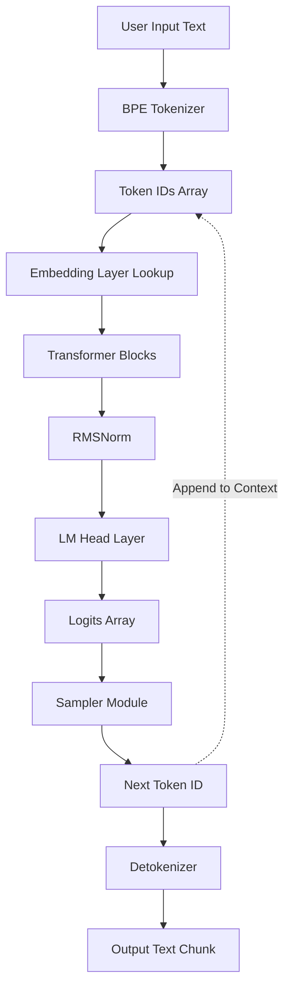
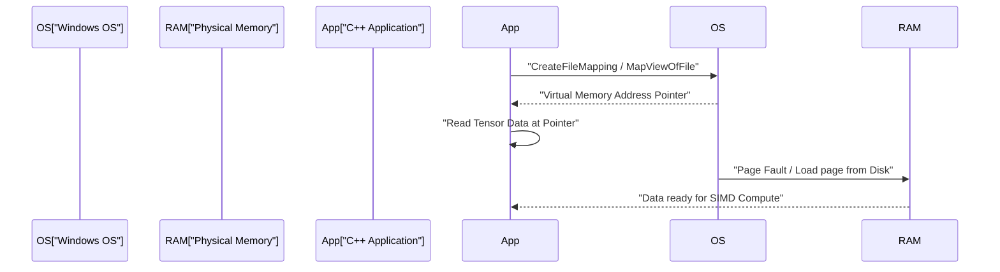
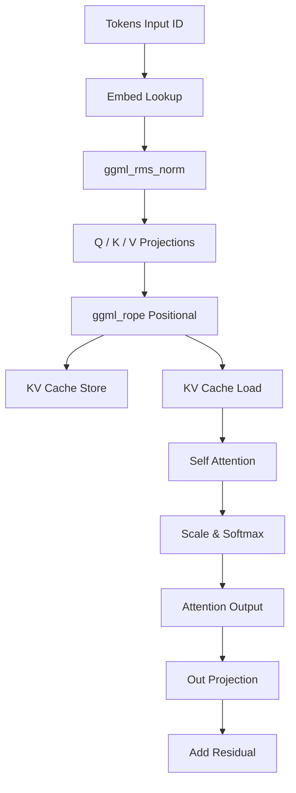

# Development Guide for Small AI Models (TinyLLaMA, etc.) Using C++

In recent years, interest in running Large Language Models (LLMs) in local environments has grown rapidly. In particular, small-scale models like TinyLLaMA (1.1B parameters) can perform inference at practical speeds even on limited-resource edge devices and typical laptops (including Windows environments). While development using Python and PyTorch is mainstream, when pursuing ultimate performance and memory efficiency, the combination of C++ and the C-based tensor library "ggml" has become the de facto standard.

This article provides an extremely detailed development guide for building an inference engine from scratch (or deeply understanding the internal structure of the existing llama.cpp) to load TinyLLaMA and generate text using C++.

---

## 1. Why C++ and ggml?

In the AI training phase, Python has an overwhelming advantage due to its flexibility and rich ecosystem. However, in the deployment or "Inference" phase, C++ becomes a powerful choice for the following reasons:

1. **Overhead Reduction**: The Python Global Interpreter Lock (GIL) and runtime overhead can be completely eliminated.
2. **Memory Efficiency and Arena Allocation**: By manually controlling memory allocation and deallocation, you can prevent unpredictable spikes caused by garbage collection.
3. **Direct Hardware Access**: By directly calling SIMD intrinsics such as AVX-512, AVX2, and ARM NEON, the CPU's computational power can be maximized.
4. **Zero Dependencies**: ggml is a zero-dependency C/C++ library. As long as you have a compiler, it can be easily built even in an MSVC environment on Windows.

---

## 2. Overall Architecture

The flow of the entire inference pipeline is shown in the Mermaid diagram below. This is a series of processes starting from the user's input text until the final next token is generated.



Since it is an autoregressive model, the output token is added back to the context and circulates as input for predicting the next token (the dotted line in the diagram).

---

## 3. Model Format and Memory Mapping (mmap)

The biggest hurdle in handling the weights of massive neural networks is disk I/O and memory consumption. In a C++ implementation, this is resolved with **memory mapping (mmap)**.

### 3.1 How Memory Mapping Works and its Windows Implementation

Using mmap allows you to map the contents of a file directly into the virtual memory space of the process.

* **Zero-copy**: Data is loaded directly from the disk into the kernel's page cache, preventing extra copies into user space.
* **On-Demand Loading (Page Fault)**: The moment the CPU actually accesses that memory address, a page fault occurs, and only the required chunk (usually 4KB) is loaded into physical memory.

In a Windows environment, the Win32 APIs `CreateFileMapping` and `MapViewOfFile` are used instead of POSIX `mmap`.



### 3.2 Binary Structure of the GGUF Format

Converted from formats like Hugging Face's `.safetensors`, the **GGUF (GPT-Generated Unified Format)** is the ultimate format for inference. It has the following strict binary layout:

1. **Magic Bytes**: `0x46554747` (GGUF).
2. **Version**: Format version number.
3. **Tensor Count & Metadata Count**: The number of tensors and key-value metadata pairs.
4. **Metadata (Key-Value Pairs)**: Typed values and keys with string length prefixes.
5. **Tensor Info**: The name, number of dimensions, data type (FP16, Q4_K, etc.), and offset position in the file for each tensor.
6. **Padding**: Padding inserted so that tensor data is aligned to specific boundaries (usually 32 bytes or 64 bytes). This is essential for fast memory access with SIMD instructions (especially AVX).
7. **Tensor Data**: The actual aligned weight data array.

---

## 4. Mathematical Foundations of TinyLLaMA and C++ Algorithms

TinyLLaMA incorporates several advanced architectural ingenuities for efficiency. We explain the mathematical expressions to correctly implement these in C++.

### 4.1 RMSNorm (Root Mean Square Normalization)

It reduces computational cost by omitting mean centering from LayerNorm and only performing variance scaling.

$$ \text{RMSNorm}(x) = \frac{x}{\sqrt{\frac{1}{d}\sum_{i=1}^{d} x_i^2 + \epsilon}} \odot \gamma $$

$d$ is the number of dimensions, and $\gamma$ is the learned scaling tensor.
When implementing in C++, it is optimized by first rapidly calculating the sum of squares of the array using AVX2's `_mm256_fmadd_ps` or similar, and then multiplying by the inverse square root (e.g., the `_mm256_rsqrt_ps` instruction).

### 4.2 RoPE (Rotary Position Embedding)

A technique that applies token position information as a rotation in tensor space. It can be seen as a rotation on a complex plane, applying the following rotation to adjacent dimension pairs $(x_1, x_2)$ of vector $x$:

$$ \text{RoPE}(x, m) = \begin{pmatrix} x_{1} \cos(m\theta) - x_{2} \sin(m\theta) \\ x_{1} \sin(m\theta) + x_{2} \cos(m\theta) \end{pmatrix} $$

Here, $m$ is the absolute position index of the token, and $\theta$ is a pre-calculated base frequency. In ggml, it is executed in parallel simply by adding a `ggml_rope` operator during inference graph construction.

### 4.3 Grouped-Query Attention (GQA)

In standard Multi-Head Attention (MHA), Query, Key, and Value each have the same number of heads. However, TinyLLaMA adopts **Grouped-Query Attention (GQA)** to drastically reduce memory bandwidth and KV cache consumption.

$$ \text{Attention}(Q, K, V) = \text{softmax}\left(\frac{Q K^T}{\sqrt{d_k}}\right) V $$

In GQA, multiple Query heads share a single Key/Value head. In the C++ implementation, before executing the matrix multiplication `ggml_mul_mat`, it is necessary to broadcast the KV tensors to match the number of Queries.

### 4.4 SwiGLU Activation Function

In the Feed-Forward Network (FFN) layer, SwiGLU is used instead of GELU.

$$ \text{SwiGLU}(x) = \text{Swish}(x W_{\text{gate}}) \otimes (x W_{\text{up}}) $$
$$ \text{Swish}(z) = z \cdot \sigma(z) = z \cdot \frac{1}{1 + e^{-z}} $$

In the computation graph, it is represented by combining the `ggml_silu` operator and `ggml_mul`.

---

## 5. Computation Graph Construction and Memory Management with ggml

ggml uses a "Define-and-Run" approach, constructing a static computation graph for inference and evaluating it later.

### 5.1 ggml_context and Arena Allocator

The most unique aspect of ggml is "arena allocation," which avoids dynamic memory allocation (`malloc` or `new`) entirely within the inference loop.
Upon initialization, a huge contiguous memory region (arena) is allocated, and the pointer to this region is incremented every time `ggml_new_tensor` or similar is called. Once one inference step is completed, simply resetting the allocation pointer to its initial position immediately finishes memory allocation for the next inference step.

### 5.2 Specific Example of Graph Construction

For each inference step, a computation graph like the following is assembled in memory:



---

## 6. Quantization and Windows / SIMD Optimization

Handling TinyLLaMA (1.1B) in FP16 requires approximately 2.2GB of memory, but it can be dramatically compressed to around 600MB through 4-bit quantization (such as Q4_K).

### 6.1 Block Quantization Architecture

ggml does not quantize the entire tensor uniformly; instead, it does so in "block" units.
In the `Q4_0` format, 32 FP16 values are grouped into a single block.
- **Scale Factor**: One FP16 value (2 bytes)
- **Quantized Data**: 32 4-bit values (16 bytes)
This minimizes the impact of local outliers.

### 6.2 Dot Product Acceleration with AVX2

When building for the latest x86 CPUs in a Windows environment, utilizing compiler flags like `/arch:AVX2` allows SIMD processing to be performed in the following flow:

1. **Load**: Load 4-bit quantized data from memory into 256-bit AVX registers.
2. **Expansion and Unpacking**: Expand 4-bit values into Int8 or Int16 using bit masks and shift operations.
3. **Dequantization**: Multiply by the scale factor to convert to floating-point numbers.
4. **FMA Operations**: Execute multiply-add operations in parallel using activation values and `_mm256_fmadd_ps` (Fused Multiply-Add).

---

## 7. KV Cache Implementation Details

In autoregressive generation, the "KV cache" is an essential feature to skip the computation of Keys and Values for past tokens.

The key points for a C++ implementation are as follows:
1. **Tensor Pre-allocation**: Initialize a massive tensor for the KV cache (FP16 recommended) corresponding to the maximum context length (e.g., 2048 tokens).
2. **Offset Copying**: When calculations for token position $N$ are performed, the K and V vectors obtained in that step are stored into the $N$-th row of the KV cache tensor using `ggml_cpy` or similar.
3. **Creating a View during Attention**: When calculating attention, create a "view" that points only to the token portion from 0 to the $N$-th token and pass it to the matrix multiplication.

---

## 8. BPE Tokenizer and Decoding

The input string is treated as a UTF-8 byte sequence and matched against a predefined vocabulary. In C++, to speed up the vocabulary search, algorithms using a **Trie (prefix tree)** or a priority queue are implemented.

From the logits output by the LM Head, probabilities are scaled using the Temperature parameter, candidates are narrowed down using Top-K extraction or Top-P (Nucleus Sampling) methods, and the final next token is determined using random numbers.

---

## 9. Setting Up the C++ Project (Windows / PowerShell Environment)

```cmake
cmake_minimum_required(VERSION 3.14)
project(TinyLLaMACpp)

set(CMAKE_CXX_STANDARD 17)

# Windows (MSVC) optimization and AVX2 flag settings
if(MSVC)
    add_compile_options(/O2 /arch:AVX2 /fp:fast)
    add_link_options(/STACK:8388608)
else()
    add_compile_options(-O3 -march=native -ffast-math)
endif()

add_library(ggml OBJECT ggml/ggml.c ggml/ggml-alloc.c)
target_compile_definitions(ggml PRIVATE GGML_USE_AVX2 GGML_USE_F16C GGML_USE_FMA)

add_executable(main main.cpp)
target_link_libraries(main ggml)
```

Example build commands in PowerShell:
```powershell
mkdir build
cd build
cmake .. -G "Visual Studio 17 2022" -A x64
cmake --build . --config Release
```

---

## 10. Conclusion

Implementing an inference engine from scratch for small AI models like TinyLLaMA using C++ and ggml is a perfect opportunity to demystify the black box of deep learning and learn the beauty of low-level hardware control. Let's pave the way for the future of edge AI while fully savoring the essence of systems programming, such as zero-copy loading using memory mapping, SIMD optimization, and KV cache construction.
