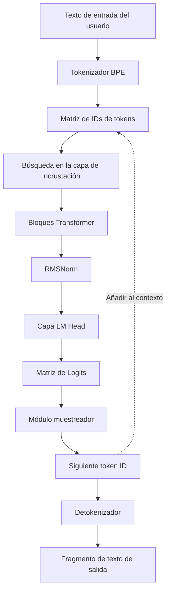
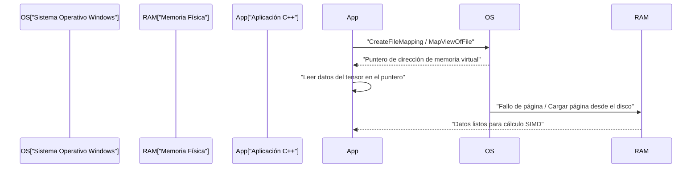
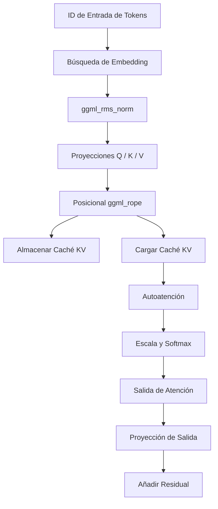

# Guía de desarrollo de modelos de IA a pequeña escala (como TinyLLaMA) con C++

En los últimos años, el interés por ejecutar grandes modelos de lenguaje (LLM) en entornos locales ha crecido rápidamente. Especialmente, los modelos pequeños como TinyLLaMA (1.1B parámetros) pueden realizar inferencias a velocidades prácticas incluso en dispositivos periféricos (edge devices) con recursos limitados o computadoras portátiles comunes (incluyendo entornos Windows). Mientras que el desarrollo con Python y PyTorch es la corriente principal, cuando se busca el rendimiento máximo y la eficiencia de memoria, la combinación de C++ y "ggml", una biblioteca de tensores basada en C, se ha convertido en el estándar de facto.

En este artículo, explicaremos en gran detalle el proceso de desarrollo para construir un motor de inferencia desde cero (o comprender profundamente la estructura interna del existente llama.cpp) para cargar TinyLLaMA y generar texto usando C++.

---

## 1. ¿Por qué C++ y ggml?

En la fase de entrenamiento de IA, Python tiene una ventaja abrumadora debido a su flexibilidad y rico ecosistema. Sin embargo, en las fases de despliegue e "Inferencia", C++ se convierte en una opción poderosa por las siguientes razones:

1. **Reducción de sobrecarga**: Se puede eliminar por completo la sobrecarga del entorno de ejecución y del Global Interpreter Lock (GIL) de Python.
2. **Eficiencia de memoria y asignación por arenas**: Al poder controlar manualmente la asignación y liberación de memoria, se evitan los picos impredecibles causados por el recolector de basura.
3. **Acceso directo al hardware**: Se pueden invocar directamente funciones intrínsecas SIMD como AVX-512, AVX2 y ARM NEON para maximizar la capacidad de procesamiento de la CPU.
4. **Eliminación de dependencias**: ggml es una biblioteca C/C++ sin dependencias (Zero dependencies), y se puede compilar fácilmente incluso en un entorno MSVC en Windows siempre que haya un compilador.

---

## 2. Visión general de la arquitectura

El flujo completo del pipeline de inferencia se muestra en el siguiente diagrama Mermaid. Es un proceso continuo que comienza con el texto de entrada del usuario hasta que se genera el siguiente token final.



Al ser un modelo autorregresivo, el token de salida se añade de nuevo al contexto y circula como entrada para la predicción del siguiente token (la parte punteada del diagrama).

---

## 3. Formato del modelo y mapeo de memoria (mmap)

La mayor barrera al manejar los pesos de una red neuronal gigante es la E/S del disco y el consumo de memoria. En la implementación de C++, esto se resuelve mediante el **mapeo de memoria (mmap)**.

### 3.1 Cómo funciona el mapeo de memoria y su implementación en Windows

Al utilizar mmap, el contenido del archivo se puede mapear directamente en el espacio de memoria virtual del proceso.

* **Copia cero (Zero-copy)**: Los datos se cargan directamente desde el disco a la caché de páginas del kernel, sin que ocurran copias adicionales al espacio de usuario.
* **Carga bajo demanda (Page Fault)**: En el instante exacto en que la CPU accede a esa dirección de memoria, se produce un fallo de página y solo el fragmento necesario (típicamente 4KB) se carga en la memoria física.

En un entorno Windows, en lugar del `mmap` de POSIX, se utilizan las API Win32 `CreateFileMapping` y `MapViewOfFile`.



### 3.2 Estructura binaria del formato GGUF

**GGUF (GPT-Generated Unified Format)**, convertido a partir de formatos como `.safetensors` de Hugging Face, es el formato definitivo para la inferencia. Tiene un diseño binario estricto como el siguiente:

1. **Bytes Mágicos**: `0x46554747` (GGUF).
2. **Versión**: Número de versión del formato.
3. **Conteo de tensores y metadatos**: Número de tensores y pares clave-valor de metadatos.
4. **Metadatos (Pares clave-valor)**: Claves con prefijo de longitud de cadena y valores tipados.
5. **Información del tensor**: Nombre de cada tensor, número de dimensiones, tipo de datos (FP16, Q4_K, etc.) y posición de desplazamiento (offset) en el archivo.
6. **Relleno (Padding)**: Relleno insertado para que los datos del tensor se alineen en límites específicos (generalmente 32 o 64 bytes). Es indispensable para un acceso a memoria rápido con instrucciones SIMD (especialmente AVX).
7. **Datos del tensor**: Matriz de datos de pesos reales alineados.

---

## 4. Base matemática de TinyLLaMA y algoritmos en C++

TinyLLaMA incorpora varios ingenios arquitectónicos avanzados para mejorar la eficiencia. Explicaremos las representaciones matemáticas para implementarlos correctamente en C++.

### 4.1 RMSNorm (Root Mean Square Normalization)

Reduce el costo computacional omitiendo el centrado de la media de LayerNorm y realizando solo el escalado de la varianza.

$$ \text{RMSNorm}(x) = \frac{x}{\sqrt{\frac{1}{d}\sum_{i=1}^{d} x_i^2 + \epsilon}} \odot \gamma $$

$d$ es el número de dimensiones y $\gamma$ es el tensor de escalado entrenado.
Al implementar en C++, se optimiza calculando primero rápidamente la suma de los cuadrados de la matriz usando `_mm256_fmadd_ps` de AVX2, y multiplicando por la raíz cuadrada inversa (por ejemplo, con la instrucción `_mm256_rsqrt_ps`).

### 4.2 RoPE (Rotary Position Embedding)

Es una técnica para aplicar la información de posición de los tokens como una rotación en el espacio del tensor. Se puede ver como una rotación en el plano complejo, y aplica la siguiente rotación a los pares de dimensiones adyacentes $(x_1, x_2)$ del vector $x$.

$$ \text{RoPE}(x, m) = \begin{pmatrix} x_{1} \cos(m\theta) - x_{2} \sin(m\theta) \\ x_{1} \sin(m\theta) + x_{2} \cos(m\theta) \end{pmatrix} $$

Aquí, $m$ es el índice de posición absoluta del token y $\theta$ es la frecuencia base precalculada. En ggml, se ejecuta en paralelo simplemente añadiendo el operador `ggml_rope` durante la construcción del grafo de inferencia.

### 4.3 Grouped-Query Attention (GQA)

En la Atención Multicabezal normal (Multi-Head Attention, MHA), se tiene el mismo número de cabezas para Query, Key y Value. Sin embargo, TinyLLaMA adopta **Grouped-Query Attention (GQA)** para reducir drásticamente el ancho de banda de la memoria y el consumo de caché KV.

$$ \text{Attention}(Q, K, V) = \text{softmax}\left(\frac{Q K^T}{\sqrt{d_k}}\right) V $$

En GQA, múltiples cabezas de Query comparten una sola cabeza de Key/Value. En la implementación de C++, antes de ejecutar el producto matricial `ggml_mul_mat`, se requiere una operación para transmitir (broadcast) los tensores KV de acuerdo con el número de Queries.

### 4.4 Función de activación SwiGLU

En la capa de la Red Feed-Forward (FFN), se utiliza SwiGLU en lugar de GELU.

$$ \text{SwiGLU}(x) = \text{Swish}(x W_{\text{gate}}) \otimes (x W_{\text{up}}) $$
$$ \text{Swish}(z) = z \cdot \sigma(z) = z \cdot \frac{1}{1 + e^{-z}} $$

En el grafo computacional, se expresa combinando el operador `ggml_silu` y `ggml_mul`.

---

## 5. Construcción del grafo computacional y gestión de memoria con ggml

ggml adopta un enfoque de "Definir y Ejecutar" (Define-and-Run), donde construye un grafo computacional estático para la inferencia y luego lo evalúa.

### 5.1 ggml_context y el asignador de arena

La característica más singular de ggml es la "asignación por arena", que no realiza ninguna asignación dinámica de memoria (`malloc` o `new`) dentro del bucle de inferencia.
Al inicializar, se reserva una gran área de memoria contigua (arena), y cada vez que se llama a funciones como `ggml_new_tensor`, el puntero de esta área se incrementa. Cuando se completa un paso de inferencia, simplemente se restablece el puntero de asignación a su posición inicial, completando instantáneamente la asignación de memoria para el siguiente paso de inferencia.

### 5.2 Ejemplo concreto de construcción de grafo

En cada paso de inferencia, se construye un grafo computacional en memoria como el siguiente:



---

## 6. Cuantización y optimización para Windows / SIMD

Manejar TinyLLaMA (1.1B) en FP16 requiere aproximadamente 2.2GB de memoria, pero mediante cuantización de 4 bits (como Q4_K), se puede comprimir drásticamente a unos 600MB.

### 6.1 Arquitectura de cuantización por bloques

ggml no cuantiza todo el tensor uniformemente, sino en unidades de "bloques".
En el formato `Q4_0`, 32 valores FP16 se agrupan en un bloque.
- **Factor de escala**: 1 valor FP16 (2 bytes)
- **Datos cuantizados**: 32 valores de 4 bits (16 bytes)
Esto minimiza el impacto de los valores atípicos (outliers) locales.

### 6.2 Aceleración del producto punto con AVX2

Al compilar para las CPU x86 más recientes en entornos Windows, se utilizan banderas del compilador como `/arch:AVX2` y el procesamiento SIMD se realiza con el siguiente flujo:

1. **Carga**: Cargar datos cuantizados de 4 bits desde la memoria a registros AVX de 256 bits.
2. **Expansión y desempaquetado**: Expandir los valores de 4 bits a Int8 o Int16 usando máscaras de bits y operaciones de desplazamiento.
3. **Descuantización**: Multiplicar por el factor de escala para convertir a punto flotante.
4. **Operación FMA**: Ejecutar en paralelo la operación de multiplicación y suma (multiply-add) con los valores de activación y `_mm256_fmadd_ps` (Fused Multiply-Add).

---

## 7. Detalles de implementación de la caché KV

En la generación autorregresiva, la "caché KV" para omitir el cálculo de las Keys y Values de los tokens pasados es una función esencial.

Los puntos clave para la implementación en C++ son los siguientes:
1. **Reserva previa del tensor**: Se inicializa un enorme tensor para la caché KV con la longitud máxima del contexto (ej: 2048 tokens) (se recomienda FP16).
2. **Copia por desplazamiento**: Cuando se realiza el cálculo para la posición del token $N$, los vectores K y V obtenidos en ese paso se almacenan en la fila $N$ del tensor de la caché KV usando `ggml_cpy` u otras funciones.
3. **Creación de vista durante la atención**: Al calcular la atención, se crea una "vista" que apunta solo a la parte de los tokens del 0 al $N$-ésimo y se pasa al producto matricial.

---

## 8. Tokenizador BPE y decodificación

La cadena de entrada se trata como una secuencia de bytes UTF-8 y se compara con un vocabulario predefinido. En C++, para acelerar la búsqueda en el vocabulario, se implementa un **árbol Trie (árbol de prefijos)** o algoritmos que utilizan colas de prioridad.

A partir de los logits generados por el LM Head, se escalan las probabilidades usando el parámetro Temperature, los candidatos se filtran usando métodos Top-K o Top-P (Nucleus Sampling), y se utiliza un número aleatorio para determinar el siguiente token final.

---

## 9. Inicio del proyecto en C++ (Entorno Windows / PowerShell)

```cmake
cmake_minimum_required(VERSION 3.14)
project(TinyLLaMACpp)

set(CMAKE_CXX_STANDARD 17)

# Configuración de banderas de optimización y AVX2 para Windows (MSVC)
if(MSVC)
    add_compile_options(/O2 /arch:AVX2 /fp:fast)
    add_link_options(/STACK:8388608)
else()
    add_compile_options(-O3 -march=native -ffast-math)
endif()

add_library(ggml OBJECT ggml/ggml.c ggml/ggml-alloc.c)
target_compile_definitions(ggml PRIVATE GGML_USE_AVX2 GGML_USE_F16C GGML_USE_FMA)

add_executable(main main.cpp)
target_link_libraries(main ggml)
```

Ejemplo de comando de compilación en PowerShell:
```powershell
mkdir build
cd build
cmake .. -G "Visual Studio 17 2022" -A x64
cmake --build . --config Release
```

---

## 10. Resumen

Implementar desde cero un motor de inferencia para modelos de IA pequeños como TinyLLaMA usando C++ y ggml es una excelente oportunidad para descubrir la caja negra del aprendizaje profundo y aprender la belleza del control de hardware de bajo nivel. Disfrutemos plenamente de la esencia de la programación de sistemas, como la carga con copia cero mediante mapeo de memoria, la optimización SIMD y la construcción de la caché KV, mientras abrimos camino hacia el futuro de la IA periférica (Edge AI).
