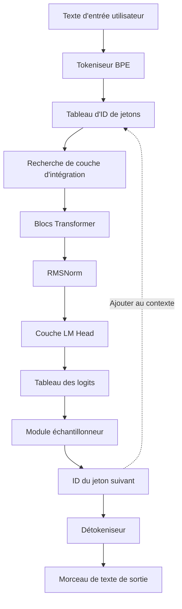
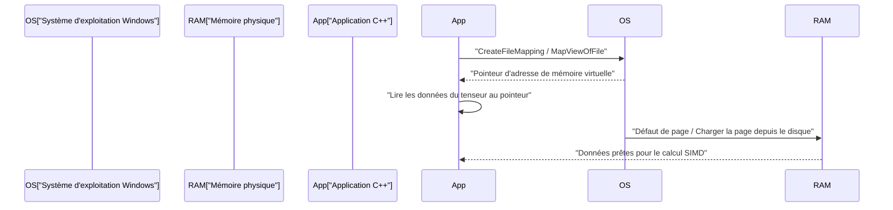
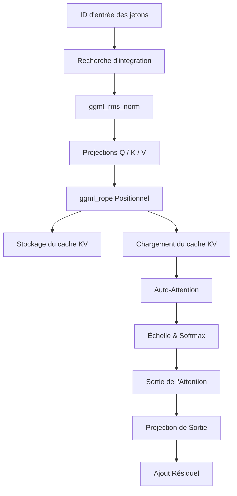

# Procédure de développement de petits modèles d'IA (TinyLLaMA, etc.) avec C++

Ces dernières années, l'intérêt pour l'exécution locale de grands modèles de langage (LLM) a augmenté rapidement. En particulier, les petits modèles tels que TinyLLaMA (1,1B paramètres) peuvent effectuer des inférences à une vitesse pratique même sur des appareils périphériques aux ressources limitées ou des PC portables standards (y compris les environnements Windows). Bien que le développement utilisant Python et PyTorch soit courant, lorsqu'il s'agit d'atteindre des performances et une efficacité mémoire ultimes, la combinaison du C++ et de « ggml », une bibliothèque de tenseurs basée sur le langage C, est devenue la norme de facto.

Cet article explique en détail la procédure de développement pour construire un moteur d'inférence à partir de zéro (ou comprendre en profondeur l'architecture interne du llama.cpp existant) afin de charger TinyLLaMA et de générer du texte en utilisant C++.

---

## 1. Pourquoi C++ et ggml ?

Dans la phase d'apprentissage de l'IA, Python, avec sa flexibilité et son écosystème riche, a un avantage écrasant. Cependant, dans les phases de déploiement ou d'« inférence (Inference) », C++ devient un choix puissant pour les raisons suivantes.

1. **Réduction des surcoûts** : Le Global Interpreter Lock (GIL) de Python et les surcoûts d'exécution peuvent être complètement éliminés.
2. **Efficacité de la mémoire et allocation d'arène** : L'allocation et la libération de la mémoire pouvant être contrôlées manuellement, les pics imprévisibles causés par le ramasse-miettes (garbage collection) sont évités.
3. **Accès direct au matériel** : Il est possible d'appeler directement des fonctions intrinsèques SIMD (Intrinsics) telles que AVX-512, AVX2 et ARM NEON, exploitant ainsi la puissance de calcul du processeur à son maximum.
4. **Élimination des dépendances** : ggml est une bibliothèque C/C++ sans aucune dépendance (Zero dependencies), et peut être facilement compilée même dans un environnement MSVC sous Windows tant qu'il y a un compilateur.

---

## 2. Vue d'ensemble de l'architecture

Le diagramme Mermaid ci-dessous montre le flux complet du pipeline d'inférence. Il s'agit d'une série de processus commençant par le texte d'entrée de l'utilisateur et se terminant par la génération du jeton suivant.



Puisqu'il s'agit d'un modèle autorégressif, le jeton produit est à nouveau ajouté au contexte et circule en tant qu'entrée pour la prédiction du jeton suivant (la partie en pointillé du diagramme).

---

## 3. Format de modèle et mappage en mémoire (mmap)

Le principal obstacle à la gestion des poids des grands réseaux de neurones est l'I/O disque et la consommation de mémoire. Dans l'implémentation C++ , cela est résolu par le **mappage en mémoire (mmap)**.

### 3.1 Mécanisme du mappage en mémoire et implémentation sous Windows

L'utilisation de mmap permet de mapper le contenu d'un fichier directement dans l'espace mémoire virtuel du processus.

* **Zéro copie (Zero-copy)** : Les données sont lues directement depuis le disque vers le cache de pages du noyau, évitant ainsi des copies supplémentaires vers l'espace utilisateur.
* **Chargement à la demande (Page Fault)** : Au moment précis où le processeur accède à cette adresse mémoire, un défaut de page (page fault) se produit, et seul le morceau (chunk) requis (généralement 4 Ko) est chargé dans la mémoire physique.

Dans l'environnement Windows, au lieu du `mmap` de POSIX, on utilise les API Win32 `CreateFileMapping` et `MapViewOfFile`.



### 3.2 Structure binaire du format GGUF

Converti à partir de formats tels que `.safetensors` de Hugging Face, le **GGUF (GPT-Generated Unified Format)** est le format ultime pour l'inférence. Il possède la disposition binaire stricte suivante.

1. **Octets magiques (Magic Bytes)** : `0x46554747` (GGUF).
2. **Version** : Numéro de version du format.
3. **Nombre de tenseurs et de métadonnées** : Nombre de tenseurs et de paires clé-valeur de métadonnées.
4. **Métadonnées (Paires Clé-Valeur)** : Clés avec préfixe de longueur de chaîne, et valeurs typées.
5. **Infos sur le tenseur** : Nom de chaque tenseur, nombre de dimensions, type de données (FP16, Q4_K, etc.), et position de décalage (offset) dans le fichier.
6. **Remplissage (Padding)** : Remplissage inséré de sorte que les données du tenseur soient alignées sur une limite spécifique (généralement 32 octets ou 64 octets). Indispensable pour un accès rapide à la mémoire avec les instructions SIMD (en particulier AVX).
7. **Données du tenseur** : Tableau des données de poids réelles alignées.

---

## 4. Fondements mathématiques de TinyLLaMA et algorithmes C++

TinyLLaMA intègre plusieurs améliorations architecturales avancées pour l'efficacité. Nous expliquons ici les expressions mathématiques pour les implémenter correctement en C++.

### 4.1 RMSNorm (Root Mean Square Normalization)

Il omet le centrage de la moyenne du LayerNorm et n'effectue que la mise à l'échelle de la variance, ce qui réduit les coûts de calcul.

$$ \text{RMSNorm}(x) = \frac{x}{\sqrt{\frac{1}{d}\sum_{i=1}^{d} x_i^2 + \epsilon}} \odot \gamma $$

$d$ est le nombre de dimensions, $\gamma$ est le tenseur de mise à l'échelle appris.
Lors de l'implémentation en C++, on optimise d'abord en calculant rapidement la somme des carrés du tableau avec `_mm256_fmadd_ps` d'AVX2, etc., et en la multipliant par la racine carrée inverse (par ex., avec l'instruction `_mm256_rsqrt_ps`).

### 4.2 RoPE (Rotary Position Embedding)

C'est une technique qui applique l'information de position du jeton sous forme de rotation (Rotate) dans l'espace tensoriel. Elle peut être considérée comme une rotation sur un plan complexe, appliquant la rotation suivante à la paire de dimensions adjacentes $(x_1, x_2)$ du vecteur $x$.

$$ \text{RoPE}(x, m) = \begin{pmatrix} x_{1} \cos(m\theta) - x_{2} \sin(m\theta) \\ x_{1} \sin(m\theta) + x_{2} \cos(m\theta) \end{pmatrix} $$

Ici, $m$ est l'index de position absolu du jeton, $\theta$ est la fréquence fondamentale précalculée. Dans ggml, elle s'exécute en parallèle simplement en ajoutant l'opérateur `ggml_rope` pendant la construction du graphe d'inférence.

### 4.3 Grouped-Query Attention (GQA)

Dans le Multi-Head Attention (MHA) standard, on a le même nombre de têtes (heads) pour Query, Key et Value. Cependant, TinyLLaMA utilise le **Grouped-Query Attention (GQA)** pour réduire drastiquement la bande passante mémoire et la consommation du cache KV.

$$ \text{Attention}(Q, K, V) = \text{softmax}\left(\frac{Q K^T}{\sqrt{d_k}}\right) V $$

Dans le GQA, plusieurs têtes Query partagent une seule tête Key/Value. L'implémentation C++ nécessite une opération de diffusion (broadcast) du tenseur KV pour correspondre au nombre de Query avant d'exécuter la multiplication matricielle `ggml_mul_mat`.

### 4.4 Fonction d'activation SwiGLU

Dans la couche de réseau à propagation avant (Feed-Forward Network, FFN), SwiGLU est utilisé à la place de GELU.

$$ \text{SwiGLU}(x) = \text{Swish}(x W_{\text{gate}}) \otimes (x W_{\text{up}}) $$
$$ \text{Swish}(z) = z \cdot \sigma(z) = z \cdot \frac{1}{1 + e^{-z}} $$

Dans le graphe de calcul, ceci est exprimé en combinant les opérateurs `ggml_silu` et `ggml_mul`.

---

## 5. Construction du graphe de calcul avec ggml et gestion de la mémoire

ggml adopte une approche « Define-and-Run », construisant un graphe de calcul statique pour l'inférence et l'évaluant (evaluate) par la suite.

### 5.1 ggml_context et allocateur d'arène

Le point le plus unique de ggml est l'« allocation d'arène » qui n'effectue aucune allocation de mémoire dynamique (`malloc` ou `new`) à l'intérieur de la boucle d'inférence.
Lors de l'initialisation, une énorme zone mémoire contiguë (arène) est allouée, et chaque fois que `ggml_new_tensor` etc. est appelé, le pointeur de cette zone est incrémenté. Une fois qu'une étape d'inférence est terminée, il suffit de réinitialiser le pointeur d'allocation à sa position initiale pour terminer instantanément l'allocation de mémoire pour l'étape d'inférence suivante.

### 5.2 Exemple concret de construction de graphe

À chaque étape d'inférence, le graphe de calcul suivant est assemblé en mémoire.



---

## 6. Quantification (Quantization) et optimisation Windows / SIMD

Traiter TinyLLaMA (1.1B) en FP16 nécessite environ 2,2 Go de mémoire, mais cela peut être considérablement réduit à environ 600 Mo grâce à la quantification 4 bits (comme Q4_K).

### 6.1 Architecture de quantification par blocs

ggml ne quantifie pas l'intégralité du tenseur uniformément, mais le fait par unités de « blocs ».
Dans le format `Q4_0`, 32 valeurs FP16 sont regroupées en un seul bloc.
- **Facteur d'échelle (Scale factor)** : 1 valeur FP16 (2 octets)
- **Données quantifiées** : 32 valeurs 4 bits (16 octets)
Cela minimise l'impact des valeurs aberrantes locales.

### 6.2 Accélération du produit scalaire avec AVX2

Lors de la compilation pour les derniers processeurs x86 dans un environnement Windows, en utilisant des indicateurs de compilation (flags) tels que `/arch:AVX2`, le traitement SIMD est effectué via le flux suivant.

1. **Chargement (Load)** : Charge les données quantifiées 4 bits depuis la mémoire dans un registre AVX de 256 bits.
2. **Expansion et déballage (Unpack)** : Développe les valeurs 4 bits en Int8 ou Int16 avec un masque de bits et des opérations de décalage.
3. **Déqualification (Dequantize)** : Multiplie par le facteur d'échelle pour convertir en virgule flottante.
4. **Opération FMA** : Exécute en parallèle les opérations de multiplication-addition avec les valeurs d'activation en utilisant `_mm256_fmadd_ps` (Fused Multiply-Add).

---

## 7. Détails d'implémentation du cache KV

Dans la génération autorégressive, le « cache KV » est une fonctionnalité indispensable pour omettre le calcul des Key et Value des jetons passés.

Les points clés lors de l'implémentation en C++ sont les suivants.
1. **Pré-allocation du tenseur** : Initialiser un énorme tenseur pour le cache KV correspondant à la longueur de contexte maximale (ex. : 2048 jetons) (FP16 recommandé).
2. **Copie avec décalage (Offset copy)** : Lorsque le calcul pour la position du jeton $N$ est effectué, les vecteurs K et V obtenus à cette étape sont stockés à la $N$-ième ligne du tenseur de cache KV en utilisant `ggml_cpy` etc.
3. **Création de la vue (view) lors de l'Attention** : Lors du calcul de l'Attention, créer une « vue » pointant uniquement sur la partie des jetons de 0 à $N$, et la transmettre à la multiplication matricielle.

---

## 8. Tokeniseur BPE et décodage

Traite la chaîne d'entrée sous forme d'une séquence d'octets UTF-8 et la compare à un vocabulaire prédéfini. En C++, pour accélérer la recherche dans le vocabulaire, on implémente un algorithme utilisant un **Trie (arbre de préfixes)** ou une file de priorité.

À partir des logits sortis du LM Head, les probabilités sont mises à l'échelle en utilisant le paramètre de température (Temperature), les candidats sont réduits par des méthodes d'extraction Top-K ou Top-P (Nucleus Sampling), et le jeton suivant final est déterminé à l'aide de nombres aléatoires.

---

## 9. Lancement d'un projet C++ (Environnement Windows / PowerShell)

```cmake
cmake_minimum_required(VERSION 3.14)
project(TinyLLaMACpp)

set(CMAKE_CXX_STANDARD 17)

# Optimisation pour Windows (MSVC) et configuration du flag AVX2
if(MSVC)
    add_compile_options(/O2 /arch:AVX2 /fp:fast)
    add_link_options(/STACK:8388608)
else()
    add_compile_options(-O3 -march=native -ffast-math)
endif()

add_library(ggml OBJECT ggml/ggml.c ggml/ggml-alloc.c)
target_compile_definitions(ggml PRIVATE GGML_USE_AVX2 GGML_USE_F16C GGML_USE_FMA)

add_executable(main main.cpp)
target_link_libraries(main ggml)
```

Exemple de commande de build dans PowerShell :
```powershell
mkdir build
cd build
cmake .. -G "Visual Studio 17 2022" -A x64
cmake --build . --config Release
```

---

## 10. Conclusion

Implémenter à partir de zéro un moteur d'inférence pour un petit modèle d'IA comme TinyLLaMA en utilisant C++ et ggml est une excellente occasion de révéler la boîte noire de l'apprentissage profond et d'apprendre la beauté du contrôle matériel de bas niveau. Tout en profitant pleinement de l'essence de la programmation système, telle que le chargement zéro copie à l'aide du mappage mémoire, l'optimisation SIMD et la construction du cache KV, ouvrons la voie à l'avenir de l'IA périphérique (Edge AI).
