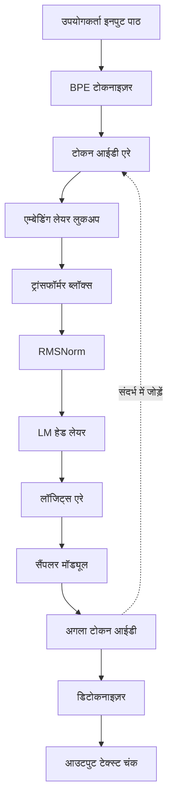
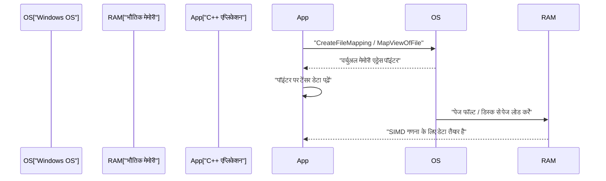
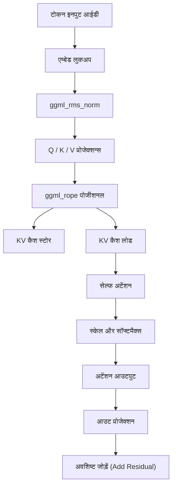

# C++ के साथ छोटे AI मॉडल (जैसे TinyLLaMA) विकसित करने की प्रक्रिया

हाल के वर्षों में, स्थानीय वातावरण में बड़े भाषा मॉडल (LLM) चलाने में रुचि तेजी से बढ़ी है। विशेष रूप से, TinyLLaMA (1.1B पैरामीटर) जैसे छोटे मॉडल सीमित संसाधनों वाले एज डिवाइस और सामान्य लैपटॉप (Windows वातावरण सहित) पर भी व्यावहारिक गति से अनुमान लगाने में सक्षम हैं। जहाँ Python और PyTorch का उपयोग करके विकास मुख्यधारा है, वहीं जब अंतिम प्रदर्शन और मेमोरी दक्षता की बात आती है, तो C++ और C-आधारित टेंसर लाइब्रेरी "ggml" का संयोजन वास्तविक मानक बन गया है।

इस लेख में, हम C++ का उपयोग करके TinyLLaMA को लोड करने और पाठ निर्माण के लिए एक अनुमान इंजन को शून्य से बनाने (या मौजूदा llama.cpp की आंतरिक संरचना को गहराई से समझने) के लिए एक बहुत ही विस्तृत विकास प्रक्रिया की व्याख्या करेंगे।

---

## 1. C++ और ggml ही क्यों?

AI के प्रशिक्षण चरण में, Python अपने लचीलेपन और समृद्ध इकोसिस्टम के कारण अत्यधिक लाभप्रद है। हालाँकि, परिनियोजन (डिप्लॉयमेंट) या "अनुमान (Inference)" के चरण में, निम्नलिखित कारणों से C++ एक शक्तिशाली विकल्प बन जाता है:

1. **ओवरहेड में कमी**: Python के ग्लोबल इंटरप्रेटर लॉक (GIL) और रनटाइम ओवरहेड को पूरी तरह से समाप्त किया जा सकता है।
2. **मेमोरी दक्षता और एरिना एलोकेशन**: चूँकि मेमोरी के आवंटन और मुक्ति को मैन्युअल रूप से नियंत्रित किया जा सकता है, इसलिए गार्बेज कलेक्शन के कारण होने वाले अप्रत्याशित स्पाइक्स को रोका जा सकता है।
3. **हार्डवेयर तक सीधी पहुँच**: AVX-512, AVX2, और ARM NEON जैसे SIMD इंट्रिंसिक्स (Intrinsics) को सीधे कॉल किया जा सकता है, जिससे CPU की गणना क्षमता को अधिकतम किया जा सकता है।
4. **निर्भरता का उन्मूलन**: ggml शून्य-निर्भरता (Zero dependencies) वाली एक C/C++ लाइब्रेरी है, और इसे केवल एक कंपाइलर के साथ Windows पर MSVC वातावरण में भी आसानी से बनाया (बिल्ड किया) जा सकता है।

---

## 2. वास्तुकला का समग्र चित्र (आर्किटेक्चर ओवरव्यू)

संपूर्ण अनुमान पाइपलाइन का प्रवाह नीचे दिए गए Mermaid आरेख में दिखाया गया है। यह उपयोगकर्ता के इनपुट पाठ से शुरू होकर अंततः अगले टोकन के उत्पन्न होने तक की एक श्रृंखला है।



चूँकि यह एक ऑटो-रिग्रेसिव मॉडल है, इसलिए आउटपुट टोकन को फिर से संदर्भ (कॉन्टेक्स्ट) में जोड़ा जाता है और यह अगले टोकन की भविष्यवाणी के लिए इनपुट के रूप में चक्रित होता है (आरेख में बिंदीदार रेखा वाला भाग)।

---

## 3. मॉडल प्रारूप और मेमोरी मैपिंग (mmap)

विशाल न्यूरल नेटवर्क के वेट्स (weights) को संभालने में सबसे बड़ी बाधा डिस्क I/O और मेमोरी की खपत है। C++ कार्यान्वयन में इसे **मेमोरी मैपिंग (mmap)** से हल किया जाता है।

### 3.1 मेमोरी मैपिंग का तंत्र और Windows में कार्यान्वयन

mmap का उपयोग करने से, फ़ाइल की सामग्री को सीधे प्रक्रिया के वर्चुअल मेमोरी स्पेस में मैप किया जा सकता है।

* **ज़ीरो-कॉपी (Zero-copy)**: डेटा सीधे डिस्क से कर्नेल के पेज कैश में पढ़ा जाता है, जिससे यूज़र स्पेस में कोई अतिरिक्त कॉपी नहीं होती।
* **ऑन-डिमांड लोड (Page Fault)**: जब CPU वास्तव में उस मेमोरी एड्रेस तक पहुँचता है, तभी एक पेज फॉल्ट होता है, और केवल आवश्यक चंक (आमतौर पर 4KB) भौतिक मेमोरी में लोड होता है।

Windows वातावरण में, POSIX के `mmap` के बजाय Win32 API के `CreateFileMapping` और `MapViewOfFile` का उपयोग किया जाता है।



### 3.2 GGUF प्रारूप की बाइनरी संरचना

Hugging Face जैसे प्लेटफार्मों से `.safetensors` प्रारूप से परिवर्तित **GGUF (GPT-Generated Unified Format)** अनुमान के लिए अंतिम प्रारूप है। इसका एक सख्त बाइनरी लेआउट है जैसा कि नीचे दिया गया है:

1. **मैजिक बाइट्स (Magic Bytes)**: `0x46554747` (GGUF)।
2. **संस्करण (Version)**: प्रारूप का संस्करण क्रमांक।
3. **टेंसर गणना और मेटाडेटा गणना**: टेंसर की संख्या और मेटाडेटा के की-वैल्यू पेयर की संख्या।
4. **मेटाडेटा (Key-Value Pairs)**: स्ट्रिंग लेंथ प्रीफिक्स के साथ की (Key), और टाइप की गई वैल्यू।
5. **टेंसर इन्फो (Tensor Info)**: प्रत्येक टेंसर का नाम, आयामों की संख्या, डेटा प्रकार (FP16, Q4_K आदि), और फ़ाइल के भीतर ऑफ़सेट स्थिति।
6. **पैडिंग (Padding)**: पैडिंग डाली जाती है ताकि टेंसर डेटा एक विशिष्ट सीमा (आमतौर पर 32 बाइट्स या 64 बाइट्स) पर संरेखित (aligned) हो। यह SIMD निर्देशों (विशेष रूप से AVX) में उच्च गति मेमोरी एक्सेस के लिए आवश्यक है।
7. **टेंसर डेटा**: संरेखित वास्तविक वेट (weight) डेटा एरे।

---

## 4. TinyLLaMA का गणितीय आधार और C++ एल्गोरिदम

TinyLLaMA दक्षता के लिए कई उन्नत आर्किटेक्चरल तकनीकों को शामिल करता है। C++ में इन्हें सही ढंग से लागू करने के लिए हम गणितीय अभिव्यक्तियों की व्याख्या करेंगे।

### 4.1 RMSNorm (Root Mean Square Normalization)

LayerNorm से माध्य (mean) की सेंटरिंग को हटाकर और केवल वेरिएंस स्केलिंग करके गणना लागत को कम किया जाता है।

$$ \text{RMSNorm}(x) = \frac{x}{\sqrt{\frac{1}{d}\sum_{i=1}^{d} x_i^2 + \epsilon}} \odot \gamma $$

$d$ आयामों की संख्या है, $\gamma$ सीखा हुआ स्केलिंग टेंसर है।
C++ में इसे लागू करते समय, एरे के वर्ग का योग पहले AVX2 के `_mm256_fmadd_ps` आदि के साथ उच्च गति से गणना किया जाता है, और फिर व्युत्क्रम वर्गमूल (जैसे `_mm256_rsqrt_ps` निर्देश) से गुणा करके इसे अनुकूलित किया जाता है।

### 4.2 RoPE (Rotary Position Embedding)

यह एक ऐसी तकनीक है जो टेंसर स्पेस में रोटेशन (Rotate) के रूप में टोकन की स्थितिगत जानकारी लागू करती है। इसे जटिल संख्या तल (complex plane) पर रोटेशन माना जा सकता है, और वेक्टर $x$ के आसन्न आयाम जोड़े $(x_1, x_2)$ पर निम्नलिखित रोटेशन लागू किया जाता है।

$$ \text{RoPE}(x, m) = \begin{pmatrix} x_{1} \cos(m\theta) - x_{2} \sin(m\theta) \\ x_{1} \sin(m\theta) + x_{2} \cos(m\theta) \end{pmatrix} $$

यहाँ, $m$ टोकन का पूर्ण स्थिति सूचकांक है, और $\theta$ पूर्व-गणना की गई मूल आवृत्ति है। ggml में, अनुमान ग्राफ के निर्माण के दौरान `ggml_rope` ऑपरेटर जोड़ने से यह समानांतर रूप से निष्पादित होता है।

### 4.3 Grouped-Query Attention (GQA)

सामान्य Multi-Head Attention (MHA) में, Query, Key और Value प्रत्येक के लिए समान संख्या में हेड्स होते हैं। हालाँकि, TinyLLaMA मेमोरी बैंडविड्थ और KV कैश खपत को भारी मात्रा में कम करने के लिए **Grouped-Query Attention (GQA)** का उपयोग करता है।

$$ \text{Attention}(Q, K, V) = \text{softmax}\left(\frac{Q K^T}{\sqrt{d_k}}\right) V $$

GQA में, कई Query हेड्स एक ही Key/Value हेड साझा shared करते हैं। C++ कार्यान्वयन में, मैट्रिक्स गुणा `ggml_mul_mat` निष्पादित करने से पहले, Query की संख्या से मेल खाने के लिए KV टेंसर को ब्रॉडकास्ट करने की आवश्यकता होती है।

### 4.4 SwiGLU एक्टिवेशन फ़ंक्शन

Feed-Forward Network (FFN) लेयर में, GELU के बजाय SwiGLU का उपयोग किया जाता है।

$$ \text{SwiGLU}(x) = \text{Swish}(x W_{\text{gate}}) \otimes (x W_{\text{up}}) $$
$$ \text{Swish}(z) = z \cdot \sigma(z) = z \cdot \frac{1}{1 + e^{-z}} $$

कम्प्यूटेशन ग्राफ में, इसे `ggml_silu` ऑपरेटर और `ggml_mul` के संयोजन से दर्शाया जाता है।

---

## 5. ggml के साथ कम्प्यूटेशन ग्राफ का निर्माण और मेमोरी प्रबंधन

ggml "Define-and-Run" दृष्टिकोण अपनाता है, जहाँ यह अनुमान के लिए एक स्थिर कम्प्यूटेशन ग्राफ बनाता है और बाद में उसका मूल्यांकन (evaluate) करता है।

### 5.1 ggml_context और एरिना एलोकेटर

ggml की सबसे अनूठी विशेषता "एरिना एलोकेशन" है, जो अनुमान लूप के भीतर कोई डायनामिक मेमोरी आवंटन (`malloc` या `new`) नहीं करता है।
प्रारंभिकरण के दौरान, एक विशाल निरंतर मेमोरी क्षेत्र (एरिना) सुरक्षित किया जाता है, और जब भी `ggml_new_tensor` आदि को कॉल किया जाता है, तो इस क्षेत्र का पॉइंटर बढ़ा (increment) दिया जाता है। एक अनुमान चरण के पूरा होने के बाद, आवंटन पॉइंटर को प्रारंभिक स्थिति में रीसेट करने से, अगले अनुमान चरण के लिए मेमोरी आवंटन तुरंत पूरा हो जाता है।

### 5.2 ग्राफ निर्माण का विशिष्ट उदाहरण

प्रत्येक अनुमान चरण के लिए, मेमोरी में निम्नलिखित कम्प्यूटेशन ग्राफ बनाया जाता है।



---

## 6. क्वांटाइज़ेशन (Quantization) और Windows / SIMD ऑप्टिमाइज़ेशन

TinyLLaMA (1.1B) को FP16 में सँभालने के लिए लगभग 2.2GB मेमोरी की आवश्यकता होती है, लेकिन 4-बिट क्वांटाइज़ेशन (जैसे Q4_K) के साथ इसे नाटकीय रूप से लगभग 600MB तक संपीड़ित किया जा सकता है।

### 6.1 ब्लॉक क्वांटाइज़ेशन आर्किटेक्चर

ggml पूरे टेंसर को एक साथ क्वांटाइज़ करने के बजाय इसे "ब्लॉक" के आधार पर करता है।
`Q4_0` प्रारूप में, 32 FP16 मानों को एक ब्लॉक में समूहीकृत किया जाता है।
- **स्केल फैक्टर**: 1 FP16 मान (2 बाइट्स)
- **क्वांटाइज़्ड डेटा**: 32 4-बिट मान (16 बाइट्स)
यह स्थानीय आउटलायर्स के प्रभाव को कम करता है।

### 6.2 AVX2 के साथ डॉट उत्पाद का त्वरण

Windows वातावरण में नवीनतम x86 CPU के लिए बिल्ड करते समय, `/arch:AVX2` जैसे कंपाइलर फ्लैग्स का उपयोग करके SIMD प्रोसेसिंग निम्नलिखित प्रवाह में की जाती है:

1. **लोड**: मेमोरी से 4-बिट क्वांटाइज़्ड डेटा को 256-बिट AVX रजिस्टर में लोड करना।
2. **विस्तार और अनपैक**: बिट मास्क और शिफ्ट ऑपरेशंस का उपयोग करके 4-बिट मानों को Int8 या Int16 में विस्तारित करना।
3. **डीक्वांटाइज़ेशन**: फ्लोटिंग पॉइंट में बदलने के लिए स्केल फैक्टर से गुणा करना।
4. **FMA ऑपरेशंस**: एक्टिवेशन मानों और `_mm256_fmadd_ps` (Fused Multiply-Add) के साथ समानांतर में मल्टीप्लाई-ऐड (multiply-add) ऑपरेशंस निष्पादित करना।

---

## 7. KV कैश कार्यान्वयन का विवरण

ऑटो-रिग्रेसिव जनरेशन में, पिछले टोकनों के Key और Value की गणना को छोड़ने के लिए "KV कैश" एक आवश्यक विशेषता है।

C++ में इसे लागू करते समय मुख्य बिंदु इस प्रकार हैं:
1. **टेंसर का पूर्व-आवंटन**: KV कैश के लिए अधिकतम संदर्भ लंबाई (उदा: 2048 टोकन) के लिए एक विशाल टेंसर को इनिशियलाइज़ किया जाता है (FP16 अनुशंसित है)।
2. **ऑफ़सेट कॉपी**: जब टोकन स्थिति $N$ के लिए गणना की जाती है, तो उस चरण पर प्राप्त K और V वेक्टर्स को `ggml_cpy` आदि का उपयोग करके KV कैश टेंसर की $N$-वीं पंक्ति में स्टोर किया जाता है।
3. **अटेंशन के दौरान व्यू बनाना**: अटेंशन की गणना करते समय, एक "व्यू (view)" बनाया जाता है जो केवल 0 से $N$वें टोकन भाग को इंगित करता है और उसे मैट्रिक्स गुणन में पास किया जाता है।

---

## 8. BPE टोकनाइज़र और डिकोडिंग

इनपुट स्ट्रिंग को UTF-8 बाइट्स के अनुक्रम के रूप में माना जाता है और पूर्वनिर्धारित शब्दावली के विरुद्ध मिलान किया जाता है। C++ में, शब्दावली खोज को तेज करने के लिए **ट्राई ट्री (प्रिफिक्स ट्री)** या प्राथमिकता कतारों (priority queues) का उपयोग करने वाले एल्गोरिदम लागू किए जाते हैं।

LM Head से आउटपुट लॉजिट्स (logits) से, संभावितताओं को Temperature पैरामीटर का उपयोग करके स्केल किया जाता है, उम्मीदवारों को Top-K निष्कर्षण या Top-P (न्यूक्लियस सैंपलिंग) विधियों का उपयोग करके कम किया जाता है, और यादृच्छिक संख्याओं का उपयोग करके अंतिम अगला टोकन निर्धारित किया जाता है।

---

## 9. C++ प्रोजेक्ट सेट अप करना (Windows / PowerShell वातावरण)

```cmake
cmake_minimum_required(VERSION 3.14)
project(TinyLLaMACpp)

set(CMAKE_CXX_STANDARD 17)

# Windows (MSVC) के लिए ऑप्टिमाइज़ेशन और AVX2 फ्लैग की सेटिंग
if(MSVC)
    add_compile_options(/O2 /arch:AVX2 /fp:fast)
    add_link_options(/STACK:8388608)
else()
    add_compile_options(-O3 -march=native -ffast-math)
endif()

add_library(ggml OBJECT ggml/ggml.c ggml/ggml-alloc.c)
target_compile_definitions(ggml PRIVATE GGML_USE_AVX2 GGML_USE_F16C GGML_USE_FMA)

add_executable(main main.cpp)
target_link_libraries(main ggml)
```

PowerShell में बिल्ड कमांड का उदाहरण:
```powershell
mkdir build
cd build
cmake .. -G "Visual Studio 17 2022" -A x64
cmake --build . --config Release
```

---

## 10. निष्कर्ष

C++ और ggml का उपयोग करके TinyLLaMA जैसे छोटे AI मॉडल के लिए शून्य से एक अनुमान इंजन लागू करना डीप लर्निंग के ब्लैक बॉक्स को खोलने और निम्न-स्तरीय हार्डवेयर नियंत्रण की सुंदरता सीखने का एक उत्कृष्ट अवसर है। मेमोरी मैपिंग का उपयोग करके ज़ीरो-कॉपी लोडिंग, SIMD ऑप्टिमाइज़ेशन और KV कैश के निर्माण जैसी सिस्टम प्रोग्रामिंग के सार का आनंद लेते हुए, आइए एज AI के भविष्य का मार्ग प्रशस्त करें।
