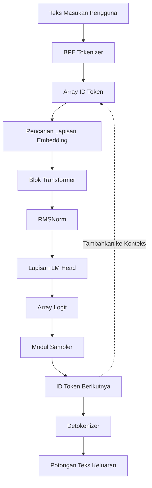
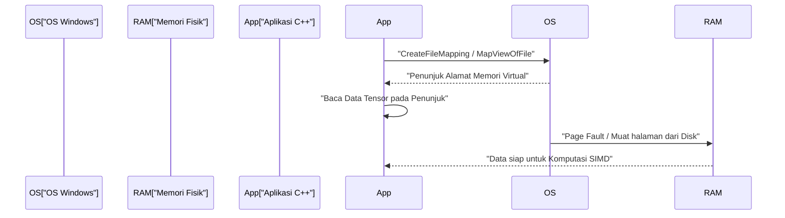
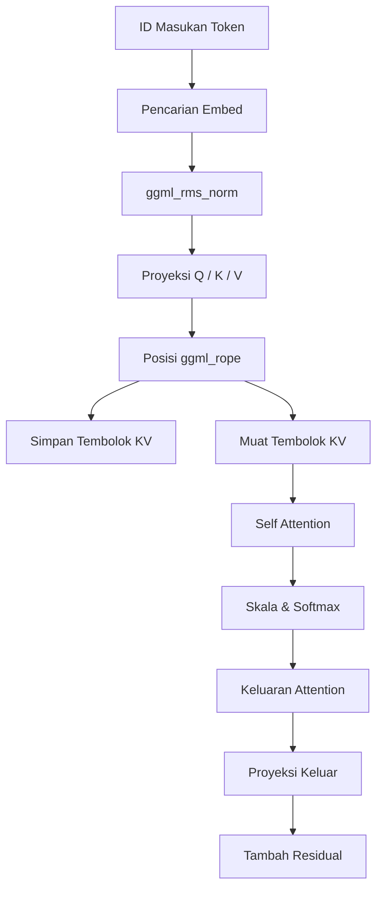

# Panduan Pengembangan Model AI Skala Kecil (seperti TinyLLaMA) Menggunakan C++

Baru-baru ini, minat terhadap eksekusi model bahasa besar (LLM) di lingkungan lokal telah meningkat secara pesat. Secara khusus, model berskala kecil seperti TinyLLaMA (1.1B parameter) dapat diinferensi dengan kecepatan praktis bahkan pada perangkat edge dengan sumber daya terbatas atau laptop umum (termasuk lingkungan Windows). Sementara pengembangan menggunakan Python dan PyTorch adalah arus utama, ketika mengejar kinerja dan efisiensi memori terbaik, kombinasi C++ dan pustaka tensor berbasis C, "ggml", telah menjadi standar de facto.

Artikel ini akan menjelaskan secara rinci prosedur pengembangan (atau pemahaman mendalam tentang struktur internal llama.cpp yang sudah ada) untuk membangun mesin inferensi dari awal guna memuat TinyLLaMA dan melakukan pembuatan teks menggunakan C++.

---

## 1. Mengapa C++ dan ggml?

Dalam tahap pelatihan AI, Python sangat diuntungkan dengan fleksibilitas dan ekosistemnya yang kaya. Namun, dalam fase penerapan dan "Inferensi", C++ menjadi pilihan yang kuat karena alasan berikut:

1. **Pengurangan Overhead**: Global Interpreter Lock (GIL) Python dan overhead runtime dapat dihilangkan sepenuhnya.
2. **Efisiensi Memori dan Alokasi Arena**: Karena alokasi dan dealokasi memori dapat dikontrol secara manual, lonjakan yang tidak dapat diprediksi akibat *garbage collection* dapat dicegah.
3. **Akses Langsung ke Perangkat Keras**: Dapat langsung memanggil fungsi bawaan SIMD (Intrinsics) seperti AVX-512, AVX2, dan ARM NEON untuk memaksimalkan kemampuan komputasi CPU.
4. **Tanpa Dependensi**: ggml adalah pustaka C/C++ dengan nol dependensi (Zero dependencies), yang dapat dengan mudah dibangun bahkan di lingkungan MSVC di Windows asalkan ada kompilator.

---

## 2. Gambaran Keseluruhan Arsitektur

Alur dari seluruh *pipeline* inferensi ditunjukkan dalam diagram Mermaid di bawah ini. Ini adalah serangkaian proses mulai dari teks masukan pengguna hingga pembuatan token berikutnya.



Karena ini adalah model auto-regresif, token yang dihasilkan ditambahkan kembali ke konteks dan disirkulasikan sebagai masukan untuk memprediksi token berikutnya (bagian garis putus-putus pada diagram).

---

## 3. Format Model dan Pemetaan Memori (mmap)

Kendala terbesar dalam menangani bobot jaringan saraf yang sangat besar adalah operasi I/O disk dan konsumsi memori. Implementasi C++ menyelesaikan masalah ini dengan **pemetaan memori (mmap)**.

### 3.1 Cara Kerja Pemetaan Memori dan Implementasi di Windows

Menggunakan mmap memungkinkan konten file dipetakan langsung ke dalam ruang memori virtual proses.

* **Zero-copy (Tanpa Salinan)**: Data dibaca langsung dari disk ke dalam tembolok halaman kernel, dan tidak ada salinan ekstra ke ruang pengguna yang terjadi.
* **On-demand Load (Page Fault)**: Tepat saat CPU mengakses alamat memori tersebut, *page fault* terjadi, dan hanya *chunk* yang diperlukan (biasanya 4KB) yang dimuat ke dalam memori fisik.

Di lingkungan Windows, API Win32 `CreateFileMapping` dan `MapViewOfFile` digunakan sebagai pengganti POSIX `mmap`.



### 3.2 Struktur Biner Format GGUF

**GGUF (GPT-Generated Unified Format)**, yang dikonversi dari format seperti `.safetensors` Hugging Face, adalah format pamungkas untuk inferensi. GGUF memiliki tata letak biner ketat berikut:

1. **Magic Bytes**: `0x46554747` (GGUF).
2. **Version**: Nomor versi format.
3. **Tensor Count & Metadata Count**: Jumlah tensor dan jumlah pasangan kunci-nilai metadata.
4. **Metadata (Key-Value Pairs)**: Kunci dengan prefiks panjang string, dan nilai yang diketik.
5. **Tensor Info**: Nama setiap tensor, jumlah dimensi, tipe data (FP16, Q4_K, dll.), dan posisi *offset* di dalam file.
6. **Padding**: Padding yang dimasukkan agar data tensor sejajar (aligned) pada batas tertentu (biasanya 32 byte atau 64 byte). Ini penting untuk akses memori cepat dalam instruksi SIMD (khususnya AVX).
7. **Tensor Data**: Array data bobot aktual yang telah disejajarkan.

---

## 4. Basis Matematis TinyLLaMA dan Algoritma C++

TinyLLaMA menggabungkan beberapa penyempurnaan arsitektur tingkat lanjut untuk efisiensi. Ekspresi matematis untuk mengimplementasikan ini dengan benar dalam C++ dijelaskan di bawah ini.

### 4.1 RMSNorm (Root Mean Square Normalization)

Ini mengurangi biaya komputasi dengan menghilangkan pemusatan rata-rata dari LayerNorm dan hanya melakukan penskalaan varians.

$$ \text{RMSNorm}(x) = \frac{x}{\sqrt{\frac{1}{d}\sum_{i=1}^{d} x_i^2 + \epsilon}} \odot \gamma $$

$d$ adalah jumlah dimensi, dan $\gamma$ adalah tensor penskalaan yang telah dipelajari.
Saat diimplementasikan di C++, ini dioptimalkan dengan terlebih dahulu menghitung jumlah kuadrat array pada kecepatan tinggi menggunakan `_mm256_fmadd_ps` dari AVX2, dll., dan mengalikannya dengan akar kuadrat terbalik (seperti instruksi `_mm256_rsqrt_ps`).

### 4.2 RoPE (Rotary Position Embedding)

Ini adalah teknik yang menerapkan informasi posisi token sebagai rotasi (Rotate) di ruang tensor. Ini dapat dianggap sebagai rotasi pada bidang kompleks, dan rotasi berikut diterapkan ke pasangan dimensi yang berdekatan $(x_1, x_2)$ dari vektor $x$.

$$ \text{RoPE}(x, m) = \begin{pmatrix} x_{1} \cos(m\theta) - x_{2} \sin(m\theta) \\ x_{1} \sin(m\theta) + x_{2} \cos(m\theta) \end{pmatrix} $$

Di sini, $m$ adalah indeks posisi absolut token, dan $\theta$ adalah frekuensi dasar yang dihitung sebelumnya. Dalam ggml, eksekusi paralel dapat dicapai hanya dengan menambahkan operator `ggml_rope` selama pembangunan grafik inferensi.

### 4.3 Grouped-Query Attention (GQA)

Dalam Multi-Head Attention (MHA) reguler, terdapat jumlah head yang sama untuk masing-masing Query, Key, dan Value. Namun, TinyLLaMA mengadopsi **Grouped-Query Attention (GQA)** untuk secara drastis mengurangi *bandwidth* memori dan konsumsi tembolok KV (KV Cache).

$$ \text{Attention}(Q, K, V) = \text{softmax}\left(\frac{Q K^T}{\sqrt{d_k}}\right) V $$

Di GQA, beberapa head Query berbagi satu head Key/Value. Dalam implementasi C++, perlu melakukan operasi *broadcast* pada tensor KV agar sesuai dengan jumlah Query sebelum menjalankan perkalian matriks `ggml_mul_mat`.

### 4.4 Fungsi Aktivasi SwiGLU

Pada lapisan Feed-Forward Network (FFN), SwiGLU digunakan sebagai pengganti GELU.

$$ \text{SwiGLU}(x) = \text{Swish}(x W_{\text{gate}}) \otimes (x W_{\text{up}}) $$
$$ \text{Swish}(z) = z \cdot \sigma(z) = z \cdot \frac{1}{1 + e^{-z}} $$

Dalam grafik komputasi, ini diekspresikan dengan menggabungkan operator `ggml_silu` dan `ggml_mul`.

---

## 5. Pembangunan Grafik Komputasi dan Manajemen Memori dengan ggml

ggml mengambil pendekatan "Define-and-Run", di mana grafik komputasi statis untuk inferensi dibangun dan dievaluasi nanti.

### 5.1 ggml_context dan Arena Allocator

Fitur ggml yang paling unik adalah "alokasi arena", yang sama sekali tidak menggunakan alokasi memori dinamis (`malloc` atau `new`) dalam putaran inferensi.
Area memori (*arena*) bersebelahan yang besar dialokasikan saat inisialisasi, dan penunjuk area ini dinaikkan nilainya (incremented) setiap kali `ggml_new_tensor` dll. dipanggil. Ketika satu langkah inferensi selesai, hanya dengan mengatur ulang penunjuk alokasi ke posisi awalnya, alokasi memori untuk langkah inferensi berikutnya selesai secara instan.

### 5.2 Contoh Konkret Pembangunan Grafik

Untuk setiap langkah inferensi, grafik komputasi berikut dirakit dalam memori.



---

## 6. Kuantisasi (Quantization) dan Optimisasi Windows / SIMD

Jika Anda menangani TinyLLaMA (1.1B) dalam FP16, Anda membutuhkan sekitar 2,2GB memori, tetapi melalui kuantisasi 4-bit (seperti Q4_K), ini dapat dikompresi secara dramatis menjadi sekitar 600MB.

### 6.1 Arsitektur Kuantisasi Blok

ggml tidak mengkuantisasi seluruh tensor secara seragam, melainkan dalam satuan "blok".
Dalam format `Q4_0`, 32 nilai FP16 dikelompokkan ke dalam satu blok.
- **Faktor Skala**: Satu nilai FP16 (2 byte)
- **Data Terkuantisasi**: 32 nilai 4-bit (16 byte)
Ini meminimalkan dampak dari *outlier* lokal.

### 6.2 Akselerasi Produk Titik dengan AVX2

Saat membangun untuk CPU x86 terbaru di lingkungan Windows, pemrosesan SIMD dilakukan dalam alur berikut, memanfaatkan tanda (flag) kompilator seperti `/arch:AVX2`.

1. **Muat**: Muat data terkuantisasi 4-bit dari memori ke dalam register AVX 256-bit.
2. **Ekspansi dan Buka Paket**: Ekspansi nilai 4-bit menjadi Int8 atau Int16 dengan *bit mask* dan operasi pergeseran (*shift*).
3. **Dikuantisasi Balik (Dequantization)**: Kalikan faktor skala untuk mengonversi ke angka *floating-point*.
4. **Operasi FMA**: Jalankan operasi perkalian-penjumlahan secara paralel dengan nilai aktivasi dan `_mm256_fmadd_ps` (Fused Multiply-Add).

---

## 7. Detail Implementasi Tembolok KV (KV Cache)

Dalam generasi auto-regresif, "Tembolok KV" (KV Cache) adalah fitur penting untuk mengabaikan penghitungan Key dan Value dari token masa lalu.

Poin-poin penting saat menerapkan dalam C++ adalah sebagai berikut:
1. **Prapengalokasian Tensor**: Inisialisasi tensor yang sangat besar untuk ukuran konteks maksimum (misalnya: 2048 token) untuk tembolok KV (FP16 disarankan).
2. **Salinan Offset**: Saat komputasi dilakukan untuk posisi token $N$, simpan vektor K dan V yang diperoleh pada langkah tersebut di baris ke-$N$ dari tensor tembolok KV menggunakan `ggml_cpy` atau sejenisnya.
3. **Pembuatan Tampilan Saat Attention**: Saat menghitung Attention, buat "tampilan" (view) yang hanya menunjuk ke bagian dari token ke-0 hingga ke-$N$ dan teruskan ke perkalian matriks.

---

## 8. BPE Tokenizer dan Decoding

String masukan diperlakukan sebagai urutan byte UTF-8 dan dicocokkan dengan kosakata yang telah ditentukan sebelumnya. Di C++, algoritma menggunakan **Pohon Trie (Pohon Prefiks)** atau antrean prioritas (priority queue) diimplementasikan untuk mempercepat pencarian kosakata.

Dari logit yang dikeluarkan dari LM Head, probabilitas diskalakan menggunakan parameter Temperature, kandidat dipersempit dengan metode ekstraksi Top-K atau Top-P (Nucleus Sampling), dan token berikutnya pada akhirnya ditentukan menggunakan angka acak.

---

## 9. Mempersiapkan Proyek C++ (Lingkungan Windows / PowerShell)

```cmake
cmake_minimum_required(VERSION 3.14)
project(TinyLLaMACpp)

set(CMAKE_CXX_STANDARD 17)

# Pengaturan Optimisasi dan bendera AVX2 untuk Windows (MSVC)
if(MSVC)
    add_compile_options(/O2 /arch:AVX2 /fp:fast)
    add_link_options(/STACK:8388608)
else()
    add_compile_options(-O3 -march=native -ffast-math)
endif()

add_library(ggml OBJECT ggml/ggml.c ggml/ggml-alloc.c)
target_compile_definitions(ggml PRIVATE GGML_USE_AVX2 GGML_USE_F16C GGML_USE_FMA)

add_executable(main main.cpp)
target_link_libraries(main ggml)
```

Contoh perintah pembuatan (build) di PowerShell:
```powershell
mkdir build
cd build
cmake .. -G "Visual Studio 17 2022" -A x64
cmake --build . --config Release
```

---

## 10. Kesimpulan

Membangun mesin inferensi dari awal untuk model AI berskala kecil seperti TinyLLaMA menggunakan C++ dan ggml adalah kesempatan bagus untuk mengungkap kotak hitam (*black box*) pembelajaran mendalam dan mempelajari keindahan kontrol perangkat keras tingkat rendah. Mari kita membuka masa depan Edge AI sambil menikmati sepenuhnya esensi pemrograman sistem, seperti pemuatan *zero-copy* menggunakan pemetaan memori, optimisasi SIMD, dan pembangunan tembolok KV.
