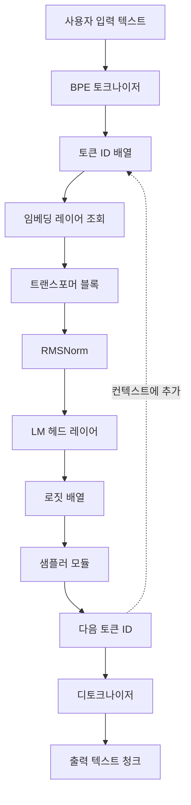
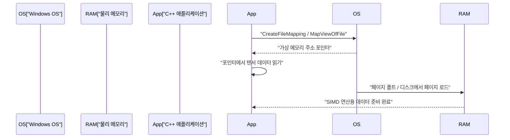
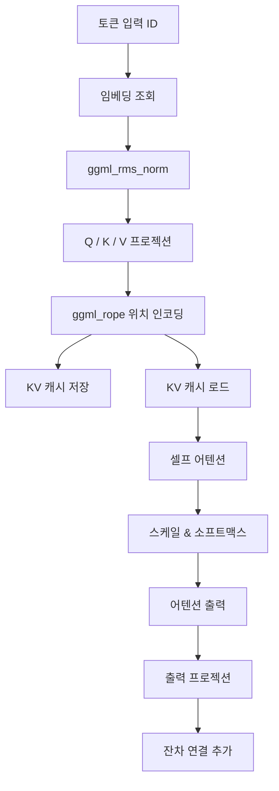

# C++로 시작하는 소규모 AI 모델(TinyLLaMA 등) 개발 절차

최근 대규모 언어 모델(LLM)을 로컬 환경에서 실행하는 것에 대한 관심이 급속히 높아지고 있습니다. 특히 TinyLLaMA(1.1B 파라미터)와 같은 소규모 모델은 제한된 리소스의 엣지 디바이스나 일반적인 노트북(Windows 환경 포함)에서도 실용적인 속도로 추론이 가능합니다. Python과 PyTorch를 이용한 개발이 주류인 반면, 궁극의 퍼포먼스와 메모리 절약을 추구할 경우 C++와 C언어 기반의 텐서 라이브러리인 'ggml'의 조합이 사실상의 표준이 되고 있습니다.

본 기사에서는 C++를 사용하여 TinyLLaMA를 로드하고, 텍스트 생성을 수행하기 위한 추론 엔진을 제로부터 구축(혹은 기존 llama.cpp의 내부 구조를 깊이 이해)하기 위한 매우 상세한 개발 절차를 해설합니다.

---

## 1. 왜 C++와 ggml인가?

AI 학습 단계에서는 유연성과 풍부한 생태계를 가진 Python이 압도적으로 유리합니다. 하지만 배포나 '추론(Inference)' 단계에서는 다음과 같은 이유로 C++가 강력한 선택지가 됩니다.

1. **오버헤드 감소**: Python의 글로벌 인터프리터 락(GIL)이나 런타임 오버헤드를 완전히 배제할 수 있습니다.
2. **메모리 효율과 아레나 할당**: 메모리 확보 및 해제를 수동으로 제어할 수 있으므로 가비지 컬렉션으로 인한 예측 불가능한 스파이크를 방지할 수 있습니다.
3. **하드웨어 직접 접근**: AVX-512, AVX2, ARM NEON 등 SIMD 내장 함수(Intrinsics)를 직접 호출하여 CPU의 연산 능력을 극한까지 끌어올릴 수 있습니다.
4. **의존성 배제**: ggml은 의존성이 전혀 없는(Zero dependencies) C/C++ 라이브러리이며 컴파일러만 있다면 Windows의 MSVC 환경에서도 쉽게 빌드할 수 있습니다.

---

## 2. 아키텍처의 전체 구조

추론 파이프라인 전체의 흐름을 아래 Mermaid 다이어그램에 나타냅니다. 사용자의 입력 텍스트부터 시작하여 최종적으로 다음 토큰이 생성될 때까지의 일련의 과정입니다.



자기 회귀 모델이므로 출력된 토큰은 다시 컨텍스트에 추가되어 다음 토큰 예측을 위한 입력으로 순환합니다(그림의 점선 부분).

---

## 3. 모델 포맷과 메모리 매핑 (mmap)

거대한 신경망의 가중치를 다루는 데 있어 가장 큰 장벽은 디스크 I/O와 메모리 소비입니다. C++ 구현에서는 이를 **메모리 매핑(mmap)**으로 해결합니다.

### 3.1 메모리 매핑의 원리와 Windows에서의 구현

mmap을 사용하면 파일 내용을 프로세스의 가상 메모리 공간에 직접 매핑할 수 있습니다.

* **제로 카피(Zero-copy)**: 데이터는 디스크에서 커널의 페이지 캐시로 직접 로드되며 사용자 공간으로의 불필요한 복사가 발생하지 않습니다.
* **온디맨드 로드(Page Fault)**: 실제로 CPU가 해당 메모리 주소에 접근하는 순간 페이지 폴트가 발생하며, 필요한 청크(일반적으로 4KB)만 물리 메모리에 로드됩니다.

Windows 환경에서는 POSIX의 `mmap` 대신 Win32 API의 `CreateFileMapping`과 `MapViewOfFile`을 사용합니다.



### 3.2 GGUF 포맷의 바이너리 구조

Hugging Face 등의 `.safetensors` 포맷에서 변환된 **GGUF (GPT-Generated Unified Format)**는 추론을 위한 궁극적인 포맷입니다. 다음과 같은 엄격한 바이너리 레이아웃을 갖습니다.

1. **Magic Bytes**: `0x46554747` (GGUF).
2. **Version**: 포맷의 버전 번호.
3. **Tensor Count & Metadata Count**: 텐서 개수와 메타데이터의 키-값 쌍 개수.
4. **Metadata (Key-Value Pairs)**: 문자열 길이 접두사가 붙은 키와 타입이 지정된 값.
5. **Tensor Info**: 각 텐서의 이름, 차원 수, 데이터 타입(FP16, Q4_K 등), 파일 내의 오프셋 위치.
6. **Padding**: 텐서 데이터가 특정 경계(일반적으로 32바이트 또는 64바이트)에 정렬되도록 삽입되는 패딩. SIMD 명령(특히 AVX)에서의 빠른 메모리 접근에 필수적입니다.
7. **Tensor Data**: 정렬된 실제 가중치 데이터 배열.

---

## 4. TinyLLaMA의 수학적 기반과 C++ 알고리즘

TinyLLaMA는 효율화를 위해 몇 가지 고도화된 아키텍처적 개선을 도입했습니다. 이를 C++로 올바르게 구현하기 위한 수식 표현을 해설합니다.

### 4.1 RMSNorm (Root Mean Square Normalization)

LayerNorm에서 평균 중심화(centering)를 생략하고 분산 스케일링만 수행함으로써 계산 비용을 절감합니다.

$$ \text{RMSNorm}(x) = \frac{x}{\sqrt{\frac{1}{d}\sum_{i=1}^{d} x_i^2 + \epsilon}} \odot \gamma $$

$d$는 차원 수, $\gamma$는 학습된 스케일링 텐서입니다.
C++로 구현할 경우 먼저 배열의 제곱합을 AVX2의 `_mm256_fmadd_ps` 등으로 빠르게 계산하고 역제곱근(`_mm256_rsqrt_ps` 명령 등)을 곱하여 최적화합니다.

### 4.2 RoPE (Rotary Position Embedding)

토큰의 위치 정보를 텐서 공간에서의 회전(Rotate)으로 적용하는 기술입니다. 복소 평면 위에서의 회전으로 간주할 수 있으며, 벡터 $x$의 인접한 차원 쌍 $(x_1, x_2)$에 대해 다음과 같은 회전을 적용합니다.

$$ \text{RoPE}(x, m) = \begin{pmatrix} x_{1} \cos(m\theta) - x_{2} \sin(m\theta) \\ x_{1} \sin(m\theta) + x_{2} \cos(m\theta) \end{pmatrix} $$

여기서 $m$은 토큰의 절대적인 위치 인덱스, $\theta$는 사전 계산된 기본 주파수입니다. ggml에서는 추론 그래프 구축 중에 `ggml_rope` 연산자를 추가하기만 하면 병렬로 실행됩니다.

### 4.3 Grouped-Query Attention (GQA)

일반적인 Multi-Head Attention(MHA)에서는 Query, Key, Value 각각에 대해 동일한 수의 헤드를 갖습니다. 그러나 TinyLLaMA는 메모리 대역폭과 KV 캐시 소비량을 극적으로 줄이기 위해 **Grouped-Query Attention(GQA)**을 채택했습니다.

$$ \text{Attention}(Q, K, V) = \text{softmax}\left(\frac{Q K^T}{\sqrt{d_k}}\right) V $$

GQA에서는 여러 Query 헤드가 하나의 Key/Value 헤드를 공유합니다. C++ 구현에서는 행렬 곱 `ggml_mul_mat`를 실행하기 전에 KV 텐서를 Query의 수에 맞게 브로드캐스트하는 작업이 필요합니다.

### 4.4 SwiGLU 활성화 함수

Feed-Forward Network (FFN) 계층에서는 GELU 대신 SwiGLU가 사용됩니다.

$$ \text{SwiGLU}(x) = \text{Swish}(x W_{\text{gate}}) \otimes (x W_{\text{up}}) $$
$$ \text{Swish}(z) = z \cdot \sigma(z) = z \cdot \frac{1}{1 + e^{-z}} $$

계산 그래프에서는 `ggml_silu` 연산자와 `ggml_mul`을 조합하여 표현합니다.

---

## 5. ggml을 통한 계산 그래프 구축 및 메모리 관리

ggml은 추론을 위한 정적인 계산 그래프를 구축하고 이를 나중에 평가(evaluate)하는 'Define-and-Run' 방식을 취합니다.

### 5.1 ggml_context와 아레나 할당자

ggml의 가장 독특한 점은 추론 루프 내에서 동적인 메모리 할당(`malloc`이나 `new`)을 일절 수행하지 않는 '아레나 할당'입니다.
초기화 시 거대한 연속된 메모리 영역(아레나)을 확보하고, `ggml_new_tensor` 등을 호출할 때마다 이 영역의 포인터가 증가합니다. 추론의 1단계가 완료되면 할당 포인터를 초기 위치로 재설정하기만 하면 다음 추론 단계를 위한 메모리 확보가 즉시 완료됩니다.

### 5.2 그래프 구축의 구체적인 예

추론 단계마다 다음과 같은 계산 그래프를 메모리상에 조립합니다.



---

## 6. 양자화 (Quantization)와 Windows / SIMD 최적화

TinyLLaMA (1.1B)를 FP16으로 다루면 약 2.2GB의 메모리가 필요하지만, 4비트 양자화(Q4_K 등)를 통해 약 600MB 정도까지 극적으로 압축할 수 있습니다.

### 6.1 블록 양자화 아키텍처

ggml은 텐서 전체를 일률적으로 양자화하는 것이 아니라 '블록' 단위로 수행합니다.
`Q4_0` 포맷에서는 32개의 FP16 값을 1개의 블록으로 묶습니다.
- **스케일 팩터**: 1개의 FP16 값 (2바이트)
- **양자화 데이터**: 32개의 4비트 값 (16바이트)
이를 통해 국소적인 이상치의 영향을 최소화합니다.

### 6.2 AVX2를 통한 내적 연산 가속

Windows 환경의 최신 x86 CPU를 대상으로 빌드할 경우 `/arch:AVX2` 등의 컴파일러 플래그를 활용하여 다음과 같은 흐름으로 SIMD 처리가 이루어집니다.

1. **로드**: 256비트 AVX 레지스터에 메모리로부터 4비트 양자화 데이터를 로드합니다.
2. **전개 및 언팩**: 비트 마스크와 시프트 연산으로 4비트 값을 Int8 또는 Int16으로 전개합니다.
3. **역양자화**: 스케일 팩터를 곱하여 부동소수점으로 변환합니다.
4. **FMA 연산**: 활성화 값과 `_mm256_fmadd_ps`(Fused Multiply-Add)를 사용하여 곱셈-덧셈(積和) 연산을 병렬로 실행합니다.

---

## 7. KV 캐시의 구현 세부 사항

자기 회귀적 생성에 있어 과거 토큰의 Key와 Value 계산을 생략하기 위한 'KV 캐시'는 필수 기능입니다.

C++로 구현할 때의 핵심은 다음과 같습니다.
1. **텐서 사전 확보**: 최대 컨텍스트 길이(예: 2048 토큰)만큼의 거대한 텐서를 KV 캐시용으로 초기화합니다(FP16 권장).
2. **오프셋 복사**: 토큰 위치 $N$에 대한 계산이 수행되면 해당 단계에서 얻은 K와 V 벡터를 KV 캐시 텐서의 $N$번째 행에 `ggml_cpy` 등을 사용하여 저장(store)합니다.
3. **어텐션 시의 뷰 생성**: 어텐션을 계산할 때는 0부터 $N$번째 토큰 부분까지만 가리키는 '뷰(view)'를 생성하여 행렬 곱에 전달합니다.

---

## 8. BPE 토크나이저와 디코딩

입력 문자열을 UTF-8 바이트 열로 취급하여 사전에 정의된 어휘 사전(Vocabulary)과 대조합니다. C++에서는 어휘 사전 검색을 가속화하기 위해 **트라이 트리(Trie tree)**나 우선순위 큐를 사용한 알고리즘을 구현합니다.

LM Head에서 출력되는 로짓(logit)에서는 Temperature 파라미터를 사용하여 확률을 스케일링하고 Top-K 추출이나 Top-P(Nucleus Sampling) 기법으로 후보를 좁힌 뒤, 난수를 사용하여 최종적인 다음 토큰을 결정합니다.

---

## 9. C++ 프로젝트 시작 (Windows / PowerShell 환경)

```cmake
cmake_minimum_required(VERSION 3.14)
project(TinyLLaMACpp)

set(CMAKE_CXX_STANDARD 17)

# Windows (MSVC)를 위한 최적화 및 AVX2 플래그 설정
if(MSVC)
    add_compile_options(/O2 /arch:AVX2 /fp:fast)
    add_link_options(/STACK:8388608)
else()
    add_compile_options(-O3 -march=native -ffast-math)
endif()

add_library(ggml OBJECT ggml/ggml.c ggml/ggml-alloc.c)
target_compile_definitions(ggml PRIVATE GGML_USE_AVX2 GGML_USE_F16C GGML_USE_FMA)

add_executable(main main.cpp)
target_link_libraries(main ggml)
```

PowerShell에서의 빌드 명령어 예시:
```powershell
mkdir build
cd build
cmake .. -G "Visual Studio 17 2022" -A x64
cmake --build . --config Release
```

---

## 10. 요약

C++와 ggml을 사용하여 TinyLLaMA와 같은 소규모 AI 모델의 추론 엔진을 제로부터 구현하는 것은 딥러닝의 블랙박스를 파헤치고 저수준 하드웨어 제어의 아름다움을 배울 수 있는 절호의 기회입니다. 메모리 매핑을 이용한 제로 카피 로드, SIMD 최적화, KV 캐시 구축 등 시스템 프로그래밍의 정수를 마음껏 맛보며 엣지 AI의 미래를 개척해 봅시다.
