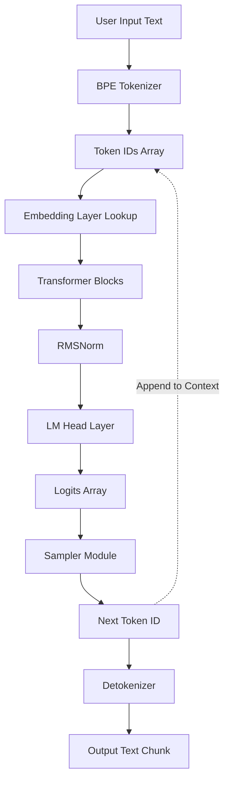
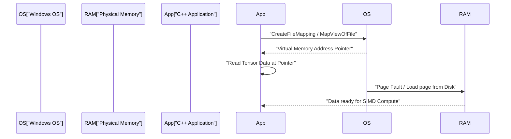
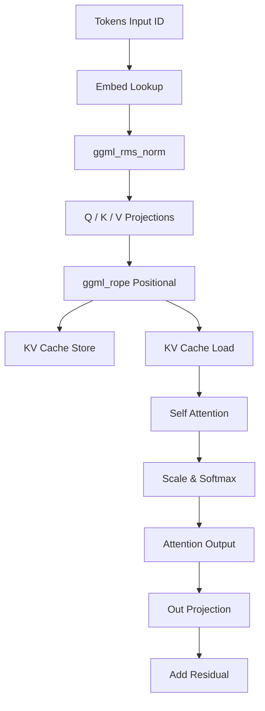

# C++で始める小規模AIモデル（TinyLLaMAなど）の開発手順

近年、大規模言語モデル（LLM）のローカル環境での実行に対する関心が急速に高まっています。特に、TinyLLaMA（1.1Bパラメータ）のような小規模モデルは、限られたリソースのエッジデバイスや一般的なノートPC（Windows環境を含む）上でも実用的な速度で推論が可能です。PythonとPyTorchを用いた開発が主流である一方で、究極のパフォーマンスと省メモリ性を追求する場合、C++とC言語ベースのテンソルライブラリである「ggml」の組み合わせがデファクトスタンダードとなっています。

本記事では、C++を用いてTinyLLaMAをロードし、テキスト生成を行うための推論エンジンをゼロから構築（あるいは既存のllama.cppの内部構造を深く理解）するための非常に詳細な開発手順を解説します。

---

## 1. なぜC++とggmlなのか？

AIの学習段階においては、柔軟性と豊富なエコシステムを持つPythonが圧倒的に有利です。しかし、デプロイや「推論（Inference）」のフェーズにおいては、以下の理由からC++が強力な選択肢となります。

1. **オーバーヘッドの削減**: Pythonのグローバルインタプリタロック（GIL）やランタイムのオーバーヘッドを完全に排除できます。
2. **メモリ効率とアリーナアロケーション**: メモリの確保と解放をマニュアルで制御できるため、ガベージコレクションによる予測不能なスパイクを防げます。
3. **ハードウェアへの直接アクセス**: AVX-512、AVX2、ARM NEONなどのSIMD組み込み関数（Intrinsics）を直接呼び出し、CPUの演算能力を極限まで引き出せます。
4. **依存関係の排除**: ggmlは依存関係ゼロ（Zero dependencies）のC/C++ライブラリであり、コンパイラさえあればWindows上のMSVC環境でも容易にビルド可能です。

---

## 2. アーキテクチャの全体像

推論パイプライン全体の流れを以下のMermaidダイアグラムに示します。ユーザーの入力テキストから始まり、最終的に次のトークンが生成されるまでの一連のプロセスです。



自己回帰モデルであるため、出力されたトークンは再びコンテキストに追加され、次のトークン予測のための入力として循環します（図の点線部分）。

---

## 3. モデルフォーマットとメモリマッピング (mmap)

巨大なニューラルネットワークの重みを扱う上で最大の障壁となるのが、ディスクI/Oとメモリ消費です。C++実装ではこれを**メモリマッピング（mmap）**で解決します。

### 3.1 メモリマッピングの仕組みとWindowsでの実装

mmapを使用すると、ファイルの内容をプロセスの仮想メモリ空間に直接マッピングできます。

* **ゼロコピー（Zero-copy）**: データはディスクから直接カーネルのページキャッシュに読み込まれ、ユーザー空間への余分なコピーが発生しません。
* **オンデマンド・ロード（Page Fault）**: 実際にCPUがそのメモリアドレスにアクセスした瞬間に、ページフォールトが発生し、必要なチャンク（通常4KB）だけが物理メモリにロードされます。

Windows環境では、POSIXの `mmap` の代わりにWin32 APIの `CreateFileMapping` と `MapViewOfFile` を使用します。



### 3.2 GGUFフォーマットのバイナリ構造

Hugging Face等の`.safetensors`フォーマットから変換された**GGUF (GPT-Generated Unified Format)**は、推論のための究極のフォーマットです。以下のような厳密なバイナリレイアウトを持っています。

1. **Magic Bytes**: `0x46554747` (GGUF)。
2. **Version**: フォーマットのバージョン番号。
3. **Tensor Count & Metadata Count**: テンソル数とメタデータのキーバリューペア数。
4. **Metadata (Key-Value Pairs)**: 文字列長プレフィックス付きのキーと、型付けされた値。
5. **Tensor Info**: 各テンソルの名前、次元数、データ型（FP16, Q4_Kなど）、ファイル内のオフセット位置。
6. **Padding**: テンソルデータが特定の境界（通常は32バイトまたは64バイト）にアライメントされるように挿入されるパディング。SIMD命令（特にAVX）での高速なメモリアクセスに不可欠です。
7. **Tensor Data**: アライメントされた実際の重みデータ配列。

---

## 4. TinyLLaMAの数学的基盤とC++アルゴリズム

TinyLLaMAは、効率化のためにいくつかの高度なアーキテクチャ上の工夫を取り入れています。これらをC++で正しく実装するための数式表現を解説します。

### 4.1 RMSNorm (Root Mean Square Normalization)

LayerNormから平均のセンタリングを省略し、分散のスケーリングのみを行うことで計算コストを削減します。

$$ \text{RMSNorm}(x) = \frac{x}{\sqrt{\frac{1}{d}\sum_{i=1}^{d} x_i^2 + \epsilon}} \odot \gamma $$

$d$は次元数、$\gamma$は学習済みのスケーリングテンソルです。
C++で実装する場合、まず配列の二乗和をAVX2の `_mm256_fmadd_ps` 等で高速に計算し、逆平方根（`_mm256_rsqrt_ps` 命令など）を掛けることで最適化します。

### 4.2 RoPE (Rotary Position Embedding)

トークンの位置情報をテンソル空間における回転（Rotate）として適用する技術です。複素数平面上での回転とみなすことができ、ベクトル $x$ の隣り合う次元ペア $(x_1, x_2)$ に対して以下のような回転を適用します。

$$ \text{RoPE}(x, m) = \begin{pmatrix} x_{1} \cos(m\theta) - x_{2} \sin(m\theta) \\ x_{1} \sin(m\theta) + x_{2} \cos(m\theta) \end{pmatrix} $$

ここで、$m$はトークンの絶対的な位置インデックス、$\theta$は事前に計算された基本周波数です。ggmlでは、推論グラフの構築中に `ggml_rope` オペレータを追加するだけで並列実行されます。

### 4.3 Grouped-Query Attention (GQA)

通常のMulti-Head Attention (MHA) では、Query、Key、Valueのそれぞれに対して同じ数のヘッドを持ちます。しかし、TinyLLaMAはメモリ帯域とKVキャッシュの消費量を激減させるために **Grouped-Query Attention (GQA)** を採用しています。

$$ \text{Attention}(Q, K, V) = \text{softmax}\left(\frac{Q K^T}{\sqrt{d_k}}\right) V $$

GQAでは、複数のQueryヘッドが1つのKey/Valueヘッドを共有します。C++実装では行列積 `ggml_mul_mat` を実行する前に、KVテンソルをQueryの数に合わせてブロードキャストする操作が必要になります。

### 4.4 SwiGLU 活性化関数

Feed-Forward Network (FFN) 層では、GELUの代わりにSwiGLUが用いられます。

$$ \text{SwiGLU}(x) = \text{Swish}(x W_{\text{gate}}) \otimes (x W_{\text{up}}) $$
$$ \text{Swish}(z) = z \cdot \sigma(z) = z \cdot \frac{1}{1 + e^{-z}} $$

計算グラフでは `ggml_silu` オペレータと `ggml_mul` を組み合わせて表現します。

---

## 5. ggmlによる計算グラフの構築とメモリ管理

ggmlは、推論のための静的な計算グラフを構築し、それを後から評価（evaluate）する「Define-and-Run」のアプローチを取ります。

### 5.1 ggml_context とアリーナアロケータ

ggmlの最もユニークな点は、推論ループ内で動的なメモリ確保（`malloc` や `new`）を一切行わない「アリーナアロケーション」です。
初期化時に巨大な連続したメモリ領域（アリーナ）を確保し、`ggml_new_tensor` などを呼び出すたびに、この領域のポインタがインクリメントされます。推論の1ステップが完了したら、アロケーションポインタを初期位置にリセットするだけで、次の推論ステップのメモリ確保が即座に完了します。

### 5.2 グラフ構築の具体例

推論ステップごとに、以下のような計算グラフをメモリ上に組み立てます。



---

## 6. 量子化 (Quantization) と Windows / SIMD 最適化

TinyLLaMA (1.1B) をFP16で扱うと約2.2GBのメモリが必要ですが、4ビット量子化（Q4_Kなど）により約600MB程度まで劇的に圧縮できます。

### 6.1 ブロック量子化アーキテクチャ

ggmlはテンソル全体を一律に量子化するのではなく、「ブロック」単位で行います。
`Q4_0` フォーマットでは、32個のFP16値を1つのブロックにまとめます。
- **スケールファクタ**: 1つのFP16値（2バイト）
- **量子化データ**: 32個の4ビット値（16バイト）
これにより、局所的な外れ値の影響を最小限に抑えています。

### 6.2 AVX2によるドット積の高速化

Windows環境の最新のx86 CPU向けにビルドする場合、`/arch:AVX2` などのコンパイラフラグを活用し、以下のようなフローでSIMD処理が行われます。

1. **ロード**: 256ビットのAVXレジスタに、メモリから4ビット量子化データをロード。
2. **展開とアンパック**: ビットマスクとシフト演算で、4ビット値をInt8またはInt16に展開。
3. **逆量子化**: スケールファクタを乗算して浮動小数点に変換。
4. **FMA演算**: アクティベーション値と `_mm256_fmadd_ps`（Fused Multiply-Add）で積和演算を並列実行。

---

## 7. KVキャッシュの実装詳細

自己回帰的生成において、過去のトークンのKeyとValueの計算を省略するための「KVキャッシュ」は必須機能です。

C++で実装する場合のポイントは以下の通りです。
1. **テンソルの事前確保**: 最大コンテキスト長（例: 2048トークン）分の巨大なテンソルをKVキャッシュ用に初期化します（FP16を推奨）。
2. **オフセットコピー**: トークン位置 $N$ に対する計算が行われると、そのステップで得られたKとVのベクトルをKVキャッシュテンソルの $N$ 行目に `ggml_cpy` 等を用いてストアします。
3. **アテンション時のビュー作成**: アテンションを計算する際は、0から $N$ 番目までのトークン部分だけを指し示す「ビュー」を作成して行列積に渡します。

---

## 8. BPE トークナイザーとデコーディング

入力文字列をUTF-8のバイト列として扱い、事前に定義されたボキャブラリーと照らし合わせます。C++では、ボキャブラリーの検索を高速化するために **Trie木（プレフィックスツリー）** や、優先度付きキューを用いたアルゴリズムを実装します。

LM Headから出力されるロジットからは、Temperatureパラメータを用いて確率をスケーリングし、Top-K抽出やTop-P（Nucleus Sampling）手法によって候補を絞り込み、乱数を用いて最終的な次のトークンを決定します。

---

## 9. C++プロジェクトの立ち上げ（Windows / PowerShell 環境）

```cmake
cmake_minimum_required(VERSION 3.14)
project(TinyLLaMACpp)

set(CMAKE_CXX_STANDARD 17)

# Windows (MSVC) 向けの最適化とAVX2フラグの設定
if(MSVC)
    add_compile_options(/O2 /arch:AVX2 /fp:fast)
    add_link_options(/STACK:8388608)
else()
    add_compile_options(-O3 -march=native -ffast-math)
endif()

add_library(ggml OBJECT ggml/ggml.c ggml/ggml-alloc.c)
target_compile_definitions(ggml PRIVATE GGML_USE_AVX2 GGML_USE_F16C GGML_USE_FMA)

add_executable(main main.cpp)
target_link_libraries(main ggml)
```

PowerShellでのビルドコマンド例：
```powershell
mkdir build
cd build
cmake .. -G "Visual Studio 17 2022" -A x64
cmake --build . --config Release
```

---

## 10. まとめ

C++とggmlを用いてTinyLLaMAのような小規模AIモデルの推論エンジンをゼロから実装することは、深層学習のブラックボックスを暴き、低レベルのハードウェア制御の美しさを学ぶ絶好の機会です。メモリマッピングを利用したゼロコピー・ロード、SIMD最適化、KVキャッシュの構築など、システムプログラミングのエッセンスを存分に味わいながら、エッジAIの未来を切り拓いていきましょう。
