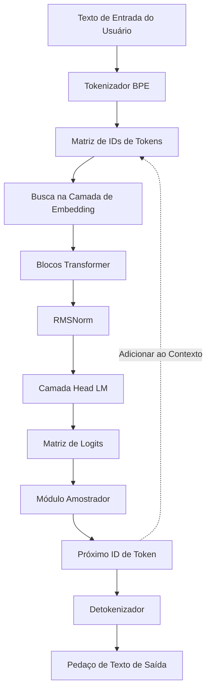
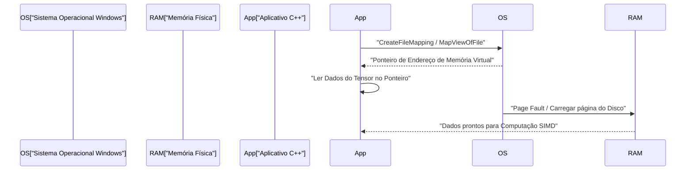
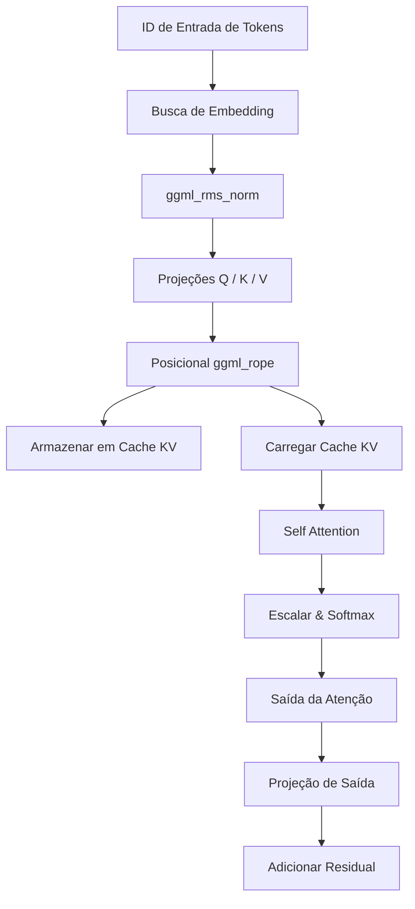

# Guia de Desenvolvimento de Modelos de IA em Pequena Escala (como TinyLLaMA) com C++

Recentemente, o interesse na execução de Grandes Modelos de Linguagem (LLMs) em ambientes locais aumentou rapidamente. Em particular, modelos de pequena escala como o TinyLLaMA (1.1B parâmetros) são capazes de inferir a uma velocidade prática mesmo em dispositivos de borda com recursos limitados ou notebooks comuns (incluindo ambientes Windows). Enquanto o desenvolvimento usando Python e PyTorch é a tendência principal, a combinação de C++ e "ggml", uma biblioteca de tensores baseada em C, tornou-se o padrão de fato quando se busca o máximo de desempenho e eficiência de memória.

Neste artigo, explicaremos o procedimento de desenvolvimento muito detalhado para construir um motor de inferência do zero (ou compreender profundamente a estrutura interna do `llama.cpp` existente) para carregar o TinyLLaMA e gerar texto usando C++.

---

## 1. Por que C++ e ggml?

Na fase de treinamento da IA, o Python, com sua flexibilidade e ecossistema rico, é esmagadoramente vantajoso. No entanto, nas fases de implantação e "Inferência", o C++ torna-se uma escolha poderosa pelas seguintes razões:

1. **Redução de Sobrecarga**: Pode eliminar completamente a sobrecarga do Global Interpreter Lock (GIL) e do tempo de execução do Python.
2. **Eficiência de Memória e Alocação de Arena**: Como a alocação e liberação de memória podem ser controladas manualmente, é possível evitar picos imprevisíveis causados pela coleta de lixo.
3. **Acesso Direto ao Hardware**: É possível chamar diretamente funções intrínsecas (Intrinsics) SIMD, como AVX-512, AVX2 e ARM NEON, para maximizar o poder de computação da CPU.
4. **Eliminação de Dependências**: O ggml é uma biblioteca C/C++ sem dependências (Zero dependencies) que pode ser facilmente compilada em um ambiente MSVC no Windows, desde que haja um compilador.

---

## 2. Visão Geral da Arquitetura

O fluxo completo do pipeline de inferência é mostrado no diagrama Mermaid abaixo. É um processo em série que começa com o texto de entrada do usuário até a geração final do próximo token.



Por ser um modelo autorregressivo, o token de saída é adicionado novamente ao contexto e circula como entrada para a previsão do próximo token (parte tracejada do diagrama).

---

## 3. Formato do Modelo e Mapeamento de Memória (mmap)

O maior obstáculo ao lidar com os pesos de uma rede neural gigantesca é a E/S de disco e o consumo de memória. Na implementação em C++, isso é resolvido com o **mapeamento de memória (mmap)**.

### 3.1 Mecanismo de Mapeamento de Memória e Implementação no Windows

O mmap permite mapear o conteúdo de um arquivo diretamente para o espaço de memória virtual do processo.

* **Zero-copy**: Os dados são lidos diretamente do disco para o cache de página do kernel, sem causar cópias extras para o espaço do usuário.
* **Carregamento sob Demanda (Page Fault)**: No exato momento em que a CPU acessa aquele endereço de memória, ocorre uma falha de página, e apenas o pedaço necessário (geralmente 4KB) é carregado na memória física.

No ambiente Windows, usa-se as APIs Win32 `CreateFileMapping` e `MapViewOfFile` em vez do `mmap` POSIX.



### 3.2 Estrutura Binária do Formato GGUF

O **GGUF (GPT-Generated Unified Format)**, convertido a partir de formatos como `.safetensors` do Hugging Face, é o formato definitivo para inferência. Ele possui o seguinte layout binário estrito:

1. **Magic Bytes**: `0x46554747` (GGUF).
2. **Version**: Número da versão do formato.
3. **Tensor Count & Metadata Count**: Número de tensores e número de pares chave-valor de metadados.
4. **Metadata (Key-Value Pairs)**: Chaves com prefixo de comprimento de string e valores tipados.
5. **Tensor Info**: Nome de cada tensor, número de dimensões, tipo de dados (FP16, Q4_K, etc.) e a posição de deslocamento no arquivo.
6. **Padding**: Preenchimento inserido para garantir que os dados do tensor sejam alinhados a um limite específico (geralmente 32 bytes ou 64 bytes). Isso é essencial para acessos rápidos à memória em instruções SIMD (especialmente AVX).
7. **Tensor Data**: A matriz real de dados de peso alinhados.

---

## 4. Base Matemática do TinyLLaMA e Algoritmo C++

O TinyLLaMA incorpora várias inovações arquitetônicas avançadas para maior eficiência. Explicaremos as representações matemáticas para implementá-las corretamente em C++.

### 4.1 RMSNorm (Root Mean Square Normalization)

Reduz o custo de cálculo ao omitir a centralização da média do LayerNorm e realizar apenas o dimensionamento da variância.

$$ \text{RMSNorm}(x) = \frac{x}{\sqrt{\frac{1}{d}\sum_{i=1}^{d} x_i^2 + \epsilon}} \odot \gamma $$

$d$ é o número de dimensões, e $\gamma$ é o tensor de escalonamento aprendido.
Ao implementar em C++, ele é otimizado primeiramente calculando rapidamente a soma dos quadrados da matriz com `_mm256_fmadd_ps` do AVX2, e multiplicando pela raiz quadrada inversa (como a instrução `_mm256_rsqrt_ps`).

### 4.2 RoPE (Rotary Position Embedding)

Esta é uma técnica para aplicar informações de posição de tokens como uma rotação no espaço tensorial. Pode ser vista como uma rotação no plano complexo, e aplica a seguinte rotação a pares de dimensões adjacentes $(x_1, x_2)$ do vetor $x$:

$$ \text{RoPE}(x, m) = \begin{pmatrix} x_{1} \cos(m\theta) - x_{2} \sin(m\theta) \\ x_{1} \sin(m\theta) + x_{2} \cos(m\theta) \end{pmatrix} $$

Aqui, $m$ é o índice absoluto de posição do token e $\theta$ é a frequência fundamental pré-calculada. No ggml, a execução paralela é feita simplesmente adicionando o operador `ggml_rope` durante a construção do grafo de inferência.

### 4.3 Grouped-Query Attention (GQA)

Na Multi-Head Attention (MHA) comum, há o mesmo número de cabeças para Query, Key e Value. No entanto, o TinyLLaMA adota o **Grouped-Query Attention (GQA)** para reduzir drasticamente o consumo de largura de banda de memória e cache KV.

$$ \text{Attention}(Q, K, V) = \text{softmax}\left(\frac{Q K^T}{\sqrt{d_k}}\right) V $$

No GQA, várias cabeças de Query compartilham uma única cabeça de Key/Value. Na implementação C++, antes de executar o produto de matrizes `ggml_mul_mat`, é necessária uma operação para transmitir (broadcast) os tensores KV para corresponder ao número de Queries.

### 4.4 Função de Ativação SwiGLU

Na camada Feed-Forward Network (FFN), SwiGLU é usado em vez de GELU.

$$ \text{SwiGLU}(x) = \text{Swish}(x W_{\text{gate}}) \otimes (x W_{\text{up}}) $$
$$ \text{Swish}(z) = z \cdot \sigma(z) = z \cdot \frac{1}{1 + e^{-z}} $$

No grafo computacional, isso é expresso pela combinação do operador `ggml_silu` com `ggml_mul`.

---

## 5. Construção de Grafo Computacional e Gerenciamento de Memória com ggml

O ggml adota uma abordagem "Define-and-Run", onde um grafo computacional estático para inferência é construído e então avaliado posteriormente.

### 5.1 ggml_context e Alocador de Arena

A característica mais singular do ggml é a "alocação de arena", que evita qualquer alocação dinâmica de memória (`malloc` ou `new`) dentro do loop de inferência.
Uma região contígua e gigante de memória (arena) é alocada no momento da inicialização, e toda vez que `ggml_new_tensor` é chamado, o ponteiro dessa região é incrementado. Quando uma etapa de inferência é concluída, simplesmente redefinir o ponteiro de alocação para a posição inicial conclui instantaneamente a alocação de memória para a próxima etapa de inferência.

### 5.2 Exemplo Concreto de Construção de Grafo

Para cada etapa de inferência, o seguinte grafo computacional é montado na memória.



---

## 6. Quantização (Quantization) e Otimização para Windows / SIMD

Lidar com o TinyLLaMA (1.1B) em FP16 requer cerca de 2.2GB de memória, mas por meio da quantização de 4 bits (como Q4_K), pode ser comprimido drasticamente para cerca de 600MB.

### 6.1 Arquitetura de Quantização em Bloco

O ggml não quantiza o tensor inteiro de maneira uniforme, mas o faz em unidades de "blocos".
No formato `Q4_0`, 32 valores FP16 são agrupados em um bloco.
- **Fator de escala**: 1 valor FP16 (2 bytes)
- **Dados quantizados**: 32 valores de 4 bits (16 bytes)
Isso minimiza a influência de outliers locais.

### 6.2 Aceleração de Produto Escalar com AVX2

Ao compilar para a CPU x86 mais recente no ambiente Windows, sinalizadores de compilador como `/arch:AVX2` são utilizados, e o processamento SIMD é realizado no fluxo abaixo.

1. **Carregar**: Dados quantizados de 4 bits são carregados da memória em registradores AVX de 256 bits.
2. **Expansão e Desempacotamento**: Os valores de 4 bits são expandidos para Int8 ou Int16 com máscaras de bits e operações de deslocamento.
3. **Desquantização**: O fator de escala é multiplicado para converter em ponto flutuante.
4. **Operação FMA**: Executa o cálculo paralelo de multiplicar e somar usando o valor de ativação e `_mm256_fmadd_ps` (Fused Multiply-Add).

---

## 7. Detalhes de Implementação do Cache KV

Na geração autorregressiva, o "cache KV" é um recurso indispensável para pular o cálculo de Key e Value dos tokens anteriores.

Os pontos da implementação em C++ são os seguintes:
1. **Alocação Prévia do Tensor**: Um tensor gigante para o tamanho máximo do contexto (ex: 2048 tokens) é inicializado para o cache KV (recomenda-se FP16).
2. **Cópia com Deslocamento**: Quando o cálculo para a posição $N$ do token for realizado, os vetores K e V obtidos nessa etapa são armazenados na $N$-ésima linha do tensor de cache KV usando `ggml_cpy` ou similares.
3. **Criação de Visualização na Atenção**: Ao calcular a atenção, uma "visualização" apontando apenas para a parte dos tokens de 0 a $N$ é criada e passada para a multiplicação de matrizes.

---

## 8. Tokenizador BPE e Decodificação

Trata as strings de entrada como sequências de bytes UTF-8 e as combina com um vocabulário pré-definido. Em C++, algoritmos utilizando **Árvore Trie (árvore de prefixo)** ou filas de prioridade são implementados para acelerar a busca no vocabulário.

A partir dos logits emitidos pelo LM Head, as probabilidades são escalonadas usando o parâmetro Temperature, os candidatos são reduzidos por meio da extração Top-K ou Top-P (Nucleus Sampling), e o próximo token final é determinado por meio de números aleatórios.

---

## 9. Configuração do Projeto C++ (Ambiente Windows / PowerShell)

```cmake
cmake_minimum_required(VERSION 3.14)
project(TinyLLaMACpp)

set(CMAKE_CXX_STANDARD 17)

# Otimização e definição do sinalizador AVX2 para Windows (MSVC)
if(MSVC)
    add_compile_options(/O2 /arch:AVX2 /fp:fast)
    add_link_options(/STACK:8388608)
else()
    add_compile_options(-O3 -march=native -ffast-math)
endif()

add_library(ggml OBJECT ggml/ggml.c ggml/ggml-alloc.c)
target_compile_definitions(ggml PRIVATE GGML_USE_AVX2 GGML_USE_F16C GGML_USE_FMA)

add_executable(main main.cpp)
target_link_libraries(main ggml)
```

Exemplo de comando de build no PowerShell:
```powershell
mkdir build
cd build
cmake .. -G "Visual Studio 17 2022" -A x64
cmake --build . --config Release
```

---

## 10. Resumo

Implementar o motor de inferência de um modelo de IA em pequena escala como o TinyLLaMA do zero usando C++ e ggml é uma excelente oportunidade para descobrir a caixa preta do deep learning e aprender a beleza do controle de hardware de baixo nível. Vamos abrir o futuro da IA de borda (Edge AI) aproveitando a essência da programação de sistemas, como o carregamento de zero cópia usando mapeamento de memória, otimização SIMD e construção de cache KV.
