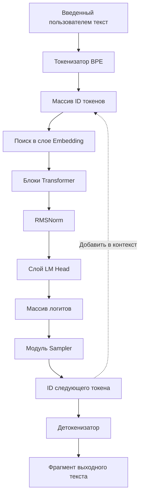
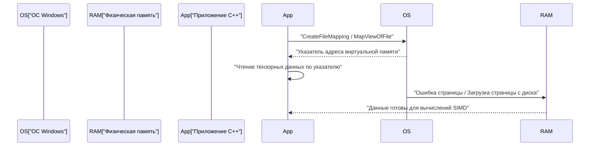
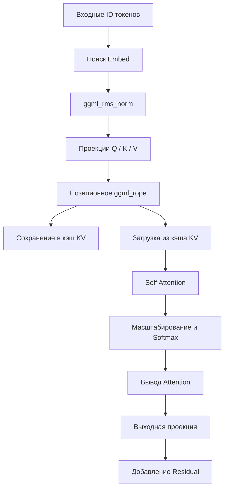

# Руководство по разработке небольших ИИ-моделей (таких как TinyLLaMA) на C++

В последние годы стремительно растет интерес к запуску больших языковых моделей (LLM) в локальных средах. В частности, небольшие модели, такие как TinyLLaMA (1,1 млрд параметров), могут осуществлять вывод с практической скоростью даже на периферийных устройствах с ограниченными ресурсами и обычных ноутбуках (включая среды Windows). В то время как разработка с использованием Python и PyTorch является мейнстримом, для достижения максимальной производительности и экономии памяти де-факто стандартом становится комбинация C++ и основанной на C тензорной библиотеки "ggml".

В этой статье будет представлено очень подробное пошаговое руководство по разработке для создания механизма вывода с нуля (или глубокого понимания внутренней структуры существующего llama.cpp) для загрузки TinyLLaMA и генерации текста с использованием C++.

---

## 1. Почему C++ и ggml?

На этапе обучения ИИ Python имеет подавляющее преимущество благодаря своей гибкости и богатой экосистеме. Однако на этапах развертывания и "вывода" (Inference) C++ становится мощным выбором по следующим причинам:

1. **Снижение накладных расходов**: Можно полностью исключить глобальную блокировку интерпретатора (GIL) и накладные расходы времени выполнения Python.
2. **Эффективность памяти и выделение арены**: Поскольку выделение и освобождение памяти можно контролировать вручную, предотвращаются непредсказуемые всплески, вызванные сборкой мусора.
3. **Прямой доступ к оборудованию**: Можно напрямую вызывать встроенные функции SIMD (Intrinsics), такие как AVX-512, AVX2, ARM NEON, чтобы максимально использовать вычислительную мощность процессора.
4. **Отсутствие зависимостей**: ggml — это библиотека C/C++ с нулевыми зависимостями (Zero dependencies), которую можно легко собрать даже в среде MSVC на Windows, если есть компилятор.

---

## 2. Общий обзор архитектуры

Общий поток конвейера вывода показан на диаграмме Mermaid ниже. Это серия процессов, начиная с введенного пользователем текста и заканчивая генерацией следующего токена.



Поскольку это авторегрессионная модель, выведенный токен снова добавляется в контекст и циркулирует как входные данные для прогнозирования следующего токена (пунктирная линия на диаграмме).

---

## 3. Формат модели и отображение памяти (mmap)

Самым большим препятствием при работе с весами гигантских нейронных сетей являются дисковый ввод-вывод и потребление памяти. В реализации на C++ это решается с помощью **отображения памяти (mmap)**.

### 3.1 Механизм отображения памяти и реализация в Windows

С помощью mmap содержимое файла можно напрямую отобразить в виртуальное адресное пространство процесса.

* **Zero-copy (Нулевое копирование)**: Данные считываются непосредственно с диска в страничный кэш ядра, и лишнее копирование в пользовательское пространство не происходит.
* **Загрузка по требованию (Page Fault)**: В тот момент, когда процессор фактически обращается к этому адресу памяти, происходит ошибка страницы (page fault), и в физическую память загружается только необходимый фрагмент (обычно 4 КБ).

В среде Windows вместо POSIX `mmap` используются API Win32 `CreateFileMapping` и `MapViewOfFile`.



### 3.2 Бинарная структура формата GGUF

**GGUF (GPT-Generated Unified Format)**, преобразованный из таких форматов, как `.safetensors` на Hugging Face, является идеальным форматом для вывода. Он имеет строгую бинарную структуру, как показано ниже:

1. **Magic Bytes**: `0x46554747` (GGUF).
2. **Version**: Номер версии формата.
3. **Tensor Count & Metadata Count**: Количество тензоров и количество пар ключ-значение метаданных.
4. **Metadata (Key-Value Pairs)**: Ключи с префиксом длины строки и типизированные значения.
5. **Tensor Info**: Имя каждого тензора, количество измерений, тип данных (FP16, Q4_K и т.д.) и позиция смещения в файле.
6. **Padding**: Заполнение (padding), вставляемое для того, чтобы тензорные данные были выровнены по определенной границе (обычно 32 или 64 байта). Это важно для быстрого доступа к памяти с помощью инструкций SIMD (особенно AVX).
7. **Tensor Data**: Массив выровненных фактических данных весов.

---

## 4. Математические основы TinyLLaMA и алгоритмы C++

TinyLLaMA включает в себя несколько продвинутых архитектурных хитростей для повышения эффективности. Мы объясним математические выражения, необходимые для их правильной реализации на C++.

### 4.1 RMSNorm (Нормализация среднеквадратичного значения)

Затраты на вычисления снижаются за счет отказа от центрирования по среднему значению из LayerNorm и выполнения только масштабирования дисперсии.

$$ \text{RMSNorm}(x) = \frac{x}{\sqrt{\frac{1}{d}\sum_{i=1}^{d} x_i^2 + \epsilon}} \odot \gamma $$

Где $d$ — количество измерений, а $\gamma$ — обученный тензор масштабирования.
При реализации на C++ сначала быстро вычисляется сумма квадратов массива с помощью `_mm256_fmadd_ps` из AVX2 и оптимизируется путем умножения на обратный квадратный корень (например, инструкция `_mm256_rsqrt_ps`).

### 4.2 RoPE (Rotary Position Embedding)

Это метод, который применяет информацию о позиции токена в виде вращения в тензорном пространстве. Его можно рассматривать как вращение на комплексной плоскости, и к соседней паре измерений $(x_1, x_2)$ вектора $x$ применяется следующее вращение:

$$ \text{RoPE}(x, m) = \begin{pmatrix} x_{1} \cos(m\theta) - x_{2} \sin(m\theta) \\ x_{1} \sin(m\theta) + x_{2} \cos(m\theta) \end{pmatrix} $$

Где $m$ — абсолютный индекс позиции токена, а $\theta$ — предварительно вычисленная базовая частота. В ggml это выполняется параллельно просто путем добавления оператора `ggml_rope` во время построения графа вывода.

### 4.3 Grouped-Query Attention (GQA)

В обычном Multi-Head Attention (MHA) количество голов для Query, Key и Value одинаково. Однако TinyLLaMA использует **Grouped-Query Attention (GQA)**, чтобы радикально снизить пропускную способность памяти и потребление кэша KV.

$$ \text{Attention}(Q, K, V) = \text{softmax}\left(\frac{Q K^T}{\sqrt{d_k}}\right) V $$

В GQA несколько голов Query совместно используют одну голову Key/Value. В реализации C++ перед выполнением матричного умножения `ggml_mul_mat` требуется операция широковещательной рассылки (broadcast) тензора KV в соответствии с количеством Query.

### 4.4 Функция активации SwiGLU

В слоях Feed-Forward Network (FFN) вместо GELU используется SwiGLU.

$$ \text{SwiGLU}(x) = \text{Swish}(x W_{\text{gate}}) \otimes (x W_{\text{up}}) $$
$$ \text{Swish}(z) = z \cdot \sigma(z) = z \cdot \frac{1}{1 + e^{-z}} $$

В вычислительном графе это выражается путем объединения оператора `ggml_silu` и `ggml_mul`.

---

## 5. Построение вычислительного графа и управление памятью с помощью ggml

ggml использует подход "Define-and-Run" (определи и запусти), при котором строится статический вычислительный граф для вывода, а затем вычисляется (evaluate).

### 5.1 ggml_context и распределитель арены (Arena Allocator)

Самая уникальная особенность ggml — это "выделение арены" (arena allocation), которое вообще не выполняет динамическое выделение памяти (`malloc` или `new`) внутри цикла вывода.
При инициализации выделяется огромная непрерывная область памяти (арена), и указатель этой области увеличивается (increment) каждый раз при вызове `ggml_new_tensor` и т.д. Когда один шаг вывода завершен, достаточно сбросить указатель выделения в исходное положение, и выделение памяти для следующего шага вывода мгновенно завершается.

### 5.2 Конкретный пример построения графа

Для каждого шага вывода в памяти собирается следующий вычислительный граф.



---

## 6. Квантование (Quantization) и оптимизация Windows / SIMD

Если обрабатывать TinyLLaMA (1.1B) в формате FP16, потребуется около 2,2 ГБ памяти, но с помощью 4-битного квантования (например, Q4_K) её можно радикально сжать примерно до 600 МБ.

### 6.1 Архитектура блочного квантования

ggml не квантует весь тензор единообразно, а делает это по «блокам».
В формате `Q4_0` 32 значения FP16 объединяются в один блок.
- **Масштабный коэффициент (Scale factor)**: 1 значение FP16 (2 байта)
- **Квантованные данные**: 32 4-битных значения (16 байт)
Это сводит к минимуму влияние локальных выбросов.

### 6.2 Ускорение скалярного произведения с помощью AVX2

При сборке для новейших процессоров x86 в среде Windows использование флагов компилятора, таких как `/arch:AVX2`, обеспечивает обработку SIMD в следующем потоке:

1. **Загрузка**: Загрузка 4-битных квантованных данных из памяти в 256-битный регистр AVX.
2. **Распаковка**: Развертывание 4-битных значений в Int8 или Int16 с помощью битовых масок и операций сдвига.
3. **Деквантование (Обратное квантование)**: Умножение на масштабный коэффициент для преобразования в число с плавающей запятой.
4. **Операция FMA**: Параллельное выполнение операций умножения с накоплением (multiply-add) со значениями активации с помощью `_mm256_fmadd_ps` (Fused Multiply-Add).

---

## 7. Детали реализации кэша KV

В авторегрессионной генерации «кэш KV» является важной функцией для пропуска вычисления Key и Value для прошлых токенов.

Ключевые моменты при реализации на C++:
1. **Предварительное выделение тензора**: Инициализируйте огромный тензор для кэша KV на максимальную длину контекста (например, 2048 токенов) (рекомендуется FP16).
2. **Копирование со смещением**: Когда выполняются вычисления для позиции токена $N$, векторы K и V, полученные на этом шаге, сохраняются в $N$-й строке тензора кэша KV с помощью `ggml_cpy` и т.д.
3. **Создание представления (view) во время Attention**: При вычислении Attention создается «представление» (view), указывающее только на часть токенов от 0 до $N$, которое передается в матричное умножение.

---

## 8. Токенизатор BPE и декодирование

Входная строка обрабатывается как последовательность байтов UTF-8 и сравнивается с заранее определенным словарем. В C++ для ускорения поиска по словарю реализуются алгоритмы с использованием **Trie-дерева (префиксного дерева)** или очереди с приоритетом.

Из логитов (logits), выводимых из LM Head, вероятности масштабируются с использованием параметра Temperature, кандидаты сужаются с помощью методов Top-K или Top-P (Nucleus Sampling), а затем случайные числа используются для определения конечного следующего токена.

---

## 9. Настройка проекта C++ (среда Windows / PowerShell)

```cmake
cmake_minimum_required(VERSION 3.14)
project(TinyLLaMACpp)

set(CMAKE_CXX_STANDARD 17)

# Настройки оптимизации и флага AVX2 для Windows (MSVC)
if(MSVC)
    add_compile_options(/O2 /arch:AVX2 /fp:fast)
    add_link_options(/STACK:8388608)
else()
    add_compile_options(-O3 -march=native -ffast-math)
endif()

add_library(ggml OBJECT ggml/ggml.c ggml/ggml-alloc.c)
target_compile_definitions(ggml PRIVATE GGML_USE_AVX2 GGML_USE_F16C GGML_USE_FMA)

add_executable(main main.cpp)
target_link_libraries(main ggml)
```

Пример команды сборки в PowerShell:
```powershell
mkdir build
cd build
cmake .. -G "Visual Studio 17 2022" -A x64
cmake --build . --config Release
```

---

## 10. Заключение

Реализация механизма вывода для небольших ИИ-моделей, таких как TinyLLaMA, с нуля с использованием C++ и ggml — это отличная возможность раскрыть черный ящик глубокого обучения и оценить красоту низкоуровневого управления аппаратным обеспечением. Давайте прокладывать путь в будущее периферийного ИИ (Edge AI), в полной мере наслаждаясь сутью системного программирования, такой как загрузка без копирования с использованием отображения памяти, оптимизация SIMD и создание кэша KV.
