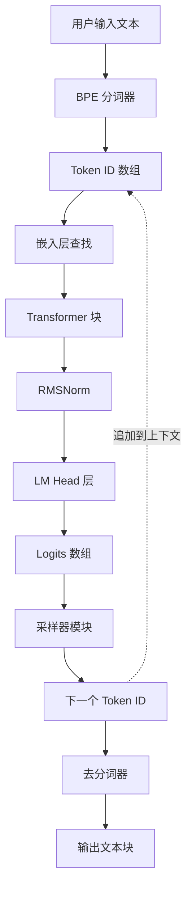
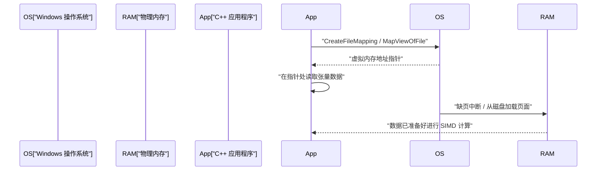
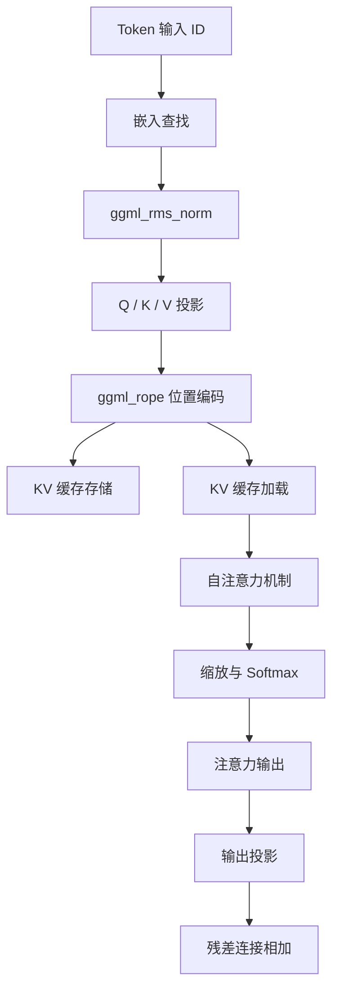

# 使用C++开发小规模AI模型（如TinyLLaMA）的步骤

近年来，在本地环境运行大型语言模型（LLM）的关注度急剧上升。特别是像TinyLLaMA（1.1B参数）这样的小规模模型，即使在资源有限的边缘设备或普通笔记本电脑（包括Windows环境）上，也能以实用的速度进行推理。虽然使用Python和PyTorch进行开发是主流，但在追求极致性能和内存节省时，C++和基于C语言的张量库“ggml”的组合成为了事实上的标准。

本文将非常详细地讲解如何从零开始构建一个使用C++加载TinyLLaMA并进行文本生成的推理引擎（或者说，深入理解现有的llama.cpp内部结构）的开发步骤。

---

## 1. 为什么选择C++和ggml？

在AI的训练阶段，具有灵活性和丰富生态系统的Python具有压倒性的优势。然而，在部署和“推理（Inference）”阶段，基于以下理由，C++成为了强大的选择。

1. **减少开销**：可以完全消除Python的全局解释器锁（GIL）和运行时的开销。
2. **内存效率和Arena分配**：可以手动控制内存的分配和释放，从而防止垃圾回收带来的不可预测的峰值。
3. **直接访问硬件**：直接调用AVX-512、AVX2、ARM NEON等SIMD内置函数（Intrinsics），将CPU的运算能力发挥到极致。
4. **零依赖**：ggml是一个零依赖（Zero dependencies）的C/C++库，只要有编译器，即使在Windows上的MSVC环境中也很容易编译。

---

## 2. 架构全景图

整个推理流水线的流程如以下Mermaid图表所示。这是一系列从用户输入文本开始，到最终生成下一个Token为止的过程。



由于它是自回归模型，输出的Token会再次被添加到上下文中，作为预测下一个Token的输入进行循环（图中虚线部分）。

---

## 3. 模型格式与内存映射 (mmap)

处理庞大的神经网络权重时，最大的障碍是磁盘I/O和内存消耗。在C++实现中，通过**内存映射（mmap）**来解决这个问题。

### 3.1 内存映射的原理及在Windows中的实现

使用mmap，可以将文件的内容直接映射到进程的虚拟内存空间中。

* **零拷贝（Zero-copy）**：数据直接从磁盘加载到内核的页面缓存中，不会发生向用户空间的多余拷贝。
* **按需加载（Page Fault）**：只有当CPU实际访问该内存地址的瞬间，才会发生缺页中断（Page Fault），并且仅将需要的块（通常为4KB）加载到物理内存中。

在Windows环境中，不使用POSIX的 `mmap`，而是使用Win32 API的 `CreateFileMapping` 和 `MapViewOfFile`。



### 3.2 GGUF 格式的二进制结构

从Hugging Face等的 `.safetensors` 格式转换而来的 **GGUF (GPT-Generated Unified Format)** 是用于推理的终极格式。它具有以下严格的二进制布局：

1. **Magic Bytes**: `0x46554747` (GGUF)。
2. **Version**: 格式的版本号。
3. **Tensor Count & Metadata Count**: 张量数量和元数据的键值对数量。
4. **Metadata (Key-Value Pairs)**: 带有字符串长度前缀的键和带有类型的值。
5. **Tensor Info**: 每个张量的名称、维度数、数据类型（如FP16，Q4_K等），以及在文件中的偏移位置。
6. **Padding**: 插入的填充物，用于将张量数据对齐到特定边界（通常为32字节或64字节）。这对使用SIMD指令（特别是AVX）进行高速内存访问至关重要。
7. **Tensor Data**: 已对齐的实际权重数据数组。

---

## 4. TinyLLaMA的数学基础与C++算法

TinyLLaMA为了提高效率，引入了一些高级的架构设计。为了在C++中正确实现这些，以下是它们的数学公式表示。

### 4.1 RMSNorm (Root Mean Square Normalization)

省略了LayerNorm中的均值中心化，仅进行方差的缩放，从而降低了计算成本。

$$ \text{RMSNorm}(x) = \frac{x}{\sqrt{\frac{1}{d}\sum_{i=1}^{d} x_i^2 + \epsilon}} \odot \gamma $$

其中 $d$ 是维度数，$\gamma$ 是训练好的缩放张量。
在C++中实现时，首先使用AVX2的 `_mm256_fmadd_ps` 等快速计算数组的平方和，然后乘以平方根的倒数（如 `_mm256_rsqrt_ps` 指令）来进行优化。

### 4.2 RoPE (Rotary Position Embedding)

这是一种将Token的位置信息作为张量空间中的旋转（Rotate）来应用的技术。可以将其视为复平面上的旋转，对向量 $x$ 的相邻维度对 $(x_1, x_2)$ 应用以下旋转：

$$ \text{RoPE}(x, m) = \begin{pmatrix} x_{1} \cos(m\theta) - x_{2} \sin(m\theta) \\ x_{1} \sin(m\theta) + x_{2} \cos(m\theta) \end{pmatrix} $$

在这里，$m$ 是Token的绝对位置索引，$\theta$ 是预先计算好的基频。在ggml中，只需在构建推理图时添加 `ggml_rope` 算子即可并行执行。

### 4.3 Grouped-Query Attention (GQA)

在常规的多头注意力机制（MHA）中，Query、Key和Value各具有相同数量的头。然而，TinyLLaMA为了大幅减少内存带宽和KV缓存的消耗，采用了 **Grouped-Query Attention (GQA)**。

$$ \text{Attention}(Q, K, V) = \text{softmax}\left(\frac{Q K^T}{\sqrt{d_k}}\right) V $$

在GQA中，多个Query头共享一个Key/Value头。在C++实现中，在执行矩阵乘法 `ggml_mul_mat` 之前，需要根据Query的数量将KV张量进行广播（Broadcast）操作。

### 4.4 SwiGLU 激活函数

在前馈网络（FFN）层中，使用SwiGLU代替GELU。

$$ \text{SwiGLU}(x) = \text{Swish}(x W_{\text{gate}}) \otimes (x W_{\text{up}}) $$
$$ \text{Swish}(z) = z \cdot \sigma(z) = z \cdot \frac{1}{1 + e^{-z}} $$

在计算图中，通过组合 `ggml_silu` 算子和 `ggml_mul` 来表示。

---

## 5. 使用ggml构建计算图与内存管理

ggml采用“Define-and-Run”的方法，先构建用于推理的静态计算图，然后再进行评估（evaluate）。

### 5.1 ggml_context 与 Arena 分配器

ggml最独特的地方在于，推理循环内完全不进行动态内存分配（如 `malloc` 或 `new`）的“Arena 分配（Arena Allocation）”。
初始化时分配一大块连续的内存区域（Arena），每次调用 `ggml_new_tensor` 等函数时，都会递增这个区域的指针。当完成一个推理步骤后，只需将分配指针重置到初始位置，即可立即完成下一个推理步骤的内存分配。

### 5.2 构建图的具体示例

在每个推理步骤中，会在内存中组装如下的计算图。



---

## 6. 量化 (Quantization) 与 Windows / SIMD 优化

如果用FP16处理TinyLLaMA (1.1B)，大约需要2.2GB的内存，但通过4位量化（如Q4_K），可以将其大幅压缩至约600MB左右。

### 6.1 块量化架构

ggml并不是对整个张量进行统一量化，而是以“块（Block）”为单位进行的。
在 `Q4_0` 格式中，将32个FP16值组合成一个块。
- **缩悉因子（Scale factor）**：1个FP16值（2字节）
- **量化数据**：32个4位值（16字节）
通过这种方式，将局部异常值的影响降至最低。

### 6.2 利用AVX2加速点积运算

当在Windows环境中为最新的x86 CPU进行编译时，可以利用 `/arch:AVX2` 等编译器标志，SIMD处理流程如下：

1. **加载**：将4位量化数据从内存加载到256位的AVX寄存器中。
2. **展开与解包**：通过位掩码和移位运算，将4位值展开为Int8或Int16。
3. **反量化**：乘以缩放因子，转换为浮点数。
4. **FMA运算**：使用激活值和 `_mm256_fmadd_ps`（融合乘加）并行执行乘累加运算。

---

## 7. KV缓存的实现细节

在自回归生成中，为了省略计算过去Token的Key和Value，必须使用“KV缓存（KV Cache）”。

在C++中实现时的要点如下：
1. **预先分配张量**：为KV缓存初始化一个能够容纳最大上下文长度（例如：2048个Token）的巨大张量（推荐使用FP16）。
2. **偏移复制**：当执行针对Token位置 $N$ 的计算时，将该步骤中得到的K和V向量使用 `ggml_cpy` 等方法存储到KV缓存张量的第 $N$ 行。
3. **注意力计算时的视图（View）创建**：在计算注意力时，创建一个仅指向从第0个到第 $N$ 个Token部分的“视图”，并将其传递给矩阵乘法。

---

## 8. BPE 分词器与解码

将输入字符串视为UTF-8的字节流，并与预先定义的词汇表进行匹配。在C++中，为了加速词汇表的搜索，通常会实现 **Trie树（前缀树）** 或使用优先队列的算法。

从LM Head输出的Logits，使用Temperature参数缩放概率，通过Top-K提取或Top-P（Nucleus Sampling）方法缩小候选范围，并使用随机数决定最终的下一个Token。

---

## 9. 搭建C++项目（Windows / PowerShell 环境）

```cmake
cmake_minimum_required(VERSION 3.14)
project(TinyLLaMACpp)

set(CMAKE_CXX_STANDARD 17)

# 面向 Windows (MSVC) 的优化和 AVX2 标志的设置
if(MSVC)
    add_compile_options(/O2 /arch:AVX2 /fp:fast)
    add_link_options(/STACK:8388608)
else()
    add_compile_options(-O3 -march=native -ffast-math)
endif()

add_library(ggml OBJECT ggml/ggml.c ggml/ggml-alloc.c)
target_compile_definitions(ggml PRIVATE GGML_USE_AVX2 GGML_USE_F16C GGML_USE_FMA)

add_executable(main main.cpp)
target_link_libraries(main ggml)
```

PowerShell 中的构建命令示例：
```powershell
mkdir build
cd build
cmake .. -G "Visual Studio 17 2022" -A x64
cmake --build . --config Release
```

---

## 10. 总结

使用C++和ggml从零开始实现像TinyLLaMA这样的小规模AI模型的推理引擎，是揭开深度学习黑盒、学习底层硬件控制之美的绝佳机会。在充分体会利用内存映射进行零拷贝加载、SIMD优化、KV缓存构建等系统编程精髓的同时，让我们共同开拓边缘AI的未来。
