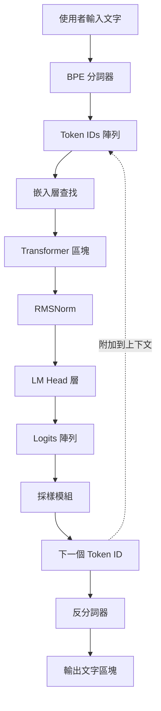
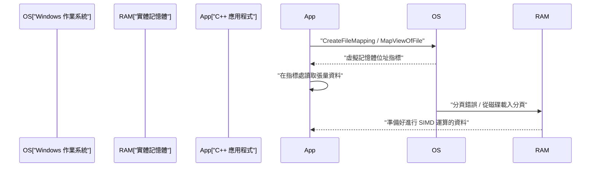
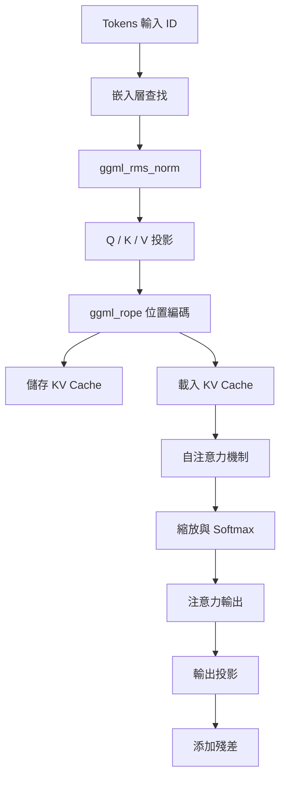

# 使用C++開發小規模AI模型（如TinyLLaMA）的步驟指南

近年來，在本地環境中執行大型語言模型（LLM）的關注度急遽上升。特別是像 TinyLLaMA（1.1B參數）這樣的小規模模型，即使在資源受限的邊緣裝置或一般筆記型電腦（包含 Windows 環境）上，也能以實用的速度進行推論。雖然使用 Python 和 PyTorch 進行開發是目前的主流，但若要追求極致的效能與記憶體節省，結合 C++ 與基於 C 語言的張量函式庫「ggml」已成為業界的標準。

本文將提供非常詳細的開發步驟，解說如何從零開始建構（或深入理解現有 llama.cpp 的內部結構）一個使用 C++ 載入 TinyLLaMA 並進行文字生成的推論引擎。

---

## 1. 為什麼選擇C++與ggml？

在 AI 的訓練階段，擁有高靈活性與豐富生態系的 Python 佔有絕對的優勢。然而，在部署與「推論（Inference）」階段，基於以下理由，C++ 成為了強大的選擇：

1. **減少額外負擔（Overhead）**: 可以完全消除 Python 的全域直譯器鎖（GIL）以及執行時期的額外負擔。
2. **記憶體效率與 Arena 分配（Arena Allocation）**: 由於可以手動控制記憶體的配置與釋放，能防止垃圾回收（Garbage Collection）所造成無法預測的效能突波。
3. **直接存取硬體**: 能夠直接呼叫 AVX-512、AVX2、ARM NEON 等 SIMD 內建函式（Intrinsics），將 CPU 的運算能力發揮到極致。
4. **排除依賴關係**: ggml 是一個零依賴（Zero dependencies）的 C/C++ 函式庫，只要有編譯器，即使在 Windows 的 MSVC 環境下也能輕鬆編譯。

---

## 2. 架構全貌

推論管線（Pipeline）整體的流程如下方 Mermaid 圖表所示。這是一連串從使用者的輸入文字開始，直到最終生成下一個 Token 的過程。



因為是自迴歸模型，輸出的 Token 會再次被加入到上下文中，作為預測下一個 Token 的輸入進行循環（圖中虛線部分）。

---

## 3. 模型格式與記憶體映射 (mmap)

處理巨大神經網路權重時，最大的障礙在於磁碟 I/O 與記憶體消耗。在 C++ 實作中，我們透過**記憶體映射（mmap）**來解決這個問題。

### 3.1 記憶體映射的機制與 Windows 上的實作

使用 mmap 可以將檔案內容直接映射到處理程序的虛擬記憶體空間中。

* **零拷貝（Zero-copy）**: 資料會從磁碟直接讀取到核心的分頁快取（Page Cache）中，不會在使用者空間產生多餘的拷貝。
* **按需載入（Page Fault）**: 只有在 CPU 實際存取該記憶體位址的瞬間，才會發生分頁錯誤（Page Fault），並僅將需要的區塊（通常是 4KB）載入到實體記憶體中。

在 Windows 環境中，我們使用 Win32 API 的 `CreateFileMapping` 和 `MapViewOfFile` 來取代 POSIX 的 `mmap`。



### 3.2 GGUF 格式的二進位結構

從 Hugging Face 等平台的 `.safetensors` 格式轉換而來的 **GGUF (GPT-Generated Unified Format)**，是專為推論打造的終極格式。它具有以下嚴謹的二進位佈局（Binary Layout）：

1. **Magic Bytes**: `0x46554747` (GGUF)。
2. **Version**: 格式的版本號碼。
3. **Tensor Count & Metadata Count**: 張量數量與 Metadata 的鍵值對（Key-Value Pairs）數量。
4. **Metadata (Key-Value Pairs)**: 帶有字串長度前綴的鍵（Key）以及具有型別的值（Value）。
5. **Tensor Info**: 每個張量的名稱、維度數、資料型別（如 FP16, Q4_K 等），以及在檔案內的偏移位置（Offset）。
6. **Padding**: 為了讓張量資料對齊特定邊界（通常是 32 或 64 位元組）而插入的填充資料。這對於使用 SIMD 指令（特別是 AVX）進行高速記憶體存取來說不可或缺。
7. **Tensor Data**: 已經對齊的實際權重資料陣列。

---

## 4. TinyLLaMA的數學基礎與C++演算法

TinyLLaMA 為了提升效率，採用了一些進階的架構設計。以下將解說為了在 C++ 中正確實作這些設計的數學公式表示。

### 4.1 RMSNorm (Root Mean Square Normalization)

省略了 LayerNorm 中的平均值置中操作，僅進行變異數的縮放，藉此降低計算成本。

$$ \text{RMSNorm}(x) = \frac{x}{\sqrt{\frac{1}{d}\sum_{i=1}^{d} x_i^2 + \epsilon}} \odot \gamma $$

$d$ 是維度數，$\gamma$ 是訓練好的縮放張量。
在 C++ 中實作時，首先使用 AVX2 的 `_mm256_fmadd_ps` 等指令高速計算陣列的平方和，再乘上反平方根（如 `_mm256_rsqrt_ps` 指令）來進行最佳化。

### 4.2 RoPE (Rotary Position Embedding)

這是一項將 Token 的位置資訊視為在張量空間中的旋轉（Rotate）並加以應用的技術。可以將其看作在複數平面上的旋轉，對於向量 $x$ 中相鄰的維度對 $(x_1, x_2)$ 套用以下的旋轉：

$$ \text{RoPE}(x, m) = \begin{pmatrix} x_{1} \cos(m\theta) - x_{2} \sin(m\theta) \\ x_{1} \sin(m\theta) + x_{2} \cos(m\theta) \end{pmatrix} $$

這裡的 $m$ 是 Token 的絕對位置索引，$\theta$ 是預先計算好的基礎頻率。在 ggml 中，只需在建構推論圖時加入 `ggml_rope` 運算子，就會平行執行。

### 4.3 Grouped-Query Attention (GQA)

在一般的多頭注意力機制（Multi-Head Attention, MHA）中，Query、Key 和 Value 各自擁有相同數量的注意力頭（Head）。然而，TinyLLaMA 為了大幅減少記憶體頻寬與 KV Cache 的消耗，採用了 **Grouped-Query Attention (GQA)**。

$$ \text{Attention}(Q, K, V) = \text{softmax}\left(\frac{Q K^T}{\sqrt{d_k}}\right) V $$

在 GQA 中，多個 Query 頭會共用一個 Key/Value 頭。在 C++ 實作中，在執行矩陣乘法 `ggml_mul_mat` 之前，必須先執行將 KV 張量依照 Query 數量進行廣播（Broadcast）的操作。

### 4.4 SwiGLU 激勵函式

在前饋神經網路（Feed-Forward Network, FFN）層中，使用的是 SwiGLU 而非 GELU。

$$ \text{SwiGLU}(x) = \text{Swish}(x W_{\text{gate}}) \otimes (x W_{\text{up}}) $$
$$ \text{Swish}(z) = z \cdot \sigma(z) = z \cdot \frac{1}{1 + e^{-z}} $$

在計算圖中，會結合使用 `ggml_silu` 運算子與 `ggml_mul` 來表現。

---

## 5. 使用ggml建構計算圖與記憶體管理

ggml 採用「Define-and-Run」的方法，也就是先為推論建構靜態的計算圖，之後再對其進行評估（Evaluate）。

### 5.1 ggml_context 與 Arena Allocator

ggml 最獨特的一點在於「Arena Allocation」，它在推論迴圈內完全不進行動態的記憶體配置（如 `malloc` 或 `new`）。
在初始化時，會先保留一塊巨大的連續記憶體區域（Arena），每當呼叫 `ggml_new_tensor` 等函式時，這塊區域的指標就會遞增。當推論的一個步驟完成後，只需將配置指標重設回初始位置，就能立即完成下一個推論步驟的記憶體配置準備。

### 5.2 計算圖建構的具體範例

在每個推論步驟中，都會在記憶體上組合出如下的計算圖。



---

## 6. 量子化 (Quantization) 與 Windows / SIMD 最佳化

若以 FP16 來處理 TinyLLaMA (1.1B)，大約需要 2.2GB 的記憶體，但透過 4 位元量子化（如 Q4_K），可以大幅壓縮至約 600MB 左右。

### 6.1 區塊量子化架構

ggml 並非將整個張量統一進行量子化，而是以「區塊（Block）」為單位進行。
在 `Q4_0` 格式中，會將 32 個 FP16 數值組成一個區塊。
- **縮放因子 (Scale Factor)**: 1 個 FP16 數值（2 位元組）
- **量子化資料**: 32 個 4 位元數值（16 位元組）
藉此能將局部異常值（Outlier）的影響降到最低。

### 6.2 利用 AVX2 加速內積計算

在針對 Windows 環境中最新的 x86 CPU 進行編譯時，可以善用 `/arch:AVX2` 等編譯器旗標，並透過以下流程進行 SIMD 處理：

1. **載入 (Load)**: 從記憶體將 4 位元量子化資料載入至 256 位元的 AVX 暫存器中。
2. **展開與解包 (Unpack)**: 利用位元遮罩（Bitmask）與移位運算，將 4 位元數值展開為 Int8 或 Int16。
3. **反量子化 (Dequantize)**: 乘上縮放因子將其轉換為浮點數。
4. **FMA 運算**: 將結果與激勵值（Activation）使用 `_mm256_fmadd_ps` (Fused Multiply-Add) 平行執行乘加運算。

---

## 7. KV Cache的實作細節

在自迴歸生成中，為了省略過去 Token 的 Key 和 Value 計算，「KV Cache」是不可或缺的功能。

在 C++ 中實作的重點如下：
1. **預先配置張量**: 初始化一個對應最大上下文長度（例如：2048 Tokens）的巨大張量作為 KV Cache（建議使用 FP16）。
2. **偏移拷貝 (Offset Copy)**: 當對位置 $N$ 的 Token 進行計算後，將該步驟得到的 K 和 V 向量，使用 `ggml_cpy` 等方式儲存到 KV Cache 張量的第 $N$ 列中。
3. **注意力機制時建立視圖 (View)**: 在計算注意力時，建立一個只指向第 0 到第 $N$ 個 Token 部分的「視圖」，並將其傳遞給矩陣乘法操作。

---

## 8. BPE Tokenizer 與解碼

將輸入字串視為 UTF-8 位元組序列，並與預先定義好的詞彙表（Vocabulary）進行比對。在 C++ 中，為了加速詞彙表的搜尋，通常會實作 **Trie 樹（前綴樹）** 或使用優先權佇列（Priority Queue）的演算法。

從 LM Head 輸出的 Logits 中，會使用 Temperature 參數來縮放機率，再透過 Top-K 提取或 Top-P（Nucleus Sampling）方法來縮小候選範圍，最後使用亂數來決定最終的下一個 Token。

---

## 9. 建立C++專案（Windows / PowerShell 環境）

```cmake
cmake_minimum_required(VERSION 3.14)
project(TinyLLaMACpp)

set(CMAKE_CXX_STANDARD 17)

# 針對 Windows (MSVC) 的最佳化與 AVX2 旗標設定
if(MSVC)
    add_compile_options(/O2 /arch:AVX2 /fp:fast)
    add_link_options(/STACK:8388608)
else()
    add_compile_options(-O3 -march=native -ffast-math)
endif()

add_library(ggml OBJECT ggml/ggml.c ggml/ggml-alloc.c)
target_compile_definitions(ggml PRIVATE GGML_USE_AVX2 GGML_USE_F16C GGML_USE_FMA)

add_executable(main main.cpp)
target_link_libraries(main ggml)
```

PowerShell 中的編譯指令範例：
```powershell
mkdir build
cd build
cmake .. -G "Visual Studio 17 2022" -A x64
cmake --build . --config Release
```

---

## 10. 總結

使用 C++ 與 ggml 從零開始實作如 TinyLLaMA 這類小規模 AI 模型的推論引擎，是揭開深度學習黑盒子、並學習低階硬體控制之美的絕佳機會。讓我們一邊充分體會利用記憶體映射進行的零拷貝載入、SIMD 最佳化、建構 KV Cache 等系統程式設計的精髓，一邊開拓邊緣 AI（Edge AI）的未來吧。
