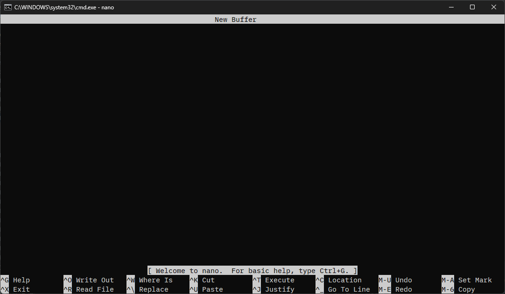

## Mengunduh nano.exe
https://sourceforge.net/projects/nano-for-windows/

Buka tautan di atas dan klik `Download` untuk mengunduh `GNU-Nano_Win32(static).zip`.
Ekstrak file zip dan tempatkan `nano.exe` di folder mana pun.
* Input bahasa Jepang tidak didukung. (Per 31/03/2024)

## Mengatur variabel lingkungan
Untuk menggunakan `nano.exe` dari Command Prompt, Anda perlu mengatur variabel lingkungan.

1. Tekan tombol `Win` + `R`, ketik `sysdm.cpl`, lalu tekan tombol `Enter`.
2. Klik `Properti Sistem` (System Properties).
3. Klik `Variabel Lingkungan` (Environment Variables).
4. Pilih `Path` di bawah `Variabel sistem` dan klik `Edit`.
5. Klik `Baru` (New) dan tambahkan jalur `nano.exe`.
6. Klik `OK` untuk menutup semua kotak dialog.
7. Mulai ulang Command Prompt, ketik `nano` dan periksa apakah itu dapat dijalankan.

## Cara menggunakan nano

Saat Anda mengetik `nano` dan menjalankannya, layar berikut akan ditampilkan.

Penjelasan tentang pintasan ditampilkan di bagian bawah layar.

Arti dari simbol-simbol tersebut adalah sebagai berikut.

- `^` mewakili tombol `Ctrl`.
- `M-` mewakili tombol `Alt`.

Untuk menyimpan dan menutup, tekan `Ctrl` + `S` lalu tekan `Ctrl` + `X`.

## Referensi
- [GNU nano](https://www.nano-editor.org/)
