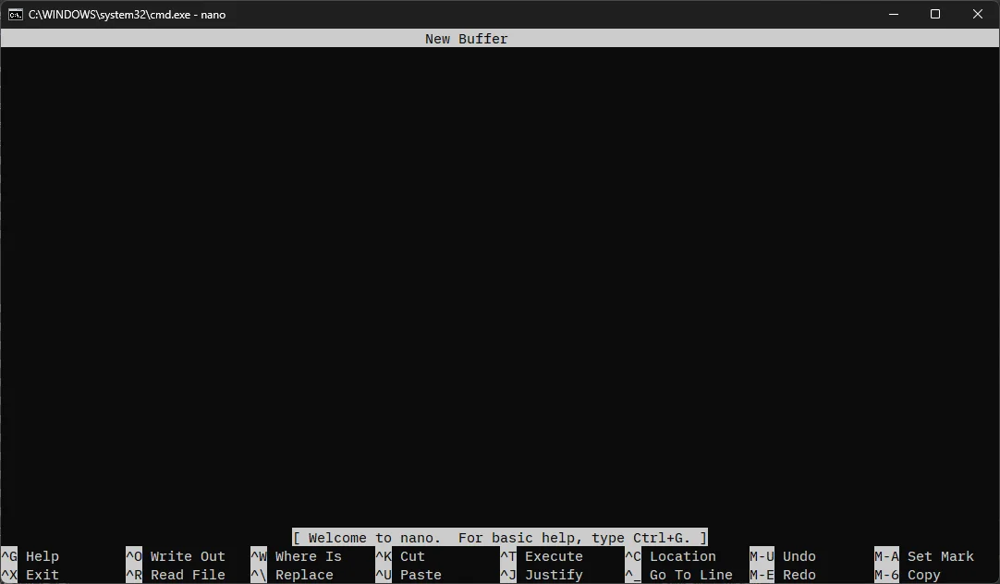

---
title: '在Windows中安裝CLI文字編輯器nano並設定環境變數的方法'
slug: "CLIテキストエディタnanoをWindowsにインストールする方法"
date: 2024-03-31T18:09:32+09:00
tags: ["nano", "文字編輯器"]
draft: false
image: "img_1.webp"
categories: ["工具與開發環境"]
description: '為您解說如何在Windows上安裝輕量級的CLI文字編輯器「nano」，並設定環境變數以便在命令提示字元中使用的步驟。內容涵蓋從下載到PATH設定、以及基本的使用方法。'
---

## 下載 nano.exe
https://sourceforge.net/projects/nano-for-windows/

打開上述連結，點擊 `Download` 下載 `GNU-Nano_Win32(static).zip`。
解壓縮 zip 檔案，並將 `nano.exe` 放置在任意資料夾中。
※ 尚未支援日文輸入（截至 2024/03/31）。

## 設定環境變數
為了在命令提示字元中使用 `nano.exe`，您需要設定環境變數。

1. 按下 `Win 鍵` + `R 鍵`，輸入 `sysdm.cpl`，然後按下 `Enter 鍵`。
2. 在「系統內容」中點擊 `系統內容`。
3. 點擊 `環境變數`。
4. 選擇「系統變數」中的 `Path`，然後點擊 `編輯`。
5. 點擊 `新增`，然後加入 `nano.exe` 的路徑。
6. 點擊 `確定` 以關閉所有對話方塊。
7. 重新啟動命令提示字元，輸入 `nano` 看看是否能成功執行。

## nano 的使用方法

輸入 `nano` 並執行後，會顯示以下畫面。

畫面下方會顯示快捷鍵的說明。

符號的意義如下：

- `^` 代表 `Ctrl` 鍵。
- `M-` 代表 `Alt` 鍵。

若要儲存並關閉，請先按下 `Ctrl` + `S`，接著按下 `Ctrl` + `X`。

## 參考
- [GNU nano](https://www.nano-editor.org/)
