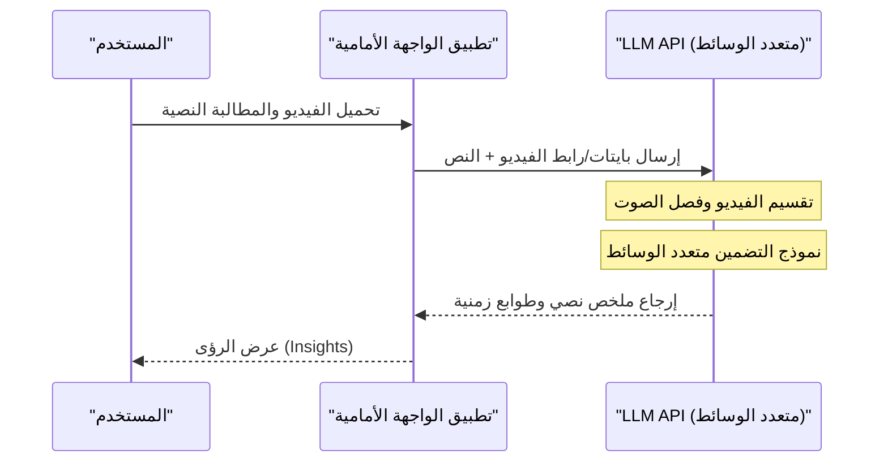

# مقارنة شاملة لواجهات برمجة التطبيقات (API) لـ ChatGPT و Gemini و Claude! أيهم يجب أن تختار؟

تطور تكنولوجيا الذكاء الاصطناعي مذهل، وخاصة في مجال النماذج اللغوية الكبيرة (LLM: Large Language Model)، حيث تدور معركة شرسة ثلاثية الأبعاد على الهيمنة بين ChatGPT (سلسلة GPT) من OpenAI، و Gemini من Google، و Claude من Anthropic. اعتبارًا من عام 2026، تطلق كل شركة نماذج وميزات API جديدة كل بضعة أشهر، بل كل بضعة أسابيع. بالنسبة للمطورين ومهندسي تكنولوجيا المعلومات في الشركات، أصبح السؤال "أي واجهة برمجة تطبيقات (API) يجب دمجها في منتجنا؟" قرارًا بالغ الأهمية يحدد نجاح المشروع.

في هذه المقالة، لن نقتصر على سرد المواصفات لهذه الواجهات البرمجية من مزودي الذكاء الاصطناعي الثلاثة الكبار، بل سنقوم بمقارنتها وشرحها بالتفصيل من وجهة نظر المطورين. سيشمل ذلك تصميم البنية التحتية، والهياكل التفصيلية للأسعار، والتحليل الرياضي لوقت الاستجابة (زمن الانتقال)، وأمثلة تطبيقية عملية باستخدام Python و Node.js، وصولاً إلى أحدث تقنيات تحسين التكلفة مثل التخزين المؤقت للمطالبات (Prompt Caching).

نهدف إلى أن يكون هذا دليلاً كاملاً لقرائنا لاختيار API الخاص بـ LLM الأنسب لحالات الاستخدام الخاصة بهم، وبناء تطبيقات ذكاء اصطناعي قابلة للتوسع وعالية الكفاءة من حيث التكلفة.

---

## 1. الفلسفة ومبادئ التصميم لكل LLM API

عند اختيار التقنية، من المهم جدًا فهم الفلسفة التي تبني عليها كل شركة نماذجها وواجهات برمجة التطبيقات الخاصة بها.

### 1.1 OpenAI (ChatGPT)
تضع OpenAI "تحقيق الذكاء الاصطناعي العام (AGI)" كمهمة لها، وتقود دائمًا المعايير الصناعية (De facto standard). توفر الشركة نماذج متنوعة مصممة خصيصًا لحالات الاستخدام المختلفة، مثل GPT-4o و GPT-4o-mini، ونماذج o1 المتخصصة في الاستدلال. تمتلك النظام البيئي الأكثر نضجًا، مع توفر أكبر عدد من المكتبات والوثائق سواء الرسمية أو غير الرسمية.

### 1.2 Google (Gemini)
ترفع Google شعار "AI First" (الذكاء الاصطناعي أولاً)، وتتسلح بقابلية التوسع (Scalability) التي تستفيد إلى أقصى حد من بنيتها التحتية (شبكة TPU). تتميز نماذج Gemini 1.5 Pro/Flash بامتلاكها نافذة سياق ضخمة تصل إلى 2 مليون رمز (Token)، مما يسمح لها بمعالجة مستندات طويلة جدًا أو مقاطع فيديو وصوت تمتد لساعات في وقت واحد. كما يعد التكامل القوي مع Google Cloud (Vertex AI) ميزة جذابة للغاية للشركات.

### 1.3 Anthropic (Claude)
شركة Anthropic، التي أسسها أعضاء سابقون في OpenAI، تتبنى نهجًا فريدًا للسلامة يُعرف بـ "الذكاء الاصطناعي الدستوري" (Constitutional AI). تحظى نماذج Claude 3.5 Sonnet و Opus بدعم حماسي من العديد من المطورين بفضل قدراتها العالية في الاستدلال، وتوليد الكود، وقبل كل شيء "الحوار الطبيعي الشبيه بالبشر" و"قلة الهلوسة" (Hallucination).

---

## 2. مقارنة تفصيلية لمواصفات عائلات النماذج

فيما يلي مقارنة لمواصفات النماذج الرئيسية اعتبارًا من عام 2026.

| المزود | النموذج الرئيسي | أقصى طول للسياق | نقاط القوة الرئيسية | حالات الاستخدام الموصى بها |
|---|---|---|---|---|
| **OpenAI** | GPT-4o | 128K | السرعة، التعرف البصري، دعم الصوت | التطبيقات التفاعلية، المهام العامة |
| **OpenAI** | o1-preview | 128K | الاستدلال المنطقي المتقدم، الرياضيات، البرمجة | توليد الخوارزميات المعقدة، أغراض البحث |
| **Google** | Gemini 1.5 Pro | 2,000K | معالجة النصوص الطويلة جدًا، متعدد الوسائط (فيديو/صوت) | تحليل قواعد البيانات البرمجية الضخمة، تلخيص الفيديو |
| **Google** | Gemini 1.5 Flash | 2,000K | زمن استجابة منخفض، إنتاجية عالية، تكلفة منخفضة جدًا | المعالجة في الوقت الفعلي، معالجة الدفعات للبيانات الضخمة |
| **Anthropic** | Claude 3.5 Sonnet | 200K | قدرات البرمجة، توليد نصوص طبيعية | دعم تطوير البرمجيات، خدمة العملاء المتقدمة |
| **Anthropic** | Claude 3.5 Haiku | 200K | استجابة فائقة السرعة، أداء عالي مقابل التكلفة | الذكاء الاصطناعي للطرفيات (Edge AI)، روبوتات الدردشة في الوقت الفعلي |

---

## 3. تعمق في البنية: ما وراء كواليس طلبات API

عند استدعاء LLM API، ما هي العمليات التي تتم في الخلفية؟ من أجل تحسين الأداء، من الضروري فهم هذه البنية.

يوضح مخطط Mermaid التالي الصورة العامة للعملية منذ إرسال طلب API من العميل وحتى إرجاع الرموز (Tokens) عبر البث (Streaming).

```mermaid
graph TD
    A["تطبيق العميل"] -->|HTTP/REST أو gRPC| B["بوابة API"]
    B --> C["موازن الحمل"]
    C --> D["مجموعة الاستدلال"]
    D --> E["مُقسِّم الرموز (BPE / SentencePiece)"]
    E --> F["ذاكرة التخزين المؤقت KV وآلية الانتباه"]
    F --> G["كتل المحول (التمرير الأمامي)"]
    G --> H["طبقة المخرجات (Logits)"]
    H --> I["أداة أخذ العينات (Temperature, Top-p, Top-k)"]
    I --> J["مُجمِّع الرموز"]
    J -->|استجابة البث (قطعة)| A
```

### 3.1 خوارزمية تقسيم الرموز (Tokenization)
يتم تقسيم النص المُدخل إلى API داخليًا إلى وحدات تسمى "الرموز" (Tokens).
- **OpenAI (tiktoken)**: تعتمد على Byte-Pair Encoding (BPE). يتم ضغطها بكفاءة عالية جدًا، خاصة في اللغة الإنجليزية، ولكن عدد الرموز يميل إلى التضخم في اللغات غير الأبجدية.
- **Google (Gemini)**: تعتمد على SentencePiece (Unigram Language Model). قوية في التعامل مع اللغات المتعددة، وتميل إلى القدرة على التعبير عن النصوص بعدد أقل من الرموز نسبيًا حتى في اللغات الأخرى.
- **Anthropic (Claude)**: تستخدم نسخة مخصصة من BPE. تم تعزيز دعم اللغات المتعددة، واعتبارًا من Claude 3، تم تحسين كفاءة الرموز بشكل كبير في لغات أخرى.

---

## 4. التحليل الرياضي لزمن الاستجابة والأداء

في التطبيقات التي تعمل في الوقت الفعلي، يرتبط زمن الاستجابة (Latency) ارتباطًا مباشرًا بتجربة المستخدم (UX). يمكن نمذجة زمن الاستجابة الكلي لـ LLM API ریاضیًا كالتالي:

$$ T_{total} = T_{network} + T_{TTFT} + (N \times T_{TPOT}) $$

حيث يحمل كل متغير المعاني التالية:
- $T_{network}$: وقت رحلة الذهاب والإياب للشبكة (RTT).
- $T_{TTFT}$ (Time To First Token): الوقت المستغرق حتى يتم إنشاء الحرف (الرمز) الأول. يعتمد بشكل كبير على تكلفة حساب الانتباه (Attention) التي تتناسب طرديًا مع مربع طول المطالبة (عدد الرموز المدخلة).
- $N$: العدد الإجمالي للرموز المخرجة.
- $T_{TPOT}$ (Time Per Output Token): وقت الإنشاء لكل رمز. نظرًا لأنه نموذج انحدار ذاتي (Autoregressive)، يتم حسابه بشكل تسلسلي بالاعتماد على المخرجات السابقة.

### 4.1 التعقيد الحسابي لآلية الانتباه الذاتي (Self-Attention)
يزداد التعقيد الحسابي للانتباه الذاتي في بنية Transformer بشكل تربيعي بالنسبة لطول التسلسل المدخل $L$.

$$ \text{Complexity} = O(L^2 \cdot d) $$

حيث $d$ هو عدد أبعاد متجه التضمين (Embedding). وبسبب هذا القيد، يتدهور $T_{TTFT}$ عادة بشكل حاد عندما تطول المطالبة.
ومع ذلك، تتبنى نماذج Gemini 1.5 من Google بنيات تحسين ثورية مثل "Ring Attention" و "Block-wise Compute"، ونجحت في إنشاء الرمز الأول في وقت معقول (من بضع ثوانٍ إلى عشرات الثواني) حتى عند إدخال نص طويل يصل إلى 2 مليون رمز.

---

## 5. هيكل التسعير واستراتيجيات تحسين التكلفة

يتم حساب تكلفة API بشكل أساسي بناءً على عدد الرموز المدخلة والمخرجة.

$$ Cost = (Tokens_{in} \times Rate_{in}) + (Tokens_{out} \times Rate_{out}) $$

ومع ذلك، تقدم أحدث واجهات برمجة التطبيقات آليات جديدة لتقليل التكاليف بشكل كبير.

### 5.1 التخزين المؤقت للمطالبات (Prompt Caching)
إن إرسال مطالبات نظام (System Prompts) طويلة أو كميات كبيرة من المستندات المستردة بواسطة RAG في كل مرة يستهلك تكاليف هائلة. لمعالجة ذلك، تقدم كل شركة ميزات التخزين المؤقت.

في Anthropic (Claude) و Google (Gemini)، من خلال التخزين المؤقت لكتل نصية معينة، يمكن تقليل تكاليف الإدخال بشكل كبير (حتى 90%).

نموذج التكلفة عند استخدام التخزين المؤقت هو كالتالي:

$$ Cost_{cached} = (Tokens_{cache\_write} \times Rate_{cache\_write}) + (Tokens_{cache\_read} \times Rate_{cache\_read}) + (Tokens_{out} \times Rate_{out}) $$

هنا يتم تعيين $Rate_{cache\_read}$ عادة بين 10% إلى 25% من $Rate_{in}$ العادي. وهذا يجعل من الممكن تشغيل روبوت دردشة بتكلفة منخفضة مع الاحتفاظ دائمًا بعشرات الآلاف من أسطر الأكواد كمعرفة أساسية.

### 5.2 واجهة برمجة التطبيقات الدفعية (Batch API)
للمهام التي لا تتطلب الاستجابة في الوقت الفعلي (مثل تحليل السجلات، تصنيف البيانات الضخمة، إلخ)، توفر OpenAI و Anthropic واجهات برمجة تطبيقات دفعية (Batch API). وهي آلية قوية تتيح إرسال الطلبات دفعة واحدة واستلام النتائج في غضون 24 ساعة، مقابل الحصول على خصم يصل إلى نصف سعر API العادي (خصم 50%).

---

## 6. تجربة المطورين (DX) ومقارنة حزم SDK

من منظور كفاءة التطوير، سنقارن حزم تطوير البرمجيات (SDK) التي تقدمها كل شركة.

### 6.1 OpenAI API
هي الأكثر استخدامًا على نطاق واسع، ودعم المكتبات التابعة لجهات خارجية (مثل LangChain، LlamaIndex) هو الأسرع. بالإضافة إلى ذلك، تضمن ميزة المخرجات المنظمة (Structured Outputs) إرجاع استجابات تلتزم بمخطط JSON بدقة 100%، مما يسهل عملية تكامل النظام بشكل كبير.

### 6.2 Anthropic API (Claude)
تتمتع بواجهة SDK متطورة وأنيقة، وتحظى تعريفات أنواع TypeScript الخاصة بها بسمعة طيبة لسهولة استخدامها. وبشكل خاص، بنية Message API تعتبر بديهية، ويمكن كتابة الطلبات متعددة الوسائط (Multimodal) التي تتضمن صورًا متعددة بكل بساطة.

### 6.3 Google Gemini API
هناك نوعان من الوصول: عبر Google Cloud Vertex AI، وعبر AI Studio (Google Gen AI SDK)، وهو ما قد يربك المبتدئين قليلاً. ومع ذلك، تتكامل حزمة Vertex AI SDK الموجهة للشركات بالكامل مع نظام مصادقة الهوية والوصول (IAM) الخاص بـ GCP، مما يتيح بناء بيئة تطوير آمنة.

---

## 7. عملي! تنفيذ اختبار دمج واجهات API متعددة باستخدام Python

هنا سنقوم بكتابة نص برمجي باستخدام Python لإرسال طلبات غير متزامنة إلى 3 واجهات برمجة تطبيقات (OpenAI و Anthropic و Gemini) في نفس الوقت، ومقارنة أوقات الاستجابة.

```python
import asyncio
import time
import os
from openai import AsyncOpenAI
from anthropic import AsyncAnthropic
import google.generativeai as genai

# تهيئة العملاء
openai_client = AsyncOpenAI(api_key=os.environ.get("OPENAI_API_KEY"))
anthropic_client = AsyncAnthropic(api_key=os.environ.get("ANTHROPIC_API_KEY"))
genai.configure(api_key=os.environ.get("GEMINI_API_KEY"))

prompt = "اشرح أساسيات الحوسبة الكمومية وتأثيرها على تقنيات التشفير الحالية بطريقة سهلة الفهم للمبتدئين."

async def fetch_openai():
    start_time = time.time()
    response = await openai_client.chat.completions.create(
        model="gpt-4o",
        messages=[{"role": "user", "content": prompt}],
        max_tokens=1024
    )
    elapsed = time.time() - start_time
    return "OpenAI (GPT-4o)", elapsed, response.choices[0].message.content

async def fetch_anthropic():
    start_time = time.time()
    response = await anthropic_client.messages.create(
        model="claude-3-5-sonnet-20240620",
        messages=[{"role": "user", "content": prompt}],
        max_tokens=1024
    )
    elapsed = time.time() - start_time
    return "Anthropic (Claude 3.5 Sonnet)", elapsed, response.content[0].text

async def fetch_gemini():
    start_time = time.time()
    model = genai.GenerativeModel('gemini-1.5-pro')
    # استخدام الطرق غير المتزامنة في حزمة Gemini Python SDK
    response = await model.generate_content_async(prompt)
    elapsed = time.time() - start_time
    return "Google (Gemini 1.5 Pro)", elapsed, response.text

async def main():
    print("جاري إرسال الطلبات إلى واجهات LLM API...")
    
    # تنفيذ الواجهات الثلاث بالتوازي
    results = await asyncio.gather(
        fetch_openai(),
        fetch_anthropic(),
        fetch_gemini()
    )
    
    for provider, latency, text in results:
        print(f"--- {provider} ---")
        print(f"Latency: {latency:.2f} seconds")
        print(f"Response (Excerpt): {text[:100]}...\n")

if __name__ == "__main__":
    asyncio.run(main())
```

من خلال تشغيل هذا النص البرمجي، يمكنك بسهولة قياس أي النماذج يستجيب بأسرع وقت (ويقلل $T_{total}$) في بيئة شبكة حقيقية.

---

## 8. تنفيذ استدعاء الأدوات (Tool Calling / Function Calling) باستخدام Node.js

لجعل LLM يعمل كـ "وكيل ذكاء اصطناعي" (AI Agent) يتفاعل مع الأنظمة الخارجية، وليس مجرد روبوت دردشة، فإن استدعاء الأدوات أو الوظائف (Tool Calling) يعد أمرًا ضروريًا. فيما يلي مثال باستخدام Node.js (TypeScript) لجعل OpenAI API يستدعي واجهة برمجة تطبيقات الطقس.

```typescript
import OpenAI from "openai";

const openai = new OpenAI({
  apiKey: process.env.OPENAI_API_KEY,
});

async function runAgent() {
  const tools = [
    {
      type: "function",
      function: {
        name: "get_weather",
        description: "يسترد حالة الطقس الحالية لمدينة محددة.",
        parameters: {
          type: "object",
          properties: {
            location: {
              type: "string",
              description: "اسم المدينة (مثال: طوكيو، نيويورك)",
            },
          },
          required: ["location"],
        },
      },
    },
  ];

  const response = await openai.chat.completions.create({
    model: "gpt-4o",
    messages: [{ role: "user", "content": "كيف هو الطقس في طوكيو اليوم؟ هل أحتاج إلى مظلة؟" }],
    tools: tools,
    tool_choice: "auto",
  });

  const message = response.choices[0].message;

  if (message.tool_calls) {
    const toolCall = message.tool_calls[0];
    console.log(`طلب LLM استدعاء أداة: اسم الوظيفة = ${toolCall.function.name}`);
    
    const args = JSON.parse(toolCall.function.arguments);
    console.log(`المتغيرات (Arguments): ${args.location}`);
    
    // هنا تقوم بتنفيذ عملية استدعاء API الطقس الفعلي (مثل OpenWeatherMap)
    // const weather = await fetchWeatherFromAPI(args.location);
    
    // تمرير النتائج المستردة مرة أخرى إلى LLM لإنشاء الإجابة النهائية
  }
}

runAgent().catch(console.error);
```

تمتلك نماذج Claude 3.5 Sonnet و Gemini 1.5 Pro أيضًا ميزات مشابهة لاستدعاء الأدوات، وعلى الرغم من وجود اختلافات طفيفة في طرق تعريف المخططات، إلا أن التدفق الأساسي يظل مشتركًا.

---

## 9. RAG مقابل نافذة السياق الطويلة (Long Context): أيهما يجب أن تتبنى؟

حاليًا، من أكبر النقاشات في هندسة الذكاء الاصطناعي للمؤسسات هو: "لدمج المعرفة الخارجية، هل يجب استخدام RAG (التوليد المعزز بالاسترجاع) أم ترك كل شيء لنافذة السياق الضخمة (Long Context)؟"

### فوائد وتحديات RAG
- **الفوائد**: تكلفة منخفضة (لأنه يتم إدخال القطع اللازمة فقط في المطالبة)، ويسهل تحديد مصادر الإجابات.
- **التحديات**: يعتمد على دقة البحث الدلالي (Semantic Search)، لذلك فهو غير مناسب لمهام الاستدلال المتقدمة حيث تتناثر السياقات في مستندات متعددة (مثل: "بناءً على جميع محاضر الاجتماعات للعام الماضي، قم بتحليل السبب الجذري لتأخير مشروع A زمنيًا").

### نافذة السياق الطويلة (مثل 2 مليون رمز في Gemini 1.5 Pro)
- **الفوائد**: لا يوجد فقدان للمعلومات بسبب البحث. حتى في اختبار "إيجاد إبرة في كومة قش" (Needle In A Haystack: NIAH)، يمكن لنماذج مثل Gemini 1.5 Pro و Claude 3.5 Sonnet استخراج المعلومات بدقة تتجاوز 99%.
- **التحديات**: استهلاك هائل للرموز يؤدي إلى تكاليف مرتفعة، وزيادة في زمن الاستجابة ($T_{TTFT}$).

**الخلاصة**: أفضل الممارسات لعام 2026 هي **"النهج الهجين" (Hybrid Approach)**. استخدام RAG مع قواعد البيانات المتجهة لأسئلة وأجوبة الحياة اليومية، واستخدام نافذة السياق الطويلة المدعومة بالتخزين المؤقت للمطالبات للمهام المتخصصة التي تتطلب تحليلاً معقدًا أو مراجعة للأكواد بالكامل، أصبح هذا هو التصميم السائد.

---

## 10. مقارنة قدرات المعالجة متعددة الوسائط (Multimodal)

تطبيقات الذكاء الاصطناعي من الجيل التالي لا تتطلب فهم النصوص فحسب، بل قدرة مباشرة على فهم الصور والصوت والفيديو.



- **OpenAI (GPT-4o)**: دقة التعرف على الصور عالية جدًا، وتتفوق في قراءة المخططات اليدوية والرسوم البيانية المعقدة. كما تدعم واجهة Realtime API للمحادثات الصوتية الأصلية بزمن استجابة منخفض جدًا (أجزاء من الثانية) وهي ميزة قوية جدًا.
- **Google (Gemini 1.5 Pro)**: **تتغلب على جميع المنافسين في تحليل الفيديو.** يمكن إدخال ملف فيديو مدته ساعة (الإطارات + الصوت) كما هو، ويمكنها الإجابة على أسئلة دقيقة مثل "ما هو عنوان المستند الذي يحمله الشخص الذي يظهر على الحافة اليمنى من الشاشة في الدقيقة 12 و45 ثانية؟".
- **Anthropic (Claude 3.5 Sonnet)**: قدرة التعرف البصري (Vision) ممتازة تضاهي GPT-4o. تبرز قوتها المنقطعة النظير في دعم تطوير الواجهة الأمامية، مثل تمرير لقطة شاشة لواجهة المستخدم (UI) وطلب "توليد كود مكونات React لهذه الشاشة".

---

## 11. الأمن والامتثال (Compliance) على مستوى المؤسسات

عند استخدام الشركات لـ LLM API في بيئة الإنتاج، فإن أكبر مخاوفها تتمحور حول "هل ستُستخدم بياناتنا في تدريب الذكاء الاصطناعي؟" و"هل يلبي متطلبات الامتثال؟".

الشركات الثلاث أعلنت صراحة أن البيانات المُرسلة عبر الـ API (المطالبات والاستجابات) **لا تُستخدم لتدريب النماذج (Zero Data Retention / No Training on Customer Data)** (ملاحظة: واجهة الدردشة المجانية للمستهلكين تختلف عن ذلك).

للمتطلبات الأمنية الأعلى:
- **OpenAI**: من خلال Azure OpenAI Service، يمكن الاستفادة من أمان مستوى المؤسسات من Microsoft، واتفاقيات مستوى الخدمة (SLA)، والاتصال بشبكة مغلقة عبر Azure Private Link.
- **Google**: عبر Google Cloud Vertex AI، يمكن عزل الشبكة بصرامة باستخدام VPC Service Controls، وحماية البيانات عبر مفاتيح التشفير المدارة من قبل العميل (CMEK).
- **Anthropic**: عبر AWS Bedrock أو Google Cloud Vertex AI، يمكن الاعتماد على البنية التحتية الأمنية القوية لموفري الخدمات السحابية.

---

## 12. الخلاصة: الدليل النهائي للاختيار حسب حالة الاستخدام

لقد قمنا بإجراء مقارنة شاملة، ولكن الإجابة النهائية على "أيهم تختار؟" تعتمد على حالة الاستخدام الخاصة بك.

1. **تطوير البرمجيات المعقدة، توليد الأكواد، الاستدلال المتقدم**:
   **👑 الفائز: Claude 3.5 Sonnet (Anthropic)**
   يقدم حاليًا أفضل أداء في فهم سياق الكود، وإعادة الهيكلة، وكتابة نصوص طبيعية قريبة من البشر. كما أنه يتميز بسهولة استخدام الـ API وكفاءة التكلفة بفضل التخزين المؤقت للمطالبات.

2. **تحليل المستندات الطويلة جدًا، المعالجة الدفعية للفيديو/الصوت**:
   **👑 الفائز: Gemini 1.5 Pro (Google)**
   نافذة السياق التي تبلغ 2 مليون رمز هي سلاح لا مثيل له. لا يوجد ما يضاهي Gemini في المهام التي تتطلب فهم الصورة الكاملة للبيانات، مثل تحليل مئات الصفحات من أدلة PDF أو تلخيص تسجيلات اجتماعات طويلة.

3. **التنوع، سرعة التنفيذ، والمخرجات المنظمة المستقرة (JSON)**:
   **👑 الفائز: GPT-4o / GPT-4o-mini (OpenAI)**
   ينفذ أي مهمة بكفاءة، ويدعم أكبر عدد من أدوات الطرف الثالث. يُعد نظام OpenAI البيئي ضروريًا إذا كنت بحاجة إلى تحليل JSON موثوق باستخدام Structured Outputs، أو استدلال منطقي عالي المستوى عبر نماذج o1.

### التوصية بتوجيه النماذج المتعددة (Multi-Model Routing)
الاتجاه المستقبلي هو عدم الاعتماد على API واحد (Vendor lock-in)، بل التبديل الديناميكي بين النماذج حسب صعوبة أو أهمية المهمة، وهو ما يُعرف بهندسة **"توجيه LLM" (LLM Routing)**.
على سبيل المثال، الاستجابة للأسئلة البسيطة من المستخدمين باستخدام `GPT-4o-mini` أو `Gemini 1.5 Flash` السريع والرخيص، والتراجع (Fallback) للمهام إلى `Claude 3.5 Sonnet` فقط عند الحاجة إلى معالجة معقدة. هذا يحقق توازنًا مثاليًا بين التكلفة والأداء.

تطور الذكاء الاصطناعي لن يتوقف. يجب الفهم العميق لنقاط القوة والضعف في كل API وخصائص بنية النظام لبناء تطبيقات ذكاء اصطناعي مرنة وقابلة للتوسع.
