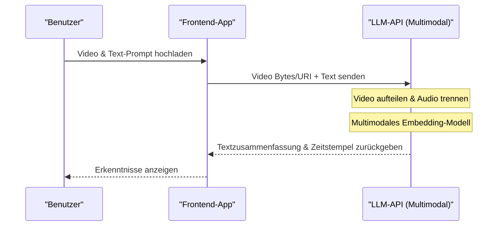

# Ein umfassender Vergleich der APIs von ChatGPT, Gemini und Claude: Welche sollten Sie wählen?

Die Entwicklung der KI-Technologie ist bemerkenswert, insbesondere im Bereich der großen Sprachmodelle (LLM: Large Language Model). Hier liefern sich OpenAIs ChatGPT (GPT-Serie), Googles Gemini und Anthropics Claude einen erbitterten Dreikampf um die Vorherrschaft. Im Jahr 2026 veröffentlichen diese Unternehmen im Monats-, wenn nicht gar Wochentakt, neue Modelle und API-Funktionen. Für Entwickler und IT-Architekten von Unternehmen ist die Frage, „welche API in das Produkt integriert werden soll“, zu einer äußerst wichtigen Entscheidung geworden, die über den Erfolg eines Projekts bestimmen kann.

In diesem Artikel werden wir die APIs dieser drei großen KI-Anbieter nicht nur durch eine bloße Aufzählung von Spezifikationen vergleichen und erläutern, sondern auch aus der Perspektive von Entwicklern tiefgreifend auf Aspekte wie Architekturdesign, detaillierte Preisstrukturen, mathematische Analyse der Latenz (Verzögerung), konkrete Implementierungsbeispiele in Python und Node.js sowie die neuesten Methoden zur Kostenoptimierung wie Prompt Caching eingehen.

Wir hoffen, dass dieser Artikel ein vollständiger Leitfaden für Sie als Leser wird, um die optimale LLM-API für Ihren speziellen Anwendungsfall auszuwählen und skalierbare, kosteneffiziente KI-Anwendungen zu entwickeln.

---

## 1. Philosophie und Designkonzept der einzelnen LLM-APIs

Bei der Auswahl der Technologie ist es zunächst von entscheidender Bedeutung zu verstehen, mit welcher Philosophie die einzelnen Unternehmen ihre Modelle und APIs entwickeln.

### 1.1 OpenAI (ChatGPT)
OpenAI verfolgt die Mission, „Künstliche Allgemeine Intelligenz (AGI) zu verwirklichen“, und treibt stets den De-facto-Standard der Branche voran. Sie bieten vielfältige Modelle, die auf verschiedene Anwendungsfälle zugeschnitten sind, wie z. B. GPT-4o, GPT-4o-mini und die auf Inferenzen spezialisierten o1-Modelle. Das Ökosystem ist am ausgereiftesten und verfügt über die größte Fülle an offiziellen und inoffiziellen Bibliotheken und Dokumentationen.

### 1.2 Google (Gemini)
Google vertritt den „AI First“-Ansatz und nutzt die Skalierbarkeit seiner eigenen Infrastruktur (TPU-Netzwerk) als seine stärkste Waffe. Gemini 1.5 Pro/Flash zeichnet sich vor allem durch sein überwältigendes Kontextfenster (Kontextlänge) von bis zu 2 Millionen Token aus, mit dem es lange Dokumente und mehrstündige Videos oder Audios in einem Durchgang verarbeiten kann. Die starke Integration mit der Google Cloud (Vertex AI) ist auch für Unternehmen äußerst attraktiv.

### 1.3 Anthropic (Claude)
Anthropic ist ein von ehemaligen OpenAI-Mitgliedern gegründetes Unternehmen, das einen einzigartigen Sicherheitsansatz namens „Constitutional AI (Verfassungsgemäße KI)“ anwendet. Claude 3.5 Sonnet und Opus erfreuen sich aufgrund ihrer hohen Schlussfolgerungsfähigkeit, ihrer Fähigkeiten zur Codegenerierung und vor allem wegen ihrer „menschenähnlichen, natürlichen Konversation“ und dem „Mangel an Halluzinationen“ bei vielen Entwicklern begeisterter Unterstützung.

---

## 2. Ein detaillierter Spezifikationsvergleich der Modellfamilien

Wir vergleichen die Spezifikationen der wichtigsten Modelle im Jahr 2026.

| Anbieter | Hauptmodell | Maximale Kontextlänge | Hauptstärken | Empfohlene Anwendungsfälle |
|---|---|---|---|---|
| **OpenAI** | GPT-4o | 128K | Geschwindigkeit, visuelle Erkennung, Sprachunterstützung | Interaktive Apps, allgemeine Aufgaben |
| **OpenAI** | o1-preview | 128K | Fortgeschrittenes logisches Denken, Mathematik, Programmieren | Erstellung komplexer Algorithmen, Forschungszwecke |
| **Google** | Gemini 1.5 Pro | 2.000K | Verarbeitung sehr langer Texte, Multimodal (Video/Audio) | Analyse riesiger Codebasen, Videozusammenfassung |
| **Google** | Gemini 1.5 Flash | 2.000K | Geringe Latenz, hoher Durchsatz, extrem niedrige Kosten | Echtzeitverarbeitung, Stapelverarbeitung riesiger Datenmengen |
| **Anthropic** | Claude 3.5 Sonnet | 200K | Programmierfähigkeiten, natürliche Textgenerierung | Unterstützung bei der Softwareentwicklung, fortschrittlicher Kundensupport |
| **Anthropic** | Claude 3.5 Haiku | 200K | Ultraschnelle Reaktion, Kosteneffizienz | Edge AI, Echtzeit-Chatbots |

---

## 3. Ein tieferer Blick in die Architektur: Hinter den Kulissen von API-Anfragen

Welche Prozesse laufen im Backend ab, wenn ein API-Aufruf für ein LLM getätigt wird? Um die Leistung zu optimieren, muss man diese Architektur verstehen.

Das folgende Mermaid-Diagramm zeigt das Gesamtbild vom Senden einer API-Anfrage durch den Client bis zur Rückgabe der Token im Streaming-Verfahren.

```mermaid
graph TD
    A["Client-Anwendung"] -->|HTTP/REST oder gRPC| B["API-Gateway"]
    B --> C["Load Balancer"]
    C --> D["Inferenz-Cluster"]
    D --> E["Tokenizer (BPE / SentencePiece)"]
    E --> F["KV Cache & Attention-Mechanismus"]
    F --> G["Transformer-Blöcke (Forward Pass)"]
    G --> H["Output-Layer (Logits)"]
    H --> I["Sampler (Temperature, Top-p, Top-k)"]
    I --> J["Detokenizer"]
    J -->|Streaming-Antwort (Chunk)| A
```

### 3.1 Tokenisierungs-Algorithmen (Tokenization)
Der in die API eingegebene Text wird intern in Einheiten namens „Token“ unterteilt.
- **OpenAI (tiktoken)**: Verwendet Byte-Pair Encoding (BPE). Es komprimiert besonders im Englischen äußerst effizient, aber bei nicht-alphabetischen Sprachen wie Japanisch neigt die Anzahl der Token dazu, stark anzusteigen.
- **Google (Gemini)**: Verwendet SentencePiece (Unigram Language Model). Es ist stark in Mehrsprachigkeit und neigt dazu, selbst japanische Texte mit einer relativ geringen Anzahl von Token darstellen zu können.
- **Anthropic (Claude)**: Verwendet eine angepasste Version von BPE. Die Mehrsprachigkeit wurde verbessert, und ab Claude 3 hat sich die Token-Effizienz für Japanisch ebenfalls drastisch verbessert.

---

## 4. Mathematische Analyse von Latenz und Leistung

In Echtzeitanwendungen wirkt sich die Latenz direkt auf das Benutzererlebnis (UX) aus. Die Latenz einer LLM-API, $T_{total}$, lässt sich mathematisch wie folgt modellieren:

$$ T_{total} = T_{network} + T_{TTFT} + (N \times T_{TPOT}) $$

Hier haben die einzelnen Variablen die folgenden Bedeutungen:
- $T_{network}$: Die Round-Trip-Time (RTT) des Netzwerks.
- $T_{TTFT}$ (Time To First Token): Die Zeit, bis das erste Zeichen generiert wird. Sie hängt stark von den Berechnungskosten der Attention ab, die proportional zum Quadrat der Prompt-Länge (Anzahl der Eingabe-Token) steigen.
- $N$: Die Gesamtzahl der ausgegebenen Token.
- $T_{TPOT}$ (Time Per Output Token): Die Generierungszeit pro Token. Da es sich um ein autoregressives Modell handelt, wird es seriell in Abhängigkeit von der vorherigen Ausgabe berechnet.

### 4.1 Berechnungskomplexität des Self-Attention-Mechanismus
Die Berechnungskomplexität der Self-Attention in der Transformer-Architektur steigt quadratisch mit der Eingabesequenzlänge $L$.

$$ \text{Complexity} = O(L^2 \cdot d) $$

Hierbei ist $d$ die Dimensionalität des Einbettungsvektors (Embedding Vector). Aufgrund dieser Einschränkung verschlechtert sich $T_{TTFT}$ normalerweise drastisch, wenn der Prompt länger wird.
Googles Gemini 1.5 hat jedoch innovative Optimierungsarchitekturen wie „Ring Attention“ und „Block-wise Compute“ eingeführt, wodurch es gelingt, das erste Token in einer realistischen Zeit (wenige Sekunden bis Dutzende von Sekunden) zu generieren, selbst wenn ein langer Text von 2 Millionen Token eingegeben wird.

---

## 5. Preisstrukturen und Strategien zur Kostenoptimierung

Die API-Kosten werden grundsätzlich basierend auf der Anzahl der Eingabe- und Ausgabe-Token berechnet.

$$ Cost = (Tokens_{in} \times Rate_{in}) + (Tokens_{out} \times Rate_{out}) $$

Allerdings haben die neuesten APIs neue Mechanismen eingeführt, um die Kosten drastisch zu senken.

### 5.1 Prompt-Caching (Prompt Caching)
Es verursacht enorme Kosten, wenn man jedes Mal extrem lange System-Prompts oder riesige Mengen an Dokumenten, die über RAG (Retrieval-Augmented Generation) abgerufen wurden, sendet. Um dem entgegenzuwirken, bieten die Anbieter eine Caching-Funktion an.

Bei Anthropic (Claude) und Google (Gemini) können durch das Caching bestimmter Textblöcke die Eingabekosten erheblich (um bis zu 90 %) gesenkt werden.

Das Kostenmodell bei Verwendung von Cache sieht wie folgt aus:

$$ Cost_{cached} = (Tokens_{cache\_write} \times Rate_{cache\_write}) + (Tokens_{cache\_read} \times Rate_{cache\_read}) + (Tokens_{out} \times Rate_{out}) $$

Hierbei ist $Rate_{cache\_read}$ auf etwa 10 % bis 25 % des normalen $Rate_{in}$ festgelegt. Dadurch wurde es möglich, einen Chatbot kostengünstig zu betreiben, während ihm eine Codebasis von Zehntausenden von Zeilen permanent als Hintergrundwissen zur Verfügung steht.

### 5.2 Batch-API (Batch API)
Für Aufgaben, bei denen keine Echtzeitfähigkeit erforderlich ist (z. B. Log-Analyse, massenhafte Datenklassifizierung), bieten OpenAI und Anthropic eine Batch-API an. Dies ist ein leistungsstarker Mechanismus, bei dem Anfragen gebündelt gesendet werden und man die Ergebnisse innerhalb von 24 Stunden erhält, dafür aber nur den halben Preis (50 % Rabatt) der normalen API-Kosten extrinsisch zahlt.

---

## 6. Entwicklererfahrung (DX) und SDK-Vergleich

Wir vergleichen die von den einzelnen Unternehmen angebotenen SDKs (Software Development Kits) unter dem Gesichtspunkt der Entwicklungseffizienz.

### 6.1 OpenAI API
Es ist am weitesten verbreitet und auch die Unterstützung durch Bibliotheken von Drittanbietern (LangChain, LlamaIndex usw.) ist am schnellsten. Darüber hinaus garantiert die Funktion „Structured Outputs“ (strukturierte Ausgaben), dass Antworten zu 100 % konform mit einem JSON-Schema zurückgegeben werden, was die Systemintegration extrem vereinfacht.

### 6.2 Anthropic API (Claude)
Die SDK-Schnittstelle ist sehr ausgereift und Typdefinitionen in TypeScript sind beispielsweise äußerst benutzerfreundlich. Insbesondere die Struktur der Message-API ist intuitiv, und auch multimodale Anfragen, die mehrere Bilder enthalten, lassen sich einfach implementieren.

### 6.3 Google Gemini API
Es gibt zwei Zugangswege: über Google Cloud Vertex AI und über AI Studio (Google Gen AI SDK), was Anfänger möglicherweise etwas verwirren kann. Das Vertex AI SDK für Unternehmen ist jedoch vollständig in das IAM (Identitäts- und Zugriffsmanagement) der GCP integriert und ermöglicht den Aufbau einer sicheren Entwicklungsumgebung.

---

## 7. Praxis! Implementierung eines Integrationstests mehrerer APIs mit Python

Hier werden wir mit Python ein Skript implementieren, das gleichzeitig asynchrone Anfragen an die drei APIs von OpenAI, Anthropic und Gemini sendet und deren Latenz vergleicht.

```python
import asyncio
import time
import os
from openai import AsyncOpenAI
from anthropic import AsyncAnthropic
import google.generativeai as genai

# Initialisierung der Clients
openai_client = AsyncOpenAI(api_key=os.environ.get("OPENAI_API_KEY"))
anthropic_client = AsyncAnthropic(api_key=os.environ.get("ANTHROPIC_API_KEY"))
genai.configure(api_key=os.environ.get("GEMINI_API_KEY"))

prompt = "Bitte erklären Sie für Anfänger verständlich die Grundlagen von Quantencomputern und deren Auswirkungen auf aktuelle Kryptographietechnologien."

async def fetch_openai():
    start_time = time.time()
    response = await openai_client.chat.completions.create(
        model="gpt-4o",
        messages=[{"role": "user", "content": prompt}],
        max_tokens=1024
    )
    elapsed = time.time() - start_time
    return "OpenAI (GPT-4o)", elapsed, response.choices[0].message.content

async def fetch_anthropic():
    start_time = time.time()
    response = await anthropic_client.messages.create(
        model="claude-3-5-sonnet-20240620",
        messages=[{"role": "user", "content": prompt}],
        max_tokens=1024
    )
    elapsed = time.time() - start_time
    return "Anthropic (Claude 3.5 Sonnet)", elapsed, response.content[0].text

async def fetch_gemini():
    start_time = time.time()
    model = genai.GenerativeModel('gemini-1.5-pro')
    # Nutzung der asynchronen Methode des Gemini Python SDKs
    response = await model.generate_content_async(prompt)
    elapsed = time.time() - start_time
    return "Google (Gemini 1.5 Pro)", elapsed, response.text

async def main():
    print("Sende Anfragen an die jeweiligen LLM-APIs...")
    
    # Ausführung der drei APIs parallel
    results = await asyncio.gather(
        fetch_openai(),
        fetch_anthropic(),
        fetch_gemini()
    )
    
    for provider, latency, text in results:
        print(f"--- {provider} ---")
        print(f"Latency: {latency:.2f} seconds")
        print(f"Response (Excerpt): {text[:100]}...\n")

if __name__ == "__main__":
    asyncio.run(main())
```

Durch Ausführen dieses Skripts können Sie in einer realen Netzwerkumgebung leicht messen, welches Modell am schnellsten (bei Minimierung von $T_{total}$) antwortet.

---

## 8. Implementierung von Tool Calling (Function Calling) mit Node.js

Um ein LLM nicht nur als simplen Chatbot, sondern als „KI-Agenten“ fungieren zu lassen, der mit externen Systemen interagiert, ist Tool Calling (oder Function Calling) unerlässlich. Das folgende Beispiel zeigt, wie man mit Node.js (TypeScript) die OpenAI-API dazu bringt, eine Wetter-API aufzurufen.

```typescript
import OpenAI from "openai";

const openai = new OpenAI({
  apiKey: process.env.OPENAI_API_KEY,
});

async function runAgent() {
  const tools = [
    {
      type: "function",
      function: {
        name: "get_weather",
        description: "Ruft das aktuelle Wetter für die angegebene Stadt ab.",
        parameters: {
          type: "object",
          properties: {
            location: {
              type: "string",
              description: "Name der Stadt (z. B. Tokio, New York)",
            },
          },
          required: ["location"],
        },
      },
    },
  ];

  const response = await openai.chat.completions.create({
    model: "gpt-4o",
    messages: [{ role: "user", "content": "Wie ist das Wetter heute in Tokio? Brauche ich einen Regenschirm?" }],
    tools: tools,
    tool_choice: "auto",
  });

  const message = response.choices[0].message;

  if (message.tool_calls) {
    const toolCall = message.tool_calls[0];
    console.log(`Das LLM hat einen Tool-Aufruf angefordert: Funktionsname = ${toolCall.function.name}`);
    
    const args = JSON.parse(toolCall.function.arguments);
    console.log(`Argumente: ${args.location}`);
    
    // Hier wird der Prozess zum Aufrufen der eigentlichen Wetter-API (z. B. OpenWeatherMap) implementiert
    // const weather = await fetchWeatherFromAPI(args.location);
    
    // Das abgerufene Ergebnis wird wieder an das LLM übergeben, um die endgültige Antwort generieren zu lassen
  }
}

runAgent().catch(console.error);
```

Claude 3.5 Sonnet und Gemini 1.5 Pro verfügen ebenfalls über gleichwertige Tool-Calling-Funktionen, und obwohl es leichte Unterschiede in der Art und Weise gibt, wie Schemata definiert werden, ist der grundlegende Ablauf derselbe.

---

## 9. RAG vs. Long Context Window: Welches sollte verwendet werden?

Eine der größten Debatten in der Enterprise-KI-Architektur ist derzeit die Frage, „ob man RAG (Retrieval-Augmented Generation) nutzen sollte, um externes Wissen einzubeziehen, oder ob man alles einem riesigen Kontextfenster (Long Context) überlassen sollte.“

### Vorteile und Herausforderungen von RAG (Retrieval-Augmented Generation)
- **Vorteile**: Die Kosten sind niedrig (da nur die benötigten Chunks in den Prompt eingefügt werden) und die Quelle der Antwort lässt sich leicht identifizieren.
- **Herausforderungen**: Da es auf der Genauigkeit der semantischen Suche beruht, eignet es sich nicht für komplexe Schlussfolgerungsaufgaben, bei denen der Kontext über mehrere Dokumente verstreut ist (z. B. „Analysieren Sie chronologisch die Grundursache für die Verzögerung von Projekt A anhand aller Besprechungsprotokolle des letzten Jahres“).

### Long Context (z. B. 2 Millionen Token von Gemini 1.5 Pro)
- **Vorteile**: Kein Informationsverlust durch die Suche. Selbst im „Needle In A Haystack (NIAH)“-Test (Die Nadel im Heuhaufen suchen) können Modelle wie Gemini 1.5 Pro oder Claude 3.5 Sonnet Informationen mit einer Genauigkeit von über 99 % extrahieren.
- **Herausforderungen**: Der Token-Verbrauch ist enorm, was die Kosten in die Höhe treibt, und die Latenz ($T_{TTFT}$) nimmt zu.

**Fazit**: Die Best Practice für das Jahr 2026 ist ein **„Hybrid-Ansatz“**. Für alltägliche Q&As wird RAG mit einer Vektordatenbank eingesetzt. Für spezialisierte Aufgaben, die komplexe Analysen oder Code-Reviews des gesamten Systems erfordern, wird hingegen Long Context in Kombination mit Prompt-Caching verwendet. Dieses Design ist heute der Mainstream.

---

## 10. Vergleich der multimodalen Verarbeitungsfähigkeiten

KI-Anwendungen der nächsten Generation erfordern die Fähigkeit, nicht nur Text, sondern auch Bilder, Audiodaten und Videos direkt zu verstehen.



- **OpenAI (GPT-4o)**: Bietet eine extrem hohe Bilderkennungsgenauigkeit und eignet sich hervorragend zum Lesen von handgezeichneten Skizzen oder komplexen Graphen. Die native Sprachinteraktion mit extrem geringer Latenz (einige hundert Millisekunden) über die Realtime-API ist ebenfalls sehr leistungsstark.
- **Google (Gemini 1.5 Pro)**: **Ist bei der Videoanalyse unübertroffen.** Man kann eine einstündige Videodatei (Frames + Audio) direkt eingeben und punktgenaue Fragen stellen wie: „Wie lautet der Titel des Dokuments, das die Person am rechten Bildschirmrand bei Minute 12:45 in der Hand hält?“.
- **Anthropic (Claude 3.5 Sonnet)**: Die Fähigkeiten zur Bilderkennung (Vision) sind auf dem gleichen Niveau wie bei GPT-4o und äußerst beeindruckend. Es zeigt eine beispiellose Stärke bei der Unterstützung der Frontend-Entwicklung, etwa wenn man einen Screenshot einer Benutzeroberfläche übergibt und anfordert: „Generiere den React-Komponentencode für diesen Bildschirm“.

---

## 11. Sicherheit und Compliance auf Unternehmensniveau

Wenn Unternehmen LLM-APIs in Produktionsumgebungen einsetzen, sind die größten Bedenken: „Werden unsere Daten zum Trainieren der KI verwendet?“ und „Werden Compliance-Anforderungen erfüllt?“.

Alle drei Unternehmen haben klar erklärt, dass die über die API gesendeten Daten (Prompts und Antworten) **nicht zum Trainieren der Modelle verwendet werden (Zero Data Retention / No Training on Customer Data)** (*Dies gilt nicht für die kostenlosen Web-Chat-UIs für Verbraucher).

Wenn ein noch höheres Sicherheitsniveau erforderlich ist:
- **OpenAI**: Durch die Nutzung des Azure OpenAI Service stehen die Enterprise-Grade-Sicherheit von Microsoft, SLAs und geschlossene Netzwerkverbindungen über Azure Private Link zur Verfügung.
- **Google**: Durch die Nutzung von Google Cloud Vertex AI sind eine strikte Netzwerktrennung mithilfe von VPC Service Controls und der Datenschutz durch CMEK (Customer-Managed Encryption Keys) möglich.
- **Anthropic**: Durch die Nutzung über AWS Bedrock oder Google Cloud Vertex AI kann man von der robusten Sicherheitsinfrastruktur der Cloud-Anbieter profitieren.

---

## 12. Fazit: Der ultimative Leitfaden zur Auswahl nach Anwendungsfall

Wir haben bisher einen vielseitigen Vergleich angestellt, aber die endgültige Antwort auf die Frage „Welche API sollte man wählen?“ hängt letztendlich vom Anwendungsfall ab.

1. **Komplexe Softwareentwicklung / Codegenerierung / Fortgeschrittenes logisches Denken**:
   **👑 Gewinner: Claude 3.5 Sonnet (Anthropic)**
   Es bietet derzeit die beste Leistung beim Verstehen von Code-Kontexten, beim Refactoring und bei der Erstellung von natürlichem, menschenähnlichem Text. Auch die Benutzerfreundlichkeit der API und die Kosteneffizienz durch Prompt-Caching sind hervorragend.

2. **Analyse von extrem langen Dokumenten / Stapelverarbeitung von Video und Audio**:
   **👑 Gewinner: Gemini 1.5 Pro (Google)**
   Das Kontextfenster von 2 Millionen Token ist eine einzigartige Waffe. Bei Aufgaben, die ein Verständnis des Gesamtbildes der Daten erfordern, wie z. B. die Analyse von Hunderten Seiten langen PDF-Handbüchern oder die Zusammenfassung von stundenlangen Besprechungsaufzeichnungen, ist Gemini unübertroffen.

3. **Vielseitigkeit / Ausführungsgeschwindigkeit / Stabile strukturierte Ausgaben (JSON)**:
   **👑 Gewinner: GPT-4o / GPT-4o-mini (OpenAI)**
   Es erledigt alle Aufgaben einwandfrei und bietet die umfangreichste Unterstützung für Tools von Drittanbietern. Das OpenAI-Ökosystem ist unverzichtbar, wenn man ein zuverlässiges JSON-Parsing mithilfe von Structured Outputs benötigt oder extrem fortgeschrittenes logisches Denken mit dem o1-Modell erfordert.

### Empfehlung für Multimodell-Routing
Anstatt sich auf eine einzige API zu verlassen (Vendor-Lock-in), ist die zukünftige Richtung eine Architektur des **„LLM-Routings“**, bei der Modelle je nach Schwierigkeitsgrad und Wichtigkeit der Aufgabe dynamisch umgeschaltet werden.
Beispielsweise kann man auf einfache Fragen von Benutzern mit dem kostengünstigen und schnellen `GPT-4o-mini` oder `Gemini 1.5 Flash` antworten. Nur wenn festgestellt wird, dass eine komplexe Verarbeitung erforderlich ist, greift man als Fallback für die Aufgabe auf `Claude 3.5 Sonnet` zurück. So lässt sich das optimale Gleichgewicht zwischen Kosten und Leistung erreichen.

Die Entwicklung der KI ist unaufhaltsam. Verstehen Sie die Stärken und Schwächen der einzelnen APIs sowie die Besonderheiten ihrer Architektur genau, um flexible und flexibel skalierbare KI-Anwendungen zu entwickeln.
