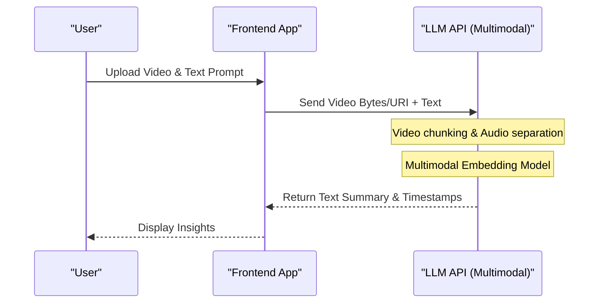

# ChatGPT, Gemini, and Claude APIs Thoroughly Compared! Which Should You Choose?

AI technology is evolving remarkably, especially in the field of Large Language Models (LLM), where OpenAI's ChatGPT (GPT series), Google's Gemini, and Anthropic's Claude are engaged in a fierce three-way battle for supremacy. As of 2026, each company is releasing new models and API features on a scale of months, or even weeks. For developers and corporate IT architects, the question of "which API to integrate into products" has become a highly critical decision that dictates the success of a project.

In this article, we will thoroughly compare and explain these top 3 AI providers' APIs from a developer's perspective. We go beyond just listing specifications, and delve into architecture design, detailed pricing structures, mathematical analysis of latency, concrete implementation examples using Python and Node.js, and the latest cost-optimization techniques such as prompt caching.

Our goal is for this to serve as a complete guide for readers to select the most optimal LLM API for their own use cases and build scalable, cost-effective AI applications.

---

## 1. Philosophy and Design Concepts of Each LLM API

When choosing technology, it is very important to first understand the philosophies each company uses to build their models and APIs.

### 1.1 OpenAI (ChatGPT)
OpenAI has set its mission to "achieve Artificial General Intelligence (AGI)" and constantly drives the de facto standard of the industry. They offer a diverse range of models tailored to use cases, such as GPT-4o, GPT-4o-mini, and the inference-specialized o1 model. Their ecosystem is the most mature, and they have the most abundant libraries and documentation, both official and unofficial.

### 1.2 Google (Gemini)
Google advocates "AI First" and uses the scalability of its own infrastructure (TPU networks) to its maximum advantage. Gemini 1.5 Pro/Flash's greatest feature is its overwhelming context window of up to 2 million tokens, allowing it to process lengthy documents or hours of video/audio all at once. Its strong integration with Google Cloud (Vertex AI) is also attractive for enterprises.

### 1.3 Anthropic (Claude)
Anthropic is a company founded by former OpenAI members, adopting a unique safety approach called "Constitutional AI". Claude 3.5 Sonnet and Opus have garnered enthusiastic support from many developers for their high reasoning capabilities, code generation skills, and above all, their "human-like natural dialogue" and "low hallucinations".

---

## 2. Thorough Comparison of Model Family Specifications

We compare the specifications of the flagship models as of 2026.

| Provider | Flagship Model | Max Context Length | Key Strengths | Recommended Use Cases |
|---|---|---|---|---|
| **OpenAI** | GPT-4o | 128K | Speed, vision, audio support | Interactive apps, general tasks |
| **OpenAI** | o1-preview | 128K | Advanced logical reasoning, math, coding | Complex algorithm generation, research |
| **Google** | Gemini 1.5 Pro | 2,000K | Ultra-long text processing, multimodal (video/audio) | Analyzing massive codebases, video summarization |
| **Google** | Gemini 1.5 Flash | 2,000K | Low latency, high throughput, overwhelmingly low cost | Real-time processing, batch processing of large data |
| **Anthropic** | Claude 3.5 Sonnet | 200K | Coding capabilities, natural text generation | Software development assistance, advanced customer support |
| **Anthropic** | Claude 3.5 Haiku | 200K | Ultra-fast response, cost performance | Edge AI, real-time chatbots |

---

## 3. Deep Dive into Architecture: Behind the API Requests

When an LLM API is called, what kind of processing takes place on the backend? To optimize performance, we need to understand this architecture.

The following Mermaid diagram shows the overall picture from when an API request is sent by the client to when tokens are returned in a stream.

```mermaid
graph TD
    A["Client Application"] -->|HTTP/REST or gRPC| B["API Gateway"]
    B --> C["Load Balancer"]
    C --> D["Inference Cluster"]
    D --> E["Tokenizer (BPE / SentencePiece)"]
    E --> F["KV Cache & Attention Mechanism"]
    F --> G["Transformer Blocks (Forward Pass)"]
    G --> H["Output Layer (Logits)"]
    H --> I["Sampler (Temperature, Top-p, Top-k)"]
    I --> J["Detokenizer"]
    J -->|Streaming Response (Chunk)| A
```

### 3.1 Tokenization Algorithms
The text input into the API is internally divided into units called "tokens".
- **OpenAI (tiktoken)**: Uses Byte-Pair Encoding (BPE). It compresses English extremely efficiently, but for non-alphabet languages like Japanese, the number of tokens tends to inflate.
- **Google (Gemini)**: Uses SentencePiece (Unigram Language Model). It handles multiple languages well, and tends to express even Japanese text with relatively few tokens.
- **Anthropic (Claude)**: Uses a customized version of BPE. Multilingual support has been strengthened, and since Claude 3, token efficiency for Japanese has also significantly improved.

---

## 4. Mathematical Analysis of Latency and Performance

In real-time applications, latency is directly tied to the User Experience (UX). The latency of an LLM API, $T_{total}$, can be mathematically modeled as follows:

$$ T_{total} = T_{network} + T_{TTFT} + (N \times T_{TPOT}) $$

Here, each variable has the following meaning:
- $T_{network}$: Network Round Trip Time (RTT).
- $T_{TTFT}$ (Time To First Token): The time until the first character is generated. It depends heavily on the cost of attention calculation, which is proportional to the square of the prompt length (number of input tokens).
- $N$: The total number of tokens output.
- $T_{TPOT}$ (Time Per Output Token): Generation time per token. Because it is an autoregressive model, it is calculated serially depending on the previous output.

### 4.1 Computational Complexity of the Self-Attention Mechanism
The computational complexity of Self-Attention in the Transformer architecture increases quadratically with respect to the input sequence length $L$.

$$ \text{Complexity} = O(L^2 \cdot d) $$

Here, $d$ is the dimensionality of the embedding vector. Because of this constraint, $T_{TTFT}$ usually worsens dramatically as the prompt gets longer.
However, Google's Gemini 1.5 employs innovative optimization architectures like "Ring Attention" and "Block-wise Compute," successfully generating the first token in a realistic amount of time (a few seconds to tens of seconds) even when a long text of 2 million tokens is input.

---

## 5. Pricing Systems and Cost Optimization Strategies

API costs are fundamentally calculated based on the number of input and output tokens.

$$ Cost = (Tokens_{in} \times Rate_{in}) + (Tokens_{out} \times Rate_{out}) $$

However, the latest APIs have introduced new mechanisms to drastically reduce costs.

### 5.1 Prompt Caching
Sending a massive system prompt or a large amount of documents retrieved by RAG every time incurs an enormous cost. To address this, each company provides caching features.

In Anthropic (Claude) and Google (Gemini), caching specific text blocks can significantly reduce input costs (up to 90%).

The cost model when using a cache is as follows:

$$ Cost_{cached} = (Tokens_{cache\_write} \times Rate_{cache\_write}) + (Tokens_{cache\_read} \times Rate_{cache\_read}) + (Tokens_{out} \times Rate_{out}) $$

Here, $Rate_{cache\_read}$ is set to about 10% to 25% of the regular $Rate_{in}$. This makes it possible to run a chatbot cheaply while constantly keeping tens of thousands of lines of a codebase as background knowledge.

### 5.2 Batch API
For tasks that do not require real-time processing (log analysis, bulk data classification, etc.), OpenAI and Anthropic offer a Batch API. This is a powerful mechanism where you can send requests in bulk and receive results within 24 hours at half the regular API price (50% off).

---

## 6. Developer Experience (DX) and SDK Comparison

We compare the SDKs (Software Development Kits) provided by each company from the perspective of development efficiency.

### 6.1 OpenAI API
The most widely used, with the fastest support for third-party libraries (LangChain, LlamaIndex, etc.). Furthermore, the Structured Outputs feature guarantees a response that complies with a JSON schema with 100% accuracy, making system integration extremely easy.

### 6.2 Anthropic API (Claude)
The SDK interface is refined, and its TypeScript type definitions are highly regarded for being very easy to handle. The structure of the Message API is particularly intuitive, allowing simple coding for multimodal requests containing multiple images.

### 6.3 Google Gemini API
There are two access methods: via Google Cloud Vertex AI and via AI Studio (Google Gen AI SDK), which might slightly confuse beginners. However, the Vertex AI SDK for enterprises is fully integrated with GCP's IAM (Identity and Access Management) system, enabling the construction of secure development environments.

---

## 7. Practical! Integrated Testing Implementation of Multiple APIs with Python

Here, we will use Python to implement a script that sends asynchronous requests simultaneously to three APIs—OpenAI, Anthropic, and Gemini—and compares their latency.

```python
import asyncio
import time
import os
from openai import AsyncOpenAI
from anthropic import AsyncAnthropic
import google.generativeai as genai

# Initialize clients
openai_client = AsyncOpenAI(api_key=os.environ.get("OPENAI_API_KEY"))
anthropic_client = AsyncAnthropic(api_key=os.environ.get("ANTHROPIC_API_KEY"))
genai.configure(api_key=os.environ.get("GEMINI_API_KEY"))

prompt = "Please explain the basics of quantum computing and its impact on current cryptographic technologies in an easy-to-understand way for beginners."

async def fetch_openai():
    start_time = time.time()
    response = await openai_client.chat.completions.create(
        model="gpt-4o",
        messages=[{"role": "user", "content": prompt}],
        max_tokens=1024
    )
    elapsed = time.time() - start_time
    return "OpenAI (GPT-4o)", elapsed, response.choices[0].message.content

async def fetch_anthropic():
    start_time = time.time()
    response = await anthropic_client.messages.create(
        model="claude-3-5-sonnet-20240620",
        messages=[{"role": "user", "content": prompt}],
        max_tokens=1024
    )
    elapsed = time.time() - start_time
    return "Anthropic (Claude 3.5 Sonnet)", elapsed, response.content[0].text

async def fetch_gemini():
    start_time = time.time()
    model = genai.GenerativeModel('gemini-1.5-pro')
    # Using the asynchronous method of the Gemini Python SDK
    response = await model.generate_content_async(prompt)
    elapsed = time.time() - start_time
    return "Google (Gemini 1.5 Pro)", elapsed, response.text

async def main():
    print("Sending requests to each LLM API...")
    
    # Execute 3 APIs in parallel
    results = await asyncio.gather(
        fetch_openai(),
        fetch_anthropic(),
        fetch_gemini()
    )
    
    for provider, latency, text in results:
        print(f"--- {provider} ---")
        print(f"Latency: {latency:.2f} seconds")
        print(f"Response (Excerpt): {text[:100]}...\n")

if __name__ == "__main__":
    asyncio.run(main())
```

By running this script, you can easily measure which model responds the fastest (minimizing $T_{total}$) in a real network environment.

---

## 8. Implementing Tool Calling (Function Calling) with Node.js

To make an LLM function not just as a chatbot but as an "AI Agent" that cooperates with external systems, Tool Calling (or Function Calling) is indispensable. Below is an example using Node.js (TypeScript) to have the OpenAI API call a weather API.

```typescript
import OpenAI from "openai";

const openai = new OpenAI({
  apiKey: process.env.OPENAI_API_KEY,
});

async function runAgent() {
  const tools = [
    {
      type: "function",
      function: {
        name: "get_weather",
        description: "Gets the current weather for the specified city.",
        parameters: {
          type: "object",
          properties: {
            location: {
              type: "string",
              description: "City name (e.g., Tokyo, New York)",
            },
          },
          required: ["location"],
        },
      },
    },
  ];

  const response = await openai.chat.completions.create({
    model: "gpt-4o",
    messages: [{ role: "user", "content": "How's the weather in Tokyo today? Will I need an umbrella?" }],
    tools: tools,
    tool_choice: "auto",
  });

  const message = response.choices[0].message;

  if (message.tool_calls) {
    const toolCall = message.tool_calls[0];
    console.log(`LLM requested a tool call: Function name = ${toolCall.function.name}`);
    
    const args = JSON.parse(toolCall.function.arguments);
    console.log(`Arguments: ${args.location}`);
    
    // Implement the logic to call the actual weather API (e.g., OpenWeatherMap) here
    // const weather = await fetchWeatherFromAPI(args.location);
    
    // Pass the retrieved results back to the LLM to generate the final answer
  }
}

runAgent().catch(console.error);
```

Claude 3.5 Sonnet and Gemini 1.5 Pro also have equivalent Tool Calling capabilities, and although there are slight differences in how schemas are defined, the basic flow is common across them.

---

## 9. RAG vs Long Context Window: Which Should You Adopt?

Currently, one of the biggest debates in enterprise AI architecture is "whether to use RAG (Retrieval-Augmented Generation) to incorporate external knowledge, or to throw it all into a massive context window (Long Context)."

### Benefits and Challenges of RAG (Retrieval-Augmented Generation)
- **Benefits**: Low cost (because only necessary chunks are put into the prompt), and it's easy to identify the grounds (sources) for the answer.
- **Challenges**: Because it relies on the accuracy of semantic search, it is not suitable for advanced reasoning tasks where the context is scattered across multiple documents (e.g., "Analyze the root causes of the delay in Project A chronologically from all meeting minutes from last year").

### Long Context (e.g., Gemini 1.5 Pro's 2 Million Tokens)
- **Benefits**: No missed information from searches. Even in "Needle In A Haystack (NIAH)" tests, Gemini 1.5 Pro and Claude 3.5 Sonnet can extract information with over 99% accuracy.
- **Challenges**: Enormous token consumption leads to high costs, and latency ($T_{TTFT}$) increases.

**Conclusion**: The best practice for 2026 is a **"Hybrid Approach"**. The mainstream design is to use RAG with a vector database for routine Q&A, and use Long Context leveraging prompt caching for specialized tasks requiring complex analysis or full codebase reviews.

---

## 10. Comparison of Multimodal Processing Capabilities

Next-generation AI applications require the ability to directly understand not only text but also images, audio, and video.



- **OpenAI (GPT-4o)**: Has extremely high image recognition accuracy and excels at reading handwritten drawings and complex graphs. Its native audio interaction with ultra-low latency (hundreds of milliseconds) using the Realtime API is also powerful.
- **Google (Gemini 1.5 Pro)**: **Overwhelmingly superior in video analysis.** You can input a 1-hour video file (frames + audio) as is, and it can answer pinpoint questions like, "What is the title of the document held by the person who appeared on the right edge of the screen at 12 minutes and 45 seconds?"
- **Anthropic (Claude 3.5 Sonnet)**: Its image recognition (Vision) capability is on par with GPT-4o and very excellent. It demonstrates unrivaled strength in frontend development assistance, such as passing a UI screenshot and saying, "Generate the React component code for this screen."

---

## 11. Enterprise-Level Security and Compliance

When enterprises use LLM APIs in production environments, their biggest concerns are "Will our company's data be used for training the AI?" and "Are compliance requirements met?"

All three companies clearly state that data sent via API (prompts and responses) **will not be used for model training (Zero Data Retention / No Training on Customer Data)** (*This does not apply to free consumer web chat UIs).

When an even higher level of security is required:
- **OpenAI**: By using the Azure OpenAI Service, you can utilize Microsoft's enterprise-grade security, SLAs, and closed-network connections via Azure Private Link.
- **Google**: By using Google Cloud Vertex AI, strict network isolation using VPC Service Controls and data protection with CMEK (Customer-Managed Encryption Keys) are possible.
- **Anthropic**: By using it via AWS Bedrock or Google Cloud Vertex AI, you can piggyback on the robust security infrastructure of cloud providers.

---

## 12. Conclusion: Ultimate Choice Guide by Use Case

Although we have compared them from various angles, the final conclusion to "Which one should you choose?" depends on the use case.

1. **Complex Software Development, Code Generation, Advanced Reasoning**:
   **👑 Winner: Claude 3.5 Sonnet (Anthropic)**
   It currently delivers the best performance in understanding code context, refactoring, and writing natural, human-like text. The ease of use of the API and the cost efficiency due to prompt caching are also outstanding.

2. **Parsing Ultra-Long Documents, Batch Processing of Video/Audio**:
   **👑 Winner: Gemini 1.5 Pro (Google)**
   Its 2-million-token context window is a unique weapon. For tasks requiring a grasp of the entire data, such as parsing hundreds of pages of PDF manuals or summarizing long meeting recordings, Gemini is second to none.

3. **Versatility, Execution Speed, Stable Structured Output (JSON)**:
   **👑 Winner: GPT-4o / GPT-4o-mini (OpenAI)**
   It handles any task flawlessly and has the most abundant third-party tool support. If you need reliable JSON parsing using Structured Outputs or ultra-advanced logical reasoning using the o1 model, the OpenAI ecosystem is indispensable.

### Recommendation for Multi-Model Routing
The future trend is an **"LLM Routing"** architecture that dynamically switches models according to the difficulty and importance of the task, rather than depending on a single API (vendor lock-in).
For example, you can respond to simple questions from users with the cheap and fast `GPT-4o-mini` or `Gemini 1.5 Flash`, and fallback the task to `Claude 3.5 Sonnet` only when complex processing is deemed necessary, thereby achieving the optimal balance of cost and performance.

The evolution of AI will not stop. Please deeply understand the strengths, weaknesses, and architectural characteristics of each API to build flexible and scalable AI applications.
