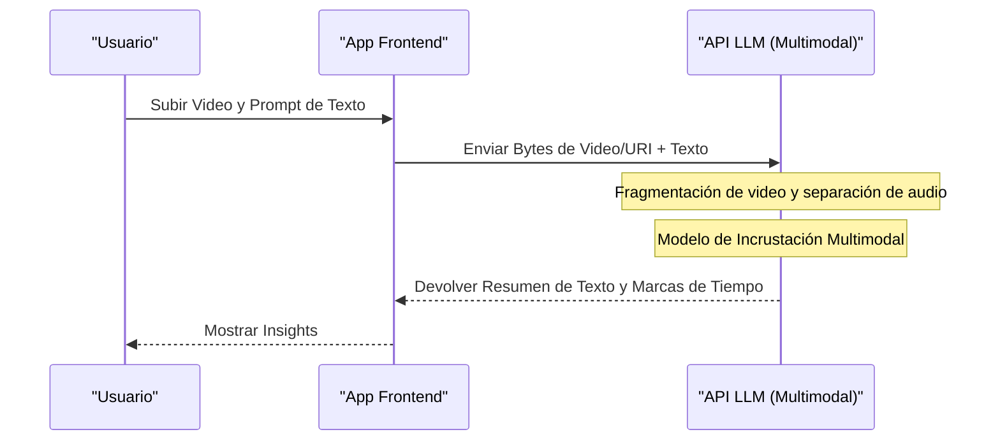

# ¡Comparación exhaustiva de las API de ChatGPT, Gemini y Claude! ¿Cuál deberías elegir?

La evolución de la tecnología de IA ha sido asombrosa y, especialmente en el campo de los modelos de lenguaje grande (LLM: Large Language Model), ChatGPT de OpenAI (serie GPT), Gemini de Google y Claude de Anthropic están en una intensa batalla a tres bandas por la supremacía. A partir de 2026, cada compañía está lanzando nuevos modelos y funciones de API en cuestión de meses, o incluso semanas. Para los desarrolladores y arquitectos de TI de las empresas, la pregunta de "¿qué API integrar en nuestro producto?" se ha convertido en una decisión extremadamente importante que determina el éxito de un proyecto.

En este artículo, compararemos y explicaremos en detalle las API de estos tres grandes proveedores de IA desde la perspectiva del desarrollador. Iremos más allá de una simple enumeración de especificaciones y cubriremos desde el diseño de la arquitectura, la estructura detallada de precios y el análisis matemático de la latencia (retraso), hasta ejemplos de implementación específicos en Python y Node.js, así como las últimas técnicas de optimización de costos como el caché de prompts.

Esperamos que esta guía sea completa para ayudar a los lectores a seleccionar la API de LLM más adecuada para sus casos de uso y construir aplicaciones de IA escalables y rentables.

---

## 1. Filosofía y diseño de la arquitectura de la API de cada LLM

Al hacer una selección tecnológica, es fundamental entender primero qué tipo de filosofía impulsa la construcción de los modelos y las API de cada empresa.

### 1.1 OpenAI (ChatGPT)
Con la misión de lograr la "Inteligencia Artificial General (AGI)", OpenAI lidera constantemente los estándares de facto de la industria. Ofrece una variedad de modelos adaptados a diferentes casos de uso, como GPT-4o, GPT-4o-mini y el modelo especializado en inferencia o1. Su ecosistema es el más maduro, contando con la mayor cantidad de bibliotecas y documentación, tanto oficiales como no oficiales.

### 1.2 Google (Gemini)
Bajo la premisa de "AI First" (IA primero), Google aprovecha al máximo la escalabilidad de su propia infraestructura (redes de TPU). La mayor característica de Gemini 1.5 Pro/Flash es su abrumadora ventana de contexto (longitud de contexto) de hasta 2 millones de tokens, lo que le permite procesar simultáneamente documentos muy largos o varias horas de video y audio. La sólida integración con Google Cloud (Vertex AI) también resulta muy atractiva para las empresas.

### 1.3 Anthropic (Claude)
Anthropic es una empresa fundada por ex miembros de OpenAI y adopta un enfoque único de seguridad llamado "IA Constitucional" (Constitutional AI). Los modelos Claude 3.5 Sonnet y Opus han ganado un apoyo entusiasta de muchos desarrolladores por sus altas capacidades de razonamiento, generación de código y, sobre todo, por sus "diálogos naturales y humanos" y su "bajo nivel de alucinaciones".

---

## 2. Comparación exhaustiva de las especificaciones de las familias de modelos

Comparamos las especificaciones de los principales modelos a partir de 2026.

| Proveedor | Modelo Principal | Longitud de Contexto Máxima | Principales Fortalezas | Casos de Uso Recomendados |
|---|---|---|---|---|
| **OpenAI** | GPT-4o | 128K | Velocidad, reconocimiento visual, soporte de voz | Aplicaciones interactivas, tareas de propósito general |
| **OpenAI** | o1-preview | 128K | Razonamiento lógico avanzado, matemáticas, programación | Generación de algoritmos complejos, usos en investigación |
| **Google** | Gemini 1.5 Pro | 2,000K | Procesamiento de textos ultralargos, multimodal (video/audio) | Análisis de enormes bases de código, resumen de video |
| **Google** | Gemini 1.5 Flash | 2,000K | Baja latencia, alto rendimiento (throughput), costo extremadamente bajo | Procesamiento en tiempo real, procesamiento por lotes de grandes datos |
| **Anthropic** | Claude 3.5 Sonnet | 200K | Capacidad de codificación, generación natural de texto | Soporte en desarrollo de software, atención al cliente avanzada |
| **Anthropic** | Claude 3.5 Haiku | 200K | Respuesta ultrarrápida, relación costo-rendimiento | IA de borde (Edge AI), chatbots en tiempo real |

---

## 3. Profundización en la arquitectura: Detrás de las peticiones de la API

Cuando se hace una llamada a la API de un LLM, ¿qué tipo de procesamiento se lleva a cabo en el backend? Para optimizar el rendimiento, es necesario comprender esta arquitectura.

El siguiente diagrama de Mermaid muestra el panorama general desde el momento en que la aplicación cliente envía una solicitud a la API hasta que los tokens se devuelven en streaming.

```mermaid
graph TD
    A["Aplicación Cliente"] -->|HTTP/REST or gRPC| B["Puerta de Enlace API"]
    B --> C["Balanceador de Carga"]
    C --> D["Clúster de Inferencia"]
    D --> E["Tokenizador (BPE / SentencePiece)"]
    E --> F["Caché KV y Mecanismo de Atención"]
    F --> G["Bloques Transformer (Forward Pass)"]
    G --> H["Capa de Salida (Logits)"]
    H --> I["Muestreador (Temperature, Top-p, Top-k)"]
    I --> J["Destokenizador"]
    J -->|Respuesta en Streaming (Chunk)| A
```

### 3.1 Algoritmo de Tokenización
El texto ingresado en la API se divide internamente en unidades llamadas "tokens".
- **OpenAI (tiktoken)**: Utiliza Byte-Pair Encoding (BPE). Se comprime de manera extremadamente eficiente, especialmente en inglés, pero en lenguajes no alfabéticos, como el japonés, el número de tokens tiende a inflarse.
- **Google (Gemini)**: Utiliza SentencePiece (Modelo de Lenguaje Unigrama). Es fuerte en multilingüismo y tiende a poder expresar textos, incluso en japonés, con un número relativamente menor de tokens.
- **Anthropic (Claude)**: Utiliza una versión personalizada de BPE. El soporte multilingüe se ha fortalecido y, a partir de Claude 3, la eficiencia de tokens en lenguajes como el japonés ha mejorado significativamente.

---

## 4. Análisis matemático del rendimiento y la latencia

En las aplicaciones en tiempo real, la latencia está directamente relacionada con la experiencia del usuario (UX). La latencia de la API de un LLM $T_{total}$ se puede modelar matemáticamente de la siguiente manera:

$$ T_{total} = T_{network} + T_{TTFT} + (N \times T_{TPOT}) $$

Aquí, cada variable tiene el siguiente significado:
- $T_{network}$: Tiempo de ida y vuelta de la red (RTT).
- $T_{TTFT}$ (Time To First Token): El tiempo que tarda en generarse el primer carácter. Depende en gran medida del costo de cálculo de la atención, que es proporcional al cuadrado de la longitud del prompt (número de tokens de entrada).
- $N$: Número total de tokens de salida.
- $T_{TPOT}$ (Time Per Output Token): Tiempo de generación por token. Al ser un modelo autorregresivo, se calcula secuencialmente, dependiendo de las salidas anteriores.

### 4.1 Complejidad computacional del mecanismo de autoatención
El costo computacional de la autoatención (Self-Attention) en la arquitectura Transformer aumenta de forma cuadrática en relación con la longitud de la secuencia de entrada $L$.

$$ \text{Complexity} = O(L^2 \cdot d) $$

Donde $d$ es el número de dimensiones del vector de incrustación (embedding). Debido a esta restricción, normalmente, a medida que el prompt se hace más largo, $T_{TTFT}$ empeora drásticamente.
Sin embargo, Gemini 1.5 de Google emplea arquitecturas de optimización innovadoras como "Ring Attention" y "Block-wise Compute", y logra generar el primer token en un tiempo razonable (de unos pocos segundos a unas decenas de segundos), incluso cuando se ingresa un texto largo de 2 millones de tokens.

---

## 5. Estructura de precios y estrategias de optimización de costos

El costo de la API se calcula fundamentalmente en base al número de tokens de entrada y tokens de salida.

$$ Cost = (Tokens_{in} \times Rate_{in}) + (Tokens_{out} \times Rate_{out}) $$

No obstante, en las API más recientes, se han introducido nuevos mecanismos para reducir drásticamente los costos.

### 5.1 Caché de Prompts (Prompt Caching)
Enviar un sistema de prompts (system prompts) extenso o grandes cantidades de documentos recuperados mediante RAG cada vez resulta en costos masivos. Para hacer frente a esto, cada empresa ofrece una función de caché.

En Anthropic (Claude) y Google (Gemini), al almacenar en caché bloques de texto específicos, se puede reducir significativamente el costo de entrada (hasta en un 90%).

El modelo de costo cuando se utiliza el caché sería el siguiente:

$$ Cost_{cached} = (Tokens_{cache\_write} \times Rate_{cache\_write}) + (Tokens_{cache\_read} \times Rate_{cache\_read}) + (Tokens_{out} \times Rate_{out}) $$

Aquí, el $Rate_{cache\_read}$ se establece en alrededor del 10% al 25% del $Rate_{in}$ normal. Gracias a esto, es posible operar chatbots de bajo costo manteniendo como conocimiento de fondo bases de código de decenas de miles de líneas.

### 5.2 API por Lotes (Batch API)
Para tareas que no requieren tiempo real (análisis de registros, clasificación de datos masivos, etc.), OpenAI y Anthropic ofrecen API por lotes. Es un mecanismo poderoso en el que, en lugar de recibir respuestas inmediatamente, se envían solicitudes agrupadas y se obtienen resultados dentro de las 24 horas, con un descuento del 50% de la tarifa normal de la API.

---

## 6. Experiencia del desarrollador (DX) y comparación de SDKs

Comparamos los SDKs (Kits de Desarrollo de Software) proporcionados por cada empresa desde la perspectiva de la eficiencia del desarrollo.

### 6.1 API de OpenAI
Es el más utilizado en general y la compatibilidad con bibliotecas de terceros (LangChain, LlamaIndex, etc.) es la más rápida. Además, gracias a la función Structured Outputs (Salidas Estructuradas), se garantiza la devolución de respuestas que cumplen al 100% con un esquema JSON, lo que facilita enormemente la integración de sistemas.

### 6.2 API de Anthropic (Claude)
La interfaz de su SDK es muy refinada y su definición de tipos en TypeScript tiene fama de ser muy fácil de manejar. En particular, la estructura de la Message API es intuitiva, permitiendo redactar de forma sencilla solicitudes multimodales que incluyan múltiples imágenes.

### 6.3 API de Google Gemini
Existen dos vías de acceso: mediante Google Cloud Vertex AI y mediante AI Studio (Google Gen AI SDK), lo cual puede ser un poco confuso para los principiantes. Sin embargo, el SDK de Vertex AI, dirigido a empresas, se integra completamente con IAM (sistema de autenticación y autorización) de GCP, permitiendo construir un entorno de desarrollo seguro.

---

## 7. ¡Práctica! Implementación de prueba de integración de múltiples API con Python

Aquí, implementaremos un script en Python que envíe peticiones asíncronas simultáneamente a las tres APIs de OpenAI, Anthropic y Gemini para comparar su latencia.

```python
import asyncio
import time
import os
from openai import AsyncOpenAI
from anthropic import AsyncAnthropic
import google.generativeai as genai

# Inicialización de los clientes
openai_client = AsyncOpenAI(api_key=os.environ.get("OPENAI_API_KEY"))
anthropic_client = AsyncAnthropic(api_key=os.environ.get("ANTHROPIC_API_KEY"))
genai.configure(api_key=os.environ.get("GEMINI_API_KEY"))

prompt = "Por favor, explica los fundamentos de la computación cuántica y su impacto en la criptografía actual, de manera fácil de entender para un principiante."

async def fetch_openai():
    start_time = time.time()
    response = await openai_client.chat.completions.create(
        model="gpt-4o",
        messages=[{"role": "user", "content": prompt}],
        max_tokens=1024
    )
    elapsed = time.time() - start_time
    return "OpenAI (GPT-4o)", elapsed, response.choices[0].message.content

async def fetch_anthropic():
    start_time = time.time()
    response = await anthropic_client.messages.create(
        model="claude-3-5-sonnet-20240620",
        messages=[{"role": "user", "content": prompt}],
        max_tokens=1024
    )
    elapsed = time.time() - start_time
    return "Anthropic (Claude 3.5 Sonnet)", elapsed, response.content[0].text

async def fetch_gemini():
    start_time = time.time()
    model = genai.GenerativeModel('gemini-1.5-pro')
    # Uso del método asíncrono del SDK en Python de Gemini
    response = await model.generate_content_async(prompt)
    elapsed = time.time() - start_time
    return "Google (Gemini 1.5 Pro)", elapsed, response.text

async def main():
    print("Enviando peticiones a cada API de LLM...")
    
    # Ejecutar las 3 APIs en paralelo
    results = await asyncio.gather(
        fetch_openai(),
        fetch_anthropic(),
        fetch_gemini()
    )
    
    for provider, latency, text in results:
        print(f"--- {provider} ---")
        print(f"Latencia: {latency:.2f} segundos")
        print(f"Respuesta (Extracto): {text[:100]}...\n")

if __name__ == "__main__":
    asyncio.run(main())
```

Al ejecutar este script, se puede medir fácilmente qué modelo responde más rápido (minimizando $T_{total}$) en un entorno de red real.

---

## 8. Implementación de Tool Calling (Llamada a Funciones) con Node.js

Para hacer que un LLM funcione como un "agente de IA" que colabora con sistemas externos, y no solo como un chatbot, el Tool Calling (o Function Calling) es indispensable. A continuación, se muestra un ejemplo en el que se usa Node.js (TypeScript) para permitir que la API de OpenAI llame a una API del clima.

```typescript
import OpenAI from "openai";

const openai = new OpenAI({
  apiKey: process.env.OPENAI_API_KEY,
});

async function runAgent() {
  const tools = [
    {
      type: "function",
      function: {
        name: "get_weather",
        description: "Obtiene el clima actual de la ciudad especificada.",
        parameters: {
          type: "object",
          properties: {
            location: {
              type: "string",
              description: "Nombre de la ciudad (ej: Tokio, Nueva York)",
            },
          },
          required: ["location"],
        },
      },
    },
  ];

  const response = await openai.chat.completions.create({
    model: "gpt-4o",
    messages: [{ role: "user", "content": "¿Cómo está el clima hoy en Tokio? ¿Necesito un paraguas?" }],
    tools: tools,
    tool_choice: "auto",
  });

  const message = response.choices[0].message;

  if (message.tool_calls) {
    const toolCall = message.tool_calls[0];
    console.log(`El LLM solicitó la llamada a una herramienta: Nombre de la función = ${toolCall.function.name}`);
    
    const args = JSON.parse(toolCall.function.arguments);
    console.log(`Argumentos: ${args.location}`);
    
    // Aquí es donde se implementaría el código para llamar a la API meteorológica real (ej: OpenWeatherMap)
    // const weather = await fetchWeatherFromAPI(args.location);
    
    // Luego se pasa el resultado obtenido de nuevo al LLM para generar la respuesta final
  }
}

runAgent().catch(console.error);
```

Claude 3.5 Sonnet y Gemini 1.5 Pro también tienen capacidades de Tool Calling equivalentes, y aunque hay diferencias menores en cómo se definen los esquemas, el flujo básico es común en todos.

---

## 9. RAG vs Ventana de Contexto Larga: ¿Cuál se debe adoptar?

Actualmente, uno de los mayores debates en la arquitectura de IA empresarial es el problema de si "deberíamos usar RAG (Generación Aumentada por Recuperación) para incorporar conocimientos externos, o si deberíamos enviarle todo a una enorme ventana de contexto (Long Context)".

### Ventajas y Desafíos del RAG (Retrieval-Augmented Generation)
- **Ventajas**: Es de bajo costo (ya que solo se ingresan en el prompt los fragmentos de datos necesarios) y es más fácil identificar el origen (fuente) de la respuesta.
- **Desafíos**: Como depende de la precisión de la búsqueda semántica, no es adecuado para tareas de razonamiento avanzado en las que el contexto esté disperso en varios documentos (por ejemplo, "Analiza cronológicamente la causa raíz del retraso del Proyecto A a partir de todas las actas de reuniones del año pasado").

### Contexto Largo (ej. los 2 millones de tokens de Gemini 1.5 Pro)
- **Ventajas**: No hay pérdida de información debido a la búsqueda. Incluso en la prueba de "Buscar una aguja en un pajar" (Needle In A Haystack: NIAH), Gemini 1.5 Pro y Claude 3.5 Sonnet pueden extraer información con una precisión de más del 99%.
- **Desafíos**: El consumo de tokens es masivo, lo que aumenta los costos, y la latencia ($T_{TTFT}$) también aumenta.

**Conclusión**: La mejor práctica en 2026 es un **"Enfoque Híbrido"**. El diseño predominante utiliza RAG con bases de datos vectoriales para preguntas y respuestas rutinarias, y aprovecha el contexto largo (Long Context) usando el caché de prompts para tareas especializadas que requieran análisis complejos o revisiones exhaustivas de código completo.

---

## 10. Comparación de capacidades de procesamiento multimodal

En las aplicaciones de IA de próxima generación, se necesita la capacidad de comprender directamente imágenes, audio y video, además del texto.



- **OpenAI (GPT-4o)**: Su precisión en el reconocimiento de imágenes es extremadamente alta y se destaca en la lectura de planos dibujados a mano o gráficos complejos. Además, las interacciones de voz nativas de latencia ultrabaja (cientos de milisegundos) que usan su Realtime API son muy poderosas.
- **Google (Gemini 1.5 Pro)**: **Supera ampliamente a los demás en el análisis de video.** Es posible ingresar directamente un archivo de video de 1 hora (fotogramas + audio) y responder preguntas muy específicas como: "¿Cuál es el título del documento que sostiene la persona que aparece en el extremo derecho de la pantalla en el minuto 12:45?".
- **Anthropic (Claude 3.5 Sonnet)**: Su capacidad de reconocimiento de imágenes (Visión) está al mismo nivel que GPT-4o y es excelente. Destaca excepcionalmente en el apoyo al desarrollo frontend, por ejemplo, entregándole una captura de pantalla de la interfaz de usuario con la instrucción "Genera el código del componente React de esta pantalla".

---

## 11. Seguridad y cumplimiento de nivel empresarial

Al utilizar API de LLM en un entorno de producción, la mayor preocupación para las empresas es si "los datos de nuestra compañía se utilizarán para entrenar a la IA" y "si cumplen con los requisitos de cumplimiento corporativo".

Las tres empresas han declarado claramente que **los datos (prompts y respuestas) enviados a través de su API no se utilizarán para entrenar sus modelos (Zero Data Retention / No Training on Customer Data)** (※ esto excluye a la UI del chat web gratuito dirigido a consumidores).

Para casos donde se requieran niveles de seguridad aún más altos:
- **OpenAI**: A través del servicio de Azure OpenAI, se puede aprovechar la seguridad de nivel empresarial y los SLA de Microsoft, y realizar conexiones de red cerradas mediante Azure Private Link.
- **Google**: Al usar Google Cloud Vertex AI, es posible realizar un aislamiento de red estricto utilizando VPC Service Controls, y proteger los datos mediante CMEK (Claves de Cifrado Gestionadas por el Cliente).
- **Anthropic**: Al utilizarse a través de AWS Bedrock o Google Cloud Vertex AI, se puede aprovechar la robusta infraestructura de seguridad subyacente de estos proveedores de la nube.

---

## 12. Conclusión: Guía de elección definitiva según el caso de uso

Hemos comparado estas opciones desde varios ángulos, pero, en última instancia, la conclusión a "¿cuál debería elegir?" variará según el caso de uso.

1. **Desarrollo de software complejo, generación de código, razonamiento avanzado**:
   **👑 Ganador: Claude 3.5 Sonnet (Anthropic)**
   Actualmente ofrece el mejor rendimiento en la comprensión del contexto del código, refactorización y creación de textos naturales y similares a los humanos. Su API es muy fácil de usar y su rentabilidad mediante el caché de prompts es excelente.

2. **Análisis de documentos ultralargos, procesamiento en lote de video/audio**:
   **👑 Ganador: Gemini 1.5 Pro (Google)**
   Su ventana de contexto de 2 millones de tokens es un arma inigualable. Para tareas en las que sea necesario tener una visión completa de los datos, como analizar un manual en PDF de cientos de páginas o resumir la grabación de una reunión prolongada, nada se le iguala.

3. **Versatilidad, velocidad de ejecución, salida estructurada estable (JSON)**:
   **👑 Ganador: GPT-4o / GPT-4o-mini (OpenAI)**
   Maneja cualquier tarea sin problemas y ofrece el mayor soporte para herramientas de terceros. El ecosistema de OpenAI es indispensable si requiere de un análisis JSON confiable usando Structured Outputs o de un razonamiento lógico ultra avanzado a través de los modelos o1.

### Recomendación de enrutamiento multimodelo (Multi-model Routing)
En lugar de depender de una única API (fijación con un proveedor / vendor lock-in), la tendencia a futuro es usar una arquitectura de **"Enrutamiento LLM" (LLM Routing)** que cambie dinámicamente el modelo según la dificultad e importancia de la tarea.
Por ejemplo, se puede lograr el equilibrio óptimo entre costo y rendimiento usando los modelos económicos y rápidos `GPT-4o-mini` o `Gemini 1.5 Flash` para respuestas simples de usuarios, y delegando en `Claude 3.5 Sonnet` como respaldo solo cuando se determine que es necesario un procesamiento complejo.

La evolución de la IA no se detiene. Comprenda profundamente las fortalezas, debilidades y las características de la arquitectura de cada API para construir aplicaciones de IA flexibles y escalables.
