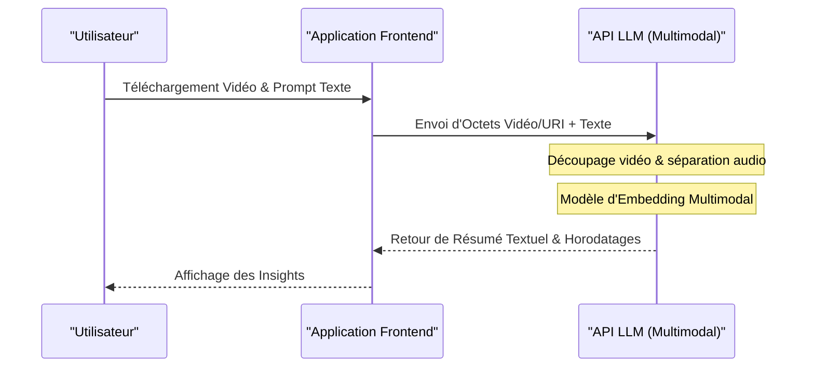

# Comparaison complète des API ChatGPT, Gemini et Claude ! Laquelle choisir ?

L'évolution de la technologie de l'IA est remarquable, en particulier dans le domaine des grands modèles de langage (LLM : Large Language Model), où ChatGPT (série GPT) d'OpenAI, Gemini de Google et Claude d'Anthropic se livrent une lutte acharnée pour la suprématie à trois. En 2026, chaque entreprise publie de nouveaux modèles et fonctionnalités d'API en l'espace de quelques mois, voire de quelques semaines, et pour les développeurs ou les architectes informatiques des entreprises, la question de savoir "quelle API intégrer dans un produit" est devenue une décision cruciale qui peut déterminer le succès ou l'échec d'un projet.

Dans cet article, nous comparerons et expliquerons en détail les API de ces 3 principaux fournisseurs d'IA du point de vue des développeurs, sans nous limiter à une simple liste de spécifications, mais en allant jusqu'à la conception de l'architecture, la structure tarifaire détaillée, l'analyse mathématique de la latence, des exemples d'implémentation concrets avec Python et Node.js, et les dernières méthodes d'optimisation des coûts telles que le cache de prompts.

Nous visons à ce que cela devienne un guide complet pour que nos lecteurs puissent sélectionner l'API LLM la plus adaptée à leur propre cas d'utilisation, et construire des applications d'IA évolutives et rentables.

---

## 1. Philosophie et concepts de conception de chaque API LLM

Lors du choix technologique, il est d'abord très important de comprendre avec quelle philosophie chaque entreprise construit ses modèles et API.

### 1.1 OpenAI (ChatGPT)
OpenAI s'est donné pour mission la "réalisation de l'intelligence artificielle générale (IAG)" et continue de tirer vers le haut les standards de facto de l'industrie. Ils fournissent une variété de modèles adaptés à chaque cas d'utilisation, tels que GPT-4o, GPT-4o-mini, et le modèle o1 spécialisé dans le raisonnement. Leur écosystème est le plus mature, et ils possèdent l'abondance de bibliothèques et de documentation la plus importante, qu'elle soit officielle ou non.

### 1.2 Google (Gemini)
Google met en avant la politique "AI First" et fait de sa scalabilité, qui exploite au maximum sa propre infrastructure (réseau TPU), son arme principale. Gemini 1.5 Pro/Flash possède une fenêtre de contexte impressionnante allant jusqu'à 2 millions de jetons (tokens), ce qui lui permet de traiter d'énormes documents, ainsi que des heures de vidéo et d'audio en une seule fois, ce qui constitue sa principale caractéristique. L'intégration forte avec Google Cloud (Vertex AI) est également très attrayante pour les entreprises.

### 1.3 Anthropic (Claude)
Anthropic est une entreprise fondée par d'anciens membres d'OpenAI, adoptant une approche unique de sécurité appelée "Constitutional AI" (IA Constitutionnelle). Claude 3.5 Sonnet et Opus recueillent un soutien enthousiaste de la part de nombreux développeurs grâce à leur grande capacité de raisonnement, leur compétence en génération de code, et surtout leurs "conversations naturelles, semblables à celles des humains" et leur "faible taux d'hallucinations".

---

## 2. Comparaison détaillée des spécifications des familles de modèles

Nous comparons les spécifications des modèles phares actuels en 2026.

| Fournisseur | Modèle phare | Longueur max du contexte | Principaux atouts | Cas d'utilisation recommandés |
|---|---|---|---|---|
| **OpenAI** | GPT-4o | 128K | Vitesse, reconnaissance visuelle, prise en charge audio | Applications interactives, tâches d'ordre général |
| **OpenAI** | o1-preview | 128K | Raisonnement logique avancé, mathématiques, codage | Génération d'algorithmes complexes, recherche |
| **Google** | Gemini 1.5 Pro | 2,000K | Traitement de textes très longs, multimodal (vidéo, audio) | Analyse de bases de code gigantesques, résumé de vidéos |
| **Google** | Gemini 1.5 Flash | 2,000K | Faible latence, haut débit, coût extrêmement bas | Traitement en temps réel, traitement par lots de données massives |
| **Anthropic** | Claude 3.5 Sonnet | 200K | Capacité de codage, génération de textes naturels | Assistance au développement logiciel, support client avancé |
| **Anthropic** | Claude 3.5 Haiku | 200K | Réponse ultra-rapide, rapport coût-performance | IA Edge (en périphérie), chatbots en temps réel |

---

## 3. Plongée dans l'architecture : les coulisses des requêtes API

Lorsque l'on appelle une API LLM, quel type de traitement a lieu en arrière-plan ? Pour optimiser les performances, il est nécessaire de comprendre cette architecture.

Le diagramme Mermaid ci-dessous montre la vue d'ensemble, depuis l'envoi de la requête API par le client jusqu'au retour des jetons (tokens) en streaming.

```mermaid
graph TD
    A["Application Client"] -->|HTTP/REST or gRPC| B["Passerelle API"]
    B --> C["Équilibreur de charge"]
    C --> D["Cluster d'inférence"]
    D --> E["Tokeniseur (BPE / SentencePiece)"]
    E --> F["Cache KV & Mécanisme d'attention"]
    F --> G["Blocs Transformer (Passe avant)"]
    G --> H["Couche de sortie (Logits)"]
    H --> I["Échantillonneur (Temperature, Top-p, Top-k)"]
    I --> J["Détokeniseur"]
    J -->|Réponse en streaming (Morceau)| A
```

### 3.1 Algorithmes de Tokenisation
Le texte saisi dans l'API est divisé en interne en unités appelées "jetons" (tokens).
- **OpenAI (tiktoken)** : Adopte l'encodage Byte-Pair Encoding (BPE). Il offre une compression extrêmement efficace, en particulier en anglais, mais a tendance à gonfler le nombre de jetons pour les langues non alphabétiques comme le japonais.
- **Google (Gemini)** : Adopte SentencePiece (Unigram Language Model). Il est performant en multilingue et tend à pouvoir représenter des textes, même en japonais, avec un nombre de jetons relativement faible.
- **Anthropic (Claude)** : Utilise une version personnalisée de BPE. Le support multilingue a été renforcé, et depuis Claude 3, l'efficacité des jetons pour le japonais a également été considérablement améliorée.

---

## 4. Analyse mathématique de la latence et des performances

Dans les applications en temps réel, la latence affecte directement l'expérience utilisateur (UX). La latence d'une API LLM, $T_{total}$, peut être modélisée mathématiquement de la manière suivante.

$$ T_{total} = T_{network} + T_{TTFT} + (N \times T_{TPOT}) $$

Ici, chaque variable a la signification suivante :
- $T_{network}$ : Temps d'aller-retour du réseau (RTT).
- $T_{TTFT}$ (Time To First Token) : Temps nécessaire pour générer le premier jeton. Dépend fortement du coût de calcul de l'attention, qui est proportionnel au carré de la longueur du prompt (nombre de jetons d'entrée).
- $N$ : Nombre total de jetons de sortie.
- $T_{TPOT}$ (Time Per Output Token) : Temps de génération par jeton. Étant un modèle autorégressif, il est calculé en série en fonction des sorties précédentes.

### 4.1 Complexité du mécanisme d'auto-attention
La complexité de calcul de l'auto-attention (Self-Attention) dans l'architecture Transformer augmente de manière quadratique par rapport à la longueur de la séquence d'entrée $L$.

$$ \text{Complexity} = O(L^2 \cdot d) $$

Ici, $d$ est la dimension du vecteur de plongement (embedding). En raison de cette contrainte, $T_{TTFT}$ se dégrade généralement très rapidement lorsque le prompt s'allonge.
Cependant, Gemini 1.5 de Google adopte des architectures d'optimisation innovantes telles que "Ring Attention" et "Block-wise Compute", réussissant à générer le premier jeton en un temps raisonnable (de quelques secondes à quelques dizaines de secondes) même avec une entrée massive de 2 millions de jetons.

---

## 5. Structure tarifaire et stratégies d'optimisation des coûts

Le coût de l'API est essentiellement calculé en fonction du nombre de jetons d'entrée et de sortie.

$$ Cost = (Tokens_{in} \times Rate_{in}) + (Tokens_{out} \times Rate_{out}) $$

Toutefois, de nouveaux mécanismes ont été introduits dans les API récentes pour réduire considérablement les coûts.

### 5.1 Cache de prompts (Prompt Caching)
L'envoi de très longs prompts système ou d'une grande quantité de documents récupérés par RAG à chaque fois entraîne des coûts énormes. Pour y remédier, chaque entreprise propose une fonction de mise en cache.

Avec Anthropic (Claude) et Google (Gemini), il est possible de réduire considérablement les coûts d'entrée (jusqu'à 90 %) en mettant en cache des blocs de texte spécifiques.

Le modèle de coût lors de l'utilisation du cache est le suivant :

$$ Cost_{cached} = (Tokens_{cache\_write} \times Rate_{cache\_write}) + (Tokens_{cache\_read} \times Rate_{cache\_read}) + (Tokens_{out} \times Rate_{out}) $$

Ici, $Rate_{cache\_read}$ est fixé à environ 10 % à 25 % du $Rate_{in}$ habituel. Cela permet d'exploiter un chatbot à moindre coût tout en maintenant en permanence une base de code de plusieurs dizaines de milliers de lignes en tant que connaissances contextuelles.

### 5.2 API par lots (Batch API)
Pour les tâches ne nécessitant pas de temps réel (analyse de journaux, classification de grandes quantités de données, etc.), OpenAI et Anthropic fournissent une API par lots (Batch API). C'est un mécanisme puissant qui permet d'envoyer des requêtes en groupe et de recevoir les résultats dans les 24 heures, à la moitié du prix normal de l'API (50 % de réduction).

---

## 6. Comparaison de l'expérience développeur (DX) et des SDK

Du point de vue de l'efficacité du développement, nous comparons les SDK (Software Development Kit) fournis par chaque entreprise.

### 6.1 API OpenAI
C'est la plus largement utilisée et la prise en charge par les bibliothèques tierces (LangChain, LlamaIndex, etc.) est la plus rapide. De plus, la fonctionnalité de sorties structurées (Structured Outputs) garantit le retour de réponses respectant à 100 % le schéma JSON, ce qui facilite grandement l'intégration des systèmes.

### 6.2 API Anthropic (Claude)
L'interface de son SDK est raffinée et réputée très facile à utiliser, notamment au niveau des définitions de types TypeScript. La structure de l'API Message est particulièrement intuitive, permettant d'écrire simplement des requêtes multimodales incluant plusieurs images.

### 6.3 API Google Gemini
Il existe deux types d'accès : via Google Cloud Vertex AI et via AI Studio (Google Gen AI SDK), ce qui peut sembler un peu confus pour les débutants. Cependant, le SDK Vertex AI destiné aux entreprises est entièrement intégré au système de gestion des identités et des accès (IAM) de GCP, permettant de mettre en place un environnement de développement sécurisé.

---

## 7. Pratique ! Implémentation d'un test d'intégration de plusieurs API avec Python

Ici, nous allons utiliser Python pour implémenter un script qui envoie des requêtes asynchrones simultanées aux trois API (OpenAI, Anthropic, Gemini) et compare leurs latences.

```python
import asyncio
import time
import os
from openai import AsyncOpenAI
from anthropic import AsyncAnthropic
import google.generativeai as genai

# Initialisation des clients
openai_client = AsyncOpenAI(api_key=os.environ.get("OPENAI_API_KEY"))
anthropic_client = AsyncAnthropic(api_key=os.environ.get("ANTHROPIC_API_KEY"))
genai.configure(api_key=os.environ.get("GEMINI_API_KEY"))

prompt = "Veuillez expliquer de manière simple pour les débutants les bases de l'informatique quantique et son impact sur la cryptographie actuelle."

async def fetch_openai():
    start_time = time.time()
    response = await openai_client.chat.completions.create(
        model="gpt-4o",
        messages=[{"role": "user", "content": prompt}],
        max_tokens=1024
    )
    elapsed = time.time() - start_time
    return "OpenAI (GPT-4o)", elapsed, response.choices[0].message.content

async def fetch_anthropic():
    start_time = time.time()
    response = await anthropic_client.messages.create(
        model="claude-3-5-sonnet-20240620",
        messages=[{"role": "user", "content": prompt}],
        max_tokens=1024
    )
    elapsed = time.time() - start_time
    return "Anthropic (Claude 3.5 Sonnet)", elapsed, response.content[0].text

async def fetch_gemini():
    start_time = time.time()
    model = genai.GenerativeModel('gemini-1.5-pro')
    # Utilisation de la méthode asynchrone du SDK Python Gemini
    response = await model.generate_content_async(prompt)
    elapsed = time.time() - start_time
    return "Google (Gemini 1.5 Pro)", elapsed, response.text

async def main():
    print("Envoi de requêtes à chaque API LLM...")
    
    # Exécution des 3 API en parallèle
    results = await asyncio.gather(
        fetch_openai(),
        fetch_anthropic(),
        fetch_gemini()
    )
    
    for provider, latency, text in results:
        print(f"--- {provider} ---")
        print(f"Latency: {latency:.2f} seconds")
        print(f"Response (Excerpt): {text[:100]}...\n")

if __name__ == "__main__":
    asyncio.run(main())
```

En exécutant ce script, vous pouvez facilement mesurer quel modèle répond le plus rapidement (en minimisant $T_{total}$) dans un environnement réseau réel.

---

## 8. Implémentation du Tool Calling (Function Calling) avec Node.js

Pour qu'un LLM fonctionne non pas comme un simple chatbot, mais comme un "agent IA" qui interagit avec des systèmes externes, le Tool Calling (ou Function Calling) est indispensable. Voici un exemple en Node.js (TypeScript) où l'API OpenAI est invitée à appeler une API météo.

```typescript
import OpenAI from "openai";

const openai = new OpenAI({
  apiKey: process.env.OPENAI_API_KEY,
});

async function runAgent() {
  const tools = [
    {
      type: "function",
      function: {
        name: "get_weather",
        description: "Obtient la météo actuelle pour la ville spécifiée.",
        parameters: {
          type: "object",
          properties: {
            location: {
              type: "string",
              description: "Nom de la ville (ex: Tokyo, New York)",
            },
          },
          required: ["location"],
        },
      },
    },
  ];

  const response = await openai.chat.completions.create({
    model: "gpt-4o",
    messages: [{ role: "user", "content": "Quel temps fait-il à Tokyo aujourd'hui ? Aurai-je besoin d'un parapluie ?" }],
    tools: tools,
    tool_choice: "auto",
  });

  const message = response.choices[0].message;

  if (message.tool_calls) {
    const toolCall = message.tool_calls[0];
    console.log(`Le LLM a demandé un appel d'outil : Nom de la fonction = ${toolCall.function.name}`);
    
    const args = JSON.parse(toolCall.function.arguments);
    console.log(`Arguments : ${args.location}`);
    
    // Implémentez ici la logique pour appeler l'API météo réelle (ex: OpenWeatherMap)
    // const weather = await fetchWeatherFromAPI(args.location);
    
    // Vous pouvez passer le résultat obtenu au LLM pour générer la réponse finale
  }
}

runAgent().catch(console.error);
```

Claude 3.5 Sonnet et Gemini 1.5 Pro disposent également de fonctionnalités de Tool Calling équivalentes. Bien qu'il y ait quelques différences dans la façon dont les schémas sont définis, le flux de base est commun.

---

## 9. RAG vs Fenêtre de contexte étendue : Que faut-il adopter ?

Actuellement, l'un des plus grands débats en matière d'architecture d'IA d'entreprise est de savoir s'il faut "utiliser RAG (génération augmentée par la recherche) pour intégrer des connaissances externes, ou tout confier à une fenêtre de contexte massive (Long Context)".

### Avantages et défis de RAG (Retrieval-Augmented Generation)
- **Avantages** : Faible coût (car seuls les morceaux nécessaires sont placés dans le prompt), facilité d'identification des preuves (sources) de la réponse.
- **Défis** : Comme cela dépend de la précision de la recherche sémantique, cette méthode n'est pas adaptée aux tâches de raisonnement complexe où le contexte est dispersé dans plusieurs documents (par exemple : "Analysez chronologiquement la cause fondamentale du retard du projet A à partir des procès-verbaux de toutes les réunions de l'année dernière").

### Contexte étendu (Long Context, comme les 2 millions de jetons de Gemini 1.5 Pro)
- **Avantages** : Aucune perte d'information due à la recherche. Même dans le test de "chercher une aiguille dans une botte de foin" (Needle In A Haystack : NIAH), Gemini 1.5 Pro et Claude 3.5 Sonnet peuvent extraire des informations avec une précision de plus de 99 %.
- **Défis** : La consommation de jetons devient massive et fait grimper les coûts, et la latence ($T_{TTFT}$) augmente.

**Conclusion** : La meilleure pratique en 2026 est l'**"approche hybride"**. La conception dominante consiste à utiliser le RAG avec une base de données vectorielle pour les questions-réponses quotidiennes, et à utiliser un contexte étendu avec cache de prompts pour les tâches spécialisées nécessitant une analyse complexe ou la révision d'un code complet.

---

## 10. Comparaison des capacités de traitement multimodal

Dans les applications d'IA de nouvelle génération, il est nécessaire de comprendre directement non seulement le texte, mais aussi les images, le son et les vidéos.



- **OpenAI (GPT-4o)** : La précision de la reconnaissance d'images est extrêmement élevée et elle excelle dans la lecture de dessins manuscrits ou de graphiques complexes. En outre, la conversation vocale native à très faible latence (quelques centaines de millisecondes) à l'aide de l'API Realtime est également très puissante.
- **Google (Gemini 1.5 Pro)** : **Surpasse les autres en matière d'analyse vidéo.** Vous pouvez insérer directement un fichier vidéo d'une heure (images + audio) et il est capable de répondre à des questions précises telles que "Quel est le titre du document tenu par la personne visible sur le bord droit de l'écran à 12 minutes 45 secondes ?".
- **Anthropic (Claude 3.5 Sonnet)** : Ses capacités de reconnaissance d'images (Vision) sont au même niveau que GPT-4o et très remarquables. Il fait preuve d'une force inégalée dans l'aide au développement frontend, par exemple en lui donnant une capture d'écran de l'interface utilisateur et en demandant : "Générez le code du composant React pour cet écran".

---

## 11. Sécurité et conformité de niveau entreprise

Lorsque les entreprises utilisent des API LLM dans un environnement de production, leurs principales préoccupations sont "nos données seront-elles utilisées pour former l'IA ?" et "répondent-elles aux exigences de conformité ?".

Les trois sociétés déclarent explicitement qu'elles **n'utilisent pas les données (prompts et réponses) envoyées via l'API pour former leurs modèles (Zero Data Retention / No Training on Customer Data)** (*cela diffère pour les interfaces de discussion Web gratuites destinées aux consommateurs).

Si un niveau de sécurité encore plus élevé est requis :
- **OpenAI** : En passant par Azure OpenAI Service, vous pouvez bénéficier de la sécurité de niveau entreprise de Microsoft, de son SLA et d'une connexion réseau fermée via Azure Private Link.
- **Google** : En passant par Google Cloud Vertex AI, il est possible d'avoir une isolation réseau stricte en utilisant VPC Service Controls et une protection des données via CMEK (clés de chiffrement gérées par le client).
- **Anthropic** : En l'utilisant via AWS Bedrock ou Google Cloud Vertex AI, vous pouvez vous appuyer sur l'infrastructure de sécurité robuste de ces fournisseurs de cloud.

---

## 12. Conclusion : Le guide de sélection ultime par cas d'utilisation

Bien que nous ayons effectué une comparaison sous plusieurs angles jusqu'à présent, la conclusion finale à la question "laquelle choisir ?" dépend de votre cas d'utilisation.

1. **Développement de logiciels complexes, génération de code et raisonnement avancé** :
   **👑 Gagnant : Claude 3.5 Sonnet (Anthropic)**
   Il offre actuellement les meilleures performances dans la compréhension du contexte du code, la refactorisation et la création de textes naturels et humains. La facilité d'utilisation de l'API et l'efficacité de ses coûts grâce au cache de prompts sont également exceptionnelles.

2. **Analyse de documents ultra-longs et traitement par lots de vidéo/audio** :
   **👑 Gagnant : Gemini 1.5 Pro (Google)**
   La fenêtre de contexte de 2 millions de jetons est une arme unique. Il n'y a pas de meilleur choix que Gemini pour les tâches nécessitant une vue d'ensemble des données, telles que l'analyse d'un manuel PDF de plusieurs centaines de pages ou le résumé d'un long enregistrement de réunion.

3. **Polyvalence, vitesse d'exécution et sorties structurées stables (JSON)** :
   **👑 Gagnant : GPT-4o / GPT-4o-mini (OpenAI)**
   Il accomplit toutes sortes de tâches sans difficulté et bénéficie de la prise en charge d'outils tiers la plus abondante. L'écosystème OpenAI est indispensable lorsque vous avez besoin d'un parsing JSON infaillible utilisant les sorties structurées (Structured Outputs) ou d'un raisonnement logique très avancé avec le modèle o1.

### Recommandation pour le routage multi-modèles
Plutôt que de s'appuyer sur une seule API (vendor lock-in), la tendance future est l'architecture de **"routage LLM"** qui bascule dynamiquement d'un modèle à l'autre en fonction de la difficulté et de l'importance de la tâche.
Par exemple, vous pouvez répondre aux questions simples des utilisateurs avec des modèles peu coûteux et rapides comme `GPT-4o-mini` ou `Gemini 1.5 Flash`, et ne basculer la tâche sur `Claude 3.5 Sonnet` que si un traitement complexe est jugé nécessaire, permettant d'atteindre un équilibre optimal entre coût et performances.

L'évolution de l'IA ne s'arrête jamais. Comprenez profondément les forces et faiblesses de chaque API ainsi que les caractéristiques de leur architecture, et construisez des applications d'IA flexibles et évolutives.
