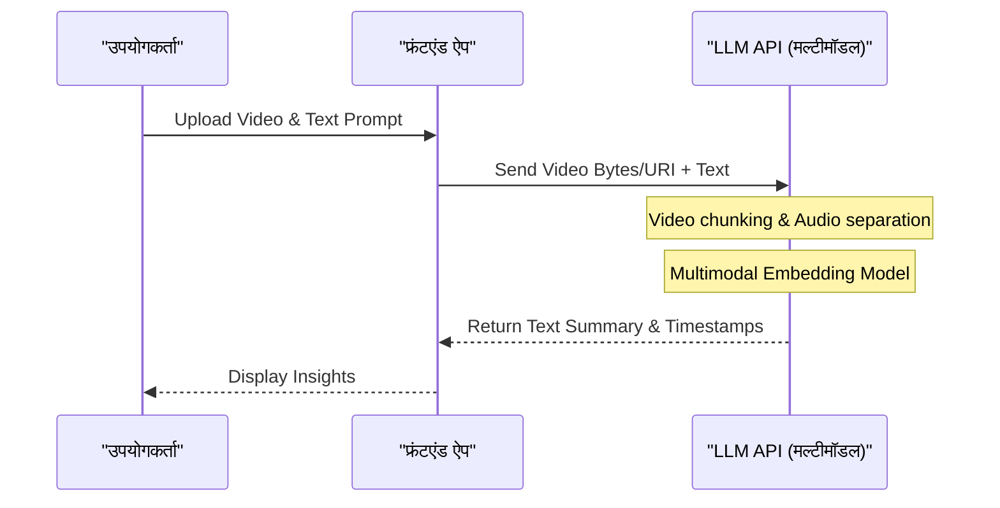

# ChatGPT・Gemini・Claude के API की विस्तृत तुलना! आपको कौन सा चुनना चाहिए?

AI तकनीक का विकास उल्लेखनीय है, और विशेष रूप से बड़े भाषा मॉडल (LLM: Large Language Model) के क्षेत्र में, OpenAI के ChatGPT (GPT श्रृंखला), Google के Gemini, और Anthropic के Claude एक-दूसरे के साथ वर्चस्व की भयंकर त्रिकोणीय लड़ाई लड़ रहे हैं। 2026 तक, ये कंपनियाँ महीनों या यहाँ तक ​​कि हफ्तों में नए मॉडल और API सुविधाएँ जारी कर रही हैं। डेवलपर्स और एंटरप्राइज़ IT आर्किटेक्ट्स के लिए, "हमें अपने उत्पाद में किस API को एकीकृत करना चाहिए?" यह प्रश्न एक अत्यंत महत्वपूर्ण निर्णय बन गया है जो किसी परियोजना की सफलता या विफलता को निर्धारित करता है।

इस लेख में, हम केवल विशिष्टताओं को सूचीबद्ध करने से आगे बढ़ेंगे और इन 3 प्रमुख AI प्रदाताओं के API की पूरी तरह से तुलना और व्याख्या करेंगे - आर्किटेक्चर डिज़ाइन, विस्तृत मूल्य निर्धारण संरचना, विलंबता (latency) का गणितीय विश्लेषण, Python और Node.js का उपयोग करके ठोस कार्यान्वयन उदाहरणों से लेकर, प्रॉम्प्ट कैशिंग (prompt caching) जैसी नवीनतम लागत अनुकूलन तकनीकों तक, वह भी एक डेवलपर के दृष्टिकोण से।

हमारा उद्देश्य है कि यह पाठकों के लिए एक संपूर्ण मार्गदर्शिका बने जिससे वे अपने उपयोग के मामलों के लिए सर्वश्रेष्ठ LLM API का चयन कर सकें और स्केलेबल तथा लागत-प्रभावी AI एप्लिकेशन का निर्माण कर सकें।

---

## 1. प्रत्येक LLM API का दर्शन और डिज़ाइन विचारधारा

तकनीक के चयन में, सबसे पहले यह समझना बहुत महत्वपूर्ण है कि प्रत्येक कंपनी किस विचारधारा के साथ अपने मॉडल और API का निर्माण कर रही है।

### 1.1 OpenAI (ChatGPT)
OpenAI का मिशन "कृत्रिम सामान्य बुद्धिमत्ता (AGI) की प्राप्ति" है, और यह हमेशा उद्योग में वास्तविक मानक (de facto standard) का नेतृत्व करता है। यह विभिन्न उपयोग मामलों के अनुकूल कई मॉडल प्रदान करता है, जैसे कि GPT-4o, GPT-4o-mini, और तर्क-विशिष्ट o1 मॉडल। इसका इकोसिस्टम सबसे परिपक्व है, और आधिकारिक या अनौपचारिक रूप से इसके पास सबसे प्रचुर पुस्तकालय (libraries) और दस्तावेज़ीकरण हैं।

### 1.2 Google (Gemini)
Google ने "AI First" को अपनाया है, और इसके बुनियादी ढांचे (TPU नेटवर्क) का अधिकतम उपयोग करने वाली स्केलेबिलिटी इसकी प्रमुख ताकत है। Gemini 1.5 Pro/Flash की सबसे बड़ी विशेषता इसकी 2 मिलियन टोकन की विशाल कॉन्टेक्स्ट विंडो (context window) है, जो लंबे दस्तावेज़ों और कई घंटों के वीडियो और ऑडियो को एक साथ संसाधित करने की अनुमति देती है। Google Cloud (Vertex AI) के साथ इसका मजबूत एकीकरण भी उद्यमों के लिए आकर्षक है।

### 1.3 Anthropic (Claude)
Anthropic की स्थापना OpenAI के पूर्व सदस्यों द्वारा की गई थी और यह "Constitutional AI" (संवैधानिक AI) नामक एक अद्वितीय सुरक्षा दृष्टिकोण अपनाता है। Claude 3.5 Sonnet और Opus अपनी उच्च तर्क क्षमता, कोड जनरेशन क्षमता, और सबसे महत्वपूर्ण, "मानव जैसी प्राकृतिक बातचीत" और कम "मतिभ्रम (Hallucination)" के लिए कई डेवलपर्स से उत्साही समर्थन प्राप्त कर रहे हैं।

---

## 2. मॉडल परिवारों के विनिर्देशों की विस्तृत तुलना

हम 2026 तक मुख्य मॉडलों के विनिर्देशों की तुलना कर रहे हैं।

| प्रदाता | मुख्य मॉडल | अधिकतम कॉन्टेक्स्ट लंबाई | प्रमुख ताकत | अनुशंसित उपयोग के मामले |
|---|---|---|---|---|
| **OpenAI** | GPT-4o | 128K | गति, दृश्य पहचान, ऑडियो समर्थन | इंटरएक्टिव ऐप्स, सामान्य कार्य |
| **OpenAI** | o1-preview | 128K | उन्नत तार्किक तर्क, गणित, कोडिंग | जटिल एल्गोरिदम निर्माण, अनुसंधान उपयोग |
| **Google** | Gemini 1.5 Pro | 2,000K | अति-लंबे पाठ प्रसंस्करण, मल्टीमॉडल (वीडियो/ऑडियो) | विशाल कोडबेस विश्लेषण, वीडियो सारांश |
| **Google** | Gemini 1.5 Flash | 2,000K | कम विलंबता, उच्च थ्रूपुट, अत्यधिक कम लागत | रियल-टाइम प्रसंस्करण, बड़े डेटा का बैच प्रसंस्करण |
| **Anthropic** | Claude 3.5 Sonnet | 200K | कोडिंग क्षमता, प्राकृतिक पाठ निर्माण | सॉफ़्टवेयर विकास सहायता, उन्नत ग्राहक सहायता |
| **Anthropic** | Claude 3.5 Haiku | 200K | अति-तेज प्रतिक्रिया, लागत प्रदर्शन | एज (Edge) AI, रियल-टाइम चैटबॉट |

---

## 3. आर्किटेक्चर में गहराई से जाना: API अनुरोधों के पीछे

जब आप LLM API को कॉल करते हैं, तो बैकएंड में किस तरह की प्रक्रिया होती है? प्रदर्शन को अनुकूलित करने के लिए इस आर्किटेक्चर को समझना आवश्यक है।

नीचे दिया गया Mermaid आरेख API अनुरोध को क्लाइंट से भेजने से लेकर टोकन को स्ट्रीमिंग में वापस करने तक की पूरी तस्वीर दिखाता है।

```mermaid
graph TD
    A["क्लाइंट एप्लिकेशन"] -->|HTTP/REST or gRPC| B["API गेटवे"]
    B --> C["लोड बैलेंसर"]
    C --> D["अनुमान क्लस्टर"]
    D --> E["टोकेनाइज़र (BPE / SentencePiece)"]
    E --> F["KV कैश और अटेंशन मैकेनिज्म"]
    F --> G["ट्रांसफॉर्मर ब्लॉक्स (फॉरवर्ड पास)"]
    G --> H["आउटपुट लेयर (लॉजिट्स)"]
    H --> I["सैंपलर (Temperature, Top-p, Top-k)"]
    I --> J["डिटोकेनाइज़र"]
    J -->|Streaming Response (Chunk)| A
```

### 3.1 Tokenization (टोकनाइजेशन) एल्गोरिदम
API में इनपुट किया गया टेक्स्ट आंतरिक रूप से "टोकन (token)" नामक इकाइयों में विभाजित हो जाता है।
- **OpenAI (tiktoken)**: Byte-Pair Encoding (BPE) का उपयोग करता है। विशेष रूप से अंग्रेजी में यह अत्यंत कुशलता से संपीड़ित होता है, लेकिन जापानी और हिंदी जैसी गैर-वर्णमाला भाषाओं में टोकन की संख्या बढ़ने की प्रवृत्ति होती है।
- **Google (Gemini)**: SentencePiece (Unigram Language Model) को अपनाता है। यह बहुभाषी (multilingual) समर्थन में मजबूत है, और जापानी व हिंदी जैसे टेक्स्ट को अपेक्षाकृत कम टोकन के साथ व्यक्त करने की प्रवृत्ति रखता है।
- **Anthropic (Claude)**: BPE के एक अनुकूलित संस्करण का उपयोग करता है। बहुभाषी समर्थन को मजबूत किया गया है, और Claude 3 के बाद से गैर-अंग्रेजी भाषाओं (जैसे जापानी) की टोकन दक्षता में काफी सुधार हुआ है।

---

## 4. विलंबता (Latency) और प्रदर्शन का गणितीय विश्लेषण

रियल-टाइम एप्लिकेशन में, विलंबता सीधे उपयोगकर्ता अनुभव (UX) को प्रभावित करती है। LLM API की विलंबता $T_{total}$ को गणितीय रूप से निम्न प्रकार मॉडल किया जा सकता है:

$$ T_{total} = T_{network} + T_{TTFT} + (N \times T_{TPOT}) $$

यहाँ, प्रत्येक चर (variable) का अर्थ निम्नलिखित है:
- $T_{network}$: नेटवर्क का राउंड ट्रिप टाइम (RTT)।
- $T_{TTFT}$ (Time To First Token): पहला अक्षर उत्पन्न होने में लगने वाला समय। यह काफी हद तक अटेंशन (Attention) गणना की लागत पर निर्भर करता है, जो प्रॉम्प्ट की लंबाई (इनपुट टोकन की संख्या) के वर्ग (square) के समानुपाती (proportional) होता है।
- $N$: आउटपुट टोकन की कुल संख्या।
- $T_{TPOT}$ (Time Per Output Token): प्रति टोकन जनरेशन का समय। चूँकि यह एक ऑटो-रिग्रेसिव (auto-regressive) मॉडल है, इसकी गणना पिछले आउटपुट के आधार पर क्रमिक रूप से (in series) की जाती है।

### 4.1 सेल्फ-अटेंशन (Self-Attention) तंत्र की कम्प्यूटेशनल जटिलता
Transformer आर्किटेक्चर में सेल्फ-अटेंशन की गणना जटिलता इनपुट अनुक्रम की लंबाई $L$ के संबंध में द्विघातीय रूप से (quadratically) बढ़ती है।

$$ \text{Complexity} = O(L^2 \cdot d) $$

जहाँ $d$ एम्बेडिंग वेक्टर का आयाम (dimension) है। इस सीमा के कारण, आमतौर पर जैसे-जैसे प्रॉम्प्ट लंबा होता जाता है, $T_{TTFT}$ तेजी से खराब होता है।
हालाँकि, Google का Gemini 1.5 "Ring Attention" और "Block-wise Compute" जैसे अभिनव अनुकूलन आर्किटेक्चर को अपनाता है, जो 2 मिलियन टोकन के लंबे पाठ इनपुट के साथ भी व्यावहारिक समय (कुछ सेकंड से लेकर कई दहाई सेकंड) में पहला टोकन सफलतापूर्वक उत्पन्न कर सकता है।

---

## 5. मूल्य निर्धारण प्रणाली और लागत अनुकूलन रणनीतियाँ

API की लागत मूल रूप से इनपुट टोकन और आउटपुट टोकन की संख्या के आधार पर गणना की जाती है।

$$ Cost = (Tokens_{in} \times Rate_{in}) + (Tokens_{out} \times Rate_{out}) $$

हालाँकि, नवीनतम APIs ने लागत को काफी कम करने के लिए नए तंत्र पेश किए हैं।

### 5.1 प्रॉम्प्ट कैशिंग (Prompt Caching)
विशाल सिस्टम प्रॉम्प्ट या RAG के माध्यम से खोजे गए बड़ी मात्रा में दस्तावेज़ों को हर बार भेजने से भारी लागत आती है। इससे निपटने के लिए, प्रत्येक कंपनी कैशिंग कार्यक्षमता प्रदान कर रही है।

Anthropic (Claude) और Google (Gemini) विशिष्ट टेक्स्ट ब्लॉक को कैश करके इनपुट लागत को काफी कम (90% तक) कर सकते हैं।

कैश का उपयोग करते समय लागत मॉडल कुछ इस प्रकार होता है:

$$ Cost_{cached} = (Tokens_{cache\_write} \times Rate_{cache\_write}) + (Tokens_{cache\_read} \times Rate_{cache\_read}) + (Tokens_{out} \times Rate_{out}) $$

यहाँ $Rate_{cache\_read}$ आम तौर पर नियमित $Rate_{in}$ के 10% से 25% पर सेट होता है। इसके परिणामस्वरूप, पृष्ठभूमि ज्ञान के रूप में कोडबेस की हज़ारों पंक्तियों को बनाए रखते हुए चैटबॉट्स को सस्ते में चलाना संभव हो गया है।

### 5.2 बैच API (Batch API)
ऐसे कार्यों के लिए जिन्हें रीयल-टाइम प्रोसेसिंग की आवश्यकता नहीं है (लॉग विश्लेषण, भारी डेटा वर्गीकरण, आदि), OpenAI और Anthropic बैच API प्रदान करते हैं। आप 24 घंटे के भीतर परिणाम प्राप्त करने के बदले में, एक ही बार में कई अनुरोध भेज सकते हैं और इसका उपयोग नियमित API शुल्क के आधे (50% की छूट) पर कर सकते हैं। यह एक बहुत शक्तिशाली तंत्र है।

---

## 6. डेवलपर अनुभव (DX) और SDK की तुलना

विकास दक्षता के नजरिए से, हम प्रत्येक कंपनी द्वारा प्रदान किए जाने वाले SDK (सॉफ़्टवेयर डेवलपमेंट किट) की तुलना करेंगे।

### 6.1 OpenAI API
यह सबसे व्यापक रूप से उपयोग किया जाता है, और थर्ड-पार्टी लाइब्रेरी (जैसे LangChain, LlamaIndex) का समर्थन सबसे तेज है। इसके अतिरिक्त, इसकी "Structured Outputs" विशेषता के माध्यम से, यह 100% सटीकता के साथ JSON स्कीमा का पालन करने वाली प्रतिक्रियाएं लौटाने की गारंटी देता है, जिससे सिस्टम एकीकरण बहुत आसान हो जाता है।

### 6.2 Anthropic API (Claude)
SDK का इंटरफ़ेस बहुत परिष्कृत (refined) है, और TypeScript प्रकार (type definitions) परिभाषाओं को संभालना बहुत आसान माना जाता है। विशेष रूप से, इसका Message API संरचना काफी सहज है, और कई छवियों सहित मल्टीमॉडल अनुरोधों को सरलता से लिखा जा सकता है।

### 6.3 Google Gemini API
यहाँ पहुँच के दो तरीके हैं: Google Cloud Vertex AI के माध्यम से और AI Studio (Google Gen AI SDK) के माध्यम से, जो शुरुआती लोगों को थोड़ा भ्रमित कर सकता है। हालाँकि, उद्यमों के लिए Vertex AI SDK, GCP के IAM (पहचान और पहुँच प्रबंधन प्रणाली) के साथ पूरी तरह से एकीकृत है और एक सुरक्षित विकास वातावरण बनाने में सक्षम है।

---

## 7. अभ्यास! Python का उपयोग करके बहु-API एकीकरण परीक्षण का कार्यान्वयन

यहाँ, हम एक ऐसी स्क्रिप्ट लागू करेंगे जो एक साथ OpenAI, Anthropic और Gemini API को अतुल्यकालिक (asynchronous) रूप से अनुरोध भेजती है और Python का उपयोग करके विलंबता (latency) की तुलना करती है।

```python
import asyncio
import time
import os
from openai import AsyncOpenAI
from anthropic import AsyncAnthropic
import google.generativeai as genai

# क्लाइंट इनिशियलाइज़ेशन
openai_client = AsyncOpenAI(api_key=os.environ.get("OPENAI_API_KEY"))
anthropic_client = AsyncAnthropic(api_key=os.environ.get("ANTHROPIC_API_KEY"))
genai.configure(api_key=os.environ.get("GEMINI_API_KEY"))

prompt = "क्वांटम कंप्यूटिंग के मूल सिद्धांतों और वर्तमान क्रिप्टोग्राफी पर इसके प्रभाव को शुरुआती लोगों के लिए सरल भाषा में समझाएं।"

async def fetch_openai():
    start_time = time.time()
    response = await openai_client.chat.completions.create(
        model="gpt-4o",
        messages=[{"role": "user", "content": prompt}],
        max_tokens=1024
    )
    elapsed = time.time() - start_time
    return "OpenAI (GPT-4o)", elapsed, response.choices[0].message.content

async def fetch_anthropic():
    start_time = time.time()
    response = await anthropic_client.messages.create(
        model="claude-3-5-sonnet-20240620",
        messages=[{"role": "user", "content": prompt}],
        max_tokens=1024
    )
    elapsed = time.time() - start_time
    return "Anthropic (Claude 3.5 Sonnet)", elapsed, response.content[0].text

async def fetch_gemini():
    start_time = time.time()
    model = genai.GenerativeModel('gemini-1.5-pro')
    # Gemini Python SDK के एसिंक्रोनस (asynchronous) मेथड का उपयोग
    response = await model.generate_content_async(prompt)
    elapsed = time.time() - start_time
    return "Google (Gemini 1.5 Pro)", elapsed, response.text

async def main():
    print("प्रत्येक LLM API को अनुरोध भेजे जा रहे हैं...")
    
    # 3 APIs को समानांतर (parallel) रूप से चलाएं
    results = await asyncio.gather(
        fetch_openai(),
        fetch_anthropic(),
        fetch_gemini()
    )
    
    for provider, latency, text in results:
        print(f"--- {provider} ---")
        print(f"Latency: {latency:.2f} seconds")
        print(f"Response (Excerpt): {text[:100]}...\n")

if __name__ == "__main__":
    asyncio.run(main())
```

इस स्क्रिप्ट को चलाकर, आप आसानी से माप सकते हैं कि वास्तविक नेटवर्क वातावरण में कौन सा मॉडल सबसे तेज़ी से ($T_{total}$ को कम करके) प्रतिक्रिया देता है।

---

## 8. Node.js के साथ टूल कॉलिंग (Function Calling) का कार्यान्वयन

LLM को केवल एक चैटबॉट के रूप में काम करने के बजाय बाहरी प्रणालियों के साथ जुड़ने वाले "AI एजेंट" के रूप में कार्य करने के लिए, टूल कॉलिंग (या फंक्शन कॉलिंग) आवश्यक है। नीचे Node.js (TypeScript) का उपयोग करके OpenAI API के माध्यम से मौसम API को कॉल करने का एक उदाहरण दिया गया है।

```typescript
import OpenAI from "openai";

const openai = new OpenAI({
  apiKey: process.env.OPENAI_API_KEY,
});

async function runAgent() {
  const tools = [
    {
      type: "function",
      function: {
        name: "get_weather",
        description: "निर्दिष्ट शहर का वर्तमान मौसम प्राप्त करता है।",
        parameters: {
          type: "object",
          properties: {
            location: {
              type: "string",
              description: "शहर का नाम (उदाहरण: टोक्यो, न्यूयॉर्क)",
            },
          },
          required: ["location"],
        },
      },
    },
  ];

  const response = await openai.chat.completions.create({
    model: "gpt-4o",
    messages: [{ role: "user", "content": "आज टोक्यो का मौसम कैसा है? क्या मुझे छाते की ज़रूरत पड़ेगी?" }],
    tools: tools,
    tool_choice: "auto",
  });

  const message = response.choices[0].message;

  if (message.tool_calls) {
    const toolCall = message.tool_calls[0];
    console.log(`LLM ने टूल कॉल का अनुरोध किया है: फ़ंक्शन का नाम = ${toolCall.function.name}`);
    
    const args = JSON.parse(toolCall.function.arguments);
    console.log(`आर्गुमेंट: ${args.location}`);
    
    // यहाँ वास्तविक मौसम API (उदा: OpenWeatherMap) को कॉल करने का लॉजिक लागू करें
    // const weather = await fetchWeatherFromAPI(args.location);
    
    // अंतिम उत्तर उत्पन्न करने के लिए प्राप्त परिणाम को वापस LLM को दें
  }
}

runAgent().catch(console.error);
```

Claude 3.5 Sonnet और Gemini 1.5 Pro में भी समतुल्य टूल कॉलिंग कार्यक्षमता है। हालांकि स्कीमा को परिभाषित करने के तरीके में कुछ अंतर हैं, फिर भी बुनियादी प्रवाह (flow) समान है।

---

## 9. RAG बनाम लंबी कॉन्टेक्स्ट विंडो: आपको किसे चुनना चाहिए?

वर्तमान में, एंटरप्राइज़ AI आर्किटेक्चर में सबसे बड़ी बहसों में से एक यह है: "बाहरी ज्ञान को शामिल करने के लिए, क्या हमें RAG (Retrieval-Augmented Generation) का उपयोग करना चाहिए, या सब कुछ एक विशाल कॉन्टेक्स्ट विंडो (Long Context) पर छोड़ देना चाहिए?"

### RAG (Retrieval-Augmented Generation) के लाभ और चुनौतियाँ
- **लाभ**: यह सस्ता है (क्योंकि केवल आवश्यक चंक्स प्रॉम्प्ट में डाले जाते हैं), और उत्तर के आधार (स्रोत) की पहचान करना आसान है।
- **चुनौतियाँ**: यह सिमेंटिक सर्च की सटीकता पर निर्भर करता है, इसलिए यह उन्नत तर्क कार्यों के लिए उपयुक्त नहीं है जहाँ संदर्भ कई दस्तावेज़ों में फैला हुआ हो (जैसे, "पिछले साल के सभी मीटिंग मिनट्स का विश्लेषण करें और प्रोजेक्ट A के विलंबित होने का मूल कारण कालानुक्रमिक क्रम (chronological order) में निकालें")।

### लंबा कॉन्टेक्स्ट (Long Context, उदाहरण: Gemini 1.5 Pro का 2 मिलियन टोकन)
- **लाभ**: खोज के कारण कोई जानकारी छूटती नहीं है। यहां तक ​​कि "Needle In A Haystack (NIAH)" परीक्षण में भी, Gemini 1.5 Pro और Claude 3.5 Sonnet 99% से अधिक सटीकता के साथ जानकारी निकाल सकते हैं।
- **चुनौतियाँ**: भारी टोकन खपत से लागत बढ़ती है, और विलंबता ($T_{TTFT}$) बढ़ जाती है।

**निष्कर्ष**: 2026 में सबसे अच्छी रणनीति **"हाइब्रिड अप्रोच"** है। नियमित Q&A के लिए वेक्टर डेटाबेस का उपयोग करते हुए RAG का उपयोग करना, और विशेष कार्यों के लिए प्रॉम्प्ट कैशिंग का लाभ उठाने वाले लॉन्ग कॉन्टेक्स्ट का उपयोग करना (जहाँ जटिल विश्लेषण या पूरे कोड की समीक्षा की आवश्यकता होती है) मुख्यधारा का डिज़ाइन बन गया है।

---

## 10. मल्टीमॉडल प्रोसेसिंग क्षमताओं की तुलना

अगली पीढ़ी के AI एप्लिकेशन को केवल पाठ को ही नहीं, बल्कि छवियों, ऑडियो और वीडियो को सीधे समझने की क्षमता की आवश्यकता होगी।



- **OpenAI (GPT-4o)**: इसमें छवि पहचान की सटीकता बहुत अधिक है, और यह हस्तलिखित रेखाचित्रों (handwritten drawings) और जटिल ग्राफ़ को पढ़ने में उत्कृष्ट है। Realtime API का उपयोग करने वाला इसका अल्ट्रा-लो लेटेंसी (कुछ सौ मिलीसेकंड) नेटिव वॉयस इंटरेक्शन भी काफी शक्तिशाली है।
- **Google (Gemini 1.5 Pro)**: **वीडियो विश्लेषण में यह बाकियों को पछाड़ देता है।** आप 1 घंटे की वीडियो फ़ाइल (फ्रेम + ऑडियो) को सीधे इनपुट कर सकते हैं और बहुत विशिष्ट प्रश्नों का उत्तर पा सकते हैं जैसे, "12 मिनट 45 सेकंड पर स्क्रीन के दाईं ओर दिखाई देने वाले व्यक्ति के पास मौजूद दस्तावेज़ का शीर्षक क्या है?"
- **Anthropic (Claude 3.5 Sonnet)**: छवि पहचान (Vision) क्षमता GPT-4o के समान स्तर पर बहुत उत्कृष्ट है। फ्रंट-एंड विकास सहायता में यह बेजोड़ ताकत दिखाता है, जैसे कि UI स्क्रीनशॉट प्रदान करना और यह पूछना, "इस स्क्रीन के लिए React घटक कोड उत्पन्न करें।"

---

## 11. एंटरप्राइज़-स्तर की सुरक्षा और अनुपालन (Compliance)

जब कंपनियाँ उत्पादन वातावरण (production environments) में LLM API का उपयोग करती हैं, तो सबसे बड़ी चिंताएँ होती हैं: "क्या हमारे डेटा का उपयोग AI को प्रशिक्षित करने के लिए किया जाएगा?" और "क्या यह अनुपालन आवश्यकताओं को पूरा करता है?"

तीनों कंपनियों ने स्पष्ट रूप से कहा है कि वे मॉडल को प्रशिक्षित करने के लिए API के माध्यम से भेजे गए डेटा (प्रॉम्प्ट और प्रतिक्रियाओं) का **उपयोग नहीं (Zero Data Retention / No Training on Customer Data)** करती हैं (※ध्यान दें कि मुफ्त उपभोक्ता-सामना (consumer-facing) वेब चैट UI के लिए नियम अलग हैं)।

यदि सुरक्षा के और भी उच्च स्तर की आवश्यकता है:
- **OpenAI**: Azure OpenAI Service के माध्यम से, आप Microsoft के एंटरप्राइज़-ग्रेड सुरक्षा, SLA और Azure Private Link का उपयोग करके एक निजी नेटवर्क कनेक्शन का लाभ उठा सकते हैं।
- **Google**: Google Cloud Vertex AI के माध्यम से, आप VPC सर्विस कंट्रोल्स का उपयोग करके सख्त नेटवर्क अलगाव और CMEK (Customer-Managed Encryption Keys) के साथ डेटा सुरक्षा का उपयोग कर सकते हैं।
- **Anthropic**: AWS Bedrock या Google Cloud Vertex AI के माध्यम से उपयोग करके, आप क्लाउड प्रदाताओं के मजबूत सुरक्षा बुनियादी ढांचे का लाभ उठा सकते हैं।

---

## 12. निष्कर्ष: उपयोग के मामले के अनुसार अंतिम चयन मार्गदर्शिका

अब तक हमने कई दृष्टिकोणों से तुलना की है, लेकिन अंततः "हमें कौन सा चुनना चाहिए?" इस प्रश्न का निष्कर्ष आपके उपयोग के मामले (use case) पर निर्भर करता है।

1. **जटिल सॉफ़्टवेयर विकास, कोड जनरेशन, उन्नत तर्क**:
   **👑 विजेता: Claude 3.5 Sonnet (Anthropic)**
   यह वर्तमान में कोड के संदर्भ को समझने, रिफैक्टरिंग और स्वाभाविक, मानव जैसा पाठ लिखने में सर्वश्रेष्ठ प्रदर्शन प्रदान करता है। API की उपयोगिता और प्रॉम्प्ट कैशिंग की लागत दक्षता भी उत्कृष्ट है।

2. **अति-लंबे दस्तावेज़ों का विश्लेषण, वीडियो/ऑडियो का बैच प्रसंस्करण**:
   **👑 विजेता: Gemini 1.5 Pro (Google)**
   इसकी 2 मिलियन टोकन की कॉन्टेक्स्ट विंडो इसका अद्वितीय हथियार है। उन कार्यों के लिए जहाँ आपको पूरे डेटा की समग्र तस्वीर (big picture) को समझने की आवश्यकता होती है, जैसे सैकड़ों पृष्ठों के PDF मैनुअल का विश्लेषण करना या लंबी मीटिंग रिकॉर्डिंग का सारांश देना, Gemini का कोई मुकाबला नहीं है।

3. **बहुमुखी प्रतिभा (Versatility), निष्पादन गति (Execution Speed), और स्थिर संरचित आउटपुट (JSON)**:
   **👑 विजेता: GPT-4o / GPT-4o-mini (OpenAI)**
   यह सभी कार्यों को सुचारू रूप से संभालता है और इसमें सबसे अधिक थर्ड-पार्टी टूल समर्थन है। जब आपको Structured Outputs का उपयोग करके विश्वसनीय JSON पार्सिंग या o1 मॉडल का उपयोग करके अति-उन्नत तार्किक तर्क की आवश्यकता होती है, तो OpenAI इकोसिस्टम अनिवार्य है।

### मल्टी-मॉडल राउटिंग की सिफारिश
एक ही API (वेंडर लॉक-इन) पर निर्भर रहने के बजाय, भविष्य का रुझान एक **"LLM राउटिंग"** आर्किटेक्चर है जो कार्य की कठिनाई और महत्व के आधार पर मॉडल को गतिशील रूप से (dynamically) बदलता है।
उदाहरण के लिए, उपयोगकर्ताओं के सरल प्रश्नों का उत्तर सस्ते और तेज़ `GPT-4o-mini` या `Gemini 1.5 Flash` के साथ देना, और कार्य को केवल तभी `Claude 3.5 Sonnet` पर वापस भेजना (fallback) जब जटिल प्रसंस्करण की आवश्यकता हो, लागत और प्रदर्शन के इष्टतम संतुलन को प्राप्त कर सकता है।

AI का विकास रुकने वाला नहीं है। कृपया प्रत्येक API की ताकत और कमजोरियों, साथ ही साथ उनकी स्थापत्य विशेषताओं (architectural characteristics) को गहराई से समझें, और लचीले और स्केलेबल AI एप्लिकेशन का निर्माण करें।
