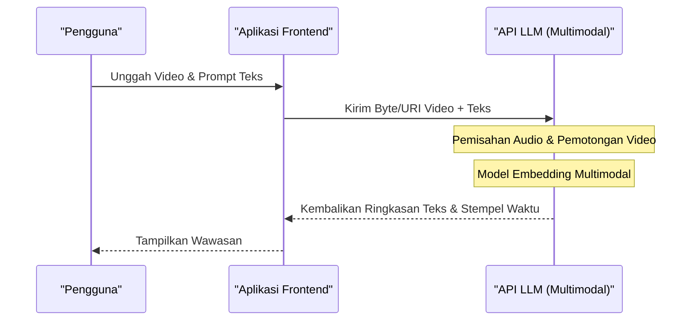

# Perbandingan Lengkap API ChatGPT, Gemini, dan Claude! Mana yang Harus Dipilih?

Evolusi teknologi AI sangat luar biasa, khususnya di bidang Model Bahasa Besar (LLM: Large Language Model), di mana ChatGPT (seri GPT) dari OpenAI, Gemini dari Google, dan Claude dari Anthropic sedang bersaing sengit untuk supremasi. Pada tahun 2026 ini, setiap perusahaan merilis model dan fitur API baru dalam hitungan bulan, bahkan minggu. Bagi pengembang dan arsitek TI perusahaan, pertanyaan "API mana yang harus diintegrasikan ke dalam produk?" telah menjadi keputusan krusial yang menentukan kesuksesan sebuah proyek.

Dalam artikel ini, kita tidak hanya akan menyebutkan spesifikasi dari ketiga API penyedia AI besar ini, tetapi juga akan membandingkan dan menjelaskannya secara komprehensif dari sudut pandang pengembang. Kita akan membahas arsitektur desain, struktur harga yang detail, analisis matematis dari latensi, contoh implementasi konkret menggunakan Python dan Node.js, hingga metode optimasi biaya terbaru seperti prompt caching.

Kami berharap artikel ini dapat menjadi panduan lengkap bagi para pembaca untuk memilih API LLM yang paling sesuai dengan kasus penggunaan (use case) mereka, serta membangun aplikasi AI yang skalabel dan hemat biaya.

---

## 1. Filosofi dan Konsep Desain Masing-masing API LLM

Dalam pemilihan teknologi, sangat penting untuk memahami terlebih dahulu filosofi dasar bagaimana setiap perusahaan membangun model dan API mereka.

### 1.1 OpenAI (ChatGPT)
OpenAI mengusung misi "mewujudkan Kecerdasan Buatan Umum (AGI)" dan selalu memimpin sebagai standar de facto di industri ini. Mereka menawarkan berbagai macam model yang disesuaikan dengan kasus penggunaan, seperti GPT-4o, GPT-4o-mini, dan model khusus penalaran yaitu o1. Ekosistemnya adalah yang paling matang, dengan pustaka dan dokumentasi terbanyak, baik yang resmi maupun tidak resmi.

### 1.2 Google (Gemini)
Google mengedepankan prinsip "AI First", menggunakan skalabilitas infrastruktur mereka sendiri (jaringan TPU) secara maksimal sebagai senjata utamanya. Gemini 1.5 Pro/Flash memiliki context window (panjang konteks) yang luar biasa hingga 2 juta token, menjadikannya sangat unggul dalam memproses dokumen panjang atau video/audio berjam-jam sekaligus. Integrasi yang kuat dengan Google Cloud (Vertex AI) juga sangat menarik bagi kalangan perusahaan (enterprise).

### 1.3 Anthropic (Claude)
Anthropic adalah perusahaan yang didirikan oleh mantan anggota OpenAI dan mengadopsi pendekatan keamanan unik yang disebut "Constitutional AI". Claude 3.5 Sonnet dan Opus mendapatkan dukungan antusias dari banyak pengembang karena kemampuan penalaran yang tinggi, kemampuan menghasilkan kode, dan yang terpenting, "dialog alami layaknya manusia" serta "minimnya halusinasi".

---

## 2. Perbandingan Spesifikasi Keluarga Model secara Komprehensif

Berikut adalah perbandingan spesifikasi dari model-model andalan per tahun 2026.

| Penyedia | Model Andalan | Panjang Konteks Maksimal | Keunggulan Utama | Rekomendasi Kasus Penggunaan |
|---|---|---|---|---|
| **OpenAI** | GPT-4o | 128K | Kecepatan, pengenalan visual, dukungan suara | Aplikasi interaktif, tugas umum |
| **OpenAI** | o1-preview | 128K | Penalaran logis tingkat tinggi, matematika, pengkodean (coding) | Pembuatan algoritma kompleks, tujuan penelitian |
| **Google** | Gemini 1.5 Pro | 2.000K | Pemrosesan teks super panjang, multimodal (video/audio) | Analisis basis kode (codebase) raksasa, ringkasan video |
| **Google** | Gemini 1.5 Flash | 2.000K | Latensi rendah, throughput tinggi, biaya sangat murah | Pemrosesan real-time, pemrosesan batch data dalam jumlah besar |
| **Anthropic** | Claude 3.5 Sonnet | 200K | Kemampuan coding, pembuatan teks alami | Bantuan pengembangan perangkat lunak, dukungan pelanggan tingkat lanjut |
| **Anthropic** | Claude 3.5 Haiku | 200K | Respons super cepat, efektivitas biaya | Edge AI, chatbot real-time |

---

## 3. Mendalami Arsitektur: Di Balik Layar Permintaan API

Saat kita memanggil API LLM, proses apa yang sebenarnya terjadi di backend? Untuk mengoptimalkan performa, kita perlu memahami arsitektur ini.

Diagram Mermaid berikut menunjukkan gambaran keseluruhan mulai dari permintaan API dikirim oleh klien, hingga token dikembalikan secara streaming.

```mermaid
graph TD
    A["Aplikasi Klien"] -->|HTTP/REST atau gRPC| B["API Gateway"]
    B --> C["Load Balancer"]
    C --> D["Klaster Inferensi"]
    D --> E["Tokenizer (BPE / SentencePiece)"]
    E --> F["KV Cache & Mekanisme Perhatian (Attention)"]
    F --> G["Blok Transformer (Forward Pass)"]
    G --> H["Lapisan Output (Logits)"]
    H --> I["Sampler (Temperature, Top-p, Top-k)"]
    I --> J["Detokenizer"]
    J -->|Respons Streaming (Chunk)| A
```

### 3.1 Algoritma Tokenization (Tokenisasi)
Teks yang dimasukkan ke dalam API secara internal dibagi menjadi unit-unit yang disebut "token".
- **OpenAI (tiktoken)**: Mengadopsi Byte-Pair Encoding (BPE). Ini sangat efisien dalam mengompresi bahasa Inggris, tetapi jumlah token cenderung membengkak untuk bahasa non-alfabet seperti bahasa Jepang.
- **Google (Gemini)**: Mengadopsi SentencePiece (Unigram Language Model). Kuat dalam berbagai bahasa, dan cenderung mampu merepresentasikan teks dengan jumlah token yang relatif sedikit bahkan dalam teks bahasa Jepang.
- **Anthropic (Claude)**: Menggunakan versi kustom dari BPE. Dukungan multibahasa telah ditingkatkan, dan mulai Claude 3 ke atas, efisiensi token untuk bahasa Jepang juga telah diperbaiki secara signifikan.

---

## 4. Analisis Matematis tentang Latensi dan Performa

Dalam aplikasi real-time, latensi berdampak langsung pada pengalaman pengguna (UX). Latensi API LLM $T_{total}$ dapat dimodelkan secara matematis sebagai berikut.

$$ T_{total} = T_{network} + T_{TTFT} + (N \times T_{TPOT}) $$

Di sini, masing-masing variabel memiliki arti sebagai berikut:
- $T_{network}$: Round Trip Time (RTT) jaringan.
- $T_{TTFT}$ (Time To First Token): Waktu yang dibutuhkan hingga karakter pertama dihasilkan. Sangat bergantung pada biaya komputasi attention yang proporsional dengan kuadrat dari panjang prompt (jumlah token input).
- $N$: Jumlah total token yang dihasilkan (output).
- $T_{TPOT}$ (Time Per Output Token): Waktu pembuatan per token. Karena merupakan model autoregresif, token dihitung secara seri dengan bergantung pada output sebelumnya.

### 4.1 Kompleksitas Komputasi dari Mekanisme Self-Attention
Kompleksitas komputasi dari Self-Attention dalam arsitektur Transformer meningkat secara kuadratik terhadap panjang urutan input $L$.

$$ \text{Complexity} = O(L^2 \cdot d) $$

Di mana $d$ adalah jumlah dimensi dari vektor embedding. Karena batasan ini, biasanya $T_{TTFT}$ akan memburuk secara drastis saat prompt menjadi lebih panjang.
Namun, Gemini 1.5 dari Google mengadopsi arsitektur optimasi inovatif seperti "Ring Attention" dan "Block-wise Compute", yang berhasil menghasilkan token pertama dalam waktu yang realistis (beberapa detik hingga puluhan detik) meskipun diberikan input teks panjang sebesar 2 juta token.

---

## 5. Struktur Harga dan Strategi Optimasi Biaya

Biaya API pada dasarnya dihitung berdasarkan jumlah token input dan jumlah token output.

$$ Cost = (Tokens_{in} \times Rate_{in}) + (Tokens_{out} \times Rate_{out}) $$

Namun, API terbaru telah memperkenalkan mekanisme baru untuk menekan biaya secara drastis.

### 5.1 Prompt Caching (Cache Prompt)
Mengirimkan sistem prompt yang panjang atau sejumlah besar dokumen hasil pencarian RAG setiap kali permintaan dibuat akan memakan biaya yang sangat besar. Untuk mengatasinya, masing-masing perusahaan menyediakan fitur caching.

Di Anthropic (Claude) dan Google (Gemini), biaya input dapat dikurangi secara signifikan (hingga 90%) dengan melakukan caching pada blok teks tertentu.

Model biaya saat menggunakan cache adalah sebagai berikut:

$$ Cost_{cached} = (Tokens_{cache\_write} \times Rate_{cache\_write}) + (Tokens_{cache\_read} \times Rate_{cache\_read}) + (Tokens_{out} \times Rate_{out}) $$

Di sini, $Rate_{cache\_read}$ biasanya ditetapkan sekitar 10% hingga 25% dari $Rate_{in}$ normal. Hal ini memungkinkan pengoperasian chatbot dengan biaya rendah, sambil terus menyimpan puluhan ribu baris basis kode sebagai latar belakang pengetahuan.

### 5.2 Batch API (API Batch)
Untuk tugas-tugas yang tidak memerlukan respons real-time (analisis log, klasifikasi data dalam jumlah besar, dll.), OpenAI dan Anthropic menyediakan Batch API. Ini adalah mekanisme luar biasa di mana Anda dapat mengirimkan permintaan sekaligus dan menerima hasilnya dalam waktu 24 jam dengan setengah harga (diskon 50%) dari tarif API normal.

---

## 6. Pengalaman Pengembang (DX) dan Perbandingan SDK

Dari perspektif efisiensi pengembangan, mari kita bandingkan SDK (Software Development Kit) yang disediakan oleh setiap perusahaan.

### 6.1 OpenAI API
Paling banyak digunakan, dan dukungan dari pustaka pihak ketiga (seperti LangChain, LlamaIndex) adalah yang tercepat. Selain itu, dengan fitur Structured Outputs, ia menjamin pengembalian respons yang mematuhi skema JSON dengan akurasi 100%, sehingga integrasi sistem menjadi sangat mudah.

### 6.2 Anthropic API (Claude)
Antarmuka SDK-nya dirancang dengan rapi, dan definisi tipe TypeScript-nya dikenal sangat mudah digunakan. Secara khusus, struktur Message API-nya sangat intuitif, sehingga permintaan multimodal yang mencakup banyak gambar dapat ditulis dengan sederhana.

### 6.3 Google Gemini API
Terdapat dua jenis akses: melalui Google Cloud Vertex AI dan melalui AI Studio (Google Gen AI SDK), yang mungkin sedikit membingungkan bagi pemula. Namun, Vertex AI SDK yang ditujukan untuk enterprise terintegrasi penuh dengan IAM (Sistem Otentikasi dan Otorisasi) GCP, sehingga memungkinkan Anda membangun lingkungan pengembangan yang aman.

---

## 7. Praktik! Implementasi Pengujian Terpadu Berbagai API Menggunakan Python

Di sini, kita akan mencoba mengimplementasikan skrip menggunakan Python untuk mengirim permintaan asinkron secara bersamaan ke ketiga API (OpenAI, Anthropic, Gemini) guna membandingkan latensinya.

```python
import asyncio
import time
import os
from openai import AsyncOpenAI
from anthropic import AsyncAnthropic
import google.generativeai as genai

# Inisialisasi Klien
openai_client = AsyncOpenAI(api_key=os.environ.get("OPENAI_API_KEY"))
anthropic_client = AsyncAnthropic(api_key=os.environ.get("ANTHROPIC_API_KEY"))
genai.configure(api_key=os.environ.get("GEMINI_API_KEY"))

prompt = "Tolong jelaskan dasar-dasar komputer kuantum dan dampaknya terhadap teknologi kriptografi saat ini dengan cara yang mudah dipahami oleh pemula."

async def fetch_openai():
    start_time = time.time()
    response = await openai_client.chat.completions.create(
        model="gpt-4o",
        messages=[{"role": "user", "content": prompt}],
        max_tokens=1024
    )
    elapsed = time.time() - start_time
    return "OpenAI (GPT-4o)", elapsed, response.choices[0].message.content

async def fetch_anthropic():
    start_time = time.time()
    response = await anthropic_client.messages.create(
        model="claude-3-5-sonnet-20240620",
        messages=[{"role": "user", "content": prompt}],
        max_tokens=1024
    )
    elapsed = time.time() - start_time
    return "Anthropic (Claude 3.5 Sonnet)", elapsed, response.content[0].text

async def fetch_gemini():
    start_time = time.time()
    model = genai.GenerativeModel('gemini-1.5-pro')
    # Menggunakan metode asinkron dari Gemini Python SDK
    response = await model.generate_content_async(prompt)
    elapsed = time.time() - start_time
    return "Google (Gemini 1.5 Pro)", elapsed, response.text

async def main():
    print("Mengirim permintaan ke masing-masing API LLM...")
    
    # Menjalankan ke-3 API secara paralel
    results = await asyncio.gather(
        fetch_openai(),
        fetch_anthropic(),
        fetch_gemini()
    )
    
    for provider, latency, text in results:
        print(f"--- {provider} ---")
        print(f"Latency: {latency:.2f} detik")
        print(f"Response (Kutipan): {text[:100]}...\n")

if __name__ == "__main__":
    asyncio.run(main())
```

Dengan menjalankan skrip ini, Anda dapat dengan mudah mengukur model mana yang merespons paling cepat (meminimalkan $T_{total}$) di lingkungan jaringan nyata.

---

## 8. Implementasi Tool Calling (Function Calling) Menggunakan Node.js

Untuk membuat LLM berfungsi sebagai "Agen AI" yang berintegrasi dengan sistem eksternal (bukan sekadar chatbot), Tool Calling (atau Function Calling) sangatlah penting. Berikut adalah contoh penggunaan Node.js (TypeScript) agar API OpenAI dapat memanggil API cuaca.

```typescript
import OpenAI from "openai";

const openai = new OpenAI({
  apiKey: process.env.OPENAI_API_KEY,
});

async function runAgent() {
  const tools = [
    {
      type: "function",
      function: {
        name: "get_weather",
        description: "Mendapatkan cuaca saat ini untuk kota yang ditentukan.",
        parameters: {
          type: "object",
          properties: {
            location: {
              type: "string",
              description: "Nama kota (contoh: Tokyo, New York)",
            },
          },
          required: ["location"],
        },
      },
    },
  ];

  const response = await openai.chat.completions.create({
    model: "gpt-4o",
    messages: [{ role: "user", "content": "Bagaimana cuaca di Tokyo hari ini? Apakah saya perlu membawa payung?" }],
    tools: tools,
    tool_choice: "auto",
  });

  const message = response.choices[0].message;

  if (message.tool_calls) {
    const toolCall = message.tool_calls[0];
    console.log(`LLM meminta pemanggilan tool: Nama Fungsi = ${toolCall.function.name}`);
    
    const args = JSON.parse(toolCall.function.arguments);
    console.log(`Argumen: ${args.location}`);
    
    // Di sini implementasikan proses untuk memanggil API cuaca yang sebenarnya (contoh: OpenWeatherMap)
    // const weather = await fetchWeatherFromAPI(args.location);
    
    // Setelah mendapatkan hasil, berikan kembali ke LLM untuk menghasilkan jawaban akhir
  }
}

runAgent().catch(console.error);
```

Claude 3.5 Sonnet dan Gemini 1.5 Pro juga memiliki fitur Tool Calling yang setara. Meskipun ada sedikit perbedaan dalam cara mendefinisikan skema, alur dasarnya tetap sama.

---

## 9. RAG vs Long Context Window: Mana yang Harus Diadopsi?

Saat ini, salah satu perdebatan terbesar dalam arsitektur AI perusahaan adalah: "Untuk memasukkan pengetahuan eksternal, haruskah kita menggunakan RAG (Retrieval-Augmented Generation), atau haruskah kita melemparkan semuanya ke dalam Context Window yang sangat besar (Long Context)?"

### Kelebihan dan Tantangan RAG (Retrieval-Augmented Generation)
- **Kelebihan**: Biaya lebih murah (karena hanya memasukkan bagian/chunk yang diperlukan ke dalam prompt), lebih mudah mengidentifikasi sumber (dasar) dari jawaban.
- **Tantangan**: Karena bergantung pada akurasi pencarian semantik, ini tidak cocok untuk tugas penalaran tingkat lanjut di mana konteksnya tersebar di beberapa dokumen (Contoh: "Berdasarkan seluruh notulen rapat tahun lalu, tolong analisis akar penyebab keterlambatan proyek A secara kronologis.").

### Long Context (seperti 2 juta token pada Gemini 1.5 Pro)
- **Kelebihan**: Tidak ada informasi yang terlewat akibat proses pencarian. Bahkan dalam uji "mencari jarum di tumpukan jerami" (Needle In A Haystack: NIAH), Gemini 1.5 Pro dan Claude 3.5 Sonnet mampu mengekstraksi informasi dengan akurasi di atas 99%.
- **Tantangan**: Menghabiskan jumlah token yang sangat besar sehingga biayanya membengkak, serta latensi ($T_{TTFT}$) meningkat.

**Kesimpulan**: Praktik terbaik (best practice) di tahun 2026 adalah **"Pendekatan Hibrida"**. Desain utama (mainstream) saat ini menggunakan RAG dengan basis data vektor untuk Q&A sehari-hari, dan menggunakan Long Context dengan fitur prompt caching untuk tugas khusus yang memerlukan analisis kompleks atau peninjauan keseluruhan kode.

---

## 10. Perbandingan Kemampuan Pemrosesan Multimodal

Dalam aplikasi AI generasi berikutnya, kemampuan untuk memahami tidak hanya teks, tetapi secara langsung juga memahami gambar, audio, dan video akan sangat dibutuhkan.



- **OpenAI (GPT-4o)**: Memiliki akurasi pengenalan gambar yang sangat tinggi, unggul dalam membaca gambar tulisan tangan atau grafik yang rumit. Selain itu, percakapan suara asli (native) dengan latensi sangat rendah (ratusan milidetik) menggunakan Realtime API juga sangat kuat.
- **Google (Gemini 1.5 Pro)**: **Sangat mendominasi dalam analisis video.** Anda dapat memasukkan file video berdurasi 1 jam (kumpulan frame + audio) apa adanya, dan menanyakan pertanyaan spesifik seperti "Apa judul dokumen yang dipegang oleh orang di sisi kanan layar pada menit 12:45?", lalu mendapatkan jawabannya.
- **Anthropic (Claude 3.5 Sonnet)**: Kemampuan pengenalan gambar (Vision)-nya setara dengan GPT-4o dan sangat luar biasa. Model ini menunjukkan kekuatan tak tertandingi dalam mendukung pengembangan frontend, seperti ketika diberikan tangkapan layar UI lalu diminta "Tolong buatkan kode komponen React untuk layar ini."

---

## 11. Keamanan dan Kepatuhan Tingkat Perusahaan (Enterprise)

Saat perusahaan menggunakan API LLM di lingkungan produksi (production), kekhawatiran terbesar adalah "Apakah data kami akan digunakan untuk melatih AI?" dan "Apakah ini memenuhi persyaratan kepatuhan (compliance)?"

Ketiga penyedia secara tegas menyatakan bahwa data yang dikirim melalui API (prompt dan respons) **tidak digunakan untuk pelatihan model (Zero Data Retention / No Training on Customer Data)** (*Hal ini berbeda dari UI obrolan web gratis yang ditujukan untuk konsumen).

Jika tingkat keamanan yang lebih tinggi diperlukan:
- **OpenAI**: Melalui Azure OpenAI Service, Anda dapat memanfaatkan koneksi jaringan tertutup (private network) via Azure Private Link, tingkat SLA (Service Level Agreement), dan keamanan tingkat perusahaan dari Microsoft.
- **Google**: Melalui Google Cloud Vertex AI, Anda dapat mengaktifkan perlindungan data via CMEK (Customer-Managed Encryption Keys) dan pemisahan jaringan secara ketat menggunakan VPC Service Controls.
- **Anthropic**: Dengan menggunakannya melalui AWS Bedrock atau Google Cloud Vertex AI, Anda dapat memanfaatkan infrastruktur keamanan yang kokoh dari penyedia cloud tersebut.

---

## 12. Kesimpulan: Panduan Pilihan Utama Berdasarkan Kasus Penggunaan

Sejauh ini kita telah membandingkan dari berbagai sudut, tetapi pada akhirnya, jawaban untuk "Mana yang harus dipilih?" akan bergantung pada kasus penggunaan Anda.

1. **Pengembangan Perangkat Lunak Kompleks, Pembuatan Kode, dan Penalaran Tingkat Lanjut**:
   **👑 Pemenang: Claude 3.5 Sonnet (Anthropic)**
   Saat ini, model ini memberikan performa terbaik dalam pemahaman konteks kode, refactoring, dan penulisan teks yang alami layaknya manusia. Kemudahan penggunaan API dan efisiensi biayanya berkat prompt caching juga sangat luar biasa.

2. **Analisis Dokumen Super Panjang, Pemrosesan Batch Video/Audio**:
   **👑 Pemenang: Gemini 1.5 Pro (Google)**
   Context window sebesar 2 juta token adalah senjata unik yang tak tertandingi. Untuk tugas-tugas yang memerlukan pemahaman keseluruhan data, seperti menganalisis panduan PDF setebal ratusan halaman atau merangkum rekaman rapat berdurasi panjang, tidak ada yang bisa mengalahkan Gemini.

3. **Fleksibilitas, Kecepatan Eksekusi, dan Output Terstruktur yang Stabil (JSON)**:
   **👑 Pemenang: GPT-4o / GPT-4o-mini (OpenAI)**
   Model ini menangani hampir semua tugas dengan baik dan memiliki dukungan alat (tool) pihak ketiga yang paling banyak. Jika Anda memerlukan parsing JSON yang andal menggunakan Structured Outputs, atau penalaran logis tingkat sangat tinggi menggunakan model o1, maka ekosistem OpenAI sangat diperlukan.

### Rekomendasi Routing Multi-Model
Tren masa depan bukanlah bergantung pada API tunggal (vendor lock-in), melainkan arsitektur **"LLM Routing"** di mana Anda dapat secara dinamis mengganti model tergantung pada tingkat kesulitan dan pentingnya tugas.
Misalnya, untuk merespons pertanyaan sederhana dari pengguna, Anda dapat menggunakan `GPT-4o-mini` atau `Gemini 1.5 Flash` yang murah dan cepat. Namun, jika dinilai memerlukan pemrosesan yang lebih kompleks, barulah tugas tersebut diserahkan ke `Claude 3.5 Sonnet`. Dengan cara ini, keseimbangan optimal antara biaya dan performa dapat tercapai.

Evolusi AI tidak akan berhenti. Pahami secara mendalam kelebihan dan kekurangan dari masing-masing API, serta karakteristik arsitekturnya, agar Anda dapat membangun aplikasi AI yang fleksibel dan skalabel.
