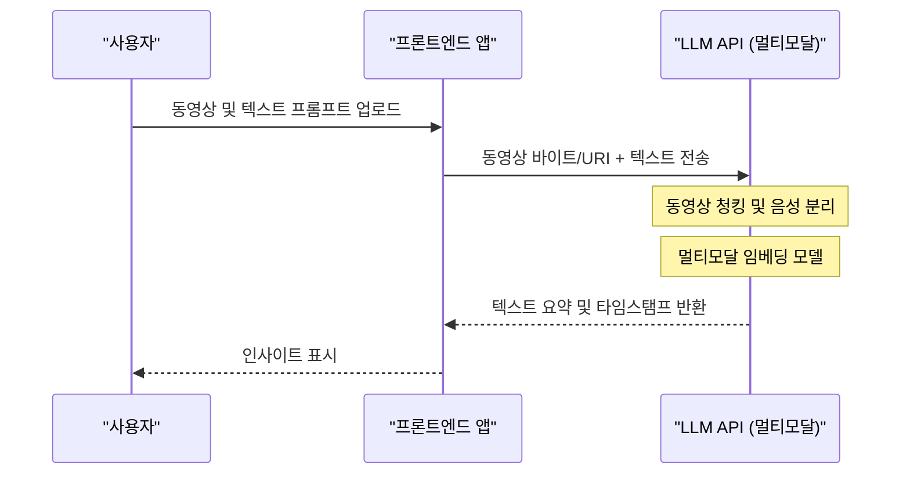

# ChatGPT・Gemini・Claude의 API 철저 비교! 어떤 것을 선택해야 할까?

AI 기술의 진화는 눈부시며, 특히 대규모 언어 모델(LLM: Large Language Model) 분야에서는 OpenAI의 ChatGPT(GPT 시리즈), Google의 Gemini, Anthropic의 Claude가 삼파전의 치열한 패권 다툼을 벌이고 있습니다. 2026년 현재, 각 회사는 수개월, 아니 수주일 단위로 새로운 모델과 API 기능을 출시하고 있으며, 개발자나 기업의 IT 아키텍트에게 "어떤 API를 프로덕트에 통합해야 하는가"라는 질문은 프로젝트의 성공을 좌우하는 매우 중요한 의사 결정이 되었습니다.

본 기사에서는 이 3대 AI 제공업체의 API에 대해 단순한 스펙의 나열에 그치지 않고, 아키텍처 설계, 상세한 요금 구조, 지연 시간(레이턴시)의 수학적 분석, Python 및 Node.js를 이용한 구체적인 구현 예시, 프롬프트 캐싱 등 최신 비용 최적화 기법에 이르기까지 개발자의 관점에서 철저하게 비교하고 해설합니다.

독자 여러분이 자신의 유스케이스에 가장 적합한 LLM API를 선정하고, 확장 가능하며 비용 효율적인 AI 애플리케이션을 구축하기 위한 완전한 가이드가 되는 것을 목표로 합니다.

---

## 1. 각 LLM API의 철학과 설계 사상

기술 선정에 있어 우선 각 회사가 어떤 사상으로 모델과 API를 구축하고 있는지 이해하는 것은 매우 중요합니다.

### 1.1 OpenAI (ChatGPT)
OpenAI는 "범용 인공지능(AGI)의 실현"을 미션으로 내걸고 항상 업계의 사실상 표준을 견인하고 있습니다. GPT-4o나 GPT-4o-mini, 그리고 추론 특화형인 o1 모델 등 유스케이스에 맞춘 다양한 모델을 제공합니다. 생태계가 가장 성숙해 있으며, 공식·비공식 여부를 불문하고 라이브러리와 문서가 가장 풍부합니다.

### 1.2 Google (Gemini)
Google은 "AI First"를 내걸고, 자사의 인프라(TPU 네트워크)를 최대한 활용한 확장성을 무기로 삼고 있습니다. Gemini 1.5 Pro/Flash는 최대 200만 토큰이라는 압도적인 컨텍스트 윈도우(문맥 길이)를 가지며, 방대한 문서나 수 시간의 동영상·음성을 한 번에 처리할 수 있는 것이 가장 큰 특징입니다. Google Cloud (Vertex AI)와의 강력한 통합 역시 엔터프라이즈에게 매력적입니다.

### 1.3 Anthropic (Claude)
Anthropic은 전 OpenAI 멤버들이 설립한 기업으로, "Constitutional AI(합헌적 AI)"라는 독자적인 안전성 접근 방식을 채택하고 있습니다. Claude 3.5 Sonnet과 Opus는 뛰어난 추론 능력, 코드 생성 능력, 그리고 무엇보다 "인간처럼 자연스러운 대화"와 "할루시네이션(환각)의 적음"으로 많은 개발자들로부터 열광적인 지지를 얻고 있습니다.

---

## 2. 모델 패밀리의 스펙 철저 비교

2026년 현재 주력 모델의 스펙을 비교합니다.

| 제공업체 | 주력 모델 | 최대 컨텍스트 길이 | 주요 강점 | 권장 유스케이스 |
|---|---|---|---|---|
| **OpenAI** | GPT-4o | 128K | 속도, 시각 인식, 음성 지원 | 인터랙티브한 앱, 범용 작업 |
| **OpenAI** | o1-preview | 128K | 고도의 논리 추론, 수학, 코딩 | 복잡한 알고리즘 생성, 연구 용도 |
| **Google** | Gemini 1.5 Pro | 2,000K | 초장문 처리, 멀티모달(동영상·음성) | 거대한 코드베이스 분석, 동영상 요약 |
| **Google** | Gemini 1.5 Flash | 2,000K | 저지연, 고처리량, 압도적인 저비용 | 실시간 처리, 대량 데이터의 일괄 처리 |
| **Anthropic** | Claude 3.5 Sonnet | 200K | 코딩 능력, 자연스러운 문장 생성 | 소프트웨어 개발 지원, 고도화된 고객 지원 |
| **Anthropic** | Claude 3.5 Haiku | 200K | 초고속 응답, 가성비 | 엣지 AI, 실시간 챗봇 |

---

## 3. 아키텍처 파고들기: API 요청의 이면

LLM API를 호출했을 때, 백엔드에서는 어떤 처리가 이루어지고 있을까요? 성능을 최적화하기 위해서는 이 아키텍처를 이해할 필요가 있습니다.

다음의 Mermaid 다이어그램은 클라이언트로부터 API 요청이 전송되고, 토큰이 스트리밍으로 반환되기까지의 전체적인 모습을 보여줍니다.

```mermaid
graph TD
    A["클라이언트 애플리케이션"] -->|HTTP/REST or gRPC| B["API 게이트웨이"]
    B --> C["로드 밸런서"]
    C --> D["추론 클러스터"]
    D --> E["토크나이저 (BPE / SentencePiece)"]
    E --> F["KV 캐시 및 어텐션 메커니즘"]
    F --> G["트랜스포머 블록 (정방향 패스)"]
    G --> H["출력 레이어 (Logits)"]
    H --> I["샘플러 (Temperature, Top-p, Top-k)"]
    I --> J["디토크나이저"]
    J -->|스트리밍 응답 (Chunk)| A
```

### 3.1 Tokenization(토큰화) 알고리즘
API에 입력된 텍스트는 내부적으로 '토큰'이라는 단위로 분할됩니다.
- **OpenAI (tiktoken)**: Byte-Pair Encoding (BPE) 채택. 특히 영어에서 매우 효율적으로 압축되지만, 한국어 등 비알파벳 언어에서는 토큰 수가 늘어나는 경향이 있습니다.
- **Google (Gemini)**: SentencePiece (Unigram Language Model) 채택. 다국어에 강하며, 한국어 텍스트에서도 비교적 적은 토큰 수로 표현할 수 있는 경향이 있습니다.
- **Anthropic (Claude)**: BPE의 맞춤형 버전 사용. 다국어 지원이 강화되어 있으며, Claude 3 이후로는 한국어 토큰 효율도 크게 개선되었습니다.

---

## 4. 지연 시간(레이턴시)과 성능의 수학적 분석

실시간 애플리케이션에서 지연 시간은 사용자 경험(UX)과 직결됩니다. LLM API의 지연 시간 $T_{total}$은 수학적으로 다음과 같이 모델링할 수 있습니다.

$$ T_{total} = T_{network} + T_{TTFT} + (N \times T_{TPOT}) $$

여기서 각 변수는 다음의 의미를 갖습니다.
- $T_{network}$: 네트워크의 왕복 시간(RTT).
- $T_{TTFT}$ (Time To First Token): 첫 글자가 생성되기까지의 시간. 프롬프트 길이(입력 토큰 수)의 제곱에 비례하는 어텐션 계산 비용에 크게 의존합니다.
- $N$: 출력되는 토큰의 총 개수.
- $T_{TPOT}$ (Time Per Output Token): 1토큰 당 생성 시간. 자기 회귀(autoregressive) 모델이므로 이전 출력에 의존하여 직렬로 계산됩니다.

### 4.1 자기 어텐션(Self-Attention) 메커니즘의 계산량
Transformer 아키텍처에서 자기 어텐션(Self-Attention)의 계산량은 입력 시퀀스 길이 $L$에 대해 이차 함수적으로 증가합니다.

$$ \text{Complexity} = O(L^2 \cdot d) $$

여기서 $d$는 임베딩 벡터의 차원 수입니다. 이 제약 때문에 일반적으로 프롬프트가 길어지면 $T_{TTFT}$가 급격히 악화됩니다.
하지만 Google의 Gemini 1.5는 "Ring Attention"이나 "Block-wise Compute"와 같은 혁신적인 최적화 아키텍처를 채택하여, 200만 토큰이라는 긴 문장을 입력해도 현실적인 시간(수 초~수십 초) 내에 첫 토큰을 생성하는 데 성공했습니다.

---

## 5. 요금 체계 및 비용 최적화 전략

API 비용은 기본적으로 입력 토큰 수와 출력 토큰 수를 기준으로 계산됩니다.

$$ Cost = (Tokens_{in} \times Rate_{in}) + (Tokens_{out} \times Rate_{out}) $$

하지만 최신 API에서는 비용을 극적으로 낮추기 위한 새로운 메커니즘이 도입되고 있습니다.

### 5.1 프롬프트 캐싱 (Prompt Caching)
방대한 시스템 프롬프트나, RAG로 검색한 대량의 문서를 매번 전송하면 막대한 비용이 발생합니다. 이에 대응하기 위해 각 회사는 캐시 기능을 제공하고 있습니다.

Anthropic(Claude)이나 Google(Gemini)에서는 특정 텍스트 블록을 캐싱함으로써 입력 비용을 대폭(최대 90%) 절감할 수 있습니다.

캐시를 이용할 경우의 비용 모델은 다음과 같습니다.

$$ Cost_{cached} = (Tokens_{cache\_write} \times Rate_{cache\_write}) + (Tokens_{cache\_read} \times Rate_{cache\_read}) + (Tokens_{out} \times Rate_{out}) $$

여기서 $Rate_{cache\_read}$는 일반적인 $Rate_{in}$의 10%~25% 수준으로 설정되어 있습니다. 이를 통해 수만 줄의 코드베이스를 배경 지식으로 항상 유지하면서도 저렴하게 챗봇을 운영할 수 있게 되었습니다.

### 5.2 배치 API (Batch API)
실시간성이 불필요한 작업(로그 분석, 대량의 데이터 분류 등)을 위해 OpenAI나 Anthropic은 배치 API를 제공합니다. 요청을 모아서 전송하고 24시간 이내에 결과를 받는 대신, 일반 API 요금의 절반(50% 할인)으로 이용할 수 있는 강력한 시스템입니다.

---

## 6. 개발자 경험(DX)과 SDK 비교

개발 효율의 관점에서 각 회사가 제공하는 SDK(Software Development Kit)를 비교합니다.

### 6.1 OpenAI API
가장 널리 사용되고 있으며, 서드파티 라이브러리(LangChain, LlamaIndex 등)의 지원도 가장 빠릅니다. 또한, Structured Outputs(구조화된 출력) 기능을 통해 JSON 스키마를 100%의 정확도로 준수한 응답을 반환하도록 보장되어 있어, 시스템 연동이 매우 용이합니다.

### 6.2 Anthropic API (Claude)
SDK 인터페이스가 세련되었으며, TypeScript의 타입 정의 등이 다루기 매우 쉽다는 평가를 받습니다. 특히 Message API의 구조가 직관적이고, 여러 장의 이미지를 포함한 멀티모달 요청도 간단하게 작성할 수 있습니다.

### 6.3 Google Gemini API
Google Cloud Vertex AI를 통한 액세스와 AI Studio를 통한 액세스(Google Gen AI SDK) 두 가지가 존재하여 초보자는 조금 혼란스러울 수 있습니다. 하지만 엔터프라이즈용 Vertex AI SDK는 GCP의 IAM(인증 및 인가 시스템)과 완벽하게 통합되어 있어 안전한 개발 환경을 구축할 수 있습니다.

---

## 7. 실전! Python을 활용한 다중 API 통합 테스트 구현

여기서는 Python을 사용하여 OpenAI, Anthropic, Gemini 등 3개의 API에 대해 동시에 비동기 요청을 보내고, 지연 시간을 비교하는 스크립트를 구현해 보겠습니다.

```python
import asyncio
import time
import os
from openai import AsyncOpenAI
from anthropic import AsyncAnthropic
import google.generativeai as genai

# 클라이언트 초기화
openai_client = AsyncOpenAI(api_key=os.environ.get("OPENAI_API_KEY"))
anthropic_client = AsyncAnthropic(api_key=os.environ.get("ANTHROPIC_API_KEY"))
genai.configure(api_key=os.environ.get("GEMINI_API_KEY"))

prompt = "양자 컴퓨터의 기초와 그것이 현재의 암호 기술에 미치는 영향에 대해 초보자도 알기 쉽게 설명해 주세요."

async def fetch_openai():
    start_time = time.time()
    response = await openai_client.chat.completions.create(
        model="gpt-4o",
        messages=[{"role": "user", "content": prompt}],
        max_tokens=1024
    )
    elapsed = time.time() - start_time
    return "OpenAI (GPT-4o)", elapsed, response.choices[0].message.content

async def fetch_anthropic():
    start_time = time.time()
    response = await anthropic_client.messages.create(
        model="claude-3-5-sonnet-20240620",
        messages=[{"role": "user", "content": prompt}],
        max_tokens=1024
    )
    elapsed = time.time() - start_time
    return "Anthropic (Claude 3.5 Sonnet)", elapsed, response.content[0].text

async def fetch_gemini():
    start_time = time.time()
    model = genai.GenerativeModel('gemini-1.5-pro')
    # Gemini Python SDK의 비동기 메서드 활용
    response = await model.generate_content_async(prompt)
    elapsed = time.time() - start_time
    return "Google (Gemini 1.5 Pro)", elapsed, response.text

async def main():
    print("각 LLM API로 요청을 전송 중...")
    
    # 3개의 API를 병렬로 실행
    results = await asyncio.gather(
        fetch_openai(),
        fetch_anthropic(),
        fetch_gemini()
    )
    
    for provider, latency, text in results:
        print(f"--- {provider} ---")
        print(f"Latency: {latency:.2f} seconds")
        print(f"Response (Excerpt): {text[:100]}...\n")

if __name__ == "__main__":
    asyncio.run(main())
```

이 스크립트를 실행함으로써 실제 네트워크 환경에서 어떤 모델이 가장 빠르게($T_{total}$을 최소화하여) 응답하는지 쉽게 측정할 수 있습니다.

---

## 8. Node.js에 의한 Tool Calling(Function Calling) 구현

LLM을 단순한 챗봇이 아니라 외부 시스템과 연동하는 'AI 에이전트'로 기능하게 하려면 Tool Calling(또는 Function Calling)이 필수적입니다. 다음은 Node.js(TypeScript)를 사용하여 OpenAI API가 날씨 API를 호출하도록 하는 예시입니다.

```typescript
import OpenAI from "openai";

const openai = new OpenAI({
  apiKey: process.env.OPENAI_API_KEY,
});

async function runAgent() {
  const tools = [
    {
      type: "function",
      function: {
        name: "get_weather",
        description: "지정된 도시의 현재 날씨를 가져옵니다.",
        parameters: {
          type: "object",
          properties: {
            location: {
              type: "string",
              description: "도시 이름 (예: 서울, 뉴욕)",
            },
          },
          required: ["location"],
        },
      },
    },
  ];

  const response = await openai.chat.completions.create({
    model: "gpt-4o",
    messages: [{ role: "user", "content": "오늘 서울 날씨 어때? 우산 챙겨야 할까?" }],
    tools: tools,
    tool_choice: "auto",
  });

  const message = response.choices[0].message;

  if (message.tool_calls) {
    const toolCall = message.tool_calls[0];
    console.log(`LLM이 도구 호출을 요청했습니다: 함수 이름 = ${toolCall.function.name}`);
    
    const args = JSON.parse(toolCall.function.arguments);
    console.log(`인수: ${args.location}`);
    
    // 여기서 실제 날씨 API(예: OpenWeatherMap)를 호출하는 로직을 구현합니다
    // const weather = await fetchWeatherFromAPI(args.location);
    
    // 가져온 결과를 다시 LLM에 전달하여 최종 답변을 생성하게 합니다
  }
}

runAgent().catch(console.error);
```

Claude 3.5 Sonnet이나 Gemini 1.5 Pro도 동등한 Tool Calling 기능을 갖추고 있으며, 스키마 정의 방법에 약간의 차이는 있지만 기본적인 흐름은 동일합니다.

---

## 9. RAG vs Long Context Window: 어떤 것을 채택해야 할까?

현재 엔터프라이즈 AI 아키텍처에서 가장 큰 논쟁 중 하나는 "외부 지식을 가져오기 위해 RAG(검색 증강 생성)를 사용해야 할지, 아니면 거대한 컨텍스트 윈도우(Long Context)에 모든 것을 맡겨야 할지" 하는 문제입니다.

### RAG (Retrieval-Augmented Generation)의 장점과 과제
- **장점**: 비용이 저렴하며(필요한 청크만 프롬프트에 넣기 때문), 답변의 근거(출처)를 특정하기 쉽습니다.
- **과제**: 시맨틱 검색의 정확도에 의존하기 때문에, 문맥이 여러 문서에 흩어져 있는 고도화된 추론 작업(예: "작년 전체 회의록에서 A 프로젝트가 지연된 근본 원인을 시계열로 분석해 줘")에는 적합하지 않습니다.

### Long Context (Gemini 1.5 Pro의 200만 토큰 등)
- **장점**: 검색으로 인한 정보 누락이 없습니다. "건초 더미에서 바늘 찾기(Needle In A Haystack: NIAH)" 테스트에서도 Gemini 1.5 Pro나 Claude 3.5 Sonnet은 99% 이상의 정확도로 정보를 추출할 수 있습니다.
- **과제**: 토큰 소비량이 방대해져 비용이 증가하며, 지연 시간($T_{TTFT}$)이 늘어납니다.

**결론**: 2026년의 모범 사례(Best Practice)는 **"하이브리드 접근법"**입니다. 일상적인 Q&A에는 벡터 데이터베이스를 활용한 RAG를 사용하고, 복잡한 분석이나 코드 전체 리뷰가 필요한 특화된 작업에는 프롬프트 캐싱을 활용한 Long Context를 사용하는 설계가 주류가 되고 있습니다.

---

## 10. 멀티모달 처리 능력 비교

차세대 AI 애플리케이션에서는 텍스트뿐만 아니라 이미지, 음성, 동영상을 직접 이해하는 능력이 요구됩니다.



- **OpenAI (GPT-4o)**: 이미지 인식 정확도가 매우 뛰어나며, 손으로 그린 도면이나 복잡한 그래프를 읽어내는 데 탁월합니다. 또한, Realtime API를 이용한 초저지연(수백 밀리초) 네이티브 음성 대화 기능도 강력합니다.
- **Google (Gemini 1.5 Pro)**: **동영상 분석에 있어서 다른 모델들을 압도합니다.** 1시간 분량의 동영상 파일(프레임 및 음성)을 그대로 입력하고, "12분 45초에 화면 오른쪽 끝에 나타난 인물이 들고 있는 자료의 제목은?"과 같은 핀포인트 질문에 답변이 가능합니다.
- **Anthropic (Claude 3.5 Sonnet)**: 이미지 인식(Vision) 능력은 GPT-4o와 동등한 수준으로 매우 우수합니다. UI 스크린샷을 넘겨주며 "이 화면의 React 컴포넌트 코드를 생성해 줘"라고 요구하는 프론트엔드 개발 지원에서 독보적인 강점을 발휘합니다.

---

## 11. 엔터프라이즈급 보안 및 컴플라이언스

기업이 LLM API를 프로덕션 환경에서 사용할 때 가장 우려하는 점은 "자사의 데이터가 AI 학습에 사용되지는 않는가"와 "컴플라이언스 요건을 충족하는가"입니다.

3사 모두 API를 통해 전송된 데이터(프롬프트 및 응답)를 **모델 학습에 사용하지 않는다고(Zero Data Retention / No Training on Customer Data)** 명시하고 있습니다(※무료 소비자용 웹 채팅 UI는 예외입니다).

더 높은 보안 수준이 요구될 경우:
- **OpenAI**: Azure OpenAI Service를 경유함으로써 Microsoft의 엔터프라이즈급 보안, SLA, Azure Private Link를 통한 폐쇄망 연결을 이용할 수 있습니다.
- **Google**: Google Cloud Vertex AI를 경유함으로써 VPC Service Controls를 이용한 엄격한 네트워크 분리 및 CMEK(고객 관리 암호화 키)를 통한 데이터 보호가 가능합니다.
- **Anthropic**: AWS Bedrock 또는 Google Cloud Vertex AI를 경유하여 클라우드 제공업체의 견고한 보안 기반을 함께 이용할 수 있습니다.

---

## 12. 결론: 유스케이스별 궁극의 선택 가이드

지금까지 다각도로 비교해 왔지만, 결국 "어떤 것을 선택해야 하는가?"에 대한 결론은 유스케이스에 따라 다릅니다.

1. **복잡한 소프트웨어 개발·코드 생성·고도의 추론**:
   **👑 승자: Claude 3.5 Sonnet (Anthropic)**
   코드의 문맥 이해, 리팩토링, 자연스럽고 인간적인 문장 작성에 있어 현재 최고의 성능을 발휘합니다. API의 사용 편의성과 프롬프트 캐싱을 통한 비용 효율성도 뛰어납니다.

2. **초장문 문서 분석·동영상/음성 일괄 처리**:
   **👑 승자: Gemini 1.5 Pro (Google)**
   200만 토큰의 컨텍스트 윈도우는 유일무이한 무기입니다. 수백 페이지의 PDF 매뉴얼 분석이나 장시간의 회의 녹화 요약 등 데이터의 전체적인 윤곽을 파악해야 하는 작업에서는 Gemini를 따라올 모델이 없습니다.

3. **범용성·실행 속도·안정적인 구조화된 출력(JSON)**:
   **👑 승자: GPT-4o / GPT-4o-mini (OpenAI)**
   모든 작업을 무난하게 소화하며, 서드파티 도구 지원도 가장 풍부합니다. Structured Outputs를 활용한 확실한 JSON 파싱이나, o1 모델을 이용한 초고도 논리 추론이 필요한 경우 OpenAI 생태계가 필수적입니다.

### 멀티 모델 라우팅 권장
단일 API에 의존(벤더 종속)하는 것이 아니라, 작업의 난이도나 중요도에 따라 모델을 동적으로 전환하는 **"LLM 라우팅"** 아키텍처가 향후의 트렌드입니다.
예를 들어, 사용자의 단순한 질문에는 저렴하고 빠른 `GPT-4o-mini`나 `Gemini 1.5 Flash`로 응답하고, 복잡한 처리가 필요하다고 판단되는 경우에만 `Claude 3.5 Sonnet`으로 작업을 폴백(fallback)시킴으로써 비용과 성능의 최적 균형을 실현할 수 있습니다.

AI의 진화는 멈추지 않습니다. 각 API의 장단점과 아키텍처의 특성을 깊이 이해하여 유연하고 확장 가능한 AI 애플리케이션을 구축하시기 바랍니다.
