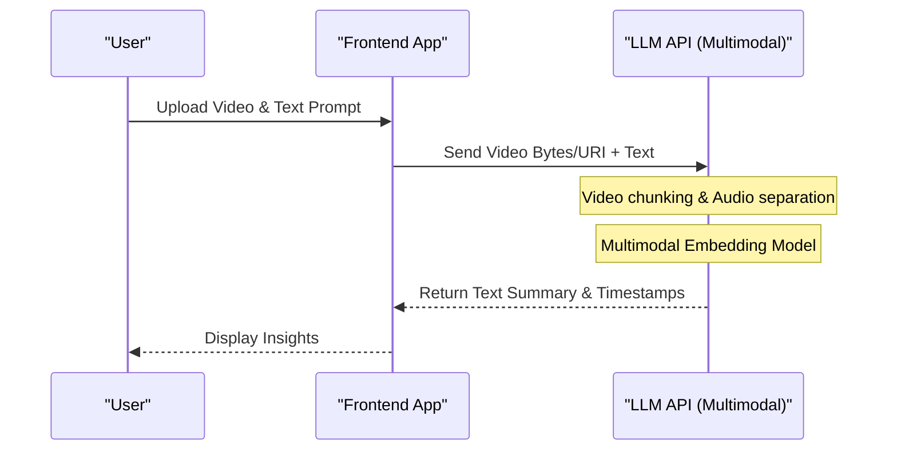

# ChatGPT・Gemini・ClaudeのAPI徹底比較！どれを選ぶべき？

AI技術の進化は目覚ましく、特に大規模言語モデル（LLM: Large Language Model）の分野では、OpenAIのChatGPT（GPTシリーズ）、GoogleのGemini、AnthropicのClaudeが三つ巴の激しい覇権争いを繰り広げています。2026年現在、各社は数ヶ月、いや数週間単位で新しいモデルやAPI機能をリリースしており、開発者や企業のITアーキテクトにとって「どのAPIをプロダクトに組み込むべきか」という問いは、プロジェクトの成功を左右する極めて重要な意思決定となっています。

本記事では、これら3大AIプロバイダーのAPIについて、単なるスペックの羅列にとどまらず、アーキテクチャ設計、詳細な料金構造、レイテンシ（遅延）の数学的分析、PythonおよびNode.jsによる具体的な実装例、プロンプトキャッシュなどの最新のコスト最適化手法に至るまで、開発者の視点から徹底的に比較・解説します。

読者の皆様が、自身のユースケースに最適なLLM APIを選定し、スケーラブルでコスト効率の高いAIアプリケーションを構築するための完全なガイドとなることを目指しています。

---

## 1. 各LLM APIの哲学と設計思想

技術選定において、まず各社がどのような思想でモデルとAPIを構築しているかを理解することは非常に重要です。

### 1.1 OpenAI (ChatGPT)
OpenAIは、「汎用人工知能（AGI）の実現」をミッションに掲げ、常に業界のデファクトスタンダードを牽引しています。GPT-4oやGPT-4o-mini、そして推論特化型のo1モデルなど、ユースケースに合わせた多様なモデルを提供しています。エコシステムが最も成熟しており、公式・非公式問わずライブラリやドキュメントが最も豊富です。

### 1.2 Google (Gemini)
Googleは「AI First」を掲げ、自社のインフラ（TPUネットワーク）を最大限に活用したスケーラビリティを武器にしています。Gemini 1.5 Pro/Flashは、最大200万トークンという圧倒的なコンテキストウィンドウ（文脈長）を持ち、長大なドキュメントや数時間の動画・音声を一度に処理できるのが最大の特徴です。Google Cloud (Vertex AI) との強力な統合もエンタープライズにとって魅力的です。

### 1.3 Anthropic (Claude)
Anthropicは、元OpenAIのメンバーが設立した企業であり、「Constitutional AI（合憲的AI）」という独自の安全性アプローチを採用しています。Claude 3.5 SonnetやOpusは、その高い推論能力、コード生成能力、そして何より「人間らしい自然な対話」と「ハルシネーション（幻覚）の少なさ」で、多くの開発者から熱狂的な支持を集めています。

---

## 2. モデルファミリーのスペック徹底比較

2026年現在の主力モデルのスペックを比較します。

| プロバイダー | 主力モデル | 最大コンテキスト長 | 主な強み | 推奨ユースケース |
|---|---|---|---|---|
| **OpenAI** | GPT-4o | 128K | スピード、視覚認識、音声対応 | インタラクティブなアプリ、汎用タスク |
| **OpenAI** | o1-preview | 128K | 高度な論理推論、数学、コーディング | 複雑なアルゴリズム生成、研究用途 |
| **Google** | Gemini 1.5 Pro | 2,000K | 超長文処理、マルチモーダル（動画・音声） | 巨大なコードベースの解析、動画要約 |
| **Google** | Gemini 1.5 Flash | 2,000K | 低遅延、高スループット、圧倒的低コスト | リアルタイム処理、大量データの一括処理 |
| **Anthropic** | Claude 3.5 Sonnet | 200K | コーディング能力、自然な文章生成 | ソフトウェア開発支援、高度なカスタマーサポート |
| **Anthropic** | Claude 3.5 Haiku | 200K | 超高速応答、コストパフォーマンス | エッジAI、リアルタイムチャットボット |

---

## 3. アーキテクチャの深堀り：APIリクエストの裏側

LLMのAPIをコールした際、バックエンドではどのような処理が行われているのでしょうか。パフォーマンスを最適化するためには、このアーキテクチャを理解する必要があります。

以下のMermaidダイアグラムは、クライアントからAPIリクエストが送信され、トークンがストリーミングで返されるまでの全体像を示しています。

```mermaid
graph TD
    A["Client Application"] -->|HTTP/REST or gRPC| B["API Gateway"]
    B --> C["Load Balancer"]
    C --> D["Inference Cluster"]
    D --> E["Tokenizer (BPE / SentencePiece)"]
    E --> F["KV Cache & Attention Mechanism"]
    F --> G["Transformer Blocks (Forward Pass)"]
    G --> H["Output Layer (Logits)"]
    H --> I["Sampler (Temperature, Top-p, Top-k)"]
    I --> J["Detokenizer"]
    J -->|Streaming Response (Chunk)| A
```

### 3.1 Tokenization（トークン化）のアルゴリズム
APIに入力されたテキストは、内部で「トークン」という単位に分割されます。
- **OpenAI (tiktoken)**: Byte-Pair Encoding (BPE) を採用。特に英語において極めて効率的に圧縮されますが、日本語などの非アルファベット言語ではトークン数が膨らみがちです。
- **Google (Gemini)**: SentencePiece（Unigram Language Model）を採用。多言語に強く、日本語のテキストでも比較的少ないトークン数で表現できる傾向があります。
- **Anthropic (Claude)**: BPEのカスタマイズ版を使用。多言語対応が強化されており、Claude 3以降は日本語のトークン効率も大幅に改善されています。

---

## 4. レイテンシとパフォーマンスの数学的分析

リアルタイムアプリケーションにおいて、レイテンシはユーザー体験（UX）に直結します。LLMのAPIのレイテンシ $T_{total}$ は、数学的に以下のようにモデル化できます。

$$ T_{total} = T_{network} + T_{TTFT} + (N \times T_{TPOT}) $$

ここで、各変数は以下の意味を持ちます。
- $T_{network}$: ネットワークのラウンドトリップタイム（RTT）。
- $T_{TTFT}$ (Time To First Token): 最初の文字が生成されるまでの時間。プロンプトの長さ（入力トークン数）の二乗に比例するアテンション計算のコストに大きく依存します。
- $N$: 出力されるトークンの総数。
- $T_{TPOT}$ (Time Per Output Token): 1トークンあたりの生成時間。自己回帰モデルであるため、前の出力に依存して直列に計算されます。

### 4.1 自己アテンション機構の計算量
Transformerアーキテクチャにおける自己アテンション（Self-Attention）の計算量は、入力シーケンス長 $L$ に対して二次関数的に増加します。

$$ \text{Complexity} = O(L^2 \cdot d) $$

ここで $d$ は埋め込みベクトルの次元数です。この制約のため、通常はプロンプトが長くなると $T_{TTFT}$ が急激に悪化します。
しかし、GoogleのGemini 1.5は「Ring Attention」や「Block-wise Compute」といった革新的な最適化アーキテクチャを採用しており、200万トークンという長文を入力しても、現実的な時間（数秒〜数十秒）で最初のトークンを生成することに成功しています。

---

## 5. 料金体系とコスト最適化の戦略

APIのコストは、基本的に入力トークン数と出力トークン数に基づいて計算されます。

$$ Cost = (Tokens_{in} \times Rate_{in}) + (Tokens_{out} \times Rate_{out}) $$

しかし、最新のAPIではコストを劇的に下げるための新しい仕組みが導入されています。

### 5.1 プロンプトキャッシュ (Prompt Caching)
長大なシステムプロンプトや、RAGで検索した大量のドキュメントを毎回送信すると莫大なコストがかかります。これに対処するため、各社はキャッシュ機能を提供しています。

Anthropic（Claude）やGoogle（Gemini）では、特定のテキストブロックをキャッシュすることで、入力コストを大幅に（最大90%）削減できます。

キャッシュを利用した場合のコストモデルは以下のようになります。

$$ Cost_{cached} = (Tokens_{cache\_write} \times Rate_{cache\_write}) + (Tokens_{cache\_read} \times Rate_{cache\_read}) + (Tokens_{out} \times Rate_{out}) $$

ここで $Rate_{cache\_read}$ は通常の $Rate_{in}$ の10%〜25%程度に設定されています。これにより、数万行のコードベースを背景知識として常に保持させながら、安価にチャットボットを運用することが可能になりました。

### 5.2 バッチAPI (Batch API)
リアルタイム性が不要なタスク（ログ分析、大量のデータ分類など）向けに、OpenAIやAnthropicはバッチAPIを提供しています。リクエストをまとめて送信し、24時間以内に結果を受け取る代わりに、通常のAPI料金の半額（50%オフ）で利用できる強力な仕組みです。

---

## 6. 開発者体験（DX）とSDKの比較

開発効率の観点から、各社の提供するSDK（Software Development Kit）を比較します。

### 6.1 OpenAI API
最も広く使われており、サードパーティ製ライブラリ（LangChain, LlamaIndexなど）の対応も最速です。また、Structured Outputs（構造化出力）機能により、JSONスキーマを100%の精度で遵守したレスポンスを返すことが保証されており、システム連携が非常に容易です。

### 6.2 Anthropic API (Claude)
SDKのインターフェースが洗練されており、TypeScriptの型定義などが非常に扱いやすいと評判です。特にMessage APIの構造が直感的で、複数画像を含めたマルチモーダルリクエストもシンプルに記述できます。

### 6.3 Google Gemini API
Google Cloud Vertex AI経由のアクセスと、AI Studio経由のアクセス（Google Gen AI SDK）の2種類が存在し、初心者は少し混乱するかもしれません。しかし、エンタープライズ向けのVertex AI SDKは、GCPのIAM（認証認可システム）と完全に統合されており、セキュアな開発環境を構築できます。

---

## 7. 実践！Pythonによる複数APIの統合テスト実装

ここでは、Pythonを使用して、OpenAI, Anthropic, Geminiの3つのAPIに対して同時に非同期リクエストを送信し、レイテンシを比較するスクpromptリプトを実装してみます。

```python
import asyncio
import time
import os
from openai import AsyncOpenAI
from anthropic import AsyncAnthropic
import google.generativeai as genai

# クライアントの初期化
openai_client = AsyncOpenAI(api_key=os.environ.get("OPENAI_API_KEY"))
anthropic_client = AsyncAnthropic(api_key=os.environ.get("ANTHROPIC_API_KEY"))
genai.configure(api_key=os.environ.get("GEMINI_API_KEY"))

prompt = "量子コンピュータの基礎と、それが現在の暗号技術に与える影響について、初心者向けに分かりやすく解説してください。"

async def fetch_openai():
    start_time = time.time()
    response = await openai_client.chat.completions.create(
        model="gpt-4o",
        messages=[{"role": "user", "content": prompt}],
        max_tokens=1024
    )
    elapsed = time.time() - start_time
    return "OpenAI (GPT-4o)", elapsed, response.choices[0].message.content

async def fetch_anthropic():
    start_time = time.time()
    response = await anthropic_client.messages.create(
        model="claude-3-5-sonnet-20240620",
        messages=[{"role": "user", "content": prompt}],
        max_tokens=1024
    )
    elapsed = time.time() - start_time
    return "Anthropic (Claude 3.5 Sonnet)", elapsed, response.content[0].text

async def fetch_gemini():
    start_time = time.time()
    model = genai.GenerativeModel('gemini-1.5-pro')
    # Gemini Python SDKの非同期メソッドを利用
    response = await model.generate_content_async(prompt)
    elapsed = time.time() - start_time
    return "Google (Gemini 1.5 Pro)", elapsed, response.text

async def main():
    print("各LLM APIへリクエストを送信中...")
    
    # 3つのAPIを並列で実行
    results = await asyncio.gather(
        fetch_openai(),
        fetch_anthropic(),
        fetch_gemini()
    )
    
    for provider, latency, text in results:
        print(f"--- {provider} ---")
        print(f"Latency: {latency:.2f} seconds")
        print(f"Response (Excerpt): {text[:100]}...\n")

if __name__ == "__main__":
    asyncio.run(main())
```

このスクリプトを実行することで、実際のネットワーク環境においてどのモデルが最も高速に（$T_{total}$を最小化して）応答するかを簡単に計測できます。

---

## 8. Node.jsによるTool Calling（Function Calling）実装

LLMを単なるチャットボットではなく、外部システムと連携する「AIエージェント」として機能させるためには、Tool Calling（またはFunction Calling）が不可欠です。以下はNode.js（TypeScript）を使用して、OpenAIのAPIに天気APIを呼び出させる例です。

```typescript
import OpenAI from "openai";

const openai = new OpenAI({
  apiKey: process.env.OPENAI_API_KEY,
});

async function runAgent() {
  const tools = [
    {
      type: "function",
      function: {
        name: "get_weather",
        description: "指定された都市の現在の天気を取得します。",
        parameters: {
          type: "object",
          properties: {
            location: {
              type: "string",
              description: "都市名（例: 東京, ニューヨーク）",
            },
          },
          required: ["location"],
        },
      },
    },
  ];

  const response = await openai.chat.completions.create({
    model: "gpt-4o",
    messages: [{ role: "user", "content": "今日の東京の天気はどう？傘は必要かな？" }],
    tools: tools,
    tool_choice: "auto",
  });

  const message = response.choices[0].message;

  if (message.tool_calls) {
    const toolCall = message.tool_calls[0];
    console.log(`LLMがツール呼び出しを要求しました: 関数名 = ${toolCall.function.name}`);
    
    const args = JSON.parse(toolCall.function.arguments);
    console.log(`引数: ${args.location}`);
    
    // ここで実際の天気API（例: OpenWeatherMap）を呼び出す処理を実装します
    // const weather = await fetchWeatherFromAPI(args.location);
    
    // 取得した結果を再度LLMに渡して最終的な回答を生成させます
  }
}

runAgent().catch(console.error);
```

Claude 3.5 SonnetやGemini 1.5 Proも同等のTool Calling機能を備えており、スキーマの定義方法に若干の違いはあるものの、基本的なフローは共通しています。

---

## 9. RAG vs Long Context Window: どちらを採用すべきか？

現在、エンタープライズAIアーキテクチャにおける最大の議論の一つが「外部知識を取り込むために、RAG（検索拡張生成）を使うべきか、それとも巨大なコンテキストウィンドウ（Long Context）にすべて丸投げすべきか」という問題です。

### RAG (Retrieval-Augmented Generation) の利点と課題
- **利点**: コストが安い（必要なチャンクだけをプロンプトに入れるため）、回答の根拠（ソース）を特定しやすい。
- **課題**: セマンティック検索の精度に依存するため、文脈が複数の文書に散らばっている高度な推論タスク（例：「昨年の全議事録から、Aプロジェクトが遅延した根本原因を時系列で分析して」）には適していません。

### Long Context (Gemini 1.5 Proの200万トークンなど)
- **利点**: 検索による情報の取りこぼしがない。「干し草の山から針を探す（Needle In A Haystack: NIAH）」テストにおいても、Gemini 1.5 ProやClaude 3.5 Sonnetは99%以上の精度で情報を抽出できます。
- **課題**: トークン消費量が膨大になりコストがかさむ、レイテンシ（$T_{TTFT}$）が増加する。

**結論**: 2026年のベストプラクティスは**「ハイブリッド・アプローチ」**です。日常的なQ&Aにはベクトルデータベースを用いたRAGを使用し、複雑な分析やコード全体のレビューが必要な特化したタスクには、プロンプトキャッシュを活用したLong Contextを用いる設計が主流となっています。

---

## 10. マルチモーダル処理能力の比較

次世代のAIアプリケーションでは、テキストだけでなく、画像、音声、動画を直接理解する能力が求められます。



- **OpenAI (GPT-4o)**: 画像認識精度が極めて高く、手書きの図面や複雑なグラフの読み取りに優れます。また、Realtime APIを利用した超低遅延（数百ミリ秒）のネイティブな音声対話も強力です。
- **Google (Gemini 1.5 Pro)**: **動画解析において他を圧倒しています。** 1時間の動画ファイル（フレーム群＋音声）をそのまま入力し、「12分45秒で画面右端に映った人物が持っている資料のタイトルは？」といったピンポイントな質問に回答可能です。
- **Anthropic (Claude 3.5 Sonnet)**: 画像認識（Vision）能力はGPT-4oと同等レベルで非常に優秀です。UIのスクリーンショットを渡して「この画面のReactコンポーネントコードを生成して」といったフロントエンド開発支援において無類の強さを発揮します。

---

## 11. エンタープライズレベルのセキュリティとコンプライアンス

企業がLLM APIを本番環境で利用する際、最も懸念されるのが「自社のデータがAIの学習に使われないか」「コンプライアンス要件を満たしているか」という点です。

3社とも、API経由で送信されたデータ（プロンプトおよびレスポンス）を**モデルの学習に使用しない（Zero Data Retention / No Training on Customer Data）** ことを明言しています（※無料のコンシューマ向けWebチャットUIは別です）。

さらに高いセキュリティレベルが求められる場合：
- **OpenAI**: Azure OpenAI Serviceを経由することで、Microsoftのエンタープライズグレードのセキュリティ、SLA、Azure Private Linkによる閉域網接続を利用できます。
- **Google**: Google Cloud Vertex AIを経由することで、VPC Service Controlsを利用した厳密なネットワーク分離や、CMEK（顧客管理の暗号鍵）によるデータ保護が可能です。
- **Anthropic**: AWS BedrockまたはGoogle Cloud Vertex AI経由で利用することで、クラウドプロバイダーの堅牢なセキュリティ基盤に相乗りできます。

---

## 12. 結論：ユースケース別、究極の選択ガイド

ここまで多角的に比較してきましたが、最終的に「どれを選ぶべきか？」に対する結論は、ユースケースによって異なります。

1. **複雑なソフトウェア開発・コード生成・高度な推論**:
   **👑 勝者: Claude 3.5 Sonnet (Anthropic)**
   コードの文脈理解、リファクタリング、自然で人間らしい文章の作成において、現在最高のパフォーマンスを発揮します。APIの使いやすさとプロンプトキャッシュによるコスト効率も抜群です。

2. **超長文のドキュメント解析・動画/音声の一括処理**:
   **👑 勝者: Gemini 1.5 Pro (Google)**
   200万トークンのコンテキストウィンドウは唯一無二の武器です。数百ページのPDFマニュアルの解析や、長時間の会議録画の要約など、データの全体像を把握する必要があるタスクではGeminiの右に出るものはありません。

3. **汎用性・実行スピード・安定した構造化出力（JSON）**:
   **👑 勝者: GPT-4o / GPT-4o-mini (OpenAI)**
   あらゆるタスクをそつなくこなし、サードパーティのツール対応も最も豊富です。Structured Outputsを利用した確実なJSONパースや、o1モデルを用いた超高度な論理推論が必要な場合はOpenAIエコシステムが不可欠です。

### マルチモデル・ルーティングのすすめ
単一のAPIに依存（ベンダーロックイン）するのではなく、タスクの難易度や重要度に応じてモデルを動的に切り替える**「LLMルーティング」**アーキテクチャが今後のトレンドです。
例えば、ユーザーからの単純な質問には安価で高速な `GPT-4o-mini` や `Gemini 1.5 Flash` で応答し、複雑な処理が必要と判断された場合のみ `Claude 3.5 Sonnet` にタスクをフォールバックさせることで、コストとパフォーマンスの最適なバランスを実現できます。

AIの進化は止まりません。各APIの強みと弱み、そしてアーキテクチャの特性を深く理解し、柔軟でスケーラブルなAIアプリケーションを構築してください。
