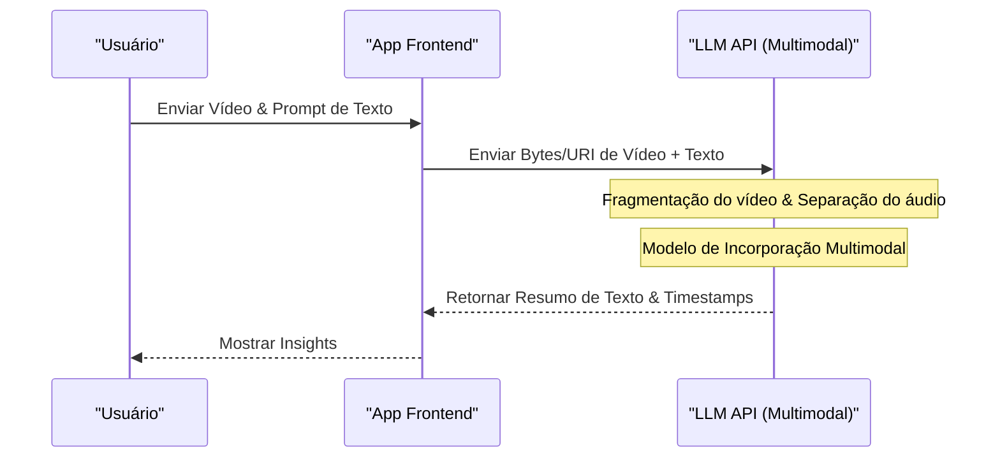

# ChatGPT・Gemini・Claude API: Comparação Completa e Qual Escolher?

A evolução da tecnologia de IA é notável, especialmente no campo dos Grandes Modelos de Linguagem (LLM: Large Language Model), onde o ChatGPT (série GPT) da OpenAI, o Gemini do Google e o Claude da Anthropic estão travando uma intensa batalha tripartida pela supremacia. A partir de 2026, cada empresa tem lançado novos modelos e funcionalidades de API em questão de meses, ou até mesmo semanas, e para desenvolvedores e arquitetos de TI corporativos, a questão de "qual API integrar ao produto" tornou-se uma decisão crítica que dita o sucesso de um projeto.

Neste artigo, não apenas listaremos as especificações, mas compararemos e explicaremos detalhadamente as APIs desses três grandes provedores de IA sob a perspectiva do desenvolvedor, cobrindo o design da arquitetura, estrutura detalhada de preços, análise matemática da latência (atraso), exemplos práticos de implementação em Python e Node.js, e até os mais recentes métodos de otimização de custos, como o cache de prompt.

Nosso objetivo é que este seja um guia completo para ajudar os leitores a selecionar a API de LLM ideal para seus casos de uso e construir aplicativos de IA escaláveis e econômicos.

---

## 1. Filosofia e Conceito de Design de Cada API de LLM

Na escolha de tecnologia, é muito importante primeiro entender qual é a filosofia que cada empresa utiliza para construir seus modelos e APIs.

### 1.1 OpenAI (ChatGPT)
A OpenAI tem como missão a "realização da Inteligência Artificial Geral (AGI)" e está sempre liderando o padrão de fato da indústria. Ela oferece uma ampla variedade de modelos adaptados aos casos de uso, como GPT-4o e GPT-4o-mini, além do modelo o1 especializado em raciocínio. Seu ecossistema é o mais maduro, com a documentação e bibliotecas mais ricas, sejam elas oficiais ou não oficiais.

### 1.2 Google (Gemini)
O Google defende a abordagem "AI First" e utiliza a escalabilidade de sua infraestrutura (rede TPU) ao máximo como sua principal arma. A maior característica do Gemini 1.5 Pro/Flash é sua enorme janela de contexto de até 2 milhões de tokens, permitindo que processe documentos extensos e horas de vídeo e áudio de uma só vez. Sua forte integração com o Google Cloud (Vertex AI) também é muito atraente para empresas.

### 1.3 Anthropic (Claude)
A Anthropic é uma empresa fundada por ex-membros da OpenAI e adota uma abordagem de segurança exclusiva chamada "Constitutional AI" (IA Constitucional). O Claude 3.5 Sonnet e o Opus conquistaram o apoio entusiástico de muitos desenvolvedores por suas altas capacidades de raciocínio, habilidades de geração de código e, acima de tudo, seus "diálogos naturais semelhantes aos humanos" e "baixa taxa de alucinação".

---

## 2. Comparação Detalhada de Especificações das Famílias de Modelos

Aqui está uma comparação das especificações dos principais modelos até 2026.

| Provedor | Modelo Principal | Contexto Máximo | Principais Pontos Fortes | Casos de Uso Recomendados |
|---|---|---|---|---|
| **OpenAI** | GPT-4o | 128K | Velocidade, reconhecimento visual, suporte a áudio | Aplicativos interativos, tarefas gerais |
| **OpenAI** | o1-preview | 128K | Raciocínio lógico avançado, matemática, codificação | Geração de algoritmos complexos, pesquisa |
| **Google** | Gemini 1.5 Pro | 2.000K | Processamento de textos ultralongos, multimodal (vídeo, áudio) | Análise de grandes bases de código, resumo de vídeos |
| **Google** | Gemini 1.5 Flash | 2.000K | Baixa latência, alta taxa de transferência, custo extremamente baixo | Processamento em tempo real, processamento em lote de dados em massa |
| **Anthropic** | Claude 3.5 Sonnet | 200K | Habilidades de codificação, geração de texto natural | Suporte ao desenvolvimento de software, suporte avançado ao cliente |
| **Anthropic** | Claude 3.5 Haiku | 200K | Resposta ultrarrápida, custo-benefício | Edge AI, chatbots em tempo real |

---

## 3. Aprofundamento na Arquitetura: Os Bastidores das Requisições de API

Quando uma API de LLM é chamada, que tipo de processamento ocorre no back-end? Para otimizar o desempenho, é necessário entender essa arquitetura.

O diagrama Mermaid abaixo mostra a visão geral desde o momento em que a requisição da API é enviada pelo cliente até o momento em que os tokens são retornados em fluxo contínuo (streaming).

```mermaid
graph TD
    A["Aplicação Cliente"] -->|HTTP/REST ou gRPC| B["Gateway de API"]
    B --> C["Balanceador de Carga"]
    C --> D["Cluster de Inferência"]
    D --> E["Tokenizador (BPE / SentencePiece)"]
    E --> F["Cache KV & Mecanismo de Atenção"]
    F --> G["Blocos Transformer (Passagem Direta)"]
    G --> H["Camada de Saída (Logits)"]
    H --> I["Amostrador (Temperature, Top-p, Top-k)"]
    I --> J["Destokenizador"]
    J -->|Resposta em Streaming (Chunk)| A
```

### 3.1 Algoritmo de Tokenização (Tokenization)
O texto de entrada na API é dividido internamente em unidades chamadas "tokens".
- **OpenAI (tiktoken)**: Adota o Byte-Pair Encoding (BPE). Ele é compactado com extrema eficiência, especialmente em inglês, mas o número de tokens tende a aumentar em idiomas não alfabéticos, como o japonês.
- **Google (Gemini)**: Adota o SentencePiece (Unigram Language Model). Ele lida bem com múltiplos idiomas e tende a conseguir representar textos em japonês com um número relativamente pequeno de tokens.
- **Anthropic (Claude)**: Usa uma versão customizada do BPE. O suporte multilíngue foi fortalecido e, a partir do Claude 3, a eficiência dos tokens em japonês também melhorou significativamente.

---

## 4. Análise Matemática de Latência e Desempenho

Em aplicações de tempo real, a latência está diretamente ligada à experiência do usuário (UX). A latência da API do LLM, $T_{total}$, pode ser matematicamente modelada da seguinte forma:

$$ T_{total} = T_{network} + T_{TTFT} + (N \times T_{TPOT}) $$

Aqui, cada variável tem o seguinte significado:
- $T_{network}$: Tempo de ida e volta da rede (RTT).
- $T_{TTFT}$ (Time To First Token): O tempo até que o primeiro caractere seja gerado. Ele depende fortemente do custo do cálculo da atenção, que é proporcional ao quadrado do comprimento do prompt (número de tokens de entrada).
- $N$: O número total de tokens gerados na saída.
- $T_{TPOT}$ (Time Per Output Token): Tempo de geração por token. Por se tratar de um modelo autorregressivo, o cálculo é feito em série dependendo da saída anterior.

### 4.1 Complexidade Computacional do Mecanismo de Autoatenção
A complexidade computacional da autoatenção (Self-Attention) na arquitetura Transformer aumenta de forma quadrática em relação ao comprimento da sequência de entrada $L$.

$$ \text{Complexity} = O(L^2 \cdot d) $$

Onde $d$ é o número de dimensões do vetor de incorporação (embedding). Devido a essa restrição, o $T_{TTFT}$ normalmente se degrada muito rapidamente à medida que o prompt se torna mais longo.
No entanto, o Gemini 1.5 do Google adota arquiteturas inovadoras de otimização como "Ring Attention" e "Block-wise Compute", conseguindo gerar o primeiro token em um tempo realista (de alguns segundos a dezenas de segundos), mesmo ao inserir textos longos de até 2 milhões de tokens.

---

## 5. Estrutura de Preços e Estratégias de Otimização de Custos

O custo das APIs é basicamente calculado com base no número de tokens de entrada e no número de tokens de saída.

$$ Cost = (Tokens_{in} \times Rate_{in}) + (Tokens_{out} \times Rate_{out}) $$

No entanto, as APIs mais recentes introduziram novos mecanismos para reduzir os custos drasticamente.

### 5.1 Cache de Prompt (Prompt Caching)
O envio de um prompt de sistema extremamente longo ou de uma grande quantidade de documentos pesquisados via RAG a cada vez custa muito dinheiro. Para lidar com isso, cada empresa oferece um recurso de cache.

Na Anthropic (Claude) e no Google (Gemini), ao fazer o cache de blocos específicos de texto, você pode reduzir significativamente (em até 90%) o custo de entrada.

O modelo de custo ao utilizar o cache seria o seguinte:

$$ Cost_{cached} = (Tokens_{cache\_write} \times Rate_{cache\_write}) + (Tokens_{cache\_read} \times Rate_{cache\_read}) + (Tokens_{out} \times Rate_{out}) $$

Aqui, $Rate_{cache\_read}$ é definido para algo em torno de 10% a 25% da $Rate_{in}$ normal. Isso possibilita a operação de chatbots a baixo custo, mantendo sempre em memória bases de código de dezenas de milhares de linhas como conhecimento contextual.

### 5.2 API em Lote (Batch API)
Para tarefas que não exigem resultados em tempo real (como análise de logs, classificação de grandes volumes de dados, etc.), a OpenAI e a Anthropic oferecem APIs em lote. Ao enviar requisições de forma agrupada e receber os resultados em até 24 horas, é possível obter um poderoso mecanismo pela metade do preço (50% de desconto) da tarifa regular da API.

---

## 6. Experiência do Desenvolvedor (DX) e Comparação de SDKs

Do ponto de vista da eficiência do desenvolvimento, comparamos os SDKs (Software Development Kits) fornecidos por cada empresa.

### 6.1 OpenAI API
É o mais amplamente utilizado e possui o suporte mais rápido para bibliotecas de terceiros (LangChain, LlamaIndex, etc.). Além disso, a funcionalidade de Structured Outputs (Saídas Estruturadas) garante o retorno de respostas que aderem com 100% de precisão aos esquemas JSON, tornando a integração de sistemas muito fácil.

### 6.2 Anthropic API (Claude)
As interfaces do seu SDK são muito bem trabalhadas, e sua definição de tipos em TypeScript tem a reputação de ser extremamente fácil de manusear. A estrutura da API de Mensagens, em particular, é muito intuitiva, tornando requisições multimodais com várias imagens simples de descrever.

### 6.3 Google Gemini API
Existem dois tipos de acesso: um via Google Cloud Vertex AI e outro via AI Studio (Google Gen AI SDK), o que pode ser um pouco confuso para iniciantes. No entanto, o Vertex AI SDK voltado para corporações é totalmente integrado com o IAM (Sistema de Autenticação e Autorização) do GCP, permitindo a construção de ambientes de desenvolvimento seguros.

---

## 7. Prática! Implementação de Teste de Integração Simultânea com Python

Aqui, usaremos o Python para implementar um script que envia solicitações assíncronas simultaneamente às três APIs (OpenAI, Anthropic e Gemini) e compara as latências.

```python
import asyncio
import time
import os
from openai import AsyncOpenAI
from anthropic import AsyncAnthropic
import google.generativeai as genai

# Inicialização dos clientes
openai_client = AsyncOpenAI(api_key=os.environ.get("OPENAI_API_KEY"))
anthropic_client = AsyncAnthropic(api_key=os.environ.get("ANTHROPIC_API_KEY"))
genai.configure(api_key=os.environ.get("GEMINI_API_KEY"))

prompt = "Por favor, explique aos iniciantes os fundamentos dos computadores quânticos e seu impacto nas tecnologias atuais de criptografia."

async def fetch_openai():
    start_time = time.time()
    response = await openai_client.chat.completions.create(
        model="gpt-4o",
        messages=[{"role": "user", "content": prompt}],
        max_tokens=1024
    )
    elapsed = time.time() - start_time
    return "OpenAI (GPT-4o)", elapsed, response.choices[0].message.content

async def fetch_anthropic():
    start_time = time.time()
    response = await anthropic_client.messages.create(
        model="claude-3-5-sonnet-20240620",
        messages=[{"role": "user", "content": prompt}],
        max_tokens=1024
    )
    elapsed = time.time() - start_time
    return "Anthropic (Claude 3.5 Sonnet)", elapsed, response.content[0].text

async def fetch_gemini():
    start_time = time.time()
    model = genai.GenerativeModel('gemini-1.5-pro')
    # Uso do método assíncrono do SDK Python do Gemini
    response = await model.generate_content_async(prompt)
    elapsed = time.time() - start_time
    return "Google (Gemini 1.5 Pro)", elapsed, response.text

async def main():
    print("Enviando requisições para as APIs de LLM...")
    
    # Executar as 3 APIs em paralelo
    results = await asyncio.gather(
        fetch_openai(),
        fetch_anthropic(),
        fetch_gemini()
    )
    
    for provider, latency, text in results:
        print(f"--- {provider} ---")
        print(f"Latency: {latency:.2f} segundos")
        print(f"Response (Excerpt): {text[:100]}...\n")

if __name__ == "__main__":
    asyncio.run(main())
```

Ao executar este script, você pode facilmente medir qual modelo responde mais rapidamente (minimizando $T_{total}$) em um ambiente de rede real.

---

## 8. Implementação de Tool Calling (Chamada de Função) em Node.js

Para que o LLM funcione não apenas como um chatbot, mas como um "Agente de IA" que interage com sistemas externos, o Tool Calling (ou Function Calling) é essencial. Abaixo está um exemplo em Node.js (TypeScript) instruindo a API da OpenAI a chamar uma API de clima.

```typescript
import OpenAI from "openai";

const openai = new OpenAI({
  apiKey: process.env.OPENAI_API_KEY,
});

async function runAgent() {
  const tools = [
    {
      type: "function",
      function: {
        name: "get_weather",
        description: "Obtém o clima atual da cidade especificada.",
        parameters: {
          type: "object",
          properties: {
            location: {
              type: "string",
              description: "Nome da cidade (ex: Tóquio, Nova York)",
            },
          },
          required: ["location"],
        },
      },
    },
  ];

  const response = await openai.chat.completions.create({
    model: "gpt-4o",
    messages: [{ role: "user", "content": "Como está o clima hoje em Tóquio? Preciso de um guarda-chuva?" }],
    tools: tools,
    tool_choice: "auto",
  });

  const message = response.choices[0].message;

  if (message.tool_calls) {
    const toolCall = message.tool_calls[0];
    console.log(`O LLM solicitou a chamada de uma ferramenta: Nome da função = ${toolCall.function.name}`);
    
    const args = JSON.parse(toolCall.function.arguments);
    console.log(`Argumentos: ${args.location}`);
    
    // Aqui seria implementada a chamada real da API de clima (ex: OpenWeatherMap)
    // const weather = await fetchWeatherFromAPI(args.location);
    
    // Depois, o resultado é passado de volta ao LLM para gerar a resposta final
  }
}

runAgent().catch(console.error);
```

O Claude 3.5 Sonnet e o Gemini 1.5 Pro possuem capacidades equivalentes de Tool Calling, e embora existam pequenas diferenças na definição do esquema, o fluxo básico é comum a todos.

---

## 9. RAG vs Janela de Contexto Longa: Qual Adotar?

Um dos maiores debates atuais em arquiteturas de IA empresariais é se devemos "usar o RAG (Geração Aumentada por Recuperação) para trazer conhecimento externo, ou se devemos simplesmente jogar tudo em uma enorme janela de contexto (Contexto Longo)".

### Vantagens e Desafios do RAG (Retrieval-Augmented Generation)
- **Vantagens**: Baixo custo (já que apenas os chunks necessários são colocados no prompt), e é mais fácil identificar a fundamentação (fonte) da resposta.
- **Desafios**: Uma vez que depende da precisão da busca semântica, ele não é adequado para tarefas de raciocínio complexo onde o contexto se espalha por vários documentos (ex: "A partir das atas de todas as reuniões do ano passado, analise cronologicamente a causa raiz dos atrasos no Projeto A").

### Contexto Longo (ex: 2 milhões de tokens do Gemini 1.5 Pro)
- **Vantagens**: Nenhuma informação é perdida por conta da pesquisa. Mesmo no teste de "Achar a agulha num palheiro (Needle In A Haystack: NIAH)", o Gemini 1.5 Pro e o Claude 3.5 Sonnet podem extrair informações com mais de 99% de precisão.
- **Desafios**: O consumo de tokens torna-se enorme e eleva os custos, e há um aumento na latência ($T_{TTFT}$).

**Conclusão**: A melhor prática em 2026 é uma **"Abordagem Híbrida"**. A tendência principal de design é usar o RAG com bancos de dados vetoriais para Q&A rotineiros e usar um Contexto Longo em combinação com o cache de prompt para tarefas especializadas que exigem análises complexas ou a revisão de todo o código.

---

## 10. Comparação de Capacidades de Processamento Multimodal

Em aplicativos de IA de próxima geração, a capacidade de entender diretamente imagens, áudio e vídeo em vez de apenas texto é cada vez mais necessária.



- **OpenAI (GPT-4o)**: Precisão de reconhecimento de imagem extremamente alta, superando na leitura de desenhos manuscritos e gráficos complexos. A interação por voz nativa usando a Realtime API com latência ultrabaixa (centenas de milissegundos) também é poderosa.
- **Google (Gemini 1.5 Pro)**: **Apresenta superioridade esmagadora na análise de vídeos.** É capaz de processar 1 hora de vídeo (quadros + áudio) de uma só vez e responder a perguntas pontuais como "Qual o título do documento segurado pela pessoa no canto direito da tela aos 12 minutos e 45 segundos?".
- **Anthropic (Claude 3.5 Sonnet)**: A capacidade de reconhecimento visual (Vision) está no mesmo nível do GPT-4o e é altamente capaz. Ele é incomparável em suporte ao desenvolvimento de frontend, lidando com pedidos como "Gere o código de componentes React a partir desta captura de tela da UI".

---

## 11. Segurança e Conformidade de Nível Empresarial

A maior preocupação quando empresas usam APIs de LLM em ambientes de produção é "nossos dados serão usados para treinar a IA?" e "isso atende aos requisitos de conformidade?".

As 3 empresas declararam explicitamente que os dados enviados através de suas APIs (prompts e respostas) **não são usados para treinar os modelos (Zero Data Retention / No Training on Customer Data)** (※ A interface de chat da Web gratuita para consumidores é diferente).

Se for exigido um nível mais elevado de segurança:
- **OpenAI**: Usando o Azure OpenAI Service, pode-se obter a segurança de nível empresarial da Microsoft, SLAs e conexão privada via Azure Private Link.
- **Google**: Usando o Google Cloud Vertex AI, é possível contar com o isolamento rígido de rede pelo VPC Service Controls e a proteção de dados através do CMEK (Chaves de Criptografia Gerenciadas pelo Cliente).
- **Anthropic**: Ao utilizar as plataformas AWS Bedrock ou Google Cloud Vertex AI, as empresas podem se beneficiar da infraestrutura de segurança robusta desses provedores em nuvem.

---

## 12. Conclusão: Guia de Escolha Definitivo por Caso de Uso

Comparamos extensamente sob vários ângulos, mas, no final, a resposta para "Qual devo escolher?" depende do caso de uso.

1. **Desenvolvimento de Software Complexo, Geração de Código, Raciocínio Avançado**:
   **👑 Vencedor: Claude 3.5 Sonnet (Anthropic)**
   Atualmente oferece a melhor performance em entender o contexto de códigos, refatoração e elaboração de textos mais humanos e naturais. A facilidade de uso da API e o custo-benefício por causa do cache de prompt também são notáveis.

2. **Análise de Documentos Ultralongos, Processamento em Lote de Vídeo/Áudio**:
   **👑 Vencedor: Gemini 1.5 Pro (Google)**
   A janela de contexto de 2 milhões de tokens é uma arma incomparável. Para tarefas que precisam compreender a visão geral dos dados, como a análise de manuais em PDF de centenas de páginas e o resumo de gravações de reuniões longas, o Gemini é imbatível.

3. **Versatilidade, Velocidade de Execução, Saídas Estruturadas Estáveis (JSON)**:
   **👑 Vencedor: GPT-4o / GPT-4o-mini (OpenAI)**
   Lida bem com qualquer tarefa perfeitamente e oferece o suporte mais rico para ferramentas de terceiros. Se a sua empresa necessita de parsing de JSON confiável por meio das Structured Outputs (Saídas Estruturadas) ou raciocínio lógico muito avançado usando o modelo o1, o ecossistema da OpenAI é indispensável.

### Recomendação de Roteamento Multimodelo
A tendência futura de arquitetura é não depender (e sofrer vendor lock-in) de uma única API, mas adotar o **"Roteamento de LLM" (LLM Routing)** para alternar de forma dinâmica o modelo dependendo da dificuldade e importância da tarefa.
Por exemplo, responder perguntas simples dos usuários usando as opções mais baratas e rápidas, como o `GPT-4o-mini` ou o `Gemini 1.5 Flash`, e recorrer ao `Claude 3.5 Sonnet` apenas quando for determinado que um processamento complexo é necessário, para se obter o equilíbrio perfeito entre custo e desempenho.

A evolução da IA é incessante. Entenda profundamente as forças e fraquezas de cada API e as características de sua arquitetura, e construa aplicações de IA flexíveis e escaláveis.
