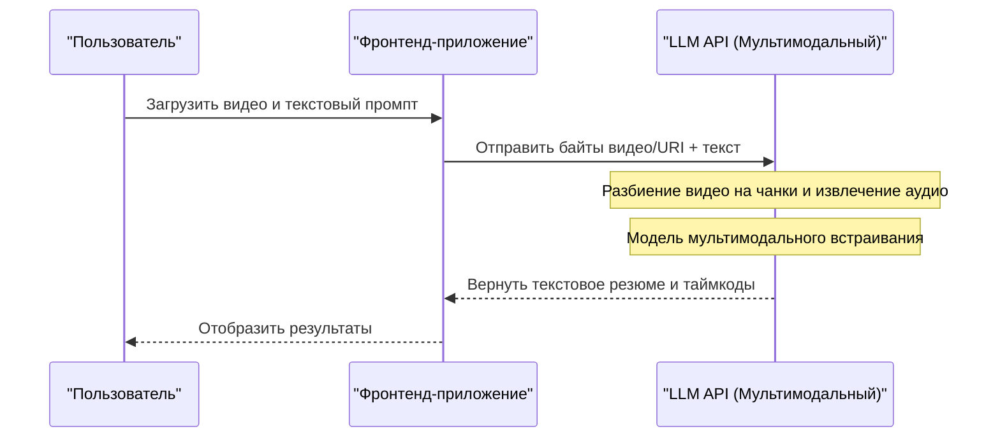

# Подробное сравнение API ChatGPT, Gemini и Claude! Что выбрать?

Развитие технологий ИИ поражает, особенно в области больших языковых моделей (LLM: Large Language Model), где ChatGPT (серия GPT) от OpenAI, Gemini от Google и Claude от Anthropic ведут ожесточенную борьбу за лидерство. По состоянию на 2026 год, каждая компания выпускает новые модели и функции API раз в несколько месяцев, а то и недель. Для разработчиков и ИТ-архитекторов вопрос «Какой API интегрировать в продукт?» стал важнейшим решением, определяющим успех проекта.

В этой статье мы подробно сравним и разберем API этих трех ведущих провайдеров ИИ с точки зрения разработчика. Мы не просто перечислим их характеристики, но и углубимся в архитектуру, подробную структуру тарифов, математический анализ задержки (latency), конкретные примеры реализации на Python и Node.js, а также в новейшие методы оптимизации затрат, такие как кэширование промптов.

Мы надеемся, что это руководство поможет вам выбрать идеальный API LLM для вашего юзкейса и создать масштабируемое, экономически эффективное ИИ-приложение.

---

## 1. Философия и принципы проектирования каждого LLM API

При выборе технологии очень важно понимать философию, лежащую в основе разработки моделей и API каждой компании.

### 1.1 OpenAI (ChatGPT)
Миссия OpenAI — «создание универсального искусственного интеллекта (AGI)», и компания постоянно задает стандарты в отрасли. Они предлагают разнообразные модели для разных задач, включая GPT-4o, GPT-4o-mini, а также модели серии o1, специализирующиеся на логических рассуждениях. Экосистема OpenAI является самой зрелой, с огромным количеством официальных и неофициальных библиотек и документации.

### 1.2 Google (Gemini)
Google придерживается стратегии «AI First» (ИИ в первую очередь) и делает ставку на масштабируемость, максимально используя собственную инфраструктуру (сети TPU). Главная особенность Gemini 1.5 Pro/Flash — огромное контекстное окно до 2 миллионов токенов, что позволяет за один раз обрабатывать длинные документы и многочасовые видео или аудио. Тесная интеграция с Google Cloud (Vertex AI) также делает этот вариант привлекательным для корпоративного сектора.

### 1.3 Anthropic (Claude)
Anthropic, основанная бывшими сотрудниками OpenAI, использует уникальный подход к безопасности под названием «Конституционный ИИ (Constitutional AI)». Модели Claude 3.5 Sonnet и Opus завоевали огромную популярность среди разработчиков благодаря своим высоким способностям к рассуждению, генерации кода, а главное — благодаря «естественному диалогу, похожему на человеческий» и «низкому уровню галлюцинаций».

---

## 2. Подробное сравнение характеристик семейств моделей

Сравним характеристики основных моделей по состоянию на 2026 год.

| Провайдер | Основная модель | Максимальный контекст | Главные преимущества | Рекомендуемые юзкейсы |
|---|---|---|---|---|
| **OpenAI** | GPT-4o | 128K | Скорость, распознавание изображений, голосовой интерфейс | Интерактивные приложения, задачи общего назначения |
| **OpenAI** | o1-preview | 128K | Продвинутая логика, математика, кодинг | Генерация сложных алгоритмов, исследовательские задачи |
| **Google** | Gemini 1.5 Pro | 2,000K | Обработка сверхдлинных текстов, мультимодальность (видео/аудио) | Анализ огромных кодовых баз, суммаризация видео |
| **Google** | Gemini 1.5 Flash | 2,000K | Низкая задержка, высокая пропускная способность, низкая стоимость | Обработка в реальном времени, пакетная обработка больших объемов данных |
| **Anthropic** | Claude 3.5 Sonnet | 200K | Написание кода, генерация естественного текста | Помощь в разработке ПО, продвинутая поддержка клиентов |
| **Anthropic** | Claude 3.5 Haiku | 200K | Сверхбыстрые ответы, экономичность | Периферийный ИИ (Edge AI), чат-боты в реальном времени |

---

## 3. Глубокое погружение в архитектуру: что происходит за API-запросом

Какие процессы происходят на бэкенде при вызове LLM API? Чтобы оптимизировать производительность, необходимо понимать эту архитектуру.

Следующая диаграмма Mermaid показывает весь путь — от отправки API-запроса клиентом до возврата токенов в виде потока (streaming).

```mermaid
graph TD
    A["Клиентское приложение"] -->|HTTP/REST или gRPC| B["API-шлюз"]
    B --> C["Балансировщик нагрузки"]
    C --> D["Кластер вывода (Inference Cluster)"]
    D --> E["Токенизатор (BPE / SentencePiece)"]
    E --> F["KV Кэш и механизм внимания (Attention Mechanism)"]
    F --> G["Блоки Transformer (Прямой проход)"]
    G --> H["Выходной слой (Логиты)"]
    H --> I["Сэмплер (Температура, Top-p, Top-k)"]
    I --> J["Детокенизатор"]
    J -->|Потоковый ответ (Чанки)| A
```

### 3.1 Алгоритмы токенизации (Tokenization)
Текст, передаваемый в API, внутренне разбивается на единицы, называемые «токенами».
- **OpenAI (tiktoken)**: Использует Byte-Pair Encoding (BPE). Очень эффективно сжимает текст на английском языке, но для языков, не использующих латиницу (например, японского или русского), количество токенов может значительно возрастать.
- **Google (Gemini)**: Использует SentencePiece (Unigram Language Model). Отлично работает с разными языками, обычно требуя меньше токенов для текстов на отличных от английского языках.
- **Anthropic (Claude)**: Использует кастомную версию BPE. Улучшена мультиязычная поддержка, а начиная с версии Claude 3, эффективность токенизации для японского и других языков была существенно повышена.

---

## 4. Математический анализ задержки (Latency) и производительности

В приложениях реального времени задержка напрямую влияет на пользовательский опыт (UX). Задержку LLM API $T_{total}$ можно математически смоделировать следующим образом:

$$ T_{total} = T_{network} + T_{TTFT} + (N \times T_{TPOT}) $$

Где каждая переменная означает:
- $T_{network}$: Время пути туда и обратно по сети (RTT).
- $T_{TTFT}$ (Time To First Token): Время до генерации первого символа. Сильно зависит от затрат на расчет механизма внимания (Attention), который пропорционален квадрату длины промпта (количества входных токенов).
- $N$: Общее количество сгенерированных токенов.
- $T_{TPOT}$ (Time Per Output Token): Время генерации одного токена. Поскольку модели авторегрессионные, каждый следующий токен вычисляется последовательно на основе предыдущего вывода.

### 4.1 Сложность вычисления механизма внутреннего внимания (Self-Attention)
Вычислительная сложность внутреннего внимания (Self-Attention) в архитектуре Transformer возрастает квадратично относительно длины входной последовательности $L$.

$$ \text{Complexity} = O(L^2 \cdot d) $$

Где $d$ — размерность вектора встраивания (embedding). Из-за этого ограничения при увеличении промпта $T_{TTFT}$ обычно резко ухудшается.
Однако в модели Gemini 1.5 от Google используются инновационные архитектурные оптимизации, такие как «Ring Attention» и «Block-wise Compute», что позволяет генерировать первый токен за разумное время (от нескольких секунд до нескольких десятков секунд) даже при подаче текста длиной в 2 миллиона токенов.

---

## 5. Структура тарифов и стратегии оптимизации затрат

Стоимость API в основном рассчитывается на основе количества входных и выходных токенов.

$$ Cost = (Tokens_{in} \times Rate_{in}) + (Tokens_{out} \times Rate_{out}) $$

Но в новейших API появились новые механизмы, позволяющие радикально снизить затраты.

### 5.1 Кэширование промптов (Prompt Caching)
Постоянная отправка длинных системных промптов или огромных объемов документов, извлеченных через RAG, каждый раз обходится очень дорого. Чтобы решить эту проблему, компании предлагают функции кэширования.

Anthropic (Claude) и Google (Gemini) позволяют кэшировать определенные блоки текста, снижая затраты на ввод (до 90%).

Модель затрат при использовании кэша выглядит так:

$$ Cost_{cached} = (Tokens_{cache\_write} \times Rate_{cache\_write}) + (Tokens_{cache\_read} \times Rate_{cache\_read}) + (Tokens_{out} \times Rate_{out}) $$

Где $Rate_{cache\_read}$ обычно составляет около 10-25% от стандартного $Rate_{in}$. Это позволяет дешево поддерживать работу чат-ботов, постоянно храня в фоне знания в виде десятков тысяч строк кодовой базы.

### 5.2 Пакетное API (Batch API)
Для задач, не требующих обработки в реальном времени (анализ логов, массовая классификация данных и т. д.), OpenAI и Anthropic предлагают Batch API. Это мощный механизм, позволяющий отправлять запросы группами и получать результаты в течение 24 часов со скидкой 50% (в два раза дешевле) от стандартной цены API.

---

## 6. Сравнение опыта разработчика (DX) и SDK

Сравним предлагаемые компаниями SDK (Software Development Kit) с точки зрения эффективности разработки.

### 6.1 OpenAI API
Используется шире всего, имеет самую быструю поддержку в сторонних библиотеках (LangChain, LlamaIndex и т.д.). Кроме того, функция Structured Outputs (Структурированный вывод) гарантирует 100% точность ответа в соответствии с заданной JSON-схемой, что делает системную интеграцию чрезвычайно простой.

### 6.2 Anthropic API (Claude)
Интерфейс SDK выглядит очень элегантно, и, по отзывам, работать с типами в TypeScript очень удобно. Структура Message API интуитивно понятна, что позволяет легко создавать мультимодальные запросы, включающие несколько изображений.

### 6.3 Google Gemini API
Существуют два типа доступа: через Google Cloud Vertex AI и через AI Studio (Google Gen AI SDK), что может немного запутать новичков. Тем не менее, Vertex AI SDK, предназначенный для энтерпрайз-клиентов, полностью интегрирован с системой аутентификации GCP (IAM), что позволяет создать безопасную среду разработки.

---

## 7. Практика! Интеграционное тестирование нескольких API на Python

В этом разделе мы используем Python для написания скрипта, который одновременно отправляет асинхронные запросы к трем API: OpenAI, Anthropic и Gemini, а затем сравнивает их задержки.

```python
import asyncio
import time
import os
from openai import AsyncOpenAI
from anthropic import AsyncAnthropic
import google.generativeai as genai

# Инициализация клиентов
openai_client = AsyncOpenAI(api_key=os.environ.get("OPENAI_API_KEY"))
anthropic_client = AsyncAnthropic(api_key=os.environ.get("ANTHROPIC_API_KEY"))
genai.configure(api_key=os.environ.get("GEMINI_API_KEY"))

prompt = "Объясните основы квантовых вычислений и их влияние на современную криптографию простым языком для начинающих."

async def fetch_openai():
    start_time = time.time()
    response = await openai_client.chat.completions.create(
        model="gpt-4o",
        messages=[{"role": "user", "content": prompt}],
        max_tokens=1024
    )
    elapsed = time.time() - start_time
    return "OpenAI (GPT-4o)", elapsed, response.choices[0].message.content

async def fetch_anthropic():
    start_time = time.time()
    response = await anthropic_client.messages.create(
        model="claude-3-5-sonnet-20240620",
        messages=[{"role": "user", "content": prompt}],
        max_tokens=1024
    )
    elapsed = time.time() - start_time
    return "Anthropic (Claude 3.5 Sonnet)", elapsed, response.content[0].text

async def fetch_gemini():
    start_time = time.time()
    model = genai.GenerativeModel('gemini-1.5-pro')
    # Использование асинхронного метода из Gemini Python SDK
    response = await model.generate_content_async(prompt)
    elapsed = time.time() - start_time
    return "Google (Gemini 1.5 Pro)", elapsed, response.text

async def main():
    print("Отправка запросов к LLM API...")
    
    # Выполнение 3-х API параллельно
    results = await asyncio.gather(
        fetch_openai(),
        fetch_anthropic(),
        fetch_gemini()
    )
    
    for provider, latency, text in results:
        print(f"--- {provider} ---")
        print(f"Задержка: {latency:.2f} секунд")
        print(f"Ответ (фрагмент): {text[:100]}...\n")

if __name__ == "__main__":
    asyncio.run(main())
```

Запустив этот скрипт, вы сможете легко измерить, какая из моделей отвечает быстрее всего (минимизируя $T_{total}$) в реальных сетевых условиях.

---

## 8. Реализация вызова инструментов (Tool Calling / Function Calling) на Node.js

Чтобы заставить LLM работать не просто как чат-бот, а как «ИИ-агент», взаимодействующий с внешними системами, необходим функционал Tool Calling (или Function Calling). Ниже приведен пример на Node.js (TypeScript), в котором API OpenAI просят вызвать API погоды.

```typescript
import OpenAI from "openai";

const openai = new OpenAI({
  apiKey: process.env.OPENAI_API_KEY,
});

async function runAgent() {
  const tools = [
    {
      type: "function",
      function: {
        name: "get_weather",
        description: "Получает текущую погоду для указанного города.",
        parameters: {
          type: "object",
          properties: {
            location: {
              type: "string",
              description: "Название города (например: Токио, Нью-Йорк)",
            },
          },
          required: ["location"],
        },
      },
    },
  ];

  const response = await openai.chat.completions.create({
    model: "gpt-4o",
    messages: [{ role: "user", "content": "Какая сегодня погода в Токио? Нужен ли зонт?" }],
    tools: tools,
    tool_choice: "auto",
  });

  const message = response.choices[0].message;

  if (message.tool_calls) {
    const toolCall = message.tool_calls[0];
    console.log(`LLM запросила вызов инструмента: имя функции = ${toolCall.function.name}`);
    
    const args = JSON.parse(toolCall.function.arguments);
    console.log(`Аргументы: ${args.location}`);
    
    // Здесь реализуется вызов реального API погоды (например, OpenWeatherMap)
    // const weather = await fetchWeatherFromAPI(args.location);
    
    // Полученный результат снова передается LLM для формирования окончательного ответа
  }
}

runAgent().catch(console.error);
```

Claude 3.5 Sonnet и Gemini 1.5 Pro также имеют аналогичные функции Tool Calling, и хотя способы определения схем немного отличаются, базовый рабочий процесс остается тем же.

---

## 9. RAG против Long Context Window: что использовать?

Одна из крупнейших дискуссий в архитектуре корпоративного ИИ сегодня — «Стоит ли использовать RAG (поисковую генерацию) для интеграции внешних знаний, или же лучше просто закидывать все в огромное контекстное окно (Long Context)?».

### Преимущества и недостатки RAG (Retrieval-Augmented Generation)
- **Преимущества**: Низкая стоимость (в промпт включаются только нужные чанки), легко определить источники ответов.
- **Недостатки**: Зависит от точности семантического поиска. Не подходит для продвинутых задач, где контекст разбросан по нескольким документам (например: «Опираясь на все протоколы совещаний за прошлый год, проанализируйте в хронологическом порядке основную причину задержки проекта А»).

### Long Context (например, 2 миллиона токенов в Gemini 1.5 Pro)
- **Преимущества**: Нет упущений информации из-за поиска. Даже в тесте «Поиск иголки в стоге сена» (Needle In A Haystack: NIAH) Gemini 1.5 Pro и Claude 3.5 Sonnet извлекают нужную информацию с точностью более 99%.
- **Недостатки**: Огромный расход токенов ведет к большим затратам, возрастает задержка ($T_{TTFT}$).

**Вывод**: Лучшей практикой в 2026 году является **«Гибридный подход»**. Для рутинных Q&A используется RAG с векторными базами данных, а для сложных аналитических задач или обзора всего кода применяются механизмы Long Context с кэшированием промптов.

---

## 10. Сравнение возможностей мультимодальной обработки

ИИ-приложения следующего поколения должны уметь напрямую понимать не только текст, но и изображения, звук и видео.



- **OpenAI (GPT-4o)**: Исключительно высокая точность распознавания изображений, отлично справляется с чтением рукописных чертежей и сложных графиков. Также выделяется сверхнизкой задержкой (сотни миллисекунд) для нативного голосового общения через Realtime API.
- **Google (Gemini 1.5 Pro)**: **Безоговорочный лидер в анализе видео.** Позволяет напрямую загружать часовой видеофайл (кадры + звук) и получать ответы на такие узконаправленные вопросы, как: «Как называется документ в руках человека, появившегося в правой части экрана на 12-й минуте 45-й секунде?».
- **Anthropic (Claude 3.5 Sonnet)**: Способности к распознаванию изображений (Vision) находятся на том же впечатляющем уровне, что и у GPT-4o. Демонстрирует непревзойденную силу в помощи фронтенд-разработчикам: можно просто дать скриншот интерфейса со словами «Сгенерируй код React-компонента для этого экрана».

---

## 11. Безопасность и комплаенс корпоративного уровня

Когда компании используют LLM API в производственной среде, они больше всего беспокоятся о том, «Не будут ли наши данные использоваться для обучения ИИ?» и «Соответствует ли это требованиям комплаенса?».

Все три компании четко заявляют, что данные (промпты и ответы), передаваемые через их API, **не используются для обучения моделей (Zero Data Retention / No Training on Customer Data)**. (※ Это не относится к бесплатным веб-версиям чат-ботов для обычных пользователей).

Если требуются более высокие уровни безопасности:
- **OpenAI**: При использовании Azure OpenAI Service вы получаете доступ к системе безопасности корпоративного уровня от Microsoft, SLA и возможности подключения к закрытой сети с помощью Azure Private Link.
- **Google**: При доступе через Google Cloud Vertex AI можно обеспечить строгую сетевую изоляцию с помощью VPC Service Controls и защиту данных клиентскими ключами шифрования (CMEK).
- **Anthropic**: Доступ через AWS Bedrock или Google Cloud Vertex AI позволяет опираться на надежную базовую инфраструктуру безопасности облачных провайдеров.

---

## 12. Заключение: идеальное руководство по выбору для каждого юзкейса

Мы рассмотрели вопрос с разных сторон, но итоговый ответ на вопрос «Что же выбрать?» зависит от вашего юзкейса.

1. **Сложная разработка ПО, генерация кода и продвинутые рассуждения**:
   **👑 Победитель: Claude 3.5 Sonnet (Anthropic)**
   На данный момент обеспечивает лучшую производительность в понимании контекста кода, рефакторинге и написании естественного человеческого текста. Также обладает удобным API и высокой экономической эффективностью благодаря кэшированию промптов.

2. **Анализ сверхдлинных документов и массовая обработка видео/аудио**:
   **👑 Победитель: Gemini 1.5 Pro (Google)**
   Контекстное окно в 2 миллиона токенов — это его уникальное преимущество. Если вам необходимо охватить картину целиком, например, проанализировать сотни страниц PDF-руководств или резюмировать многочасовые видеозаписи встреч, Gemini просто нет равных.

3. **Универсальность, скорость выполнения и стабильный структурированный вывод (JSON)**:
   **👑 Победитель: GPT-4o / GPT-4o-mini (OpenAI)**
   Отлично справляется с любыми задачами и обладает наиболее широкой поддержкой сторонних инструментов. Если требуется надежный парсинг JSON с помощью Structured Outputs или сверхсложная логика с использованием модели o1, экосистема OpenAI является незаменимой.

### Рекомендация: мультимодельная маршрутизация
Вместо того чтобы полагаться на один API (vendor lock-in), будущим трендом становится архитектура **«LLM-маршрутизации (LLM Routing)»**, при которой модель динамически переключается в зависимости от сложности и важности задачи.
Например, на простые вопросы пользователей можно отвечать с помощью недорогих и быстрых `GPT-4o-mini` или `Gemini 1.5 Flash`, а ресурсоемкие задачи поручать `Claude 3.5 Sonnet`. Это обеспечивает идеальный баланс между затратами и производительностью.

Эволюция ИИ не останавливается. Глубоко понимая сильные и слабые стороны каждого API, а также характеристики их архитектур, вы сможете создавать гибкие и масштабируемые ИИ-приложения.
