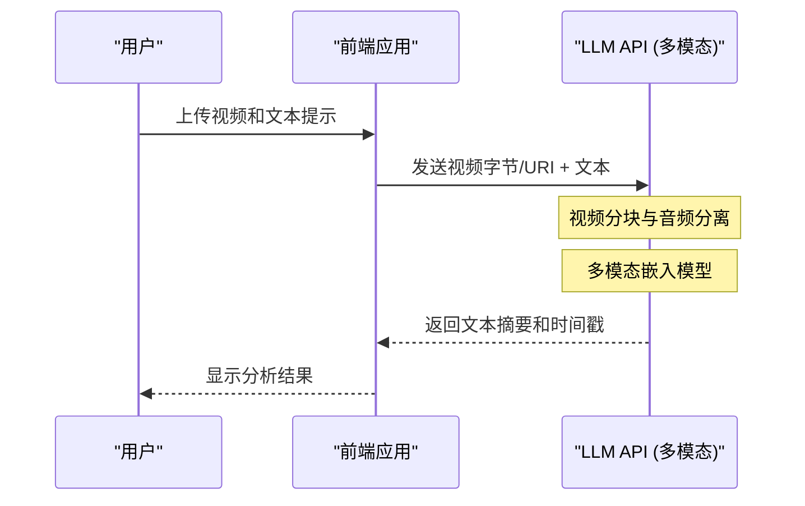

# ChatGPT・Gemini・Claude的API深度对比！应该选择哪一个？

AI技术的演进令人瞩目，尤其是在大型语言模型（LLM: Large Language Model）领域，OpenAI的ChatGPT（GPT系列）、Google的Gemini和Anthropic的Claude正在展开激烈的三足鼎立的霸权争夺。截至2026年，各家公司以几个月甚至几周为单位发布新模型和API功能，对于开发者和企业IT架构师来说，“应该将哪个API集成到产品中”这一问题，已成为左右项目成功与否的极其重要的决策。

本文将从开发者的视角，对这三大AI提供商的API进行深度对比和解读。内容不仅限于简单的规格罗列，还将涵盖架构设计、详细的计费结构、延迟（Latency）的数学分析、使用Python和Node.js的具体实现示例，以及提示词缓存（Prompt Caching）等最新的成本优化方法。

旨在为读者提供一份完整的指南，帮助您为自己的用例选择最合适的LLM API，并构建可扩展且成本高效的AI应用程序。

---

## 1. 各LLM API的哲学与设计理念

在进行技术选型时，首先了解各家公司是基于何种理念来构建模型和API的，这一点非常重要。

### 1.1 OpenAI (ChatGPT)
OpenAI以“实现通用人工智能（AGI）”为使命，始终引领着行业的通用标准。它提供了适应不同用例的多样化模型，如GPT-4o、GPT-4o-mini，以及擅长推理的o1模型等。其生态系统最为成熟，无论官方还是非官方的库和文档都最为丰富。

### 1.2 Google (Gemini)
Google秉承“AI First”的理念，以最大限度利用其自有基础设施（TPU网络）的可扩展性为武器。Gemini 1.5 Pro/Flash的最大特点是拥有高达200万Token的压倒性上下文窗口（Context Window），能够一次性处理超长文档或数小时的音视频。此外，它与Google Cloud (Vertex AI) 的深度集成对企业级用户也极具吸引力。

### 1.3 Anthropic (Claude)
Anthropic是由前OpenAI成员创立的企业，采用了独特的“Constitutional AI（合宪AI）”安全机制。Claude 3.5 Sonnet和Opus凭借其强大的推理能力、代码生成能力，尤其是“像人类一样自然的对话”和“极少的幻觉（Hallucination）”，获得了众多开发者的狂热支持。

---

## 2. 模型家族的规格深度对比

以下是截至2026年主力模型的规格对比。

| 提供商 | 主力模型 | 最大上下文长度 | 主要优势 | 推荐用例 |
|---|---|---|---|---|
| **OpenAI** | GPT-4o | 128K | 速度、视觉识别、语音支持 | 交互式应用、通用任务 |
| **OpenAI** | o1-preview | 128K | 高级逻辑推理、数学、编程 | 复杂算法生成、研究用途 |
| **Google** | Gemini 1.5 Pro | 2,000K | 超长文本处理、多模态（视频・音频） | 庞大代码库分析、视频摘要 |
| **Google** | Gemini 1.5 Flash | 2,000K | 低延迟、高吞吐量、绝对的低成本 | 实时处理、海量数据批量处理 |
| **Anthropic** | Claude 3.5 Sonnet | 200K | 编程能力、自然的文本生成 | 软件开发辅助、高级客户支持 |
| **Anthropic** | Claude 3.5 Haiku | 200K | 超极速响应、高性价比 | 边缘AI、实时聊天机器人 |

---

## 3. 架构深度剖析：API请求的幕后

调用LLM的API时，后端究竟在进行怎样的处理？为了优化性能，我们必须了解这一架构。

以下的Mermaid图表展示了从客户端发送API请求到以流式（Streaming）返回Token的全过程。

```mermaid
graph TD
    A["客户端应用程序"] -->|HTTP/REST 或 gRPC| B["API网关"]
    B --> C["负载均衡器"]
    C --> D["推理集群"]
    D --> E["分词器 (BPE / SentencePiece)"]
    E --> F["KV缓存与注意力机制"]
    F --> G["Transformer块 (前向传播)"]
    G --> H["输出层 (Logits)"]
    H --> I["采样器 (Temperature, Top-p, Top-k)"]
    I --> J["反分词器"]
    J -->|流式响应 (Chunk)| A
```

### 3.1 Tokenization（分词）的算法
输入到API的文本，在内部会被分割为名为“Token”的单位。
- **OpenAI (tiktoken)**: 采用 Byte-Pair Encoding (BPE)。特别是在英语方面压缩效率极高，但在日语等非字母语言中，Token数量往往会膨胀。
- **Google (Gemini)**: 采用 SentencePiece（Unigram Language Model）。在多语言处理上具有优势，即使是日语文本也能以相对较少的Token数量来表达。
- **Anthropic (Claude)**: 使用定制版的BPE。强化了多语言支持，Claude 3以后，日语的Token效率也得到了大幅提升。

---

## 4. 延迟与性能的数学分析

在实时应用程序中，延迟（Latency）直接影响用户体验（UX）。LLM API的延迟 $T_{total}$ 在数学上可以建立如下模型：

$$ T_{total} = T_{network} + T_{TTFT} + (N \times T_{TPOT}) $$

这里，各变量的含义如下：
- $T_{network}$: 网络的往返时间（RTT）。
- $T_{TTFT}$ (Time To First Token): 生成第一个字符所需的时间。它很大程度上取决于注意力计算的成本，该成本与提示词长度（输入Token数）的平方成正比。
- $N$: 输出的Token总数。
- $T_{TPOT}$ (Time Per Output Token): 每个Token的生成时间。因为是自回归（Autoregressive）模型，所以需要依赖之前的输出进行串行计算。

### 4.1 自注意力机制的计算复杂度
Transformer架构中的自注意力（Self-Attention）计算复杂度，相对于输入序列长度 $L$ 呈二次函数增长。

$$ \text{Complexity} = O(L^2 \cdot d) $$

这里的 $d$ 是嵌入向量的维度数。由于这一限制，通常当提示词变长时，$T_{TTFT}$ 会急剧恶化。
然而，Google的Gemini 1.5采用了“Ring Attention”和“Block-wise Compute”等创新性的优化架构，即使输入200万Token的长文，也能成功在现实的时间内（几秒到几十秒）生成第一个Token。

---

## 5. 计费体系与成本优化策略

API的成本基本上是基于输入Token数和输出Token数来计算的。

$$ Cost = (Tokens_{in} \times Rate_{in}) + (Tokens_{out} \times Rate_{out}) $$

但是，最新的API引入了大幅降低成本的新机制。

### 5.1 提示词缓存 (Prompt Caching)
如果每次都发送超长的系统提示词或通过RAG检索到的大量文档，将会产生巨大的成本。为了解决这个问题，各家都提供了缓存功能。

在Anthropic (Claude) 和 Google (Gemini) 中，通过缓存特定的文本块，可以大幅削减（最高达90%）输入成本。

使用缓存时的成本模型如下：

$$ Cost_{cached} = (Tokens_{cache\_write} \times Rate_{cache\_write}) + (Tokens_{cache\_read} \times Rate_{cache\_read}) + (Tokens_{out} \times Rate_{out}) $$

这里的 $Rate_{cache\_read}$ 通常被设定为常规 $Rate_{in}$ 的10%〜25%左右。借此，我们可以将数万行的代码库始终作为背景知识保留，并以低廉的价格运营聊天机器人。

### 5.2 批处理API (Batch API)
对于不需要实时性的任务（如日志分析、海量数据分类等），OpenAI和Anthropic提供了批处理（Batch）API。您可以将请求打包发送，并在24小时内接收结果，作为交换，可以享受到正常API价格一半（50%折扣）的优惠。这是一种非常强大的机制。

---

## 6. 开发者体验（DX）与SDK对比

从开发效率的角度，我们来对比各家提供的SDK（Software Development Kit）。

### 6.1 OpenAI API
使用最广泛，第三方库（LangChain, LlamaIndex等）的支持也最快。此外，通过Structured Outputs（结构化输出）功能，保证了返回的响应能够100%精准地遵循JSON Schema，这使得系统集成变得异常简单。

### 6.2 Anthropic API (Claude)
SDK接口经过精心设计，TypeScript的类型定义等备受好评，非常易于使用。特别是Message API的结构非常直观，即使是包含多张图片的多模态请求也能通过简单的代码实现。

### 6.3 Google Gemini API
存在通过Google Cloud Vertex AI访问和通过AI Studio访问（Google Gen AI SDK）这两种途径，初学者可能会感到有些困惑。然而，面向企业的Vertex AI SDK与GCP的IAM（身份与访问管理系统）完全集成，可以构建出高度安全的开发环境。

---

## 7. 实战！使用Python实现多个API的集成测试

在这里，我们将使用Python编写一个脚本，同时向OpenAI、Anthropic和Gemini这三个API发送异步请求，以比较它们的延迟。

```python
import asyncio
import time
import os
from openai import AsyncOpenAI
from anthropic import AsyncAnthropic
import google.generativeai as genai

# 初始化客户端
openai_client = AsyncOpenAI(api_key=os.environ.get("OPENAI_API_KEY"))
anthropic_client = AsyncAnthropic(api_key=os.environ.get("ANTHROPIC_API_KEY"))
genai.configure(api_key=os.environ.get("GEMINI_API_KEY"))

prompt = "请为初学者通俗易懂地讲解量子计算机的基础，以及它对现有密码技术的影响。"

async def fetch_openai():
    start_time = time.time()
    response = await openai_client.chat.completions.create(
        model="gpt-4o",
        messages=[{"role": "user", "content": prompt}],
        max_tokens=1024
    )
    elapsed = time.time() - start_time
    return "OpenAI (GPT-4o)", elapsed, response.choices[0].message.content

async def fetch_anthropic():
    start_time = time.time()
    response = await anthropic_client.messages.create(
        model="claude-3-5-sonnet-20240620",
        messages=[{"role": "user", "content": prompt}],
        max_tokens=1024
    )
    elapsed = time.time() - start_time
    return "Anthropic (Claude 3.5 Sonnet)", elapsed, response.content[0].text

async def fetch_gemini():
    start_time = time.time()
    model = genai.GenerativeModel('gemini-1.5-pro')
    # 使用Gemini Python SDK的异步方法
    response = await model.generate_content_async(prompt)
    elapsed = time.time() - start_time
    return "Google (Gemini 1.5 Pro)", elapsed, response.text

async def main():
    print("正在向各LLM API发送请求...")
    
    # 并行执行3个API
    results = await asyncio.gather(
        fetch_openai(),
        fetch_anthropic(),
        fetch_gemini()
    )
    
    for provider, latency, text in results:
        print(f"--- {provider} ---")
        print(f"Latency: {latency:.2f} seconds")
        print(f"Response (Excerpt): {text[:100]}...\n")

if __name__ == "__main__":
    asyncio.run(main())
```

通过运行这个脚本，可以很容易地测试出在实际网络环境中，哪个模型能够最快地（即 $T_{total}$ 最小化）做出响应。

---

## 8. 使用Node.js实现工具调用（Tool Calling / Function Calling）

为了让LLM不仅是一个聊天机器人，而是作为一个能与外部系统协同工作的“AI智能体（AI Agent）”发挥作用，工具调用（Tool Calling 或 Function Calling）是必不可少的。以下是使用Node.js（TypeScript）让OpenAI的API调用天气API的示例。

```typescript
import OpenAI from "openai";

const openai = new OpenAI({
  apiKey: process.env.OPENAI_API_KEY,
});

async function runAgent() {
  const tools = [
    {
      type: "function",
      function: {
        name: "get_weather",
        description: "获取指定城市的当前天气。",
        parameters: {
          type: "object",
          properties: {
            location: {
              type: "string",
              description: "城市名称（例如：东京，纽约）",
            },
          },
          required: ["location"],
        },
      },
    },
  ];

  const response = await openai.chat.completions.create({
    model: "gpt-4o",
    messages: [{ role: "user", "content": "今天东京的天气怎么样？需要带伞吗？" }],
    tools: tools,
    tool_choice: "auto",
  });

  const message = response.choices[0].message;

  if (message.tool_calls) {
    const toolCall = message.tool_calls[0];
    console.log(`LLM请求了工具调用: 函数名 = ${toolCall.function.name}`);
    
    const args = JSON.parse(toolCall.function.arguments);
    console.log(`参数: ${args.location}`);
    
    // 在这里实现调用实际天气API（例：OpenWeatherMap）的处理
    // const weather = await fetchWeatherFromAPI(args.location);
    
    // 将获取到的结果再次传递给LLM，以生成最终的回答
  }
}

runAgent().catch(console.error);
```

Claude 3.5 Sonnet和Gemini 1.5 Pro也具备同等的Tool Calling功能，虽然在Schema的定义方法上略有不同，但基本流程是相通的。

---

## 9. RAG vs 超长上下文窗口：应该采用哪一个？

目前，企业级AI架构中最大的争论之一是：“为了引入外部知识，应该使用RAG（检索增强生成），还是应该全权交给庞大的上下文窗口（Long Context）？”

### RAG (Retrieval-Augmented Generation) 的优势与挑战
- **优势**: 成本低（因为只将需要的块放入提示词中），回答的依据（来源）容易确定。
- **挑战**: 依赖于语义搜索的准确度，因此对于那些上下文散落在多篇文档中的高级推理任务（例：“根据去年全年的会议记录，按时间序列分析A项目延期的根本原因”），表现并不理想。

### 超长上下文 (例如Gemini 1.5 Pro的200万Token)
- **优势**: 不会因为检索而遗漏信息。在“大海捞针（Needle In A Haystack: NIAH）”测试中，Gemini 1.5 Pro和Claude 3.5 Sonnet也能以99%以上的准确率提取信息。
- **挑战**: Token消耗量巨大，导致成本增加，延迟（$T_{TTFT}$）也会增加。

**结论**: 2026年的最佳实践是**“混合方案（Hybrid Approach）”**。日常的问答使用基于向量数据库的RAG，而在需要复杂分析或整体代码审查的特定任务中，则采用结合提示词缓存（Prompt Caching）的超长上下文设计，这已成为主流。

---

## 10. 多模态处理能力对比

下一代的AI应用程序，不仅需要理解文本，还被要求具备直接理解图像、语音和视频的能力。



- **OpenAI (GPT-4o)**: 图像识别精度极高，在读取手绘草图或复杂图表方面表现优异。此外，利用Realtime API实现超低延迟（几百毫秒级别）的原生语音对话也十分强大。
- **Google (Gemini 1.5 Pro)**: **在视频分析领域压倒性领先。** 可以直接输入1小时的视频文件（视频帧+音频），并针对“12分45秒时屏幕右侧边缘的人物手里拿的资料标题是什么？”这类精准问题给出回答。
- **Anthropic (Claude 3.5 Sonnet)**: 图像识别（Vision）能力与GPT-4o处于同一水平，非常出色。在前端开发辅助方面（例如，递交UI截图并要求“生成该页面的React组件代码”），它展现出无可匹敌的优势。

---

## 11. 企业级安全与合规性

当企业在生产环境中使用LLM API时，最担心的往往是“我们公司的数据会不会被用来训练AI”以及“是否满足合规性要求”。

这三家公司都明确表示，通过API发送的数据（提示词和响应）**不会被用于模型训练（Zero Data Retention / No Training on Customer Data）**（※请注意，面向消费者的免费Web聊天界面除外）。

如果需要更高的安全级别：
- **OpenAI**: 通过Azure OpenAI Service，可以利用Microsoft企业级的安全保障、SLA，以及基于Azure Private Link的内网专线连接。
- **Google**: 通过Google Cloud Vertex AI，可以使用VPC Service Controls实现严格的网络隔离，以及CMEK（客户管理加密密钥）进行数据保护。
- **Anthropic**: 通过AWS Bedrock或Google Cloud Vertex AI使用，可以依托云服务提供商坚固的安全基础设施。

---

## 12. 结论：按用例划分的终极选择指南

通过多角度的对比，针对“究竟应该选哪一个？”的最终结论，其实因用例而异。

1. **复杂的软件开发・代码生成・高级推理**:
   **👑 胜者: Claude 3.5 Sonnet (Anthropic)**
   在代码的上下文理解、重构以及生成自然像人类一样的文本方面，它目前展现出最佳的性能。API的易用性以及提示词缓存带来的成本效益也同样出类拔萃。

2. **超长文档分析・视频/音频的批量处理**:
   **👑 胜者: Gemini 1.5 Pro (Google)**
   200万Token的上下文窗口是它独一无二的武器。无论是解析几百页的PDF手册，还是对长时间会议录像进行摘要，这类需要把握数据全貌的任务，没有任何模型能出其右。

3. **通用性・执行速度・稳定的结构化输出（JSON）**:
   **👑 胜者: GPT-4o / GPT-4o-mini (OpenAI)**
   它能圆满完成各种任务，而且对第三方工具的支持也最为丰富。在需要使用Structured Outputs进行绝对可靠的JSON解析，或者需要使用o1模型进行超高级逻辑推理时，OpenAI生态系统是不可或缺的。

### 多模型路由推荐
在未来，不应仅仅依赖单一的API（避免供应商锁定），而是根据任务的难度和重要程度动态切换模型的**“LLM路由（LLM Routing）”**架构将成为趋势。
例如，面对用户的简单提问，可以用便宜且高速的 `GPT-4o-mini` 或 `Gemini 1.5 Flash` 来回答；只有当系统判断需要进行复杂处理时，才将任务回退给 `Claude 3.5 Sonnet`。如此一来，便能在成本与性能之间取得最佳平衡。

AI的进化永不停息。请深入了解各API的优劣势和架构特性，从而构建出灵活且可扩展的AI应用程序。
