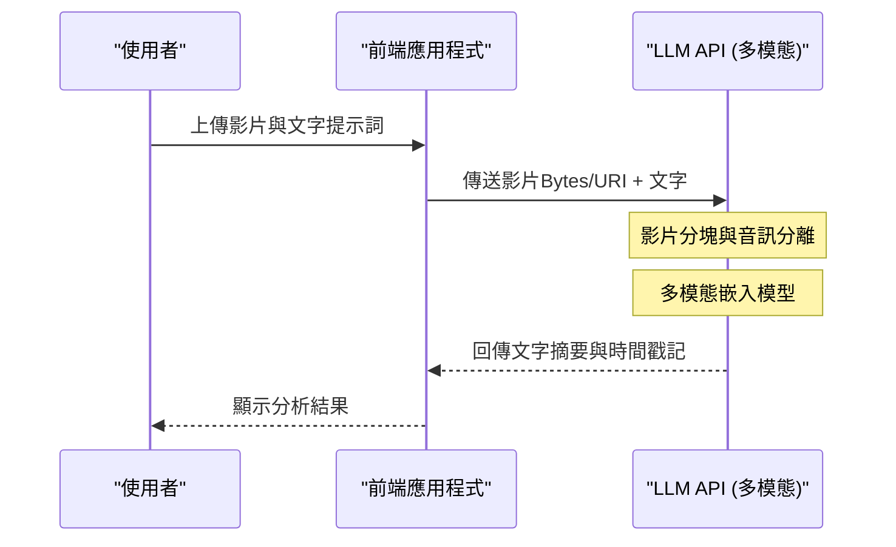

# ChatGPT・Gemini・Claude API徹底比較！該如何選擇？

AI技術的發展日新月異，特別是在大型語言模型（LLM: Large Language Model）領域，OpenAI的ChatGPT（GPT系列）、Google的Gemini，以及Anthropic的Claude正展開激烈的三足鼎立之爭。2026年的今天，各家公司以數月甚至數週為單位推出新的模型與API功能，對於開發者及企業IT架構師而言，「該將哪個API整合到產品中」的問題，已成為左右專案成功與否的極關鍵決策。

本文將針對這三大AI供應商的API，不僅列舉規格，更從開發者視角，深入比較與解說架構設計、詳細的計費結構、延遲（Latency）的數學分析、使用Python與Node.js的具體實作範例，乃至於提示快取（Prompt Caching）等最新的成本最佳化手法。

期盼本文能成為讀者的完整指南，協助您為自身的使用案例挑選出最合適的LLM API，並建構出具備可擴展性且符合成本效益的AI應用程式。

---

## 1. 各LLM API的哲學與設計理念

在技術選型時，首先了解各家公司是以何種理念來建構模型與API，是非常重要的。

### 1.1 OpenAI (ChatGPT)
OpenAI以「實現通用人工智慧（AGI）」為使命，始終引領著業界的實質標準（De facto standard）。提供GPT-4o、GPT-4o-mini，以及專注於推論的o1模型等，滿足多樣使用案例的模型。其生態系統最為成熟，無論是官方或非官方的函式庫與文件都最為豐富。

### 1.2 Google (Gemini)
Google秉持「AI First」，以將自家基礎設施（TPU網路）發揮到極致的可擴展性為武器。Gemini 1.5 Pro/Flash最大特色在於擁有高達200萬個Token的壓倒性上下文長度（Context Window），能一次處理長篇文件或數小時的影片、音訊。與Google Cloud (Vertex AI)的強大整合能力，對企業而言也極具吸引力。

### 1.3 Anthropic (Claude)
Anthropic是由前OpenAI成員所創立的企業，採用獨特的「合憲AI（Constitutional AI）」安全性途徑。Claude 3.5 Sonnet與Opus以其高度的推論能力、程式碼生成能力，以及最重要的是「如同人類般自然的對話」與「極少的幻覺（Hallucination）」，獲得了許多開發者的狂熱支持。

---

## 2. 模型家族規格徹底比較

比較2026年目前的主力模型規格。

| 供應商 | 主力模型 | 最大上下文長度 | 主要優勢 | 推薦使用案例 |
|---|---|---|---|---|
| **OpenAI** | GPT-4o | 128K | 速度、視覺辨識、語音支援 | 互動式應用程式、通用任務 |
| **OpenAI** | o1-preview | 128K | 高階邏輯推論、數學、程式設計 | 複雜演算法生成、研究用途 |
| **Google** | Gemini 1.5 Pro | 2,000K | 超長文處理、多模態（影片・語音） | 巨大程式碼庫分析、影片摘要 |
| **Google** | Gemini 1.5 Flash | 2,000K | 低延遲、高吞吐量、壓倒性的低成本 | 即時處理、大量資料批次處理 |
| **Anthropic** | Claude 3.5 Sonnet | 200K | 程式設計能力、自然的文章生成 | 軟體開發輔助、高階客服支援 |
| **Anthropic** | Claude 3.5 Haiku | 200K | 超高速回應、高性價比 | 邊緣AI、即時聊天機器人 |

---

## 3. 深入探討架構：API請求的幕後運作

當我們呼叫LLM的API時，後端到底進行了什麼樣的處理？為最佳化效能，我們必須理解此架構。

以下的Mermaid圖表展示了從用戶端發送API請求，到以串流（Streaming）方式返回Token的整體流程。

```mermaid
graph TD
    A["用戶端應用程式"] -->|HTTP/REST or gRPC| B["API閘道器"]
    B --> C["負載平衡器"]
    C --> D["推論叢集"]
    D --> E["分詞器 (BPE / SentencePiece)"]
    E --> F["KV快取與注意力機制"]
    F --> G["Transformer區塊 (前向傳遞)"]
    G --> H["輸出層 (Logits)"]
    H --> I["採樣器 (Temperature, Top-p, Top-k)"]
    I --> J["反分詞器"]
    J -->|串流回應 (區塊)| A
```

### 3.1 Tokenization（分詞）演算法
輸入API的文字會在內部被分割為稱為「Token」的單位。
- **OpenAI (tiktoken)**: 採用Byte-Pair Encoding (BPE)。特別是在英文方面能極高效率地壓縮，但在日文或中文等非字母語言中，Token數量往往會暴增。
- **Google (Gemini)**: 採用SentencePiece（Unigram Language Model）。對多語言支援度高，即便是日文或中文文字，也傾向於能以較少的Token數來表示。
- **Anthropic (Claude)**: 使用客製化版本的BPE。強化了多語言支援，Claude 3之後日文與中文的Token效率也有了大幅改善。

---

## 4. 延遲與效能的數學分析

在即時應用程式中，延遲（Latency）直接關係到使用者體驗（UX）。LLM API的延遲 $T_{total}$ 可在數學上建立如下模型：

$$ T_{total} = T_{network} + T_{TTFT} + (N \times T_{TPOT}) $$

此處各變數的含義如下：
- $T_{network}$: 網路的來回通訊時間（RTT）。
- $T_{TTFT}$ (Time To First Token): 生成第一個字元所需的時間。很大程度上取決於與提示詞長度（輸入Token數）平方成正比的注意力（Attention）運算成本。
- $N$: 輸出的Token總數。
- $T_{TPOT}$ (Time Per Output Token): 生成單一Token所需的時間。由於是自迴歸（Autoregressive）模型，會依賴先前的輸出進行串行運算。

### 4.1 自注意力機制的運算複雜度
Transformer架構中的自注意力（Self-Attention）運算複雜度，會相對於輸入序列長度 $L$ 呈二次函數增長。

$$ \text{Complexity} = O(L^2 \cdot d) $$

此處 $d$ 為嵌入向量（Embedding Vector）的維度數。受限於此，通常提示詞一旦變長，$T_{TTFT}$ 就會急遽惡化。
然而，Google的Gemini 1.5採用了「Ring Attention」與「Block-wise Compute」等創新最佳化架構，即便輸入高達200萬Token的長文，也成功將生成第一個Token的時間控制在合理範圍（數秒至數十秒）內。

---

## 5. 計費體系與成本最佳化策略

API的成本基本上是根據輸入Token數與輸出Token數來計算的。

$$ Cost = (Tokens_{in} \times Rate_{in}) + (Tokens_{out} \times Rate_{out}) $$

不過，最新的API導入了能大幅降低成本的新機制。

### 5.1 提示快取 (Prompt Caching)
每次發送龐大的系統提示詞，或是透過RAG搜尋出的大量文件，都會耗費極大成本。為解決此問題，各家公司提供了快取功能。

在Anthropic（Claude）與Google（Gemini）中，透過快取特定文字區塊，能大幅降低（最高90%）輸入成本。

使用快取時的成本模型如下：

$$ Cost_{cached} = (Tokens_{cache\_write} \times Rate_{cache\_write}) + (Tokens_{cache\_read} \times Rate_{cache\_read}) + (Tokens_{out} \times Rate_{out}) $$

此處的 $Rate_{cache\_read}$ 約被設定為一般 $Rate_{in}$ 的10%〜25%。因此，我們能夠以低廉的成本維運聊天機器人，同時讓其常駐數萬行程式碼作為背景知識。

### 5.2 批次API (Batch API)
針對不需即時性的任務（如日誌分析、大量資料分類等），OpenAI與Anthropic提供了批次API。透過將請求打包發送，並在24小時內接收結果，便可以一般API費用的半價（50%折扣）使用此強大機制。

---

## 6. 開發者體驗（DX）與SDK比較

從開發效率的觀點，比較各家提供的SDK（Software Development Kit）。

### 6.1 OpenAI API
最被廣泛使用，對第三方函式庫（如LangChain, LlamaIndex等）的支援也最快。此外，透過結構化輸出（Structured Outputs）功能，保證回傳100%符合JSON Schema的結果，讓系統整合變得非常容易。

### 6.2 Anthropic API (Claude)
SDK介面設計洗鍊，其TypeScript的型別定義等受到極佳評價，非常易於操作。特別是Message API的結構直觀，包含多張圖片的多模態請求也能簡單撰寫。

### 6.3 Google Gemini API
分為透過Google Cloud Vertex AI存取，以及透過AI Studio存取（Google Gen AI SDK）兩種方式，初學者可能會稍微感到混亂。然而，面向企業的Vertex AI SDK與GCP的IAM（身分與存取權管理系統）完全整合，能建構極為安全的開發環境。

---

## 7. 實戰！使用Python實作多API整合測試

在此，我們將使用Python，同時向OpenAI、Anthropic、Gemini三個API發送非同步請求，並實作一個比較延遲的腳本。

```python
import asyncio
import time
import os
from openai import AsyncOpenAI
from anthropic import AsyncAnthropic
import google.generativeai as genai

# 初始化客戶端
openai_client = AsyncOpenAI(api_key=os.environ.get("OPENAI_API_KEY"))
anthropic_client = AsyncAnthropic(api_key=os.environ.get("ANTHROPIC_API_KEY"))
genai.configure(api_key=os.environ.get("GEMINI_API_KEY"))

prompt = "請針對量子電腦的基礎，以及它對現今密碼學技術帶來的影響，為初學者進行淺顯易懂的解說。"

async def fetch_openai():
    start_time = time.time()
    response = await openai_client.chat.completions.create(
        model="gpt-4o",
        messages=[{"role": "user", "content": prompt}],
        max_tokens=1024
    )
    elapsed = time.time() - start_time
    return "OpenAI (GPT-4o)", elapsed, response.choices[0].message.content

async def fetch_anthropic():
    start_time = time.time()
    response = await anthropic_client.messages.create(
        model="claude-3-5-sonnet-20240620",
        messages=[{"role": "user", "content": prompt}],
        max_tokens=1024
    )
    elapsed = time.time() - start_time
    return "Anthropic (Claude 3.5 Sonnet)", elapsed, response.content[0].text

async def fetch_gemini():
    start_time = time.time()
    model = genai.GenerativeModel('gemini-1.5-pro')
    # 使用Gemini Python SDK的非同步方法
    response = await model.generate_content_async(prompt)
    elapsed = time.time() - start_time
    return "Google (Gemini 1.5 Pro)", elapsed, response.text

async def main():
    print("正在向各LLM API發送請求...")
    
    # 平行執行三個API
    results = await asyncio.gather(
        fetch_openai(),
        fetch_anthropic(),
        fetch_gemini()
    )
    
    for provider, latency, text in results:
        print(f"--- {provider} ---")
        print(f"Latency: {latency:.2f} seconds")
        print(f"Response (Excerpt): {text[:100]}...\n")

if __name__ == "__main__":
    asyncio.run(main())
```

執行此腳本，即可輕鬆測量出在實際網路環境中，哪個模型能以最快速度（最小化$T_{total}$）做出回應。

---

## 8. 使用Node.js實作工具呼叫 (Tool Calling)

為了讓LLM不僅僅是聊天機器人，而是能與外部系統串聯的「AI代理（AI Agent）」，工具呼叫（Tool Calling或Function Calling）是不可或缺的。以下是使用Node.js（TypeScript）讓OpenAI API呼叫天氣API的範例。

```typescript
import OpenAI from "openai";

const openai = new OpenAI({
  apiKey: process.env.OPENAI_API_KEY,
});

async function runAgent() {
  const tools = [
    {
      type: "function",
      function: {
        name: "get_weather",
        description: "取得指定城市的目前天氣。",
        parameters: {
          type: "object",
          properties: {
            location: {
              type: "string",
              description: "城市名稱（例如: 東京, 紐約）",
            },
          },
          required: ["location"],
        },
      },
    },
  ];

  const response = await openai.chat.completions.create({
    model: "gpt-4o",
    messages: [{ role: "user", "content": "今天東京天氣如何？需要帶傘嗎？" }],
    tools: tools,
    tool_choice: "auto",
  });

  const message = response.choices[0].message;

  if (message.tool_calls) {
    const toolCall = message.tool_calls[0];
    console.log(`LLM要求呼叫工具: 函式名稱 = ${toolCall.function.name}`);
    
    const args = JSON.parse(toolCall.function.arguments);
    console.log(`參數: ${args.location}`);
    
    // 在此實作呼叫實際天氣API（例如: OpenWeatherMap）的處理
    // const weather = await fetchWeatherFromAPI(args.location);
    
    // 將取得的結果再次傳遞給LLM以生成最終回答
  }
}

runAgent().catch(console.error);
```

Claude 3.5 Sonnet與Gemini 1.5 Pro也具備同等的工具呼叫功能，儘管在Schema定義方式上有些微差異，但基本流程是共通的。

---

## 9. RAG vs Long Context Window：該採用哪一種？

目前在企業AI架構中，最大的爭論之一就是「為了匯入外部知識，該使用RAG（檢索增強生成），還是直接全部丟進巨大的上下文長度（Long Context）中？」。

### RAG (Retrieval-Augmented Generation) 的優勢與挑戰
- **優勢**: 成本低（僅將需要的區塊放入提示詞中）、容易鎖定回答的根據（來源）。
- **挑戰**: 依賴語意搜尋的準確度，因此不適合上下文散落在多份文件中的高階推論任務（例如：「請根據去年所有會議紀錄，按時間軸分析A專案延遲的根本原因」）。

### Long Context (如Gemini 1.5 Pro的200萬Token)
- **優勢**: 沒有因為搜尋而遺漏資訊的風險。在「大海撈針（Needle In A Haystack: NIAH）」測試中，Gemini 1.5 Pro或Claude 3.5 Sonnet都能以99%以上的準確率萃取出資訊。
- **挑戰**: Token消耗量龐大導致成本增加、延遲（$T_{TTFT}$）增加。

**結論**: 2026年的最佳實務是**「混合式途徑（Hybrid Approach）」**。針對日常的Q&A，使用搭載向量資料庫的RAG；而對於需要進行複雜分析或全面檢閱程式碼等特定任務，則利用結合提示快取的Long Context，此為目前的主流設計。

---

## 10. 多模態處理能力比較

次世代的AI應用程式不僅需要處理文字，還要求能直接理解圖片、語音及影片的能力。



- **OpenAI (GPT-4o)**: 圖像辨識準確度極高，非常擅長讀取手寫草圖或複雜圖表。此外，利用Realtime API所實現的超低延遲（數百毫秒）原生語音對話功能也十分強大。
- **Google (Gemini 1.5 Pro)**: **在影片分析領域具有壓倒性優勢。** 能直接輸入1小時的影片檔案（影格群＋音訊），並針對「在12分45秒時，畫面最右側人物所拿資料的標題是什麼？」這類精準提問做出回答。
- **Anthropic (Claude 3.5 Sonnet)**: 圖像辨識（Vision）能力與GPT-4o同等優秀。在「給予UI截圖並要求生成此畫面的React元件程式碼」等前端開發輔助方面，能發揮無與倫比的強大實力。

---

## 11. 企業級的安全性與合規性

當企業在正式環境中使用LLM API時，最擔憂的往往是「自家資料是否會被用於AI訓練」以及「是否符合合規性要求」。

這3家公司都明言，透過API傳送的資料（提示詞與回應）**不會被用於模型訓練（Zero Data Retention / No Training on Customer Data）**（※免費的消費者用Web聊天介面不在此限）。

若要求更高級別的安全性：
- **OpenAI**: 透過Azure OpenAI Service，可利用Microsoft企業級的安全性、SLA，以及Azure Private Link所提供的封閉網路連線。
- **Google**: 透過Google Cloud Vertex AI，可利用VPC Service Controls進行嚴密的網路隔離，並支援CMEK（客戶管理加密金鑰）的資料保護。
- **Anthropic**: 透過AWS Bedrock或Google Cloud Vertex AI使用，可搭乘雲端供應商堅固的安全基礎設施。

---

## 12. 結論：依使用案例而定的終極選擇指南

經過如此多面向的比較，關於「最終該選哪一個？」的結論，其實取決於您的使用案例。

1. **複雜的軟體開發・程式碼生成・高階推論**:
   **👑 贏家: Claude 3.5 Sonnet (Anthropic)**
   在理解程式碼上下文、重構（Refactoring）以及撰寫自然且具備人性的文章方面，目前展現出最佳表現。API的易用性與提示快取帶來的成本效益也極為出色。

2. **超長篇文件分析・影片/音訊批次處理**:
   **👑 贏家: Gemini 1.5 Pro (Google)**
   高達200萬Token的上下文長度是無可取代的武器。在需要掌握資料全貌的任務（如分析數百頁的PDF手冊或總結長時間的會議錄影）中，Gemini無人能出其右。

3. **通用性・執行速度・穩定的結構化輸出 (JSON)**:
   **👑 贏家: GPT-4o / GPT-4o-mini (OpenAI)**
   能妥善處理各式各樣的任務，對第三方工具的支援也最豐富。若需要利用Structured Outputs進行確實的JSON解析，或是使用o1模型進行超高階邏輯推論，OpenAI生態系統是不可或缺的。

### 推薦多模型路由 (Multi-model Routing)
未來的趨勢將不再依賴單一API（避免供應商鎖定），而是根據任務難易度或重要性動態切換模型的**「LLM路由」**架構。
例如，對於使用者簡單的提問，使用廉價且快速的 `GPT-4o-mini` 或 `Gemini 1.5 Flash` 來回應；僅當判斷需要複雜處理時，才將任務回退（Fallback）給 `Claude 3.5 Sonnet`。如此一來便能實現成本與效能的最佳平衡。

AI的進化未曾停歇。請深刻理解各家API的優勢與劣勢，以及其架構特性，並建構出具備靈活性與可擴展性的AI應用程式吧。
