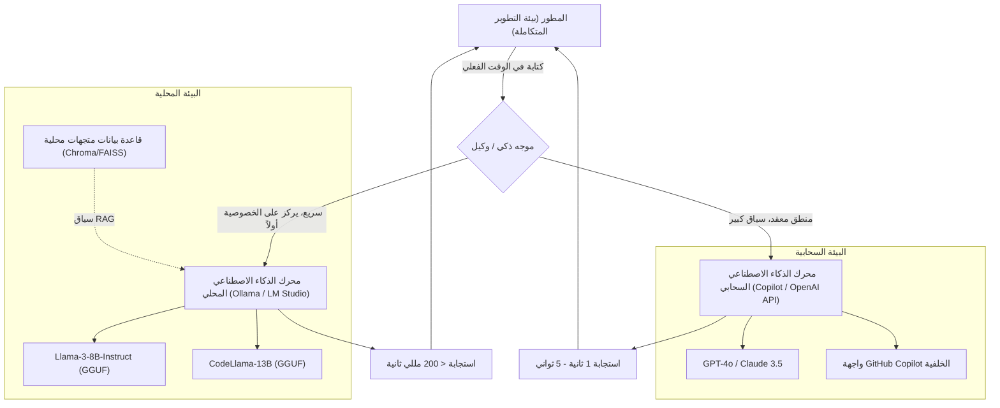
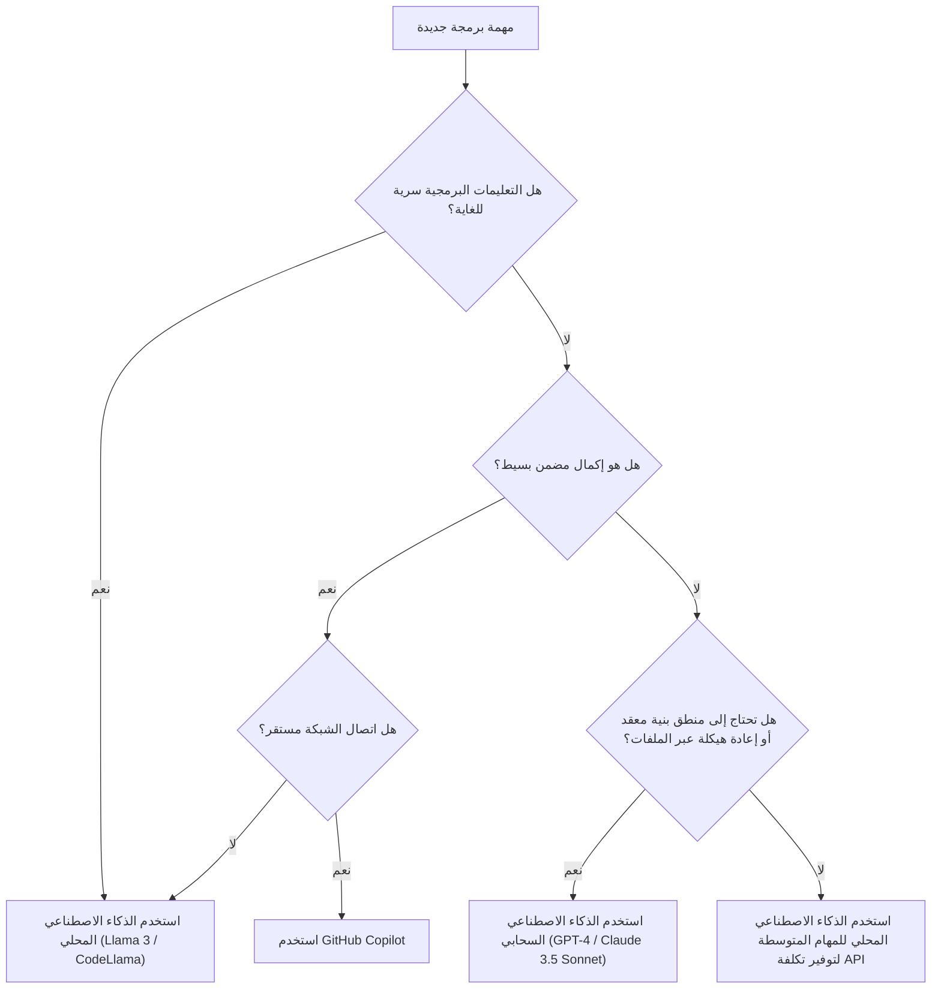

# استخدام Copilot والذكاء الاصطناعي المحلي معًا لرفع كفاءة التطوير بشكل كبير: الدليل الشامل لسير عمل تطوير الذكاء الاصطناعي الهجين

في تطوير البرمجيات الحديثة، تطور استخدام مساعدي الذكاء الاصطناعي من كونهم أدوات "مفيدة إذا وُجدت" إلى بنية تحتية "لا غنى عنها". خاصة بعد ظهور GitHub Copilot، تغيرت تجربة كتابة التعليمات البرمجية للمطورين بشكل جذري. ومع ذلك، فإن الاعتماد على الذكاء الاصطناعي السحابي في جميع المهام ليس دائماً الحل الأمثل.

توجد بعض التحديات في الذكاء الاصطناعي السحابي، مثل المخاطر الأمنية عند التعامل مع المعلومات السرية للشركات (مثل المفاتيح السرية، والخوارزميات الخاصة، والبنيات غير المنشورة)، وتأخير واجهة برمجة التطبيقات (Latency)، والعمل في بيئات غير متصلة بالشبكة. لذلك، في السنوات الأخيرة، زاد الاهتمام بشكل متسارع باستخدام **النماذج المفتوحة التي تعمل محلياً (الذكاء الاصطناعي المحلي)** مثل Llama 3 و CodeLlama و Mistral.

في هذه المقالة، سنشرح بالتفصيل كيف يمكن الجمع بين الذكاء الاصطناعي السحابي (مثل GitHub Copilot و GPT-4 وغيرها) والذكاء الاصطناعي المحلي واستخدام كل منهما في مكانه المناسب لزيادة كفاءة التطوير إلى أقصى حد، بدءاً من تصميم البنية، مروراً بشجرة اتخاذ القرار، وصولاً إلى التحليل الرياضي للتكلفة والكمون.

---

## 1. مقارنة شاملة بين الذكاء الاصطناعي السحابي والذكاء الاصطناعي المحلي

عند بناء سير عمل تطوير الذكاء الاصطناعي الهجين، من المهم أولاً فهم خصائص كل منهما بعمق.

### 1.1 الذكاء الاصطناعي السحابي (GitHub Copilot, GPT-4, Claude 3.5 Sonnet)
يتمثل السلاح الأكبر للذكاء الاصطناعي السحابي في "حجم النموذج الهائل" و"قدرته الاستدلالية العامة". نظراً لأنه يعمل على مجموعات وحدات معالجة رسومات (GPU) ضخمة، فإنه يمكنه تشغيل نماذج بحجم عشرات المليارات إلى تريليونات من المعلمات بسرعة عالية.

*   **المزايا (Pros)**:
    *   **قدرة استدلال لا مثيل لها**: لا يوجد ما يعادله في المهام التي تتطلب فهماً عميقاً للسياق، مثل تحديد الأخطاء المعقدة، وتصميم البنية من الصفر، وإعادة هيكلة التعليمات البرمجية المتقدمة التي تمتد عبر ملفات متعددة.
    *   **نافذة سياق ضخمة**: تحتوي النماذج الحديثة على نافذة سياق تتراوح بين 100k إلى 2M رمز (token)، مما يسمح بقراءة وتحليل الشيفرة المصدرية للمشروع بأكمله في وقت واحد.
    *   **لا حاجة لإدارة البنية التحتية**: لا يحتاج المطورون إلى القلق بشأن موارد GPU أو تحديثات النماذج.
*   **العيوب (Cons)**:
    *   **الخصوصية والأمان**: نظراً لإرسال التعليمات البرمجية إلى خوادم خارجية، قد يتم تقييد الاستخدام في الشركات والمشاريع التي تتطلب امتثالاً صارماً.
    *   **الكمون (Latency)**: نظراً لاعتماده على حالة الاتصال بالشبكة، قد يحدث تأخير في الإكمال التلقائي المضمن الذي يتطلب استجابات في أجزاء من الألف من الثانية.
    *   **التكلفة**: توجد رسوم تعتمد على الاستخدام، أو تكاليف اشتراك شهري، مما يجعل تكاليف التشغيل لا يمكن تجاهلها في حالات الاستخدام واسع النطاق.

### 1.2 الذكاء الاصطناعي المحلي (Llama 3, CodeLlama, Qwen2.5-Coder وغيرها)
الذكاء الاصطناعي المحلي هو نماذج يتم تشغيلها مباشرة على جهاز المطور (مثل أجهزة MacBook المزودة بمعالجات Apple Silicon، أو أجهزة Windows المزودة بوحدات معالجة رسومات NVIDIA). بفضل تطور تقنيات التكميم (GGUF, AWQ, GPTQ وغيرها)، أصبحت نماذج فئة 8B إلى 70B تعمل بسرعة عملية حتى على أجهزة الحواسيب العادية المخصصة للتطوير.

*   **المزايا (Pros)**:
    *   **خصوصية مطلقة**: لا تخرج البيانات أبداً إلى شبكات خارجية. إنه مثالي للتعامل مع المشاريع شديدة السرية أو قواعد الأكواد التي تخضع لاتفاقيات عدم إفشاء صارمة (NDA).
    *   **كمون الشبكة صفر**: لا يعتمد على سرعة الاتصال بالإنترنت، بل يستجيب دائماً بسرعة ثابتة.
    *   **العمل دون اتصال بالإنترنت**: يمكن استخدام جميع الميزات حتى في البيئات المعزولة عن الشبكات الخارجية لأسباب أمنية أو أثناء السفر بالطائرة.
    *   **تخصيص غير محدود**: يمكن ضبط النماذج بدقة (Fine-tuning) لتناسب لغات أو أطر عمل معينة، أو دمج هندسة الأوامر (Prompt Engineering) الخاصة بحرية.
*   **العيوب (Cons)**:
    *   **متطلبات الأجهزة**: يتطلب التشغيل السلس أجهزة مزودة بذاكرة VRAM كافية (مثل VRAM بحجم 16GB إلى 24GB أو أكثر، أو ذاكرة موحدة بسعة 32GB أو أكثر لمعالجات سلسلة M من Apple).
    *   **حدود أداء النموذج**: بسبب قيود الأجهزة، هناك حد لحجم النموذج الذي يمكن تشغيله، وغالباً ما لا يصل إلى مستوى الاستدلال المنطقي المعقد لنماذج فئة GPT-4.
    *   **قيود نافذة السياق**: بسبب سعة الذاكرة، عادة ما يتم تقييد طول السياق الذي يمكن التعامل معه بآلاف إلى عشرات الآلاف من الرموز.

---

## 2. تصميم بنية سير عمل الذكاء الاصطناعي الهجين

للحصول على أفضل تجربة تطوير، من الضروري دمج هذه الأدوات في بيئة تطوير متكاملة (IDE) واحدة (مثل VS Code, Cursor, Neovim) وبناء بنية يمكن التبديل بينها بسلاسة.

يوضح مخطط Mermaid التالي البنية الهجينة وكيفية تعاون الوكيل المحلي والخدمات السحابية لتوزيع مهام المطور.



إن جوهر هذه البنية هو وجود **الموجه الذكي (Intelligent Router)**. تقوم الإضافات داخل بيئة التطوير المتكاملة (IDE) بتوجيه المهام تلقائياً (أو يدوياً بسرعة) بين النماذج المحلية والنماذج السحابية بناءً على سياق الشيفرة التي يكتبها المطور، ومستوى سرية الملف الهدف، ومدى تعقيد المهمة المطلوبة.

على سبيل المثال، يتم إرسال المهام البسيطة مثل الإكمال التلقائي لتعريف دالة أو إنشاء الأكواد النمطية إلى النماذج المحلية (مثل Llama 3 8B) التي تستجيب في عشرات الملي ثانية، بينما يتم إرسال الأسئلة المتعلقة بتصميم المشروع بالكامل أو إعادة الهيكلة واسعة النطاق إلى GPT-4 في السحابة.

---

## 3. معايير اختيار الاستخدام: شجرة اتخاذ القرار

إذن، في بيئة البرمجة الفعلية، كيف يمكن للمطور تحديد "أي ذكاء اصطناعي يجب استخدامه الآن"؟ نحدد تدفق القرار بصرياً باستخدام شجرة اتخاذ القرار أدناه.



### 3.1 معيار التقييم 1: الخصوصية (Privacy and Security)
هذا هو المعيار الأهم. في التعليمات البرمجية التجريبية التي تحتوي على بيانات عملاء يُحظر إرسالها خارجياً بسبب سياسة الشركة، أو في الملفات التي تنفذ خوارزميات أساسية خاصة، يجب اختيار الذكاء الاصطناعي المحلي دون أي مساومة. من الفعال جداً أيضاً بناء RAG (التوليد المعزز بالاسترجاع) محلياً، وتخزين المستندات الداخلية في قاعدة بيانات متجهات والسماح للنموذج المحلي بالرجوع إليها.

### 3.2 معيار التقييم 2: الكمون (Latency)
لكي لا يتوقف تدفق التفكير، يعتبر كمون الإكمال التلقائي مهماً للغاية. يتضمن الذكاء الاصطناعي السحابي دائماً وقت الرحلة ذهاباً وإياباً (RTT) للشبكة. نظراً لأن الذكاء الاصطناعي المحلي يحتوي على كمون شبكة يبلغ صفراً، فمن الممكن الحصول على سرعة استجابة تفوق السحابة إذا احتفظت بنموذج خفيف الوزن في VRAM.

### 3.3 معيار التقييم 3: نافذة السياق (Context Window)
لأوامر مثل "اقرأ جميع ملفات هذا المستودع ونظم التبعيات"، يعتبر الذكاء الاصطناعي السحابي القادر على معالجة أكثر من 100k رمز ضرورياً. إذا حاولت معالجة عشرات الآلاف من الرموز باستخدام نموذج محلي، فقد تنفد الذاكرة أو قد تنخفض سرعة الاستدلال بشكل كبير (على سبيل المثال، عدة ثوان لكل رمز).

---

## 4. التحليل الرياضي للتكلفة والكمون (Mathematical Analysis)

دعنا نحلل كمياً فوائد سير العمل الهجين باستخدام المعادلات الرياضية.

### 4.1 نموذج حساب التكلفة
سنقوم بصياغة تكلفة استخدام واجهة برمجة تطبيقات سحابية (مثل GPT-4) فقط. إجمالي التكلفة اليومية $C_{total}$ في مشروع التطوير هي مجموع عدد رموز الإدخال وعدد رموز الإخراج مضروباً في سعر الوحدة لكل أمر (Prompt).

$$ C_{total} = \sum_{i=1}^{N} \left( P_{in} \times T_{in}^{(i)} + P_{out} \times T_{out}^{(i)} \right) $$

*   $N$ : عدد استدعاءات واجهة برمجة التطبيقات (API) في اليوم
*   $P_{in}$ : السعر لكل رمز إدخال
*   $P_{out}$ : السعر لكل رمز إخراج
*   $T_{in}^{(i)}$ : عدد رموز الإدخال للاستدعاء رقم $i$
*   $T_{out}^{(i)}$ : عدد رموز الإخراج للاستدعاء رقم $i$

بافتراض أننا أدخلنا الذكاء الاصطناعي المحلي وتمكنا من تحويل نسبة $\alpha$ (حيث 0 < $\alpha$ < 1) من عدد الاستدعاءات $N$ إلى النموذج المحلي، فإن تكلفة واجهة برمجة التطبيقات السحابية الجديدة $C_{hybrid}$ ستنخفض على النحو التالي:

$$ C_{hybrid} = (1 - \alpha) \sum_{i=1}^{N} \left( P_{in} \times T_{in}^{(i)} + P_{out} \times T_{out}^{(i)} \right) = (1 - \alpha) C_{total} $$

حتى مع الأخذ في الاعتبار استهلاك الأجهزة وتكلفة الكهرباء، إذا أمكن رفع $\alpha$ إلى 50٪ - 70٪، فسيؤدي ذلك إلى تأثير هائل في خفض التكاليف على المدى الطويل.

### 4.2 نموذج الكمون (التأخير)
سنضع نموذجاً للوقت المستغرق من إرسال المستخدم للأمر حتى عرض الحرف الأول (Time To First Token: TTFT).

يُعبر عن كمون الذكاء الاصطناعي السحابي $L_{cloud}$ بالمعادلة التالية:

$$ L_{cloud} = L_{network\_rtt} + L_{queue} + \frac{T_{in}}{S_{process\_cloud}} $$

*   $L_{network\_rtt}$ : وقت الرحلة ذهاباً وإياباً للشبكة (عادة 20 مللي ثانية - 200 مللي ثانية)
*   $L_{queue}$ : وقت الانتظار في قائمة مزود الخدمة السحابية (يزداد في أوقات الذروة)
*   $S_{process\_cloud}$ : سرعة معالجة الرموز لوحدة معالجة الرسومات السحابية (tokens/sec)

من ناحية أخرى، يكون كمون الذكاء الاصطناعي المحلي $L_{local}$ كما يلي:

$$ L_{local} = \frac{T_{in}}{S_{process\_local}} $$

نظراً لأن كمون الشبكة $L_{network\_rtt}$ وكمون قائمة انتظار السحابة $L_{queue}$ يصبحان صفراً، فإذا كانت $S_{process\_local}$ (سرعة معالجة وحدة معالجة الرسومات المحلية) عالية بما يكفي، يمكن تحقيق استجابة فائقة السرعة (TTFT) في غضون بضعة مللي ثانية. هذا هو السبب الذي يجعل الذكاء الاصطناعي المحلي الأداة الأقوى للإكمال التلقائي المضمن.

---

## 5. حسب سيناريو التطوير: تعمق في حالات استخدام محددة

### حالة الاستخدام 1: إنشاء الأكواد النمطية والإكمال المضمن باستخدام GitHub Copilot
*   **السيناريو**: عند إنشاء هيكل مكون React أو كتابة معالجة الأخطاء النمطية.
*   **النهج**: هنا يتفوق Copilot. أثناء الكتابة، يقرأ السياق في الخلفية باستمرار ويقترح من بضعة أسطر إلى عشرات الأسطر من التعليمات البرمجية بدقة. التجربة التي تكتمل فيها الشيفرة بمجرد الضغط على مفتاح "Tab" دون قطع سلسلة أفكارك، تزيد من سرعة التطوير بشكل مباشر.

### حالة الاستخدام 2: إعادة هيكلة التعليمات البرمجية السرية باستخدام الذكاء الاصطناعي المحلي (CodeLlama / Llama 3)
*   **السيناريو**: عند الحاجة إلى إعادة هيكلة كلمات مرور قاعدة البيانات، أو منطق التشفير الخاص، أو المنطق الأساسي لميزة جديدة غير معلنة.
*   **النهج**: يتم قطع الاتصال بالشبكة لبيئة التطوير المتكاملة (IDE) مؤقتاً، أو استخدام إضافة مخصصة للذكاء الاصطناعي المحلي (مثل Continue.dev)، ويتم إرسال الأوامر إلى النموذج الذي يعمل محلياً (مثل عبر Ollama). يمكنك الحصول على دعم الذكاء الاصطناعي مع الحفاظ على مخاطر تسرب البيانات عند مستوى الصفر.

### حالة الاستخدام 3: تصميم البنية وإصلاح الأخطاء المعقدة باستخدام الذكاء الاصطناعي السحابي (GPT-4 / Claude 3.5 Sonnet)
*   **السيناريو**: تحليل تسرب للذاكرة غير معروف السبب، أو الاستشارات التصميمية عالية المستوى مثل "ما هو أفضل نهج لتقسيم هذا التطبيق المتآلف إلى خدمات مصغرة؟".
*   **النهج**: تتطلب مثل هذه المهام معرفة مسبقة هائلة وقدرة استدلال منطقي متقدمة. حتى لو كان ذلك مكلفاً، يجب استخدام النماذج السحابية الأكثر ذكاءً. يمكنك تمرير عشرات الملفات كسياق وجعله يبحث بعمق "أين تكمن المشكلة".

---

## 6. دليل إعداد بيئة الذكاء الاصطناعي المحلي (القسم العملي)

سنقدم باختصار الخطوات المحددة لإدخال الذكاء الاصطناعي المحلي. النهج الأسهل والأقوى حالياً هو استخدام **Ollama** أو **LM Studio**.

### 6.1 تثبيت Ollama
Ollama هو إطار عمل خفيف الوزن لتشغيل نماذج اللغة الكبيرة (LLM) في بيئة محلية. يدعم أنظمة MacOS و Windows و Linux، ويسمح بإدارة النماذج بشكل بديهي مثل Docker.

```bash
# لنظام MacOS
brew install ollama

# بدء تشغيل الخادم
ollama serve

# تنزيل وتشغيل نموذج Llama 3 (8B)
ollama run llama3

# تشغيل CodeLlama المخصص للبرمجة
ollama run codellama
```

### 6.2 التكامل مع المحرر (استخدام Continue.dev)
للاستفادة من النماذج المحلية في VS Code أو JetBrains IDE، تعتبر الإضافة مفتوحة المصدر **Continue** ممتازة جداً.
من خلال تحديد خادم Ollama المحلي كنقطة نهاية (Endpoint) في ملف إعدادات Continue (`config.json`)، تتم إضافة نافذة دردشة مشابهة لـ ChatGPT وميزات إبراز وتحرير التعليمات البرمجية داخل بيئة التطوير المتكاملة (IDE).

```json
{
  "models": [
    {
      "title": "Ollama Llama 3",
      "provider": "ollama",
      "model": "llama3",
      "apiBase": "http://localhost:11434"
    },
    {
      "title": "GPT-4",
      "provider": "openai",
      "model": "gpt-4",
      "apiKey": "sk-your-openai-api-key"
    }
  ],
  "tabAutocompleteModel": {
    "title": "Starcoder 2",
    "provider": "ollama",
    "model": "starcoder2"
  }
}
```
بهذه الإعدادات، سيتمكن المطور من التبديل فوراً بين "النموذج المحلي" و"النموذج السحابي" من القائمة المنسدلة للدردشة أو الإكمال حسب الحاجة.

---

## 7. مستقبل التطوير المدعوم بالذكاء الاصطناعي: صعود الوكلاء المستقلين

يعتمد سير العمل الهجين الحالي على نموذج المساعد (Copilot) حيث "يُعطي الإنسان توجيهات للذكاء الاصطناعي". ومع ذلك، في غضون سنوات قليلة، سيتطور هذا الأمر بشكل أكبر، وسنشهد عصر **وكلاء الذكاء الاصطناعي المستقلين ذوي الهيكل الهرمي** حيث تراقب النماذج المحلية الخفيفة الوزن باستمرار قاعدة التعليمات البرمجية وتُجري الاختبارات في الخلفية، وتقوم باستدعاء النماذج السحابية الضخمة بشكل مستقل لتوليد حلول فقط عند اكتشاف أخطاء معقدة.

في ذلك الوقت، لن يكون جهاز الكمبيوتر الشخصي للمطور مجرد شاشة لتشغيل محرر النصوص، بل سيلعب دوراً كبيراً كخط أمامي لمحرك الاستدلال (الذكاء الاصطناعي عند الحافة Edge AI). إن استمرار شركات مثل NVIDIA و Apple في زيادة ذاكرة أجهزة المطورين (VRAM / الذاكرة الموحدة) يهدف بالتأكيد إلى هذا المستقبل.

---

## 8. الخاتمة (Conclusion)

بدلاً من الاختيار الثنائي بين "GitHub Copilot السحابي" و "الذكاء الاصطناعي المحلي"، فإن **سير العمل الهجين الذي يفهم نقاط قوة كل منهما ويستخدمها بشكل مناسب وفقاً لطبيعة المهمة** هو أفضل بيئة تطوير حالياً.

*   **GitHub Copilot / واجهة برمجة التطبيقات السحابية**: تستخدم لزيادة سرعة التطوير العامة، وتصميم المنطق المعقد، والتحليل الشامل للمشروع بأكمله.
*   **الذكاء الاصطناعي المحلي (Ollama, LM Studio)**: يستخدم لمعالجة التعليمات البرمجية شديدة السرية، وبيئات العمل دون اتصال بالإنترنت، والإكمال المضمن فائق السرعة مع القضاء على كمون الشبكة، وتقليل تكلفة واجهة برمجة التطبيقات.

يُرجى الاستفادة من شجرة اتخاذ القرار والبنية المعروضة في هذه المقالة لرفع مستوى بيئة التطوير (IDE) الخاصة بك إلى المستوى التالي. من خلال الانتقال من مجرد "مستخدم" للذكاء الاصطناعي إلى دور يجعلك "تدمجها وتستخدمها في المكان المناسب"، سترتفع كفاءة تطويرك بلا شك إلى أقصى حد.

Happy Coding with Hybrid AI!
