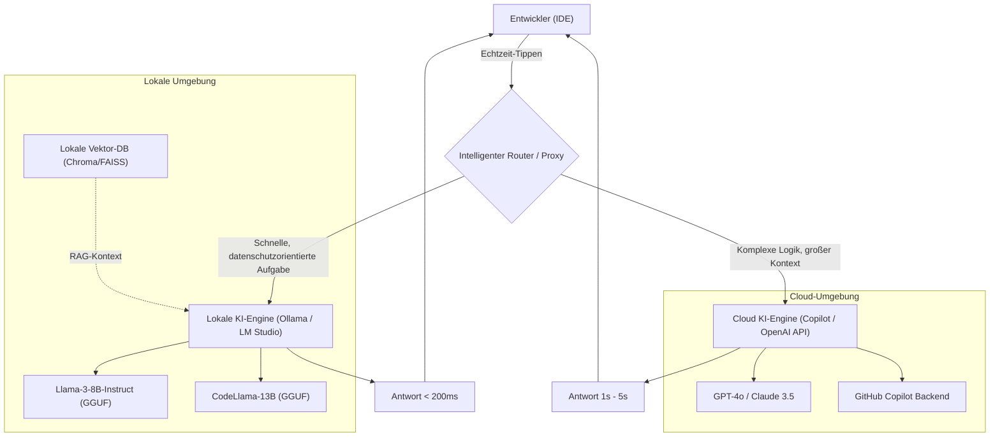
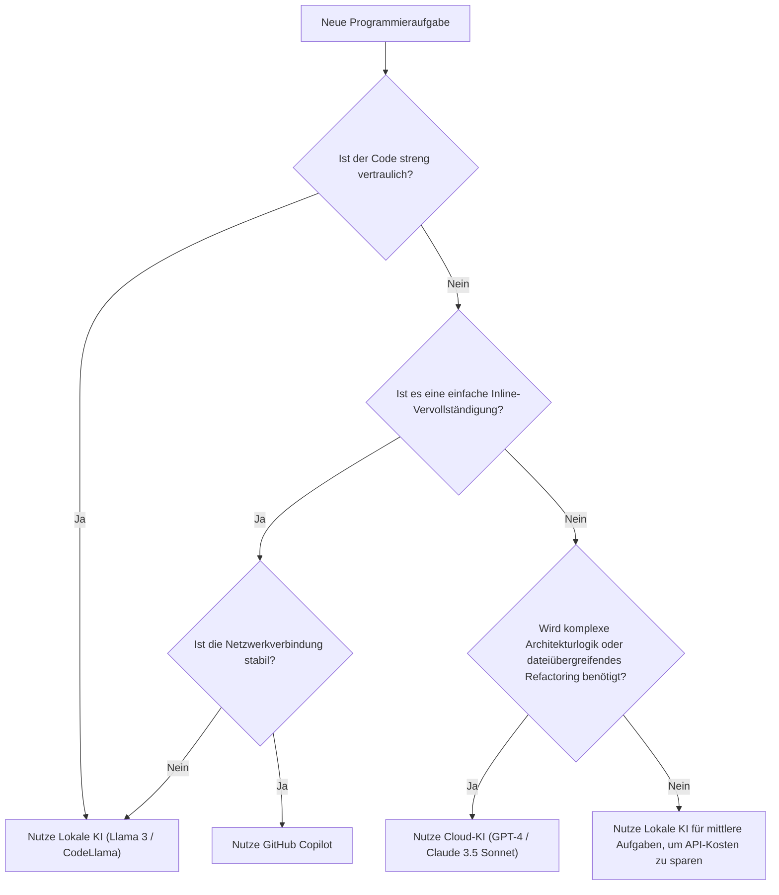

# Entwicklungseffizienz maximieren durch die richtige Balance zwischen Copilot und lokaler KI: Der vollständige Leitfaden für hybride KI-Entwicklungsworkflows

In der modernen Softwareentwicklung hat sich die Nutzung von KI-Assistenten von einem "nice-to-have" Werkzeug zu einer "unverzichtbaren" Infrastruktur entwickelt. Insbesondere seit der Einführung von GitHub Copilot hat sich die Programmiererfahrung für Entwickler dramatisch verändert. Es ist jedoch nicht immer die optimale Lösung, sich bei allen Aufgaben auf KI in der Cloud zu verlassen.

Beim Umgang mit vertraulichen Unternehmensinformationen (Secret-Keys, proprietäre Algorithmen, unveröffentlichte Architekturen) bestehen Sicherheitsrisiken, Latenzzeiten (Verzögerungen) bei APIs und zudem Herausforderungen beim Arbeiten in Offline-Umgebungen ohne Netzwerkverbindung. Daher hat in den letzten Jahren die Nutzung von **lokal laufenden offenen Modellen (lokale KI)** wie Llama 3, CodeLlama und Mistral rapide an Aufmerksamkeit gewonnen.

In diesem Artikel werden wir äußerst detailliert erläutern, wie man Cloud-basierte KI (wie GitHub Copilot und GPT-4) und lokale KI kombinieren und gezielt einsetzen kann, um die Entwicklungseffizienz zu maximieren (zu steigern) – vom Architekturdesign über konkrete Entscheidungsbäume bis hin zur mathematischen Analyse von Kosten und Latenz.

---

## 1. Cloud-KI und lokale KI im umfassenden Vergleich

Beim Aufbau eines hybriden KI-Entwicklungsworkflows ist es zunächst wichtig, die jeweiligen Eigenschaften tiefgreifend zu verstehen.

### 1.1 Cloud-basierte KI (GitHub Copilot, GPT-4, Claude 3.5 Sonnet)
Die größte Waffe der Cloud-KI liegt in ihrer "überwältigenden Modellgröße" und "allgemeinen Schlussfolgerungsfähigkeit". Da sie auf riesigen GPU-Clustern läuft, können Modelle in einer Größenordnung von zig Milliarden bis Billionen Parametern mit hoher Geschwindigkeit ausgeführt werden.

*   **Vorteile (Pros)**:
    *   **Unübertroffene Schlussfolgerungsfähigkeit**: Bei Aufgaben, die ein tiefes Verständnis des Kontexts erfordern – wie das Identifizieren komplexer Bugs, das Zero-Base-Design von Architekturen oder anspruchsvolles Refactoring über mehrere Dateien hinweg –, ist sie unübertroffen.
    *   **Riesiges Kontextfenster**: Moderne Modelle verfügen über ein Kontextfenster von 100k bis 2M Tokens, was es ermöglicht, die Codebasis des gesamten Projekts auf einmal zu laden und zu analysieren.
    *   **Kein Infrastrukturmanagement erforderlich**: Entwickler müssen sich nicht um GPU-Ressourcen oder Modell-Updates kümmern.
*   **Nachteile (Cons)**:
    *   **Datenschutz und Sicherheit**: Da der Code an externe Server gesendet wird, kann die Nutzung in Unternehmen oder Projekten, die strenge Compliance-Vorgaben haben, eingeschränkt sein.
    *   **Latenz**: Da sie von der Netzwerkverbindung abhängt, können bei Inline-Vervollständigungen, die Antworten im Millisekundenbereich erfordern, Verzögerungen auftreten.
    *   **Kosten**: Es fallen nutzungsabhängige Gebühren (Pay-as-you-go) oder monatliche Abonnementkosten an, was bei großflächiger Nutzung zu erheblichen laufenden Kosten führen kann.

### 1.2 Lokale KI (Llama 3, CodeLlama, Qwen2.5-Coder usw.)
Lokale KI bezieht sich auf Modelle, die direkt auf der lokalen Maschine des Entwicklers ausgeführt werden (z. B. auf einem MacBook mit Apple Silicon oder einem Windows-PC mit einer NVIDIA-GPU). Dank der Weiterentwicklung von Quantisierungstechniken (GGUF, AWQ, GPTQ usw.) können Modelle der 8B- bis 70B-Klasse mittlerweile auch auf Standard-Entwicklungs-PCs mit praxistauglicher Geschwindigkeit betrieben werden.

*   **Vorteile (Pros)**:
    *   **Ultimativer Datenschutz**: Daten verlassen das lokale Netzwerk unter keinen Umständen. Ideal für die Arbeit an streng geheimen Projekten oder Codebasen, die strengen NDAs unterliegen.
    *   **Null Netzwerk-Latenz**: Unabhängig von der Geschwindigkeit der Internetverbindung wird immer mit konstanter Geschwindigkeit geantwortet.
    *   **Betrieb in Offline-Umgebungen**: Der volle Funktionsumfang kann auch in Flugzeugen oder in Umgebungen genutzt werden, die aus Sicherheitsgründen vom externen Netzwerk isoliert sind.
    *   **Grenzenlose Anpassbarkeit**: Man kann spezifisches Fine-Tuning für bestimmte Sprachen oder Frameworks durchführen oder eigenes Prompt-Engineering frei integrieren.
*   **Nachteile (Cons)**:
    *   **Hardwareanforderungen**: Für einen reibungslosen Betrieb ist eine Maschine mit ausreichendem VRAM (Videospeicher) erforderlich (z. B. 16 GB bis 24 GB+ VRAM oder 32 GB+ Unified Memory bei M-Serie-Chips).
    *   **Grenzen der Modellleistung**: Aufgrund von Hardwarebeschränkungen ist die ausführbare Modellgröße limitiert, sodass sie bei komplexen logischen Schlussfolgerungen oft nicht an die Leistung der GPT-4-Klasse heranreicht.
    *   **Begrenzung des Kontextfensters**: Aus Speicherplatzgründen ist die verarbeitbare Kontextlänge in der Regel auf einige Tausend bis Zehntausend Tokens beschränkt.

---

## 2. Architekturdesign des hybriden KI-Workflows

Um die bestmögliche Entwicklungserfahrung zu erzielen, müssen diese Tools in einer einzigen IDE (z. B. VS Code, Cursor, Neovim) integriert und eine Architektur aufgebaut werden, die einen nahtlosen Wechsel ermöglicht.

Das folgende Mermaid-Diagramm zeigt die hybride Architektur, wie lokale Agenten und Cloud-Dienste zusammenarbeiten und die Aufgaben der Entwickler verteilt verarbeiten.



Das Herzstück dieser Architektur ist die Präsenz des **Intelligent Routers (Intelligenter Router)**. Abhängig vom Kontext des vom Entwickler geschriebenen Codes, der Geheimhaltungsstufe der Zieldatei und der Komplexität der angeforderten Aufgabe leitet die Erweiterung in der IDE die Anfragen automatisch (oder schnell manuell) an das lokale Modell oder das Cloud-Modell weiter.

Beispielsweise wird die Vervollständigung einer einfachen Funktionsdefinition oder die Generierung von Boilerplate-Code an ein lokales Modell (wie Llama 3 8B) gesendet, das in wenigen Dutzend Millisekunden antwortet. Fragen zum Design des gesamten Projekts oder Chat-Prompts, die ein umfangreiches Refactoring beinhalten, werden hingegen dynamisch an GPT-4 in der Cloud weitergeleitet.

---

## 3. Entscheidungskriterien für die Nutzung: Entscheidungsbaum

Wie sollten Entwickler in der realen Programmierpraxis entscheiden, "welche KI soll ich jetzt nutzen"? Der folgende Entscheidungsbaum definiert den Beurteilungsfluss visuell.



### 3.1 Bewertungsachse 1: Vertraulichkeit (Privacy and Security)
Dies ist das wichtigste Entscheidungskriterium. Bei Testcode, der Kundendaten enthält, deren externe Übertragung durch Unternehmensrichtlinien verboten ist, oder in Dateien, in denen proprietäre Kernalgorithmen implementiert sind, wird kompromisslos die lokale KI gewählt. Eine sehr effektive Methode besteht auch darin, lokal RAG (Retrieval-Augmented Generation) aufzubauen, interne Dokumente in einem Vektorspeicher zu speichern und sie von der lokalen LLM referenzieren zu lassen.

### 3.2 Bewertungsachse 2: Latenz (Latency)
Um den Denkfluss nicht zu unterbrechen, ist die Latenz bei der Vervollständigung von entscheidender Bedeutung. Bei der Cloud-KI tritt immer eine Netzwerk-Round-Trip-Zeit (RTT) auf. Da die lokale KI keine Netzwerkverzögerung hat, kann man durch das Bereithalten eines leichtgewichtigen Modells im VRAM eine gefühlte Geschwindigkeit erreichen, die die der Cloud übertrifft.

### 3.3 Bewertungsachse 3: Kontextfenster (Context Window)
Für Prompts wie "Lies alle Dateien in diesem Repository und organisiere die Abhängigkeiten" ist eine Cloud-KI, die über 100k Tokens verarbeiten kann, unerlässlich. Wenn man versucht, zehntausende Tokens mit einem lokalen Modell zu verarbeiten, geht entweder der Speicher aus oder die Inferenzgeschwindigkeit sinkt dramatisch (z. B. auf mehrere Sekunden pro Token).

---

## 4. Mathematische Analyse von Kosten und Verzögerung (Mathematical Analysis)

Lassen Sie uns die Vorteile des hybriden Workflows anhand von mathematischen Formeln quantitativ analysieren.

### 4.1 Kostenberechnungsmodell
Wir formulieren die Kosten für die ausschließliche Nutzung einer Cloud-API (z. B. GPT-4). Die Gesamtkosten pro Tag in einem Entwicklungsprojekt $C_{total}$ sind die Summe der Anzahl der Eingabe- und Ausgabe-Tokens für jeden Prompt multipliziert mit dem jeweiligen Stückpreis.

$$ C_{total} = \sum_{i=1}^{N} \left( P_{in} \times T_{in}^{(i)} + P_{out} \times T_{out}^{(i)} \right) $$

*   $N$ : Anzahl der API-Aufrufe pro Tag
*   $P_{in}$ : Preis pro Eingabe-Token
*   $P_{out}$ : Preis pro Ausgabe-Token
*   $T_{in}^{(i)}$ : Anzahl der Eingabe-Tokens für den $i$-ten Aufruf
*   $T_{out}^{(i)}$ : Anzahl der Ausgabe-Tokens für den $i$-ten Aufruf

Wenn wir eine lokale KI einführen und annehmen, dass wir einen Anteil $\alpha$ (0 < $\alpha$ < 1) der Aufrufe $N$ auf das lokale Modell auslagern können, werden die neuen Cloud-API-Kosten $C_{hybrid}$ wie folgt reduziert:

$$ C_{hybrid} = (1 - \alpha) \sum_{i=1}^{N} \left( P_{in} \times T_{in}^{(i)} + P_{out} \times T_{out}^{(i)} \right) = (1 - \alpha) C_{total} $$

Selbst wenn man Hardware-Abschreibungen und Stromkosten berücksichtigt, führt eine Erhöhung von $\alpha$ auf 50% bis 70% langfristig zu einer drastischen Kostenreduzierung.

### 4.2 Latenzmodell (Verzögerung)
Wir modellieren die Zeit, vom Absenden des Prompts durch den Nutzer bis zum Erscheinen des ersten Zeichens (Time To First Token: TTFT).

Die Verzögerung der Cloud-KI $L_{cloud}$ wird durch folgende Formel ausgedrückt:

$$ L_{cloud} = L_{network\_rtt} + L_{queue} + \frac{T_{in}}{S_{process\_cloud}} $$

*   $L_{network\_rtt}$ : Netzwerk-Round-Trip-Zeit (normalerweise 20ms - 200ms)
*   $L_{queue}$ : Wartezeit in der Warteschlange beim Cloud-Anbieter (steigt bei Überlastung)
*   $S_{process\_cloud}$ : Token-Verarbeitungsgeschwindigkeit der Cloud-GPU (Tokens/Sek.)

Auf der anderen Seite sieht die Verzögerung der lokalen KI $L_{local}$ wie folgt aus:

$$ L_{local} = \frac{T_{in}}{S_{process\_local}} $$

Da die Netzwerkverzögerung $L_{network\_rtt}$ und die Cloud-Warteschlangenverzögerung $L_{queue}$ auf Null fallen, ist bei ausreichend hoher Verarbeitungsgeschwindigkeit der lokalen GPU $S_{process\_local}$ eine extrem schnelle Antwort (TTFT) im Millisekundenbereich möglich. Dies ist der Grund, warum lokale KI das stärkste Werkzeug für die Inline-Vervollständigung sein kann.

---

## 5. Detaillierte Betrachtung spezifischer Anwendungsfälle im Entwicklungsalltag

### Anwendungsfall 1: Generierung von Boilerplate-Code und Inline-Vervollständigung durch GitHub Copilot
*   **Szenario**: Wenn das Grundgerüst für React-Komponenten erstellt oder routinemäßige Fehlerbehandlungen geschrieben werden.
*   **Ansatz**: Dies ist die absolute Stärke von Copilot. Während des Tippens liest es kontinuierlich den Kontext im Hintergrund und schlägt präzise einige bis Dutzende Zeilen Code vor. Das Erlebnis, den Code durch einfaches Drücken der "Tab-Taste" zu vervollständigen, ohne den Denkfluss zu unterbrechen, erhöht die Entwicklungsgeschwindigkeit am unmittelbarsten.

### Anwendungsfall 2: Refactoring von vertraulichem Code durch lokale KI (CodeLlama / Llama 3)
*   **Szenario**: Wenn Datenbankpasswörter, proprietäre Verschlüsselungslogik oder die Kernlogik neuer, unveröffentlichter Funktionen refaktorisiert werden sollen.
*   **Ansatz**: Man blockiert vorübergehend den Netzwerkzugriff der IDE oder nutzt eine spezielle Erweiterung für lokale KI (z. B. Continue.dev), um Prompts an das lokal laufende Modell (z. B. via Ollama) zu senden. So kann man KI-Unterstützung in Anspruch nehmen, während das Risiko eines Datenlecks bei Null bleibt.

### Anwendungsfall 3: Architekturdesign und komplexe Fehlerbehebung durch Cloud-LLMs (GPT-4 / Claude 3.5 Sonnet)
*   **Szenario**: Die Analyse eines Speicherlecks unbekannter Ursache oder hochrangige Designberatung wie "Was ist der beste Ansatz, um diese monolithische App in Microservices aufzuteilen?".
*   **Ansatz**: Solche Aufgaben erfordern ein immenses Vorwissen und hochgradig logische Schlussfolgerungsfähigkeiten. Auch wenn es Kosten verursacht, sollte man die intelligentesten Cloud-Modelle nutzen. Man übergibt Dutzende von Dateien als Kontext und lässt das Modell tiefgehend analysieren, "wo das Problem liegt".

---

## 6. Leitfaden zur Einrichtung einer lokalen KI-Umgebung (Praxisteil)

Hier stellen wir kurz die konkreten Schritte zur Einführung von lokaler KI vor. Derzeit ist der einfachste und leistungsfähigste Ansatz die Nutzung von **Ollama** oder **LM Studio**.

### 6.1 Installation von Ollama
Ollama ist ein leichtgewichtiges Framework zum Ausführen von LLMs in lokalen Umgebungen. Es unterstützt MacOS, Windows und Linux und ermöglicht die Verwaltung von Modellen auf intuitive Weise, ähnlich wie Docker.

```bash
# Für MacOS
brew install ollama

# Starten des Servers
ollama serve

# Herunterladen und Ausführen des Llama 3 (8B) Modells
ollama run llama3

# Ausführen von CodeLlama, das auf Programmierung spezialisiert ist
ollama run codellama
```

### 6.2 Integration in den Editor (Nutzung von Continue.dev)
Um lokale Modelle in VS Code oder JetBrains IDEs zu nutzen, ist die Open-Source-Erweiterung **Continue** hervorragend geeignet.
Indem man einfach den lokalen Ollama-Server als Endpunkt in der Einstellungsdatei von Continue (`config.json`) angibt, werden der IDE ein Chat-Fenster im Stil von ChatGPT sowie Funktionen zur Code-Hervorhebung und -Bearbeitung hinzugefügt.

```json
{
  "models": [
    {
      "title": "Ollama Llama 3",
      "provider": "ollama",
      "model": "llama3",
      "apiBase": "http://localhost:11434"
    },
    {
      "title": "GPT-4",
      "provider": "openai",
      "model": "gpt-4",
      "apiKey": "sk-your-openai-api-key"
    }
  ],
  "tabAutocompleteModel": {
    "title": "Starcoder 2",
    "provider": "ollama",
    "model": "starcoder2"
  }
}
```
Durch diese Konfiguration können Entwickler bei Bedarf über ein Dropdown-Menü sofort zwischen dem "lokalen Modell" und dem "Cloud-Modell" wechseln, um zu chatten oder Code zu vervollständigen.

---

## 7. Die Zukunft der KI-gestützten Entwicklung: Der Aufstieg autonomer Agenten

Der aktuelle hybride Workflow basiert auf dem Paradigma eines Co-Piloten (Copilot), bei dem "der Mensch der KI Anweisungen gibt". In einigen Jahren wird sich dies jedoch weiterentwickeln, und wir werden in die Ära **hierarchischer autonomer KI-Agenten** eintreten. Dann wird ein leichtgewichtiges lokales Modell kontinuierlich die Codebasis überwachen und im Hintergrund Tests ausführen, und nur wenn es komplexe Fehler erkennt, wird es autonom ein riesiges Cloud-Modell aufrufen, um Lösungen zu generieren.

In diesem Fall wird der lokale PC des Entwicklers nicht mehr nur ein Bildschirm zum Ausführen eines Editors sein, sondern eine starke Rolle als Frontlinie einer Inferenz-Engine (Edge-KI) übernehmen. Die kontinuierliche Aufrüstung des Speichers (VRAM / Unified Memory) bei Entwicklermaschinen durch Unternehmen wie NVIDIA und Apple geschieht im Hinblick auf genau diese Zukunft.

---

## 8. Fazit (Conclusion)

Anstatt eines binären Gegensatzes von "Cloud GitHub Copilot" oder "Lokale KI" ist der **hybride Workflow, bei dem man die Stärken beider versteht und sie je nach Art der Aufgabe entsprechend einsetzt**, die derzeit stärkste Entwicklungsumgebung.

*   **GitHub Copilot / Cloud-API**: Wird für die allgemeine Steigerung der Entwicklungsgeschwindigkeit, das Design komplexer Logik und die holistische Analyse des gesamten Projekts verwendet.
*   **Lokale KI (Ollama, LM Studio)**: Wird für die Verarbeitung vertraulichen Codes, in Offline-Umgebungen, für ultraschnelle Inline-Vervollständigungen ohne Netzwerk-Latenz und zur Reduzierung von API-Kosten verwendet.

Bitte nutzen Sie die in diesem Artikel vorgestellten Entscheidungsbäume und Architekturen als Referenz, um Ihre IDE-Umgebung auf die nächste Stufe zu heben. Indem Sie vom "Nutzer" von KI zu jemandem aufsteigen, der KI "kombiniert und sie am richtigen Ort einsetzt", wird Ihre Entwicklungseffizienz zweifellos maximiert.

Happy Coding with Hybrid AI!
