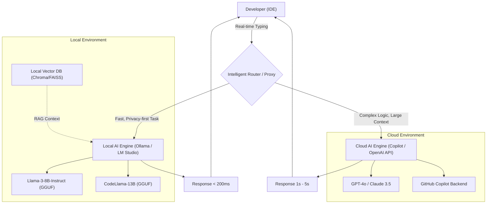
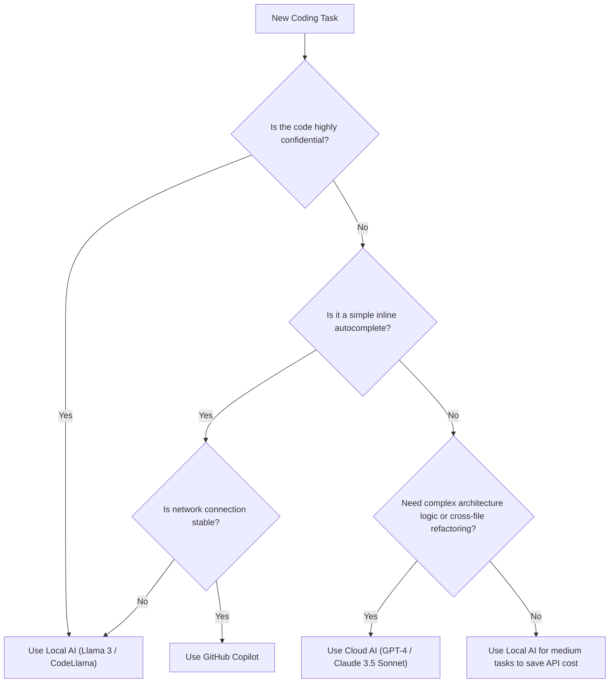

# Boosting Development Efficiency by Combining Copilot and Local AI: A Complete Guide to the Hybrid AI Development Workflow

In modern software development, the utilization of AI assistants has evolved from a "nice-to-have" tool to an "indispensable" infrastructure. Particularly since the advent of GitHub Copilot, the coding experience for developers has changed dramatically. However, relying on cloud-based AI for all tasks is not always the optimal solution.

Cloud-based AI faces several challenges, including security risks when handling corporate confidential information (secret keys, proprietary algorithms, unreleased architectures), API latency, and working in offline environments without network connectivity. Therefore, the utilization of **local open models (Local AI)** that run locally, such as Llama 3, CodeLlama, and Mistral, has rapidly gained attention in recent years.

This article will explain in extreme detail how to maximize (boost) development efficiency by combining and utilizing cloud-based AI (like GitHub Copilot and GPT-4) and local AI. We will cover everything from architectural design and specific decision trees to mathematical analysis of costs and latency.

---

## 1. Thorough Comparison Between Cloud AI and Local AI

Before building a hybrid AI development workflow, it is important to deeply understand the characteristics of each.

### 1.1 Cloud-Based AI (GitHub Copilot, GPT-4, Claude 3.5 Sonnet)
The greatest weapons of cloud AI are its "overwhelming model size" and "versatile reasoning capabilities". Because it runs on massive GPU clusters, it can execute models with tens to hundreds of billions of parameters at high speed.

*   **Pros**:
    *   **Unparalleled Reasoning Power**: Nothing beats it in tasks requiring deep context understanding, such as identifying complex bugs, zero-base architectural design, and advanced refactoring across multiple files.
    *   **Massive Context Window**: The latest models have context windows of 100k to 2M tokens, allowing them to read and analyze the entire codebase of a project at once.
    *   **No Infrastructure Management Needed**: Developers do not need to worry about GPU resources or model updates.
*   **Cons**:
    *   **Privacy and Security**: Since the code is sent to external servers, its use may be restricted in companies or projects that require strict compliance.
    *   **Latency**: Depending on network communication conditions, delays can occur in inline completion where responses in milliseconds are required.
    *   **Cost**: Pay-as-you-go pricing based on usage or monthly subscription fees apply, and running costs cannot be ignored for large-scale usage.

### 1.2 Local AI (Llama 3, CodeLlama, Qwen2.5-Coder, etc.)
Local AI refers to models that run directly on the developer's local machine (such as Apple Silicon MacBooks or Windows machines equipped with NVIDIA GPUs). Thanks to advancements in quantization technologies (GGUF, AWQ, GPTQ, etc.), models in the 8B to 70B class can now run at practical speeds even on standard development PCs.

*   **Pros**:
    *   **Ultimate Privacy**: Data never leaves the external network. It is ideal for handling highly confidential projects or codebases under strict NDAs.
    *   **Zero Network Latency**: It is not dependent on internet connection speeds and always returns responses at a consistent speed.
    *   **Offline Operation**: You can use the full functionality even on airplanes or in environments isolated from external networks due to security requirements.
    *   **Infinite Customization**: You can freely fine-tune it specifically for a particular language or framework, and incorporate your own prompt engineering.
*   **Cons**:
    *   **Hardware Requirements**: A machine with sufficient VRAM (Video RAM) (e.g., 16GB to 24GB+ of VRAM, or an M-series chip with 32GB+ of unified memory) is necessary to run it comfortably.
    *   **Limits to Model Performance**: Due to hardware constraints, there is a limit to the size of models that can be executed, and they often fall short of the complex logical reasoning of the GPT-4 class.
    *   **Context Window Constraints**: Due to memory capacity constraints, the context length that can be handled is typically limited to a few thousand to tens of thousands of tokens.

---

## 2. Architectural Design of the Hybrid AI Workflow

To achieve the best development experience, it is necessary to build an architecture that integrates these tools on a single IDE (e.g., VS Code, Cursor, Neovim) and allows for seamless switching.

The Mermaid diagram below shows a hybrid architecture illustrating how local agents and cloud services collaborate and distribute developer tasks.



The core of this architecture is the presence of an **Intelligent Router / Proxy**. Depending on the context of the code being written by the developer, the confidentiality level of the target file, and the complexity of the requested task, the IDE extension automatically (or quickly manually) routes between local and cloud models.

For example, for simple function definition completions or boilerplate generation, the process is thrown to a local model (such as Llama 3 8B) that responds in tens of milliseconds. In contrast, questions related to the overall project design or chat prompts involving large-scale refactoring are routed dynamically to GPT-4 in the cloud.

---

## 3. Decision Criteria for Usage: Decision Tree

So, in the actual coding field, how should developers judge "which AI to use right now"? We define the decision flow visually using the decision tree below.



### 3.1 Evaluation Axis 1: Privacy and Security
This is the most important decision criterion. For test code containing customer data that is prohibited from being sent externally by company policy, or files implementing proprietary core algorithms, choose local AI without any compromise. Building local RAG (Retrieval-Augmented Generation) and storing internal documents in a vector store for local LLMs to reference is also a highly effective method.

### 3.2 Evaluation Axis 2: Latency
To avoid interrupting your train of thought, the latency of completions is extremely important. Cloud AI always incurs a network round-trip time (RTT). Since local AI has zero network latency, keeping a lightweight model resident in VRAM can achieve perceived speeds that surpass the cloud.

### 3.3 Evaluation Axis 3: Context Window
For prompts like "Read all files in this repository and organize the dependencies," cloud AI capable of processing 100k+ tokens is essential. Attempting to process tens of thousands of tokens with a local model will either deplete the memory or drastically degrade the inference speed (e.g., several seconds per token).

---

## 4. Mathematical Analysis of Cost and Latency

Let's quantitatively analyze the advantages of the hybrid workflow using mathematical formulas.

### 4.1 Cost Calculation Model
We will formulate the cost when using only a cloud API (e.g., GPT-4). The total cost $C_{total}$ per day in a development project is the sum of the number of input and output tokens for each prompt multiplied by their respective unit prices.

$$ C_{total} = \sum_{i=1}^{N} \left( P_{in} \times T_{in}^{(i)} + P_{out} \times T_{out}^{(i)} \right) $$

*   $N$ : Number of API calls per day
*   $P_{in}$ : Price per input token
*   $P_{out}$ : Price per output token
*   $T_{in}^{(i)}$ : Number of input tokens for the $i$-th call
*   $T_{out}^{(i)}$ : Number of output tokens for the $i$-th call

Assuming that local AI is introduced and a proportion $\alpha$ (0 < $\alpha$ < 1) of the $N$ calls can be offloaded to the local model, the new cloud API cost $C_{hybrid}$ is reduced as follows:

$$ C_{hybrid} = (1 - \alpha) \sum_{i=1}^{N} \left( P_{in} \times T_{in}^{(i)} + P_{out} \times T_{out}^{(i)} \right) = (1 - \alpha) C_{total} $$

Even when considering hardware depreciation and electricity costs, if $\alpha$ can be increased to 50% - 70%, it will bring dramatic cost reduction effects in the long run.

### 4.2 Latency Model
We model the Time To First Token (TTFT), which is the time from when the user sends a prompt until the first character is displayed.

The latency of cloud AI $L_{cloud}$ is expressed by the following equation:

$$ L_{cloud} = L_{network\_rtt} + L_{queue} + \frac{T_{in}}{S_{process\_cloud}} $$

*   $L_{network\_rtt}$ : Network round-trip time (typically 20ms - 200ms)
*   $L_{queue}$ : Queue wait time on the cloud provider's side (increases during congestion)
*   $S_{process\_cloud}$ : Token processing speed of the cloud GPU (tokens/sec)

On the other hand, the latency of local AI $L_{local}$ is as follows:

$$ L_{local} = \frac{T_{in}}{S_{process\_local}} $$

Since the network latency $L_{network\_rtt}$ and cloud queue latency $L_{queue}$ become zero, as long as $S_{process\_local}$ (the processing speed of the local GPU) is sufficiently high, ultra-fast responses (TTFT) on the order of milliseconds can be realized. This is the reason why local AI can be the strongest tool for inline completions.

---

## 5. By Development Scenario: Deep Dive into Specific Use Cases

### Use Case 1: Boilerplate Generation and Inline Completion with GitHub Copilot
*   **Scenario**: Building the skeleton of a React component or writing standard error handling.
*   **Approach**: This is Copilot's domain. While typing, it constantly reads the background context and accurately suggests code ranging from a few lines to dozens of lines. The experience of code completing just by pressing the "Tab" key without interrupting your thoughts directly boosts development speed the most.

### Use Case 2: Refactoring Confidential Code with Local AI (CodeLlama / Llama 3)
*   **Scenario**: Refactoring database passwords, proprietary encryption logic, or the core logic of unreleased new features.
*   **Approach**: Temporarily block the IDE's network access or use an extension dedicated to local AI (e.g., Continue.dev) to throw prompts to models running locally (e.g., via Ollama). You can receive AI assistance while keeping the risk of data leaks at zero.

### Use Case 3: Architectural Design and Complex Bug Fixing with Cloud LLMs (GPT-4 / Claude 3.5 Sonnet)
*   **Scenario**: Analyzing mysterious memory leaks or high-level design consultations like "What is the best approach to split this monolithic app into microservices?"
*   **Approach**: Tasks like this require vast amounts of prior knowledge and advanced logical reasoning capabilities. You should utilize the smartest cloud models, even at a cost. Pass dozens of files as context and have it provide deep insights into "where the problem lies."

---

## 6. Environment Setup Guide for Local AI (Practical Guide)

Here is a brief introduction to specific steps for introducing local AI. The easiest and most powerful approach right now is to use **Ollama** or **LM Studio**.

### 6.1 Installing Ollama
Ollama is a lightweight framework for running LLMs in a local environment. It supports MacOS, Windows, and Linux, allowing you to intuitively manage models like Docker.

```bash
# For MacOS
brew install ollama

# Start the server
ollama serve

# Download and run the Llama 3 (8B) model
ollama run llama3

# Run CodeLlama, which is specialized for programming
ollama run codellama
```

### 6.2 Integration into Editors (Utilizing Continue.dev)
To utilize local models in VS Code or JetBrains IDEs, the open-source extension **Continue** is extremely excellent.
Simply by specifying the local Ollama server as an endpoint in Continue's configuration file (`config.json`), a ChatGPT-like chat window and code highlighting & editing features are added within the IDE.

```json
{
  "models": [
    {
      "title": "Ollama Llama 3",
      "provider": "ollama",
      "model": "llama3",
      "apiBase": "http://localhost:11434"
    },
    {
      "title": "GPT-4",
      "provider": "openai",
      "model": "gpt-4",
      "apiKey": "sk-your-openai-api-key"
    }
  ],
  "tabAutocompleteModel": {
    "title": "Starcoder 2",
    "provider": "ollama",
    "model": "starcoder2"
  }
}
```
By configuring it this way, developers can instantly switch between "local models" and "cloud models" from a dropdown menu as needed to chat or autocomplete.

---

## 7. The Future of AI-Assisted Development: The Rise of Autonomous Agents

The current hybrid workflow is based on the paradigm of a "copilot," where "humans give instructions to the AI." However, it will evolve further in a few years into an era of **hierarchical autonomous AI agents**. In this era, lightweight local models will constantly monitor the codebase and run tests in the background, autonomously calling massive cloud models to generate solutions only when they detect complex errors.

At that time, the developer's local PC will take on a strong role not just as a screen running an editor, but as the front line of inference engines (Edge AI). The fact that NVIDIA and Apple continue to augment the memory (VRAM / unified memory) of machines for developers is in anticipation of this future.

---

## 8. Conclusion

It is not a binary choice between "Cloud's GitHub Copilot" or "Local AI"; rather, a **hybrid workflow that understands the strengths of both and properly switches between them according to the nature of the task** is the strongest development environment at present.

*   **GitHub Copilot / Cloud API**: Used for general development speed improvements, designing complex logic, and comprehensive analysis of the entire project.
*   **Local AI (Ollama, LM Studio)**: Used for processing highly confidential code, offline environments, ultra-fast inline completions eliminating network latency, and reducing API costs.

Please use the decision trees and architectures introduced in this article as a reference to take your IDE environment to the next level. By stepping up from just "using" AI to "combining and directing it in the right places," your development efficiency will undoubtedly be boosted.

Happy Coding with Hybrid AI!
