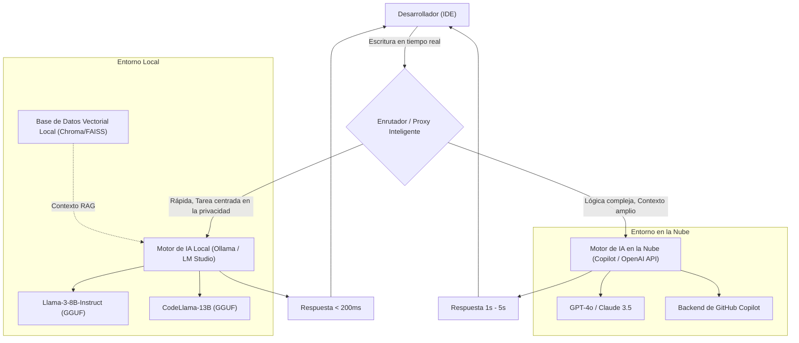
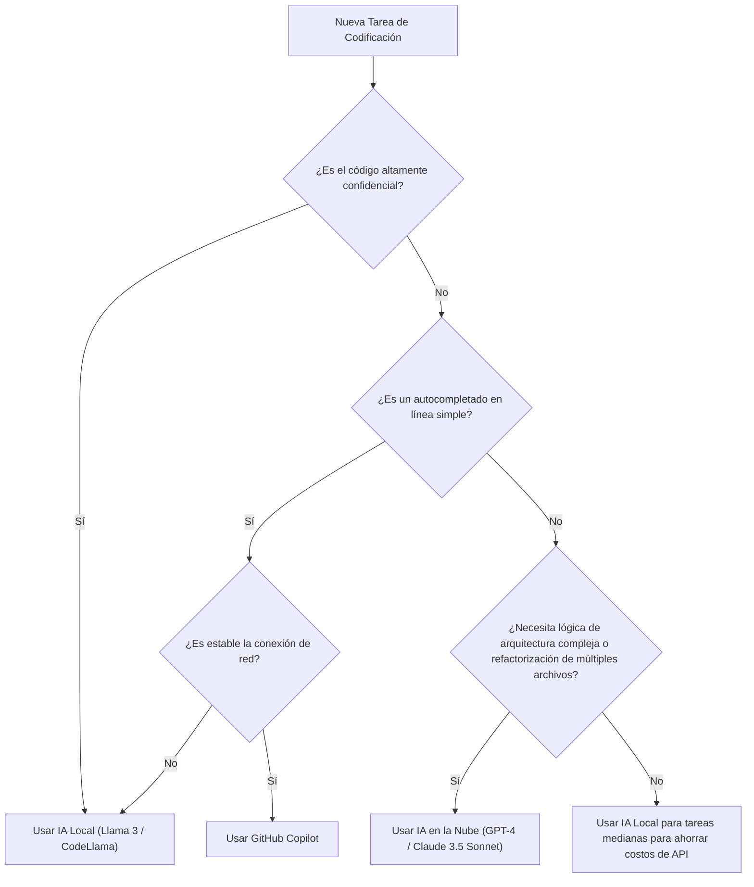

# Aumentar la eficiencia de desarrollo usando Copilot y la IA local: Guía completa del flujo de trabajo de desarrollo de IA híbrida

En el desarrollo de software moderno, la utilización de asistentes de IA ha evolucionado de ser una herramienta "útil de tener" a una infraestructura "indispensable". Especialmente desde la aparición de GitHub Copilot, la experiencia de codificación de los desarrolladores ha cambiado drásticamente. Sin embargo, depender de la IA en la nube para todas las tareas no siempre es la solución óptima.

Existen varios desafíos con la IA basada en la nube, tales como los riesgos de seguridad al manejar información confidencial corporativa (claves secretas, algoritmos propios, arquitecturas no publicadas), la latencia de las API y el trabajo en entornos fuera de línea donde no hay conexión de red. Por lo tanto, en los últimos años, ha habido una creciente atención en el uso de **modelos abiertos que se ejecutan localmente (IA local)** como Llama 3, CodeLlama y Mistral.

Este artículo explicará detalladamente cómo maximizar (aumentar) la eficiencia del desarrollo al combinar y utilizar adecuadamente la IA basada en la nube (como GitHub Copilot y GPT-4) y la IA local, cubriendo desde el diseño de la arquitectura hasta árboles de decisión específicos y el análisis matemático del costo y la latencia.

---

## 1. Comparación exhaustiva entre la IA en la nube y la IA local

Al construir un flujo de trabajo de desarrollo de IA híbrida, primero es importante comprender profundamente las características de cada una.

### 1.1 IA basada en la nube (GitHub Copilot, GPT-4, Claude 3.5 Sonnet)
El arma principal de la IA en la nube radica en su "tamaño de modelo abrumador" y "capacidad de razonamiento general". Debido a que se ejecutan en clústeres de GPU masivos, pueden ejecutar rápidamente modelos con cientos de miles de millones a billones de parámetros.

*   **Ventajas (Pros)**:
    *   **Poder de razonamiento incomparable**: No tienen igual en tareas que requieren una comprensión profunda del contexto, como identificar errores complejos, diseñar arquitecturas desde cero y realizar refactorizaciones avanzadas en múltiples archivos.
    *   **Gran ventana de contexto**: Los modelos más recientes tienen ventanas de contexto de 100k a 2M de tokens, lo que permite cargar y analizar toda la base de código de un proyecto a la vez.
    *   **Sin gestión de infraestructura**: Los desarrolladores no necesitan preocuparse por los recursos de la GPU ni por las actualizaciones de los modelos.
*   **Desventajas (Cons)**:
    *   **Privacidad y seguridad**: Como el código se envía a servidores externos, su uso puede estar restringido en empresas o proyectos que requieren un estricto cumplimiento.
    *   **Latencia**: Al depender de las condiciones de comunicación de la red, pueden producirse retrasos en el autocompletado en línea, que requiere respuestas de milisegundos.
    *   **Costo**: Incurre en un sistema de pago por uso o en costos de suscripción mensual, lo que hace que los costos de funcionamiento sean considerables a gran escala.

### 1.2 IA local (Llama 3, CodeLlama, Qwen2.5-Coder, etc.)
La IA local se ejecuta directamente en la máquina local del desarrollador (como una MacBook con Apple Silicon o una máquina Windows equipada con GPU de NVIDIA). Con los avances en las tecnologías de cuantización (GGUF, AWQ, GPTQ, etc.), los modelos en la clase de 8B a 70B pueden ahora ejecutarse a velocidades prácticas en PC de desarrollo estándar.

*   **Ventajas (Pros)**:
    *   **Privacidad absoluta**: Los datos nunca salen a redes externas. Es ideal para manejar proyectos ultrasecretos o bases de código bajo acuerdos de confidencialidad (NDA) estrictos.
    *   **Cero latencia de red**: Devuelve respuestas a una velocidad constante independientemente de la velocidad de la conexión a Internet.
    *   **Funcionamiento fuera de línea**: Permite el acceso a todas las funciones en entornos como aviones o áreas aisladas de redes externas por requisitos de seguridad.
    *   **Personalización infinita**: Permite el ajuste fino (fine-tuning) específico para un lenguaje o framework particular, y la integración de ingeniería de prompts personalizada libremente.
*   **Desventajas (Cons)**:
    *   **Requisitos de hardware**: Para un rendimiento fluido, se requiere una máquina equipada con suficiente VRAM (memoria de video) (por ejemplo: VRAM de 16 GB a 24 GB o más, o 32 GB o más de memoria unificada en chips de la serie M).
    *   **Límites de rendimiento del modelo**: Debido a las limitaciones de hardware, existe un límite en el tamaño de los modelos que se pueden ejecutar y, a menudo, se quedan cortos respecto al razonamiento lógico complejo del nivel de GPT-4.
    *   **Límites de la ventana de contexto**: Debido a las limitaciones de capacidad de la memoria, la longitud del contexto manejable suele estar limitada a entre miles y decenas de miles de tokens.

---

## 2. Diseño de arquitectura del flujo de trabajo de IA híbrida

Para obtener la mejor experiencia de desarrollo, debe integrar estas herramientas en un único IDE (ej. VS Code, Cursor, Neovim) y construir una arquitectura que permita cambiar entre ellas sin problemas.

El siguiente diagrama de Mermaid muestra una arquitectura híbrida que ilustra cómo los agentes locales y los servicios en la nube colaboran para distribuir las tareas de los desarrolladores.



El núcleo de esta arquitectura es la presencia del **Intelligent Router (Enrutador Inteligente)**. Dependiendo del contexto del código que el desarrollador está escribiendo, el nivel de confidencialidad del archivo objetivo y la complejidad de la tarea requerida, una extensión dentro del IDE enruta automática (o manual y rápidamente) entre los modelos locales y en la nube.

Por ejemplo, para el autocompletado de definiciones de funciones simples o la generación de código boilerplate, la tarea se enviará a un modelo local (como Llama 3 8B) que responde en decenas de milisegundos, mientras que las consultas sobre el diseño general del proyecto o los prompts de chat que involucran refactorizaciones a gran escala se enviarán al GPT-4 de la nube en una asignación dinámica.

---

## 3. Criterios de decisión: Árbol de decisión

Entonces, en una situación real de codificación, ¿cómo debería el desarrollador determinar "qué IA usar ahora"? Definiremos el flujo de toma de decisiones de manera visual utilizando el siguiente árbol de decisiones.



### 3.1 Criterio de evaluación 1: Confidencialidad (Privacy and Security)
Es el criterio de juicio más importante. Para código de prueba que contenga datos de clientes, cuya transmisión externa esté prohibida por la política de la empresa, o archivos que implementen algoritmos propietarios centrales, elija la IA local sin compromisos. Construir un RAG (Generación Aumentada por Recuperación) local, almacenar documentos internos de la empresa en un almacén de vectores y hacer que los LLM locales hagan referencia a ellos, también es un método muy efectivo.

### 3.2 Criterio de evaluación 2: Latencia (Latency)
Para no detener la velocidad del pensamiento, la latencia de completado es extremadamente importante. La IA en la nube siempre experimenta tiempos de viaje de ida y vuelta (RTT) de la red. Debido a que la IA local tiene una latencia de red cero, mantener un modelo ligero en la VRAM permite alcanzar velocidades percibidas superiores a las de la nube.

### 3.3 Criterio de evaluación 3: Ventana de contexto (Context Window)
Para los prompts como "Lee todos los archivos de este repositorio y organiza las dependencias", es indispensable una IA en la nube capaz de procesar más de 100k tokens. Intentar procesar decenas de miles de tokens con un modelo local puede agotar la memoria o causar una caída drástica en la velocidad de inferencia (por ejemplo, varios segundos por token).

---

## 4. Análisis matemático de costos y latencia (Mathematical Analysis)

Analicemos cuantitativamente los beneficios de un flujo de trabajo híbrido usando ecuaciones.

### 4.1 Modelo de cálculo de costos
El costo de utilizar exclusivamente API en la nube (ej. GPT-4) se expresa de la siguiente manera. El costo total por día en un proyecto de desarrollo, $C_{total}$, es la suma de multiplicar el número de tokens de entrada y salida de cada prompt por el precio unitario.

$$ C_{total} = \sum_{i=1}^{N} \left( P_{in} \times T_{in}^{(i)} + P_{out} \times T_{out}^{(i)} \right) $$

*   $N$ : Número diario de llamadas a la API
*   $P_{in}$ : Precio por 1 token de entrada
*   $P_{out}$ : Precio por 1 token de salida
*   $T_{in}^{(i)}$ : Número de tokens de entrada para la $i$-ésima llamada
*   $T_{out}^{(i)}$ : Número de tokens de salida para la $i$-ésima llamada

Si introducimos una IA local y asumimos que una proporción $\alpha$ (0 < $\alpha$ < 1) de las $N$ llamadas se puede descargar al modelo local, el nuevo costo de la API en la nube, $C_{hybrid}$, se reducirá de la siguiente manera.

$$ C_{hybrid} = (1 - \alpha) \sum_{i=1}^{N} \left( P_{in} \times T_{in}^{(i)} + P_{out} \times T_{out}^{(i)} \right) = (1 - \alpha) C_{total} $$

Incluso considerando la depreciación del hardware y los costos de electricidad, aumentar $\alpha$ a un 50%-70% puede producir reducciones de costos dramáticas a largo plazo.

### 4.2 Modelo de latencia (retraso)
Modelaremos el tiempo transcurrido desde que un usuario envía un prompt hasta que se muestra el primer carácter (Time To First Token: TTFT).

El retraso de la IA en la nube, $L_{cloud}$, se expresa con la siguiente fórmula.

$$ L_{cloud} = L_{network\_rtt} + L_{queue} + \frac{T_{in}}{S_{process\_cloud}} $$

*   $L_{network\_rtt}$ : Tiempo de viaje de ida y vuelta de la red (normalmente 20ms - 200ms)
*   $L_{queue}$ : Tiempo de espera en la cola del proveedor de la nube (aumenta durante la congestión)
*   $S_{process\_cloud}$ : Velocidad de procesamiento de tokens de la GPU de la nube (tokens/sec)

Por otro lado, la latencia de la IA local, $L_{local}$, es la siguiente.

$$ L_{local} = \frac{T_{in}}{S_{process\_local}} $$

Dado que el retraso de la red $L_{network\_rtt}$ y el retraso de la cola en la nube $L_{queue}$ se vuelven cero, si $S_{process\_local}$ (la velocidad de procesamiento de la GPU local) es lo suficientemente alta, se pueden lograr respuestas ultrarrápidas (TTFT) en cuestión de milisegundos. Esta es la razón por la cual la IA local puede ser la herramienta más poderosa en el autocompletado en línea.

---

## 5. Profundizando por escenarios de desarrollo: Casos de uso específicos

### Caso de uso 1: Generación de código boilerplate y autocompletado en línea con GitHub Copilot
*   **Escenario**: Al crear el esqueleto de un componente de React o escribir el manejo de errores estándar.
*   **Enfoque**: Esta es la especialidad de Copilot. Mientras escribe, lee constantemente el contexto en segundo plano y sugiere de manera precisa desde unas pocas hasta decenas de líneas de código. La experiencia de completar el código simplemente presionando la tecla "Tab" sin interrumpir sus pensamientos, aumenta la velocidad de desarrollo más directamente.

### Caso de uso 2: Refactorización de código confidencial con IA local (CodeLlama / Llama 3)
*   **Escenario**: Al refactorizar contraseñas de bases de datos, lógica de cifrado propia o la lógica central de una nueva característica no publicada.
*   **Enfoque**: Bloquear temporalmente el acceso a la red del IDE o usar una extensión dedicada para la IA local (ej., Continue.dev) y enviar prompts al modelo que se ejecuta localmente (como a través de Ollama). Puede recibir asistencia de la IA manteniendo el riesgo de filtración de datos en cero.

### Caso de uso 3: Diseño de arquitectura y corrección de errores complejos con un LLM en la nube (GPT-4 / Claude 3.5 Sonnet)
*   **Escenario**: Al analizar una pérdida de memoria de causa desconocida o realizar consultas de diseño de alto nivel como "¿Cuál es el mejor enfoque para dividir esta aplicación monolítica en microservicios?".
*   **Enfoque**: Tales tareas requieren un gran conocimiento previo y habilidades avanzadas de razonamiento lógico. Debe utilizar el modelo en la nube más inteligente disponible, incluso si eso conlleva un costo. Se proporcionan decenas de archivos como contexto y se le pide que proporcione un análisis profundo sobre "dónde está el problema".

---

## 6. Guía de configuración del entorno de IA local (Sección práctica)

Aquí presentaremos brevemente los pasos específicos para introducir una IA local. Actualmente, los enfoques más sencillos y poderosos son usar **Ollama** o **LM Studio**.

### 6.1 Introducción de Ollama
Ollama es un marco ligero para ejecutar LLM en su entorno local. Es compatible con MacOS, Windows y Linux, y permite administrar modelos de manera intuitiva, al igual que Docker.

```bash
# Para MacOS
brew install ollama

# Iniciar el servidor
ollama serve

# Descargar y ejecutar el modelo Llama 3 (8B)
ollama run llama3

# Ejecutar CodeLlama especializado en programación
ollama run codellama
```

### 6.2 Integración al editor (Uso de Continue.dev)
Para utilizar modelos locales en VS Code o JetBrains IDE, la extensión de código abierto **Continue** es excelente.
Simplemente especificando el servidor local de Ollama como un punto final en el archivo de configuración de Continue (`config.json`), se agregará una ventana de chat similar a ChatGPT y funciones de resaltado y edición de código dentro del IDE.

```json
{
  "models": [
    {
      "title": "Ollama Llama 3",
      "provider": "ollama",
      "model": "llama3",
      "apiBase": "http://localhost:11434"
    },
    {
      "title": "GPT-4",
      "provider": "openai",
      "model": "gpt-4",
      "apiKey": "sk-your-openai-api-key"
    }
  ],
  "tabAutocompleteModel": {
    "title": "Starcoder 2",
    "provider": "ollama",
    "model": "starcoder2"
  }
}
```
Al configurar de esta manera, los desarrolladores pueden alternar instantáneamente entre el "modelo local" y el "modelo en la nube" desde un menú desplegable según sea necesario, para chatear o realizar autocompletado.

---

## 7. El futuro del desarrollo asistido por IA: El surgimiento de los agentes autónomos

El flujo de trabajo híbrido actual se basa en un paradigma de copiloto (Copilot) donde "el humano le da instrucciones a la IA". Sin embargo, en unos años evolucionará aún más; un modelo ligero local monitoreará continuamente la base de código, ejecutará pruebas en segundo plano y solo invocará autónomamente modelos masivos en la nube para generar soluciones cuando detecte errores complejos. Se aproxima la era de los **agentes de IA autónomos estratificados**.

En ese momento, la PC local del desarrollador no será solo una pantalla que ejecuta un editor, sino que asumirá fuertemente el papel de primera línea como un motor de inferencia (IA perimetral / Edge AI). La continua expansión de la memoria (VRAM / memoria unificada) de las máquinas para desarrolladores por parte de NVIDIA y Apple, tiene este futuro en la mira.

---

## 8. Conclusión (Conclusion)

En lugar de una falsa dicotomía entre "GitHub Copilot en la nube" o "IA local", el entorno de desarrollo más fuerte en la actualidad es **un flujo de trabajo híbrido que comprende las fortalezas de ambos y los usa adecuadamente según la naturaleza de la tarea**.

*   **GitHub Copilot / API en la Nube**: Úselo para aumentar la velocidad general de desarrollo, diseñar lógica compleja y realizar un análisis de visión general de todo el proyecto.
*   **IA Local (Ollama, LM Studio)**: Úsela para manejar código altamente confidencial, en entornos fuera de línea, para autocompletado en línea ultrarrápido que elimina la latencia de la red, y para reducir los costos de la API.

Por favor, lleve su entorno de IDE al siguiente nivel usando el árbol de decisiones y la arquitectura presentados en este artículo como referencia. Al pasar de ser alguien que "usa" la IA a alguien que "las combina y las emplea donde corresponde", su eficiencia de desarrollo seguramente aumentará de manera explosiva.

Happy Coding with Hybrid AI!
