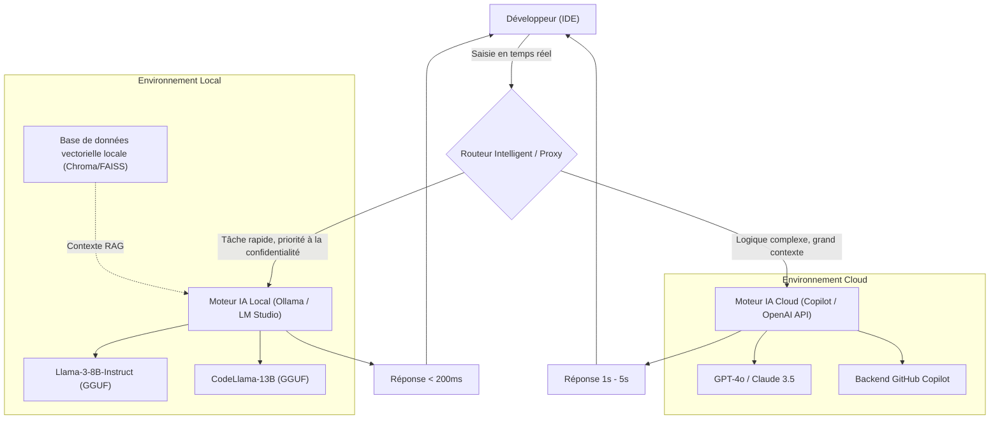
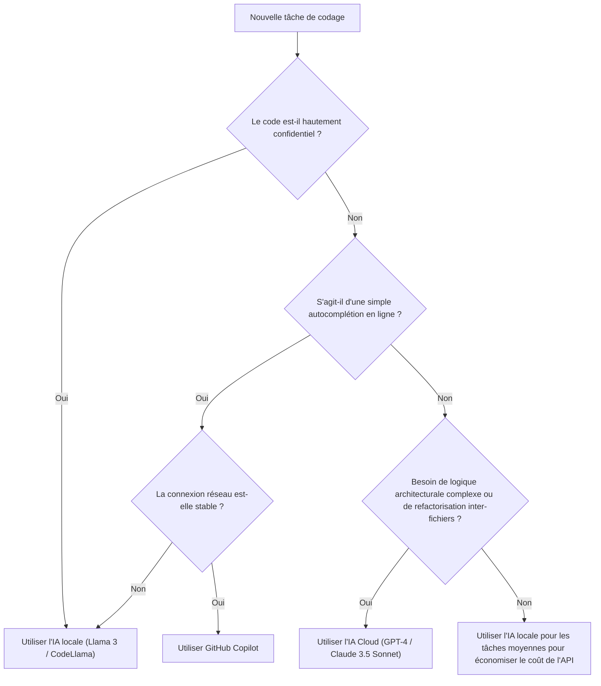

# Booster l'efficacité de développement en combinant Copilot et l'IA locale : le guide complet du flux de travail de développement IA hybride

Dans le développement logiciel moderne, l'utilisation d'assistants IA est passée d'un outil « pratique à avoir » à une infrastructure « indispensable ». Surtout depuis l'apparition de GitHub Copilot, l'expérience de codage des développeurs a radicalement changé. Cependant, s'appuyer sur l'IA dans le cloud pour toutes les tâches n'est pas toujours la solution optimale.

Lorsqu'il s'agit d'informations confidentielles d'entreprise (clés secrètes, algorithmes propriétaires, architectures non publiées), il existe plusieurs défis avec l'IA basée sur le cloud, tels que les risques de sécurité, la latence des API et le travail dans des environnements hors ligne sans connexion réseau. C'est pourquoi l'utilisation de **modèles ouverts fonctionnant localement (IA locale)** tels que Llama 3, CodeLlama et Mistral a rapidement attiré l'attention ces dernières années.

Cet article explique en détail comment maximiser (booster) l'efficacité de développement en combinant et en choisissant entre l'IA basée sur le cloud (GitHub Copilot, GPT-4, etc.) et l'IA locale, de la conception de l'architecture aux arbres de décision spécifiques, en passant par l'analyse mathématique des coûts et de la latence.

---

## 1. Comparaison approfondie entre l'IA cloud et l'IA locale

Pour construire un flux de travail de développement IA hybride, il est important de bien comprendre d'abord les caractéristiques de chacune.

### 1.1 IA basée sur le cloud (GitHub Copilot, GPT-4, Claude 3.5 Sonnet)
La plus grande arme de l'IA cloud réside dans sa « taille de modèle écrasante » et sa « capacité de raisonnement généraliste ». Fonctionnant sur des clusters GPU massifs, elle peut exécuter à grande vitesse des modèles de l'ordre de dizaines de milliards à des billions de paramètres.

*   **Avantages (Pros)** :
    *   **Capacité de raisonnement inégalée** : Rien ne la surpasse pour les tâches nécessitant une compréhension approfondie du contexte, telles que l'identification de bugs complexes, la conception d'architectures à partir de zéro et les refactorisations avancées s'étendant sur plusieurs fichiers.
    *   **Fenêtre de contexte gigantesque** : Les modèles récents disposent d'une fenêtre de contexte de 100k à 2M de tokens, permettant de charger et d'analyser d'un coup l'ensemble de la base de code d'un projet.
    *   **Aucune gestion d'infrastructure requise** : Les développeurs n'ont pas à se soucier des ressources GPU ou des mises à jour des modèles.
*   **Inconvénients (Cons)** :
    *   **Confidentialité et sécurité** : Étant donné que le code est envoyé à des serveurs externes, son utilisation peut être restreinte dans les entreprises ou les projets nécessitant une conformité stricte.
    *   **Latence** : Dépendant de l'état de la communication réseau, des retards peuvent survenir dans l'autocomplétion en ligne où des réponses de l'ordre de la milliseconde sont requises.
    *   **Coût** : Une facturation à l'usage ou des frais d'abonnement mensuels s'appliquent, et les coûts de fonctionnement ne peuvent être ignorés pour une utilisation à grande échelle.

### 1.2 IA locale (Llama 3, CodeLlama, Qwen2.5-Coder, etc.)
L'IA locale est un modèle exécuté directement sur la machine locale du développeur (comme un MacBook avec Apple Silicon ou une machine Windows équipée d'un GPU NVIDIA). Grâce aux avancées des technologies de quantification (GGUF, AWQ, GPTQ, etc.), les modèles de la classe 8B à 70B peuvent désormais fonctionner à des vitesses pratiques sur des PC de développement grand public.

*   **Avantages (Pros)** :
    *   **Confidentialité absolue** : Aucune donnée ne quitte le réseau externe. Idéal pour traiter des projets top secrets ou des bases de code sous accords de confidentialité (NDA) stricts.
    *   **Zéro latence réseau** : Indépendant de la vitesse de la connexion Internet, il renvoie toujours des réponses à une vitesse constante.
    *   **Fonctionnement hors ligne** : Vous pouvez utiliser toutes les fonctionnalités même dans un avion ou dans un environnement isolé du réseau externe pour des raisons de sécurité.
    *   **Personnalisation illimitée** : Vous pouvez librement effectuer un ajustement fin (fine-tuning) spécialisé pour des langages ou frameworks spécifiques, et intégrer votre propre ingénierie de prompt.
*   **Inconvénients (Cons)** :
    *   **Exigences matérielles** : Pour fonctionner confortablement, une machine avec suffisamment de VRAM (mémoire vidéo) est requise (ex : VRAM 16 Go à 24 Go ou plus, ou 32 Go de mémoire unifiée ou plus sur les puces de la série M).
    *   **Limites de performance du modèle** : En raison de contraintes matérielles, il y a une limite à la taille des modèles exécutables, qui sont souvent en deçà du raisonnement logique complexe d'un modèle de la classe GPT-4.
    *   **Restriction de la fenêtre de contexte** : En raison des contraintes de capacité mémoire, la longueur du contexte gérable est généralement limitée à quelques milliers ou dizaines de milliers de tokens.

---

## 2. Conception de l'architecture du flux de travail IA hybride

Pour obtenir la meilleure expérience de développement, il est nécessaire d'intégrer ces outils dans un seul IDE (ex : VS Code, Cursor, Neovim) et de construire une architecture permettant de basculer de manière transparente entre eux.

Le diagramme Mermaid suivant montre l'architecture hybride illustrant comment l'agent local et le service cloud collaborent pour distribuer les tâches du développeur.



L'élément clé de cette architecture est la présence d'un **Intelligent Router (Routeur Intelligent)**. Selon le contexte du code écrit par le développeur, le niveau de confidentialité du fichier cible et la complexité de la tâche demandée, une extension au sein de l'IDE achemine automatiquement (ou manuellement très rapidement) vers le modèle local ou le modèle cloud.

Par exemple, s'il s'agit d'une simple complétion de définition de fonction ou de génération de boilerplate, la tâche est envoyée à un modèle local (comme Llama 3 8B) qui répond en quelques dizaines de millisecondes. Pour les questions impliquant la conception globale du projet ou des requêtes de chat impliquant une refactorisation à grande échelle, le processus est acheminé dynamiquement vers GPT-4 dans le cloud.

---

## 3. Critères de décision pour l'utilisation : Arbre de décision

Dans la pratique du codage, comment les développeurs doivent-ils déterminer « quelle IA utiliser maintenant » ? Nous définissons visuellement le flux de décision à l'aide de l'arbre de décision suivant.



### 3.1 Critère d'évaluation 1 : Confidentialité (Privacy and Security)
C'est le critère de jugement le plus important. Pour le code de test contenant des données clients dont l'envoi externe est interdit par la politique de l'entreprise, ou les fichiers implémentant des algorithmes propriétaires fondamentaux, l'IA locale est choisie sans aucun compromis. Une méthode très efficace consiste à construire une RAG (génération augmentée par la recherche) locale, à stocker les documents internes dans un magasin vectoriel et à laisser le LLM local s'y référer.

### 3.2 Critère d'évaluation 2 : Latence (Latency)
Pour ne pas interrompre le fil de la pensée, la latence de l'autocomplétion est extrêmement importante. L'IA cloud subit inévitablement le temps d'aller-retour du réseau (RTT). L'IA locale ayant une latence réseau nulle, si un modèle léger est conservé en VRAM, il est possible d'obtenir une vitesse perçue supérieure à celle du cloud.

### 3.3 Critère d'évaluation 3 : Fenêtre de contexte (Context Window)
Pour des requêtes telles que « Lis tous les fichiers de ce dépôt et organise les dépendances », une IA cloud capable de traiter plus de 100k tokens est indispensable. Si vous essayez de traiter des dizaines de milliers de tokens avec un modèle local, la mémoire s'épuisera ou la vitesse d'inférence chutera considérablement (par exemple, plusieurs secondes par token).

---

## 4. Analyse mathématique des coûts et de la latence (Mathematical Analysis)

Analysons quantitativement les avantages du flux de travail hybride à l'aide de formules mathématiques.

### 4.1 Modèle de calcul des coûts
Modélisons le coût lors de l'utilisation exclusive d'une API cloud (ex : GPT-4). Le coût total $C_{total}$ par jour dans un projet de développement est la somme du nombre de tokens d'entrée et de sortie pour chaque requête, multiplié par le prix unitaire.

$$ C_{total} = \sum_{i=1}^{N} \left( P_{in} \times T_{in}^{(i)} + P_{out} \times T_{out}^{(i)} \right) $$

*   $N$ : Nombre d'appels API par jour
*   $P_{in}$ : Prix pour 1 token d'entrée
*   $P_{out}$ : Prix pour 1 token de sortie
*   $T_{in}^{(i)}$ : Nombre de tokens d'entrée pour le $i$-ème appel
*   $T_{out}^{(i)}$ : Nombre de tokens de sortie pour le $i$-ème appel

En introduisant une IA locale, si nous supposons qu'une proportion $\alpha$ (0 < $\alpha$ < 1) des $N$ appels peut être déchargée vers le modèle local, le nouveau coût de l'API cloud $C_{hybrid}$ sera réduit comme suit :

$$ C_{hybrid} = (1 - \alpha) \sum_{i=1}^{N} \left( P_{in} \times T_{in}^{(i)} + P_{out} \times T_{out}^{(i)} \right) = (1 - \alpha) C_{total} $$

Même en tenant compte de l'amortissement du matériel et des coûts d'électricité, si $\alpha$ peut être augmenté à 50% - 70%, cela aura un effet de réduction des coûts spectaculaire à long terme.

### 4.2 Modèle de latence (Retard)
Modélisons le temps depuis le moment où l'utilisateur envoie une requête jusqu'à l'affichage du premier caractère (Time To First Token : TTFT).

La latence de l'IA cloud $L_{cloud}$ est exprimée par la formule suivante :

$$ L_{cloud} = L_{network\_rtt} + L_{queue} + \frac{T_{in}}{S_{process\_cloud}} $$

*   $L_{network\_rtt}$ : Temps d'aller-retour du réseau (généralement 20ms - 200ms)
*   $L_{queue}$ : Temps d'attente dans la file d'attente côté fournisseur de cloud (augmente en cas de congestion)
*   $S_{process\_cloud}$ : Vitesse de traitement des tokens du GPU cloud (tokens/sec)

D'autre part, la latence de l'IA locale $L_{local}$ est la suivante :

$$ L_{local} = \frac{T_{in}}{S_{process\_local}} $$

Puisque le délai réseau $L_{network\_rtt}$ et le délai de file d'attente cloud $L_{queue}$ deviennent nuls, si $S_{process\_local}$ (vitesse de traitement du GPU local) est suffisamment élevé, une réponse ultra-rapide (TTFT) de l'ordre de quelques millisecondes est obtenue. C'est la raison pour laquelle l'IA locale peut devenir l'outil ultime pour l'autocomplétion en ligne.

---

## 5. Par scénario de développement : Exploration des cas d'utilisation spécifiques

### Cas d'utilisation 1 : Génération de boilerplate et autocomplétion en ligne avec GitHub Copilot
*   **Scénario** : Situations où l'on crée le squelette d'un composant React ou où l'on écrit une gestion des erreurs standard.
*   **Approche** : C'est le domaine de prédilection de Copilot. Lors de la saisie, il lit constamment le contexte en arrière-plan et propose avec précision de quelques lignes à des dizaines de lignes de code. L'expérience de voir le code se compléter d'une simple pression sur la touche « Tab » sans interrompre sa pensée augmente de la manière la plus directe la vitesse de développement.

### Cas d'utilisation 2 : Refactorisation de code confidentiel avec une IA locale (CodeLlama / Llama 3)
*   **Scénario** : Situations où l'on souhaite refactoriser des mots de passe de base de données, une logique de chiffrement propriétaire ou la logique principale d'une nouvelle fonctionnalité non annoncée.
*   **Approche** : Bloquez temporairement l'accès réseau de l'IDE ou utilisez une extension dédiée à l'IA locale (ex : Continue.dev, etc.) pour envoyer la requête à un modèle fonctionnant localement (via Ollama, etc.). Vous pouvez bénéficier de l'assistance de l'IA tout en maintenant à zéro le risque de fuite de données.

### Cas d'utilisation 3 : Conception d'architecture et correction de bugs complexes avec un LLM Cloud (GPT-4 / Claude 3.5 Sonnet)
*   **Scénario** : Analyse d'une fuite de mémoire d'origine inconnue ou consultation de conception de haut niveau telle que « Quelle est la meilleure approche pour diviser cette application monolithique en microservices ? ».
*   **Approche** : De telles tâches nécessitent une énorme connaissance préalable et des capacités de raisonnement logique avancées. Vous devriez utiliser le modèle cloud le plus intelligent, même si cela a un coût. Passez des dizaines de fichiers en contexte pour lui permettre de comprendre en profondeur « où se trouve le problème ».

---

## 6. Guide de configuration de l'environnement pour l'IA locale (Pratique)

Nous présentons brièvement les étapes spécifiques pour introduire une IA locale. L'approche la plus simple et la plus puissante actuellement est d'utiliser **Ollama** ou **LM Studio**.

### 6.1 Introduction d'Ollama
Ollama est un framework léger pour exécuter des LLMs dans un environnement local. Compatible avec MacOS, Windows et Linux, il permet de gérer intuitivement les modèles, à la manière de Docker.

```bash
# Pour MacOS
brew install ollama

# Démarrer le serveur
ollama serve

# Télécharger et exécuter le modèle Llama 3 (8B)
ollama run llama3

# Exécuter CodeLlama, spécialisé pour la programmation
ollama run codellama
```

### 6.2 Intégration à l'éditeur (Utilisation de Continue.dev)
Pour exploiter les modèles locaux dans VS Code ou JetBrains IDE, l'extension open source **Continue** est excellente.
En spécifiant simplement le serveur Ollama local comme endpoint dans le fichier de configuration de Continue (`config.json`), une fenêtre de chat de type ChatGPT et des fonctions de surbrillance et d'édition de code sont ajoutées à l'IDE.

```json
{
  "models": [
    {
      "title": "Ollama Llama 3",
      "provider": "ollama",
      "model": "llama3",
      "apiBase": "http://localhost:11434"
    },
    {
      "title": "GPT-4",
      "provider": "openai",
      "model": "gpt-4",
      "apiKey": "sk-your-openai-api-key"
    }
  ],
  "tabAutocompleteModel": {
    "title": "Starcoder 2",
    "provider": "ollama",
    "model": "starcoder2"
  }
}
```
Avec cette configuration, les développeurs peuvent basculer instantanément entre le « modèle local » et le « modèle cloud » via un menu déroulant, selon les besoins, pour effectuer des discussions ou de l'autocomplétion.

---

## 7. L'avenir du développement assisté par l'IA : L'essor des agents autonomes

Le flux de travail hybride actuel est basé sur le paradigme du copilote (Copilot) où « un humain donne des instructions à l'IA ». Cependant, dans quelques années, il évoluera davantage vers l'ère des **agents IA autonomes hiérarchisés**, où un modèle local léger surveillera constamment la base de code, exécutera des tests en arrière-plan et, uniquement lorsqu'il détectera des erreurs complexes, appellera de manière autonome un grand modèle cloud pour générer une solution.

À ce moment-là, le PC local du développeur ne sera plus un simple écran faisant tourner un éditeur, mais jouera un rôle fort en tant que première ligne du moteur d'inférence (Edge AI). C'est en prévision de cet avenir que NVIDIA et Apple continuent d'augmenter la mémoire (VRAM / mémoire unifiée) des machines destinées aux développeurs.

---

## 8. Conclusion (Conclusion)

Plutôt qu'une opposition binaire entre « GitHub Copilot dans le cloud » et « IA locale », c'est le **flux de travail hybride qui comprend les forces des deux et les utilise de manière appropriée selon la nature de la tâche** qui constitue l'environnement de développement ultime à l'heure actuelle.

*   **GitHub Copilot / API Cloud** : À utiliser pour améliorer la vitesse de développement globale, concevoir des logiques complexes et analyser le projet dans son ensemble de manière panoramique.
*   **IA Locale (Ollama, LM Studio)** : À utiliser pour traiter du code hautement confidentiel, dans des environnements hors ligne, pour une autocomplétion en ligne ultra-rapide éliminant la latence réseau, et pour réduire les coûts d'API.

N'hésitez pas à faire passer votre environnement IDE au niveau supérieur en vous référant aux arbres de décision et aux architectures présentés dans cet article. En passant du statut d'« utilisateur » d'IA à celui de personne qui « combine et utilise l'IA au bon endroit », votre efficacité de développement sera assurément propulsée (boostée).

Happy Coding with Hybrid AI!
