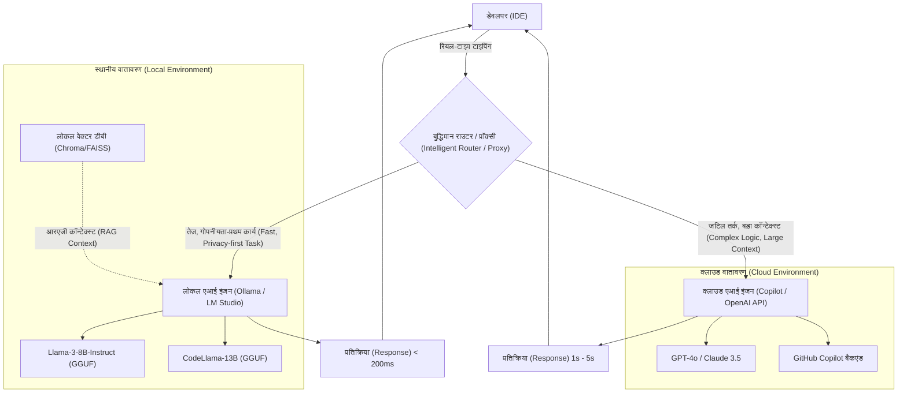
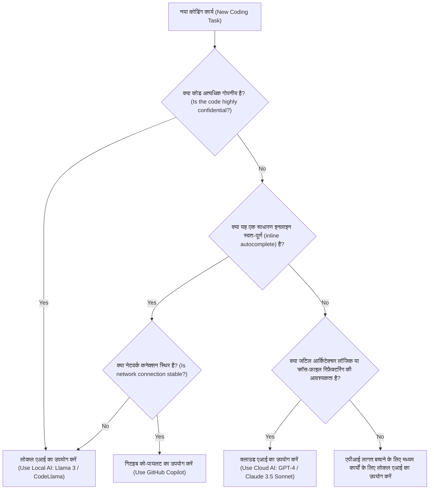

# को-पायलट और लोकल एआई के उपयोग से विकास दक्षता को बढ़ाएं: हाइब्रिड एआई डेवलपमेंट वर्कफ़्लो की संपूर्ण मार्गदर्शिका

आधुनिक सॉफ़्टवेयर विकास (डेवलपमेंट) में, एआई असिस्टेंट का उपयोग "सुविधाजनक" टूल से बढ़कर "अत्यावश्यक" बुनियादी ढाँचे (इंफ्रास्ट्रक्चर) में विकसित हो गया है। विशेष रूप से गिटहब को-पायलट (GitHub Copilot) के आने के बाद से, डेवलपर्स का कोडिंग अनुभव नाटकीय रूप से बदल गया है। हालाँकि, सभी कार्यों के लिए क्लाउड-आधारित एआई पर निर्भर रहना हमेशा सबसे अच्छा समाधान नहीं होता है।

कॉर्पोरेट गोपनीय जानकारी (सीक्रेट कीज़, मालिकाना एल्गोरिदम, अप्रकाशित आर्किटेक्चर) को संभालते समय सुरक्षा जोखिम, एपीआई (API) विलंबता (लेटेंसी), और यहां तक कि ऑफ़लाइन वातावरण में काम करना जहां कोई नेटवर्क कनेक्शन नहीं है; क्लाउड-आधारित एआई के साथ कई चुनौतियाँ हैं। इसलिए, हाल के वर्षों में Llama 3, CodeLlama और Mistral जैसे **स्थानीय रूप से चलने वाले ओपन मॉडल (लोकल एआई)** का उपयोग तेजी से ध्यान आकर्षित कर रहा है।

इस लेख में, हम विस्तार से बताएंगे कि विकास दक्षता को अधिकतम करने (बढ़ाने) के लिए क्लाउड-आधारित एआई (जैसे गिटहब को-पायलट और जीपीटी-4) और लोकल एआई को कैसे संयोजित और उपयोग किया जाए, जिसमें आर्किटेक्चर डिज़ाइन, विशिष्ट निर्णय वृक्ष (डिसीजन ट्री), और लागत व विलंबता का गणितीय विश्लेषण शामिल है।

---

## 1. क्लाउड एआई और लोकल एआई की विस्तृत तुलना

हाइब्रिड एआई डेवलपमेंट वर्कफ़्लो का निर्माण करते समय, सबसे पहले प्रत्येक की विशेषताओं को गहराई से समझना महत्वपूर्ण है।

### 1.1 क्लाउड-आधारित एआई (GitHub Copilot, GPT-4, Claude 3.5 Sonnet)
क्लाउड एआई का सबसे बड़ा हथियार इसका "विशाल मॉडल आकार" और "सामान्य प्रयोजन अनुमान क्षमता (जनरल-पर्पज इन्फेरेंस एबिलिटी)" है। चूंकि यह विशाल जीपीयू (GPU) क्लस्टर पर चलता है, इसलिए यह उच्च गति पर दसियों अरबों से लेकर खरबों मापदंडों (पैरामीटर्स) के पैमाने वाले मॉडल चला सकता है।

*   **फायदे (Pros)**:
    *   **अतुलनीय तर्क शक्ति (इन्फेरेंस पावर)**: जटिल बग्स की पहचान करने, शून्य-आधारित आर्किटेक्चर डिज़ाइन करने, और कई फ़ाइलों में उन्नत रिफ़ैक्टरिंग करने जैसे कार्यों में, जहाँ संदर्भ की गहरी समझ की आवश्यकता होती है, इनका कोई मुकाबला नहीं है।
    *   **विशाल कॉन्टेक्स्ट विंडो**: नवीनतम मॉडलों में 100k से 2M टोकन की कॉन्टेक्स्ट विंडो होती है, जो आपको पूरे प्रोजेक्ट के कोडबेस को एक ही बार में लोड करने और उसका विश्लेषण करने की अनुमति देती है।
    *   **बुनियादी ढांचे (इंफ्रास्ट्रक्चर) प्रबंधन की आवश्यकता नहीं**: डेवलपर्स को जीपीयू संसाधनों या मॉडल अपडेट के बारे में चिंता करने की आवश्यकता नहीं होती है।
*   **नुकसान (Cons)**:
    *   **गोपनीयता और सुरक्षा**: चूंकि कोड बाहरी सर्वर पर भेजा जाता है, इसलिए सख्त अनुपालन (कंप्लायंस) की आवश्यकता वाली कंपनियों या परियोजनाओं में इसका उपयोग प्रतिबंधित हो सकता है।
    *   **विलंबता (लेटेंसी)**: चूंकि यह नेटवर्क संचार स्थितियों पर निर्भर करता है, इसलिए इनलाइन स्वतः-पूर्णता (ऑटो-कम्प्लीशन) में देरी हो सकती है जिसके लिए मिलीसेकंड के स्तर के रिस्पांस की आवश्यकता होती है।
    *   **लागत**: उपयोग के आधार पर भुगतान या मासिक सदस्यता शुल्क लिया जाता है, और बड़े पैमाने पर उपयोग करने पर रनिंग कॉस्ट (चलने की लागत) को नजरअंदाज नहीं किया जा सकता है।

### 1.2 लोकल एआई (Llama 3, CodeLlama, Qwen2.5-Coder आदि)
लोकल एआई ऐसे मॉडल हैं जो सीधे डेवलपर की लोकल मशीन (जैसे Apple Silicon वाले MacBook या NVIDIA GPU वाली Windows मशीन) पर चलते हैं। क्वांटाइजेशन तकनीक (GGUF, AWQ, GPTQ आदि) के विकास के साथ, 8B से 70B क्लास के मॉडल अब सामान्य विकास पीसी पर भी व्यावहारिक गति से काम कर सकते हैं।

*   **फायदे (Pros)**:
    *   **सर्वोत्तम गोपनीयता (अल्टीमेट प्राइवेसी)**: डेटा कभी भी बाहरी नेटवर्क पर नहीं जाता है। यह शीर्ष-गुप्त परियोजनाओं (टॉप-सीक्रेट प्रोजेक्ट्स) या सख्त एनडीए (NDA) के अंतर्गत आने वाले कोडबेस को संभालने के लिए आदर्श है।
    *   **शून्य नेटवर्क विलंबता**: यह इंटरनेट कनेक्शन की गति पर निर्भर नहीं करता है और हमेशा निरंतर गति से प्रतिक्रिया (रिस्पांस) देता है।
    *   **ऑफ़लाइन वातावरण में संचालन**: पूर्ण कार्यक्षमता हवाई जहाज पर या सुरक्षा आवश्यकताओं के कारण बाहरी नेटवर्क से अलग-थलग वातावरण में भी उपलब्ध है।
    *   **असीमित अनुकूलन (कस्टमाइज़ेशन)**: आप किसी विशिष्ट भाषा या फ्रेमवर्क के लिए फ़ाइन-ट्यून कर सकते हैं, या स्वतंत्र रूप से अपनी स्वयं की प्रॉम्प्ट इंजीनियरिंग को शामिल कर सकते हैं।
*   **नुकसान (Cons)**:
    *   **हार्डवेयर आवश्यकताएँ**: इसे सुचारू रूप से चलाने के लिए, पर्याप्त वीआरएएम (वीडियो मेमोरी) वाली मशीन (जैसे: VRAM 16GB-24GB या अधिक, या एम-सीरीज़ चिप की 32GB या अधिक एकीकृत मेमोरी) की आवश्यकता होती है।
    *   **मॉडल प्रदर्शन सीमाएँ**: हार्डवेयर की कमी के कारण, चलाए जा सकने वाले मॉडल का आकार सीमित होता है, और कई मामलों में यह जीपीटी-4 (GPT-4) वर्ग के जटिल तार्किक अनुमान से मेल नहीं खा सकता है।
    *   **कॉन्टेक्स्ट विंडो की सीमाएँ**: मेमोरी क्षमता की कमी के कारण, जो कॉन्टेक्स्ट लंबाई संभाली जा सकती है वह आम तौर पर कुछ हज़ार से लेकर हज़ारों टोकन तक सीमित होती है।

---

## 2. हाइब्रिड एआई वर्कफ़्लो का आर्किटेक्चर डिज़ाइन

सर्वोत्तम विकास अनुभव प्राप्त करने के लिए, इन उपकरणों को एकल आईडीई (IDE) (जैसे: VS Code, Cursor, Neovim) में एकीकृत करना और एक ऐसा आर्किटेक्चर बनाना आवश्यक है जिसे निर्बाध रूप से स्विच किया जा सके।

नीचे दिया गया मरमेड (Mermaid) आरेख एक हाइब्रिड आर्किटेक्चर दिखाता है जो यह दर्शाता है कि लोकल एजेंट और क्लाउड सेवाएँ एक साथ कैसे काम करते हैं और डेवलपर के कार्यों को कैसे वितरित करते हैं।



इस आर्किटेक्चर का मूल **बुद्धिमान राउटर (Intelligent Router)** का अस्तित्व है। डेवलपर द्वारा लिखे जा रहे कोड के संदर्भ, लक्षित फ़ाइल के गोपनीयता स्तर और आवश्यक कार्य की जटिलता के आधार पर, आईडीई (IDE) में एक्सटेंशन स्वचालित रूप से (या मैन्युअल रूप से और जल्दी से) लोकल मॉडल और क्लाउड मॉडल के बीच रूट करता है।

उदाहरण के लिए, एक साधारण फ़ंक्शन परिभाषा के स्वतः पूर्ण होने (ऑटो-कम्प्लीशन) या बॉयलरप्लेट निर्माण के लिए, कार्य को एक लोकल मॉडल (जैसे Llama 3 8B) में रूट किया जा सकता है जो दसियों मिलीसेकंड में प्रतिक्रिया करता है, जबकि संपूर्ण प्रोजेक्ट डिज़ाइन से जुड़े प्रश्न या बड़े पैमाने पर रिफ़ैक्टरिंग वाले चैट प्रॉम्प्ट क्लाउड के जीपीटी-4 (GPT-4) को भेजे जाते हैं। यह गतिशील आवंटन (डायनामिक राउटिंग) प्रदान करता है।

---

## 3. उपयोग के मानदंड: निर्णय वृक्ष (डिसीजन ट्री)

तो, वास्तविक कोडिंग वातावरण में, एक डेवलपर को यह कैसे तय करना चाहिए कि "मुझे अभी किस एआई का उपयोग करना चाहिए"? हम नीचे दिए गए निर्णय वृक्ष (डिसीजन ट्री) का उपयोग करके निर्णय प्रवाह को दृष्टिगत रूप से परिभाषित करेंगे।



### 3.1 मूल्यांकन अक्ष 1: गोपनीयता और सुरक्षा (Privacy and Security)
यह सबसे महत्वपूर्ण मानदंड है। परीक्षण कोड जिसमें ग्राहक डेटा शामिल है जिसे कॉर्पोरेट नीति द्वारा बाहरी रूप से भेजे जाने से प्रतिबंधित किया गया है, या ऐसी फ़ाइलें जो मूल मालिकाना एल्गोरिदम लागू करती हैं, उनके लिए बिना किसी समझौते के लोकल एआई चुनें। लोकल रूप से आरएजी (RAG - रिट्रीवल-ऑगमेंटेड जेनरेशन) बनाना, आंतरिक दस्तावेज़ों को एक वेक्टर स्टोर में संग्रहीत करना और लोकल एलएलएम (LLM) को उनका संदर्भ देना भी एक बहुत प्रभावी तरीका है।

### 3.2 मूल्यांकन अक्ष 2: विलंबता (Latency)
विचार की गति को धीमा होने से रोकने के लिए ऑटो-कम्प्लीशन की विलंबता (लेटेंसी) बहुत महत्वपूर्ण है। क्लाउड एआई में हमेशा नेटवर्क राउंड-ट्रिप टाइम (RTT) होता है। चूँकि लोकल एआई में शून्य नेटवर्क विलंब होता है, यदि आप वीआरएएम (VRAM) में एक हल्का मॉडल रखते हैं, तो आप ऐसी गति का अनुभव कर सकते हैं जो क्लाउड से भी तेज़ हो।

### 3.3 मूल्यांकन अक्ष 3: कॉन्टेक्स्ट विंडो (Context Window)
"इस रिपॉजिटरी की सभी फ़ाइलों को पढ़ें और निर्भरता (डिपेंडेंसी) को व्यवस्थित करें" जैसे प्रॉम्प्ट के लिए, 100k से अधिक टोकन संसाधित करने में सक्षम क्लाउड एआई आवश्यक है। यदि आप एक लोकल मॉडल पर हज़ारों टोकन संसाधित करने का प्रयास करते हैं, तो आपकी मेमोरी समाप्त हो जाएगी या अनुमान की गति (इन्फेरेंस स्पीड) नाटकीय रूप से गिर जाएगी (जैसे कि प्रति टोकन कई सेकंड)।

---

## 4. लागत और विलंबता का गणितीय विश्लेषण (Mathematical Analysis)

आइए गणितीय सूत्रों का उपयोग करके हाइब्रिड वर्कफ़्लो के लाभों का मात्रात्मक रूप से विश्लेषण करें।

### 4.1 लागत गणना मॉडल
हम केवल क्लाउड एपीआई (उदाहरण: GPT-4) का उपयोग करते समय होने वाली लागत को सूत्रबद्ध करते हैं। एक विकास परियोजना (डेवलपमेंट प्रोजेक्ट) में प्रति दिन की कुल लागत $C_{total}$ प्रत्येक प्रॉम्प्ट के लिए इनपुट टोकन की संख्या और आउटपुट टोकन की संख्या को उनकी इकाई मूल्य से गुणा करने का योग है।

$$ C_{total} = \sum_{i=1}^{N} \left( P_{in} \times T_{in}^{(i)} + P_{out} \times T_{out}^{(i)} \right) $$

*   $N$ : प्रति दिन एपीआई (API) कॉल की संख्या
*   $P_{in}$ : प्रति इनपुट टोकन मूल्य
*   $P_{out}$ : प्रति आउटपुट टोकन मूल्य
*   $T_{in}^{(i)}$ : $i$-वें कॉल के लिए इनपुट टोकन की संख्या
*   $T_{out}^{(i)}$ : $i$-वें कॉल के लिए आउटपुट टोकन की संख्या

यह मानते हुए कि लोकल एआई पेश किया गया है और कॉल की संख्या $N$ का अनुपात $\alpha$ (0 < $\alpha$ < 1) लोकल मॉडल पर ऑफ़लोड किया जा सकता है, नई क्लाउड एपीआई (API) लागत $C_{hybrid}$ को निम्नानुसार कम किया जाता है:

$$ C_{hybrid} = (1 - \alpha) \sum_{i=1}^{N} \left( P_{in} \times T_{in}^{(i)} + P_{out} \times T_{out}^{(i)} \right) = (1 - \alpha) C_{total} $$

हार्डवेयर मूल्यह्रास (डेप्रिसिएशन) और बिजली की लागत को ध्यान में रखते हुए भी, यदि $\alpha$ को 50% से 70% तक बढ़ाया जा सकता है, तो इसके परिणामस्वरूप लंबी अवधि में लागत में भारी कमी आएगी।

### 4.2 विलंबता (लेटेंसी) मॉडल
उपयोगकर्ता द्वारा प्रॉम्प्ट सबमिट करने से लेकर पहले वर्ण (कैरेक्टर) के प्रदर्शित होने तक के समय को हम मॉडल करते हैं (Time To First Token: TTFT)।

क्लाउड एआई विलंबता $L_{cloud}$ को निम्नलिखित सूत्र द्वारा व्यक्त किया जाता है:

$$ L_{cloud} = L_{network\_rtt} + L_{queue} + \frac{T_{in}}{S_{process\_cloud}} $$

*   $L_{network\_rtt}$ : नेटवर्क राउंड-ट्रिप समय (आमतौर पर 20ms - 200ms)
*   $L_{queue}$ : क्लाउड प्रदाता के अंत में कतार प्रतीक्षा समय (भीड़ के दौरान बढ़ता है)
*   $S_{process\_cloud}$ : क्लाउड जीपीयू (GPU) की टोकन प्रसंस्करण (प्रोसेसिंग) गति (टोकन/सेकंड)

दूसरी ओर, लोकल एआई विलंबता $L_{local}$ इस प्रकार है:

$$ L_{local} = \frac{T_{in}}{S_{process\_local}} $$

चूंकि नेटवर्क विलंबता $L_{network\_rtt}$ और क्लाउड कतार विलंबता $L_{queue}$ शून्य हो जाते हैं, यदि $S_{process\_local}$ (लोकल जीपीयू की प्रसंस्करण गति) काफी अधिक है, तो मिलीसेकंड स्तर पर अल्ट्रा-फास्ट रिस्पांस (TTFT) प्राप्त किया जा सकता है। यही कारण है कि लोकल एआई इनलाइन स्वतः-पूर्णता (ऑटो-कम्प्लीशन) के लिए सबसे शक्तिशाली उपकरण बन सकता है।

---

## 5. विकास परिदृश्य द्वारा: विशिष्ट उपयोग के मामलों (Use Cases) का गहराई से विश्लेषण

### उपयोग का मामला 1: गिटहब को-पायलट द्वारा बॉयलरप्लेट जनरेशन और इनलाइन स्वतः पूर्णता
*   **परिदृश्य (Scenario)**: जब आपको रिएक्ट (React) घटक का ढांचा बनाना हो, या नियमित त्रुटि निवारण (एरर हैंडलिंग) कोड लिखना हो।
*   **दृष्टिकोण (Approach)**: यह को-पायलट का एकाधिकार क्षेत्र है। टाइप करते समय, यह लगातार बैकग्राउंड में कॉन्टेक्स्ट को पढ़ता है और सटीक रूप से कोड की कई पंक्तियों से लेकर दर्जनों पंक्तियों तक का सुझाव देता है। बिना सोचे-समझे केवल "Tab (टैब) कुंजी" दबाकर कोड पूरा करने का अनुभव सबसे प्रत्यक्ष तरीके से विकास की गति को बढ़ाता है।

### उपयोग का मामला 2: लोकल एआई (CodeLlama / Llama 3) का उपयोग करके गोपनीय कोड की रिफ़ैक्टरिंग
*   **परिदृश्य (Scenario)**: जब आप डेटाबेस पासवर्ड, कस्टम एन्क्रिप्शन लॉजिक, या किसी अप्रकाशित नई सुविधा के मुख्य लॉजिक को रिफ़ैक्टर करना चाहते हैं।
*   **दृष्टिकोण (Approach)**: आईडीई (IDE) की नेटवर्क एक्सेस को अस्थायी रूप से ब्लॉक करें या एक समर्पित लोकल एआई एक्सटेंशन (जैसे Continue.dev) का उपयोग करें और स्थानीय रूप से चल रहे मॉडल (जैसे Ollama के माध्यम से) को प्रॉम्प्ट सबमिट करें। आप डेटा लीक के जोखिम को शून्य पर रखते हुए एआई सहायता प्राप्त कर सकते हैं।

### उपयोग का मामला 3: क्लाउड एलएलएम (GPT-4 / Claude 3.5 Sonnet) का उपयोग करके आर्किटेक्चर डिज़ाइन और जटिल बग फिक्सिंग
*   **परिदृश्य (Scenario)**: अज्ञात कारणों से मेमोरी लीक का विश्लेषण, या उच्च-स्तरीय डिज़ाइन परामर्श जैसे "इस मोनोलिथ ऐप को माइक्रो-सर्विसेज में विभाजित करने का सबसे अच्छा तरीका क्या है?"
*   **दृष्टिकोण (Approach)**: ऐसे कार्यों के लिए बड़े पैमाने पर पूर्व ज्ञान और उन्नत तार्किक तर्क क्षमताओं की आवश्यकता होती है। कीमत चुकाकर भी आपको सबसे चतुर क्लाउड मॉडल का उपयोग करना चाहिए। उन्हें संदर्भ (कॉन्टेक्स्ट) के रूप में दर्जनों फ़ाइलें पास करें और उन्हें "समस्या कहाँ है" की गहरी अंतर्दृष्टि प्रदान करने दें।

---

## 6. लोकल एआई पर्यावरण सेटअप गाइड (व्यावहारिक संस्करण)

हम लोकल एआई को पेश करने के लिए विशिष्ट चरणों का संक्षेप में परिचय देंगे। वर्तमान में सबसे आसान और सबसे शक्तिशाली तरीका **Ollama** या **LM Studio** का उपयोग करना है।

### 6.1 Ollama का परिचय
Ollama लोकल वातावरण में एलएलएम (LLM) चलाने के लिए एक हल्का फ्रेमवर्क है। यह MacOS, Windows और Linux का समर्थन करता है और आपको Docker की तरह सहज रूप से मॉडल प्रबंधित करने की अनुमति देता है।

```bash
# MacOS के लिए
brew install ollama

# सर्वर शुरू करें
ollama serve

# Llama 3 (8B) मॉडल को डाउनलोड करें और चलाएँ
ollama run llama3

# प्रोग्रामिंग के लिए विशिष्ट CodeLlama चलाएँ
ollama run codellama
```

### 6.2 एडिटर में एकीकरण (Continue.dev का उपयोग करना)
VS Code और JetBrains IDE में लोकल मॉडल का उपयोग करने के लिए, **Continue** नामक ओपन सोर्स एक्सटेंशन बहुत उत्कृष्ट है।
Continue कॉन्फ़िगरेशन फ़ाइल (`config.json`) में बस स्थानीय Ollama सर्वर को एंडपॉइंट के रूप में निर्दिष्ट करके, आईडीई (IDE) में ChatGPT जैसी चैट विंडो और कोड हाइलाइटिंग और संपादन सुविधाएँ जोड़ी जाएंगी।

```json
{
  "models": [
    {
      "title": "Ollama Llama 3",
      "provider": "ollama",
      "model": "llama3",
      "apiBase": "http://localhost:11434"
    },
    {
      "title": "GPT-4",
      "provider": "openai",
      "model": "gpt-4",
      "apiKey": "sk-your-openai-api-key"
    }
  ],
  "tabAutocompleteModel": {
    "title": "Starcoder 2",
    "provider": "ollama",
    "model": "starcoder2"
  }
}
```
इस तरह से कॉन्फ़िगर करके, डेवलपर्स चैट करने और ऑटोकम्प्लीट करने के लिए आवश्यकतानुसार ड्रॉप-डाउन मेनू से "लोकल मॉडल" और "क्लाउड मॉडल" के बीच तुरंत स्विच कर सकते हैं।

---

## 7. एआई-समर्थित विकास का भविष्य: स्वायत्त (ऑटोनोमस) एजेंटों का उदय

वर्तमान हाइब्रिड वर्कफ़्लो एक सह-पायलट (Copilot) प्रतिमान (पैराडाइम) पर आधारित है जहां "मनुष्य एआई को निर्देश देते हैं"। हालाँकि, कुछ वर्षों में यह और अधिक विकसित होगा, और **स्तरीकृत स्वायत्त एआई एजेंटों (Layered Autonomous AI Agents)** का युग आएगा जहाँ एक हल्का लोकल मॉडल कोडबेस की लगातार निगरानी करेगा, पृष्ठभूमि में परीक्षण चलाएगा, और केवल जटिल त्रुटि का पता चलने पर स्वायत्त रूप से समाधान उत्पन्न करने के लिए एक विशाल क्लाउड मॉडल को कॉल करेगा।

उस समय, डेवलपर का लोकल पीसी केवल एक स्क्रीन नहीं होगा जो एक एडिटर चलाता है, बल्कि एक अनुमान इंजन (एज एआई - Edge AI) के अग्रभाग के रूप में एक मजबूत भूमिका निभाएगा। NVIDIA और Apple डेवलपर्स के लिए मशीनों की मेमोरी (VRAM / यूनिफाइड मेमोरी) को बढ़ाना जारी रख रहे हैं, इस भविष्य को ध्यान में रखते हुए।

---

## 8. निष्कर्ष (Conclusion)

"क्लाउड गिटहब को-पायलट" बनाम "लोकल एआई" का द्विआधारी विकल्प (बाइनरी चॉइस) चुनने के बजाय, **एक हाइब्रिड वर्कफ़्लो जो दोनों की ताकत को समझता है और कार्य की प्रकृति के अनुसार उचित रूप से उनका उपयोग करता है**, इस समय सबसे मजबूत विकास वातावरण है।

*   **गिटहब को-पायलट / क्लाउड एपीआई (Cloud API)**: सामान्य विकास गति में सुधार, जटिल तर्क (लॉजिक) को डिज़ाइन करने और संपूर्ण प्रोजेक्ट का व्यापक विश्लेषण करने के लिए उपयोग करें।
*   **लोकल एआई (Ollama, LM Studio)**: अत्यधिक गोपनीय कोड संसाधित करने, ऑफ़लाइन वातावरण, नेटवर्क विलंबता को समाप्त करने वाले अल्ट्रा-फास्ट इनलाइन स्वतः-पूर्णता, और एपीआई लागत को कम करने के लिए उपयोग करें।

कृपया अपने आईडीई (IDE) वातावरण को अगले स्तर पर ले जाने के लिए इस लेख में प्रस्तुत किए गए निर्णय वृक्ष और आर्किटेक्चर का संदर्भ लें। एआई का केवल "उपयोग" करने के बजाय, "सही स्थानों पर सही उपकरणों के संयोजन" के स्तर तक आगे बढ़कर, आपकी विकास दक्षता निस्संदेह काफी बढ़ जाएगी।

Happy Coding with Hybrid AI!
