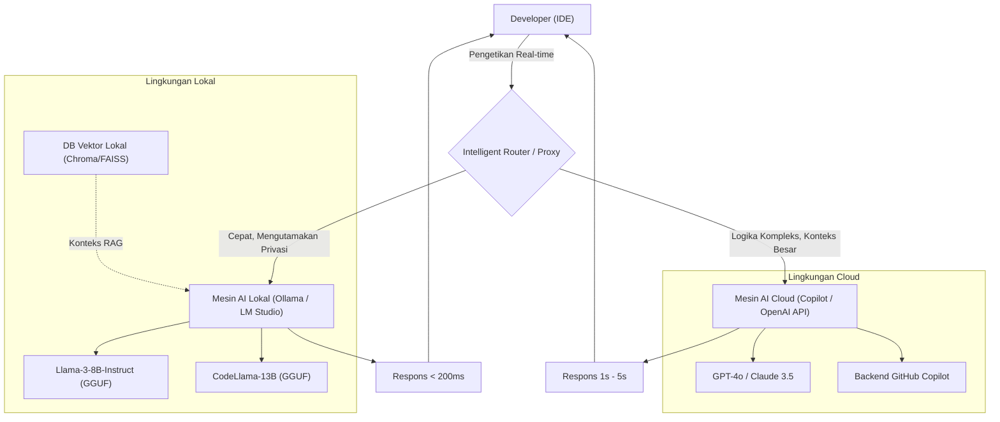
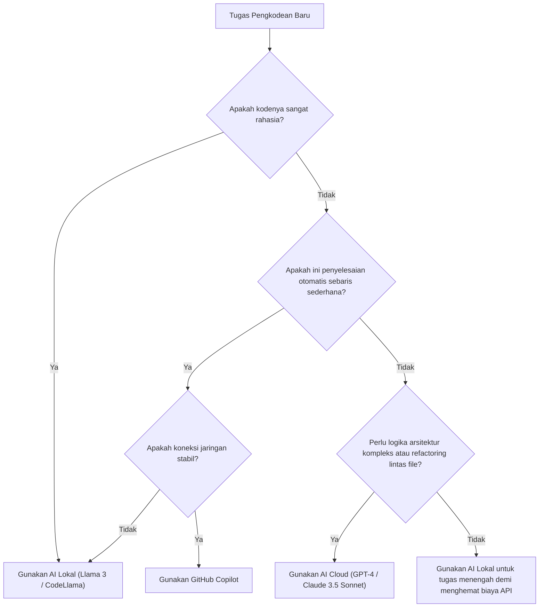

# Meningkatkan Efisiensi Pengembangan Secara Drastis dengan Menggabungkan Copilot dan AI Lokal: Panduan Lengkap Alur Kerja Pengembangan AI Hibrida

Dalam pengembangan perangkat lunak modern, penggunaan asisten AI telah berevolusi dari sekadar alat "yang berguna jika ada" menjadi infrastruktur "yang sangat diperlukan". Terutama sejak munculnya GitHub Copilot, pengalaman pengkodean bagi para pengembang telah berubah secara dramatis. Namun, bergantung sepenuhnya pada AI berbasis cloud untuk semua tugas tidak selalu menjadi solusi yang optimal.

Ada beberapa tantangan yang terkait dengan AI berbasis cloud, seperti risiko keamanan saat menangani informasi rahasia perusahaan (kunci rahasia, algoritma eksklusif, arsitektur yang belum dipublikasikan), latensi API, dan bekerja di lingkungan offline tanpa koneksi jaringan. Oleh karena itu, belakangan ini terjadi peningkatan perhatian yang pesat terhadap pemanfaatan **model terbuka yang berjalan secara lokal (AI Lokal)** seperti Llama 3, CodeLlama, dan Mistral.

Artikel ini akan menjelaskan secara sangat detail tentang bagaimana menggabungkan dan menggunakan AI berbasis cloud (seperti GitHub Copilot, GPT-4) dengan AI lokal untuk memaksimalkan (meningkatkan drastis) efisiensi pengembangan, mulai dari desain arsitektur, pohon keputusan (decision tree) konkret, hingga analisis matematis mengenai biaya dan latensi.

---

## 1. Perbandingan Mendalam: AI Cloud vs AI Lokal

Untuk membangun alur kerja pengembangan AI hibrida, pertama-tama penting untuk memahami karakteristik masing-masing secara mendalam.

### 1.1 AI Berbasis Cloud (GitHub Copilot, GPT-4, Claude 3.5 Sonnet)
Senjata terbesar dari AI cloud adalah "ukuran model yang luar biasa" dan "kemampuan penalaran umum" yang dimilikinya. Karena berjalan pada kluster GPU yang besar, AI ini dapat mengeksekusi model dengan skala puluhan hingga ratusan miliar parameter dengan kecepatan tinggi.

*   **Kelebihan (Pros)**:
    *   **Kemampuan Penalaran Tak Tertandingi**: Tidak ada yang menandinginya dalam tugas-tugas yang membutuhkan pemahaman konteks yang dalam, seperti mengidentifikasi bug yang kompleks, merancang arsitektur dari nol, dan refactoring tingkat lanjut di berbagai file.
    *   **Jendela Konteks (Context Window) Besar**: Model terbaru memiliki jendela konteks sebesar 100k hingga 2M token, memungkinkan untuk memuat dan menganalisis seluruh basis kode proyek sekaligus.
    *   **Tidak Perlu Manajemen Infrastruktur**: Pengembang tidak perlu khawatir tentang sumber daya GPU atau pembaruan model.
*   **Kekurangan (Cons)**:
    *   **Privasi dan Keamanan**: Karena kode dikirim ke server eksternal, penggunaannya mungkin dibatasi pada perusahaan atau proyek yang memerlukan kepatuhan hukum (compliance) yang ketat.
    *   **Latensi**: Bergantung pada kondisi jaringan komunikasi, sehingga penundaan mungkin terjadi pada penyelesaian otomatis (inline completion) yang membutuhkan respons dalam satuan milidetik.
    *   **Biaya**: Terdapat biaya berlangganan bulanan atau bayar sesuai penggunaan (pay-as-you-go), sehingga untuk penggunaan skala besar biaya operasional tidak dapat diabaikan.

### 1.2 AI Lokal (Llama 3, CodeLlama, Qwen2.5-Coder, dll.)
AI lokal adalah model yang dijalankan langsung di mesin lokal pengembang (seperti MacBook dengan Apple Silicon, atau mesin Windows dengan GPU NVIDIA). Berkat evolusi teknologi kuantisasi (GGUF, AWQ, GPTQ, dll.), model kelas 8B hingga 70B kini dapat berjalan dengan kecepatan praktis bahkan di PC pengembangan umum.

*   **Kelebihan (Pros)**:
    *   **Privasi Mutlak**: Data sama sekali tidak keluar ke jaringan eksternal. Sangat cocok saat menangani proyek rahasia atau basis kode di bawah NDA yang ketat.
    *   **Nol Latensi Jaringan**: Tidak bergantung pada kecepatan koneksi internet dan selalu merespons dengan kecepatan yang konstan.
    *   **Bekerja Secara Offline**: Fungsi penuh tetap dapat digunakan saat berada di dalam pesawat atau di lingkungan yang terisolasi dari jaringan eksternal karena persyaratan keamanan.
    *   **Kustomisasi Tanpa Batas**: Memungkinkan untuk melakukan fine-tuning secara khusus untuk bahasa atau kerangka kerja (framework) tertentu, dan bebas menggabungkan teknik prompt engineering sendiri.
*   **Kekurangan (Cons)**:
    *   **Persyaratan Perangkat Keras**: Agar berjalan lancar, dibutuhkan mesin dengan VRAM (Video RAM) yang memadai (misalnya: VRAM 16GB - 24GB atau lebih, atau Unified Memory 32GB atau lebih pada chip seri M).
    *   **Batas Kinerja Model**: Karena keterbatasan perangkat keras, ada batasan ukuran model yang dapat dijalankan, dan dalam banyak kasus belum bisa menyamai penalaran logis kompleks sekelas GPT-4.
    *   **Batasan Jendela Konteks**: Karena kendala kapasitas memori, panjang konteks yang bisa ditangani biasanya dibatasi sekitar ribuan hingga puluhan ribu token.

---

## 2. Desain Arsitektur Alur Kerja AI Hibrida

Untuk mendapatkan pengalaman pengembangan terbaik, alat-alat ini perlu diintegrasikan pada satu IDE (seperti VS Code, Cursor, Neovim) sehingga dapat menciptakan arsitektur yang memungkinkan pergantian dengan mulus.

Diagram Mermaid di bawah ini menunjukkan arsitektur hibrida tentang bagaimana agen lokal dan layanan cloud saling terhubung untuk membagi beban tugas pengembang.



Inti dari arsitektur ini adalah keberadaan **Intelligent Router (Router Cerdas)**. Ekstensi di dalam IDE secara otomatis (atau manual secara cepat) mengarahkan pemrosesan ke model lokal atau model cloud, bergantung pada konteks kode yang sedang diketik pengembang, tingkat kerahasiaan file target, dan kompleksitas tugas yang diminta.

Sebagai contoh, jika hanya untuk melengkapi definisi fungsi sederhana atau menghasilkan kode boilerplate (template), proses akan dikirim ke model lokal (seperti Llama 3 8B) yang merespons dalam beberapa puluh milidetik. Sementara itu, pertanyaan terkait desain proyek secara keseluruhan atau prompt chat yang membutuhkan refactoring besar-besaran akan dikirim ke GPT-4 di cloud. Pengarahan dinamis ini memungkinkan alur kerja yang sangat efisien.

---

## 3. Kriteria Pengambilan Keputusan: Pohon Keputusan (Decision Tree)

Lalu, dalam skenario pengkodean di dunia nyata, bagaimana pengembang seharusnya menentukan "AI mana yang harus digunakan sekarang"? Kami mendefinisikan alur pengambilan keputusan secara visual menggunakan pohon keputusan berikut.



### 3.1 Kriteria Evaluasi 1: Kerahasiaan (Privacy and Security)
Ini adalah kriteria pengambilan keputusan yang paling penting. Pada file kode pengujian yang memuat data pelanggan (yang dilarang untuk dikirim ke luar karena kebijakan perusahaan), atau file yang mengimplementasikan algoritma eksklusif inti, pilih AI lokal tanpa kompromi apa pun. Metode seperti membangun RAG (Retrieval-Augmented Generation) di lingkungan lokal dengan menyimpan dokumen internal di vector store agar bisa diakses oleh LLM lokal juga sangat efektif.

### 3.2 Kriteria Evaluasi 2: Latensi (Latency)
Untuk menjaga agar kecepatan berpikir tidak terganggu, latensi dari penyelesaian otomatis (autocomplete) sangatlah penting. AI cloud selalu memiliki Network Round Trip Time (RTT). Sebaliknya, latensi jaringan pada AI lokal adalah nol. Jadi, jika Anda memuat model ringan di VRAM agar terus berjalan di latar belakang, Anda bisa merasakan kecepatan respons yang melampaui AI cloud.

### 3.3 Kriteria Evaluasi 3: Jendela Konteks (Context Window)
Untuk prompt seperti "Tolong baca seluruh file dalam repositori ini dan rapikan dependensinya," AI cloud yang bisa memproses lebih dari 100k token mutlak dibutuhkan. Jika Anda mencoba memproses puluhan ribu token menggunakan model lokal, memori kemungkinan akan habis atau kecepatan penalaran akan melambat secara dramatis (seperti beberapa detik per token).

---

## 4. Analisis Matematis tentang Biaya dan Latensi

Mari kita analisis keunggulan dari alur kerja hibrida ini secara kuantitatif menggunakan rumus matematika.

### 4.1 Model Perhitungan Biaya
Kami merumuskan biaya saat hanya menggunakan API cloud (misalnya: GPT-4). Total biaya harian dalam proyek pengembangan, $C_{total}$, adalah jumlah dari token input dan token output untuk setiap prompt dikalikan dengan harga per unitnya.

$$ C_{total} = \sum_{i=1}^{N} \left( P_{in} \times T_{in}^{(i)} + P_{out} \times T_{out}^{(i)} \right) $$

*   $N$ : Jumlah panggilan API dalam 1 hari
*   $P_{in}$ : Harga per 1 token input
*   $P_{out}$ : Harga per 1 token output
*   $T_{in}^{(i)}$ : Jumlah token input pada panggilan ke-$i$
*   $T_{out}^{(i)}$ : Jumlah token output pada panggilan ke-$i$

Jika kita mengasumsikan penggunaan AI lokal, dengan $\alpha$ (0 < $\alpha$ < 1) sebagai proporsi dari jumlah panggilan $N$ yang dapat dialihkan ke model lokal, biaya API cloud baru $C_{hybrid}$ akan dikurangi sebagai berikut:

$$ C_{hybrid} = (1 - \alpha) \sum_{i=1}^{N} \left( P_{in} \times T_{in}^{(i)} + P_{out} \times T_{out}^{(i)} \right) = (1 - \alpha) C_{total} $$

Bahkan jika memperhitungkan penyusutan perangkat keras dan tagihan listrik, jika Anda dapat meningkatkan $\alpha$ hingga 50% - 70%, efek pengurangan biaya jangka panjangnya akan sangat drastis.

### 4.2 Model Latensi (Penundaan)
Kami membuat model tentang waktu yang diperlukan sejak pengguna mengirimkan prompt hingga karakter pertama ditampilkan (Time To First Token: TTFT).

Latensi AI cloud $L_{cloud}$ dinyatakan dengan persamaan berikut:

$$ L_{cloud} = L_{network\_rtt} + L_{queue} + \frac{T_{in}}{S_{process\_cloud}} $$

*   $L_{network\_rtt}$ : Waktu bolak-balik jaringan (umumnya 20ms - 200ms)
*   $L_{queue}$ : Waktu tunggu antrean di sisi penyedia cloud (meningkat saat sibuk)
*   $S_{process\_cloud}$ : Kecepatan pemrosesan token dari GPU cloud (token/detik)

Di sisi lain, latensi AI lokal $L_{local}$ adalah sebagai berikut:

$$ L_{local} = \frac{T_{in}}{S_{process\_local}} $$

Karena latensi jaringan $L_{network\_rtt}$ dan antrean cloud $L_{queue}$ bernilai nol, selama $S_{process\_local}$ (kecepatan pemrosesan dari GPU lokal) cukup tinggi, respons sangat cepat (TTFT) dalam orde milidetik dapat tercapai. Inilah alasan mengapa AI lokal bisa menjadi alat yang paling tangguh untuk penyelesaian kode sebaris (inline autocomplete).

---

## 5. Berdasarkan Skenario Pengembangan: Menggali Skenario Penggunaan Lebih Dalam

### Skenario Penggunaan 1: Pembuatan Boilerplate dan Autocomplete Sebaris dengan GitHub Copilot
*   **Skenario**: Situasi ketika Anda membuat kerangka kerja komponen React atau menulis penanganan kesalahan (error handling) yang standar.
*   **Pendekatan**: Ini adalah wilayah khusus bagi Copilot. Saat Anda mengetik, ia selalu membaca konteks di latar belakang dan secara akurat mengusulkan dari beberapa baris hingga puluhan baris kode. Tanpa harus mengganggu aliran pemikiran, pengalaman menyelesaikan kode hanya dengan menekan "tombol Tab" akan meningkatkan kecepatan pengembangan secara langsung.

### Skenario Penggunaan 2: Refactoring Kode Rahasia Menggunakan AI Lokal (CodeLlama / Llama 3)
*   **Skenario**: Situasi ketika Anda ingin me-refactor sandi (password) basis data, logika enkripsi eksklusif, atau logika inti dari fitur baru yang belum dirilis.
*   **Pendekatan**: Matikan akses jaringan dari IDE untuk sementara, atau gunakan ekstensi khusus untuk AI lokal (misalnya: Continue.dev), lalu kirim prompt ke model yang sedang berjalan secara lokal (seperti melalui Ollama). Dengan cara ini Anda bisa mendapatkan bantuan AI sambil menjaga risiko kebocoran data pada angka nol mutlak.

### Skenario Penggunaan 3: Desain Arsitektur dan Perbaikan Bug Kompleks Menggunakan LLM Cloud (GPT-4 / Claude 3.5 Sonnet)
*   **Skenario**: Konsultasi desain tingkat tinggi, misalnya "Apa pendekatan terbaik untuk membagi aplikasi monolitik ini menjadi layanan mikro (microservices)?" atau analisis kebocoran memori (memory leak) yang penyebabnya tidak diketahui.
*   **Pendekatan**: Tugas-tugas ini membutuhkan pengetahuan awal yang sangat luas dan kemampuan penalaran logis tingkat lanjut. Meskipun ada biayanya, Anda harus memanfaatkan model cloud yang paling cerdas. Masukkan puluhan file sebagai konteks, dan biarkan AI memberikan wawasan mendalam tentang "di mana letak permasalahannya".

---

## 6. Panduan Pembangunan Lingkungan AI Lokal (Praktik)

Berikut ini adalah langkah-langkah konkret dan mudah untuk memperkenalkan AI lokal. Pendekatan yang paling praktis dan kuat saat ini adalah dengan menggunakan **Ollama** atau **LM Studio**.

### 6.1 Instalasi Ollama
Ollama adalah kerangka kerja ringan untuk menjalankan LLM di lingkungan lokal. Ini mendukung MacOS, Windows, dan Linux, serta memungkinkan Anda mengelola model secara intuitif seperti halnya Docker.

```bash
# Untuk MacOS
brew install ollama

# Memulai server
ollama serve

# Mengunduh dan menjalankan model Llama 3 (8B)
ollama run llama3

# Menjalankan CodeLlama yang dioptimalkan untuk pemrograman
ollama run codellama
```

### 6.2 Integrasi dengan Editor (Pemanfaatan Continue.dev)
Untuk memanfaatkan model lokal pada IDE seperti VS Code atau JetBrains, ekstensi open source bernama **Continue** sangatlah hebat.
Hanya dengan menetapkan server Ollama lokal Anda sebagai titik akhir (endpoint) di file konfigurasi Continue (`config.json`), fungsi pengeditan, penyorotan kode, serta jendela obrolan yang mirip dengan ChatGPT akan ditambahkan ke dalam IDE.

```json
{
  "models": [
    {
      "title": "Ollama Llama 3",
      "provider": "ollama",
      "model": "llama3",
      "apiBase": "http://localhost:11434"
    },
    {
      "title": "GPT-4",
      "provider": "openai",
      "model": "gpt-4",
      "apiKey": "sk-your-openai-api-key"
    }
  ],
  "tabAutocompleteModel": {
    "title": "Starcoder 2",
    "provider": "ollama",
    "model": "starcoder2"
  }
}
```
Dengan konfigurasi ini, pengembang dapat beralih antara "Model Lokal" dan "Model Cloud" secara instan dari menu drop-down untuk kebutuhan obrolan atau pelengkapan otomatis (autocomplete) kode.

---

## 7. Masa Depan Pengembangan Bantuan AI: Kebangkitan Agen Otonom

Alur kerja hibrida saat ini didasarkan pada paradigma ko-pilot (Copilot) di mana "manusia memberikan instruksi kepada AI". Namun, dalam beberapa tahun ke depan, ini akan berkembang lebih jauh. Kita akan memasuki era **Agen AI Otonom Berlapis**. Misalnya, model lokal ringan akan memantau basis kode setiap saat dan menjalankan pengujian di latar belakang, dan hanya ketika ia mendeteksi kesalahan kompleks ia akan secara otonom memanggil model cloud raksasa untuk menghasilkan solusi.

Pada saat itu, PC lokal milik pengembang tidak hanya berfungsi sebagai layar untuk menjalankan editor, tetapi akan mengambil peran penting di garis depan sebagai mesin penalaran (Edge AI). Fakta bahwa perusahaan seperti NVIDIA dan Apple terus meningkatkan memori (VRAM / Unified Memory) pada mesin untuk pengembang adalah persiapan menuju masa depan ini.

---

## 8. Kesimpulan (Conclusion)

Daripada melihat ini sebagai dikotomi antara "GitHub Copilot (Cloud)" dan "AI Lokal", **alur kerja hibrida yang memahami keunggulan keduanya dan menggunakannya dengan tepat sesuai dengan sifat tugas** adalah lingkungan pengembangan yang paling kuat saat ini.

*   **GitHub Copilot / API Cloud**: Digunakan untuk peningkatan kecepatan pengembangan secara umum, perancangan logika yang kompleks, dan analisis komprehensif pada proyek secara keseluruhan.
*   **AI Lokal (Ollama, LM Studio)**: Digunakan untuk memproses kode rahasia, pengkodean dalam lingkungan offline, pelengkapan sebaris (inline) super cepat dengan latensi jaringan nol, dan untuk mengurangi pengeluaran biaya API.

Silakan jadikan pohon keputusan (decision tree) dan arsitektur yang diperkenalkan dalam artikel ini sebagai referensi, dan tingkatkan lingkungan IDE Anda ke level berikutnya. Dengan melangkah dari pihak yang sekadar "menggunakan" AI menjadi pihak yang "memadukan dan mempekerjakan" AI di tempat yang tepat, efisiensi pengembangan Anda pasti akan meningkat drastis.

Happy Coding with Hybrid AI!
