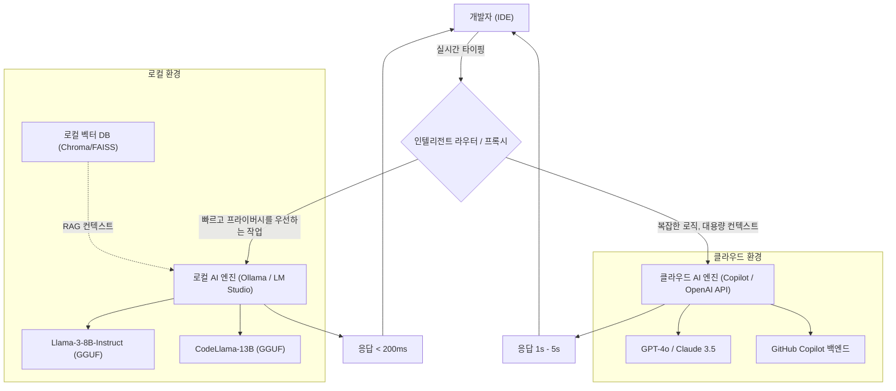
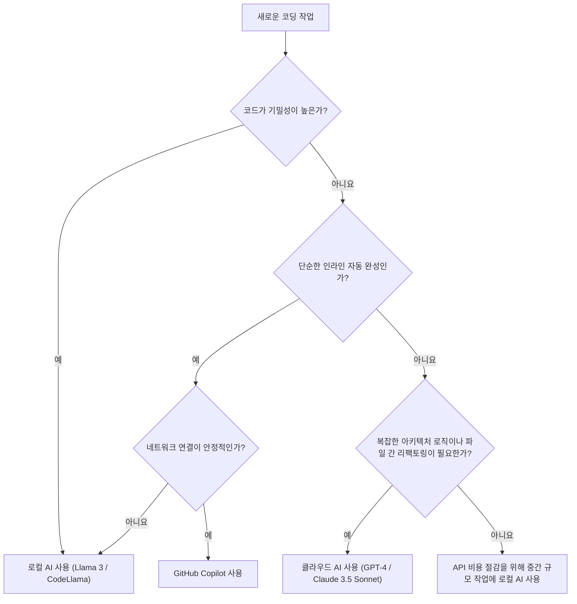

# Copilot과 로컬 AI의 용도별 활용으로 개발 효율 폭발적으로 높이기: 하이브리드 AI 개발 워크플로우 완벽 가이드

현대 소프트웨어 개발에서 AI 어시스턴트의 활용은 '있으면 편리한' 도구에서 '없어서는 안 될' 인프라로 진화했습니다. 특히 GitHub Copilot의 등장 이후, 개발자의 코딩 경험은 극적으로 변화하고 있습니다. 하지만 모든 작업을 클라우드 기반 AI에 의존하는 것이 항상 최선의 해결책은 아닙니다.

기업의 기밀 정보(시크릿 키, 독자적인 알고리즘, 미공개 아키텍처)를 다룰 때의 보안 리스크, API 지연(레이턴시), 나아가 네트워크에 접속할 수 없는 오프라인 환경에서의 작업 등, 클라우드 기반 AI에는 몇 가지 과제가 존재합니다. 그래서 최근 급속도로 주목받고 있는 것이 Llama 3나 CodeLlama, Mistral 등 **로컬에서 동작하는 오픈 모델(로컬 AI)**의 활용입니다.

본 문서에서는 클라우드 기반 AI(GitHub Copilot이나 GPT-4 등)와 로컬 AI를 어떻게 조합하고 용도에 맞게 사용하여 개발 효율을 극대화(폭발적으로 향상)할 수 있는지, 그 아키텍처 설계부터 구체적인 의사결정 트리, 비용과 지연에 대한 수리적 분석까지 매우 상세하게 해설합니다.

---

## 1. 클라우드 AI와 로컬 AI 철저 비교

하이브리드 AI 개발 워크플로우를 구축함에 있어, 먼저 각각의 특성을 깊이 이해하는 것이 중요합니다.

### 1.1 클라우드 기반 AI (GitHub Copilot, GPT-4, Claude 3.5 Sonnet)
클라우드 AI의 가장 큰 무기는 그 '압도적인 모델 크기'와 '범용적인 추론 능력'에 있습니다. 거대한 GPU 클러스터에서 동작하기 때문에 수백억~수조 파라미터 규모의 모델을 고속으로 실행할 수 있습니다.

*   **장점(Pros)**:
    *   **비교 불가한 추론력**: 복잡한 버그 파악, 아키텍처의 제로베이스 설계, 여러 파일에 걸친 고도의 리팩토링 등 문맥에 대한 깊은 이해가 필요한 작업에서 타의 추종을 불허합니다.
    *   **거대한 컨텍스트 윈도우**: 최신 모델은 100k~2M 토큰의 컨텍스트 윈도우를 가지며, 프로젝트 전체의 코드베이스를 한 번에 읽어 들여 분석하는 것이 가능합니다.
    *   **인프라 관리 불필요**: 개발자는 GPU 리소스나 모델 업데이트를 신경 쓸 필요가 없습니다.
*   **단점(Cons)**:
    *   **프라이버시 및 보안**: 코드가 외부 서버로 전송되기 때문에, 엄격한 컴플라이언스가 요구되는 기업이나 프로젝트에서는 사용이 제한될 수 있습니다.
    *   **레이턴시**: 네트워크 통신 상태에 의존하므로, 수 밀리초 단위의 응답이 요구되는 인라인 자동 완성에서 지연이 발생할 수 있습니다.
    *   **비용**: 사용량에 따른 종량제 과금 혹은 월간 구독 비용이 발생하며, 대규모로 이용할 경우 유지 비용을 무시할 수 없게 됩니다.

### 1.2 로컬 AI (Llama 3, CodeLlama, Qwen2.5-Coder 등)
로컬 AI는 개발자의 로컬 머신(MacBook의 Apple Silicon이나 NVIDIA GPU를 탑재한 Windows 머신 등)에서 직접 실행되는 모델입니다. 양자화 기술(GGUF, AWQ, GPTQ 등)의 발전으로 8B~70B 클래스의 모델이 일반 개발용 PC에서도 실용적인 속도로 동작하게 되었습니다.

*   **장점(Pros)**:
    *   **궁극의 프라이버시**: 데이터가 절대 외부 네트워크로 나가지 않습니다. 극비 프로젝트나 엄격한 NDA 하에 있는 코드베이스를 다룰 때 최적입니다.
    *   **제로 네트워크 레이턴시**: 인터넷 회선 속도에 의존하지 않고 항상 일정한 속도로 응답을 반환합니다.
    *   **오프라인 환경에서의 가동**: 비행기 안이나 보안 요구 사항으로 외부 네트워크와 격리된 환경에서도 전체 기능을 이용할 수 있습니다.
    *   **무한한 커스터마이징**: 특정 언어나 프레임워크에 특화하여 파인튜닝을 하거나, 독자적인 프롬프트 엔지니어링을 자유롭게 통합할 수 있습니다.
*   **단점(Cons)**:
    *   **하드웨어 요구 사항**: 쾌적하게 동작시키기 위해서는 충분한 VRAM(비디오 메모리)을 탑재한 머신(예: VRAM 16GB~24GB 이상, 혹은 M 시리즈 칩의 통합 메모리 32GB 이상)이 필요합니다.
    *   **모델 성능의 한계**: 하드웨어의 제약상 실행할 수 있는 모델 크기에 한계가 있어, GPT-4 클래스의 복잡한 논리적 추론에는 미치지 못하는 경우가 많습니다.
    *   **컨텍스트 윈도우의 제한**: 메모리 용량 문제로 다룰 수 있는 컨텍스트 길이가 수천~수만 토큰 정도로 제한되는 것이 일반적입니다.

---

## 2. 하이브리드 AI 워크플로우 아키텍처 설계

최고의 개발 경험을 얻기 위해서는 이러한 도구들을 단일 IDE(예: VS Code, Cursor, Neovim) 상에 통합하고 매끄럽게 전환할 수 있는 아키텍처를 구축해야 합니다.

아래의 Mermaid 다이어그램은 로컬 에이전트와 클라우드 서비스가 어떻게 연계하여 개발자의 작업을 분산 처리하는지 보여주는 하이브리드 아키텍처입니다.



이 아키텍처의 핵심은 **Intelligent Router(인텔리전트 라우터)**의 존재입니다. 개발자가 작성 중인 코드의 문맥, 대상 파일의 기밀 수준, 요구되는 작업의 복잡성에 따라 IDE 내의 확장 기능이 로컬 모델과 클라우드 모델을 자동(또는 수동으로 빠르게)으로 라우팅합니다.

예를 들어 단순한 함수 정의 자동 완성이나 보일러플레이트 생성이라면 수십 밀리초 만에 응답하는 로컬 모델(Llama 3 8B 등)에 처리를 넘기고, 프로젝트 전체의 설계와 관련된 질문이나 대규모 리팩토링을 수반하는 채팅 프롬프트는 클라우드의 GPT-4에 넘기는 등 동적인 분배를 수행합니다.

---

## 3. 용도별 활용 판단 기준: 의사결정 트리

그렇다면 실제 코딩 현장에서 개발자는 어떻게 '지금 어떤 AI를 사용해야 할지' 판단하면 될까요? 아래의 의사결정 트리를 사용하여 시각적으로 판단 흐름을 정의합니다.



### 3.1 평가 기준 1: 기밀성(Privacy and Security)
가장 중요한 판단 기준입니다. 기업 정책으로 외부 전송이 금지되어 있는 고객 데이터가 포함된 테스트 코드나, 핵심이 되는 독자적인 알고리즘을 구현하고 있는 파일에서는 일절 타협 없이 로컬 AI를 선택합니다. 로컬에서 RAG(검색 증강 생성)를 구축하여, 사내 문서를 벡터 스토어에 저장하고 로컬 LLM이 참조하게 하는 기법도 매우 유효합니다.

### 3.2 평가 기준 2: 레이턴시(Latency)
사고의 흐름을 멈추지 않게 하기 위해서는 자동 완성의 레이턴시가 매우 중요합니다. 클라우드 AI는 네트워크의 왕복 시간(RTT)이 반드시 발생합니다. 로컬 AI는 네트워크 지연이 제로이므로, 경량 모델을 VRAM에 상주시킴으로써 클라우드를 뛰어넘는 체감 속도를 얻을 수 있습니다.

### 3.3 평가 기준 3: 컨텍스트 윈도우(Context Window)
"이 리포지토리의 모든 파일을 읽고 의존성을 정리해 줘"와 같은 프롬프트에는 100k 이상의 토큰을 처리할 수 있는 클라우드 AI가 필수적입니다. 로컬 모델로 수만 토큰을 처리하려고 하면 메모리가 고갈되거나 추론 속도가 극적으로 저하(1토큰당 수 초 등)되어 버립니다.

---

## 4. 비용과 지연에 대한 수리적 분석(Mathematical Analysis)

하이브리드 워크플로우의 이점을 수식을 사용하여 정량적으로 분석해 보겠습니다.

### 4.1 비용 계산 모델
클라우드 API(예: GPT-4)만 사용했을 경우의 비용을 수식화합니다. 개발 프로젝트에서 하루 동안의 총 비용 $C_{total}$ 은 프롬프트당 입력 토큰 수와 출력 토큰 수에 단가를 곱한 것의 총합이 됩니다.

$$ C_{total} = \sum_{i=1}^{N} \left( P_{in} \times T_{in}^{(i)} + P_{out} \times T_{out}^{(i)} \right) $$

*   $N$ : 하루 API 호출 횟수
*   $P_{in}$ : 입력 1토큰당 가격
*   $P_{out}$ : 출력 1토큰당 가격
*   $T_{in}^{(i)}$ : $i$ 번째 호출의 입력 토큰 수
*   $T_{out}^{(i)}$ : $i$ 번째 호출의 출력 토큰 수

로컬 AI를 도입하여 호출 횟수 $N$ 중 비율 $\alpha$ (0 < $\alpha$ < 1)를 로컬 모델로 오프로드(offload)할 수 있다고 가정하면, 새로운 클라우드 API 비용 $C_{hybrid}$ 는 다음과 같이 절감됩니다.

$$ C_{hybrid} = (1 - \alpha) \sum_{i=1}^{N} \left( P_{in} \times T_{in}^{(i)} + P_{out} \times T_{out}^{(i)} \right) = (1 - \alpha) C_{total} $$

하드웨어의 감가상각비나 전기 요금을 고려하더라도 $\alpha$ 를 50%~70%까지 높일 수 있다면, 장기적으로는 극적인 비용 절감 효과를 가져옵니다.

### 4.2 레이턴시(지연) 모델
사용자가 프롬프트를 전송한 후 첫 글자가 표시될 때까지의 시간(Time To First Token: TTFT)을 모델링합니다.

클라우드 AI의 지연 $L_{cloud}$ 는 아래의 수식으로 표현됩니다.

$$ L_{cloud} = L_{network\_rtt} + L_{queue} + \frac{T_{in}}{S_{process\_cloud}} $$

*   $L_{network\_rtt}$ : 네트워크의 왕복 시간(보통 20ms - 200ms)
*   $L_{queue}$ : 클라우드 제공자 측의 대기열 대기 시간(혼잡 시 증가)
*   $S_{process\_cloud}$ : 클라우드 GPU의 토큰 처리 속도(tokens/sec)

반면, 로컬 AI의 지연 $L_{local}$ 은 다음과 같습니다.

$$ L_{local} = \frac{T_{in}}{S_{process\_local}} $$

네트워크 지연 $L_{network\_rtt}$ 와 클라우드의 대기열 지연 $L_{queue}$ 가 0이 되므로, $S_{process\_local}$ (로컬 GPU의 처리 속도)이 충분히 높다면 수 밀리초 단위의 초고속 응답(TTFT)이 실현됩니다. 이것이 로컬 AI가 인라인 자동 완성에 있어서 최강의 도구가 될 수 있는 이유입니다.

---

## 5. 개발 상황별: 구체적인 유즈케이스 심층 탐구

### 유즈케이스 1: GitHub Copilot을 이용한 보일러플레이트 생성 및 인라인 자동 완성
*   **시나리오**: React 컴포넌트의 뼈대를 만들거나 정형화된 에러 처리를 작성하는 상황.
*   **접근 방식**: 이 부분은 Copilot의 독무대입니다. 타이핑 중에 항상 백그라운드에서 문맥을 읽어내어, 몇 줄에서 수십 줄의 코드를 정확하게 제안해 줍니다. 사고의 흐름을 끊지 않고 'Tab 키'를 누르는 것만으로 코드가 완성되어 가는 경험은 개발 속도를 가장 직접적으로 끌어올립니다.

### 유즈케이스 2: 로컬 AI (CodeLlama / Llama 3)를 이용한 기밀 코드 리팩토링
*   **시나리오**: 데이터베이스의 비밀번호나 독자적인 암호화 로직, 혹은 미발표된 신기능의 핵심 로직을 리팩토링하고 싶은 상황.
*   **접근 방식**: IDE의 네트워크 접근을 일시적으로 차단하거나 로컬 AI 전용 확장 기능(예: Continue.dev 등)을 사용하여 로컬에서 가동 중인 모델(Ollama 경유 등)에 프롬프트를 전송합니다. 데이터 유출 위험을 제로로 유지한 채 AI의 지원을 받을 수 있습니다.

### 유즈케이스 3: 클라우드 LLM (GPT-4 / Claude 3.5 Sonnet)을 이용한 아키텍처 설계 및 복잡한 버그 수정
*   **시나리오**: 원인을 알 수 없는 메모리 누수 분석이나 "이 모놀리스 앱을 마이크로서비스로 분할하기 위한 최선의 접근 방식은?"과 같은 고차원적인 설계 상담.
*   **접근 방식**: 이러한 작업에는 방대한 사전 지식과 고도의 논리적 추론 능력이 필요합니다. 비용을 들여서라도 가장 똑똑한 클라우드 모델을 이용해야 합니다. 수십 개의 파일을 컨텍스트로 전달하여 '어디에 문제가 있는지' 깊이 통찰하게 합니다.

---

## 6. 로컬 AI 환경 구축 가이드(실전 편)

로컬 AI를 도입하기 위한 구체적인 단계를 간단히 소개합니다. 현재 가장 간편하면서도 강력한 접근 방식은 **Ollama**나 **LM Studio**를 사용하는 것입니다.

### 6.1 Ollama 도입
Ollama는 로컬 환경에서 LLM을 동작시키기 위한 경량 프레임워크입니다. MacOS, Windows, Linux를 지원하며 Docker처럼 직관적으로 모델을 관리할 수 있습니다.

```bash
# MacOS의 경우
brew install ollama

# 서버 시작
ollama serve

# Llama 3 (8B) 모델을 다운로드하고 실행
ollama run llama3

# 프로그래밍에 특화된 CodeLlama 실행
ollama run codellama
```

### 6.2 에디터 통합 (Continue.dev 활용)
VS Code나 JetBrains IDE에서 로컬 모델을 활용하려면 **Continue**라는 오픈소스 확장 기능이 매우 훌륭합니다.
Continue의 설정 파일(`config.json`)에서 로컬의 Ollama 서버를 엔드포인트로 지정하기만 하면, IDE 내에 ChatGPT와 같은 채팅 창이나 코드 하이라이트 및 편집 기능이 추가됩니다.

```json
{
  "models": [
    {
      "title": "Ollama Llama 3",
      "provider": "ollama",
      "model": "llama3",
      "apiBase": "http://localhost:11434"
    },
    {
      "title": "GPT-4",
      "provider": "openai",
      "model": "gpt-4",
      "apiKey": "sk-your-openai-api-key"
    }
  ],
  "tabAutocompleteModel": {
    "title": "Starcoder 2",
    "provider": "ollama",
    "model": "starcoder2"
  }
}
```
이렇게 설정함으로써 개발자는 필요에 따라 드롭다운 메뉴에서 즉시 '로컬 모델'과 '클라우드 모델'을 전환하여 채팅이나 자동 완성을 수행하는 것이 가능해집니다.

---

## 7. AI 지원 개발의 미래: 자율형 에이전트의 대두

현재의 하이브리드 워크플로우는 '인간이 AI에게 지시를 내린다'는 부조종사(Copilot)의 패러다임에 기반하고 있습니다. 하지만 몇 년 후에는 한층 더 진화하여, 로컬의 경량 모델이 항상 코드베이스를 모니터링하며 백그라운드에서 테스트를 돌리면서, 복잡한 오류를 감지했을 때만 자율적으로 클라우드의 거대한 모델을 호출하여 해결책을 생성하는 등 **계층화된 자율형 AI 에이전트**의 시대가 도래할 것입니다.

이때 개발자의 로컬 PC는 단순히 에디터를 작동시키는 화면이 아니라, 추론 엔진의 최전선(엣지 AI)으로서의 역할을 강하게 띠게 됩니다. NVIDIA나 Apple이 개발자용 머신의 메모리(VRAM / 통합 메모리)를 지속적으로 증강하고 있는 것은 이러한 미래를 내다보고 있기 때문입니다.

---

## 8. 결론(Conclusion)

'클라우드의 GitHub Copilot'이냐 '로컬 AI'냐 하는 이분법적 대립이 아니라, **양쪽의 강점을 이해하고 작업의 성격에 따라 적절히 나누어 쓰는 하이브리드 워크플로우**야말로 현시점에서의 최강의 개발 환경입니다.

*   **GitHub Copilot / 클라우드 API**: 범용적인 개발 속도 향상, 복잡한 로직 설계, 프로젝트 전체를 조감하는 분석에 사용합니다.
*   **로컬 AI (Ollama, LM Studio)**: 기밀성이 높은 코드 처리, 오프라인 환경, 네트워크 지연을 배제한 초고속 인라인 자동 완성, 그리고 API 비용 절감에 사용합니다.

부디 본 문서에서 소개한 의사결정 트리나 아키텍처를 참고하여, 여러분의 IDE 환경을 한 단계 끌어올리시기 바랍니다. AI를 '사용하는' 입장에서 '적재적소에 조합하여 부리는' 입장으로 한 단계 도약함으로써 개발 효율은 틀림없이 폭발적으로 향상될 것입니다.

Happy Coding with Hybrid AI!
