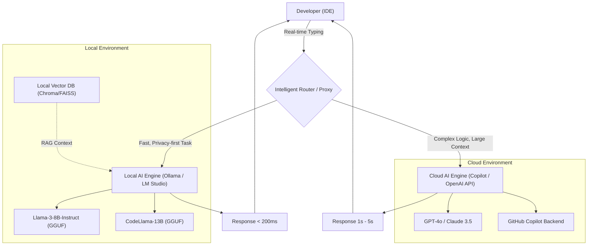
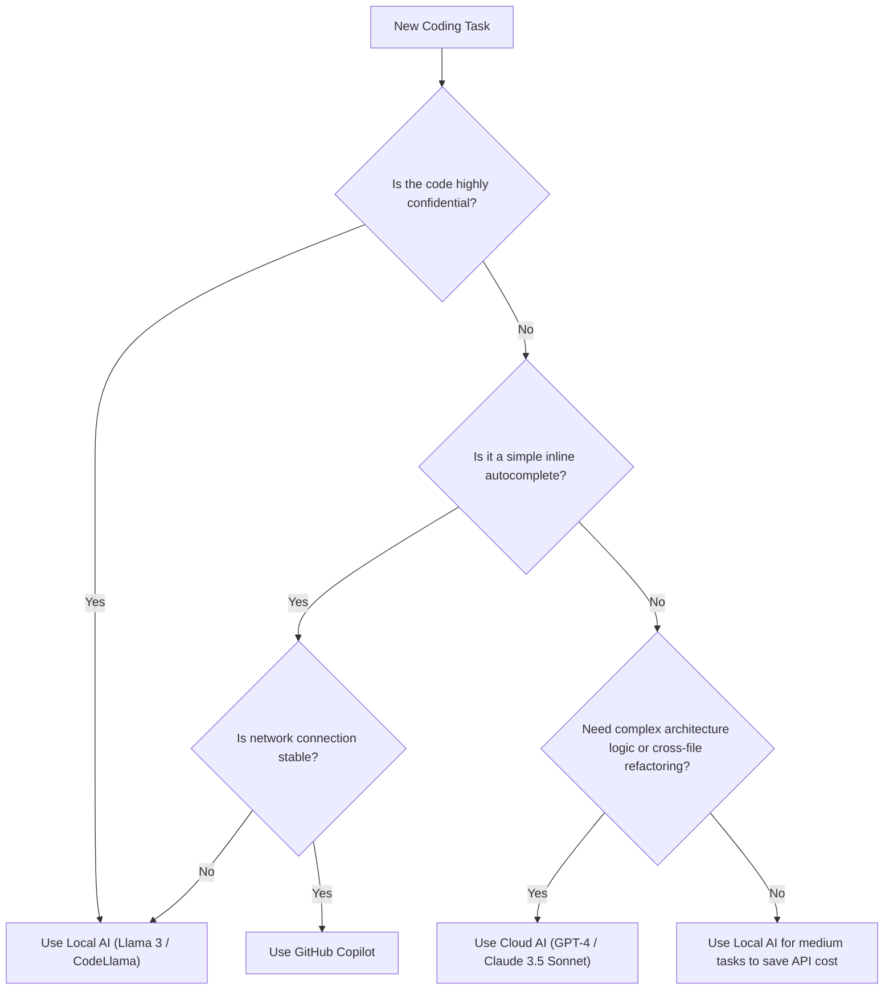

# CopilotとローカルAIの使い分けで開発効率を爆上げする：ハイブリッドAI開発ワークフローの完全ガイド

現代のソフトウェア開発において、AIアシスタントの活用は「あれば便利」なツールから「なくてはならない」インフラへと進化を遂げました。特にGitHub Copilotの登場以降、開発者のコーディング体験は劇的に変化しています。しかし、すべてのタスクをクラウド上のAIに依存することが常に最適な解であるとは限りません。

企業の機密情報（シークレットキー、独自のアルゴリズム、未公開のアーキテクチャ）を扱う際のセキュリティリスク、APIの遅延（レイテンシ）、さらにはネットワークに接続できないオフライン環境での作業など、クラウドベースのAIにはいくつかの課題が存在します。そこで近年急速に注目を集めているのが、Llama 3やCodeLlama、Mistralといった**ローカルで動作するオープンモデル（ローカルAI）**の活用です。

本記事では、クラウドベースのAI（GitHub CopilotやGPT-4など）とローカルAIをどのように組み合わせ、使い分けることで開発効率を最大化（爆上げ）できるのか、そのアーキテクチャ設計から具体的なデシジョンツリー、コストとレイテンシの数理的分析まで、極めて詳細に解説します。

---

## 1. クラウドAIとローカルAIの徹底比較

ハイブリッドAI開発ワークフローを構築するにあたり、まずはそれぞれの特性を深く理解することが重要です。

### 1.1 クラウドベースAI（GitHub Copilot, GPT-4, Claude 3.5 Sonnet）
クラウドAIの最大の武器は、その「圧倒的なモデルサイズ」と「汎用的な推論能力」にあります。巨大なGPUクラスターで動作するため、数百億〜数兆パラメータという規模のモデルを高速に実行できます。

*   **長所（Pros）**:
    *   **比類なき推論力**: 複雑なバグの特定、アーキテクチャのゼロベース設計、複数ファイルにまたがる高度なリファクタリングなど、文脈の深い理解が必要なタスクにおいて右に出るものはありません。
    *   **巨大なコンテキストウィンドウ**: 最新のモデルは100k〜2Mトークンのコンテキストウィンドウを持ち、プロジェクト全体のコードベースを一度に読み込ませて解析することが可能です。
    *   **インフラ管理が不要**: 開発者はGPUのリソースやモデルのアップデートを気にする必要がありません。
*   **短所（Cons）**:
    *   **プライバシーとセキュリティ**: コードが外部のサーバーに送信されるため、厳格なコンプライアンスが求められる企業やプロジェクトでは使用が制限される場合があります。
    *   **レイテンシ**: ネットワークの通信状況に依存するため、数ミリ秒単位の応答が求められるインライン補完において遅延が発生することがあります。
    *   **コスト**: 使用量に応じた従量課金、あるいは月額のサブスクリプション費用が発生し、大規模な利用ではランニングコストが無視できなくなります。

### 1.2 ローカルAI（Llama 3, CodeLlama, Qwen2.5-Coder 等）
ローカルAIは、開発者のローカルマシン（MacBookのApple Siliconや、NVIDIA製GPUを積んだWindowsマシンなど）で直接実行されるモデルです。量子化技術（GGUF, AWQ, GPTQなど）の進化により、8B〜70Bクラスのモデルが一般の開発用PCでも実用的な速度で動作するようになりました。

*   **長所（Pros）**:
    *   **究極のプライバシー**: データは一切外部のネットワークに出ません。極秘のプロジェクトや、厳重なNDA下にあるコードベースを扱う際に最適です。
    *   **ゼロ・ネットワークレイテンシ**: インターネット回線の速度に依存せず、常に一定の速度で応答を返します。
    *   **オフライン環境での稼働**: 飛行機の中や、セキュリティ要件で外部ネットワークから隔離された環境でもフル機能を利用できます。
    *   **無限のカスタマイズ**: 特定の言語やフレームワークに特化してファインチューニングを行ったり、独自のプロンプトエンジニアリングを自由に組み込むことができます。
*   **短所（Cons）**:
    *   **ハードウェア要件**: 快適に動作させるためには、十分なVRAM（ビデオメモリ）を搭載したマシン（例：VRAM 16GB〜24GB以上、あるいはMシリーズチップの統合メモリ32GB以上）が必要です。
    *   **モデル性能の限界**: ハードウェアの制約上、実行できるモデルサイズには限界があり、GPT-4クラスの複雑な論理的推論には及ばないケースが多いです。
    *   **コンテキストウィンドウの制限**: メモリ容量の都合上、扱えるコンテキスト長が数千〜数万トークン程度に制限されることが一般的です。

---

## 2. ハイブリッドAIワークフローのアーキテクチャ設計

最高の開発体験を得るためには、これらのツールを単一のIDE（例: VS Code, Cursor, Neovim）上で統合し、シームレスに切り替えられるアーキテクチャを構築する必要があります。

以下のMermaid図は、ローカルエージェントとクラウドサービスがどのように連携し、開発者のタスクを分散処理するかを示すハイブリッドアーキテクチャです。



このアーキテクチャの肝となるのが、**Intelligent Router（インテリジェント・ルーター）**の存在です。開発者が記述しているコードの文脈、対象ファイルの機密レベル、要求されるタスクの複雑さに応じて、IDE内の拡張機能がローカルモデルとクラウドモデルを自動（または手動で素早く）ルーティングします。

例えば、単純な関数定義の補完やボイラープレートの生成であれば、数十ミリ秒で応答するローカルモデル（Llama 3 8Bなど）に処理を投げ、プロジェクト全体の設計に関わる質問や大規模なリファクタリングを伴うチャットプロンプトはクラウドのGPT-4に投げる、といった動的な振り分けを行います。

---

## 3. 使い分けの判断基準：デシジョンツリー

では、実際のコーディング現場において、開発者はどのように「今どちらのAIを使うべきか」を判断すればよいのでしょうか。以下のデシジョンツリーを用いて視覚的に判断フローを定義します。



### 3.1 評価軸1：機密性（Privacy and Security）
最も重要な判断基準です。企業ポリシーで外部送信が禁じられている顧客データを含むテストコードや、コアとなる独自のアルゴリズムを実装しているファイルでは、一切の妥協なくローカルAIを選択します。ローカルでRAG（検索拡張生成）を構築し、社内ドキュメントをベクターストアに格納してローカルLLMに参照させる手法も非常に有効です。

### 3.2 評価軸2：レイテンシ（Latency）
思考のスピードを止めないためには、補完のレイテンシは非常に重要です。クラウドAIはネットワークのラウンドトリップタイム（RTT）が必ず発生します。ローカルAIはネットワーク遅延がゼロであるため、軽量なモデルをVRAMに常駐させておけば、クラウドを超える体感速度を得ることが可能です。

### 3.3 評価軸3：コンテキストウィンドウ（Context Window）
「このリポジトリの全ファイルを読んで、依存関係を整理して」といったプロンプトには、100k以上のトークンを処理できるクラウドAIが必須です。ローカルモデルで数万トークンを処理しようとすると、メモリが枯渇するか、推論速度が劇的に低下（1トークンあたり数秒など）してしまいます。

---

## 4. コストと遅延の数理的分析（Mathematical Analysis）

ハイブリッドワークフローの利点を、数式を用いて定量的に分析してみましょう。

### 4.1 コスト計算モデル
クラウドAPI（例：GPT-4）のみを使用した場合のコストを数式化します。開発プロジェクトにおける1日あたりの総コスト $C_{total}$ は、プロンプトごとの入力トークン数と出力トークン数に単価を掛けたものの総和となります。

$$ C_{total} = \sum_{i=1}^{N} \left( P_{in} \times T_{in}^{(i)} + P_{out} \times T_{out}^{(i)} \right) $$

*   $N$ : 1日のAPI呼び出し回数
*   $P_{in}$ : 入力1トークンあたりの価格
*   $P_{out}$ : 出力1トークンあたりの価格
*   $T_{in}^{(i)}$ : $i$ 番目の呼び出しの入力トークン数
*   $T_{out}^{(i)}$ : $i$ 番目の呼び出しの出力トークン数

ローカルAIを導入し、呼び出し回数 $N$ のうち割合 $\alpha$ (0 < $\alpha$ < 1) をローカルモデルにオフロードできたと仮定すると、新しいクラウドAPIコスト $C_{hybrid}$ は次のように削減されます。

$$ C_{hybrid} = (1 - \alpha) \sum_{i=1}^{N} \left( P_{in} \times T_{in}^{(i)} + P_{out} \times T_{out}^{(i)} \right) = (1 - \alpha) C_{total} $$

ハードウェアの減価償却費や電気代を考慮しても、$\alpha$ を50%〜70%に高めることができれば、長期的には劇的なコスト削減効果をもたらします。

### 4.2 レイテンシ（遅延）モデル
ユーザーがプロンプトを送信してから、最初の文字が表示されるまでの時間（Time To First Token: TTFT）をモデル化します。

クラウドAIの遅延 $L_{cloud}$ は以下の式で表されます。

$$ L_{cloud} = L_{network\_rtt} + L_{queue} + \frac{T_{in}}{S_{process\_cloud}} $$

*   $L_{network\_rtt}$ : ネットワークのラウンドトリップ時間（通常 20ms - 200ms）
*   $L_{queue}$ : クラウドプロバイダー側のキュー待ち時間（混雑時に増加）
*   $S_{process\_cloud}$ : クラウドGPUのトークン処理速度（tokens/sec）

一方、ローカルAIの遅延 $L_{local}$ は以下のようになります。

$$ L_{local} = \frac{T_{in}}{S_{process\_local}} $$

ネットワーク遅延 $L_{network\_rtt}$ とクラウドのキュー遅延 $L_{queue}$ がゼロになるため、$S_{process\_local}$ （ローカルのGPUの処理速度）が十分に高ければ、数ミリ秒単位での超高速な応答（TTFT）が実現します。これがローカルAIがインライン補完において最強のツールとなり得る理由です。

---

## 5. 開発シーン別：具体的なユースケースの深掘り

### ユースケース1: GitHub Copilotによるボイラープレート生成とインライン補完
*   **シナリオ**: Reactコンポーネントの骨組みを作ったり、定型的なエラーハンドリングを記述したりする場面。
*   **アプローチ**: ここはCopilotの独壇場です。タイピング中、常に背景でコンテキストを読み取り、数行〜数十行のコードを正確に提案してくれます。思考を途切れさせることなく、「Tabキー」を押すだけでコードが完成していく体験は、開発速度を最も直接的に引き上げます。

### ユースケース2: ローカルAI（CodeLlama / Llama 3）による機密コードのリファクタリング
*   **シナリオ**: データベースのパスワードや、独自の暗号化ロジック、あるいは未発表の新機能のコアロジックをリファクタリングしたい場面。
*   **アプローチ**: IDEのネットワークアクセスを一時的に遮断するか、ローカルAI専用の拡張機能（例: Continue.devなど）を使用し、ローカルで稼働しているモデル（Ollama経由など）にプロンプトを投げます。データ漏洩のリスクをゼロに保ったまま、AIの支援を受けることができます。

### ユースケース3: クラウドLLM（GPT-4 / Claude 3.5 Sonnet）によるアーキテクチャ設計と複雑なバグ修正
*   **シナリオ**: 原因不明のメモリリークの解析や、「このモノリスアプリをマイクロサービスに分割するための最善のアプローチは？」といった高次元な設計相談。
*   **アプローチ**: このようなタスクには、膨大な事前知識と高度な論理的推論能力が必要です。コストをかけてでも、最も賢いクラウドモデルを利用すべきです。数十個のファイルをコンテキストとして渡し、「どこに問題があるか」を深く洞察させます。

---

## 6. ローカルAIの環境構築ガイド（実践編）

ローカルAIを導入するための具体的なステップを簡単に紹介します。現在最も手軽かつ強力なアプローチは、**Ollama** や **LM Studio** を使用することです。

### 6.1 Ollamaの導入
Ollamaは、ローカル環境でLLMを動作させるための軽量なフレームワークです。MacOS、Windows、Linuxに対応しており、Dockerのように直感的にモデルを管理できます。

```bash
# MacOSの場合
brew install ollama

# サーバーの起動
ollama serve

# Llama 3 (8B)モデルをダウンロードして実行
ollama run llama3

# プログラミングに特化したCodeLlamaを実行
ollama run codellama
```

### 6.2 エディタへの統合 (Continue.devの活用)
VS CodeやJetBrains IDEでローカルモデルを活用するには、**Continue** というオープンソースの拡張機能が非常に優秀です。
Continueの設定ファイル（`config.json`）で、ローカルのOllamaサーバーをエンドポイントとして指定するだけで、IDE内にChatGPTのようなチャットウィンドウや、コードのハイライト＆編集機能が追加されます。

```json
{
  "models": [
    {
      "title": "Ollama Llama 3",
      "provider": "ollama",
      "model": "llama3",
      "apiBase": "http://localhost:11434"
    },
    {
      "title": "GPT-4",
      "provider": "openai",
      "model": "gpt-4",
      "apiKey": "sk-your-openai-api-key"
    }
  ],
  "tabAutocompleteModel": {
    "title": "Starcoder 2",
    "provider": "ollama",
    "model": "starcoder2"
  }
}
```
このように設定することで、開発者は必要に応じてプルダウンメニューから瞬時に「ローカルモデル」と「クラウドモデル」を切り替えてチャットや補完を行うことが可能になります。

---

## 7. AI支援開発の未来：自律型エージェントの台頭

現在のハイブリッドワークフローは、「人間がAIに指示を出す」という副操縦士（Copilot）のパラダイムに基づいています。しかし、数年後にはさらに進化し、ローカルの軽量モデルが常にコードベースを監視してバックグラウンドでテストを回しつつ、複雑なエラーを検知したときだけ自律的にクラウドの巨大モデルを呼び出して解決策を生成するような、**階層化された自律型AIエージェント**の時代が到来するでしょう。

その際、開発者のローカルPCは単なるエディタを動かす画面ではなく、推論エンジンの最前線（エッジAI）としての役割を強く帯びることになります。NVIDIAやAppleが開発者向けマシンのメモリ（VRAM / 統合メモリ）を増強し続けているのは、この未来を見据えてのことです。

---

## 8. まとめ（Conclusion）

「クラウドのGitHub Copilot」か「ローカルのAI」かという二項対立ではなく、**両者の強みを理解し、タスクの性質に応じて適切に使い分けるハイブリッドワークフロー**こそが、現時点における最強の開発環境です。

*   **GitHub Copilot / クラウドAPI**: 汎用的な開発速度の向上、複雑なロジックの設計、プロジェクト全体の俯瞰的解析に使用する。
*   **ローカルAI (Ollama, LM Studio)**: 機密性の高いコードの処理、オフライン環境、ネットワークレイテンシを排除した超高速なインライン補完、およびAPIコストの削減に使用する。

ぜひ本記事で紹介したデシジョンツリーやアーキテクチャを参考に、あなたのIDE環境を次のレベルへと引き上げてください。AIを「使う」側から、「適材適所で組み合わせて使役する」側へとステップアップすることで、あなたの開発効率は間違いなく爆上げされるはずです。

Happy Coding with Hybrid AI!
