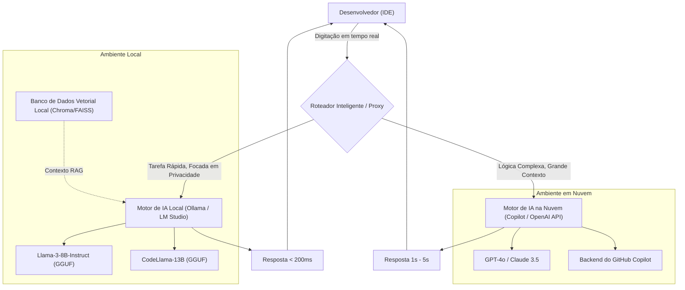
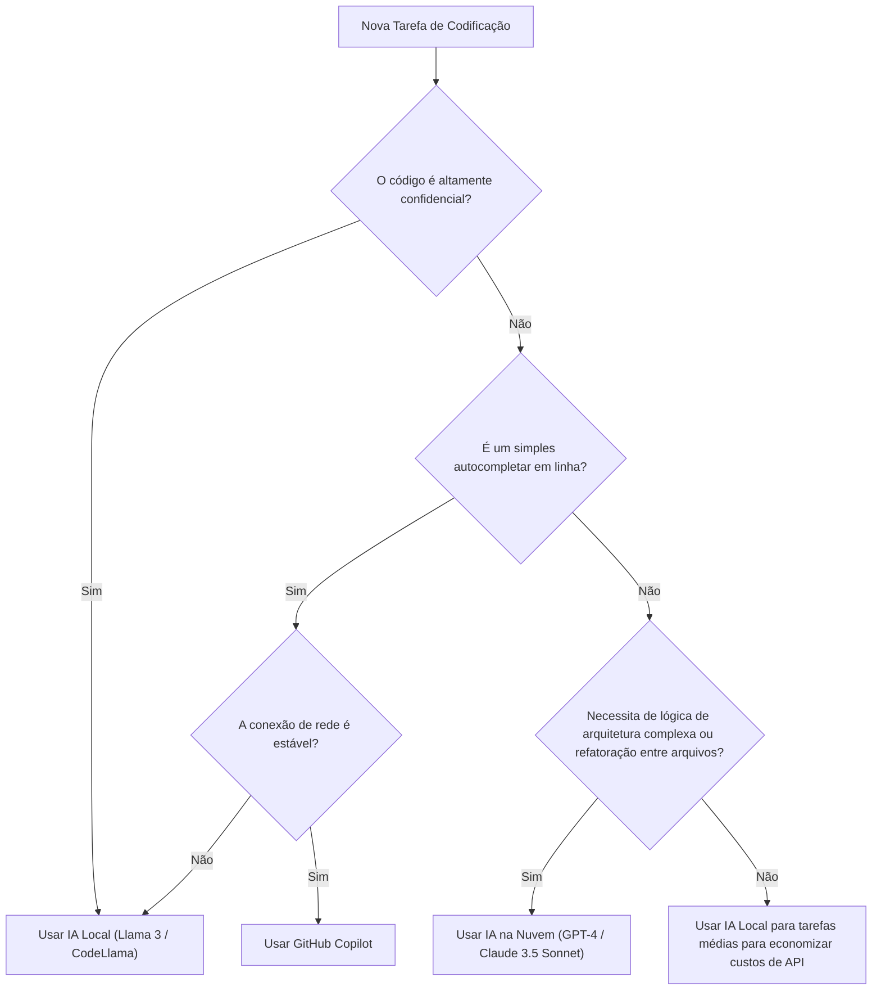

# Aumentando drasticamente a eficiência do desenvolvimento alternando entre o Copilot e a IA local: O Guia Completo para o Fluxo de Trabalho de Desenvolvimento de IA Híbrida

No desenvolvimento de software moderno, o uso de assistentes de IA evoluiu de uma ferramenta "conveniente de se ter" para uma infraestrutura "indispensável". Especialmente desde a chegada do GitHub Copilot, a experiência de codificação dos desenvolvedores mudou drasticamente. No entanto, depender de IA na nuvem para todas as tarefas nem sempre é a solução ideal.

Existem vários desafios com a IA baseada na nuvem, como os riscos de segurança ao lidar com informações confidenciais da empresa (chaves secretas, algoritmos proprietários, arquiteturas não publicadas), atrasos da API (latência) e trabalhar em ambientes offline sem conexão de rede. Portanto, nos últimos anos, a utilização de **modelos abertos rodando localmente (IA local)**, como Llama 3, CodeLlama e Mistral, tem atraído rapidamente a atenção.

Neste artigo, explicaremos de forma extremamente detalhada como maximizar (aumentar drasticamente) a eficiência do desenvolvimento combinando e alternando entre a IA baseada na nuvem (GitHub Copilot, GPT-4, etc.) e a IA local, desde o design da arquitetura e árvores de decisão específicas, até a análise matemática de custos e latência.

---

## 1. Comparação Profunda: IA na Nuvem vs. IA Local

Ao construir um fluxo de trabalho de desenvolvimento de IA híbrida, é essencial primeiro compreender profundamente as características de cada uma.

### 1.1 IA Baseada na Nuvem (GitHub Copilot, GPT-4, Claude 3.5 Sonnet)
A maior arma da IA na nuvem reside em seu "tamanho de modelo avassalador" e sua "capacidade de raciocínio de uso geral". Por ser executada em clusters gigantes de GPU, ela pode processar modelos de dezenas de bilhões a trilhões de parâmetros em alta velocidade.

*   **Vantagens (Pros)**:
    *   **Capacidade de raciocínio incomparável**: É inigualável em tarefas que exigem um entendimento profundo do contexto, como identificar bugs complexos, design de arquitetura do zero ou refatoração avançada abrangendo vários arquivos.
    *   **Janela de contexto gigante**: Os modelos mais recentes têm janelas de contexto de 100k a 2M tokens, permitindo que leiam e analisem o código base de todo o projeto de uma só vez.
    *   **Sem necessidade de gerenciamento de infraestrutura**: Os desenvolvedores não precisam se preocupar com recursos de GPU ou atualizações de modelos.
*   **Desvantagens (Cons)**:
    *   **Privacidade e Segurança**: Como o código é enviado para servidores externos, o uso pode ser restrito em empresas ou projetos que exigem conformidade rigorosa.
    *   **Latência**: Pode haver atrasos no preenchimento automático (autocompletar) em linha, onde respostas em milissegundos são necessárias, dependendo das condições da rede.
    *   **Custos**: Existem cobranças por uso ou taxas mensais de assinatura, e em implantações de grande escala, os custos operacionais não podem ser ignorados.

### 1.2 IA Local (Llama 3, CodeLlama, Qwen2.5-Coder, etc.)
A IA local refere-se a modelos executados diretamente na máquina local do desenvolvedor (MacBooks com Apple Silicon, máquinas Windows com GPUs NVIDIA, etc.). Com os avanços nas tecnologias de quantização (GGUF, AWQ, GPTQ, etc.), modelos na classe de 8B a 70B agora podem rodar a velocidades práticas em PCs de desenvolvimento comuns.

*   **Vantagens (Pros)**:
    *   **Privacidade Máxima**: Os dados nunca saem para uma rede externa. É ideal para lidar com projetos ultrassecretos ou bases de código sob rígidos NDAs (Acordos de Não Divulgação).
    *   **Latência de rede zero**: Retorna respostas em uma velocidade constante, independentemente das velocidades da conexão com a internet.
    *   **Operação em ambientes offline**: Funciona perfeitamente em aviões ou ambientes isolados de redes externas por requisitos de segurança.
    *   **Personalização ilimitada**: Pode ser ajustada (fine-tuned) para linguagens ou frameworks específicos, e permite engenharia de prompts customizada e ilimitada.
*   **Desvantagens (Cons)**:
    *   **Requisitos de Hardware**: Para rodar suavemente, é necessária uma máquina com VRAM (Memória de Vídeo) suficiente (ex: 16GB a 24GB ou mais de VRAM, ou 32GB ou mais de memória unificada em chips da série M).
    *   **Limites de desempenho do modelo**: Devido a restrições de hardware, há um limite para o tamanho do modelo que pode ser executado, e muitas vezes eles ficam aquém do raciocínio lógico complexo dos modelos da classe GPT-4.
    *   **Restrições da janela de contexto**: Devido à capacidade de memória, o comprimento do contexto que pode ser manipulado é geralmente limitado a alguns milhares a dezenas de milhares de tokens.

---

## 2. Design da Arquitetura do Fluxo de Trabalho de IA Híbrida

Para obter a melhor experiência de desenvolvimento, é necessário construir uma arquitetura que integre essas ferramentas em um único IDE (ex: VS Code, Cursor, Neovim) e permita alternar perfeitamente entre elas.

O diagrama Mermaid a seguir ilustra uma arquitetura híbrida mostrando como agentes locais e serviços em nuvem colaboram para processar as tarefas do desenvolvedor de forma distribuída.



O núcleo desta arquitetura é o **Roteador Inteligente (Intelligent Router)**. Dependendo do contexto do código que está sendo escrito, do nível de confidencialidade do arquivo alvo e da complexidade da tarefa exigida, a extensão dentro do IDE encaminha automática (ou rapidamente de forma manual) entre modelos locais e em nuvem.

Por exemplo, para o autocompletar simples de uma definição de função ou geração de código boilerplate, a tarefa é enviada para um modelo local (como Llama 3 8B) que responde em dezenas de milissegundos. Em contraste, perguntas sobre o design geral do projeto ou solicitações de chat envolvendo refatoração em grande escala são roteadas para o GPT-4 na nuvem.

---

## 3. Critérios de Decisão: Árvore de Decisão

Então, em um cenário de codificação real, como os desenvolvedores devem decidir "qual IA usar agora"? O seguinte diagrama de árvore de decisão define visualmente o fluxo de julgamento.



### 3.1 Critério 1: Confidencialidade (Privacidade e Segurança)
Este é o critério de decisão mais importante. Em códigos de teste que contêm dados de clientes ou arquivos implementando algoritmos essenciais proprietários onde a política da empresa proíbe o envio externo, escolha a IA local sem concessões. Também é altamente eficaz construir um RAG (Geração Aumentada por Recuperação) localmente, armazenar documentos internos em um banco de dados vetorial (vector store) e fazer com que o LLM local os consulte.

### 3.2 Critério 2: Latência
Para não interromper o fluxo de pensamento, a latência do autocompletar é crucial. A IA na nuvem invariavelmente sofre o tempo de ida e volta (RTT - Round Trip Time) da rede. Como a IA local tem atraso de rede zero, se você mantiver um modelo leve residente na VRAM, é possível obter uma velocidade percebida que supera a da nuvem.

### 3.3 Critério 3: Janela de Contexto
Para prompts como "Leia todos os arquivos neste repositório e organize as dependências", uma IA na nuvem que possa processar mais de 100k tokens é indispensável. Tentar processar dezenas de milhares de tokens com um modelo local esgotará a memória ou degradará drasticamente a velocidade de inferência (por exemplo, vários segundos por token).

---

## 4. Análise Matemática de Custo e Latência

Vamos analisar quantitativamente os benefícios de um fluxo de trabalho híbrido usando equações matemáticas.

### 4.1 Modelo de Cálculo de Custo
Formularemos o custo ao usar apenas a API em nuvem (ex: GPT-4). O custo total $C_{total}$ por dia em um projeto de desenvolvimento é a soma do número de tokens de entrada e saída por prompt multiplicados por seus respectivos preços unitários.

$$ C_{total} = \sum_{i=1}^{N} \left( P_{in} \times T_{in}^{(i)} + P_{out} \times T_{out}^{(i)} \right) $$

*   $N$ : Número de chamadas de API por dia
*   $P_{in}$ : Preço por 1 token de entrada
*   $P_{out}$ : Preço por 1 token de saída
*   $T_{in}^{(i)}$ : Número de tokens de entrada para a $i$-ésima chamada
*   $T_{out}^{(i)}$ : Número de tokens de saída para a $i$-ésima chamada

Se introduzirmos uma IA local e assumirmos que uma proporção $\alpha$ (0 < $\alpha$ < 1) do número de chamadas $N$ possa ser transferida para o modelo local, o novo custo da API em nuvem $C_{hybrid}$ é reduzido da seguinte forma:

$$ C_{hybrid} = (1 - \alpha) \sum_{i=1}^{N} \left( P_{in} \times T_{in}^{(i)} + P_{out} \times T_{out}^{(i)} \right) = (1 - \alpha) C_{total} $$

Mesmo considerando os custos de depreciação de hardware e contas de eletricidade, aumentar o $\alpha$ para 50% a 70% trará efeitos drásticos de redução de custos a longo prazo.

### 4.2 Modelo de Latência
Vamos modelar o tempo desde o momento em que um usuário envia um prompt até que o primeiro caractere seja exibido (Time To First Token: TTFT).

A latência da IA na nuvem, $L_{cloud}$, é expressa pela seguinte equação:

$$ L_{cloud} = L_{network\_rtt} + L_{queue} + \frac{T_{in}}{S_{process\_cloud}} $$

*   $L_{network\_rtt}$ : Tempo de ida e volta da rede (geralmente 20ms - 200ms)
*   $L_{queue}$ : Tempo de espera na fila do provedor de nuvem (aumenta durante congestionamentos)
*   $S_{process\_cloud}$ : Velocidade de processamento de tokens na GPU da nuvem (tokens/seg)

Por outro lado, a latência da IA local, $L_{local}$, é dada por:

$$ L_{local} = \frac{T_{in}}{S_{process\_local}} $$

Como o atraso da rede $L_{network\_rtt}$ e o atraso da fila na nuvem $L_{queue}$ se tornam zero, respostas ultra-rápidas (TTFT) no nível de milissegundos podem ser alcançadas se a velocidade de processamento da GPU local ($S_{process\_local}$) for alta o suficiente. É por isso que a IA local pode se tornar a ferramenta definitiva para o autocompletar em linha.

---

## 5. Mergulho Profundo em Casos de Uso Específicos por Cenário de Desenvolvimento

### Caso de Uso 1: Geração de Código Boilerplate e Autocompletar em Linha via GitHub Copilot
*   **Cenário**: Construir a estrutura de um componente React ou escrever um tratamento de erro padrão.
*   **Abordagem**: Este é o ponto forte do Copilot. Enquanto você digita, ele lê o contexto em segundo plano e sugere com precisão de algumas linhas a dezenas de linhas de código. A experiência de ter o código completado apenas pressionando "Tab" sem interromper seu processo de pensamento é o que acelera mais diretamente a velocidade de desenvolvimento.

### Caso de Uso 2: Refatoração de Código Confidencial usando IA Local (CodeLlama / Llama 3)
*   **Cenário**: Refatorar senhas de banco de dados, lógica de criptografia proprietária ou a lógica central de um novo recurso não lançado.
*   **Abordagem**: Bloqueie temporariamente o acesso de rede do IDE ou use uma extensão dedicada à IA local (ex: Continue.dev) e envie o prompt para o modelo rodando localmente (ex: via Ollama). Você pode receber assistência da IA mantendo o risco de vazamento de dados em zero.

### Caso de Uso 3: Design de Arquitetura e Correção de Bugs Complexos usando LLM em Nuvem (GPT-4 / Claude 3.5 Sonnet)
*   **Cenário**: Analisar um vazamento de memória inexplicável ou fazer consultas de design de alto nível como "Qual é a melhor abordagem para dividir este aplicativo monolítico em microsserviços?".
*   **Abordagem**: Tais tarefas requerem uma vasta quantidade de conhecimento prévio e capacidades avançadas de raciocínio lógico. Você deve usar o modelo em nuvem mais inteligente, mesmo que isso acarrete um custo. Forneça dezenas de arquivos como contexto e deixe a IA deduzir profundamente "onde está o problema".

---

## 6. Guia Prático para Configurar um Ambiente de IA Local

Apresentaremos brevemente etapas específicas para introduzir a IA local. Atualmente, a abordagem mais fácil e poderosa é usar o **Ollama** ou **LM Studio**.

### 6.1 Instalando o Ollama
O Ollama é um framework leve para rodar LLMs em ambientes locais. Ele suporta MacOS, Windows e Linux, e permite gerenciar modelos de forma intuitiva, semelhante ao Docker.

```bash
# Para MacOS
brew install ollama

# Iniciar o servidor
ollama serve

# Baixar e rodar o modelo Llama 3 (8B)
ollama run llama3

# Rodar CodeLlama, que é especializado em programação
ollama run codellama
```

### 6.2 Integração com o Editor (Utilizando o Continue.dev)
Para utilizar modelos locais no VS Code ou IDEs JetBrains, a extensão de código aberto **Continue** é excelente.
Basta especificar o servidor Ollama local como um endpoint no arquivo de configuração do Continue (`config.json`), e uma janela de chat semelhante à do ChatGPT, além de recursos de destaque e edição de código, serão adicionados ao seu IDE.

```json
{
  "models": [
    {
      "title": "Ollama Llama 3",
      "provider": "ollama",
      "model": "llama3",
      "apiBase": "http://localhost:11434"
    },
    {
      "title": "GPT-4",
      "provider": "openai",
      "model": "gpt-4",
      "apiKey": "sk-your-openai-api-key"
    }
  ],
  "tabAutocompleteModel": {
    "title": "Starcoder 2",
    "provider": "ollama",
    "model": "starcoder2"
  }
}
```
Com essa configuração, os desenvolvedores podem alternar instantaneamente entre "modelos locais" e "modelos em nuvem" a partir de um menu suspenso para conversas ou preenchimento automático, conforme necessário.

---

## 7. O Futuro do Desenvolvimento Apoiado por IA: A Ascensão dos Agentes Autônomos

O fluxo de trabalho híbrido atual baseia-se no paradigma do "copiloto" (Copilot), onde "humanos dão instruções à IA". No entanto, daqui a alguns anos, ele evoluirá ainda mais para a era dos **agentes de IA autônomos hierárquicos**. Nela, modelos locais leves monitorarão continuamente a base de código, executando testes em segundo plano, e apenas quando detectarem um erro complexo, invocarão autonomamente um modelo gigante na nuvem para gerar uma solução.

Nesse cenário, o PC local do desenvolvedor não será mais apenas uma tela executando um editor, mas assumirá fortemente o papel da linha de frente do motor de inferência (Edge AI). É por isso que a NVIDIA e a Apple continuam a aumentar a memória (VRAM / Memória Unificada) em máquinas para desenvolvedores.

---

## 8. Conclusão

Em vez de uma falsa dicotomia de "GitHub Copilot na nuvem" contra "IA local", um **fluxo de trabalho híbrido onde você entende os pontos fortes de ambos e os utiliza adequadamente, dependendo da natureza da tarefa**, é o melhor ambiente de desenvolvimento atualmente.

*   **GitHub Copilot / API em Nuvem**: Use-os para aceleração do desenvolvimento em geral, design lógico complexo e análise abrangente de todo o projeto.
*   **IA Local (Ollama, LM Studio)**: Use-a para lidar com códigos altamente confidenciais, em ambientes offline, preenchimento automático em linha ultrarrápido eliminando a latência da rede e para reduzir os custos de API.

Por favor, use as árvores de decisão e arquiteturas introduzidas neste artigo como referência para elevar o seu ambiente IDE ao próximo nível. Ao mudar do lado que "apenas usa" a IA para o lado que a "combina e controla com base na pessoa certa no lugar certo", a eficiência do seu desenvolvimento certamente aumentará de forma drástica.

Happy Coding com IA Híbrida!
