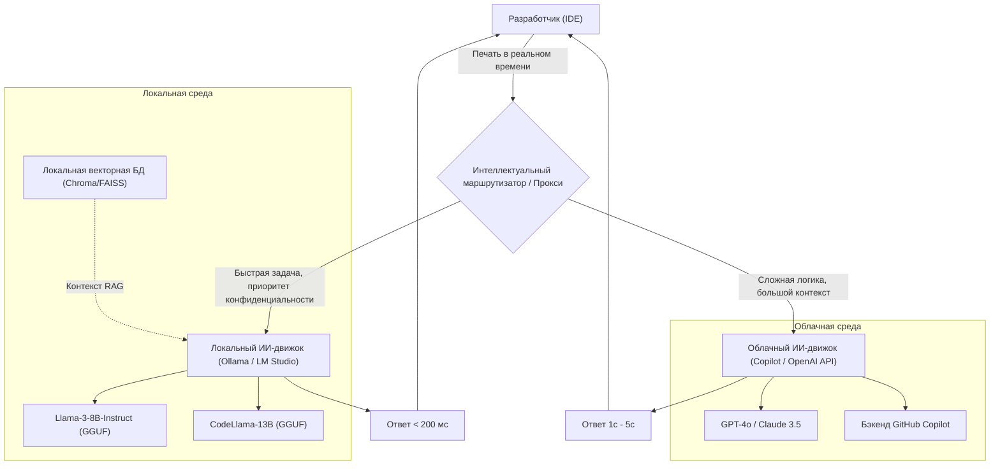
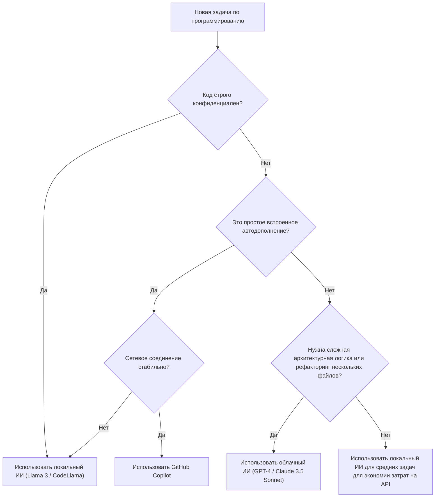

# Использование Copilot и локального ИИ для резкого повышения эффективности разработки: Полное руководство по гибридному процессу разработки с ИИ

В современной разработке программного обеспечения использование ИИ-ассистентов эволюционировало из «удобного инструмента» в «незаменимую» инфраструктуру. В частности, после появления GitHub Copilot опыт написания кода разработчиками кардинально изменился. Однако зависимость от облачного ИИ для всех задач не всегда является оптимальным решением.

Существует несколько проблем с облачным ИИ, таких как риски безопасности при работе с конфиденциальной корпоративной информацией (секретные ключи, проприетарные алгоритмы, нераскрытая архитектура), задержки API (latency) и работа в офлайн-средах без подключения к сети. В связи с этим в последние годы стремительно набирает популярность использование **локальных открытых моделей (локальный ИИ)**, таких как Llama 3, CodeLlama и Mistral.

В этой статье мы подробно расскажем, как максимизировать (резко повысить) эффективность разработки путем комбинирования и правильного использования облачного ИИ (GitHub Copilot, GPT-4 и др.) и локального ИИ. Мы рассмотрим все детально: от проектирования архитектуры до конкретных деревьев принятия решений и математического анализа стоимости и задержек.

---

## 1. Тщательное сравнение облачного и локального ИИ

При построении гибридного рабочего процесса разработки с ИИ в первую очередь важно глубоко понять особенности каждого из них.

### 1.1 Облачный ИИ (GitHub Copilot, GPT-4, Claude 3.5 Sonnet)
Главным оружием облачного ИИ является его «огромный размер модели» и «универсальные способности к логическому выводу». Поскольку он работает на гигантских кластерах GPU, он может на высокой скорости выполнять модели масштабом от десятков миллиардов до триллионов параметров.

*   **Преимущества (Pros)**:
    *   **Непревзойденная способность к логическому выводу**: Нет равных в задачах, требующих глубокого понимания контекста, таких как поиск сложных багов, проектирование архитектуры с нуля и продвинутый рефакторинг нескольких файлов.
    *   **Огромное контекстное окно**: Современные модели имеют контекстное окно размером от 100k до 2M токенов, что позволяет загружать и анализировать всю кодовую базу проекта за один раз.
    *   **Отсутствие необходимости в управлении инфраструктурой**: Разработчикам не нужно беспокоиться о ресурсах GPU или обновлениях моделей.
*   **Недостатки (Cons)**:
    *   **Конфиденциальность и безопасность**: Поскольку код отправляется на внешние серверы, использование может быть ограничено в компаниях или проектах, требующих строгого соблюдения нормативных требований (комплаенса).
    *   **Задержка**: Поскольку она зависит от состояния сетевого соединения, могут возникать задержки при встроенном (inline) автодополнении, где требуется ответ в миллисекундах.
    *   **Стоимость**: Взимается плата за использование или ежемесячная абонентская плата, и при масштабном использовании эксплуатационные расходы становятся существенными.

### 1.2 Локальный ИИ (Llama 3, CodeLlama, Qwen2.5-Coder и др.)
Локальный ИИ — это модель, которая выполняется непосредственно на локальном компьютере разработчика (MacBook с Apple Silicon, ПК на Windows с GPU от NVIDIA и т. д.). Благодаря развитию технологий квантования (GGUF, AWQ, GPTQ и др.) модели класса 8B–70B теперь могут работать с практичной скоростью на обычных ПК для разработки.

*   **Преимущества (Pros)**:
    *   **Абсолютная конфиденциальность**: Данные вообще не выходят во внешнюю сеть. Идеально подходит для работы над сверхсекретными проектами или кодовыми базами, находящимися под строгими NDA.
    *   **Нулевая сетевая задержка**: Не зависит от скорости интернет-соединения и всегда возвращает ответ с постоянной скоростью.
    *   **Работа в офлайн-среде**: Вы можете использовать весь функционал даже в самолете или в среде, изолированной от внешних сетей по соображениям безопасности.
    *   **Безграничная кастомизация**: Вы можете свободно выполнять тонкую настройку (fine-tuning) для конкретных языков или фреймворков и внедрять собственную инженерию промптов.
*   **Недостатки (Cons)**:
    *   **Требования к аппаратному обеспечению**: Для комфортной работы требуется компьютер с достаточным объемом VRAM (видеопамяти) (например, VRAM 16–24 ГБ и более, или объединенная память 32 ГБ и более для чипов серии M).
    *   **Ограничения производительности модели**: Из-за аппаратных ограничений существуют пределы размера моделей, которые можно запустить, и они часто уступают моделям класса GPT-4 в сложных логических рассуждениях.
    *   **Ограничения контекстного окна**: Из-за объема памяти длина контекста, которую можно обработать, как правило, ограничена несколькими тысячами или десятками тысяч токенов.

---

## 2. Проектирование архитектуры гибридного рабочего процесса ИИ

Чтобы получить лучший опыт разработки, необходимо интегрировать эти инструменты в одну IDE (например, VS Code, Cursor, Neovim) и построить архитектуру, позволяющую беспрепятственно переключаться между ними.

Следующая диаграмма Mermaid показывает гибридную архитектуру того, как локальные агенты и облачные сервисы взаимодействуют и распределяют задачи разработчика.



Суть этой архитектуры заключается в наличии **Intelligent Router (Интеллектуального маршрутизатора)**. Расширение в IDE автоматически (или быстро вручную) перенаправляет запросы к локальным или облачным моделям в зависимости от контекста кода, который пишет разработчик, уровня конфиденциальности целевого файла и сложности требуемой задачи.

Например, автодополнение простого определения функции или генерация шаблонного кода будут отправлены на локальную модель (например, Llama 3 8B), которая ответит за десятки миллисекунд, тогда как вопросы, связанные с проектированием всего проекта, или запросы в чат, предполагающие масштабный рефакторинг, будут отправлены в облачный GPT-4. Это динамическое распределение.

---

## 3. Критерии выбора: Дерево принятия решений

Как разработчикам в реальной практике программирования определить, «какой ИИ использовать прямо сейчас»? В следующем дереве принятия решений мы визуально определим процесс принятия решения.



### 3.1 Критерий 1: Конфиденциальность (Privacy and Security)
Самый важный критерий. В тестовом коде, содержащем данные клиентов, отправка которых запрещена политикой компании, или в файлах, где реализованы базовые проприетарные алгоритмы, без компромиссов выбирается локальный ИИ. Создание локальной системы RAG (поисковой генерации) и хранение внутренней документации в векторном хранилище для использования локальной LLM — также очень эффективный метод.

### 3.2 Критерий 2: Задержка (Latency)
Чтобы не прерывать скорость мышления, задержка автодополнения имеет решающее значение. Облачный ИИ всегда имеет время кругового обращения по сети (RTT). Поскольку у локального ИИ сетевая задержка равна нулю, то при постоянном нахождении легковесной модели в VRAM можно достичь субъективной скорости, превышающей скорость облака.

### 3.3 Критерий 3: Контекстное окно (Context Window)
Для промптов вроде «Прочитай все файлы в этом репозитории и организуй зависимости» необходим облачный ИИ, способный обработать 100k и более токенов. Если попытаться обработать десятки тысяч токенов с помощью локальной модели, либо закончится память, либо скорость логического вывода резко упадет (например, до нескольких секунд на токен).

---

## 4. Математический анализ стоимости и задержки (Mathematical Analysis)

Давайте количественно проанализируем преимущества гибридного рабочего процесса с использованием математических формул.

### 4.1 Модель расчета стоимости
Выведем формулу для стоимости использования только облачного API (например, GPT-4). Общая стоимость $C_{total}$ за один день в проекте разработки — это сумма количества входящих и исходящих токенов для каждого промпта, умноженная на цену за единицу.

$$ C_{total} = \sum_{i=1}^{N} \left( P_{in} \times T_{in}^{(i)} + P_{out} \times T_{out}^{(i)} \right) $$

*   $N$ : Количество вызовов API за день
*   $P_{in}$ : Цена за 1 входящий токен
*   $P_{out}$ : Цена за 1 исходящий токен
*   $T_{in}^{(i)}$ : Количество входящих токенов для $i$-го вызова
*   $T_{out}^{(i)}$ : Количество исходящих токенов для $i$-го вызова

Предположив, что мы внедрили локальный ИИ и смогли перенести долю $\alpha$ (0 < $\alpha$ < 1) из $N$ вызовов на локальную модель, новая стоимость облачного API $C_{hybrid}$ будет снижена следующим образом:

$$ C_{hybrid} = (1 - \alpha) \sum_{i=1}^{N} \left( P_{in} \times T_{in}^{(i)} + P_{out} \times T_{out}^{(i)} \right) = (1 - \alpha) C_{total} $$

Даже с учетом амортизации оборудования и затрат на электроэнергию, если $\alpha$ удастся увеличить до 50%–70%, в долгосрочной перспективе это приведет к кардинальному эффекту снижения затрат.

### 4.2 Модель задержки (Latency)
Смоделируем время с момента отправки промпта пользователем до появления первого символа (Time To First Token: TTFT).

Задержка облачного ИИ $L_{cloud}$ выражается следующей формулой:

$$ L_{cloud} = L_{network\_rtt} + L_{queue} + \frac{T_{in}}{S_{process\_cloud}} $$

*   $L_{network\_rtt}$ : Время кругового обращения по сети (обычно 20 мс - 200 мс)
*   $L_{queue}$ : Время ожидания в очереди на стороне облачного провайдера (увеличивается при перегрузке)
*   $S_{process\_cloud}$ : Скорость обработки токенов облачным GPU (tokens/sec)

С другой стороны, задержка локального ИИ $L_{local}$ выглядит следующим образом:

$$ L_{local} = \frac{T_{in}}{S_{process\_local}} $$

Поскольку сетевая задержка $L_{network\_rtt}$ и облачная задержка очереди $L_{queue}$ равны нулю, если $S_{process\_local}$ (скорость обработки локального GPU) достаточно высока, достигается сверхбыстрый ответ (TTFT) порядка нескольких миллисекунд. Вот почему локальный ИИ может быть лучшим инструментом для встроенного (inline) автодополнения.

---

## 5. По сценариям разработки: Глубокое погружение в конкретные случаи использования

### Сценарий 1: Генерация шаблонного кода и встроенное автодополнение с помощью GitHub Copilot
*   **Сценарий**: Когда вам нужно создать каркас компонента React или написать стандартную обработку ошибок.
*   **Подход**: Здесь у Copilot нет конкурентов. Во время набора текста он постоянно считывает контекст в фоновом режиме и точно предлагает от нескольких строк до десятков строк кода. Опыт, когда код завершается простым нажатием «клавиши Tab» без прерывания мыслей, наиболее напрямую повышает скорость разработки.

### Сценарий 2: Рефакторинг конфиденциального кода с помощью локального ИИ (CodeLlama / Llama 3)
*   **Сценарий**: Когда вы хотите провести рефакторинг паролей базы данных, проприетарной логики шифрования или основной логики еще не выпущенной новой функции.
*   **Подход**: Временно отключите доступ к сети в IDE или используйте расширение, предназначенное для локального ИИ (например, Continue.dev и т. д.), и отправьте промпт модели, работающей локально (например, через Ollama). Вы можете получать помощь ИИ, сохраняя риск утечки данных равным нулю.

### Сценарий 3: Проектирование архитектуры и исправление сложных багов с помощью облачных LLM (GPT-4 / Claude 3.5 Sonnet)
*   **Сценарий**: Анализ причин утечки памяти неизвестного происхождения или консультации по проектированию высокого уровня, такие как «Какой подход лучше всего использовать для разделения этого монолитного приложения на микросервисы?».
*   **Подход**: Такие задачи требуют огромных предварительных знаний и продвинутых навыков логического вывода. Стоит использовать самую умную облачную модель, даже если это требует затрат. Передайте десятки файлов в качестве контекста, чтобы она могла глубоко проанализировать, «где проблема».

---

## 6. Руководство по настройке среды локального ИИ (Практическая часть)

Мы кратко опишем конкретные шаги по внедрению локального ИИ. В настоящее время наиболее простым и мощным подходом является использование **Ollama** или **LM Studio**.

### 6.1 Установка Ollama
Ollama — это легковесный фреймворк для запуска LLM в локальной среде. Он поддерживает MacOS, Windows и Linux и позволяет управлять моделями интуитивно понятно, как в Docker.

```bash
# Для MacOS
brew install ollama

# Запуск сервера
ollama serve

# Скачивание и запуск модели Llama 3 (8B)
ollama run llama3

# Запуск CodeLlama, специализированной на программировании
ollama run codellama
```

### 6.2 Интеграция в редактор (Использование Continue.dev)
Для использования локальных моделей в VS Code или JetBrains IDE отличным вариантом является опенсорсное расширение **Continue**.
Просто указав локальный сервер Ollama в качестве конечной точки (endpoint) в файле конфигурации Continue (`config.json`), вы добавите в IDE окно чата в стиле ChatGPT и функции выделения и редактирования кода.

```json
{
  "models": [
    {
      "title": "Ollama Llama 3",
      "provider": "ollama",
      "model": "llama3",
      "apiBase": "http://localhost:11434"
    },
    {
      "title": "GPT-4",
      "provider": "openai",
      "model": "gpt-4",
      "apiKey": "sk-your-openai-api-key"
    }
  ],
  "tabAutocompleteModel": {
    "title": "Starcoder 2",
    "provider": "ollama",
    "model": "starcoder2"
  }
}
```
С помощью этой настройки разработчики могут мгновенно переключаться между «локальной моделью» и «облачной моделью» из выпадающего меню по мере необходимости для общения в чате и автодополнения.

---

## 7. Будущее разработки с поддержкой ИИ: Рост автономных агентов

Современный гибридный рабочий процесс основан на парадигме «Второго пилота» (Copilot), где «человек дает инструкции ИИ». Однако через несколько лет он эволюционирует еще дальше, и наступит эра **иерархических автономных ИИ-агентов**, когда легковесная локальная модель будет постоянно отслеживать кодовую базу, запускать тесты в фоновом режиме и автономно вызывать гигантскую облачную модель для создания решения только при обнаружении сложной ошибки.

В этом случае локальный ПК разработчика будет играть сильную роль передовой (Edge AI) системы логического вывода, а не просто экрана для работы редактора. NVIDIA и Apple продолжают увеличивать объем памяти (VRAM / объединенная память) в компьютерах для разработчиков именно с прицелом на это будущее.

---

## 8. Заключение (Conclusion)

Сейчас не время для дихотомии «облачный GitHub Copilot» или «локальный ИИ». **Гибридный рабочий процесс, который понимает сильные стороны обоих подходов и использует их в зависимости от характера задачи** — это, безусловно, лучшая среда разработки на сегодняшний день.

*   **GitHub Copilot / Облачный API**: Используйте для универсального повышения скорости разработки, проектирования сложной логики и комплексного анализа всего проекта.
*   **Локальный ИИ (Ollama, LM Studio)**: Используйте для обработки высококонфиденциального кода, работы в офлайн-средах, сверхбыстрого встроенного автодополнения без сетевых задержек и снижения затрат на API.

Пожалуйста, используйте дерево принятия решений и архитектуру, представленные в этой статье, чтобы вывести вашу среду IDE на новый уровень. Сделав шаг от просто «использования» ИИ к «использованию нужных инструментов в нужном месте», вы несомненно резко повысите эффективность вашей разработки.

Happy Coding with Hybrid AI!
