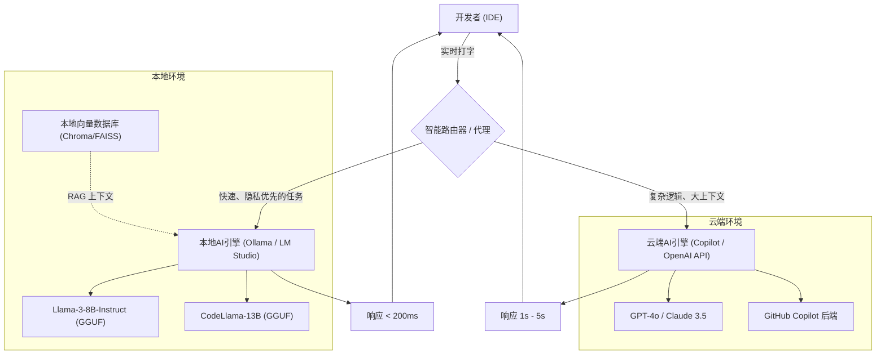
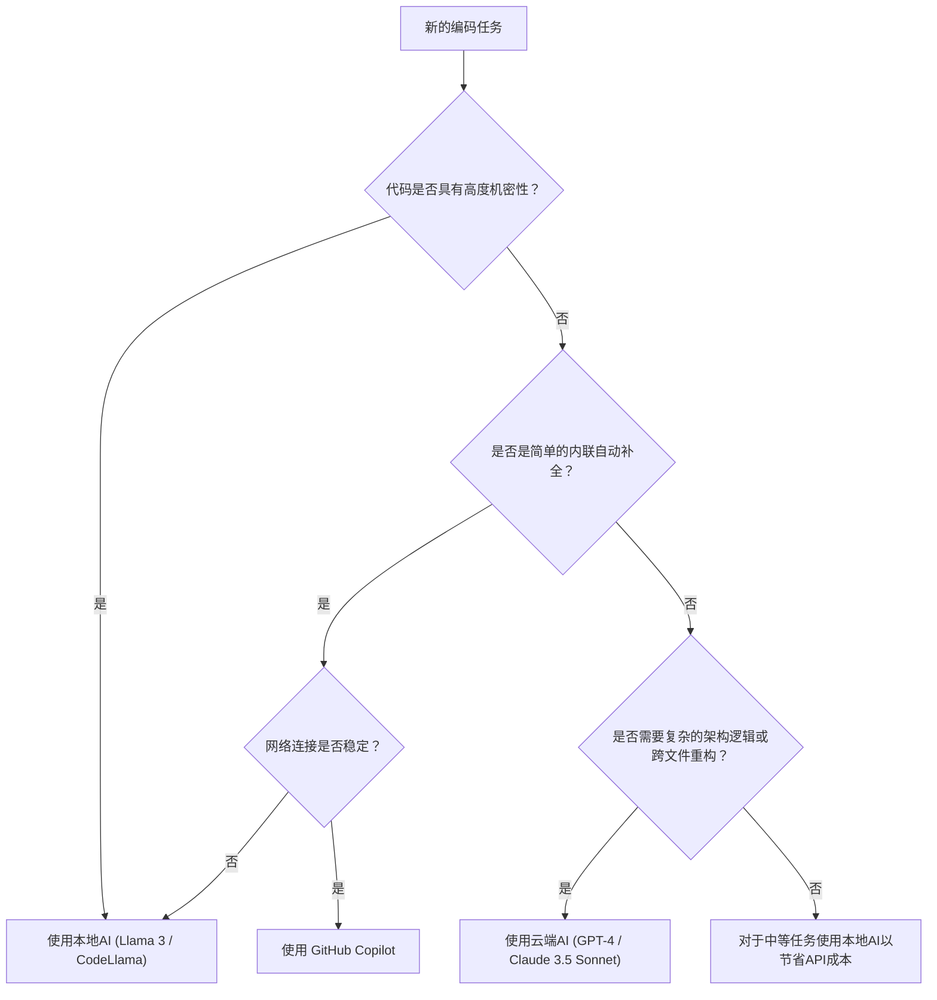

# 通过区分使用Copilot与本地AI引爆开发效率：混合AI开发工作流的完全指南

在现代软件开发中，AI助手的应用已经从“有则便利”的工具进化为“不可或缺”的基础设施。特别是自GitHub Copilot问世以来，开发者的编码体验发生了剧变。然而，将所有任务都依赖于云端AI并不总是最优解。

在处理企业机密信息（密钥、独有算法、未公开的架构）时的安全风险，API的延迟（Latency），甚至是在无法连接网络的离线环境中的工作等，基于云端的AI存在一些挑战。因此，近年来迅速引起关注的是，利用Llama 3、CodeLlama、Mistral等**在本地运行的开源模型（本地AI）**。

本文将极其详细地解说如何结合并区分使用基于云端的AI（如GitHub Copilot和GPT-4）与本地AI，从而最大化（引爆）开发效率。内容涵盖从其架构设计到具体的决策树，再到成本与延迟的数学分析。

---

## 1. 云端AI与本地AI的彻底比较

在构建混合AI开发工作流时，首先深入了解它们各自的特性非常重要。

### 1.1 基于云端的AI（GitHub Copilot, GPT-4, Claude 3.5 Sonnet）
云端AI最大的武器在于其“压倒性的模型规模”与“通用的推理能力”。由于在巨大的GPU集群上运行，它可以高速执行数百亿至数万亿参数规模的模型。

*   **优点（Pros）**:
    *   **无与伦比的推理能力**: 在需要深入理解上下文的任务中（如定位复杂的Bug、从零开始的架构设计、跨越多个文件的高级重构等），无出其右者。
    *   **巨大的上下文窗口**: 最新的模型拥有10万至200万Token的上下文窗口，可以一次性读取并分析整个项目的代码库。
    *   **无需基础设施管理**: 开发者无需关心GPU资源或模型的更新。
*   **缺点（Cons）**:
    *   **隐私与安全**: 由于代码会被发送到外部服务器，在要求严格合规性的企业或项目中，其使用可能会受到限制。
    *   **延迟**: 由于依赖网络的通信状况，在要求毫秒级响应的内联补全中可能会发生延迟。
    *   **成本**: 会产生基于使用量的按需计费，或是每月的订阅费用，在大规模使用时，运行成本将变得不可忽视。

### 1.2 本地AI（Llama 3, CodeLlama, Qwen2.5-Coder 等）
本地AI是直接在开发者的本地机器（如搭载Apple Silicon的MacBook，或搭载NVIDIA GPU的Windows机器等）上执行的模型。得益于量化技术（GGUF, AWQ, GPTQ等）的进步，8B至70B级别的模型现在也可以在普通的开发用PC上以实用的速度运行。

*   **优点（Pros）**:
    *   **极致的隐私**: 数据完全不会流出到外部网络。在处理绝密项目或处于严格NDA下的代码库时是最佳选择。
    *   **零网络延迟**: 不依赖于互联网的网速，始终以一定的速度返回响应。
    *   **在离线环境中运行**: 无论是在飞机上，还是在因安全要求而与外部网络隔离的环境中，都可以使用全部功能。
    *   **无限的定制化**: 可以专门针对特定的语言或框架进行微调（Fine-tuning），或者自由地结合独特的提示词工程（Prompt Engineering）。
*   **缺点（Cons）**:
    *   **硬件要求**: 为了让它流畅运行，需要搭载充足VRAM（显存）的机器（例如：16GB至24GB以上的VRAM，或者M系列芯片的32GB以上统一内存）。
    *   **模型性能的局限**: 受限于硬件，可执行的模型大小存在极限，很多情况下无法企及GPT-4级别的复杂逻辑推理。
    *   **上下文窗口的限制**: 出于内存容量的限制，能处理的上下文长度通常被限制在数千至数万个Token左右。

---

## 2. 混合AI工作流的架构设计

为了获得最佳的开发体验，需要将这些工具集成在单一的IDE（例如：VS Code, Cursor, Neovim）上，并构建一个能够无缝切换的架构。

以下的Mermaid图展示了本地代理与云端服务如何协作，以及如何将开发者的任务进行分布式处理的混合架构。



这个架构的核心在于**Intelligent Router（智能路由器）**的存在。根据开发者正在编写的代码上下文、目标文件的机密级别、以及所要求任务的复杂程度，IDE内的扩展功能会自动（或手动快速）将请求路由到本地模型或云端模型。

例如，如果是简单的函数定义补全或样板代码生成，就可以将处理交给能在数十毫秒内响应的本地模型（如 Llama 3 8B 等）；而对于涉及整个项目设计的问题，或伴随大规模重构的聊天提示词，则可以交给云端的GPT-4。系统会进行这样的动态分配。

---

## 3. 区分使用的判断标准：决策树

那么，在实际的编码现场中，开发者该如何判断“现在应该使用哪一种AI”呢？我们将使用以下的决策树来直观地定义判断流程。



### 3.1 评估维度1：机密性（Privacy and Security）
这是最重要的判断标准。在包含企业策略禁止向外发送的客户数据的测试代码，或实现了核心专有算法的文件中，应毫不妥协地选择本地AI。在本地构建RAG（检索增强生成），将公司内部文档存储在向量数据库中并让本地LLM进行参考的手法也是非常有效的。

### 3.2 评估维度2：延迟（Latency）
为了不打断思考的速度，补全的延迟是非常重要的。云端AI必然会产生网络的往返时间（RTT）。而本地AI的网络延迟为零，因此如果让轻量级模型常驻在VRAM中，是有可能获得超越云端的体验速度的。

### 3.3 评估维度3：上下文窗口（Context Window）
对于诸如“读取这个代码库的所有文件并整理依赖关系”这样的提示词，处理10万以上Token的云端AI是必不可少的。如果试图用本地模型处理数万个Token，不仅内存可能会耗尽，推理速度也会急剧下降（例如每个Token需要几秒钟）。

---

## 4. 成本与延迟的数学分析（Mathematical Analysis）

让我们使用数学公式定量分析混合工作流的优势。

### 4.1 成本计算模型
我们将仅使用云端API（如GPT-4）的情况下的成本进行公式化。在开发项目中，每天的总成本 $C_{total}$ 将是每次提示词的输入Token数和输出Token数乘以单价后的总和。

$$ C_{total} = \sum_{i=1}^{N} \left( P_{in} \times T_{in}^{(i)} + P_{out} \times T_{out}^{(i)} \right) $$

*   $N$ : 每天的API调用次数
*   $P_{in}$ : 输入每个Token的价格
*   $P_{out}$ : 输出每个Token的价格
*   $T_{in}^{(i)}$ : 第 $i$ 次调用的输入Token数
*   $T_{out}^{(i)}$ : 第 $i$ 次调用的输出Token数

假设引入本地AI后，能够将调用次数 $N$ 中的比例 $\alpha$ (0 < $\alpha$ < 1) 卸载给本地模型，那么新的云端API成本 $C_{hybrid}$ 将会削减如下：

$$ C_{hybrid} = (1 - \alpha) \sum_{i=1}^{N} \left( P_{in} \times T_{in}^{(i)} + P_{out} \times T_{out}^{(i)} \right) = (1 - \alpha) C_{total} $$

即使考虑硬件的折旧费和电费，如果能将 $\alpha$ 提高到50%至70%，从长远来看也会带来戏剧性的成本削减效果。

### 4.2 延迟（Latency）模型
我们将从用户发送提示词到显示第一个字符的时间（首个Token时间，Time To First Token: TTFT）进行建模。

云端AI的延迟 $L_{cloud}$ 用以下公式表示：

$$ L_{cloud} = L_{network\_rtt} + L_{queue} + \frac{T_{in}}{S_{process\_cloud}} $$

*   $L_{network\_rtt}$ : 网络的往返时间（通常为 20ms - 200ms）
*   $L_{queue}$ : 云服务提供商端的队列等待时间（拥堵时会增加）
*   $S_{process\_cloud}$ : 云端GPU的Token处理速度（tokens/sec）

另一方面，本地AI的延迟 $L_{local}$ 如下所示：

$$ L_{local} = \frac{T_{in}}{S_{process\_local}} $$

由于网络延迟 $L_{network\_rtt}$ 和云端的队列等待延迟 $L_{queue}$ 变为零，只要 $S_{process\_local}$（本地GPU的处理速度）足够高，就能实现毫秒级的超高速响应（TTFT）。这就是为什么本地AI能成为内联补全中最强工具的理由。

---

## 5. 按开发场景分类：具体用例的深入探讨

### 用例1: 使用 GitHub Copilot 生成样板代码与内联补全
*   **场景**: 构建 React 组件的骨架，或是编写固定格式的错误处理代码等场合。
*   **方法**: 这是 Copilot 的专属舞台。在打字时，它会一直在后台读取上下文，并准确地提出数行至数十行代码的建议。在不打断思考的情况下，只需按下“Tab键”就能让代码完成的体验，最直接地提升了开发速度。

### 用例2: 使用本地AI（CodeLlama / Llama 3）重构机密代码
*   **场景**: 想要重构数据库的密码、特有的加密逻辑，或者是未发布新功能的核心逻辑等场合。
*   **方法**: 可以暂时切断IDE的网络访问，或者使用本地AI专用的扩展功能（如 Continue.dev 等），向在本地运行的模型（通过 Ollama 等）发送提示词。这样就能在将数据泄露风险保持为零的情况下，获得AI的协助。

### 用例3: 使用云端LLM（GPT-4 / Claude 3.5 Sonnet）进行架构设计与复杂的Bug修复
*   **场景**: 分析原因不明的内存泄漏，或者进行“将这个单体应用拆分为微服务的最佳方案是什么？”这类高维度设计咨询。
*   **方法**: 这样的任务需要庞大的先验知识和高度的逻辑推理能力。即使需要花费成本，也应该利用最聪明的云端模型。将数十个文件作为上下文传递给它，让它深入洞察“问题出在哪里”。

---

## 6. 本地AI环境搭建指南（实践篇）

这里简单介绍引入本地AI的具体步骤。目前最简便且强大的方法是使用 **Ollama** 或 **LM Studio**。

### 6.1 引入 Ollama
Ollama 是一个用于在本地环境中运行 LLM 的轻量级框架。它支持 MacOS、Windows 和 Linux，可以像 Docker 一样直观地管理模型。

```bash
# MacOS 的情况
brew install ollama

# 启动服务器
ollama serve

# 下载并运行 Llama 3 (8B) 模型
ollama run llama3

# 运行专精于编程的 CodeLlama
ollama run codellama
```

### 6.2 集成到编辑器中 (活用 Continue.dev)
要在 VS Code 或 JetBrains IDE 中活用本地模型，一款名为 **Continue** 的开源扩展功能非常优秀。
只需在 Continue 的配置文件（`config.json`）中指定本地的 Ollama 服务器作为端点，就能在 IDE 内添加类似 ChatGPT 的聊天窗口，以及代码的高亮与编辑功能。

```json
{
  "models": [
    {
      "title": "Ollama Llama 3",
      "provider": "ollama",
      "model": "llama3",
      "apiBase": "http://localhost:11434"
    },
    {
      "title": "GPT-4",
      "provider": "openai",
      "model": "gpt-4",
      "apiKey": "sk-your-openai-api-key"
    }
  ],
  "tabAutocompleteModel": {
    "title": "Starcoder 2",
    "provider": "ollama",
    "model": "starcoder2"
  }
}
```
通过这样的设置，开发者可以根据需要，从下拉菜单中瞬间切换“本地模型”和“云端模型”来进行聊天和代码补全。

---

## 7. AI辅助开发的未来：自主型代理的崛起

目前的混合工作流是基于“人类向AI发出指令”的副驾驶（Copilot）范式。然而几年后，它将进一步进化，迎来**分层自主型AI代理**的时代——本地的轻量级模型将始终监控代码库并在后台运行测试，只有在检测到复杂的错误时，才会自主地调用云端的巨大模型来生成解决方案。

届时，开发者的本地PC将不再仅仅是运行编辑器的屏幕，而是将强烈地承担起作为推理引擎最前线（边缘AI）的角色。NVIDIA 和 Apple 持续增加面向开发者的机器内存（VRAM / 统一内存），正是着眼于这一未来。

---

## 8. 总结（Conclusion）

并非“云端的 GitHub Copilot”与“本地的AI”之间的二元对立，而是**理解两者的优势，并根据任务性质适当地区分使用的混合工作流**，才是现阶段最强的开发环境。

*   **GitHub Copilot / 云端API**: 用于提高通用的开发速度、设计复杂的逻辑、以及对整个项目进行全局的俯瞰分析。
*   **本地AI (Ollama, LM Studio)**: 用于处理高机密性的代码、在离线环境中使用、排除网络延迟实现超高速的内联补全，以及削减 API 成本。

请务必参考本文介绍的决策树和架构，将您的IDE环境提升到下一个层次。从“被动使用”AI的一方，迈向“将它们适材适所地结合并驱使”的一方，您的开发效率必定会获得爆发式的提升。

Happy Coding with Hybrid AI!
