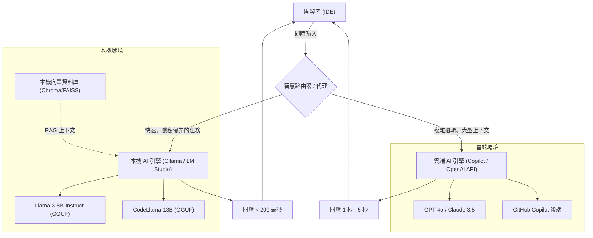
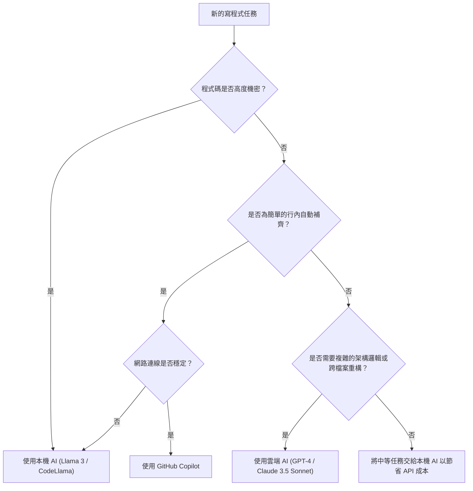

# 透過靈活運用 Copilot 與本機 AI 來大幅提升開發效率：混合 AI 開發工作流程的完整指南

在現代的軟體開發中，AI 助理的應用已經從「有了很方便」的工具，進化成「不可或缺」的基礎設施。特別是自 GitHub Copilot 登場以來，開發者的寫程式體驗發生了劇烈的變化。然而，將所有的任務都依賴於雲端上的 AI，並不總是最佳解。

在處理企業的機密資訊（密鑰、專有演算法、未公開的架構）時所面臨的資安風險、API 的延遲（Latency），甚至是在無法連接網路的離線環境下工作等，雲端 AI 存在著一些挑戰。因此，近年來**在本機運作的開放模型（本機 AI）**的應用迅速受到矚目，如 Llama 3、CodeLlama 和 Mistral。

本文將極其詳細地解說如何結合與區分雲端 AI（如 GitHub Copilot 和 GPT-4）與本機 AI，以將開發效率最大化（大幅提升），內容涵蓋從架構設計、具體的決策樹，到成本與延遲的數學分析。

---

## 1. 雲端 AI 與本機 AI 的徹底比較

在建立混合 AI 開發工作流程時，首先必須深入了解各自的特性。

### 1.1 雲端 AI（GitHub Copilot, GPT-4, Claude 3.5 Sonnet）
雲端 AI 最大的武器在於其「壓倒性的模型規模」與「通用的推論能力」。因為在巨大的 GPU 叢集上運作，所以能夠高速執行數百億到數兆參數規模的模型。

*   **優點（Pros）**:
    *   **無與倫比的推論能力**: 在需要深入理解上下文的任務中（如找出複雜的 Bug、從零開始的架構設計、橫跨多個檔案的高階重構等），無人能出其右。
    *   **巨大的上下文視窗**: 最新的模型擁有 100k 到 2M 詞元的上下文視窗，可以一次讀取並分析整個專案的程式碼庫。
    *   **無需管理基礎設施**: 開發者不需要擔心 GPU 資源或模型更新的問題。
*   **缺點（Cons）**:
    *   **隱私與安全性**: 由於程式碼會被傳送到外部伺服器，對於需要嚴格遵循合規性的企業或專案，使用上可能會受到限制。
    *   **延遲（Latency）**: 由於依賴網路通訊狀況，在需要毫秒級回應的行內補齊（Inline Autocomplete）中可能會發生延遲。
    *   **成本**: 根據使用量計費，或是每月訂閱費用，在大規模使用下，營運成本將不容忽視。

### 1.2 本機 AI（Llama 3, CodeLlama, Qwen2.5-Coder 等）
本機 AI 是直接在開發者的本機電腦（如 MacBook 的 Apple Silicon，或是配備 NVIDIA GPU 的 Windows 電腦等）上執行的模型。隨著量化技術（GGUF, AWQ, GPTQ 等）的進步，8B 到 70B 等級的模型已經能在一般的開發用 PC 上以實用的速度運作。

*   **優點（Pros）**:
    *   **極致的隱私**: 資料完全不會傳送到外部網路。非常適合處理極機密專案或受到嚴格 NDA 規範的程式碼庫。
    *   **零網路延遲**: 不依賴網際網路連線速度，能始終以固定的速度回覆。
    *   **在離線環境下運作**: 即使在飛機上，或因為安全需求而與外部網路隔離的環境中，也能使用完整功能。
    *   **無限的客製化**: 可以針對特定語言或框架進行微調（Fine-tuning），或是自由地整合獨特的提示工程。
*   **缺點（Cons）**:
    *   **硬體需求**: 為了能流暢運作，需要配備足夠 VRAM（視訊記憶體）的電腦（例如：VRAM 16GB 至 24GB 以上，或是 M 系列晶片統一記憶體 32GB 以上）。
    *   **模型效能的極限**: 受限於硬體，能執行的模型規模有其極限，在複雜的邏輯推論上通常不及 GPT-4 等級。
    *   **上下文視窗的限制**: 受限於記憶體容量，一般來說能處理的上下文長度會被限制在數千到數萬詞元左右。

---

## 2. 混合 AI 工作流程的架構設計

為了獲得最佳的開發體驗，我們需要在單一 IDE（例如：VS Code, Cursor, Neovim）中整合這些工具，並建立一個能無縫切換的架構。

以下的 Mermaid 圖展示了混合架構，說明本機代理（Local Agent）與雲端服務如何協同運作，並分散處理開發者的任務。



這個架構的核心在於**智慧路由器（Intelligent Router）**的存在。根據開發者正在撰寫的程式碼上下文、目標檔案的機密等級以及任務的複雜度，IDE 內的擴充功能會自動（或讓使用者快速手動）將請求路由至本機模型或雲端模型。

例如，若是單純的函式定義補齊或樣板程式碼的生成，就會將任務交給能在數十毫秒內回應的本機模型（如 Llama 3 8B 等）；而涉及整個專案設計的提問或伴隨大規模重構的聊天提示，則會交給雲端的 GPT-4，以此進行動態分流。

---

## 3. 區分使用的判斷基準：決策樹

那麼，在實際寫程式的現場，開發者應該如何判斷「現在該使用哪種 AI」呢？我們使用以下的決策樹來將判斷流程視覺化。



### 3.1 評估指標 1：機密性（Privacy and Security）
這是最重要的判斷基準。對於包含企業政策禁止外傳的客戶資料的測試程式碼，或是實作核心專有演算法的檔案，必須毫不妥協地選擇本機 AI。在本機建立 RAG（檢索增強生成），將內部文件儲存於向量資料庫中供本機 LLM 參考的手法也非常有效。

### 3.2 評估指標 2：延遲（Latency）
為了不中斷思考的速度，程式碼補齊的延遲非常關鍵。雲端 AI 必然會產生網路的來回通訊時間（RTT）。由於本機 AI 沒有網路延遲，只要將輕量級模型常駐於 VRAM 中，就能獲得超越雲端的體感速度。

### 3.3 評估指標 3：上下文視窗（Context Window）
對於像是「閱讀此儲存庫的所有檔案，並整理依賴關係」這類的提示，能夠處理 100k 以上詞元的雲端 AI 是不可或缺的。如果試圖用本機模型處理數萬詞元，可能會導致記憶體耗盡，或是推論速度急遽下降（例如每詞元需要數秒）。

---

## 4. 成本與延遲的數學分析（Mathematical Analysis）

讓我們用數學公式來定量分析混合工作流程的優勢。

### 4.1 成本計算模型
我們將僅使用雲端 API（例如：GPT-4）的成本公式化。開發專案中每天的總成本 $C_{total}$ 是每個提示的輸入詞元數與輸出詞元數乘以單價的總和。

$$ C_{total} = \sum_{i=1}^{N} \left( P_{in} \times T_{in}^{(i)} + P_{out} \times T_{out}^{(i)} \right) $$

*   $N$ : 每天的 API 呼叫次數
*   $P_{in}$ : 輸入每詞元的價格
*   $P_{out}$ : 輸出每詞元的價格
*   $T_{in}^{(i)}$ : 第 $i$ 次呼叫的輸入詞元數
*   $T_{out}^{(i)}$ : 第 $i$ 次呼叫的輸出詞元數

如果導入本機 AI，並假設呼叫次數 $N$ 中有比例 $\alpha$ (0 < $\alpha$ < 1) 可以轉移給本機模型處理，那麼新的雲端 API 成本 $C_{hybrid}$ 將會依下列方式減少：

$$ C_{hybrid} = (1 - \alpha) \sum_{i=1}^{N} \left( P_{in} \times T_{in}^{(i)} + P_{out} \times T_{out}^{(i)} \right) = (1 - \alpha) C_{total} $$

即使考慮硬體的折舊費用和電費，如果能將 $\alpha$ 提高到 50% 至 70%，從長遠來看將會帶來戲劇性的成本削減效果。

### 4.2 延遲（遲延）模型
我們將使用者送出提示後，到顯示第一個字元為止的時間（Time To First Token: TTFT）進行模型化。

雲端 AI 的延遲 $L_{cloud}$ 可以用以下公式表示：

$$ L_{cloud} = L_{network\_rtt} + L_{queue} + \frac{T_{in}}{S_{process\_cloud}} $$

*   $L_{network\_rtt}$ : 網路的來回通訊時間（通常為 20ms - 200ms）
*   $L_{queue}$ : 雲端供應商端的佇列等待時間（在擁擠時會增加）
*   $S_{process\_cloud}$ : 雲端 GPU 的詞元處理速度（tokens/sec）

另一方面，本機 AI 的延遲 $L_{local}$ 如下所示：

$$ L_{local} = \frac{T_{in}}{S_{process\_local}} $$

因為網路延遲 $L_{network\_rtt}$ 與雲端的佇列延遲 $L_{queue}$ 為零，只要 $S_{process\_local}$（本機 GPU 的處理速度）夠快，就能實現毫秒級別的超高速回應（TTFT）。這就是為什麼本機 AI 能夠成為行內補齊最強工具的原因。

---

## 5. 依開發情境分類：具體使用案例的深入探討

### 使用案例 1: 透過 GitHub Copilot 生成樣板程式碼與行內補齊
*   **情境**: 建立 React 元件骨架，或是撰寫例行性錯誤處理的場合。
*   **方法**: 這是 Copilot 的絕對領域。在打字時，它會持續在背景讀取上下文，並精準地提出幾行到幾十行的程式碼建議。不中斷思考，只要按下「Tab 鍵」程式碼就能完成的體驗，將最直接地提升開發速度。

### 使用案例 2: 透過本機 AI（CodeLlama / Llama 3）重構機密程式碼
*   **情境**: 想要重構資料庫密碼、專有加密邏輯，或是尚未發布的新功能核心邏輯的場合。
*   **方法**: 暫時阻斷 IDE 的網路存取，或使用專屬本機 AI 的擴充功能（如：Continue.dev 等），將提示傳送給在本機運作的模型（例如透過 Ollama）。這樣就能在資料外洩風險保持為零的情況下，獲得 AI 的協助。

### 使用案例 3: 透過雲端 LLM（GPT-4 / Claude 3.5 Sonnet）進行架構設計與複雜 Bug 修復
*   **情境**: 分析原因不明的記憶體洩漏，或是「將這個單體應用程式拆分為微服務的最佳方法為何？」等高階設計諮詢。
*   **方法**: 這種任務需要龐大的先備知識與高度的邏輯推論能力。即使需要花費成本，也應該使用最聰明的雲端模型。可以傳入數十個檔案作為上下文，讓其深入洞察「問題到底出在哪裡」。

---

## 6. 本機 AI 環境建置指南（實戰篇）

簡單介紹導入本機 AI 的具體步驟。目前最簡單且最強大的方法是使用 **Ollama** 或 **LM Studio**。

### 6.1 導入 Ollama
Ollama 是一個輕量級框架，用於在本機環境中運行 LLM。支援 MacOS、Windows 和 Linux，可以像使用 Docker 一樣直覺地管理模型。

```bash
# MacOS 的情況
brew install ollama

# 啟動伺服器
ollama serve

# 下載並執行 Llama 3 (8B) 模型
ollama run llama3

# 執行專門用於寫程式的 CodeLlama
ollama run codellama
```

### 6.2 整合至編輯器 (活用 Continue.dev)
為了在 VS Code 或 JetBrains IDE 中活用本機模型，**Continue** 這個開源的擴充功能非常優秀。
只需在 Continue 的設定檔（`config.json`）中，將本機的 Ollama 伺服器指定為端點（Endpoint），IDE 內就會新增類似 ChatGPT 的聊天視窗，以及程式碼重點標示與編輯功能。

```json
{
  "models": [
    {
      "title": "Ollama Llama 3",
      "provider": "ollama",
      "model": "llama3",
      "apiBase": "http://localhost:11434"
    },
    {
      "title": "GPT-4",
      "provider": "openai",
      "model": "gpt-4",
      "apiKey": "sk-your-openai-api-key"
    }
  ],
  "tabAutocompleteModel": {
    "title": "Starcoder 2",
    "provider": "ollama",
    "model": "starcoder2"
  }
}
```
透過這樣的設定，開發者就能根據需求，從下拉選單瞬間切換「本機模型」與「雲端模型」來進行聊天或補齊。

---

## 7. AI 輔助開發的未來：自主型代理的崛起

目前的混合工作流程是建立在「人類對 AI 下達指令」的副駕駛（Copilot）典範之上。然而，在幾年後這將進一步進化，我們將迎來**階層化自主型 AI 代理**的時代：本機的輕量模型會持續監控程式碼庫並在背景執行測試，只有當偵測到複雜錯誤時，才會自主呼叫雲端的巨大模型來生成解決方案。

屆時，開發者的本機電腦將不再只是一個用來執行編輯器的螢幕，而是強烈地肩負起作為推論引擎最前線（邊緣 AI）的角色。NVIDIA 和 Apple 持續擴充針對開發者機器的記憶體（VRAM / 統一記憶體），正是為了放眼這個未來。

---

## 8. 總結（Conclusion）

重點並非「雲端 GitHub Copilot」與「本機 AI」的二元對立，而是**理解兩者的優勢，並根據任務性質妥善區分使用的混合工作流程**，這才是現階段最強的開發環境。

*   **GitHub Copilot / 雲端 API**: 用於通用開發速度的提升、複雜邏輯的設計、以及整個專案的宏觀分析。
*   **本機 AI (Ollama, LM Studio)**: 用於處理機密性高的程式碼、離線環境、排除網路延遲的超高速行內補齊，以及削減 API 成本。

請務必參考本文介紹的決策樹與架構，將您的 IDE 環境提升到下一個境界。從「使用」AI 的一方，晉升為「適才適所地組合並驅使」AI 的一方，您的開發效率肯定會獲得大幅的提升。

Happy Coding with Hybrid AI!
