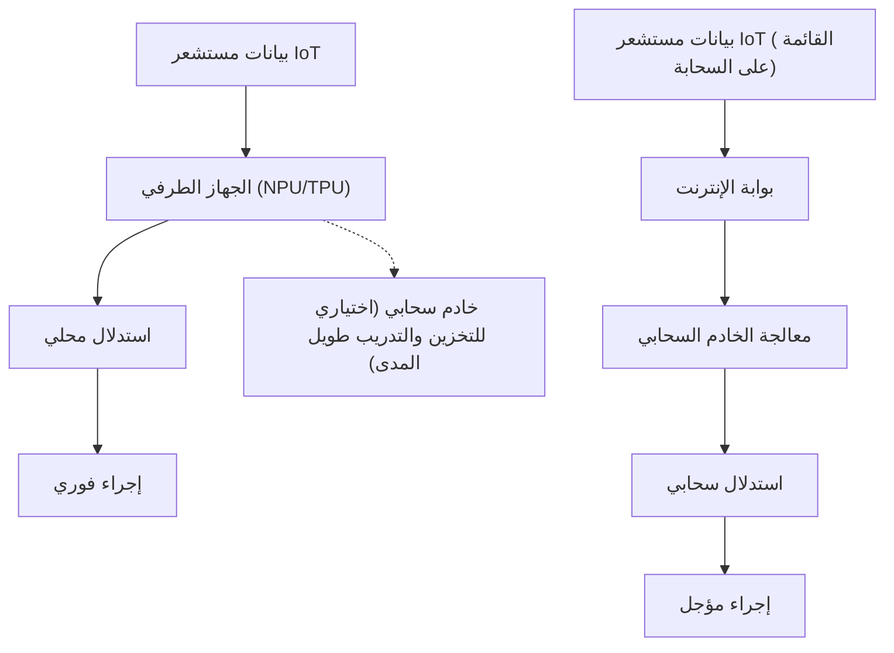
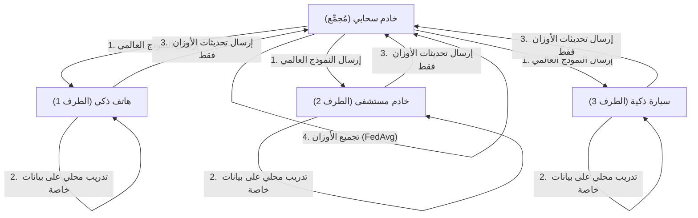

# مستقبل الذكاء الاصطناعي الطرفي (Edge AI) ونهج تنفيذه على أجهزة إنترنت الأشياء (IoT)

## 1. مقدمة: لماذا الذكاء الاصطناعي الطرفي (Edge AI) الآن؟

مع انتشار أجهزة إنترنت الأشياء (IoT)، دخلنا عصراً تتصل فيه كل الأشياء المادية في جميع أنحاء العالم بالإنترنت. ومع تطور تكنولوجيا المستشعرات، زادت كمية البيانات التي تولدها الأجهزة بشكل هائل. تقليدياً، كان يتم إرسال هذه البيانات الضخمة إلى السحابة، حيث يتم الاستدلال باستخدام نماذج الذكاء الاصطناعي عبر موارد الحوسبة القوية في السحابة (مثل مجموعات وحدات معالجة الرسومات الضخمة). هذا هو النهج العام لـ "الذكاء الاصطناعي السحابي".

ومع ذلك، هناك العديد من القيود الخطيرة في بنية إرسال جميع البيانات إلى السحابة ومعالجتها هناك ثم إعادة النتائج إلى الجهاز.
1. **مشكلة زمن الوصول (الكمون)**: في الأنظمة التي تتطلب قرارات فورية في غضون ميلي ثانية، مثل السيارات ذاتية القيادة، والروبوتات الصناعية، والطائرات بدون طيار، يمكن أن يؤدي تأخير الاتصال بالشبكة إلى حوادث مميتة.
2. **الخصوصية والأمان**: يشكل الإرسال المستمر للفيديو والبيانات الحيوية الحساسة للغاية والخاصة إلى السحابة، مثل كاميرات المراقبة المنزلية الذكية والأجهزة الطبية القابلة للارتداء، خطراً من حيث تسرب المعلومات وانتهاك الخصوصية.
3. **عرض النطاق الترددي للشبكة والتكلفة**: إذا كانت ملايين كاميرات إنترنت الأشياء ترسل باستمرار تدفقات فيديو بدقة 4K إلى السحابة، فسيتم استنفاد عرض النطاق الترددي للشبكة، وستصبح تكاليف نقل البيانات وتكاليف التخزين السحابي باهظة.
4. **استقرار الاتصال (بيئات عدم الاتصال)**: في البيئات التي يكون فيها الاتصال بالإنترنت غير مستقر أو غير موجود، مثل المنشآت تحت الأرض، والمناطق البحرية، والمزارع النائية، يعني الاعتماد على السحابة توقف وظائف النظام بأكمله.

ولحل هذه التحديات، برز **"الذكاء الاصطناعي الطرفي" (Edge AI)**. الذكاء الاصطناعي الطرفي هو تقنية لتنفيذ خوارزميات الذكاء الاصطناعي مباشرة على أجهزة إنترنت الأشياء التي تولد البيانات نفسها (أو في طرف الشبكة الأقرب جداً إلى الجهاز = الحافة). من خلال هذا، تتم معالجة البيانات وتحليلها فوراً عند مصدرها، مما يتيح بناء أنظمة ذكية سريعة وآمنة ومنخفضة التكلفة مع تقليل الاعتماد على السحابة إلى الحد الأدنى.

في هذه المقالة، سنتعمق تقنياً من أساسيات الذكاء الاصطناعي الطرفي، إلى أحدث الاتجاهات في الأجهزة (NPU/TPU وما إلى ذلك)، وتقنيات تخفيف النماذج (التكميم والتقليم) لتكييف النماذج مع البيئات الطرفية، وطرق التنفيذ باستخدام ONNX Runtime، وصولاً إلى التعلم الموحد (Federated Learning) الذي يحقق حماية الخصوصية والتعلم الموزع.

---

## 2. مقارنة البنية بين الذكاء الاصطناعي السحابي والذكاء الاصطناعي الطرفي

لفهم الاختلاف البصري بين الذكاء الاصطناعي السحابي والذكاء الاصطناعي الطرفي، يرجى الرجوع إلى مخطط البنية أدناه.



كما يتضح من هذا المخطط، تكتمل الحلقة في بنية الذكاء الاصطناعي الطرفي بدءاً من مصدر البيانات، مروراً بالاستدلال، ووصولاً إلى الإجراء (التحكم) داخل الجهاز الطرفي نفسه. تعمل السحابة كدور مساعد غير مباشر فقط، مثل توزيع النماذج المدربة مسبقاً وتجميع البيانات على المدى الطويل وتحليل الاتجاهات.

### النموذج الرياضي لزمن انتقال الاستدلال

دعونا نصيغ الفرق في زمن الوصول (الكمون) بين الطرف والسحابة رياضياً. يمكن التعبير عن إجمالي الوقت حتى اكتمال الاستدلال للنظام بأكمله $T_{total}$ على النحو التالي:

**في حالة الذكاء الاصطناعي السحابي:**
$$ T_{total} = T_{network\_up} + T_{cloud\_compute} + T_{network\_down} $$

هنا، يعتمد وقت رفع الشبكة $T_{network\_up}$ على المعادلة التالية:
$$ T_{network\_up} = \frac{D}{B} + RTT $$
($D$: حجم البيانات المرسلة، $B$: عرض النطاق الترددي للشبكة، $RTT$: وقت الرحلة ذهاباً وإياباً)

إذا كان حجم البيانات $D$ كبيراً (مثل الصور عالية الدقة أو بيانات الاهتزاز المستمرة) أو في بيئات يكون فيها عرض النطاق الترددي $B$ ضيقاً، سيزداد $T_{network\_up}$ بشكل هائل وسيصبح عنق زجاجة بغض النظر عن مدى سرعة استدلال الذكاء الاصطناعي نفسه $T_{cloud\_compute}$.

**في حالة الذكاء الاصطناعي الطرفي:**
$$ T_{total} \approx T_{edge\_compute} $$

نظراً لأن الذكاء الاصطناعي الطرفي لا يتضمن نقل البيانات عبر الشبكة، فإن كلاً من $T_{network\_up}$ و $T_{network\_down}$ سيكونان تقريباً صفراً (يقتصر النقل على الناقل المحلي فقط). غالباً ما تكون القدرة الحسابية للأجهزة الطرفية أقل من السحابة بحيث يكون $T_{edge\_compute} > T_{cloud\_compute}$، ولكن نظرًا للتخلص من تأخيرات الشبكة وعدم موثوقية الاتصالات، يظل الوقت الإجمالي $T_{total}$ منخفضاً ومستقراً.

---

## 3. تقنيات الأجهزة التي تدعم الذكاء الاصطناعي الطرفي

لتشغيل نماذج التعلم العميق بسرعات عالية على الأجهزة الطرفية، لا غنى عن مسرعات الأجهزة المتخصصة. مع المعالجة باستخدام وحدات المعالجة المركزية (CPU) التقليدية، كان الاستدلال الآني للذكاء الاصطناعي صعباً من منظور استهلاك الطاقة وسرعة المعالجة. هنا، نقدم أجهزة ممثلة للذكاء الاصطناعي الطرفي.

### 3.1 NPU (وحدة المعالجة العصبية) و TPU (وحدة معالجة الموتر)
تتكون عملية الاستدلال في التعلم العميق (خاصة استدلال CNN وما إلى ذلك) من عدد كبير من عمليات الضرب والجمع المصفوفية (عمليات MAC: Multiply-Accumulate). تُعد NPU و TPU شرائح متخصصة (ASIC) مخصصة لتنفيذ عمليات MAC هذه بالتوازي وباستهلاك طاقة منخفض للغاية.

- **Google Coral Edge TPU**:
  يُعد Edge TPU الذي تقدمه Google معالجاً مساعداً يتمتع بقدرات استدلال قوية رغم كونه صغيراً جداً. يولد أداء 4 TOPS (تريليون عملية في الثانية) باستهلاك طاقة يبلغ 2 واط فقط. يتيح هذا التشغيل في الوقت الفعلي لنماذج TensorFlow Lite المحسّنة للهواتف المحمولة بمجرد الاتصال عبر USB بكمبيوتر أحادي اللوحة (SBC) خفيف مثل Raspberry Pi.
- **Raspberry Pi AI Kit (مزود بـ Hailo-8L)**:
  تتضمن حزمة Raspberry Pi AI Kit التي تم إصدارها مؤخراً مسرع الذكاء الاصطناعي "Hailo-8L" من شركة Hailo. تحل بنية Hailo اختناق الوصول إلى الذاكرة عن طريق تعيين بنية الشبكة العصبية على بنية الأجهزة للرقاقة، مما يحقق أداء استدلال مذهل يصل إلى 13 TOPS ضمن نطاق طاقة لا يتجاوز بضعة واط.
- **سلسلة NVIDIA Jetson**:
  تُعد سلاسل Jetson Nano و Xavier و Orin أنظمة على شريحة (SoC) تدمج وحدة المعالجة المركزية ARM ونواة GPU القوية من NVIDIA. نظراً لإمكانية استخدام نظام CUDA البيئي كما هو، فمن السهل جداً نشر نماذج PyTorch أو TensorFlow المدربة في السحابة على الطرف من خلال TensorRT.

### TOPS وكفاءة الطاقة (TOPS/W)
المقياس الأكثر أهمية عند تقييم أجهزة الذكاء الاصطناعي الطرفية هو "TOPS/W" (العمليات بالتيرا في الثانية لكل واط). نظراً لأن أجهزة إنترنت الأشياء تعمل تحت قيود صارمة على الطاقة، مثل التشغيل بالبطاريات أو عبر تقنية PoE (الطاقة عبر الإيثرنت)، فإن المفتاح لا يقتصر على الأداء الحسابي البسيط (TOPS)، بل يمتد إلى كيفية إجراء استدلال الذكاء الاصطناعي بأقل قدر من الطاقة.

---

## 4. التنفيذ على الأجهزة الطرفية: نظرية وممارسة تخفيف النماذج

حتى مع تطور الأجهزة، من المستحيل تحميل نماذج التعلم العميق الضخمة التي تصل إلى مئات الميجابايت أو الجيجابايت (مثل GPT أو نماذج ResNet الكبيرة) كما هي إلى ذاكرة الوصول العشوائي (RAM) المحدودة (من بضعة ميجابايت إلى بضعة جيجابايت) في الأجهزة الطرفية. ولذلك، يصبح "تخفيف النماذج" (Model Compression) ضرورياً. نوضح هنا بالتفصيل تقنيات رئيسية مثل "التكميم" (Quantization) و "التقليم" (Pruning).

### 4.1 تكميم النموذج (Quantization)

عادةً ما يتم تمثيل الأوزان ووظائف التنشيط في نماذج التعلم العميق بنقطة عائمة 32 بت (FP32). التكميم هو تقنية لتقليل هذه الدقة إلى 16 بت (FP16)، أو أعداد صحيحة 8 بت (INT8)، أو حتى بتات أقل.

**تأثير تقليل الذاكرة**:
بافتراض أن عدد المعلمات هو $N$، يتم حساب سعة الذاكرة المطلوبة على النحو التالي.
$$ M_{FP32} = N \times 4 \text{ (Bytes)} $$
$$ M_{INT8} = N \times 1 \text{ (Bytes)} $$
من خلال تكميم INT8، يمكن من الناحية النظرية تقليل حجم النموذج واستخدام الذاكرة إلى $\frac{1}{4}$. علاوة على ذلك، يمكن للأجهزة (مثل NPU) تنفيذ عمليات MAC الخاصة بـ INT8 أسرع بعدة مرات إلى عشرات المرات وبطاقة أقل مقارنة بعمليات FP32، مما يؤدي إلى انخفاض كبير في زمن الاستدلال واستهلاك الطاقة.

**النموذج الرياضي للتكميم**:
معادلة التكميم التآلفي الأساسية لتعيين رقم حقيقي $r$ (FP32) إلى عدد صحيح $q$ (INT8: من -128 إلى 127) هي كما يلي:

$$ r = S \times (q - Z) $$
$$ q = \text{round}\left( \frac{r}{S} + Z \right) $$

هنا، يمثل $S$ عامل المقياس (Scale)، ويمثل $Z$ نقطة الصفر (Zero-point: أي قيمة من نوع العدد الصحيح يتم تعيين الرقم الحقيقي 0 إليها).

يوجد نوعان من التكميم: **Post-Training Quantization (PTQ)** الذي يحول النموذج بعد اكتمال التدريب، و **Quantization-Aware Training (QAT)** الذي يُحَدِّث الأوزان مع محاكاة خطأ التكميم أثناء عملية التدريب. يوصى باستخدام QAT لتقليل انخفاض الدقة إلى الحد الأدنى.

### 4.2 تقليم النموذج (Pruning)

توجد في الشبكات العصبية العديد من الأوزان (ذات الأهمية المنخفضة) التي ليس لها أي تأثير تقريباً على نتيجة الاستدلال النهائية. التقنية التي تجعل هذه الأوزان غير الضرورية صفراً، أو تزيلها تماماً من بنية الشبكة، هي التقليم (Pruning).

**تعريف التناثر (Sparsity)**:
$$ \text{Sparsity} (S) = \frac{N_{zero}}{N_{total}} \times 100 \text{ (\%)} $$
حيث $N_{zero}$ هو عدد الأوزان التي تم تحويلها إلى صفر، و $N_{total}$ هو إجمالي عدد الأوزان للنموذج بأكمله.

- **التقليم غير المهيكل (Unstructured Pruning)**: تقنية تجعل الأوزان الفردية صفراً بشكل مستقل. تزداد نسبة التناثر (Sparsity)، ولكن نظراً لأن مصفوفة الأوزان تصبح مجرد مصفوفة متناثرة (Sparse Matrix)، يصبح نمط الوصول إلى الذاكرة غير منتظم في وحدات المعالجة المركزية ووحدات المعالجة الرسومية العامة، مما قد لا يؤدي إلى التسريع المتوقع.
- **التقليم المهيكل (Structured Pruning / Channel Pruning)**: تقنية تقوم بحذف الفلاتر أو القنوات بالكامل في الطبقات التلافيفية. نظراً لأنه يتم تقليص أبعاد الشبكة نفسها، يتم الحصول على تحسن واضح في سرعة الاستدلال وتقليل استهلاك الذاكرة على أي جهاز.

يتناسب معدل تحسين سرعة الاستدلال $S_{speedup}$ تقريبًا مع معدل تقليل القنوات $c$ ($0 < c < 1$) على النحو التالي (بناءً على الانخفاض في عدد عمليات MAC).
$$ S_{speedup} \propto \frac{1}{(1 - c)^2} $$
(*نظراً لأن التعقيد الحسابي لعملية الالتفاف يتناسب مع حاصل ضرب عدد القنوات المدخلة وعدد القنوات المخرجة*)

---

## 5. النشر ومحرك الاستدلال: الاستفادة من ONNX Runtime

من أجل تشغيل النماذج المخففة فعلياً على الأجهزة الطرفية، يلزم وجود محرك استدلال خفيف الوزن ومتوافق مع منصات متعددة. حالياً، يُستخدم **ONNX (Open Neural Network Exchange)** و **ONNX Runtime** على نطاق واسع كمعايير في الصناعة.

ONNX هو معيار للتعامل مع النماذج بتنسيق مشترك بين الأطر المختلفة مثل PyTorch و TensorFlow. ONNX Runtime هو محرك لتنفيذ نموذج ONNX هذا بشكل مثالي على أجهزة مختلفة.

تكمن قوة ONNX Runtime في آلية **موفرو التنفيذ (Execution Providers - EP)**. يمكنك تبديل بيئة التنفيذ الخلفية إلى CPU أو CUDA (GPU) أو TensorRT أو OpenVINO أو CoreML أو XNNPACK وغيرها دون إعادة كتابة التعليمات البرمجية.

فيما يلي مثال أساسي لكود استدلال باستخدام ONNX Runtime على جهاز طرفي باستخدام Python.

```python
import onnxruntime as ort
import numpy as np
import time

def run_edge_inference(model_path, input_data):
    # تحديد مزود التنفيذ (Execution Provider) ليناسب الجهاز الطرفي
    # مثال: 'CPUExecutionProvider' في حالة وحدة المعالجة المركزية
    # إذا كانت Coral Edge TPU أو NPU معينة مدعومة، فحدد مزود تنفيذ مخصصًا
    providers = ['CPUExecutionProvider']
    
    # تهيئة الجلسة (تحميل النموذج وتحسين الرسم البياني)
    session = ort.InferenceSession(model_path, providers=providers)
    
    # الحصول على اسم الإدخال وشكل الإدخال للنموذج
    input_name = session.get_inputs()[0].name
    expected_shape = session.get_inputs()[0].shape
    print(f"Expected input shape: {expected_shape}")
    
    # قياس وقت الاستدلال
    start_time = time.time()
    
    # تنفيذ الاستدلال
    # مرر بيانات الإدخال كمصفوفة Numpy مناسبة (مثال: np.float32 أو np.int8)
    outputs = session.run(None, {input_name: input_data})
    
    latency = (time.time() - start_time) * 1000.0 # تحويل إلى ميلي ثانية
    print(f"Inference Latency: {latency:.2f} ms")
    
    return outputs[0]

# بيانات إدخال وهمية (مثال: صورة RGB مقاس 224x224 بحجم دفعة 1)
dummy_input = np.random.randn(1, 3, 224, 224).astype(np.float32)
# run_edge_inference("lightweight_model.onnx", dummy_input)
```

بناءً على هذا الكود، من خلال نقله إلى لغة منخفضة الكمون مثل C++، من الممكن استخلاص أداء أجهزة الأجهزة الطرفية إلى الحد الأقصى.

---

## 6. حماية الخصوصية والتعلم الموزع: التعلم الموحد (Federated Learning)

أحد التطورات النهائية للذكاء الاصطناعي الطرفي هو **التعلم الموحد (Federated Learning)**، والذي يوزع ليس فقط "استدلال" النموذج بل أيضاً "التدريب" على الأطراف.

في التعلم الآلي التقليدي، يتم تجميع البيانات الأولية (مثل الفيديو والصوت والسجلات وما إلى ذلك) من جميع أجهزة إنترنت الأشياء في السحابة وتدريب النموذج دفعة واحدة. ومع ذلك، فإن تجميع البيانات من الهواتف الذكية الشخصية والأجهزة الطبية في السحابة ينطوي على مخاطر خصوصية خطيرة.

يحل التعلم الموحد هذه المشكلة ببراعة.



**عملية التعلم الموحد**:
1. يقوم الخادم السحابي (المجمّع) بتوزيع "النموذج العالمي" الذي تمت تهيئته على كل جهاز طرفي.
2. يقوم كل جهاز طرفي بتدريب النموذج العالمي محلياً (الضبط الدقيق) باستخدام بياناته **دون تصدير أي بيانات سرية محفوظة داخله إلى الخارج**.
3. ترسل الأجهزة الطرفية "مقدار تحديث أوزان النموذج (التدرج)" الذي تم الحصول عليه من خلال التدريب إلى السحابة فقط. لا تترك البيانات الأولية الجهاز أبداً.
4. تقوم السحابة بمتوسط مقادير تحديث الأوزان التي تم جمعها من العديد من الأجهزة لإنشاء نموذج عالمي جديد.

**النموذج الرياضي للمتوسط الموحد (FedAvg)**:
تكون معادلة التحديث لخوارزمية التجميع الأكثر تمثيلاً، FedAvg، كما يلي.
بافتراض وجود إجمالي $K$ عميل، وأن كل عميل $k$ لديه $n_k$ عينة بيانات. بفرض إجمالي البيانات $N = \sum_{k=1}^{K} n_k$، يتم حساب وزن النموذج العالمي في الجولة التالية $w_{t+1}$ كما يلي.

$$ w_{t+1} = \sum_{k=1}^{K} \frac{n_k}{N} w_{t+1}^k $$

هنا، $w_{t+1}^k$ هي الأوزان المحدثة التي دربها العميل $k$ باستخدام بياناته المحلية. عن طريق أخذ متوسط مرجح يتناسب مع عدد البيانات بهذه الطريقة، من الممكن بناء نموذج عالي الأداء يبدو وكأنه قد تم تدريبه من خلال تجميع بيانات جميع الأجهزة، مع الحفاظ على الخصوصية تماماً.

---

## 7. حالات استخدام التنفيذ على أجهزة إنترنت الأشياء

تم بالفعل استخدام الذكاء الاصطناعي الطرفي عملياً في مختلف الصناعات ويحدث تحولاً جذرياً في النماذج.

### 7.1 التصنيع الذكي والصيانة التنبؤية (Predictive Maintenance)
تتم مراقبة بيانات الاهتزاز والصوت من المحركات والتوربينات في خطوط الإنتاج بالمصنع باستمرار بواسطة الأجهزة الطرفية (PLC والخوادم الطرفية). من المستحيل الاستمرار في إرسال بيانات الاهتزاز التي يتم أخذ عينات منها كل بضع ميلي ثانية إلى السحابة، ولكن مع الذكاء الاصطناعي الطرفي، يمكن اكتشاف علامات التشوهات (اكتشاف الشذوذ بواسطة نماذج الكشف عن الحالات الشاذة) في الوقت الفعلي والتوقف الطارئ للخطوط قبل أن تتعرض الآلات لأعطال مميتة.

### 7.2 الزراعة الذكية (Smart Agriculture)
نظراً لأن البنية التحتية للاتصالات غالباً ما تكون ضعيفة في الأراضي الزراعية الشاسعة، فإن الذكاء الاصطناعي الطرفي لا غنى عنه. تحدد نماذج اكتشاف الكائنات خفيفة الوزن (مثل YOLOv8 nano) المثبتة على الطائرات بدون طيار الآفات والأوراق المريضة في الوقت الفعلي من اللقطات الجوية. يتم تقليل استخدام المبيدات الحشرية بشكل كبير إما عن طريق إرسال بيانات الإحداثيات المحددة فقط أو عن طريق رش المبيدات بدقة على الموقع بواسطة طائرة رش متصلة.

### 7.3 الأجهزة الطبية القابلة للارتداء
تكتشف الساعات الذكية وأجهزة تخطيط القلب المحمولة (ECG) علامات عدم انتظام ضربات القلب (مثل الرجفان الأذيني) من بيانات معدل ضربات قلب مرتديها باستخدام الجهاز الطرفي وحده. نظراً لأن البيانات الطبية حساسة للغاية، فإن الذكاء الاصطناعي الطرفي، الذي يكمل الاستدلال داخل الجهاز دون تحميله إلى السحابة، هو المفتاح لتلبية لوائح الخصوصية الطبية الصارمة مثل HIPAA.

---

## 8. تحديات الذكاء الاصطناعي الطرفي وآفاق المستقبل

على الرغم من التطور السريع لتقنيات الذكاء الاصطناعي الطرفي، لا تزال هناك العديد من التحديات والآفاق المستقبلية المثيرة للاهتمام.

**1. تشغيل LLM (النماذج اللغوية الكبيرة) على الأطراف**:
أكبر موضوع في السنوات الأخيرة هو محاولة تشغيل نماذج الذكاء الاصطناعي التوليدي و LLM على الأطراف "Edge LLM". من المستحيل وضع نموذج بعشرات المليارات من المعلمات كما هو على جهاز طرفي، ولكن مع ظهور أطر تحسين مثل llama.cpp، والتكميم الشديد حتى 4 بت/2 بت (AWQ و GPTQ وما إلى ذلك)، علاوة على ظهور نماذج لغوية صغيرة وعالية الأداء (SLM) مثل Phi-3 من Microsoft، يقترب عصر تكتمل فيه معالجة اللغة الطبيعية دون اتصال بالإنترنت حتى على الهواتف الذكية و Raspberry Pi.

**2. الحوسبة العصبية (Neuromorphic Computing) و SNN**:
ما يُتوقع أن يكون الذكاء الاصطناعي الطرفي الأقل استهلاكاً للطاقة هو "الشرائح العصبية (Neuromorphic Chips)" (مثل: Intel Loihi) و"الشبكات العصبية النبضية (Spiking Neural Networks - SNN)" التي تحاكي فيزيائياً عمل الدوائر العصبية في الدماغ البشري. نظراً لأن SNN تعتمد على الأحداث (Event-driven) حيث يتم إجراء الحسابات فقط عند تغير البيانات (Spike)، فمن الممكن نظرياً تقليل استهلاك الطاقة بشكل كبير (من عشرات المرات إلى مئات المرات) مقارنة بنماذج التعلم العميق التقليدية.

**3. إنشاء EdgeOps بدلاً من MLOps**:
يمثل تحدياً تشغيلياً كيفية توزيع تحديثات النماذج بأمان (تحديثات عبر الهواء - OTA) ومراقبة تدهور دقة النماذج قيد التشغيل (Data Drift) لآلاف أو عشرات الآلاف من الأجهزة الطرفية المنتشرة في جميع أنحاء العالم. أتمتة النشر في بيئات غير متجانسة حيث تختلف بنية الأجهزة من جهاز لآخر سيكون المجال الهندسي ذو الطلب الأعلى في المستقبل.

---

## 9. الخاتمة

تطور الذكاء الاصطناعي الطرفي من مجرد كونه "تقنية مكملة للسحابة" إلى تقنية أساسية تحدد بنية أنظمة إنترنت الأشياء (IoT) بأكملها. إن الفوائد التي يجلبها الذكاء الاصطناعي الطرفي، مثل تقليل زمن انتقال الاستدلال إلى الحد الأدنى، وضمان حماية الخصوصية، والتقليل الكبير في عرض النطاق الترددي للاتصالات وتكاليف السحابة، لا تقدر بثمن.

أصبحت تقنيات تخفيف البرامج، مثل تكميم النماذج وتقليمها، والتقدم المذهل في الأجهزة مثل NPU و TPU و Hailo، بمثابة العجلتين اللتين تدفعان التقدم. لقد أصبحت نماذج التعلم العميق التي كانت تتطلب حواسيب فائقة في الماضي، تعمل الآن على الأجهزة الموجودة في أيدينا ببضعة ملي واط من الطاقة.

علاوة على ذلك، تتوسع آفاق التكنولوجيا بسرعة، مثل نُهج التعلم الموزع مثل التعلم الموحد (Federated Learning) وتشغيل الذكاء الاصطناعي التوليدي (SLM) على الحافة (Edge). بالنسبة للمهندسين والمعماريين، سيكون السعي وراء "كيفية استخلاص أقصى قدر من الذكاء في الموارد الطرفية المحدودة"، بدلاً من الاعتماد فقط على موارد السحابة الضخمة، التحدي الأكثر إثارة للإعجاب في المستقبل.

في طليعة إنترنت الأشياء حيث يندمج العالم المادي والعالم الرقمي، سيكون الذكاء الاصطناعي الطرفي بلا شك الجهاز العصبي المركزي الذي يقود المستقبل.

---
*تم إعداد هذه المقالة للمهندسين ومعماريي الأنظمة المهتمين بتنفيذ الذكاء الاصطناعي على أجهزة إنترنت الأشياء.*
