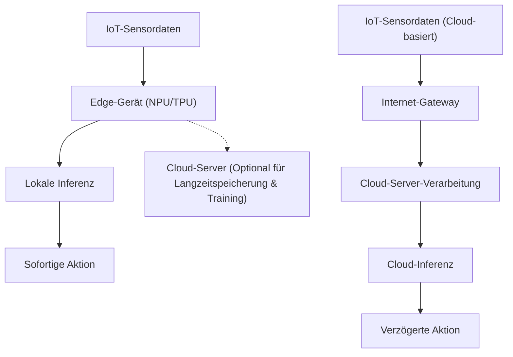
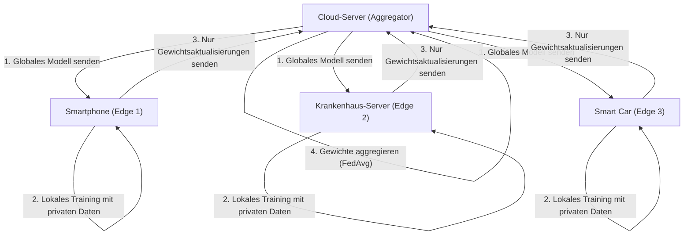

# Die Zukunft von Edge-AI und Implementierungsansätze für IoT-Geräte

## 1. Einführung: Warum Edge-AI gerade jetzt?

Mit der Verbreitung von IoT-Geräten (Internet of Things) ist das Zeitalter angebrochen, in dem alle physischen Dinge weltweit mit dem Internet verbunden sind. Mit der Entwicklung der Sensortechnologie nimmt die von Geräten erzeugte Datenmenge explosionsartig zu. Bisher wurden diese riesigen Datenmengen in die Cloud gesendet, wo Inferenz durch AI-Modelle mithilfe der leistungsstarken Rechenressourcen der Cloud (wie riesige GPU-Cluster) durchgeführt wurde. Dies ist der typische "Cloud-AI"-Ansatz.

Die Architektur, alle Daten in die Cloud zu senden, sie dort zu verarbeiten und die Ergebnisse an das Gerät zurückzusenden, weist jedoch einige erhebliche Einschränkungen auf:
1. **Latenzprobleme (Verzögerung)**: In Systemen wie autonomen Fahrzeugen, Industrierobotern und Drohnen, die sofortige Entscheidungen im Millisekundenbereich erfordern, können Kommunikationsverzögerungen im Netzwerk zu fatalen Unfällen führen.
2. **Datenschutz und Sicherheit**: Die kontinuierliche Übertragung persönlicher Informationen und hochsensibler Video- und biometrischer Daten an die Cloud, z. B. von Smart-Home-Überwachungskameras und medizinischen Wearables, birgt das Risiko von Informationslecks und Datenschutzverletzungen.
3. **Netzwerkbandbreite und Kosten**: Wenn Millionen von IoT-Kameras ständig 4K-Videostreams in die Cloud senden, wird die Netzwerkbandbreite erschöpft sein und die Kosten für Datenübertragung und Cloud-Speicher werden enorm sein.
4. **Verbindungsstabilität (Offline-Umgebungen)**: In Umgebungen, in denen die Internetverbindung instabil oder nicht vorhanden ist, wie z. B. in unterirdischen Anlagen, auf See oder auf abgelegenen Farmen, bedeutet die Abhängigkeit von der Cloud den Ausfall des gesamten Systems.

Um diese Herausforderungen zu lösen, hat sich **"Edge-AI"** etabliert. Edge-AI ist eine Technologie, die KI-Algorithmen direkt auf dem IoT-Gerät selbst ausführt, das die Daten erzeugt (oder am Rand des Netzwerks, ganz nah am Gerät = Edge). Dadurch werden Daten direkt an der Quelle sofort verarbeitet und analysiert, wodurch die Abhängigkeit von der Cloud minimiert und schnelle, sichere und kostengünstige intelligente Systeme aufgebaut werden können.

In diesem Artikel werden wir von den Grundlagen der Edge-AI über die neuesten Trends bei Hardware (NPU/TPU usw.), Modellkomprimierungstechniken (Quantisierung und Pruning) zur Anpassung von Modellen an Edge-Umgebungen, Implementierungsmethoden mit der ONNX Runtime bis hin zu Federated Learning zur Realisierung von Datenschutz und verteiltem Lernen aus technischer Sicht tiefgründig erklären.

---

## 2. Architekturvergleich zwischen Cloud-AI und Edge-AI

Um den Unterschied zwischen Cloud-AI und Edge-AI visuell zu verstehen, sehen Sie sich bitte das folgende Architekturdiagramm an.



Wie aus diesem Diagramm ersichtlich ist, ist in der Edge-AI-Architektur die Schleife von der Datenquelle über die Inferenz bis hin zur Aktion (Steuerung) innerhalb des Edge-Geräts abgeschlossen. Die Cloud spielt nur eine unterstützende Rolle in Nicht-Echtzeit, z. B. bei der Verteilung trainierter Modelle und der langfristigen Datenaggregation und Trendanalyse.

### Mathematisches Modell der Inferenzlatenz

Lassen Sie uns den Unterschied in der Latenz zwischen Edge und Cloud formulieren. Die Gesamtzeit bis zum Abschluss der Systeminferenz $T_{total}$ wird wie folgt ausgedrückt:

**Bei Cloud-AI:**
$$ T_{total} = T_{network\_up} + T_{cloud\_compute} + T_{network\_down} $$

Hier hängt die Netzwerk-Upload-Zeit $T_{network\_up}$ von der folgenden Gleichung ab:
$$ T_{network\_up} = \frac{D}{B} + RTT $$
($D$: zu übertragende Datengröße, $B$: Netzwerkbandbreite, $RTT$: Round Trip Time)

Wenn die Datengröße $D$ groß ist (hochauflösende Bilder, kontinuierliche Vibrationsdaten usw.) oder die Bandbreite $B$ schmal ist, steigt $T_{network\_up}$ dramatisch an und wird zum Engpass, egal wie schnell die Inferenzgeschwindigkeit der KI selbst $T_{cloud\_compute}$ ist.

**Bei Edge-AI:**
$$ T_{total} \approx T_{edge\_compute} $$

Da Edge-AI keine Netzwerkübertragung beinhaltet, gehen $T_{network\_up}$ und $T_{network\_down}$ gegen Null (nur lokale Busübertragung). Obwohl die Rechenleistung des Edge-Geräts der der Cloud unterlegen ist und oft $T_{edge\_compute} > T_{cloud\_compute}$ gilt, bleibt das gesamte $T_{total}$ stabil niedrig, da Netzwerkverzögerungen und Kommunikationsunsicherheiten beseitigt werden können.

---

## 3. Hardwaretechnologien, die Edge-AI unterstützen

Um Deep-Learning-Modelle auf Edge-Geräten mit hoher Geschwindigkeit auszuführen, sind dedizierte Hardware-Beschleuniger unerlässlich. Bei der herkömmlichen CPU-Verarbeitung war die KI-Inferenz in Echtzeit aufgrund von Stromverbrauch und Verarbeitungsgeschwindigkeit schwierig. Hier stellen wir typische Hardware für Edge-AI vor.

### 3.1 NPU (Neural Processing Unit) und TPU (Tensor Processing Unit)
Der Inferenzprozess beim Deep Learning (insbesondere bei CNNs) besteht aus einer großen Anzahl von Multiply-Accumulate-Operationen (MAC-Operationen). NPUs und TPUs sind dedizierte Chips (ASICs), die darauf spezialisiert sind, diese MAC-Operationen parallel und mit extrem niedrigem Stromverbrauch auszuführen.

- **Google Coral Edge TPU**:
  Die von Google angebotene Edge TPU ist ein sehr kleiner Koprozessor mit leistungsstarken Inferenzfähigkeiten. Er liefert eine Leistung von 4 TOPS (Tera Operations Per Second: 4 Billionen Operationen pro Sekunde) bei einem Stromverbrauch von nur 2 Watt. Dies ermöglicht die Ausführung von für Mobilgeräte optimierten TensorFlow Lite-Modellen in Echtzeit, indem er einfach über USB an einen leichten SBC (Single Board Computer) wie einen Raspberry Pi angeschlossen wird.
- **Raspberry Pi AI Kit (Ausgestattet mit Hailo-8L)**:
  Das kürzlich veröffentlichte Raspberry Pi AI Kit ist mit Hailos KI-Beschleuniger "Hailo-8L" ausgestattet. Die Architektur von Hailo eliminiert Engpässe beim Speicherzugriff, indem sie die Struktur des neuronalen Netzwerks auf die Hardwarestruktur des Chips abbildet und eine erstaunliche Inferenzleistung von bis zu 13 TOPS innerhalb eines Leistungsbudgets von wenigen Watt realisiert.
- **NVIDIA Jetson Serie**:
  Die Serien Jetson Nano, Xavier und Orin sind SoCs, die eine ARM-CPU und leistungsstarke NVIDIA-GPU-Kerne integrieren. Da das CUDA-Ökosystem unverändert verwendet werden kann, ist es sehr einfach, PyTorch- oder TensorFlow-Modelle, die in der Cloud trainiert wurden, über TensorRT auf der Edge bereitzustellen.

### TOPS und Energieeffizienz (TOPS/W)
Die wichtigste Kennzahl bei der Bewertung von Edge-AI-Hardware ist "TOPS/W (TOPS pro Watt)". Da IoT-Geräte unter strengen Leistungsbeschränkungen wie Batteriebetrieb oder PoE (Power over Ethernet) arbeiten, liegt der Schlüssel nicht nur in der einfachen Rechenleistung (TOPS), sondern auch darin, wie wenig Strom für die KI-Inferenz aufgewendet werden kann.

---

## 4. Implementierung auf Edge-Geräten: Theorie und Praxis der Modellkomprimierung

Selbst bei Weiterentwicklungen der Hardware ist es unmöglich, riesige Deep-Learning-Modelle von Hunderten von MB bis zu mehreren GB (wie GPT oder großes ResNet) direkt in den begrenzten RAM (einige MB bis zu mehreren GB) eines Edge-Geräts zu laden. Daher ist die "Modellkomprimierung" (Model Compression) unerlässlich. Wir werden die typischen Methoden der "Quantisierung" (Quantization) und des "Prunings" (Pruning) im Detail erklären.

### 4.1 Modellquantisierung (Quantization)

Deep-Learning-Modelle werden typischerweise mit Gewichten und Aktivierungsfunktionen in 32-Bit-Fließkommazahlen (FP32) dargestellt. Quantisierung ist eine Technologie, die deren Genauigkeit auf 16 Bit (FP16), 8-Bit-Ganzzahlen (INT8) oder noch niedrigere Bits reduziert.

**Auswirkung auf die Speicherreduzierung**:
Wenn die Anzahl der Parameter $N$ ist, wird die benötigte Speichermenge wie folgt berechnet:
$$ M_{FP32} = N \times 4 \text{ (Bytes)} $$
$$ M_{INT8} = N \times 1 \text{ (Bytes)} $$
Durch die INT8-Quantisierung können die Modellgröße und der Speicherbedarf theoretisch auf $\frac{1}{4}$ reduziert werden. Darüber hinaus kann Hardware (wie NPUs) INT8-MAC-Operationen um ein Vielfaches bis Dutzendfaches schneller und mit geringerem Stromverbrauch als FP32-Operationen ausführen, was zu erheblichen Einsparungen bei der Inferenzlatenz und beim Stromverbrauch führt.

**Mathematisches Modell der Quantisierung**:
Die grundlegende affine Quantisierungsgleichung zur Abbildung einer reellen Zahl $r$ (FP32) auf eine Ganzzahl $q$ (INT8: -128 bis 127) lautet wie folgt:

$$ r = S \times (q - Z) $$
$$ q = \text{round}\left( \frac{r}{S} + Z \right) $$

Hier steht $S$ für den Skalierungsfaktor (Scale) und $Z$ für den Zero-Point (Zero-point: auf welchen ganzzahligen Wert die reelle Zahl 0 abgebildet wird).

Bei der Quantisierung gibt es die **Post-Training Quantization (PTQ)**, die das Modell nach Abschluss des Trainings konvertiert, und das **Quantization-Aware Training (QAT)**, das die Gewichte aktualisiert, während der Quantisierungsfehler während des Trainingsprozesses simuliert wird. Wenn der Genauigkeitsverlust minimiert werden soll, wird QAT empfohlen.

### 4.2 Modell-Pruning (Pruning)

Neuronale Netzwerke haben viele Gewichte, die fast keinen Einfluss auf das endgültige Inferenzergebnis haben (von geringer Bedeutung). Die Technologie, diese unnötigen Gewichte auf Null zu setzen oder sie direkt aus der Netzwerkstruktur zu löschen, wird als Pruning (Ausdünnen) bezeichnet.

**Definition von Sparsity (Spärlichkeit)**:
$$ \text{Sparsity} (S) = \frac{N_{zero}}{N_{total}} \times 100 \text{ (\%)} $$
Hier ist $N_{zero}$ die Anzahl der auf Null gesetzten Gewichte und $N_{total}$ die Gesamtzahl der Gewichte im gesamten Modell.

- **Unstrukturiertes Pruning (Unstructured Pruning)**: Eine Methode, bei der einzelne Gewichte unabhängig voneinander auf Null gesetzt werden. Die Sparsity ist hoch, aber da die Gewichtsmatrix nur zu einer spärlichen Matrix (Sparse Matrix) wird und die Speicherzugriffsmuster auf Standard-CPUs/GPUs unregelmäßig werden, wird die erwartete Beschleunigung möglicherweise nicht erreicht.
- **Strukturiertes Pruning (Structured Pruning / Channel Pruning)**: Eine Methode, bei der ganze Filter oder Kanäle der Faltungsschicht gelöscht werden. Da die Dimension des Netzwerks selbst reduziert wird, kann auf jeder Hardware eine deutliche Verbesserung der Inferenzgeschwindigkeit (Speedup) und der Speicherreduzierung erzielt werden.

Die Rate der Inferenzgeschwindigkeitsverbesserung $S_{speedup}$ verhält sich bei einer Kanalreduktionsrate $c$ ($0 < c < 1$) grob proportional wie folgt (basierend auf der Reduzierung der Anzahl von MAC-Operationen).
$$ S_{speedup} \propto \frac{1}{(1 - c)^2} $$
(※Da die Rechenkomplexität der Faltungsoperation proportional zum Produkt aus der Anzahl der Eingangskanäle und Ausgangskanäle ist)

---

## 5. Bereitstellung und Inferenz-Engine: Nutzung der ONNX Runtime

Um ein komprimiertes Modell tatsächlich auf einem Edge-Gerät auszuführen, wird eine leichte, plattformübergreifende Inferenz-Engine benötigt. Derzeit werden **ONNX (Open Neural Network Exchange)** und die **ONNX Runtime** weithin als Industriestandards verwendet.

ONNX ist ein Standard für die Behandlung von Modellen in einem gemeinsamen Format über verschiedene Frameworks wie PyTorch und TensorFlow hinweg. Die ONNX Runtime ist eine Engine zur optimalen Ausführung dieses ONNX-Modells auf verschiedenen Hardwareplattformen.

Der Mechanismus der **Execution Providers (EP)** ist der stärkste Punkt der ONNX Runtime. Das Backend-Ausführungsumfeld kann auf CPU, CUDA (GPU), TensorRT, OpenVINO, CoreML, XNNPACK usw. umgestellt werden, ohne den Code neu schreiben zu müssen.

Nachfolgend finden Sie ein grundlegendes Codebeispiel für die Inferenz mit der ONNX Runtime auf einem Edge-Gerät mit Python.

```python
import onnxruntime as ort
import numpy as np
import time

def run_edge_inference(model_path, input_data):
    # Angabe des Execution Providers passend zum Edge-Gerät
    # Beispiel: 'CPUExecutionProvider' für CPU
    # Geben Sie benutzerdefinierte EP an, wenn Coral Edge TPU oder bestimmte NPUs unterstützt werden
    providers = ['CPUExecutionProvider']
    
    # Initialisierung der Sitzung (Laden des Modells und Graphenoptimierung)
    session = ort.InferenceSession(model_path, providers=providers)
    
    # Abrufen des Eingabenamens und der Eingabeform des Modells
    input_name = session.get_inputs()[0].name
    expected_shape = session.get_inputs()[0].shape
    print(f"Erwartete Eingabeform: {expected_shape}")
    
    # Messung der Inferenzzeit
    start_time = time.time()
    
    # Ausführung der Inferenz
    # Eingabedaten werden als geeignetes Numpy-Array übergeben (Beispiel: np.float32 oder np.int8)
    outputs = session.run(None, {input_name: input_data})
    
    latency = (time.time() - start_time) * 1000.0 # Umrechnung in Millisekunden
    print(f"Inferenzlatenz: {latency:.2f} ms")
    
    return outputs[0]

# Dummy-Eingabedaten (Beispiel: 224x224 RGB-Bild Batch-Größe 1)
dummy_input = np.random.randn(1, 3, 224, 224).astype(np.float32)
# run_edge_inference("lightweight_model.onnx", dummy_input)
```

Durch die Portierung dieses Basis-Codes in Sprachen mit geringerer Latenz wie C++ ist es möglich, die Hardwareleistung auf Edge-Geräten maximal auszuschöpfen.

---

## 6. Datenschutz und verteiltes Lernen: Federated Learning

Eine der ultimativen Entwicklungen der Edge-AI ist das **Federated Learning (föderiertes Lernen)**, das nicht nur die "Inferenz", sondern auch das "Training" von Modellen auf die Edge verteilt.

Beim herkömmlichen maschinellen Lernen wurden Rohdaten (Videos, Audios, Protokolle usw.) von allen IoT-Geräten in der Cloud gesammelt und das Modell wurde in einem Stapel trainiert. Die Aggregation von Daten persönlicher Smartphones und medizinischer Geräte in der Cloud birgt jedoch ernsthafte Datenschutzrisiken.

Federated Learning löst dieses Problem elegant.



**Prozess des Federated Learning**:
1. Der Cloud-Server (Aggregator) verteilt das initialisierte "globale Modell" an jedes Edge-Gerät.
2. Jedes Edge-Gerät trainiert (Feintuning) das globale Modell lokal mit den in ihm gespeicherten sensiblen Daten, **ohne diese jemals nach außen preiszugeben**.
3. Die Edge-Geräte übertragen nur den durch das Lernen erhaltenen "Betrag der Gewichtsaktualisierung (Gradient)" des Modells an die Cloud. Rohdaten verlassen das Gerät niemals.
4. Die Cloud aggregiert die Gewichtsaktualisierungen von einer großen Anzahl von Geräten durch Mittelwertbildung und generiert ein neues globales Modell.

**Mathematisches Modell des Federated Averaging (FedAvg)**:
Die Aktualisierungsgleichung von FedAvg, dem typischsten Aggregationsalgorithmus, sieht wie folgt aus.
Angenommen, es gibt insgesamt $K$ Clients, und jeder Client $k$ hat $n_k$ Datenbeispiele. Wenn die Gesamtzahl der Daten $N = \sum_{k=1}^{K} n_k$ ist, wird das Gewicht des globalen Modells $w_{t+1}$ der nächsten Runde wie folgt berechnet:

$$ w_{t+1} = \sum_{k=1}^{K} \frac{n_k}{N} w_{t+1}^k $$

Hierbei ist $w_{t+1}^k$ das aktualisierte Gewicht, das Client $k$ mit seinen eigenen lokalen Daten gelernt hat. Durch die gewichtete Durchschnittsbildung entsprechend der Datenmenge auf diese Weise kann ein Hochleistungsmodell erstellt werden, als ob alle Daten der Geräte aggregiert und trainiert worden wären, wobei die Privatsphäre vollständig geschützt bleibt.

---

## 7. Anwendungsfälle für die Implementierung in IoT-Geräten

Edge-AI wurde bereits in verschiedenen Branchen praktisch angewendet und hat einen dramatischen Paradigmenwechsel bewirkt.

### 7.1 Smart Manufacturing und vorausschauende Wartung (Predictive Maintenance)
Vibrations- und Akustikdaten von Motoren und Turbinen in Fabrikproduktionslinien werden kontinuierlich von Edge-Geräten (SPS und Edge-Server) überwacht. Es ist unmöglich, Vibrationsdaten, die im Takt von wenigen Millisekunden abgetastet werden, kontinuierlich in die Cloud zu senden, aber mithilfe von Edge-AI können Anzeichen von Anomalien (Anomalieerkennung durch Anomalieerkennungsmodelle) in Echtzeit erkannt und die Linie in einem Notfall gestoppt werden, kurz bevor die Maschine einen fatalen Ausfall erleidet.

### 7.2 Intelligente Landwirtschaft (Smart Agriculture)
Da die Kommunikationsinfrastruktur in ausgedehnten landwirtschaftlichen Flächen oft anfällig ist, ist Edge-AI unerlässlich. Auf Drohnen montierte leichtgewichtige Objekterkennungsmodelle (z. B. YOLOv8 nano) identifizieren Schädlinge und kranke Blätter in Echtzeit aus Luftaufnahmen. Durch das Senden nur der identifizierten Koordinatendaten oder das gezielte Versprühen von Pestiziden vor Ort durch verbundene Sprühdrohnen wird der Pestizideinsatz drastisch reduziert.

### 7.3 Medizinische Wearable-Geräte
In Smartwatches und tragbaren Elektrokardiogrammen (EKG) werden Anzeichen von Arrhythmien (wie Vorhofflimmern) allein durch das Edge-Gerät aus den Herzschlagdaten des Trägers erkannt. Da medizinische Daten äußerst vertraulich sind, ist Edge-AI, bei der die Inferenz im Gerät abgeschlossen wird, ohne Daten in die Cloud hochzuladen, der Schlüssel zur Erfüllung strenger Datenschutzbestimmungen im Gesundheitswesen wie HIPAA.

---

## 8. Herausforderungen der Edge-AI und Zukunftsperspektiven

Die Technologie der Edge-AI entwickelt sich rasant weiter, doch es gibt noch viele Herausforderungen und faszinierende Zukunftsperspektiven.

**1. Betrieb von LLMs (Large Language Models) an der Edge**:
Das wichtigste Thema der letzten Jahre ist der Versuch der "Edge LLM", generative KI und LLMs an der Edge auszuführen. Während es unmöglich ist, ein Modell mit Dutzenden Milliarden Parametern direkt auf der Edge zu platzieren, bricht dank Optimierungs-Frameworks wie llama.cpp, extremer Quantisierung auf 4 Bit/2 Bit (AWQ, GPTQ usw.) und sogar dem Erscheinen kompakter, aber leistungsstarker SLMs (Small Language Models) wie Microsofts Phi-3 allmählich das Zeitalter an, in dem die Verarbeitung natürlicher Sprache selbst auf Smartphones und Raspberry Pi offline abgeschlossen werden kann.

**2. Neuromorphic Computing und SNNs**:
Als die ultimative energiesparende Edge-AI werden "Neuromorphic-Chips (z. B. Intel Loihi)" und "Spiking Neural Networks (SNN)", die physikalisch die Funktion menschlicher Gehirn-Schaltkreise nachahmen, erwartet. Da SNNs ereignisgesteuert sind und Berechnungen nur zu dem Zeitpunkt durchgeführt werden, zu dem sich die Daten ändern (Spikes), ist es theoretisch möglich, den Stromverbrauch im Vergleich zu herkömmlichen Deep-Learning-Modellen um Größenordnungen (auf ein Zehntel bis ein Hundertstel) zu reduzieren.

**3. Etablierung von EdgeOps statt MLOps**:
Es stellt sich die betriebliche Herausforderung, wie Modellaktualisierungen (OTA: Over-The-Air-Updates) sicher auf Tausende bis Zehntausende von Edge-Geräten weltweit verteilt und Qualitätsminderungen der Modelle im Betrieb (Data Drift) überwacht werden können. Die Automatisierung von Deployments in heterogenen Umgebungen, in denen jedes Gerät eine andere Hardwarearchitektur hat, ist der Engineering-Bereich, der in Zukunft am stärksten nachgefragt wird.

---

## 9. Fazit

Edge-AI hat sich von einer bloßen "ergänzenden Cloud-Technologie" zur Kerntechnologie entwickelt, die die Architektur ganzer IoT-Systeme bestimmt. Die Vorteile von Edge-AI, wie die Minimierung der Inferenzlatenz, der rigorose Schutz der Privatsphäre und die drastische Reduzierung von Kommunikationsbandbreite und Cloud-Kosten, sind unermesslich.

Softwareseitige Komprimierungstechniken wie Modellquantisierung und Pruning gehen Hand in Hand mit der bemerkenswerten hardwareseitigen Entwicklung von NPUs, TPUs und Hailo. Infolgedessen laufen Deep-Learning-Modelle, für die einst Supercomputer erforderlich waren, heute auf Geräten, die in unsere Handfläche passen, mit wenigen Milliwatt Leistung.

Darüber hinaus erweitert sich die technologische Grenze rasend schnell durch verteilte Lernansätze wie Federated Learning und den Betrieb von generativer KI (SLMs) auf der Edge. Für Ingenieure und Architekten wird das Bestreben, "wie man die maximale Intelligenz auf der ressourcenbeschränkten Edge freisetzt", anstatt sich nur auf die riesigen Ressourcen der Cloud zu verlassen, in Zukunft die herausforderndste und aufregendste Aufgabe sein.

An vorderster Front des IoT, wo physische und digitale Welten verschmelzen, wird Edge-AI zweifellos zum zentralen Nervensystem, das die Zukunft antreibt.

---
*Dieser Artikel wurde für Ingenieure und Systemarchitekten geschrieben, die sich für die KI-Implementierung in IoT-Geräten interessieren.*

