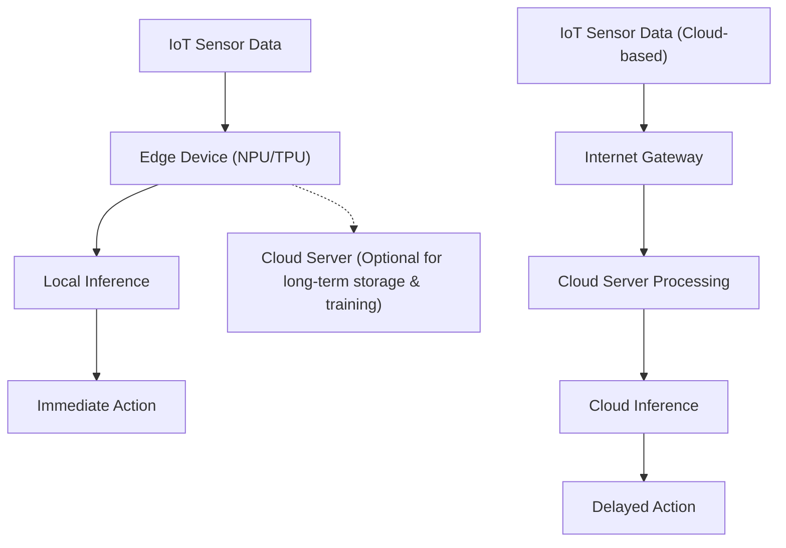
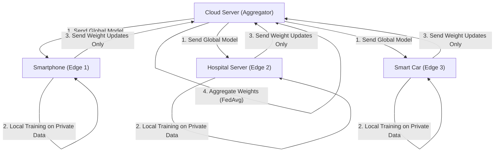

# The Future of Edge AI and Implementation Approaches for IoT Devices

## 1. Introduction: Why Edge AI Now?

With the proliferation of IoT (Internet of Things) devices, we have entered an era where all kinds of physical objects around the world are connected to the internet. Along with the evolution of sensor technology, the amount of data generated by devices has exploded. Traditionally, this massive amount of data has been sent to the cloud, and inference by AI models has been performed using powerful computing resources (such as huge GPU clusters) on the cloud. This is the general approach of "Cloud AI".

However, the architecture of sending all data to the cloud, processing it in the cloud, and sending the results back to the device has several significant limitations.
1. **Latency Issues**: In systems that require immediate decisions on the millisecond scale, such as autonomous vehicles, industrial robots, and drones, network communication delays can lead to fatal accidents.
2. **Privacy and Security**: Constantly sending highly confidential video and biometric data, such as from smart home security cameras or medical wearable devices, to the cloud carries the risk of information leakage and privacy infringement.
3. **Network Bandwidth and Costs**: If millions of IoT cameras constantly send 4K video streams to the cloud, network bandwidth will be depleted, and data transfer and cloud storage costs will become enormous.
4. **Connection Stability (Offline Environments)**: In environments where internet connectivity is unstable or non-existent, such as underground facilities, at sea, or on remote farms, relying on the cloud means the entire system could stop functioning.

**"Edge AI"** has emerged to solve these challenges. Edge AI is a technology that executes AI algorithms directly on the IoT devices that generate the data (or at the very edge of the network, extremely close to the devices). This allows data to be processed and analyzed immediately at the source, enabling the construction of high-speed, secure, and low-cost intelligent systems while minimizing reliance on the cloud.

This article delves deeply from a technical perspective into the basics of Edge AI, the latest trends in hardware (NPU/TPU, etc.), lightweighting technologies (quantization and pruning) to adapt models to edge environments, implementation methods using ONNX Runtime, and even Federated Learning for achieving privacy protection and decentralized training.

---

## 2. Architecture Comparison Between Cloud AI and Edge AI

To visually understand the differences between Cloud AI and Edge AI, please refer to the architecture diagram below.



As can be seen from this diagram, in the Edge AI architecture, the loop from the data source to inference and action (control) is completed within the edge device. The cloud plays a non-real-time auxiliary role, such as distributing trained models and performing long-term data aggregation and trend analysis.

### Mathematical Model of Inference Latency

Let's formulate the difference in latency between the edge and the cloud. The time $T_{total}$ until the inference of the entire system is completed is expressed as follows.

**For Cloud AI:**
$$ T_{total} = T_{network\_up} + T_{cloud\_compute} + T_{network\_down} $$

Here, the network upload time $T_{network\_up}$ depends on the following formula:
$$ T_{network\_up} = \frac{D}{B} + RTT $$
($D$: Data size to transmit, $B$: Network bandwidth, $RTT$: Round Trip Time)

If the data size $D$ is large (such as high-resolution images or continuous vibration data), or if the bandwidth $B$ is narrow, $T_{network\_up}$ increases dramatically, becoming a bottleneck no matter how fast the AI inference speed $T_{cloud\_compute}$ itself is.

**For Edge AI:**
$$ T_{total} \approx T_{edge\_compute} $$

Since Edge AI does not involve network transfers, $T_{network\_up}$ and $T_{network\_down}$ become nearly zero (only local bus transfers). Because the computing power of edge devices is inferior to that of the cloud, it is often the case that $T_{edge\_compute} > T_{cloud\_compute}$. However, by eliminating network delays and communication uncertainty, the overall $T_{total}$ is kept stably low.

---

## 3. Hardware Technologies Supporting Edge AI

To execute deep learning models at high speeds on edge devices, specialized hardware accelerators are indispensable. With conventional CPU processing, real-time AI inference was difficult in terms of power consumption and processing speed. Here, we introduce representative hardware for Edge AI.

### 3.1 NPU (Neural Processing Unit) and TPU (Tensor Processing Unit)
The inference process of deep learning (especially for CNNs, etc.) consists of a massive amount of multiply-accumulate (MAC) operations. NPUs and TPUs are dedicated chips (ASICs) specialized for executing these MAC operations in parallel and with ultra-low power consumption.

- **Google Coral Edge TPU**:
  Google's Edge TPU is a coprocessor that possesses powerful inference capabilities despite its very small size. It achieves a performance of 4 TOPS (Tera Operations Per Second: 4 trillion operations per second) with a power consumption of only 2W. This makes it possible to run TensorFlow Lite models optimized for mobile devices in real time simply by connecting it via USB to lightweight SBCs (Single Board Computers) like the Raspberry Pi.
- **Raspberry Pi AI Kit (with Hailo-8L)**:
  The recently released Raspberry Pi AI Kit is equipped with Hailo's AI accelerator, "Hailo-8L". Hailo's architecture eliminates memory access bottlenecks by mapping the neural network structure directly to the chip's hardware structure, achieving an astonishing inference performance of up to 13 TOPS within a power budget of a few watts.
- **NVIDIA Jetson Series**:
  The Jetson Nano, Xavier, and Orin series are SoCs that integrate ARM CPUs and NVIDIA's powerful GPU cores. Since they can utilize the CUDA ecosystem as is, it is extremely easy to deploy models trained on the cloud in PyTorch or TensorFlow to the edge via TensorRT.

### TOPS and Power Efficiency (TOPS/W)
The most important metric when evaluating Edge AI hardware is "TOPS/W (TOPS per watt)". Because IoT devices operate under strict power constraints, such as battery power or PoE (Power over Ethernet), the key is not just raw computational performance (TOPS) but how inference can be performed with minimal power.

---

## 4. Deployment to Edge Devices: Theory and Practice of Model Compression

Even as hardware evolves, it is impossible to load huge deep learning models (like GPT or massive ResNets) that reach hundreds of megabytes to several gigabytes directly into the limited RAM (several MBs to GBs) of edge devices. Therefore, "Model Compression" is essential. We will explain "Quantization" and "Pruning", the most representative techniques, in detail.

### 4.1 Model Quantization

Deep learning models typically represent weights and activation functions in 32-bit floating-point (FP32) formats. Quantization is a technique to lower this precision to 16-bit (FP16), 8-bit integers (INT8), or even lower bit formats.

**Memory Reduction Effect**:
Assuming the number of parameters is $N$, the required memory amount is calculated as follows:
$$ M_{FP32} = N \times 4 \text{ (Bytes)} $$
$$ M_{INT8} = N \times 1 \text{ (Bytes)} $$
With INT8 quantization, the model size and memory usage can theoretically be reduced to $\frac{1}{4}$. Furthermore, hardware (such as NPUs) can execute INT8 MAC operations several to dozens of times faster and with lower power than FP32 operations, leading to significant reductions in inference latency and power consumption.

**Mathematical Model of Quantization**:
The basic affine quantization formula for mapping a real number $r$ (FP32) to an integer $q$ (INT8: -128 to 127) is as follows:

$$ r = S \times (q - Z) $$
$$ q = \text{round}\left( \frac{r}{S} + Z \right) $$

Here, $S$ represents the Scale factor, and $Z$ represents the Zero-point (which integer value the real number 0 maps to).

For quantization, there is **Post-Training Quantization (PTQ)**, which converts the model after training is completed, and **Quantization-Aware Training (QAT)**, which updates weights during the training process while simulating quantization errors. If you want to minimize accuracy degradation, QAT is recommended.

### 4.2 Model Pruning

In neural networks, there are many weights that have almost no impact on the final inference result (low importance). The technique of setting these unnecessary weights to zero, or removing them entirely from the network structure itself, is called Pruning.

**Definition of Sparsity**:
$$ \text{Sparsity} (S) = \frac{N_{zero}}{N_{total}} \times 100 \text{ (\%)} $$
Here, $N_{zero}$ is the number of weights set to zero, and $N_{total}$ is the total number of weights in the entire model.

- **Unstructured Pruning**: A technique to set individual weights to zero independently. While sparsity becomes high, the weight matrix simply becomes a Sparse Matrix. Since memory access patterns become irregular on typical CPUs/GPUs, it may not achieve the expected speedup.
- **Structured Pruning (Channel Pruning)**: A technique to remove entire filters or channels of convolutional layers. Because the dimensions of the network themselves are reduced, clear inference speedups and memory reduction effects can be achieved on any hardware.

The speedup ratio $S_{speedup}$ is roughly proportional to the channel reduction rate $c$ ($0 < c < 1$) as follows (based on the reduction in MAC operations):
$$ S_{speedup} \propto \frac{1}{(1 - c)^2} $$
(*This is because the computational complexity of convolution operations is proportional to the product of the number of input channels and output channels.)

---

## 5. Deployment and Inference Engines: Utilizing ONNX Runtime

To actually run lightweight models on edge devices, a lightweight, multi-platform inference engine is necessary. Currently, **ONNX (Open Neural Network Exchange)** and **ONNX Runtime** are widely used as industry standards.

ONNX is a standard for handling models across different frameworks, such as PyTorch and TensorFlow, in a common format. ONNX Runtime is the engine for optimally executing these ONNX models on various hardware.

The mechanism of **Execution Providers (EP)** is the strength of ONNX Runtime. Without rewriting code, the backend execution environment can be switched to CPU, CUDA (GPU), TensorRT, OpenVINO, CoreML, XNNPACK, and more.

Below is an example of basic code for inference using ONNX Runtime on an edge device in Python.

```python
import onnxruntime as ort
import numpy as np
import time

def run_edge_inference(model_path, input_data):
    # Specify the Execution Provider suitable for the edge device
    # Example: 'CPUExecutionProvider' for CPU
    # Specify a custom EP if supported by a Coral Edge TPU or specific NPU
    providers = ['CPUExecutionProvider']
    
    # Initialize session (Load model and optimize graph)
    session = ort.InferenceSession(model_path, providers=providers)
    
    # Get the input name and expected shape of the model
    input_name = session.get_inputs()[0].name
    expected_shape = session.get_inputs()[0].shape
    print(f"Expected input shape: {expected_shape}")
    
    # Measure inference time
    start_time = time.time()
    
    # Execute inference
    # Pass the input data as an appropriate Numpy array (e.g., np.float32 or np.int8)
    outputs = session.run(None, {input_name: input_data})
    
    latency = (time.time() - start_time) * 1000.0 # Convert to milliseconds
    print(f"Inference Latency: {latency:.2f} ms")
    
    return outputs[0]

# Dummy input data (e.g., batch size 1 of 224x224 RGB image)
dummy_input = np.random.randn(1, 3, 224, 224).astype(np.float32)
# run_edge_inference("lightweight_model.onnx", dummy_input)
```

By porting this code base to a lower-latency language like C++, it is possible to maximize the hardware performance of the edge device to its limits.

---

## 6. Privacy Protection and Decentralized Training: Federated Learning

One of the ultimate evolutions of Edge AI is **Federated Learning**, which decentralizes not only the "inference" of the model but also the "training" to the edge.

In conventional machine learning, raw data (video, audio, logs, etc.) from all IoT devices was gathered in the cloud to train the model all at once. However, centralizing data from personal smartphones or medical devices to the cloud entails serious privacy risks.

Federated Learning elegantly solves this problem.



**The Federated Learning Process**:
1. The cloud server (aggregator) distributes an initialized "global model" to each edge device.
2. Each edge device uses its internally stored confidential data to train (fine-tune) the global model locally, **without exposing the data to the outside at all**.
3. The edge device sends only the "model weight updates (gradients)" obtained from the training to the cloud. The raw data never leaves the device.
4. The cloud averages the weight updates collected from numerous devices to generate a new global model.

**Mathematical Model of Federated Averaging (FedAvg)**:
The update formula for FedAvg, the most representative aggregation algorithm, is as follows.
Assume there are $K$ clients in total, and each client $k$ has $n_k$ data samples. If the total number of data samples is $N = \sum_{k=1}^{K} n_k$, the global model weight $w_{t+1}$ for the next round is calculated as:

$$ w_{t+1} = \sum_{k=1}^{K} \frac{n_k}{N} w_{t+1}^k $$

Here, $w_{t+1}^k$ represents the updated weights that client $k$ trained using its local data. By taking a weighted average based on the number of data samples in this way, it is possible to build a high-performance model as if all devices' data had been aggregated for training, while perfectly protecting privacy.

---

## 7. Implementation Use Cases for IoT Devices

Edge AI is already being put to practical use in various industries, triggering dramatic paradigm shifts.

### 7.1 Smart Manufacturing and Predictive Maintenance
Constantly monitoring vibration and acoustic data from motors and turbines on factory production lines using edge devices (PLCs or edge servers). It is impossible to continuously send vibration data sampled every few milliseconds to the cloud, but with Edge AI, signs of abnormality (anomaly detection by anomaly detection models) can be detected in real-time, allowing the line to be shut down emergently just before a fatal machine failure occurs.

### 7.2 Smart Agriculture
Since communication infrastructure is often fragile in vast agricultural fields, Edge AI is indispensable. A lightweight object detection model (like YOLOv8 nano) mounted on a drone identifies pests and diseased leaves in real-time from aerial footage. By transmitting only the identified coordinate data, or by having a linked spraying drone pinpoint pesticides on the spot, the amount of pesticide used can be drastically reduced.

### 7.3 Medical Wearable Devices
In smartwatches and portable electrocardiograms (ECGs), signs of arrhythmias (such as atrial fibrillation) are detected solely on the edge device from the wearer's heart rate data. Because medical data is extremely sensitive, Edge AI—which completes inference within the device without uploading to the cloud—is key to clearing strict medical privacy regulations such as HIPAA.

---

## 8. Challenges and Future Outlook of Edge AI

While Edge AI technology is developing rapidly, there are still many challenges and intriguing future prospects.

**1. Running LLMs (Large Language Models) on the Edge**:
The biggest topic in recent years is the attempt to run generative AI and LLMs on the edge, known as "Edge LLMs." While it is impossible to put models with tens of billions of parameters directly on the edge, the advent of optimization frameworks like llama.cpp, extreme quantization down to 4-bit/2-bit (AWQ, GPTQ, etc.), and small, high-performance SLMs (Small Language Models) like Microsoft's Phi-3 is ushering in an era where natural language processing can be completed offline even on smartphones or Raspberry Pis.

**2. Neuromorphic Computing and SNNs**:
"Neuromorphic chips" (e.g., Intel Loihi) and "Spiking Neural Networks (SNNs)", which physically mimic the workings of neural circuits in the human brain, are expected to be the ultimate power-saving Edge AI. Because SNNs are event-driven, calculating only when data changes (spikes), they are theoretically capable of reducing power consumption by orders of magnitude (from a few tenths to a few hundredths) compared to conventional deep learning models.

**3. Establishing EdgeOps instead of MLOps**:
There is an operational challenge of how to securely distribute model updates (OTA: Over-The-Air updates) to thousands or tens of thousands of edge devices scattered around the world, and how to monitor the accuracy degradation (data drift) of running models. Automating deployment in a heterogeneous environment where hardware architecture differs per device is the engineering area where demand will be highest in the future.

---

## 9. Conclusion

Edge AI has evolved from being merely a "cloud complementary technology" to a core technology that dictates the architecture of entire IoT systems. The benefits brought by Edge AI are immeasurable, including the minimization of inference latency, the thorough protection of privacy, and significant reductions in communication bandwidth and cloud costs.

The software-side lightweighting technologies such as model quantization and pruning, together with the phenomenal hardware-side evolution of NPUs, TPUs, and Hailo, are serving as the two wheels of progress. Deep learning models that once required supercomputers are now running on devices in the palms of our hands with just a few milliwatts of power.

Furthermore, with decentralized training approaches like Federated Learning and the operation of generative AI (SLMs) on the edge, the technological frontier is rapidly expanding. For engineers and architects, relying not only on massive cloud resources but also pursuing "how to exert maximum intelligence on the edge with limited resources" will become the most challenging and exciting task in the future.

At the forefront of IoT, where the physical and digital worlds merge, Edge AI will undoubtedly become the central nervous system driving the future.

---
*This article was created for engineers and system architects interested in AI implementation on IoT devices.*
